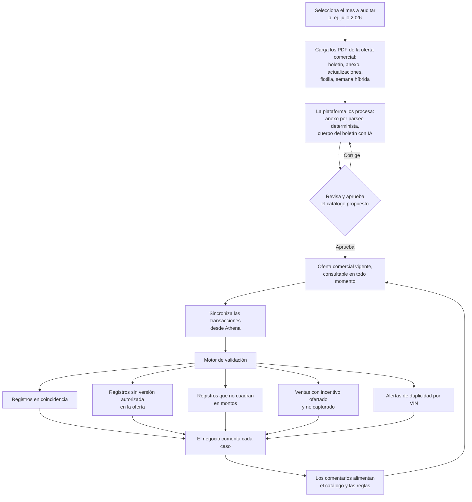
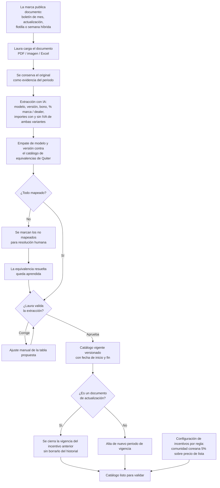
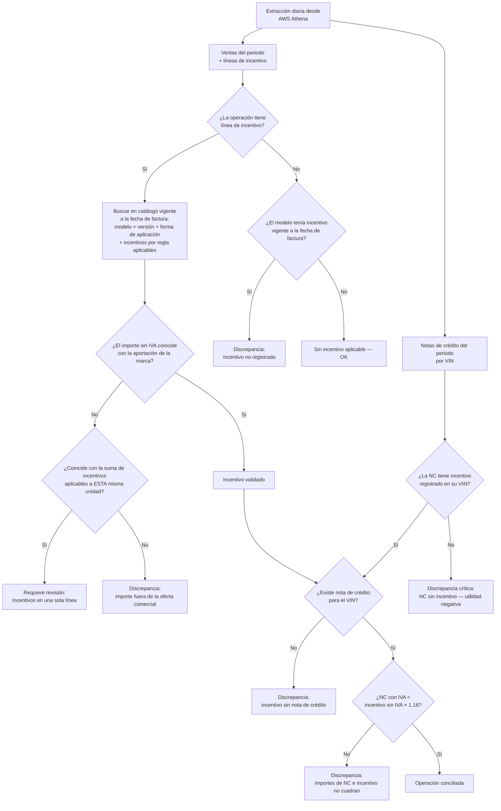
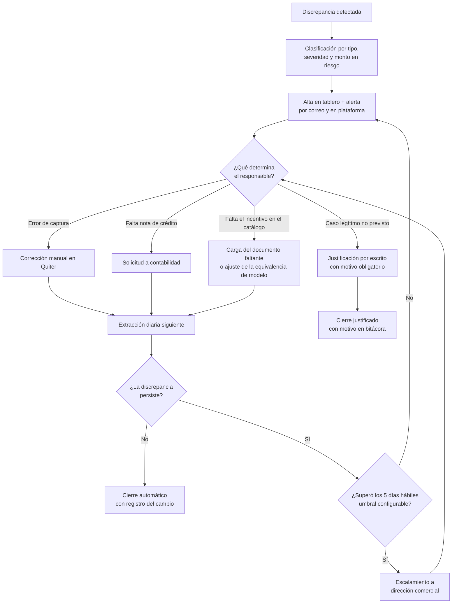

# PRD - Reclamación de Incentivos (Autocom · Hyundai)

| **Campo** | **Detalle** |
| --- | --- |
| **Proyecto** | Reclamación de Incentivos |
| **Área / empresa** | Go Virtual |
| **Versión** | v0.3 |
| **Fecha** | 26 de agosto de 2026 |
| **Autores** | Aldo Álvarez |
| **Revisión / liderazgo** | Laura Hernández Azpeitia (Autocom — solicitante y dueña del proceso) · Aldo Álvarez (Director de TI, Engine) |
| **Tipo de proyecto** | Feature web o API |

## 0. Cambios en esta versión (v0.2)

Entre la v0.1 y esta versión se obtuvo acceso a AWS Athena y se analizaron cuatro insumos reales: la vista consolidada de ventas del grupo, un extracto de las líneas de incentivo de Quiter, y el boletín y anexo de la oferta comercial de julio 2026. Eso convirtió varios supuestos en hechos y desmintió otros.

| **Qué cambió** | **Consecuencia en este PRD** |
| --- | --- |
| **Se confirmó el acceso a Athena y la fuente concreta.** La plataforma leerá de la vista `vw_full_master_view_ventas_nuevos_grupo_autocom` en la base `db-bi-quiterqbi`, que trae VIN, modelo, año, importe de incentivo y bandera de cancelación, con datos al día. | Deja de ser un riesgo bloqueante. §10 sustituye la descripción genérica de Athena por la fuente real, sus bases hermanas y la regla de particiones. |
| **Se probó el motor de validación sobre datos reales.** Contra el anexo de julio 2026: 86% de unidades homologadas y 69% de incentivos cuadrando al peso, con las diferencias restantes explicadas. | Se agrega §7.1 con la evidencia de viabilidad y el piloto acordado. |
| **El anexo se extrae sin IA.** Sus dos tablas se parsean de forma determinista y ya publican la aportación de la marca sin IVA, con consistencia interna verificada en sus 54 renglones. | RF-02 acota el uso de IA al cuerpo del boletín; el anexo pasa a extracción determinista con IA como respaldo. |
| **No existe campo de versión separado del modelo, ni destino del bono.** La columna `version` duplica `modelo`, y no hay dato de si el bono fue a precio, enganche, tasa, accesorios o seguro. | La homologación se vuelve una funcionalidad con interfaz propia (F7 / RF-08). RF-19 se reescribe. §14 lo eleva a pregunta crítica abierta con Autocom. |
| **Los códigos de incentivo son dos, no un catálogo por tipo de operación.** Todo el histórico usa `RE2 INCENTIVOS CASH BONO` y un único `RE1 INCENTIVO SEGURO GRATIS`. | RF-19 ya no puede validar código contra tipo de operación como se había escrito. |
| **El boletín trae proceso, no solo importes.** Calendario de reclamo con fechas duras, registro en Sales Portal a partir de agosto, carga documental en Edifact y nueve categorías de incentivo. | §2 incorpora el proceso de la marca; F19 / RF-23 dejan de escalar por un umbral arbitrario y pasan a colgar del calendario de HMM. |
| **Existen cancelaciones, refacturaciones y unidades revendidas.** Con importes negativos espejo y VINs que reaparecen meses después bajo otra fuente. | Se agregan el neteo de cancelaciones y la detección de duplicidad de VIN (F26, F27 / RF-31, RF-32). |
| **El MVP se vuelve el instrumento de levantamiento.** En lugar de esperar documentación adicional para explicar las diferencias, el MVP las presenta y Laura las explica desde la propia herramienta. | Se agrega el campo de comentarios transversal y el reporte de conformidad (F24, F25 / RF-29, RF-30). |

Los ocho hallazgos técnicos sobre la vista, con su evidencia y las peticiones a Autocom, viven en el documento **Diagnóstico de la vista de ventas nuevos**, anexo a este PRD.

## 0.1 Cambios en la v0.3

Ajustes acordados con la dirección de TI el 26 de agosto de 2026, antes de arrancar la construcción, más el resultado del spike de conexión a Athena.

| **Qué cambió** | **Consecuencia en este PRD** |
| --- | --- |
| **El flujo de trabajo se ordena desde el usuario: primero la oferta, después las transacciones.** Se selecciona el mes a auditar, se cargan los PDF de la oferta comercial, la plataforma los procesa, y solo entonces se consulta Athena. | §7.1 se reescribe en ese orden y la Fase 1 del plan se reordena en consecuencia. |
| **La oferta comercial vigente debe ser consultable en todo momento**, no solo un dato interno del motor. | Se agrega F29 / RF-36: un apartado de consulta del catálogo, navegable por periodo y con acceso al documento original. |
| **Definición de "mes a auditar": las ventas facturadas dentro del mes**, del día 1 al último. | Queda como supuesto explícito en §13. La ventana de "oferta comercial mes previo" que permite HMM se pospone hasta confirmar con la dirección comercial si se usa. |
| **La validación exige catálogo aprobado; la sincronización no.** Se pueden traer y explorar las transacciones en cualquier momento, pero el motor no corre sin una oferta aprobada. | Se agrega RF-37. Evita resultados sin sustento sin estorbar el trabajo de exploración. |
| **La sincronización trae el histórico completo, aunque la interfaz sea por mes.** El spike midió que acotar a un mes escanea 1,008 MB y no acotar nada escanea 1,245 MB: ahorra 19%, no 97%. | RF-09 pasa a refresco completo. La selección de mes es una vista, no un filtro de extracción. |
| **La consulta a Athena tarda de 40 a 50 segundos.** Es tiempo del motor, no del sondeo. | RF-38: la sincronización es asíncrona en tres pasos —lanzar, sondear, materializar—, con avance visible. Una petición HTTP directa no cabe en ese tiempo. |
| **El servicio de IA será OpenAI.** El PRD nunca ató proveedor; se deja constancia de la elección. | §10 nombra el proveedor. El alcance de la IA no cambia: cuerpo del boletín, nunca el anexo ni la validación. |

## 1. Resumen ejecutivo

**Reclamación de Incentivos** es una plataforma web para la agencia Hyundai de Autocom que automatiza el control, la validación y la reclamación de los incentivos —bonos— que la marca otorga por unidad vendida. Sus usuarios directos son la dirección comercial del distribuidor (hoy Laura Hernández), la gerencia operativa de ventas y contabilidad; sus beneficiarios indirectos son los asesores de ventas, cuya comisión depende de que la utilidad por unidad esté bien calculada.

Hoy el proceso es enteramente manual y el distribuidor es **el último de toda la red Hyundai en cobro de incentivos**. La causa no es la complejidad del proceso de la marca —que es sencillo— sino la ausencia de control administrativo: la oferta comercial llega cada mes en un boletín (con anexos y actualizaciones a mitad de mes), la venta se graba en el DMS Quiter capturando a mano el importe del incentivo sin IVA, contabilidad emite por separado una nota de crédito por el importe con IVA, y el único control cruzado es una hoja de Google Drive alimentada por personas. Cada error de captura tiene consecuencia doble: incentivo no recuperado ante la marca y utilidad distorsionada —incluso negativa— que arrastra el cálculo de comisiones de los asesores.

El **MVP** ingiere con IA los boletines de oferta comercial para construir un catálogo de incentivos vigente y versionado, extrae diariamente desde **AWS Athena** las ventas y notas de crédito registradas en Quiter, y valida línea por línea que cada incentivo capturado corresponda a un incentivo realmente ofertado para ese modelo, versión y forma de aplicación —levantando alertas sobre todo lo que no cuadre, en cualquier dirección.

Fuera del MVP quedan el **cálculo de comisiones** de asesores —levantado en la misma sesión, reconocido como un problema mucho mayor y planeado como fase posterior— y cualquier escritura o corrección automática sobre Quiter. La plataforma **detecta y alerta; no corrige**: toda corrección la ejecuta una persona en el sistema origen.

El resultado esperado es eliminar la revisión manual de cierre de mes, recuperar el 100% del incentivo devengado ante la marca, sacar al distribuidor del último lugar de la red en tiempo de cobro y devolver confiabilidad a la utilidad por unidad sobre la que se pagan comisiones.

**Carga del boletín (IA)** → **Catálogo de incentivos vigente** → **Extracción diaria de ventas y notas de crédito desde Athena** → **Validación línea a línea** → **Tablero de discrepancias y alertas** → **Corrección en Quiter y reclamación a la marca**

## 2. Contexto y problema

### Cómo funciona hoy

1. **Oferta comercial.** Al inicio de cada mes la marca publica un boletín que define, por modelo y versión, el **bono flexible**: su monto total, el porcentaje y monto que aporta la marca y el que aporta el dealer. El boletín trae un **anexo con dos listas de importes** —"bono aplicado a reducción de precio" y "bono NO aplicado a reducción de precio"— cuyos montos difieren entre sí. La marca puede emitir **boletines de actualización a mitad de mes** que sustituyen importes ya vigentes, y publica además programas adicionales por la misma vía documental: flotilla y semana híbrida.
2. **Aplicación del bono.** El bono flexible se puede usar de tres maneras: como **descuento directo al precio** (operaciones de contado), como **parte del enganche** o como **reducción de tasa** (operaciones de crédito). El reparto marca/dealer no cambia según la forma de aplicación, pero el importe del anexo sí.
3. **Captura en Quiter.** Al grabar la venta se coloca un **código distinto según sea contado o crédito**, se indica a dónde se aplica el bono, se cambia la cuenta y se captura el **importe sin IVA de la aportación de la marca** —lo que efectivamente se va a recuperar.
4. **Nota de crédito.** Contabilidad emite por separado una nota de crédito por el importe del bono **con IVA**, asociada al VIN de la unidad.
5. **Control.** Una hoja en Google Drive alimentada por la gerencia operativa de ventas concentra factura, referencia, fecha, total, año modelo, cliente, vendedor, modelo, serie, tipo de operación y de venta, precio de lista, bono, destino del bono, porcentajes de aportación y fecha de facturación en el dealer portal; el contador marca "tiene rebate" y "nota emitida".

### El dolor concreto

- **Cobro tardío.** El distribuidor es el último de toda la red en cobro de incentivos, por nulo control administrativo en ventas.
- **Captura humana sin validación.** Nada verifica que el importe capturado en Quiter exista realmente en el boletín vigente. Un importe inventado, desactualizado o mal transcrito pasa sin detección hasta el cierre de mes —si se detecta.
- **Incentivos múltiples capturados en una sola línea.** Cuando una unidad acumula dos o más incentivos, la práctica actual es sumarlos en un solo renglón. Eso impide validar contra el boletín y —si se intentara validar por combinaciones— produciría falsos positivos: una suma puede cuadrar con incentivos que no son compatibles entre sí (por ejemplo, el bono de un Grand i10 sumado al de una Creta en la misma unidad).
- **Utilidades negativas o infladas.** Si se emite la nota de crédito pero no se graba el incentivo, la utilidad ("beneficios" en Quiter) sale **negativa**. Como las comisiones de los asesores se calculan sobre esa utilidad, se pagan mal.
- **Revisión manual de cierre de mes.** Cada mes hay que reconstruir a mano si lo que se va a cobrar es lo correcto, contrastando la hoja de Drive contra el detalle de rebates de contabilidad.
- **Dependencia de un archivo alimentado por humanos**, susceptible de error por definición.

### Por qué ahora

Es un dolor estructural y recurrente que ya tiene consecuencia financiera medible (incentivo no recuperado, comisiones mal pagadas) y que además **bloquea el siguiente proyecto**: sin una utilidad por unidad confiable no se puede automatizar el cálculo de comisiones, que es el segundo dolor levantado y de mayor impacto.

### El proceso de la marca (incorporado en v0.2)

El boletín no solo publica importes: publica el proceso con el que HMM paga. Esto se leyó del cuerpo del boletín SA-40-26 y no estaba capturado en el levantamiento.

**Calendario de reclamo.** La marca fija fechas duras por periodo, y es contra ellas —no contra un umbral genérico de días— que debe medirse si el distribuidor va tarde. Para julio 2026:

| **Hito** | **Fecha límite** |
| --- | --- |
| Reporte retail en Sales Portal | 01 al 31 de julio |
| Casilla "oferta comercial mes previo" | solo unidades con retail del 03 al 05 de agosto, activada al reportar |
| Registro de VINs para reclamo | 06 de agosto |
| Carga de documentos | 13 de agosto |
| Envío del monto aprobado para facturar | 11 de septiembre |
| Facturación de incentivos | 17 de septiembre |

**Cambio de sistema de registro.** A partir de la oferta comercial de agosto de 2026 los incentivos se registran dentro de **Sales Portal**, en su apartado de incentivos, y la documentación se carga en **Edifact**. HMM advierte que se reserva el derecho de pago si el registro no está en tiempo y forma.

**Categorías de incentivo que reconoce la marca.** Las que Edifact clasifica son: ofertas comerciales, demo, flotilla, comerciales de meses previos, clientes VIP, comunidad coreana, bono empleado/proveedor, loyalty bonus y ediciones especiales. Es un catálogo más ancho que el levantado en la v0.1.

**Destinos permitidos del bono.** En contado puede aplicarse a **precio, accesorios o seguro**; en financiamiento —solo bajo Hyundai Finance— a **precio, enganche, tasa o seguro**. Son cinco destinos posibles, no los tres de la v0.1, y explícitamente **no son retroactivos**.

**Boletines de larga vigencia.** El boletín del mes convive con programas activos publicados en boletines anteriores —Flotillas SA-06-24, Demos SA-11-24, Descuentos Especiales SA-03-23— algunos de hace dos años. El catálogo no puede modelarse como "el boletín del mes": necesita vigencias abiertas y convivencia de documentos de distintos periodos.

**Bonos aditivos fuera de tabla.** El propio boletín otorga bonos que no están en el anexo, como el de ediciones N Line para apartados en línea: +$5,000 sobre la oferta vigente. Confirma que los incentivos se acumulan y que el anexo por sí solo no basta.

**Documentos indispensables por operación.** Identificación oficial del cliente y anexo 02 digital firmado, tanto en contado como en financiamiento. Sin ellos no se paga el incentivo, independientemente de que la captura sea correcta.

### Conceptos del dominio que el equipo dev debe distinguir desde el día 1

| Concepto | Definición |
| --- | --- |
| **Bono flexible** | Monto total del incentivo por unidad definido en el boletín. Se reparte entre marca y dealer según un porcentaje declarado. |
| **Aportación de la marca** | La porción del bono flexible que la marca reembolsa. **Es lo único que el distribuidor recupera** y lo que se captura en Quiter, **sin IVA**. |
| **Aportación del dealer** | La porción que absorbe el distribuidor. No se recupera y no se captura como incentivo. |
| **Bono aplicado a reducción de precio** vs. **no aplicado a reducción de precio** | Dos listas de importes distintas dentro del mismo anexo. La primera aplica cuando el bono baja el precio de la unidad; la segunda cuando va a enganche o a reducción de tasa. **El importe correcto depende de cuál de las dos aplica.** |
| **Incentivo por importe** vs. **incentivo por regla** | El del boletín viene como monto cerrado por modelo y versión. El de comunidad coreana es un **5% sobre precio de lista** que la plataforma calcula. Ambos son recuperables y ambos se validan. |
| **Naturaleza del incentivo** | No todo incentivo recuperable es un bono al precio. La semana híbrida puede otorgar bono adicional, **comisión de apertura en cero** o **seguro sin costo**; los tres son recuperables ante la marca y los tres deben validarse. |
| **Incentivo registrado** | El importe capturado a mano en el desglose de la venta en Quiter. Es el dato bajo sospecha. |
| **Incentivo esperado** | El importe que el catálogo vigente a la fecha de factura dicta para ese modelo, versión y forma de aplicación. Es la referencia de validación. |
| **Nota de crédito (NC)** | Documento contable emitido por el importe del bono **con IVA**, asociado al VIN. Es el reflejo contable del incentivo; sin su contraparte registrada, distorsiona la utilidad. |
| **Rebate** | Sinónimo operativo de incentivo recuperable, usado por contabilidad. |
| **VIN** | Identificador único de la unidad al que se asocian venta, incentivo y nota de crédito. Es la llave de cruce de todo el sistema. *(En la sesión de levantamiento se le nombró "BIN".)* |
| **Discrepancia** | Cualquier caso en que el incentivo registrado, la nota de crédito o su ausencia no correspondan con el catálogo vigente. **Por arriba o por abajo: ambos son error.** |

## 3. Objetivo del producto

Dotar a Autocom de una plataforma web que convierta el control de incentivos de un ejercicio manual de cierre de mes en un proceso continuo y verificable: que mantenga como fuente de verdad el catálogo de incentivos vigentes derivado de los boletines de la marca, que lea diariamente desde AWS Athena las ventas y notas de crédito registradas en Quiter, y que señale con precisión —por unidad, por factura y por importe— toda operación cuyo incentivo no corresponda a lo ofertado, esté ausente, o cuya nota de crédito no tenga contraparte.

La mejora esperada es que la dirección comercial deje de reconstruir el control a mano, que ninguna unidad se facture sin su incentivo correctamente registrado y que el distribuidor deje de ser el último de la red en tiempo de cobro de incentivos.

### 3.1 Estrategia de implementación por fases

| **Fase** | **Nombre** | **Descripción** |
| --- | --- | --- |
| Fase 1 | Control y validación de incentivos **(MVP de este PRD)** | Ingesta de boletines con IA, catálogo de incentivos vigente y versionado, extracción diaria de ventas y notas de crédito desde Athena, motor de validación línea a línea, cruce NC ↔ incentivo por VIN, tablero de discrepancias y reporte de cierre de mes. Alcance: agencia Hyundai. |
| Fase 2 | Conciliación contable, seguimiento de recuperación y otras marcas | Cuadre del monto validado contra el detalle de rebates de contabilidad, seguimiento del estatus de cobro ante la marca (facturado en dealer portal, reclamado, cobrado) y extensión del modelo a las demás marcas del grupo. |
| Fase 3 | Cálculo de comisiones de asesores | Motor de compensación variable sobre utilidad confiable: volumen por rangos, share de financiamiento, tomas, seguros, accesorios, garantías y venta perfecta, incluyendo la captura de conceptos que hoy no viven en Quiter. |

El MVP de este PRD es la **Fase 1**. Las fases 2 y 3 se documentan aquí solo para fijar la dirección; su alcance se levantará en PRDs propios.

### 3.2 Hitos habilitantes

Secuencia de dependencias previas al desarrollo. **Sin fechas comprometidas en este PRD**: se calendarizan en planeación conforme se cierre cada hito.

1. **Emisión y socialización de este PRD con Autocom.** Es el entregable que da visibilidad a TI sobre lo que se va a construir y habilita el siguiente hito.
2. **Alta del usuario de solo lectura en AWS Athena.** TI de Autocom lo genera una vez que tenga el PRD. Es la dependencia crítica del proyecto.
3. **Exploración del dataset y mapeo de campos.** Verificar que Athena expone el desglose de la línea de incentivo, el destino del bono, el código y la cuenta contable, y el vínculo de la nota de crédito con el VIN.
4. **Solicitud a contabilidad del histórico de meses previos** (monto devengado vs. recuperado y tiempos de cobro) para establecer la línea base contra la cual medir la efectividad del proyecto.
5. **Recopilación de boletines** vigentes y del periodo, incluidos anexos, actualizaciones intermedias, flotilla y semana híbrida.
6. **Confirmación del catálogo de códigos y cuentas contables** por tipo de operación y destino del bono.
7. **Diseño técnico y estimación.**

## 4. Usuarios y actores

| **Usuario / Actor** | **Rol en el proceso** |
| --- | --- |
| Dirección comercial del distribuidor (Laura Hernández Azpeitia) | Solicitante y dueña del proceso. Carga los boletines, aprueba el catálogo extraído, revisa el tablero de discrepancias, recibe los escalamientos y aprueba el cierre de mes. |
| Gerencia operativa de ventas (Eli) | Alimenta hoy el archivo de control en Drive. Con la plataforma pasa a atender las discrepancias asignadas y a verificar la captura en Quiter. |
| Contabilidad / contador (Guillermo) | Emite las notas de crédito por el importe con IVA y marca "tiene rebate / nota emitida". Consume las alertas de NC sin incentivo e incentivo sin NC, y entrega el detalle de rebates para el cuadre de cierre. |
| Asesores de ventas | No usan la plataforma. Son los afectados: su comisión se calcula sobre la utilidad por unidad, que se distorsiona cuando el incentivo o la NC no se registran bien. |
| TI de Autocom | Otorga y mantiene el usuario de solo lectura sobre AWS Athena y el acceso al dataset con la información de Quiter. Dependencia crítica del MVP. |
| Contraparte de negocio de Autocom (Octavio Flores, Jonathan Soto) | Interlocutores de negocio para resolver reglas, dudas de datos y validaciones durante el desarrollo. |
| Equipo de Compensaciones de Autocom (Rodrigo) | No interviene en el MVP. Es contraparte de la Fase 3 (comisiones). |
| Equipo de desarrollo Engine / Go Virtual (Aldo Álvarez, Juan) | Diseñan, construyen y operan la plataforma; coordinan con TI de Autocom el acceso a los datos. |
| Marca (Hyundai) | Emite los boletines de oferta comercial y sus actualizaciones, y reembolsa la aportación. No es usuaria del sistema. |

## 5. Alcance MVP y funcionalidades

| **Funcionalidad** | **Descripción** |
| --- | --- |
| **F1. Carga de boletines** | Laura sube el boletín del mes, sus anexos, las actualizaciones intermedias y los documentos de flotilla y semana híbrida, en PDF, imagen o Excel. El original se conserva íntegro como evidencia y queda asociado al periodo. |
| **F2. Extracción del boletín con IA** | La plataforma interpreta el documento y propone una tabla estructurada: modelo, versión, año modelo, precio de lista, bono flexible total, % y monto de aportación de la marca, % y monto del dealer, y —por separado— los importes con y sin IVA de las dos variantes del anexo. |
| **F3. Validación humana del catálogo** | La extracción **no se activa sola**. Laura revisa la tabla propuesta contra el boletín, corrige lo que haga falta y la aprueba. Solo entonces pasa a ser catálogo vigente. |
| **F4. Catálogo vigente y versionado** | Cada incentivo lleva fecha de inicio y fin de vigencia. Un boletín de actualización **no borra** el anterior: lo sucede, de modo que una venta se valida siempre contra lo vigente **a su fecha de factura**. El historial completo queda consultable. |
| **F5. Incentivos por regla porcentual** | Configuración de incentivos que no vienen como monto cerrado sino como regla: el descuento de comunidad coreana (**5% sobre precio de lista, recuperable de la marca**, aplicable exista o no oferta comercial en la unidad). La plataforma calcula el importe esperado por unidad. |
| **F6. Incentivos de distinta naturaleza** | El catálogo distingue el tipo de beneficio —bono al precio, bono adicional, comisión de apertura en cero, seguro sin costo, flotilla— y trata a todos como importes recuperables validables, no solo al bono flexible. |
| **F7. Homologación asistida de modelo y versión** | Quiter **no separa versión de modelo**: guarda un solo texto (`GRAND I10 SEDAN GL MID MT`, `TUCSON LIMITED HIBRIDO TA`), mientras el boletín sí los distingue y el importe depende de la versión. La plataforma parte el texto y propone la correspondencia; con reglas automáticas se alcanza el **86%**. Para el resto —nombres largos, erratas de captura como `TUCSONLIMITED TECH AT`, o modelos que no están en el boletín— presenta al usuario **el catálogo de versiones candidatas del periodo vigente para que elija la correcta**, con un **campo de comentarios** para el caso en que ninguna aplique. Cada resolución queda aprendida y se reutiliza en los periodos siguientes. |
| **F8. Extracción diaria de ventas** | Lectura programada desde AWS Athena del reporte de ventas de Quiter: factura, referencia, fecha de factura, cliente, vendedor, modelo, versión, año modelo, serie, VIN, tipo de operación (contado / crédito), destino del bono, código y cuenta del incentivo, e importe registrado sin IVA. |
| **F9. Extracción diaria de notas de crédito** | Lectura programada de las notas de crédito con su VIN, importe con IVA, fecha y estatus de aplicación. |
| **F10. Motor de validación línea a línea** | Por cada línea de incentivo registrada, busca en el catálogo vigente a la fecha de factura una coincidencia por modelo/versión, forma de aplicación del bono e **importe sin IVA de la aportación de la marca**. Si el importe no existe en el catálogo —esté por arriba o por abajo— se levanta discrepancia. |
| **F11. Fallback de captura en una sola línea** | Si una línea no cuadra individualmente, la plataforma prueba si corresponde a la **suma de incentivos aplicables a esa misma unidad**. Si cuadra, no la valida como correcta: la marca como **"requiere revisión — incentivos capturados en una sola línea"**, para que se corrija a la regla de una línea por incentivo. Nunca combina incentivos de modelos distintos. |
| **F12. Barrido de ventas sin incentivo aplicado** | Cruza **el total de ventas del periodo** —no solo las que traen incentivo— contra el catálogo vigente, y aísla las unidades que tenían un incentivo ofertado y se facturaron **sin ninguna línea de incentivo**. Es dinero que la marca **ya liberó y ya autorizó**: al no capturarlo no solo se deja de recuperar, se pierde la posibilidad de haberlo usado para acelerar la venta. El reporte cuantifica el monto no reclamado por unidad, por modelo y en agregado. En la prueba de julio 2026 este barrido aisló 25 operaciones por **$910,550** de aportación de marca no capturada, concentradas en variantes OUTLET. |
| **F13. Cruce de notas de crédito por VIN** | Contrasta en ambos sentidos: nota de crédito sin incentivo registrado en el VIN (causa directa de utilidad negativa) e incentivo registrado sin nota de crédito emitida. |
| **F14. Validación de coherencia de IVA** | Verifica que el importe de la NC (con IVA, tasa 16%) corresponda al importe del incentivo registrado (sin IVA), dentro de una tolerancia de redondeo configurable. |
| **F15. Validación de código y cuenta** | Verifica que el código y la cuenta usados en la captura correspondan al tipo de operación (contado / crédito) y al destino declarado del bono. |
| **F16. Tablero de discrepancias** | Vista operativa con filtros por periodo, modelo, vendedor y tipo de discrepancia, con severidad y monto en riesgo por caso y en agregado. |
| **F17. Ciclo de vida de la discrepancia** | Cada discrepancia se gestiona con estatus (abierta / en revisión / corregida / justificada), responsable asignado y comentario. Una discrepancia justificada exige motivo escrito. |
| **F18. Re-validación y cierre verificado** | En la extracción diaria siguiente, la plataforma reevalúa las discrepancias abiertas y cierra sola las que ya se corrigieron en Quiter, dejando registro del cambio. |
| **F19. Escalamiento por antigüedad y por fecha límite de la marca** | Las discrepancias que superen el umbral configurable —**5 días hábiles por defecto**— escalan a la dirección comercial. Además, la plataforma **anticipa las fechas límite que publica HMM en cada boletín** —registro de VINs, carga de documentos, facturación—, que son las que de verdad determinan si el incentivo se cobra o se pierde. |
| **F20. Reporte de cierre de mes** | Reporte exportable en Excel y PDF con el detalle por VIN del incentivo validado, el total a recuperar de la marca en el periodo y el listado de pendientes, para contrastarlo contra el Excel de rebates de contabilidad. |
| **F21. Alertas** | Correo y notificación dentro de la plataforma ante discrepancias nuevas, escalamientos por antigüedad y fallos o resultados vacíos de la extracción diaria. |
| **F22. Vista consolidada de control** | Sustituye funcionalmente la hoja de Drive: una sola vista con las ventas del periodo, su incentivo, su nota de crédito y su estatus de validación, sin captura manual. |
| **F23. Bitácora de auditoría** | Registro inmutable de quién cargó qué boletín, quién aprobó qué catálogo, qué validó cada corrida y quién resolvió cada discrepancia y con qué motivo. |
| **F24. Reporte de conformidad** | La contraparte del tablero de discrepancias: el detalle de las operaciones que **sí cuadran** con la oferta comercial, por unidad, con el incentivo esperado, el capturado y el documento del catálogo que lo respalda. Es lo que sustenta la reclamación ante la marca y lo que le da a la dirección comercial la medida de qué tan bien está operando el proceso, no solo dónde falla. |
| **F25. Comentario y auditoría sobre cada caso** | Toda transacción que no coincide se presenta identificada y con un **campo de comentarios abierto**, para que el usuario documente la explicación: oferta comercial adicional que no conocíamos, condición especial de la unidad, o error de captura. El MVP **no intenta cuadrar automáticamente estos casos**; los expone para que el negocio los explique. Esos comentarios son el insumo con el que se afinan las reglas después de la revisión con la dirección comercial. |
| **F26. Neteo de cancelaciones y refacturación** | Las cancelaciones aparecen como importe negativo espejo, con la referencia de la operación cancelada y con `ud = −1`. La plataforma netea por unidad antes de validar, de modo que una venta cancelada y refacturada no se reporte como discrepancia ni se contabilice dos veces. Sin este neteo, en el histórico analizado el 10% de las unidades habría generado falsos positivos. |
| **F27. Alerta de duplicidad por VIN** | Detecta unidades que aparecen más de una vez como venta activa —posiblemente en fuentes distintas— y que acumulan más de un incentivo. La plataforma **no decide** si es una reventa legítima o un doble reclamo: levanta la alerta con la explicación de la sospecha y el detalle de ambas operaciones para que el equipo lo resuelva. Se detectaron 9 VINs en esta condición, algunos con dos ventas activas e incentivos distintos con meses de diferencia. |
| **F28. Panel de excepciones de homologación** | Vista dedicada a las unidades cuya versión no se pudo empatar contra el catálogo, con el texto original de Quiter, las versiones candidatas del periodo y el campo de comentarios de F7. Es la lista de trabajo que el usuario resuelve para que el periodo quede completo. |
| **F29. Consulta de la oferta comercial vigente** | Apartado permanente donde cualquier usuario autorizado consulta **qué incentivos están vigentes y con qué importes**, sin tener que abrir el PDF ni depender de quien lo cargó. Navegable por periodo —con el vigente por omisión—, muestra por modelo y versión el bono flexible, el reparto marca/dealer y las dos variantes del anexo con y sin IVA, e incluye el enlace al documento original que lo respalda y la fecha en que se aprobó. Cuando un periodo tiene actualizaciones a mitad de mes, se ve qué cambió y desde cuándo. |
| **F30. Selección del periodo a auditar** | Toda la operación gira alrededor de un selector de mes: define qué catálogo aplica, qué ventas se muestran y sobre qué corre el motor. El periodo indica su estado de un vistazo —si tiene documentos cargados, si el catálogo está aprobado, cuándo fue la última sincronización y si ya se validó—, de modo que el usuario sepa siempre qué le falta para cerrarlo. |

**Principio rector del MVP: la plataforma detecta y alerta; no corrige.** No escribe en Quiter, no emite ni cancela notas de crédito, no ajusta importes y no autoriza excepciones por su cuenta. Toda corrección la ejecuta una persona en el sistema origen, y toda excepción queda justificada por escrito por un humano. La consecuencia de diseño es que un falso negativo (dejar pasar un error) es más grave que un falso positivo: ante la duda, la plataforma levanta la alerta.

Este principio se apoya en un supuesto validado con el negocio: **todo incentivo recuperable está documentado en algún boletín de la marca; no existen incentivos negociados caso por caso.** Por lo tanto, cualquier importe fuera del catálogo vigente es error **o evidencia de un documento que no tenemos**.

**Matiz incorporado en v0.2.** La prueba sobre julio 2026 mostró que la segunda causa es real y frecuente: las diferencias que no cuadraron no eran importes arbitrarios sino montos redondos, idénticos y repetidos —$50,000 en dos Santa Fe, $25,000 en dieciocho Tucson, $10,000 en cinco Grand i10, todos con IVA— que solo se explican por incentivos adicionales sumados en la misma línea y provenientes de documentos fuera del boletín del mes. En cambio los importes irregulares y aislados —un caso de +$2,500 y uno de −$1,000— son los que sí parecen error de captura.

De ahí la decisión de método del MVP: **no se asume documentación faltante ni se intenta cuadrar esos casos por inferencia.** Se presentan identificados, con su diferencia expresada también con IVA (que es como la marca publica sus montos y como el negocio los reconoce), y con el campo de comentarios de F25 para que la dirección comercial declare de qué programa provienen. Cada explicación recibida se convierte en una entrada nueva del catálogo, no en una regla escondida en el código.

## 6. Fuera de alcance

- **Escritura o corrección automática en Quiter**: la plataforma es de solo lectura sobre los datos de origen. Habilitarlo exigiría acceso de escritura al DMS, control de cambios y una discusión de riesgo contable que no corresponde a esta fase.
- **Cálculo de comisiones de asesores**: se levantó en la misma sesión y se reconoció como un problema mucho mayor —variables casi infinitas, información dispersa fuera de Quiter, plantilla de vendedores, conceptos manuales—. Es la Fase 3 y requiere su propio PRD. Se habilita cuando la utilidad por unidad sea confiable, que es precisamente lo que entrega este MVP.
- **Corregir el cálculo de utilidad de Quiter**: hoy Quiter no está restando las notas de crédito y por eso infla la utilidad. Es un defecto del DMS, ajeno a nuestro control; la plataforma lo evidencia pero no lo repara. Se excluye hasta que el proveedor lo resuelva o Autocom decida calcular la utilidad fuera de Quiter.
- **Carga manual del export de Quiter en Excel**: se evaluó como alternativa y se descartó. **El MVP se construye exclusivamente sobre el acceso a AWS Athena**; no hay vía alterna de ingesta de ventas.
- **Emisión, cancelación o timbrado de notas de crédito**: sigue siendo responsabilidad de contabilidad en su sistema.
- **Gestión del cobro formal ante la marca (dealer portal)**: el MVP determina *cuánto* se debe recuperar y *por qué unidad*; la reclamación y el seguimiento del cobro son Fase 2.
- **Cuadre automático contra el detalle de rebates de contabilidad**: contabilidad entrega su detalle en un Excel manual, así que el contraste se hace fuera de la plataforma a partir del reporte exportado. Se automatizaría en Fase 2 si ese detalle llegara a vivir en Athena.
- **Otras marcas del grupo**: el MVP cubre la agencia Hyundai, que es la única del grupo para esta marca. El modelo de datos se diseña extensible, pero modelar los esquemas de incentivo de otras marcas es Fase 2.
- **Reconstrucción de periodos históricos**: la plataforma opera solo hacia adelante desde su puesta en marcha. El histórico de contabilidad se solicita únicamente para establecer la línea base de las métricas, no para reclamar incentivos vencidos.

## 7. Flujos principales

### 7.0 El recorrido del usuario, de principio a fin

El orden importa: **primero existe la oferta contra la cual auditar, después se traen las transacciones.** Todo cuelga de un periodo seleccionado.

**Dos reglas de este recorrido:**

- **La sincronización no espera al catálogo, la validación sí.** Las transacciones de un periodo se pueden traer y explorar en cualquier momento; el motor no corre hasta que ese periodo tenga una oferta aprobada (RF-37). Así nadie toma por bueno un resultado sin sustento, pero tampoco se estorba el trabajo de exploración.
- **El periodo se define por fecha de factura**, del día 1 al último del mes. La ventana de "oferta comercial mes previo" que permite HMM —unidades con fecha retail de los primeros días del mes siguiente— se pospone hasta confirmar con la dirección comercial si realmente se utiliza.

### 7.1 Ingesta y vigencia del catálogo de incentivos

El punto crítico de este flujo es que **la IA propone y la persona dispone**. El boletín llega en formatos heterogéneos —a veces como imagen— y un error de extracción se propagaría a todas las validaciones del mes, convirtiendo la herramienta en una fuente de falsos positivos masivos. Por eso la aprobación humana es un paso obligatorio y no una opción de configuración.

El segundo punto es el **versionado por vigencia**. La marca actualiza importes a mitad de mes —como ocurrió con el Tucson, cuyo bono pasó de 75,000 a 100,000 con aportación de marca de 75,000—, y una venta debe validarse contra lo que estaba vigente **el día que se facturó**, no contra lo último cargado. Sobrescribir el catálogo generaría discrepancias falsas en todas las ventas de la primera quincena.

El tercero es el **catálogo de equivalencias**. El boletín nombra los modelos en texto comercial y Quiter los identifica con su propia nomenclatura; sin una tabla que los empate, el motor no puede comparar nada. Se diseña como estructura mantenible y con aprendizaje incremental: lo que un humano resuelve una vez no se vuelve a preguntar.

### 7.2 Validación de ventas y notas de crédito

La validación se ancla siempre en el **importe sin IVA de la aportación de la marca**, porque es el único dato que se captura en Quiter y el único que el distribuidor recupera. La comparación se hace contra el catálogo, no contra un cálculo propio —salvo en los incentivos por regla, como el 5% de comunidad coreana, donde el importe esperado sí se computa sobre el precio de lista. Si un importe no corresponde a ningún incentivo vigente, es discrepancia, esté por arriba o por abajo del esperado.

El fallback de combinación merece explicación aparte. Se acordó como **regla operativa** que cada incentivo se capture en su propia línea; sin embargo, la práctica previa de sumarlos en un renglón existe y no desaparecerá el primer mes. El fallback existe para **reconocer ese patrón, no para bendecirlo**: cuando la suma cuadra, el caso se marca como pendiente de corrección, no como válido. Y la combinación se restringe a incentivos aplicables a la misma unidad, precisamente para no producir el falso positivo detectado en el levantamiento —una suma que cuadra numéricamente pero mezcla bonos de modelos que jamás podrían coexistir.

La rama de notas de crédito es la que atiende el daño financiero más visible: una NC sin incentivo registrado deja la utilidad de la unidad en negativo y contamina el cálculo de comisiones. Por eso se clasifica como discrepancia crítica.

### 7.3 Atención de discrepancias y escalamiento

Este flujo es transversal a todos los tipos de discrepancia y encarna el principio rector: la plataforma nunca cierra un caso por decisión propia salvo cuando **verifica en la fuente** que el dato ya se corrigió. El cierre por justificación siempre exige un humano y un motivo escrito, porque cada excepción justificada es información valiosa —si un mismo motivo se repite, probablemente falta modelar una regla o una equivalencia en el catálogo.

La extracción diaria es lo que hace viable este ciclo: el error se detecta cerca del momento de la captura, cuando todavía es barato corregirlo, en lugar de acumularse hasta el cierre de mes.

## 7.1 Evidencia de viabilidad y piloto acordado

Antes de comprometer el desarrollo se construyó un prototipo del motor de validación y se corrió contra datos reales: las ventas de julio 2026 de la agencia Hyundai contra el boletín y anexo SA-40-26 de ese mismo mes. Es el único periodo del que se tiene simultáneamente el dato y su documento de respaldo, y por eso es el piloto acordado.

### Resultado

| **Medida** | **Resultado** |
| --- | --- |
| Operaciones del periodo | 131 |
| Unidades homologadas contra el anexo | 113 (**86%**) |
| Operaciones evaluables (con incentivo capturado) | 81 |
| Incentivos que cuadran a ±1 peso | 56 (**69%**) |
| Diferencias por explicar | 25 |
| Ventas con incentivo ofertado y no capturado | 25, por **$910,550** de aportación de marca |

### Cómo se leen las diferencias

Las 25 diferencias no son ruido estadístico. Al expresarlas con IVA se agrupan en montos redondos y repetidos:

| **Diferencia (con IVA)** | **Casos** | **Modelo** |
| --- | --- | --- |
| +$50,000 | 2 | Santa Fe HEV Limited Tech |
| +$25,000 | 18 | Tucson (GLS, Limited, Limited Tech, Híbrido) |
| +$10,000 | 5 | Grand i10 Sedán |
| +$2,500 | 1 | Grand i10 Sedán GL MID AT |
| −$1,000 | 1 | Grand i10 Sedán GL MT |

Los tres primeros grupos son incentivos adicionales sumados en la misma línea, provenientes de programas cuyo documento no está en el catálogo. Los dos últimos —montos irregulares, un caso cada uno— son los candidatos reales a error de captura. **Esa distinción es justamente el valor del producto:** separar los 20 casos que solo necesitan un documento de los 2 que necesitan una corrección.

### Alcance del piloto

El MVP se construye como **primera entrega de la Fase 1** —no como prototipo desechable— y se valida sobre **julio 2026**. Se presenta a la dirección comercial con las coincidencias (F24), las diferencias con su campo de comentarios (F25), las versiones no homologadas (F28) y el barrido de ventas sin incentivo (F12). La retroalimentación que se reciba ahí es lo que determina las reglas y las entradas de catálogo que faltan, sin necesidad de suponer de antemano qué documentación falta.

## 8. Requerimientos funcionales

| **ID** | **Requerimiento** | **Descripción** |
| --- | --- | --- |
| RF-01 | Carga de documentos de oferta comercial | Permitir subir boletines, anexos, actualizaciones intermedias y documentos de flotilla y semana híbrida en PDF, imagen o Excel, asociándolos a un periodo, y conservar el archivo original como evidencia consultable. |
| RF-02 | Extracción asistida por IA | Interpretar el documento cargado y proponer una tabla estructurada con modelo, versión, año modelo, precio de lista, bono flexible total, y % y monto de aportación de marca y de dealer. **Acotado en v0.2:** el anexo se extrae de forma determinista (RF-35), y la IA se reserva para el **cuerpo del boletín** —reglas de acumulación, bonos aditivos, destinos permitidos del bono, programas vigentes de boletines anteriores y fechas del calendario de reclamo— y como respaldo cuando el anexo llegue en imagen o con un formato que el parseo no reconozca. |
| RF-03 | Doble variante de importe | Registrar por separado, para cada incentivo, los importes con y sin IVA de las variantes "bono aplicado a reducción de precio" y "bono no aplicado a reducción de precio". |
| RF-04 | Aprobación humana obligatoria | Impedir que una extracción de IA pase a catálogo vigente sin revisión y aprobación explícita de un usuario autorizado, permitiendo corregir cualquier valor antes de aprobar. |
| RF-05 | Versionado por vigencia | Mantener cada incentivo con fecha de inicio y fin de vigencia; un documento de actualización cierra la vigencia del anterior sin eliminarlo, preservando el historial completo. |
| RF-06 | Incentivos por regla porcentual | Permitir configurar incentivos calculados, no capturados: el 5% de comunidad coreana sobre precio de lista, recuperable de la marca y aplicable exista o no oferta comercial para la unidad. |
| RF-07 | Tipos de incentivo por naturaleza | Modelar el tipo de beneficio (bono al precio, bono adicional, comisión de apertura en cero, seguro sin costo, flotilla) y tratar a todos como importes recuperables sujetos a validación. |
| RF-08 | Homologación asistida de modelo y versión | Derivar modelo y versión del texto único que entrega Quiter, proponer la correspondencia contra el catálogo vigente y, cuando no se resuelva automáticamente, **presentar al usuario la lista de versiones candidatas del periodo para que seleccione la correcta**, con campo de comentarios obligatorio cuando ninguna aplique. Persistir cada resolución y reutilizarla en periodos posteriores. |
| RF-09 | Extracción de ventas — refresco completo | Obtener de AWS Athena la vista consolidada de ventas nuevos con factura, referencia, fecha de factura, cliente, vendedor, modelo, año modelo, VIN, tipo de operación, financiera, bandera de cancelación, contador de unidad e importe de incentivo registrado sin IVA. **Refresco completo del histórico de la marca en una sola consulta, no extracción incremental por periodo:** el spike midió que acotar a un mes escanea 1,008 MB y no acotar nada escanea 1,245 MB, de modo que traer todo cuesta prácticamente lo mismo y elimina la posibilidad de huecos entre corridas. La **versión** se deriva conforme a RF-08 y el **destino del bono** queda pendiente de que Autocom confirme si existe en origen (§14). |
| RF-10 | Extracción diaria de notas de crédito | Obtener de AWS Athena las notas de crédito con VIN, importe con IVA, fecha y estatus de aplicación. |
| RF-11 | Validación de importe contra catálogo | Validar cada línea de incentivo buscando en el catálogo vigente **a la fecha de factura** una coincidencia por modelo/versión, forma de aplicación e importe sin IVA de la aportación de la marca, incluyendo los incentivos por regla aplicables a la unidad. |
| RF-12 | Discrepancia bidireccional | Levantar discrepancia cuando el importe registrado no corresponda a ningún incentivo vigente, tanto si es superior como si es inferior al esperado. |
| RF-13 | Fallback de combinación acotado | Cuando una línea no cuadre individualmente, evaluar si corresponde a la suma de incentivos aplicables a esa misma unidad; de cuadrar, marcarla como "requiere revisión — captura en una sola línea", nunca como válida. |
| RF-14 | Prohibición de combinación entre unidades | Impedir que el fallback combine incentivos de modelos o versiones distintas a la unidad evaluada. |
| RF-15 | Barrido de ventas sin incentivo aplicado | Evaluar **la totalidad de las ventas del periodo**, no solo las que traen línea de incentivo, e identificar las unidades con incentivo vigente a su fecha de factura que se facturaron sin capturarlo. Cuantificar el monto de aportación de marca no reclamado por unidad, por modelo y en agregado, y exponerlo como reporte propio. |
| RF-16 | Cruce NC → incentivo | Detectar notas de crédito cuyo VIN no tenga incentivo registrado, clasificándolas como discrepancia crítica por su impacto directo en la utilidad. |
| RF-17 | Cruce incentivo → NC | Detectar incentivos registrados cuyo VIN no tenga nota de crédito emitida. |
| RF-18 | Coherencia de IVA | Verificar que el importe de la NC (con IVA, tasa 16%) corresponda al importe del incentivo registrado (sin IVA), dentro de una tolerancia de redondeo configurable. |
| RF-19 | Validación de código de concepto | Verificar que la línea use un código de concepto de incentivo reconocido y que su naturaleza corresponda al tipo de incentivo esperado. **Reescrito en v0.2:** el histórico completo emplea únicamente `RE2 INCENTIVOS CASH BONO` y un caso de `RE1 INCENTIVO SEGURO GRATIS`, ambos a la misma cuenta, de modo que **no existe un catálogo de códigos por tipo de operación ni por destino del bono contra el cual validar**, como suponía la v0.1. El requerimiento queda acotado a lo verificable hoy y se ampliará si Autocom confirma que Quiter guarda el destino del bono (ver §14). |
| RF-20 | Tablero de discrepancias | Presentar las discrepancias con filtros por periodo, modelo, vendedor y tipo, mostrando severidad y monto en riesgo por caso y en agregado. |
| RF-21 | Gestión de la discrepancia | Permitir asignar responsable, cambiar estatus (abierta / en revisión / corregida / justificada) y registrar comentarios; exigir motivo obligatorio para justificar un cierre. |
| RF-22 | Re-validación y cierre verificado | Reevaluar en cada corrida diaria las discrepancias abiertas y cerrarlas automáticamente solo cuando se verifique en la fuente que el dato fue corregido, dejando registro del cambio. |
| RF-23 | Escalamiento por antigüedad y por fecha límite | Escalar a la dirección comercial las discrepancias que superen un umbral configurable de días sin resolver —**5 días hábiles** por defecto— y, además, **anticipar el vencimiento de las fechas del calendario de HMM** (RF-34), que son las que realmente determinan si el incentivo se cobra o se pierde. |
| RF-24 | Reporte de cierre de mes | Generar un reporte exportable en Excel y PDF con el detalle por VIN del incentivo validado, el total a recuperar de la marca en el periodo y el listado de pendientes, apto para contrastarse contra el Excel de rebates de contabilidad. |
| RF-25 | Vista consolidada de control | Ofrecer una vista única de las ventas del periodo con su incentivo, su nota de crédito y su estatus de validación, que sustituya funcionalmente la hoja de control manual. |
| RF-26 | Alertas | Notificar por correo y dentro de la plataforma ante discrepancias nuevas, discrepancias escaladas por antigüedad y fallos o resultados vacíos de la extracción diaria. |
| RF-27 | Bitácora de auditoría | Registrar de forma inmutable quién cargó cada documento, quién aprobó cada catálogo, qué evaluó cada corrida de validación y quién resolvió cada discrepancia con qué motivo. |
| RF-28 | Consulta del histórico | Permitir consultar periodos cerrados con su catálogo, sus validaciones y sus discrepancias tal como estaban al momento del cierre. |
| RF-29 | Reporte de conformidad | Presentar y exportar el detalle de las operaciones cuyo incentivo **sí corresponde** al catálogo vigente, con incentivo esperado, incentivo capturado y referencia al documento que lo respalda, como sustento de la reclamación ante la marca. |
| RF-30 | Comentario sobre transacciones no coincidentes | Permitir registrar un comentario libre sobre cada caso que no cuadra, atribuible a un usuario y con sello de tiempo, sin exigir que se cierre ni se justifique. Los comentarios deben poder exportarse y consultarse en conjunto para alimentar el ajuste posterior de reglas y catálogo. |
| RF-31 | Neteo de cancelaciones y refacturación | Reconocer las líneas de cancelación por su bandera, su importe negativo espejo, su contador de unidad negativo y su referencia a la operación original, y netearlas por unidad antes de validar, de modo que una venta cancelada y refacturada no genere discrepancia ni doble conteo. |
| RF-32 | Alerta de duplicidad por VIN | Identificar VINs con más de una operación de venta activa que acumulen más de un incentivo, presentar ambas operaciones lado a lado con la explicación de la sospecha, y **no resolverlas automáticamente en ningún sentido**. |
| RF-33 | Expresión de la diferencia con IVA | Mostrar toda diferencia detectada tanto sin IVA —como se captura en Quiter— como con IVA —como la publica la marca y como la reconoce el negocio—, para que el usuario identifique de inmediato si corresponde a un programa conocido. |
| RF-34 | Alertas ancladas al calendario de la marca | Derivar los avisos de las fechas límite publicadas por HMM en cada boletín —registro de VINs, carga de documentos, envío de monto aprobado y facturación— en lugar de un umbral genérico de días. |
| RF-35 | Extracción determinista del anexo | Extraer las dos tablas de importes del anexo mediante parseo estructurado del documento, sin depender de IA, y verificar su consistencia interna comprobando que la aportación sin IVA corresponda a la aportación con IVA dividida entre 1.16, con tolerancia de redondeo de un peso. |
| RF-36 | Consulta de la oferta comercial vigente | Ofrecer un apartado permanente de consulta del catálogo, navegable por periodo y con el vigente por omisión, que muestre por modelo y versión el bono flexible, el reparto marca/dealer, las dos variantes del anexo con y sin IVA, el enlace al documento original y la fecha de aprobación. Cuando el periodo tenga actualizaciones, señalar qué cambió y desde cuándo. |
| RF-37 | Catálogo aprobado como requisito de validación | Permitir sincronizar y explorar las transacciones de un periodo en cualquier momento, e impedir que el motor de validación se ejecute mientras ese periodo no tenga un catálogo aprobado, indicando con claridad qué falta para poder correrlo. |
| RF-38 | Sincronización asíncrona | Ejecutar la extracción desde Athena en tres pasos —lanzar la consulta y persistir su identificador, sondear el avance, y materializar los resultados al terminar—, exponiendo el progreso en la interfaz. El spike de T-05 midió entre 40 y 50 segundos por consulta, tiempo que no cabe en una petición HTTP síncrona. |
| RF-39 | Selección del periodo a auditar | Ofrecer un selector de periodo que gobierne toda la operación —catálogo aplicable, ventas mostradas y alcance del motor— y que exponga el estado del periodo: documentos cargados, catálogo aprobado, fecha de última sincronización y si ya fue validado. El periodo se define por **fecha de factura**, del día 1 al último del mes. |

## 9. Requerimientos no funcionales

| **ID** | **Requerimiento** | **Descripción** |
| --- | --- | --- |
| RNF-01 | Disponibilidad | La plataforma debe estar disponible en horario operativo del distribuidor. No requiere 24/7; la extracción diaria corre fuera del horario pico de operación. |
| RNF-02 | Solo lectura sobre el origen | El usuario de AWS Athena debe ser estrictamente de solo lectura y de mínimo privilegio, limitado a las tablas o vistas necesarias. La plataforma no escribe en Athena ni en Quiter bajo ninguna circunstancia. |
| RNF-03 | Control de accesos por rol | Perfiles diferenciados: quien carga y aprueba catálogos, quien atiende discrepancias y quien solo consulta. La aprobación de catálogo y la justificación de discrepancias quedan restringidas a perfiles autorizados. |
| RNF-04 | Trazabilidad y auditabilidad | Toda validación debe ser reconstruible: qué versión del catálogo se usó, qué corrida la produjo, qué dato de origen se leyó y qué persona intervino. Los registros de auditoría no son editables ni borrables. |
| RNF-05 | Manejo de errores de extracción de IA | Una extracción incompleta o de baja confianza debe señalarse al usuario campo por campo y nunca activarse por defecto. Si el documento no se puede interpretar, se reporta como fallo y el catálogo previo permanece vigente. |
| RNF-06 | Consistencia e idempotencia | Reprocesar un periodo no debe duplicar ventas, notas de crédito ni discrepancias. Las corridas deben poder repetirse con resultado equivalente sobre los mismos datos de origen. |
| RNF-07 | Consistencia de datos | La validación opera sobre el corte diario, no en tiempo real. Cada vista debe indicar con claridad la fecha y hora del último corte para que el usuario no interprete datos viejos como actuales. |
| RNF-08 | Observabilidad | Registro de cada corrida con duración, volumen leído, resultados y errores; alerta activa cuando la extracción falle, se retrase o devuelva un volumen anómalamente bajo respecto al histórico. |
| RNF-09 | Privacidad | Los datos de clientes se limitan al mínimo necesario para identificar la operación. No se exponen datos personales más allá de lo requerido y el acceso queda restringido por rol. |
| RNF-10 | Seguridad de la información | Credenciales y secretos gestionados fuera del código; cifrado en tránsito y en reposo. Los boletines almacenados quedan protegidos por ser información comercial sensible de la marca. |
| RNF-11 | Extensibilidad multimarca | El modelo de datos debe llevar dimensión de marca y agencia desde el inicio para no rehacerlo al incorporar otras marcas del grupo en Fase 2, aunque el MVP opere con una sola. |
| RNF-12 | Mantenibilidad ante cambios de formato | La extracción de boletines y el catálogo de equivalencias deben tolerar variaciones de formato y de nomenclatura de la marca sin exigir redespliegue: los ajustes se resuelven por configuración o por corrección manual. |
| RNF-13 | Costos acotados | El consumo de IA se limita al procesamiento de documentos de oferta comercial (volumen bajo y previsible); el motor de validación es determinista y no consume IA por transacción. Las consultas a Athena deben acotarse por partición y por rango de fechas, dado que su costo depende del volumen de datos escaneado. |
| RNF-14 | Experiencia de usuario | La revisión de cierre de mes debe resolverse desde una sola vista, sin exportar a hojas de cálculo intermedias. La meta de tiempo se define con la dirección comercial una vez medida la línea base. |
| RNF-15 | Retención | El histórico de boletines, catálogos, validaciones, reportes de cierre y bitácora se conserva **5 años**, conforme al criterio fiscal aplicable en México. |

## 10. Integraciones y datos

| **Integración / Fuente** | **Uso esperado** |
| --- | --- |
| **AWS Athena — vista `vw_full_master_view_ventas_nuevos_grupo_autocom`** (base `db-bi-quiterqbi`) | **Fuente principal y confirmada.** Vista consolidada que Autocom mantiene sobre múltiples tablas de Quiter. Entrega, por operación: `vin`, `modelo`, `anio_vehiculo`, `fec_factura`, `num_factura`, `referencia`, `bandera_cancelacion`, `ud`, `des_tipo_venta_destino`, `des_codigo_financiera` e `imp_concepto_tot_incentivos`. Acceso de solo lectura ya operativo. Cobertura verificada de enero 2024 a la fecha. |
| **AWS Athena — `ftvenbi_pr`** (bases `db-qbi-kor` y `db-bi-quiterqbi-kor`) | Tabla base con el **desglose por concepto** de cada operación: `cod_concepto`, `desc_concepto`, `cta_concepto`, `imp_concepto`. Se usa cuando se requiera el detalle línea a línea que la vista entrega ya sumado. **Regla obligatoria:** `db-bi-quiterqbi-kor` escribe un snapshot completo de toda la historia en cada partición diaria, por lo que **toda consulta debe fijar una sola partición** (`year_`/`month_`/`day_`); omitirlo multiplica cada importe por el número de días cargados. Esa base está además congelada en octubre de 2025 y solo sirve como archivo histórico. |
| Quiter (DMS) | Sistema de origen del dato. **Sin integración directa**: se lee a través de Athena y nunca se escribe en él. Las correcciones las ejecutan las personas directamente en Quiter. |
| **Servicio de IA — OpenAI** (LLM multimodal) | Interpretación del **cuerpo del boletín**: bonos aditivos fuera de tabla, destinos permitidos del bono, programas vigentes de boletines anteriores y calendario de reclamo. También respaldo cuando el anexo llegue como imagen o con un formato que el parseo no reconozca. **No interviene en el anexo** —que se extrae de forma determinista (RF-35)— **ni en la validación transaccional.** El proveedor no está atado al producto: sustituirlo solo toca el módulo de extracción documental. |
| Almacenamiento de documentos | Resguardo de los boletines originales y de los reportes de cierre generados, como evidencia auditable durante 5 años. |
| Servicio de correo | Envío de alertas de discrepancias nuevas, escalamientos por antigüedad y fallos de extracción, complementado con notificación dentro de la plataforma. |
| Contabilidad (Excel de rebates) | **Insumo manual, no integración.** El reporte de cierre se exporta para contrastarse fuera de la plataforma contra el detalle que entrega contabilidad. |
| Dealer portal de Hyundai | **Fuera del MVP.** Referenciado porque ahí se registra la facturación ante la marca; su integración se evalúa en Fase 2 (seguimiento de cobro). |

### Datos mínimos requeridos para operar el MVP

**Catálogo de incentivos (derivado del documento):** marca, periodo y vigencia (inicio / fin), origen (boletín inicial, actualización, flotilla, semana híbrida), tipo de incentivo por naturaleza, modalidad (importe fijo o regla porcentual), modelo, versión, año modelo, precio de lista, bono flexible total, % de aportación de la marca, monto de aportación de la marca con IVA, **monto de aportación de la marca sin IVA**, % y monto de aportación del dealer, variante del anexo (aplicado / no aplicado a reducción de precio) y referencia al documento original.

**Incentivos por regla:** nombre del programa, base de cálculo (precio de lista), porcentaje, aportante (marca), condiciones de aplicabilidad, acumulabilidad con la oferta comercial y vigencia.

**Equivalencias de modelo y versión:** nomenclatura del boletín, nomenclatura de Quiter, año modelo, estatus del mapeo y usuario que lo resolvió.

**Venta (origen: Athena):** número y fecha de factura, referencia, cliente, vendedor, modelo, año modelo, **VIN**, tipo de operación (contado / crédito), institución financiera cuando aplique, bandera de cancelación, contador de unidad, precio de lista y total de la factura.

> **Disponibilidad verificada en v0.2.** Todo lo anterior está en la vista salvo dos campos: la **versión** —que Quiter no separa del modelo y que la plataforma deriva mediante RF-08— y el **destino del bono** (precio / enganche / tasa / accesorios / seguro), que **no existe en la fuente** y del que depende elegir cuál de las dos tablas del anexo aplica. Mientras no se resuelva con Autocom, el motor da por válida la coincidencia con cualquiera de las dos variantes, lo que deja pasar el subconjunto de errores en que el importe capturado corresponde a la variante equivocada.

**Línea de incentivo registrada (origen: Athena):** VIN, factura, código de concepto, descripción del concepto, cuenta contable e **importe sin IVA**. Verificado que cada operación tiene **una sola línea de incentivo**, por lo que el total que entrega la vista equivale al detalle. Los códigos observados en todo el histórico son `RE2 INCENTIVOS CASH BONO` y `RE1 INCENTIVO SEGURO GRATIS`.

**Regla de correspondencia de importes.** El anexo publica la aportación de la marca con y sin IVA; Quiter captura la versión **sin IVA redondeada a pesos enteros**. La validación compara contra el valor sin IVA del anexo con **tolerancia de ±1 peso**, criterio verificado contra los 54 renglones del anexo de julio 2026 y contra los importes reales capturados.

**Nota de crédito (origen: Athena):** folio, VIN, fecha, **importe con IVA** y estatus de aplicación.

**Resultado de validación (generado):** identificador de corrida, VIN, factura, incentivo esperado, incentivo registrado, diferencia, tipo de discrepancia, severidad, monto en riesgo, estatus, responsable, motivo de cierre y sellos de tiempo.

### Esquema de permisos

**Lectura:** la plataforma lee de AWS Athena el reporte de ventas, su desglose de incentivos y las notas de crédito, mediante un usuario de solo lectura y mínimo privilegio provisto por TI de Autocom, limitado a las tablas o vistas acordadas.

**Escritura:** la plataforma escribe **exclusivamente en su propia base de datos** —catálogo de incentivos, equivalencias, resultados de validación, discrepancias, bitácora y documentos cargados—. No escribe en Athena, no escribe en Quiter y no genera documentos contables.

**Bloqueado sin validación humana:** la activación de un catálogo extraído por IA, la resolución de una equivalencia de modelo no mapeada y el cierre de una discrepancia por justificación. Ninguna de las tres puede ejecutarse de forma automática. El único cierre automático permitido es el que se produce tras **verificar en la fuente** que el dato ya fue corregido.

## 11. Eventos para BI

**Eventos de catálogo**

- `documento_oferta_cargado`: se registra cuando un usuario sube un documento de oferta comercial, con su tipo (boletín, actualización, flotilla, semana híbrida).
- `extraccion_documento_completada`: se registra cuando la IA termina de interpretar el documento, con el número de incentivos propuestos.
- `extraccion_documento_fallida`: se registra cuando el documento no pudo interpretarse.
- `equivalencia_modelo_pendiente`: se registra cuando un modelo o versión del boletín no logra mapearse a la nomenclatura de Quiter.
- `equivalencia_modelo_resuelta`: se registra cuando una persona resuelve el mapeo.
- `catalogo_aprobado`: se registra cuando un usuario autorizado activa el catálogo, con el número de valores corregidos manualmente antes de aprobar.
- `vigencia_cerrada_por_actualizacion`: se registra cuando un documento de actualización sucede a un incentivo previo.

**Eventos de extracción**

- `extraccion_ejecutada`: se registra al terminar la corrida diaria, con volumen de ventas y notas de crédito leídas y duración.
- `extraccion_fallida`: se registra cuando la corrida falla o devuelve un volumen anómalo.

**Eventos de validación**

- `venta_validada`: se registra cuando una línea de incentivo coincide con el catálogo vigente.
- `incentivo_no_registrado`: se registra cuando una operación con incentivo vigente se facturó sin línea de incentivo.
- `importe_fuera_de_oferta`: se registra cuando el importe capturado no corresponde a ningún incentivo vigente, indicando si está por arriba o por abajo.
- `captura_linea_unica_detectada`: se registra cuando el importe corresponde a la suma de incentivos de la misma unidad capturados en un solo renglón.
- `nota_credito_sin_incentivo`: se registra cuando una NC no tiene incentivo registrado en su VIN.
- `incentivo_sin_nota_credito`: se registra cuando un incentivo validado no tiene NC emitida.
- `iva_inconsistente`: se registra cuando el importe de la NC no corresponde al del incentivo más IVA.
- `codigo_cuenta_incorrecto`: se registra cuando el código o la cuenta no corresponden al tipo de operación.

**Eventos de seguimiento**

- `discrepancia_asignada`: se registra al asignar responsable.
- `discrepancia_escalada`: se registra al superar el umbral de días sin resolver.
- `discrepancia_cerrada_por_correccion`: se registra cuando la re-validación verifica en la fuente que el dato se corrigió.
- `discrepancia_cerrada_por_justificacion`: se registra cuando un humano la justifica, con el motivo.
- `cierre_mes_generado`: se registra al emitir el reporte de cierre, con el monto total a recuperar y el número de pendientes.

**Campos mínimos por evento:** fecha y hora, usuario (o `sistema` cuando el evento es automático), marca, periodo, identificadores de negocio disponibles (VIN, factura, modelo, vendedor), identificador de corrida y de versión de catálogo, importes involucrados (esperado, registrado, diferencia), resultado y motivo cuando aplique.

## 12. Métricas de éxito

| **Métrica** | **Descripción** |
| --- | --- |
| Monto de incentivo recuperado vs. devengado | Porcentaje del incentivo validado por la plataforma que efectivamente se recupera de la marca en el periodo. Es la métrica cabeza del proyecto. |
| Posición del distribuidor en la red por tiempo de cobro | Línea base explícita: **último lugar de toda la red**. Meta de mejora por definir con la dirección comercial. |
| Tasa de captura correcta al primer intento | Porcentaje de líneas de incentivo que validan sin discrepancia en la primera corrida. Mide la mejora en la disciplina de captura. |
| Volumen y tendencia de discrepancias por tipo | Número de discrepancias abiertas por periodo, desglosado por tipo. Se espera una caída sostenida conforme se adopta la regla de una línea por incentivo. |
| Unidades con utilidad afectada por incentivo o NC mal registrados | Número de unidades con nota de crédito sin incentivo o incentivo sin nota de crédito. Meta natural: cero, por su impacto directo en comisiones. |
| Tiempo de revisión de cierre de mes | Horas dedicadas a la revisión mensual de incentivos, antes y después de la plataforma. |
| Antigüedad promedio de discrepancias abiertas | Días que tarda una discrepancia en cerrarse. Mide si la herramienta genera acción o solo genera lista. |
| Monto en riesgo detectado | Suma de las diferencias detectadas por la plataforma en el periodo. Cuantifica el valor que la herramienta evita perder. |

**Establecimiento de la línea base.** No existen hoy cifras medidas. Como hito habilitante se solicitará al equipo de contabilidad de Autocom el **histórico de meses previos** —monto devengado vs. recuperado y tiempos de cobro— para construir la comparativa contra la cual se evaluará la efectividad del proyecto. Las metas numéricas se fijan una vez obtenida esa línea base, con contabilidad y dirección comercial; este PRD no las inventa.

## 13. Riesgos y supuestos

### Riesgos

| **Riesgo** | **Impacto potencial** |
| --- | --- |
| ~~Retraso o no concreción del usuario de AWS Athena~~ | **Cerrado en v0.2.** El acceso está otorgado y en uso; sobre él se produjeron los extractos que sustentan esta versión. Queda como pendiente menor definir credenciales de servicio para la plataforma, distintas del usuario nominal. |
| **Falta el destino del bono en la fuente** | **Riesgo principal de precisión.** El anexo publica dos tablas de importes según si el bono se aplicó a reducción de precio o no, y ese dato no existe en la vista ni se ha ubicado en Quiter. Sin él, el motor acepta la coincidencia con cualquiera de las dos variantes y deja pasar los errores en que se capturó el importe de la variante equivocada. No impide operar, sí acota la precisión. Solicitado a Autocom (H-4 del diagnóstico). |
| **Quiter no separa versión de modelo** | Obliga a derivar la versión de un texto único con erratas y nomenclatura inconsistente. Con reglas automáticas se cubre el 86%; el resto exige resolución humana por unidad. Si el volumen de excepciones se vuelve alto en periodos con modelos nuevos, la carga recae en el usuario. Mitigado por F7 y F28. |
| **Hueco de datos en la fuente** | La vista no devuelve agosto ni septiembre de 2025, meses que sí existen en la tabla base (169 líneas por $2.6 M). Si el hueco se repite en otros periodos sin avisar, la plataforma reportaría un mes como limpio cuando en realidad está vacío. Mitigación: RNF-08 debe alertar volúmenes anómalamente bajos, no solo corridas fallidas. |
| **Riesgo de doble reclamo por VIN repetido** | Se detectaron 9 VINs con operaciones en dos fuentes distintas de la misma vista, algunos con dos ventas activas e incentivos distintos. Si son reventas legítimas no hay problema; si no, es un mismo VIN reclamado dos veces ante la marca, con consecuencia frente a HMM. Mitigado por F27 / RF-32, que alerta sin resolver. |
| **Bugs en la vista de origen** | Tres columnas llegan siempre nulas (`segmento_bi`, `id_agencia_colaborador`, `agencia_colaborador`) y un CTE de calendario está fijo en 2025 con un traslape de fechas. Ninguno bloquea al proyecto, pero evidencia que la vista no está bajo prueba, y podrían aparecer defectos que sí nos afecten. Reportados a Autocom (H-2 y H-3 del diagnóstico). |
| Calidad y latencia del dato en Athena | Si el dataset se actualiza con retraso o de forma incompleta respecto a Quiter, la plataforma generaría discrepancias falsas y perdería credibilidad en su primer mes de uso. |
| Costo de consultas a Athena | Athena cobra por volumen de datos escaneado. Consultas mal acotadas sobre tablas grandes elevarían el costo operativo de forma no prevista. |
| Nomenclatura de modelo y versión no empatable | Si el boletín y Quiter nombran las unidades de forma irreconciliable —o si el boletín no distingue versiones que Quiter sí—, el catálogo de equivalencias no bastará y el motor no podrá comparar con precisión. |
| Errores de extracción de IA sobre el boletín | Un formato nuevo, un anexo mal escaneado o una imagen de baja calidad pueden producir un catálogo incorrecto que contamine todas las validaciones del periodo. Mitigado por la aprobación humana obligatoria, pero traslada carga de revisión a Laura. |
| No adopción de la regla de una línea por incentivo | Si la captura sigue sumando incentivos en un renglón, el fallback generará un volumen alto de casos "requiere revisión" y la operación puede percibir la herramienta como ruidosa. |
| Captura no evidente de incentivos no monetarios | Comisión de apertura en cero y seguro sin costo son recuperables, pero no se tiene evidencia de cómo se registran en Quiter (qué código y qué cuenta). Sin ese dato, esos incentivos no podrán validarse. |
| Defecto de cálculo de utilidad en Quiter | Aunque los incentivos queden perfectamente controlados, Quiter sigue sin restar las notas de crédito e infla la utilidad. Las comisiones seguirán pagándose mal hasta que ese defecto se resuelva, y el proyecto podría cargar con esa expectativa. |
| Expectativa desbordada hacia comisiones | El dolor de comisiones es mayor y más visible para el negocio. Existe riesgo de que se demande adelantarlo y se diluya el foco del MVP. |
| Cambios en la estructura de la oferta comercial de la marca | Un rediseño del boletín o del anexo por parte de Hyundai obligaría a reajustar la extracción y, potencialmente, el modelo de catálogo. |
| Dependencia de una sola persona en la carga de documentos | Laura carga y aprueba los catálogos. Su ausencia detiene la actualización del catálogo y, con ella, la validación del periodo. |

### Supuestos

| **Supuesto** | **Descripción** |
| --- | --- |
| Acceso a Athena | **Confirmado en v0.2.** El usuario de solo lectura está otorgado y en uso; con él se produjeron los extractos que sustentan esta versión. Queda por definir si la plataforma operará con credenciales de servicio propias. |
| Fuente única de ventas | La vista `vw_full_master_view_ventas_nuevos_grupo_autocom` es la fuente vigente y completa de las ventas de la agencia Hyundai, salvo el hueco de agosto y septiembre de 2025 ya reportado. |
| Una línea de incentivo por operación | Verificado en el histórico: cada operación tiene a lo sumo una línea de incentivo, por lo que el total que entrega la vista equivale al detalle por concepto. Los incentivos múltiples se suman dentro de esa única línea. |
| Redondeo del importe capturado | Quiter guarda la aportación de la marca sin IVA redondeada a pesos enteros. La validación usa por eso una tolerancia de ±1 peso, no una comparación exacta. |
| Definición de periodo | **Acordado en v0.3:** el mes a auditar comprende las ventas **facturadas** entre el día 1 y el último del mes. La ventana de "oferta comercial mes previo" de HMM —unidades con fecha retail de los primeros días del mes siguiente que pueden reclamar la oferta anterior— no se modela en el MVP hasta confirmar con la dirección comercial si se utiliza en la práctica. |
| Proveedor de IA | Se usará OpenAI para interpretar el cuerpo del boletín. La elección no está atada al producto: el alcance de la IA se limita al módulo de extracción documental y sustituirla no toca el motor de validación. |
| Entrega completa de documentos | La dirección comercial entregará **todos** los documentos del periodo —boletín inicial, anexos, actualizaciones intermedias, flotilla y semana híbrida— y lo hará oportunamente. Se acordó explícitamente en el levantamiento. |
| Todo incentivo está documentado | No existen incentivos negociados caso por caso fuera de boletín. Por lo tanto, todo importe que no corresponda a un incentivo del catálogo vigente es error por definición. |
| Importe de captura | El importe que se captura en Quiter es siempre la **aportación de la marca sin IVA**, y es lo único que el distribuidor recupera. |
| Nota de crédito | La nota de crédito se emite siempre por el importe del bono **con IVA** y está asociada al VIN de la unidad. |
| Tasa de IVA | Aplica la tasa general de 16%; la agencia no opera bajo régimen de zona fronteriza. |
| Comunidad coreana | El descuento de 5% se calcula sobre precio de lista, lo recupera la marca y aplica exista o no oferta comercial para la unidad. |
| Acumulabilidad | Los incentivos aplicables a una misma unidad siempre se pueden sumar entre sí, porque todos representan dinero a recuperar. La incompatibilidad solo existe entre incentivos de unidades o modelos distintos. |
| Regla de captura | Autocom adopta como regla operativa que cada incentivo se capture en su propia línea en Quiter. |
| Determinación del importe esperado | Para los incentivos del boletín, el importe esperado se toma del anexo según modelo, versión y variante (aplicado / no aplicado a reducción de precio), no de un cálculo propio. Solo los incentivos por regla se computan. |
| Alcance organizacional | El grupo tiene una sola agencia Hyundai; el MVP opera sobre ella. Las demás marcas del grupo se incorporan en Fase 2. |
| Alcance del MVP | El MVP se limita a incentivos. Comisiones se aborda en un PRD posterior, una vez que la utilidad por unidad sea confiable. |
| Operación hacia adelante | La plataforma valida desde su puesta en marcha; el histórico de contabilidad se usa solo para establecer la línea base de métricas. |

## 14. Preguntas abiertas

> **Nota v0.2.** Las preguntas sobre qué tablas usar, cómo están particionadas y qué códigos de concepto existen quedaron resueltas con el análisis de los extractos reales y están documentadas en §10. Las que siguen son las que permanecen abiertas, más las que abrió esta versión.

| **Tema** | **Pregunta abierta** |
| --- | --- |
| **Datos — crítica** | ¿Quiter registra el **destino del bono** —precio, enganche, tasa, accesorios o seguro—? De ello depende elegir cuál de las dos tablas del anexo aplica. Dato adicional para la conversación: en julio 2026, dieciocho Tucson traen el mismo importe siendo unas de contado y otras financiadas, lo que sugiere que la distinción no se está registrando. |
| **Datos — crítica** | ¿Existe en Quiter un campo de **versión o acabado** separado del modelo? Hoy la columna `version` de la vista duplica exactamente a `modelo` en las 2,757 filas con dato. |
| Datos — Athena | ¿Con qué latencia se actualiza la vista respecto a Quiter, y en qué ventana horaria conviene correr la extracción diaria? |
| Datos — Athena | ¿Por qué la vista no devuelve **agosto ni septiembre de 2025**, meses que sí existen en `ftvenbi_pr`? ¿Puede repetirse en otros periodos? |
| Datos — Athena | ¿Cómo se reparten las dos fuentes de la vista (`Datos Hyundai` y `Datos Autocom`) para la misma agencia, y son legítimas las reventas de los 9 VINs que aparecen en ambas? |
| Reglas — programas | ¿De qué programas provienen los incentivos adicionales de **+$50,000, +$25,000 y +$10,000 con IVA** detectados en julio 2026? Es la pregunta que el propio MVP le va a hacer a la dirección comercial. |
| Reglas — documentos | ¿Podemos obtener los boletines aún vigentes que el de julio referencia —Flotillas SA-06-24, Demos SA-11-24, Descuentos Especiales SA-03-23— y la política madre **SA 20-26** del 9 de abril de 2026? |
| Reglas — proceso | A partir de la oferta de agosto los incentivos se registran en **Sales Portal** y la documentación se carga en **Edifact**. ¿Cambia eso lo que Quiter guarda, y por lo tanto lo que podemos validar? |
| Reglas — captura | ¿Cómo se registran en Quiter los incentivos no monetarios de semana híbrida (comisión de apertura en cero, seguro sin costo)? ¿Con qué código, qué cuenta y qué importe? Sin esta respuesta no pueden validarse. |
| Reglas — catálogo | ¿El boletín distingue versiones con el mismo detalle que Quiter, o habrá modelos donde una entrada del boletín corresponda a varias versiones del DMS? |
| Reglas — coreana | ¿El 5% de comunidad coreana se acumula al bono flexible sobre el precio de lista original, o sobre el precio ya reducido? ¿Requiere algún documento de respaldo por operación? |
| Proceso | ¿Qué ocurre con la carga y aprobación de catálogos durante ausencias de Laura? ¿Se habilita un segundo perfil autorizado? |
| Proceso | ¿El umbral de 5 días hábiles para escalamiento es adecuado para el ritmo de cierre, o conviene ajustarlo tras el primer mes de operación? |
| Métricas | ¿Qué histórico puede entregar contabilidad (cuántos meses, con qué desglose) para construir la línea base de monto devengado vs. recuperado y de tiempos de cobro? |
| Contabilidad | ¿Qué estructura tiene el Excel de rebates que entrega contabilidad, para que el reporte de cierre se exporte en un formato directamente contrastable? |
| Organización | ¿Se confirma a Octavio Flores y Jonathan Soto como contraparte de negocio para resolver reglas y validaciones durante el desarrollo, y cuál es el alcance de decisión de cada uno? |
| Fase 2 | ¿El detalle de rebates de contabilidad podría llegar a vivir en Athena? De ser así, el cuadre se automatizaría en lugar de exportarse. |
| Fase 3 | El defecto de Quiter que no resta las notas de crédito al calcular la utilidad, ¿lo resolverá el proveedor, o la utilidad tendrá que calcularse fuera de Quiter como parte del proyecto de comisiones? |
| Planeación | Fechas objetivo de cada hito habilitante y del MVP: se definen en el ejercicio de planeación una vez confirmado el acceso a Athena. |
