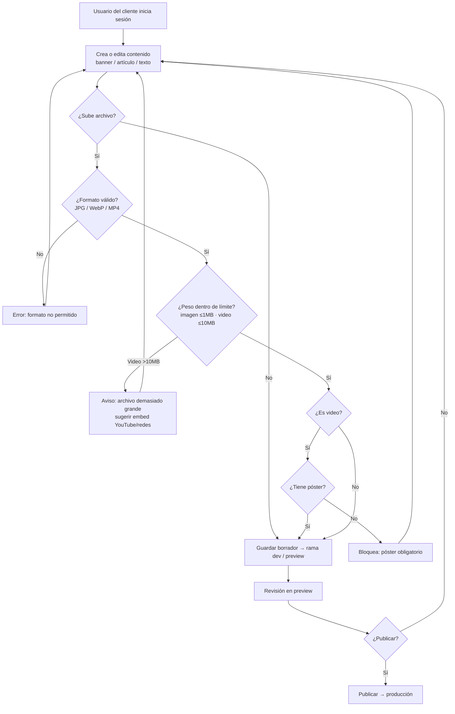

# PRD - CMS Autoexplora

| **Campo** | **Detalle** |
| --- | --- |
| **Proyecto** | CMS Autoexplora |
| **Área / empresa** | Go Virtual |
| **Versión** | v0.1 |
| **Fecha** | 2026-07-14 |
| **Autores** | Abigail Estrada (solicitante) |
| **Revisión / liderazgo** | Alexis Herrera (revisión técnica); Aldo Álvarez (Director de TI) |
| **Tipo de proyecto** | Feature web o API |

## 1. Resumen ejecutivo

CMS Autoexplora es una herramienta de autogestión de contenido para **Autoexplora**, sitio de venta de autos seminuevos de **Go Virtual**. Su propósito es que el cliente pueda crear y editar por sí mismo el contenido de su sitio —banners, artículos de blog y textos de secciones— sin depender del equipo interno.

Hoy el sitio de Autoexplora es personalizado y su contenido está "directo a código": cualquier cambio se solicita por un **ticket de soporte** y lo edita manualmente el equipo interno de Go Virtual. Esto genera fricción, tiempos largos y una relación desgastada con el cliente, que reclamó no tener forma de subir sus banners, blog ni editar sus textos. La dirección comercial comprometió con Autoexplora la entrega de esta capacidad de autogestión a fin de mes.

El MVP entregará una herramienta **independiente del panel de cliente general** (proyecto mayor y más complejo, no comprometido hoy), priorizada en tres niveles: **P1** — acceso multiusuario, gestión de banners y publicación en dos etapas; **P2** — gestión de blog; **P3** — gestión de textos estáticos. La solución se construye sobre **Strapi**.

El resultado esperado es principalmente de negocio: **cumplir el compromiso con el cliente y recuperar credibilidad** con una entrega puntual, además de reducir la carga operativa del equipo de soporte y los tiempos de publicación de contenido.

**Iniciar sesión** → **Editar contenido** → **Guardar borrador (dev / preview)** → **Publicar** → **Producción**

## 2. Contexto y problema

- **Proceso actual:** Autoexplora no puede modificar su propio contenido. Cada cambio (banner, artículo de blog, texto) se levanta como **ticket de soporte** y el **equipo interno de Go Virtual lo edita directamente en código**. El sitio es personalizado y no sigue la plantilla de otros sitios (p. ej. Grid, Brick), por lo que su contenido vive hardcodeado.
- **Dolor concreto:** dependencia total del equipo interno, tiempos largos, fricción operativa y una **relación desgastada** con el cliente.
- **Por qué ahora:** existe un **compromiso comercial explícito** de entregar la capacidad de autogestión de contenido a **fin de mes**; recuperar credibilidad con entregas puntuales es prioridad.
- **Distinción de dominio clave (día 1 para dev):** este CMS es una **herramienta aislada y de alcance corto solo para Autoexplora**, deliberadamente **independiente** del "panel de cliente general". No debe confundirse con ese panel: eventualmente podría migrarse/conectarse a él, pero es una etapa posterior no comprometida.

## 3. Objetivo del producto

Entregar a Autoexplora una herramienta de autogestión de contenido (CMS acotado, construido sobre Strapi) que le permita crear y editar sus banners, artículos de blog y textos de secciones sin depender del equipo interno, disponible como solución independiente del panel de cliente general. La mejora esperada es operativa (menos tickets, publicación más rápida) y de relación (cumplimiento del compromiso y recuperación de credibilidad con el cliente).

### 3.1 Estrategia de implementación por fases

| **Fase** | **Nombre** | **Descripción** |
| --- | --- | --- |
| **Fase 1 (MVP — este PRD)** | CMS aislado Autoexplora | Herramienta independiente para que el cliente gestione su contenido (banners, blog, textos). Meta de entrega: **31 jul 2026** (fallback: 1ª semana de agosto 2026). |
| Fase 2 (futuro, no comprometido) | Integración al panel general | Migrar/conectar la herramienta al panel de cliente / CMS general para ampliar funciones. |

El **MVP de este PRD es la Fase 1**.

> ⚠️ **Guardarraíl de alcance (para el plan de desarrollo):** el MVP considera P1 + P2 + P3, pero la fecha es **estricta**. Si el desarrollo se extiende más allá del **31 de julio de 2026** (~15 días), el alcance se **recorta a solo P1** (acceso multiusuario, banners, publicación en dos etapas).

## 4. Usuarios y actores

| **Usuario / Actor** | **Rol en el proceso** |
| --- | --- |
| Cliente Autoexplora (Marketing, Project Management, Contenidos, SEO) | Usuarios finales: crean/editan banners, blog y textos. En el MVP todos comparten un rol único "editor". |
| Equipo de soporte interno (Go Virtual) | Conserva acceso; atiende solicitudes que sigan llegando por ticket (modelo híbrido). Da de alta a los usuarios del cliente. |
| Equipo de desarrollo (Go Virtual) | Construye y mantiene el CMS. |
| Alexis Herrera | Revisión técnica y coordinación del desarrollo. |
| Abigail Estrada | Solicitante y gestión del PRD. |
| Aldo Álvarez | Director de TI (supervisión). |
| Juan | Patrocinio comercial / relación con el cliente. |
| Memo (ex-desarrollador) | No participa; disponible para dudas puntuales sobre la infra/API existente. |

## 5. Alcance MVP y funcionalidades

| **Funcionalidad** | **Descripción** |
| --- | --- |
| Acceso multiusuario **(P1)** | Login para los usuarios del cliente con un rol único "editor". |
| Gestión de banners **(P1)** | CRUD de banners por sección. Cada banner es **imagen o video** (video con **póster obligatorio**), con enlace destino, **posición/orden** y **vigencia opcional** (sin vigencia = permanente). Al **caducar** un banner, los de posiciones inferiores **suben automáticamente** (posición 2 → 1, etc.). |
| Publicación en dos etapas **(P1)** | "Guardar borrador" escribe el contenido en la rama **`dev`** (preview); "Publicar" lo promueve a **producción**. El cliente tiene **autonomía total** (no hay aprobación interna). |
| Previsualización | El contenido puede revisarse en preview (`dev`) antes de publicar. |
| Gestión de blog **(P2)** | CRUD de artículos: título, slug, **autor**, hero (imagen o video), cuerpo con editor de texto enriquecido, categoría/etiquetas, estado (borrador/publicado) y fecha. |
| Editor de texto enriquecido | Barra de herramientas (itálica, cita/quote, nota al pie, etc.); soporta imágenes, videos y **embeds** de YouTube y redes sociales en el cuerpo. |
| Gestión de textos estáticos **(P3)** | Edición de textos de secciones promocionales/institucionales, con el **mismo editor enriquecido**, por sección. |
| Validación de archivos | En cada subida se valida formato (JPG/WebP para imagen, MP4 para video) y peso (imagen ≤1 MB, video ≤10 MB). Video >10 MB → **aviso "archivo demasiado grande"** + sugerir usar link de YouTube/redes. |
| Almacenamiento | Imágenes y videos se almacenan en bucket **S3**. |

**Principio rector del MVP:** ningún contenido llega a producción sin pasar por el flujo **borrador → `dev` (preview) → publicar**; el cliente nunca edita directamente producción. La integridad del sitio vivo se protege mediante ese paso de publicación explícito.

## 6. Fuera de alcance

- **Permisos granulares por rol** (Marketing/PM/Contenidos/SEO): el MVP usa un solo rol "editor"; se difiere por tiempo.
- **Administración de usuarios autoservicio:** las altas las hace Go Virtual (generan costo); el cliente no gestiona sus propios usuarios.
- **Gestión de teléfonos/datos de agencias (dealers):** queda como pregunta abierta; se editaría vía la API de Go Virtual en una fase posterior.
- **Reparación de los bugs del panel actual:** no impacta este desarrollo.
- **Integración con el panel de cliente general / CMS completo:** es fase futura, no comprometida.
- **Conversión automática a WebP y formatos adicionales** (PNG, SVG, PDF/documentos): mejora post-MVP.
- **Generación automática de póster de video:** el usuario lo sube manualmente.
- **Subida directa de videos pesados (>10 MB):** se resuelve con embed (YouTube/redes).
- **Reutilización multisitio / otras marcas:** Autoexplora es un sitio personalizado y único; no se diseña para multisitio.
- **Generación de contenido con IA:** fuera del MVP.

## 7. Flujos principales

**Flujo de gestión y publicación de contenido.** El usuario del cliente entra al CMS, crea o edita una pieza (banner, artículo o texto) y, si adjunta archivos, el sistema los valida por formato y peso antes de permitir avanzar; los videos exigen póster y los que exceden 10 MB se rechazan sugiriendo un embed. El contenido se guarda como borrador en la rama `dev` (preview), donde puede revisarse, y solo al publicar se promueve a producción. El cliente controla todo el flujo sin intervención interna, por lo que las validaciones automáticas y el paso explícito de publicación son la principal salvaguarda de la integridad del sitio.

**Regla transversal — vigencia de banners:** los banners con fecha de vigencia se retiran automáticamente al caducar, y las posiciones inferiores se recorren para ocupar los huecos (el banner en posición 2 pasa a la 1, etc.), sin intervención del usuario.

## 8. Requerimientos funcionales

| **ID** | **Requerimiento** | **Descripción** |
| --- | --- | --- |
| RF-01 | Acceso multiusuario | Login para usuarios del cliente con rol único "editor" (P1). |
| RF-02 | Alta de usuarios por Go Virtual | El alta de usuarios del cliente la realiza Go Virtual; no hay autoservicio. |
| RF-03 | Gestión de banners | CRUD de banners por sección: imagen o video, enlace, posición/orden y vigencia opcional (P1). |
| RF-04 | Póster obligatorio en video | Los banners (y heros) de video requieren póster; sin póster no se guarda ni publica. |
| RF-05 | Reordenamiento por vigencia | Al caducar un banner, los de posiciones inferiores suben automáticamente. |
| RF-06 | Publicación en dos etapas | Guardar borrador → rama `dev` (preview); publicar → producción, con autonomía total del cliente (P1). |
| RF-07 | Previsualización | El contenido puede revisarse en preview antes de publicar. |
| RF-08 | Gestión de blog | CRUD de artículos: título, slug, autor, hero (imagen/video), cuerpo, categoría/etiquetas, estado y fecha (P2). |
| RF-09 | Editor de texto enriquecido | Barra de formato (itálica, quote, nota al pie…) con soporte de imágenes, videos y embeds de YouTube/redes. |
| RF-10 | Gestión de textos estáticos | Edición por sección con el mismo editor enriquecido (P3). |
| RF-11 | Validación de archivos | JPG/WebP ≤1 MB; MP4 ≤10 MB; video >10 MB → aviso + sugerir embed. |
| RF-12 | Almacenamiento en S3 | Imágenes y videos se almacenan en bucket S3. |

## 9. Requerimientos no funcionales

| **ID** | **Requerimiento** | **Descripción** |
| --- | --- | --- |
| RNF-01 | Autenticación | Solo usuarios dados de alta por Go Virtual pueden ingresar. |
| RNF-02 | Integridad de producción | Todo cambio pasa por borrador → `dev` → publicar; el cliente nunca escribe directo en producción. |
| RNF-03 | Trazabilidad / auditoría | Registrar usuario + acción (crear/editar/publicar/despublicar) + fecha/hora por pieza. |
| RNF-04 | Disponibilidad | El CMS debe estar disponible 24/7. |
| RNF-05 | Reversibilidad | Permitir despublicar o revertir al estado anterior de una pieza. |
| RNF-06 | Rendimiento / UX | Video con póster como fallback ante carga lenta o fallida. |
| RNF-07 | Almacenamiento / costo | Archivos en S3 con límites de peso (imagen ≤1 MB, video ≤10 MB). |
| RNF-08 | Usabilidad | Editor enriquecido amigable para usuarios no técnicos (Marketing/Contenidos/SEO). |
| RNF-09 | Manejo de errores | Mensajes claros ante fallos de formato, peso, subida o publicación. |
| RNF-10 | Observabilidad | Logs de publicaciones y errores. |
| RNF-11 | Plataforma | El CMS debe desarrollarse **obligatoriamente con Strapi** (headless CMS). |

## 10. Integraciones y datos

| **Integración / Fuente** | **Uso esperado** |
| --- | --- |
| Strapi | Plataforma base del CMS (obligatoria); administración y API de contenido. |
| Repositorio del sitio Autoexplora (Git) | Escritura de contenido a rama `dev` (preview) y promoción a producción (repo se comparte en la fase de desarrollo). |
| Amazon S3 | Almacenamiento de imágenes y videos. |
| Sitio Autoexplora (producción) | Consume el contenido publicado. |
| YouTube / redes sociales | Embeds por URL en el cuerpo del blog (solo referencia, sin subida). |
| API de Go Virtual (ex-Memo) | **Integración futura (fuera del MVP):** edición de datos de dealers (WhatsApp, teléfonos, mapa, textos de negocio). En el MVP no se requiere. |

**Datos / entidades mínimas:**

- **Usuario:** identificador, nombre, correo, rol (editor), estatus.
- **Banner:** sección, tipo (imagen/video), archivo, póster (si video), enlace, orden, vigencia (inicio/fin opcional), estado.
- **Artículo de blog:** título, slug, autor, hero, cuerpo (contenido enriquecido), categoría/etiquetas, estado, fecha.
- **Texto estático:** sección, contenido enriquecido, estado.
- **Registro de auditoría:** usuario, acción, entidad afectada, fecha/hora.

**Esquema de permisos:** los usuarios (rol editor) los da de alta **Go Virtual**. El editor puede crear/editar/publicar/despublicar contenido, pero **no** administra usuarios ni accede a producción salvo mediante el paso de publicación. El acceso al repositorio de producción queda del lado del equipo/infra de Go Virtual, no del cliente.

## 11. Métricas de éxito

| **Métrica** | **Descripción** |
| --- | --- |
| Cumplimiento de entrega | MVP (al menos P1) entregado en/antes del 31 jul 2026. |
| Autoservicio | % de cambios de contenido que el cliente resuelve solo, sin ticket a soporte. |
| Tiempo de publicación | Reducción del tiempo de un cambio: de "ticket → días" a "autoservicio → minutos". |
| Reducción de tickets | # de tickets de contenido de Autoexplora antes vs. después del CMS *(pendiente de validar línea base con BI/operación)*. |
| Adopción | # de usuarios del cliente activos y # de publicaciones hechas por el cliente *(pendiente de validar meta con BI/operación)*. |

## 12. Riesgos y supuestos

### Riesgos

| **Riesgo** | **Impacto potencial** |
| --- | --- |
| Deadline estricto (31 jul) con factibilidad aún no validada | No cumplir el compromiso; recorte forzado a solo P1. |
| Ausencia de Memo + documentación incompleta | Retrasos al entender la infra/API existente. |
| Curva de aprendizaje de Strapi / límites de su MCP y plugins | Retraso de desarrollo; funciones que deban hacerse a mano. |
| Modelo borrador→`dev`→prod aún no reconciliado con Strapi | Retrabajo si la implementación técnica difiere de lo previsto. |
| Falta de acceso al repositorio (avances quedaron locales) | Bloqueo de arranque hasta que se otorguen accesos. |
| Presión por ampliar alcance (dealers, teléfonos, textos de negocio) | Riesgo al deadline si crece el MVP. |
| Autonomía total del cliente sin aprobación interna | Publicación de contenido erróneo directo a producción (mitigado por preview, auditoría y revertir/despublicar). |
| Doble trabajo al migrar luego al panel general | Reconfiguración/rehecho en fase futura. |

### Supuestos

| **Supuesto** | **Descripción** |
| --- | --- |
| Deadline estricto | 31 jul 2026; si se excede ~15 días, el alcance se recorta a solo P1. |
| Strapi cubre el alcance | Los content types de Strapi cubren banners, blog y textos sin costo de licencia bloqueante. |
| Accesos disponibles | Repositorio del sitio y accesos otorgados al iniciar el desarrollo. |
| Sitio único | Autoexplora es personalizado y no multisitio. |
| Altas por Go Virtual | Go Virtual gestiona el alta de usuarios del cliente. |
| Memo disponible | Responderá dudas puntuales durante el desarrollo. |
| Formatos/pesos suficientes | JPG/WebP ≤1 MB y MP4 ≤10 MB cubren las necesidades del cliente en el MVP. |

## 13. Preguntas abiertas

| **Tema** | **Pregunta abierta** |
| --- | --- |
| Alcance — dealers | ¿Cuándo se incorpora la edición de datos de dealers (WhatsApp, teléfonos, mapa, textos de negocio) vía API de Go Virtual? (fase futura) |
| Alcance — permisos | Definir permisos granulares por rol (Marketing/PM/Contenidos/SEO) para fase posterior. |
| Técnico — publicación | Cómo se implementa el modelo borrador→`dev`→producción con Strapi (¿entornos Strapi vs. flujo git?). |
| Técnico — media | Cómo se conecta el media library de Strapi con S3. |
| Técnico — Memo | ¿Se reutiliza algo de la API/infra que dejó Memo, o el CMS es 100% independiente? |
| Fechas — factibilidad | Confirmar tras la sesión de exploración si P1+P2+P3 caben al 31 jul; si no, recorte a P1 (fallback 1ª sem. agosto). |
| Métricas — línea base | Definir línea base y metas (reducción de tickets, tiempos de publicación) con BI/operación. |
| Post-MVP — formatos | Script de conversión automática a WebP y ampliación de formatos aceptados. |
| Post-MVP — integración | Migración/conexión al panel de cliente general (CMS completo). |
