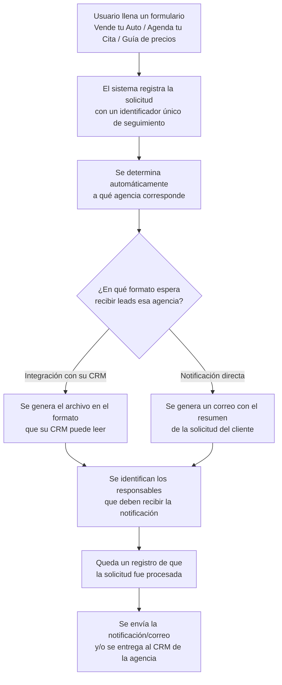
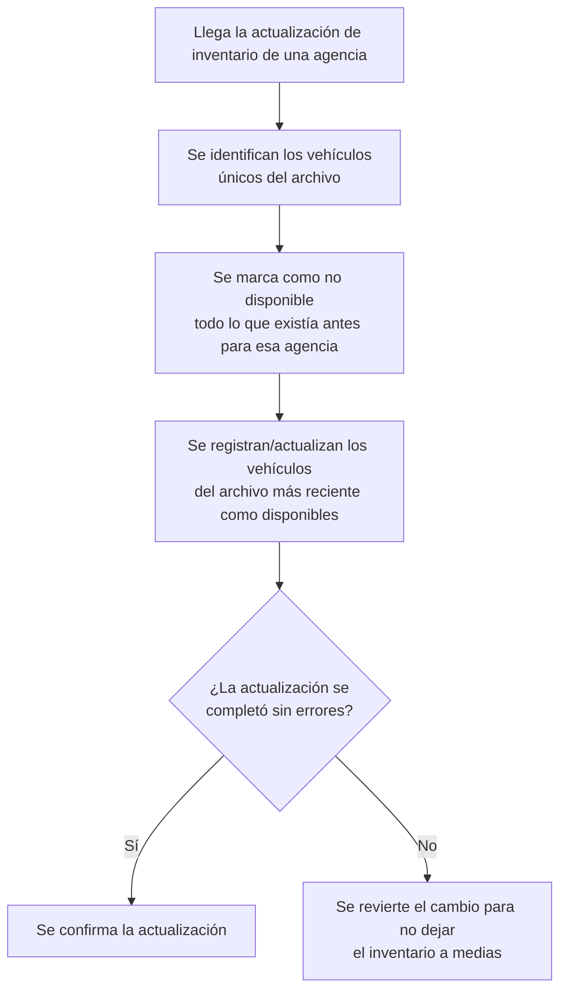
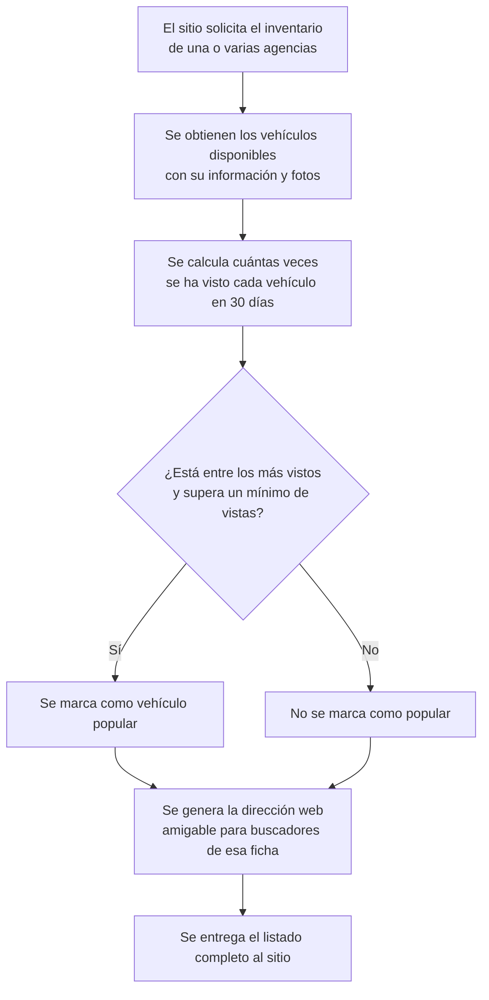
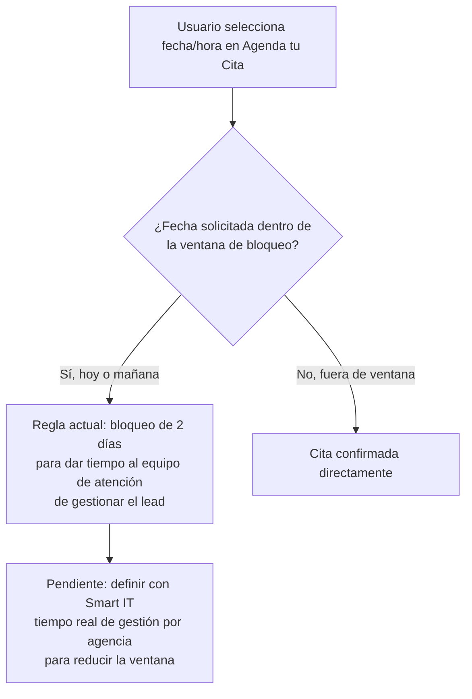
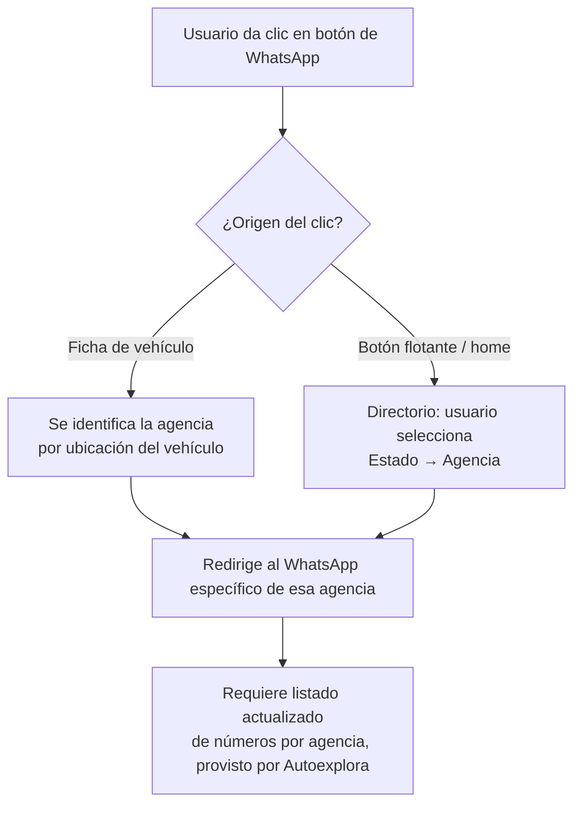

# PRD - Mejoras Fase 2 — Sitio Web Autoexplora

| **Campo** | **Detalle** |
| --- | --- |
| **Proyecto** | Mejoras Fase 2 — Sitio Web Autoexplora |
| **Área / empresa** | Go Virtual |
| **Versión** | v0.1 |
| **Fecha** | 2026-07-01 |
| **Autores** | Equipo de cuenta Go Virtual (Juan Berner, Abigail Estrada) |
| **Revisión / liderazgo** | Aldo Álvarez (Director de Tecnología y Operaciones) |
| **Tipo de proyecto** | Feature web/API |

## 1. Resumen ejecutivo

Autoexplora es la plataforma digital de venta de autos seminuevos certificados de Grupo Autofin/Autogine, con aproximadamente 49 agencias/dealers multimarca en México. El sitio web es desarrollado y operado por Go Virtual. Este PRD documenta el alcance de **Mejoras Fase 2**: el conjunto de mejoras funcionales sobre el sitio ya migrado a la plataforma propietaria "Brick", dirigido a fortalecer la experiencia de compra de los usuarios finales y la operación de las agencias de la red.

Tras completar la migración de paridad funcional (Fase 1, Go-Live 15 de junio de 2026), el sitio quedó operando de forma estable, pero varias funcionalidades del sitio anterior siguen pendientes de recuperar o mejorar (notificación por correo en formularios, comparación de precio contado/financiamiento, compartir vehículos, contacto directo por WhatsApp por agencia), y existen fricciones operativas activas en la sincronización de inventario y en la confirmación de que los leads capturados llegan realmente a su destino. Go Virtual busca además fortalecer sus procesos de documentación de producto, formalizando por primera vez alcance, responsables, fechas y flujos, para dar mayor trazabilidad y previsibilidad a las mejoras que se entregan a Autoexplora.

El MVP de este PRD cubre los tickets de Fase 2 (formularios con notificación, ajustes de SEO/inventario, WhatsApp por agencia, comparador de vehículos, acceso de Autoexplora al CMS, entre otros) acordados en conjunto con Autoexplora, en la ventana del 22 de junio al 24 de julio de 2026. Queda fuera de alcance cualquier evolución posterior (categorización avanzada por año/color, nuevas herramientas de personalización, monitoreo automatizado de leads/inventario) que dependa de resolver primero la calidad de los datos o de nuevas definiciones de negocio con Autoexplora.

Se espera una mejora medible en la conversión de leads por formulario, mayor confianza en los datos de inventario mostrados en el sitio, y una experiencia de contacto y comparación de vehículos más clara para el usuario final — todo respaldado por un esquema de eventos de analítica (estándar ASC) que permite medir la adopción de cada mejora.

**Usuario interactúa con el sitio** → **Formularios, inventario y WhatsApp mejorados** → **Interacción o lead registrado de forma trazable** → **Autoexplora y Go Virtual dan seguimiento con datos confiables**

## 2. Contexto y problema

El sitio de Autoexplora migró del CMS legado DealerOn a la plataforma propietaria de Go Virtual, "Brick". La migración de paridad funcional (Fase 1) concluyó con el Go-Live el 15 de junio de 2026. Desde el 22 de junio de 2026 el proyecto está en Fase 2 (mejoras post-migración), con una ventana de ejecución hasta el 24 de julio de 2026.

Varias funcionalidades que existían en el sitio anterior no se migraron aún con el mismo nivel de detalle: los formularios de "Vende tu Auto", "Guía de precios" y "Agenda tu Cita" no envían correo de confirmación al usuario; no existe forma de compartir la ficha de un vehículo más allá de copiar la liga; el precio de financiamiento mostraba antes un estimado genérico que hoy no está disponible; y el contacto por WhatsApp no está vinculado a la agencia específica del vehículo de interés. En paralelo, existen fricciones operativas activas: discrepancias entre el inventario reportado por Autoexplora y el visible en el sitio (explicadas en su mayoría por reglas de deduplicación de VIN y desfases de horario del feed), y antecedentes de leads que no llegaron a su destino sin que el sistema lo detectara a tiempo.

Go Virtual busca fortalecer la relación de servicio con Autoexplora formalizando por primera vez documentación de producto (PRD, alcance, responsables y fechas) que respalde de forma clara y trazable cada mejora entregada, y que permita a ambos equipos dar seguimiento conjunto al avance.

Conceptos de dominio que el equipo de desarrollo debe distinguir desde el día uno:
- **VIN**, nunca "BIN", en toda terminología de producto, UI o documentación.
- Un vehículo puede estar **"no publicado"** o **"despublicado"** — son dos estados distintos del feed de inventario, no sinónimos.
- Los **"child sites"** mencionados por Autoexplora son contenedores/licencias de ubicación de agencia dentro de Brick, no micrositios independientes.
- En el tracker de seguimiento de Fase 2, una "tarea de Autoexplora" (insumo que debe entregar) y una "tarea de revisión" (validación de Go Virtual) pueden tener texto muy similar sin ser duplicados.

## 3. Objetivo del producto

Cerrar la ventana de mejoras de Fase 2 del sitio Autoexplora (formularios, SEO, WhatsApp, inventario, CMS, entre otros) para mejorar la experiencia de usuario y la conversión de leads, como parte del compromiso de Go Virtual de fortalecer sus procesos de documentación y seguimiento del proyecto junto con Autoexplora.

El alcance de este PRD es exclusivamente la Fase 2 (22 de junio – 24 de julio de 2026). La Fase 1 (migración de paridad funcional) ya concluyó y se menciona solo como contexto histórico en la sección anterior; este documento no proyecta fases futuras.

## 4. Usuarios y actores

| **Usuario / Actor** | **Rol en el proceso** |
| --- | --- |
| Comprador final (usuario del sitio) | Navega el sitio, usa formularios (Vende tu Auto, Agenda tu Cita, Guía de precios), compara vehículos, contacta por WhatsApp |
| Agencias/dealers (49 ubicaciones multimarca) | Cargan inventario y contenido vía Autofox/Intelimotor; reciben leads y citas por agencia |
| Juan Berner (Go Virtual) | Dirección de cuenta; relación con Autoexplora; responsable del compromiso de formalización de procesos |
| Abigail Estrada (Go Virtual) | Product Manager; SEO, QA, coordinación de los tickets de Fase 2, comunicación con Intelimotor |
| Sharon Mendoza (Go Virtual) | Desarrollo; evalúa la viabilidad técnica de cada ticket de Fase 2 |
| Aldo Álvarez (Go Virtual) | Director de Tecnología y Operaciones; dashboards, automatización de reportes de inventario, revisión técnica del PRD |
| Antonio "Tony" Estrada (Go Virtual) | Project Manager; seguimiento de fechas y entregables de Fase 2 |
| Germán Delgado (Go Virtual) | Dashboards de Darwin AI (chatbot, pausado) |
| Lourdes Munguía (Autoexplora) | Líder de proyecto del lado de Autoexplora; punto de contacto operativo, conduce las revisiones de Fase 2 |
| Andrea Quintana (Autoexplora) | Coordinación de tickets, altas/bajas de agencias, leads; participa en decisiones de alcance (ej. WhatsApp) |
| Fer Márquez (Autoexplora) | Enlace con Intelimotor y con el equipo de TI de Autoexplora |
| Cristian Mendoza (Autoexplora) | Revisor técnico de SEO |
| Claudia Guevara (Autoexplora) | Directora de proyecto del lado de Autoexplora |
| Intelimotor (Edgar Bahena y equipo) | Feed de inventario y CRM de leads; aplica su propia regla de deduplicación de VIN |
| Exagono | Formulario de guía de precios y simulador de crédito (financiamiento BBVA) |
| Smart IT (Gonzalo) | Dependencia técnica externa para la regla de calendario de citas |

## 5. Alcance MVP y funcionalidades

| **Funcionalidad** | **Descripción** |
| --- | --- |
| Envío de correo — formulario "Vende tu Auto" | Hoy el formulario no dispara correo; se agrega envío al usuario y notificación interna. Depende de que Autoexplora entregue diseño (Figma/imagen), HTML o especificaciones completas (tipografía, colores, medidas) |
| Envío de correo — formulario "Guía de precios" (Exagono) | Mismo criterio que el anterior; el estilo visual ya fue homologado por Exagono según el alcance del proyecto |
| Envío de correo — formulario "Agenda tu Cita" | Mismo criterio; hoy no se notifica al usuario ni queda registro por correo |
| Eliminar leyenda de disponibilidad en cotizador de crédito | Se quita el texto que promete traer el auto desde otra ciudad/estado — no es una garantía cumplible al 100% |
| Ajuste de regla de calendario de citas | Reducir la ventana de bloqueo de 2 días que hoy impide agendar cita el mismo día o al día siguiente; requiere definir con Autoexplora cuánto tarda el lead en recorrer el funnel (BDC → contacto) y una sesión técnica con Smart IT |
| Tags de inventario ("único dueño", "auto nuevo") | Brick ya soporta mostrarlos; falta que Intelimotor agregue una columna en el feed para que las agencias indiquen el tag por unidad |
| Banner lateral en sección de inventario | Requiere pasar la grilla de 3 a 4 columnas; pendiente de que Autoexplora entregue la propuesta visual del banner |
| Ajuste de carrusel de logos (home) y sección Concesionarios | Agrandar logos en móvil (en PC se ven bien); homologar tamaño de imagen entre ambas secciones por la restricción técnica del carrusel automático |
| Compartir vehículo (WhatsApp / redes / correo) | Hoy solo existe "copiar liga"; se habilita compartir directo por los 3 canales |
| Homologación de agencias en inventario | Corrige unidades no visibles por falta de republicación en Intelimotor (dependencia externa, seguimiento con Autoexplora) |
| Precio contado/financiamiento con reglas reales | El sitio anterior mostraba un estimado genérico (no reglas reales de financiamiento); implementar reglas reales requiere autorización explícita de Autoexplora por ser de mayor esfuerzo — **pendiente de validar** (ver sección 14) |
| Rediseño de pasos de formularios (iconos + descripciones) | Aplica a todos los formularios del sitio, no solo a uno; depende de que Autoexplora entregue guía de diseño/referencia |
| Carrusel de vehículos "en oferta" | Sustituye el banner hacia "Nosotros" para reducir scroll, sobre todo en móvil; se prioriza sobre "más buscados" porque ya se tiene ese dato |
| WhatsApp vinculado a la agencia en ficha de vehículo | Dirige al WhatsApp específico de la agencia según ubicación del vehículo; ajuste de esfuerzo medio, ya viable con datos de Intelimotor |
| Directorio de WhatsApp por agencia (botón flotante del home) | Reemplaza el acceso al agente virtual (Darwin AI, pausado): el usuario elige estado → agencia y se le dirige al WhatsApp correspondiente |
| Rediseño del botón "Comparar vehículos" | Diferenciarlo visualmente de los demás botones; evaluar animación/alerta tras ~20-30s de permanencia en la ficha invitando a comparar |
| Mejora visual del simulador de crédito | Mejorar experiencia visual sin copiar el diseño de referencia externa ni cambiar el diseño general; coordinado con Exagono/BBVA |
| Automatización del reporte de comparación de inventario | Hoy es manual (Go Virtual); se automatiza con alertas proactivas de discrepancia por agencia |
| Documentación formal de flujos de negocio y técnicos | Levantamiento y documentación de los flujos que hoy no existen por escrito (leads, inventario, navegación) |
| Acceso completo de Autoexplora al CMS de Brick | Permisos diferenciados: Autoexplora edita metadatos SEO/contenido; Go Virtual mantiene schema técnico e infraestructura — compromiso a finales de julio 2026 |

**Principio rector del MVP:** ningún cambio visual o de datos llega a producción sin que Autoexplora lo haya visto y aprobado primero — evitar que se repitan casos de elementos no solicitados apareciendo en el sitio sin aviso previo.

## 6. Fuera de alcance

- **Categorización dinámica de fichas/categorías por modelo, año y color**: depende de resolver primero la calidad del dato "color" (valores inconsistentes en el campo de origen); se habilita en una fase posterior una vez saneado el dato.
- **Cualquier desarrollo o inversión de tiempo en el agente virtual/chatbot Darwin AI**: Autoexplora indicó pausar el trabajo con esa plataforma; se retoma solo si se confirma explícitamente que la pausa fue levantada.
- **Mapa de calor con estudios de atención visual (cámaras/eye-tracking)**: complejidad y costo desproporcionado frente a alternativas de tagueo de clics; se evalúa solo la alternativa simple si se decide implementar.
- **Comparativo "antes/después" de uso del sitio anterior**: el sitio anterior nunca tuvo herramienta de medición de uso instalada, no existe línea base que comparar.
- **Rediseño mayor del bloque "Nosotros"/contenido debajo del carrusel de oferta**: se evaluó como trabajo de rediseño más amplio, fuera del enfoque de "no alargar el sitio en mobile" de esta fase; se difiere.
- **Carrusel de "más buscados"**: requiere que Autoexplora defina y entregue el criterio/listado; sin ese insumo no puede implementarse en la ventana de Fase 2.
- **Monitoreo automatizado de salud de integración de leads** (remitentes autorizados, confirmación real vs. aparente): candidato técnico de alto valor identificado, pero no forma parte de los tickets confirmados con Autoexplora para esta fase.
- **Reconciliación de inventario/VIN entre dealers** (prevención de publicación simultánea): mismo caso — candidato técnico no comprometido en Fase 2.
- **Validación/normalización automática de datos de color en el pipeline de ingesta**: candidato técnico no comprometido; es distinto de (y bloqueante para) la categorización por color, ya excluida arriba.
- **Sistema de alertas de diffs de feed/comportamiento de terceros antes de producción**: candidato técnico sugerido, pero no comprometido como entregable de Fase 2.

## 7. Flujos principales

### 7.1 Flujo de leads (formularios del sitio)

Cada solicitud queda registrada con evidencia de que fue procesada antes de enviarse — esto permite confirmar que un lead llegó realmente a su destino, no solo que el sistema respondió "recibido". La confirmación final de recepción depende de Intelimotor, que controla su propio CRM (ver sección 14).

### 7.2 Flujo de actualización de inventario

Este proceso evita que queden en el sitio vehículos que la agencia ya vendió o retiró, y garantiza que una actualización nunca deje el inventario en un estado incompleto. Las fotografías llegan como URLs públicas dentro del mismo archivo de actualización, sin un proceso de carga aparte.

### 7.3 Flujo de consulta de inventario para el sitio

La marca de "popular" es relativa al conjunto de vehículos consultado en ese momento, no un valor fijo — relevante si se usa para resaltar unidades en el sitio.

### 7.4 Flujo de agendar cita

La ventana de bloqueo hoy pierde hasta 2 días hábiles de disponibilidad; ajustarla depende de una sesión externa con Smart IT no agendada aún.

### 7.5 Flujo de WhatsApp por agencia

Reemplaza el enfoque anterior de un botón genérico hacia el agente virtual (pausado), priorizando contacto directo con la agencia correspondiente.

## 8. Requerimientos funcionales

| **ID** | **Requerimiento** | **Descripción** |
| --- | --- | --- |
| RF-01 | Confirmación por correo — Vende tu Auto | El usuario debe recibir un correo de confirmación al enviar el formulario "Vende tu Auto" |
| RF-02 | Confirmación por correo — Guía de precios | El usuario debe recibir un correo de confirmación al enviar el formulario de "Guía de precios" |
| RF-03 | Confirmación por correo — Agenda tu Cita | El usuario debe recibir un correo de confirmación al enviar el formulario "Agenda tu Cita" |
| RF-04 | Eliminar leyenda de disponibilidad | El cotizador de crédito no debe mostrar la leyenda de disponibilidad de traslado desde otra ciudad/estado |
| RF-05 | Ajuste de ventana de citas | El calendario de "Agenda tu Cita" debe permitir reducir la ventana mínima de bloqueo, una vez definida la regla con Autoexplora |
| RF-06 | Etiquetas de inventario | El sitio debe poder mostrar etiquetas visuales (ej. "único dueño", "auto nuevo") en la tarjeta de cada vehículo cuando la agencia las indique |
| RF-07 | Banner en grilla de inventario | La sección de inventario debe poder mostrar un banner publicitario dentro de la grilla sin afectar la visualización del resto de vehículos |
| RF-08 | Legibilidad de carrusel de logos | El carrusel de logos del home y la sección de Concesionarios deben mostrar los logotipos con tamaño legible en dispositivos móviles |
| RF-09 | Compartir vehículo | El usuario debe poder compartir la ficha de un vehículo por WhatsApp, redes sociales y correo electrónico |
| RF-10 | Consistencia de inventario | El inventario del sitio debe reflejar correctamente las unidades publicadas por cada agencia, evitando discrepancias no explicadas |
| RF-11 | Precio contado/financiamiento | El sitio debe mostrar el precio de contado y, cuando Autoexplora lo autorice, una estimación de financiamiento con reglas definidas conjuntamente |
| RF-12 | Formularios con guía visual | Los formularios del sitio deben mostrar sus pasos con iconografía y descripciones que orienten al usuario |
| RF-13 | Carrusel de ofertas | El home debe mostrar un carrusel de vehículos "en oferta" |
| RF-14 | WhatsApp por agencia en ficha | El botón de WhatsApp en la ficha de un vehículo debe dirigir al número de la agencia correspondiente a ese vehículo |
| RF-15 | Directorio de WhatsApp en home | El botón de WhatsApp del home debe permitir seleccionar estado y agencia antes de dirigir al número correspondiente |
| RF-16 | Botón de comparar diferenciado | El botón "Comparar vehículos" debe distinguirse visualmente de los demás botones de acción sobre la ficha |
| RF-17 | Simulador de crédito | El simulador de crédito debe mostrar el progreso del usuario de forma visualmente clara, sin modificar su lógica de cálculo actual |
| RF-18 | Reporte de discrepancias de inventario | Go Virtual debe contar con un reporte periódico que compare el inventario reportado por Autoexplora contra el inventario visible en el sitio, señalando discrepancias |
| RF-19 | Documentación de flujos | El proyecto debe contar con documentación formal de los flujos de leads, inventario y navegación del sitio, accesible para ambos equipos |
| RF-20 | Acceso de Autoexplora al CMS | Autoexplora debe contar con acceso funcional al panel de administración de contenido (CMS) para editar metadatos SEO y contenido general |

## 9. Requerimientos no funcionales

| **ID** | **Requerimiento** | **Descripción** |
| --- | --- | --- |
| RNF-01 | Trazabilidad de leads | Todo lead capturado por el sitio debe quedar registrado con evidencia de que fue procesado, para poder confirmar que llegó a su destino y no solo que el sistema respondió "recibido" |
| RNF-02 | Consistencia de datos de inventario | La actualización de inventario debe garantizar que un corte de carga nunca deje el inventario en un estado parcial (todo o nada) |
| RNF-03 | Permisos del CMS | El acceso de Autoexplora al CMS debe limitarse a metadatos de negocio y contenido general; la configuración técnica de SEO y la infraestructura permanecen bajo control exclusivo de Go Virtual |
| RNF-04 | Detección de cambios de terceros | Cualquier cambio de comportamiento visible al usuario originado por un tercero (feed de inventario, plataforma legada) debe poder detectarse antes de llegar a producción |
| RNF-05 | Disponibilidad de fichas de vehículo | Las páginas de ficha de vehículo no deben mostrar error 404 cuando la unidad se vende o se retira del inventario |
| RNF-06 | Compatibilidad por dispositivo | Todos los elementos visuales ajustados (banner, botones, carrusel de logos) deben verse correctamente en escritorio y en dispositivos móviles |
| RNF-07 | Privacidad de datos de contacto | Los datos de contacto capturados en los formularios deben tratarse conforme al aviso de privacidad ya vigente en el sitio |
| RNF-08 | Escalabilidad del proceso de inventario | El proceso de actualización de inventario debe soportar el volumen de las 49 agencias sin degradar el tiempo de respuesta del sitio para los usuarios |

## 10. Integraciones y datos

| **Integración / Fuente** | **Uso esperado** |
| --- | --- |
| Intelimotor | Fuente del feed de inventario de vehículos (altas/bajas/actualizaciones, incluidas URLs públicas de fotos) y CRM de leads; aplica su propia regla de deduplicación de VIN |
| Servicio de enrutamiento de leads | Determina a qué agencia y en qué formato (correo o integración directa a su CRM) debe entregarse cada lead capturado en el sitio |
| BigQuery | Destino de los datos de leads para análisis y reportes de negocio (BI) |
| Exagono / BBVA | Proveedor del formulario de guía de precios y del simulador de crédito |
| Autofox | Aplicativo interno de Autoexplora para carga de contenido/imágenes por parte de las agencias |
| Darwin AI | Plataforma de agente conversacional (pausada); se retoma solo si Autoexplora confirma explícitamente el reinicio |
| CMS de Brick | Panel de administración de contenido con permisos diferenciados para Autoexplora |

**Datos mínimos requeridos:**
- **Vehículo**: VIN, marca, modelo, año, versión, precio, color, estado (publicado/despublicado/no publicado), agencia, fotos.
- **Lead**: nombre, contacto (email/teléfono normalizado), vehículo de interés, tipo de formulario de origen, metadatos de campaña.
- **Agencia**: nombre, ubicación, números de WhatsApp por área (Ventas, Seminuevos, Servicio, Refacciones, en ese orden fijo).

**Esquema de permisos:** Autoexplora puede leer y editar metadatos de negocio del contenido (SEO a nivel página, contenido general del CMS); no puede modificar el esquema técnico de SEO ni la configuración de infraestructura, que permanecen bajo control exclusivo de Go Virtual. Las reglas de financiamiento y la regla de calendario de citas requieren autorización explícita de Autoexplora antes de implementarse, dado que impactan directamente la experiencia del comprador final.

## 11. Eventos para BI

Go Virtual adopta el estándar ASC (Automotive Standards Council) de eventos GA4 para sitios de dealers automotrices. Para Fase 2 se usan los siguientes eventos ya estandarizados:

- `asc_form_submission_trade`: se dispara cuando el usuario envía el formulario "Vende tu Auto" (form_type: avalúo).
- `asc_form_submission_sales`: se dispara al enviar el formulario de "Guía de precios" (cotización).
- `asc_form_submission_sales_appt`: se dispara al enviar "Agenda tu Cita" y la cita queda confirmada.
- `asc_form_engagement`: se dispara en cada interacción dentro de cualquiera de los 3 formularios (permite detectar abandono antes del envío).
- `asc_cta_interaction` (element_type: contact_tool): se dispara al dar clic en el botón de WhatsApp (ficha de vehículo o directorio del home).
- `asc_cta_interaction` (element_type: compare_tool): se dispara al dar clic en "Comparar vehículos".
- `asc_cta_interaction` (element_type: share_tool): se dispara al compartir una ficha de vehículo (WhatsApp/redes/correo).
- `asc_element_configuration`: se dispara al interactuar con las nuevas etiquetas de inventario o con el banner lateral de la grilla.
- `asc_special_offer`: se dispara al interactuar con el nuevo carrusel de vehículos "en oferta".
- `asc_media_interaction`: se dispara al interactuar con la galería de fotos o el carrusel de logos.
- `asc_page_view`: cobertura general de páginas visitadas, incluidas las fichas de vehículo.

Campos mínimos por evento: los parámetros estándar del vehículo (VIN, marca, modelo, año, color, precio, condición) cuando aplique, `department`, `page_type`, y `element_text`/`element_type` para interacciones de botones — todos ya definidos por el estándar ASC.

## 12. Métricas de éxito

| **Métrica** | **Descripción** |
| --- | --- |
| Tasa de conversión de formularios | Envíos completados (`asc_form_submission_*`) / visitas a la página de cada formulario, por tipo. Pendiente de validar línea base con BI/Autoexplora |
| Leads confirmados como entregados | % de leads capturados que quedan confirmados como recibidos por la agencia/CRM (no solo "enviados") |
| Discrepancias de inventario detectadas | Número de discrepancias señaladas por el reporte automatizado (RF-18) por semana; meta: tendencia a la baja conforme se estabiliza el proceso |
| Adopción de WhatsApp por agencia | Clics en el botón de WhatsApp (ficha de vehículo + directorio del home) vs. el botón general anterior |
| Adopción de funcionalidades nuevas | Interacciones con "Comparar vehículos" y con el carrusel de "en oferta" |
| Disponibilidad de citas | Reducción de la ventana de bloqueo actual (2 días) para agendar cita; meta numérica pendiente de definir junto con Autoexplora y Smart IT |

## 13. Riesgos y supuestos

### Riesgos

| **Riesgo** | **Impacto potencial** |
| --- | --- |
| Varios tickets de Fase 2 dependen de insumos de diseño (Figma/HTML/assets) que Autoexplora aún no ha entregado | Retraso en la ventana de Fase 2 (22 jun–24 jul 2026) para esos tickets específicos |
| La regla de calendario de citas depende de una sesión externa con Smart IT aún no agendada | Riesgo de no alcanzar a implementarse dentro de la ventana vigente |
| Las etiquetas de inventario dependen de que Intelimotor agregue una columna nueva al feed | Dependencia externa sin fecha confirmada; puede bloquear ese ticket específico |
| Cambios de comportamiento originados por terceros (feed de inventario, plataformas externas) pueden llegar a producción sin aviso previo | Riesgo de regresiones visuales no solicitadas visibles para el usuario final |
| Persistencia de discrepancias de inventario mientras no se automatice completamente el reporte de comparación | Percepción de baja calidad de datos por parte de Autoexplora |
| Autoexplora no valida a tiempo las reglas de negocio pendientes (financiamiento, calendario de citas) | Varias funcionalidades no podrían avanzar dentro de la ventana de Fase 2 |
| El proceso de confirmación final de recepción de un lead depende de Intelimotor, quien controla su propio CRM | Aunque quede un registro interno de que la solicitud fue procesada y enviada, no se puede garantizar al 100% que un lead fue recibido del lado de Intelimotor sin su confirmación explícita — limita qué tan confiable es la métrica de "leads confirmados como entregados" |

### Supuestos

| **Supuesto** | **Descripción** |
| --- | --- |
| Entrega de insumos de diseño | Autoexplora entregará los insumos de diseño (Figma, HTML, assets, logos) dentro de los tiempos acordados por ticket |
| Disponibilidad de Smart IT | La sesión técnica para la regla de calendario de citas podrá agendarse dentro de la ventana de Fase 2 |
| Respuesta de Intelimotor | Intelimotor podrá atender la solicitud de nueva columna de tags en el feed dentro del plazo requerido |
| Configuración de eventos ASC | El estándar ASC de eventos GA4 está disponible o se configurará en paralelo en la propiedad de Autoexplora |
| Vigencia de la pausa de Darwin AI | La pausa del chatbot sigue vigente durante toda la ventana de Fase 2 |
| Aviso de privacidad | El aviso de privacidad ya vigente en los formularios del sitio cubre el tratamiento de datos de las nuevas notificaciones por correo |

## 14. Preguntas abiertas

| **Tema** | **Pregunta abierta** |
| --- | --- |
| Financiamiento | ¿Se autoriza definir reglas reales de financiamiento contado/financiamiento para Fase 2, o se difiere? |
| Banner lateral de inventario | ¿Autoexplora entregará la propuesta visual definitiva (grilla de 3 o 4 columnas)? |
| Rediseño de pasos de formularios | ¿Cuándo entregará Autoexplora la guía de diseño o referencia visual para los iconos/descripciones? |
| Calendario de citas | ¿Cuándo se puede agendar la sesión conjunta con Smart IT para definir el tiempo real de gestión del lead por agencia? |
| Tags de inventario | ¿Intelimotor confirmará fecha para agregar la columna adicional al feed? |
| Directorio de WhatsApp del home | ¿Se confirma la alternativa de directorio, o se retira el botón general del home? |
| Documentación de flujos | ¿Quién será responsable de mantener actualizada la documentación de flujos una vez entregada esta primera versión? |
| Eventos ASC/GA4 | ¿El estándar ASC ya está configurado en la propiedad de Autoexplora, o se configura como parte de esta fase? |
| Confirmación real de leads | ¿Es posible acordar con Intelimotor un mecanismo de confirmación de recepción real de leads, más allá del registro interno de auditoría? |
| Discrepancias de origen interno | Si el reporte de discrepancias de inventario (RF-18) detecta que una inconsistencia proviene de un proceso interno de Autoexplora (no de Intelimotor ni de Go Virtual), ¿cuál es el mecanismo esperado para reportarlo y darle seguimiento? |
