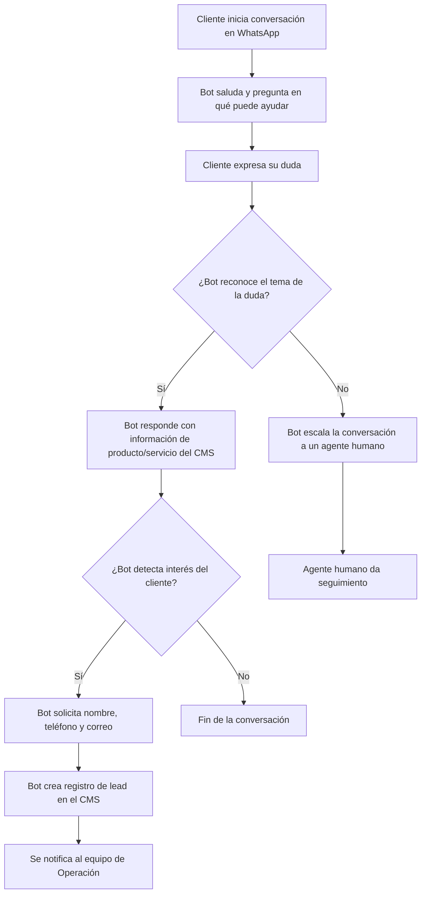

# PRD - Bot Yari

| **Campo** | **Detalle** |
| --- | --- |
| **Proyecto** | Bot Yari |
| **Área / empresa** | Go Virtual |
| **Versión** | v0.1 |
| **Fecha** | 2026-08-28 |
| **Autores** | Alexix Engin (solicitante) |
| **Revisión / liderazgo** | Aún sin definir |
| **Tipo de proyecto** | Agente conversacional / bot |

## 1. Resumen ejecutivo

Bot Yari es un agente conversacional por WhatsApp orientado a clientes finales y público externo de Go Virtual. Su propósito es automatizar la atención de consultas de información sobre productos y servicios (catálogo, precios, condiciones), reduciendo la dependencia de la atención manual actual.

Hoy este proceso se atiende de forma parcialmente automatizada: un agente humano responde manualmente por WhatsApp, lo que genera un costo operativo alto y motiva este proyecto.

El MVP cubre: saludo inicial, respuesta a dudas reconocidas sobre producto/servicio, escalamiento a un agente humano cuando el bot no reconoce la duda, y captura de datos de contacto (nombre, teléfono, correo) para generar un lead que se notifica al equipo de Operación. No se plantean fases adicionales — es un alcance único.

El resultado esperado es reducir el costo operativo de la atención manual por WhatsApp, sin reemplazar completamente al canal humano ni ejecutar transacciones — el bot solo informa y captura leads.

**Cliente inicia chat** → **Bot responde dudas de producto o escala a humano** → **Captura de lead (si aplica)** → **Notificación a Operación**

## 2. Contexto y problema

- Hoy el proceso está parcialmente automatizado: existe algún grado de herramienta, pero la atención por WhatsApp la realiza un agente humano de forma manual.
- El dolor concreto es el **costo operativo alto** de mantener esa atención manual.
- Se resuelve ahora porque ese costo operativo es la queja recurrente que dispara el proyecto.
- No se identificaron conceptos de dominio que requieran distinción especial para el equipo dev.

## 3. Objetivo del producto

Automatizar por WhatsApp la atención de consultas de información/estatus de producto y servicio para clientes finales y público externo de Go Virtual, reduciendo el costo operativo de la atención manual actual sin sustituir por completo al canal humano.

## 4. Usuarios y actores

| **Usuario / Actor** | **Rol en el proceso** |
| --- | --- |
| Clientes finales / público externo | Interactúan directamente con Bot Yari por WhatsApp para resolver dudas de producto/servicio |
| Equipo de Operación | Monitorea el funcionamiento del bot y da seguimiento a los leads notificados |
| Equipo de TI | Da soporte y mantenimiento técnico continuo al bot |

*(No aplica un rol de BI por ahora — ver sección 14.)*

## 5. Alcance MVP y funcionalidades

| **Funcionalidad** | **Descripción** |
| --- | --- |
| Atender dudas de producto/servicio | El bot reconoce y responde consultas sobre información de productos/servicios (catálogo, precios, condiciones) consultando el CMS actual |
| Recopilar datos de contacto | El bot solicita y captura nombre, teléfono y correo del cliente cuando detecta interés, para generar un lead |
| Escalamiento a agente humano | Cuando el bot no reconoce la duda del cliente, escala la conversación a un agente humano |
| Notificación de lead | Al capturarse un lead, se notifica al equipo de Operación para su seguimiento |

**Principio rector del MVP:** el bot no debe confirmar información sensible sin validar la identidad del cliente. Tampoco reemplaza completamente al canal humano ni ejecuta transacciones — su función se limita a informar y capturar leads.

## 6. Fuera de alcance

- **Reemplazo completo del canal humano de WhatsApp**: el bot atiende dudas básicas; los casos complejos o sensibles se escalan a un agente humano. Se habilitaría más adelante una vez validada la precisión y confianza del bot en producción.
- **Ejecución de transacciones (pagos, altas, cambios de datos)**: el MVP solo informa, no modifica datos ni procesa pagos, para no arriesgar información sensible sin validación. Se habilitaría al definir un esquema de permisos y validación de identidad robusto en una fase futura.

## 7. Flujos principales

El flujo principal inicia cuando el cliente escribe a Bot Yari por WhatsApp. El bot saluda y pregunta en qué puede ayudar; a partir de la respuesta del cliente, decide si reconoce el tema (información de producto/servicio) o si debe escalar a un agente humano. Cuando reconoce y responde la duda, evalúa si el cliente muestra interés para solicitar sus datos de contacto y generar un lead, que se registra en el CMS y se notifica a Operación para darle seguimiento.

**Regla transversal de escalamiento:** ante cualquier solicitud que implique confirmar información sensible, el bot no debe proceder sin validar la identidad del cliente (el mecanismo de validación queda pendiente de definir — ver sección 14).

## 8. Requerimientos funcionales

| **ID** | **Requerimiento** | **Descripción** |
| --- | --- | --- |
| RF-01 | Saludo inicial | El sistema debe saludar al cliente e iniciar la conversación preguntando en qué puede ayudarlo. |
| RF-02 | Respuesta a dudas de producto | El sistema debe reconocer dudas sobre información de productos/servicios (catálogo, precios, condiciones) y responderlas directamente. |
| RF-03 | Escalamiento a humano | El sistema debe detectar cuando no puede resolver la duda del cliente y escalar la conversación a un agente humano. |
| RF-04 | Captura de datos de contacto | El sistema debe solicitar y capturar nombre, teléfono y correo del cliente cuando detecte interés, para generar un lead. |
| RF-05 | Notificación de lead | El sistema debe notificar al equipo de Operación cuando se capture un nuevo lead. |
| RF-06 | Validación de identidad | El sistema no debe confirmar información sensible sin validar la identidad del cliente. |
| RF-07 | Sin transacciones | El sistema no debe ejecutar transacciones (pagos, altas, cambios de datos) — solo informa. |

## 9. Requerimientos no funcionales

| **ID** | **Requerimiento** | **Descripción** |
| --- | --- | --- |
| RNF-01 | Disponibilidad en horario operativo | El bot debe estar disponible solo en horario operativo de Go Virtual; fuera de ese horario no debe responder o debe indicarlo. |
| RNF-02 | Privacidad de datos personales | Los datos personales capturados (nombre, teléfono, correo) deben manejarse como PII estándar, con acceso restringido al equipo autorizado. |
| RNF-03 | Trazabilidad | Toda escalación a agente humano y captura de lead debe quedar trazada (quién, cuándo, motivo). |
| RNF-04 | Manejo de errores | El bot debe manejar errores de reconocimiento de forma controlada, sin respuestas inventadas, escalando a humano en caso de duda. |

## 10. Integraciones y datos

| **Integración / Fuente** | **Uso esperado** |
| --- | --- |
| CMS actual | Lectura de información de producto/servicio para responder dudas; escritura para crear el registro de lead (no modifica otra información existente) |
| WhatsApp Business API / Twilio | Canal de mensajería por el que el bot conversa con el cliente |

**Datos mínimos requeridos:** nombre, teléfono, correo del cliente (lead), y tema/duda de producto consultada.

**Esquema de permisos:** el bot puede leer libremente información de producto en el CMS y crear registros de lead; cualquier otra acción (modificar datos existentes, ejecutar transacciones, confirmar información sensible) queda bloqueada sin validación humana o de TI.

## 11. Eventos para BI

- `bot_conversacion_iniciada`: se registra cuando el cliente inicia el chat y el bot saluda.
- `bot_duda_respondida`: se registra cuando el bot reconoce y responde una duda de producto/servicio.
- `bot_escalado_humano`: se registra cuando el bot no reconoce la duda y escala la conversación a un agente.
- `bot_lead_capturado`: se registra cuando se captura nombre/teléfono/correo del cliente.
- `bot_lead_notificado`: se registra cuando se notifica al equipo de Operación sobre el nuevo lead.

Cada evento debe incluir como mínimo: fecha/hora, identificador de la conversación/cliente (teléfono o ID de sesión), resultado y motivo (cuando aplique, ej. motivo de escalamiento).

## 12. Métricas de éxito

Pendiente de definir línea base y metas numéricas con BI/operación. No se establecieron métricas concretas durante esta entrevista.

## 13. Riesgos y supuestos

### Riesgos

| **Riesgo** | **Impacto potencial** |
| --- | --- |
| El bot mal-reconoce dudas y da información incorrecta | Desconfianza del cliente y posible daño reputacional si no escala a tiempo |

### Supuestos

| **Supuesto** | **Descripción** |
| --- | --- |
| El CMS actual ya tiene la información de producto lista y estructurada | Necesario para que el bot pueda consultarla y responder dudas correctamente |
| WhatsApp Business API/Twilio ya está contratado | Necesario para que el canal de mensajería esté disponible al lanzar el bot |

## 14. Preguntas abiertas

| **Tema** | **Pregunta abierta** |
| --- | --- |
| Métricas de éxito | ¿Cuáles serán la línea base y las metas numéricas? Pendiente de validar con BI/operación. |
| Responsable de BI | Hoy no hay equipo de BI asignado a analizar los eventos del bot — ¿quién los consumirá? |
| Estructura de datos del CMS | ¿Qué campos exactos de producto (catálogo, precios, condiciones) están disponibles para que el bot los consulte? |
| Validación de identidad | RF-06 exige no confirmar información sensible sin validar identidad — ¿cuál será el mecanismo de validación? |
| Umbral de reconocimiento | ¿Con qué criterio/umbral decide el bot si "reconoce" o no una duda antes de escalar a un humano? |
| Revisión / liderazgo técnica | Aún sin definir quién hace la revisión técnica del PRD (encabezado). |
