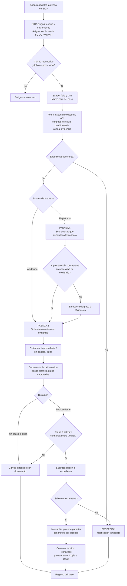
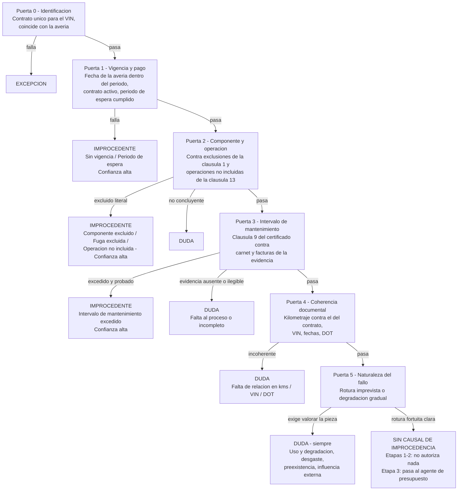
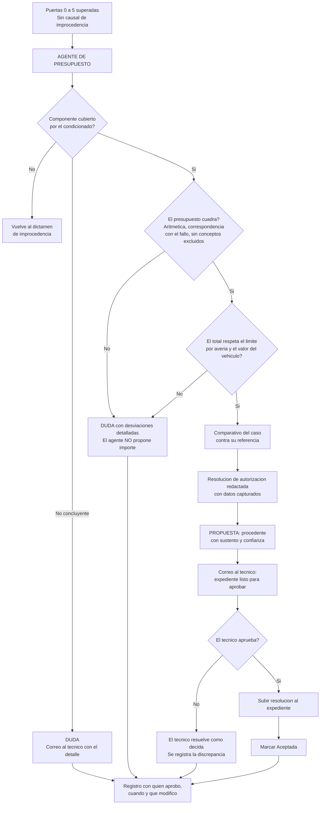
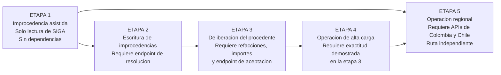
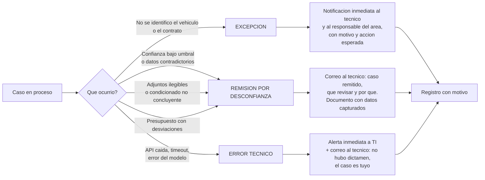

# PRD - Copiloto de Averías: automatización por etapas del ciclo de dictamen

| **Campo** | **Detalle** |
| --- | --- |
| **Proyecto** | Copiloto de Averías — automatización del ciclo de dictamen de averías en cinco etapas, de la improcedencia asistida a la operación regional centralizada |
| **Área / empresa** | EngineCX (alcance operativo: Garantiplus México en las etapas 1–4; Colombia y Chile en la etapa 5) |
| **Versión** | v0.2 |
| **Fecha** | 2026-08-26 |
| **Autores** | Omar André Lara Saldaña (omar.lara@enginecx.com) |
| **Revisión / liderazgo** | Héctor — patrocinio directivo del estado futuro · Jefe directo del autor *(¿Aldo Álvarez? por confirmar, §14)* · David Simancas Estrada — Responsable de Averías LATAM, dueño del criterio técnico |
| **Tipo de proyecto** | Automatización interna (n8n) + Feature web/API |

> **Qué cambió respecto de la v0.1.** La v0.1 se escribió antes de conocer el proceso real y antes de conocer la intención directiva. Dos insumos la reencuadran:
>
> **(a) Las sesiones del 2026-08-25** con David Simancas (Averías LATAM) y Gisela Aldana (Call center) revelaron el proceso real: el reporte no llega por correo del cliente, **lo registra la agencia directamente en SIGA**, así que no hay captura manual que automatizar; el equipo no quiere una herramienta nueva —*"lo ideal sería verlo en el SIGA"*—; y el trabajo que duele es **dictaminar y documentar**. Cae el bloque de ingesta, cae el panel operativo.
>
> **(b) La instrucción del 2026-08-25 sobre el estado futuro** cambia el objetivo del proyecto. Ya no se trata de hacerle más eficiente el día al equipo actual, sino de **multiplicar la capacidad por persona** para poder centralizar la operación de LATAM en México. Eso obliga a automatizar también los **casos procedentes**, a incorporar la **validación del presupuesto**, y a estructurar el desarrollo en **etapas** con desbloqueos y niveles de riesgo distintos.
>
> Se conserva íntegro el marco de principios de la v0.1 —decisión humana en la resolución, prohibición del fallo silencioso, sesgo hacia la remisión— y se adapta a un alcance donde el agente ya no solo rechaza.

## 1. Resumen ejecutivo

El **Copiloto de Averías** automatiza el ciclo de dictamen de una avería: desde que SIGA la asigna a un técnico hasta que existe una resolución sustentada en el expediente. Se construye en **cinco etapas** que van ampliando lo que el sistema decide por sí mismo y reduciendo lo que una persona tiene que construir a mano, sin quitarle nunca la decisión final.

El disparador es un correo que SIGA ya emite: *"Asignación de avería 3246 / Vin 9GAMM6108KB004600"*. Trae **solo folio y VIN**. A partir de ahí el sistema reúne el expediente completo desde la **API de SIGA** —contrato, vigencia, producto, vehículo, descripción del fallo, evidencia cargada y el **texto del certificado**— y lo somete a un agente de IA que aplica, en orden, los criterios que hoy aplica el equipo.

**Por qué se hace.** El objetivo no es ahorrarle minutos al equipo actual: es **aumentar el volumen que puede atender cada persona**. Hoy siete técnicos en tres países atienden del orden de 4 900 averías al año —unas 700 por persona—. El plan de negocio es consolidar la operación de Colombia y parte de la de Chile en México y operar el mismo volumen con cuatro o cinco personas, lo que exige que **la capacidad por persona crezca entre 45% y 75%**. Ese es el número que este desarrollo tiene que mover.

**Las cinco etapas.**

| | Etapa | Qué automatiza | Qué desbloquea |
| --- | --- | --- | --- |
| **1** | **Improcedencia asistida por correo** | Dictamen de improcedencia con su resolución redactada; plantilla con datos ya capturados para todos los demás casos; respuesta al técnico en el hilo. **Cero escritura en SIGA.** | Nada. Arranca hoy. |
| **2** | **Escritura de improcedencias** | Lo mismo, pero el sistema sube la resolución al expediente y marca `No procede garantía`. | Endpoint de escritura de SIGA. |
| **3** | **Deliberación del caso procedente** | Agente especializado que valida cobertura, verifica que el presupuesto cuadre, arma el comparativo, redacta la resolución de autorización y **propone autorizar**. El técnico aprueba caso por caso. | Datos de refacciones e importes en la API; endpoint de aceptación. |
| **4** | **Operación de alta carga** | El humano deja de construir el expediente y pasa a revisar uno ya armado: cola priorizada, aprobación en bloque, cierre del ciclo hasta el pago. | Nada nuevo; depende de la exactitud demostrada en la etapa 3. |
| **5** | **Operación regional centralizada** | Colombia y Chile con sus condicionados y catálogos, operados desde México. | APIs de Colombia y Chile. |

**La asimetría que gobierna el diseño.** Rechazar es verificable: existe una cláusula concreta del contrato que lo dice. Autorizar no lo es: exigiría descartar 32 operaciones no incluidas, 7 exclusiones generales y valorar el estado físico de una pieza. Por eso las etapas 1 y 2 pueden llegar a escribir el rechazo por sí mismas, y las etapas 3 y 4 **nunca autorizan sin que una persona lo confirme**. La diferencia no es de madurez del modelo: es que un rechazo mal fundado se reclama y se corrige, y una autorización mal fundada se paga.

**El caso de negocio ya está en los datos del área.** En México, enero–julio de 2026: **1 582 averías, de las que 604 (38.2%) terminaron en `No procede garantía`**. De esos rechazos, **el 54.6% responde a cuatro causales verificables contra el condicionado** —intervalo de mantenimiento excedido 29.1%, componente excluido 15.7%, fuga excluida 6.8%, sin vigencia 3.0%—, o sea **una de cada cinco averías del país**. Ese es el alcance de la etapa 1. El 61.8% restante —los casos que hoy se aceptan— es el terreno de las etapas 3 y 4, y es donde está el grueso de la capacidad que hay que liberar.

## 2. Contexto y problema

### El proceso real, tal como opera hoy

1. El cliente lleva su vehículo a la agencia o taller. En más del 90% de los casos llega **sin llamarnos antes**: sabe que compró la unidad en el distribuidor y acude directo a él.
2. La **agencia registra la avería en SIGA** y sube la evidencia. SIGA exige al menos un documento en cada uno de tres tipos —evidencias, presupuesto y fotos de odómetro— antes de dejarla avanzar.
3. SIGA **asigna la avería a un técnico** por round-robin (en México son dos) y **le envía un correo de asignación** a su cuenta nominal con el folio y el VIN.
4. La agencia pasa la avería a **`Validación`**. Ahí arranca el compromiso de respuesta de **48 horas hábiles**, y solo entonces el técnico puede trabajarla.
5. El técnico descarga el certificado, revisa la evidencia y **dictamina: `Aceptada` o `No procede garantía`**. Es el único tramo de estatus que el área técnica puede mover.
6. Redacta la **resolución** en un machote de Word externo a SIGA, tecleando a mano folio, contrato, fecha, marca, modelo y datos de la unidad que ya están en pantalla, y la sube al expediente. Ese documento tiene **valor legal**: la agencia se lo entrega al cliente.
7. Si fue aceptada, la agencia mueve `Taller` → `Solucionada` y se procesa el pago. El área técnica ya no interviene.

Un canal minoritario entra por **call center**: se valida por teléfono que el contrato esté vigente y pagado, y se descartan operaciones no incluidas y exclusiones obvias. No cambia el proceso —la agencia igual registra la avería—, pero evita que el cliente se mueva en vano.

> **Cómo se debe leer esta descripción.** Es el **as-is**, y la instrucción directiva es explícita en que el estado futuro no se diseña sobre él: *"no es tanto el as-is… a Gisela y a David les gana mucho la operación, entonces tenemos que pensar en el estado futuro"*. Este PRD conserva el as-is por una razón concreta y limitada: **es la fuente del criterio técnico de dictamen**, que no cambia porque cambie quién lo ejecuta. Lo que el as-is no debe fijar es el alcance, la secuencia ni el destino del proyecto.

### Los dolores, con su tamaño

- **Dolor 1 — se trabaja completo aquello que ya se sabe que no procede.** David lo planteó sin rodeos: aun sabiendo de antemano que un caso no aplica, *"hay que crear la avería, hay que bajar la información, hay que generar la resolución, hay que poner datos, hay que poner información, enviarla"*. **604 de 1 582 averías (38.2%)** terminaron rechazadas en México en 2026, y **330 de ellas por causales verificables** contra el texto del contrato.
- **Dolor 2 — captura manual del documento.** El equipo transcribe a mano, en cada resolución, datos que ya viven en SIGA. Hay dos formatos vigentes: Garantiplus México y Mitsubishi. Es el mismo desarrollo que David intentó hace meses y no pudo terminar.
- **Dolor 3 — el reloj corre desde antes de que alguien mire el caso.** El compromiso es de 48 horas hábiles desde el paso a validación. El tablero registra en México una **mediana de 4.1 días y un p90 de 50.1 días**. Sobre la latencia de la alerta David fue tajante: *"si necesitamos intervenir al momento, las intervenimos y que no se brinquen al día siguiente… ya se nos fueron 8 o 9 horas"*.
- **Dolor 4 — el rechazo automático que ya existe en SIGA es un fallo silencioso.** Cuando un distribuidor captura solo refacciones no cubiertas, SIGA rechaza y cierra la avería **sin cargar resolución ni información alguna**. El caso desaparece sin explicación y cuando la agencia reclama nadie sabe qué contestar. **Este desarrollo no puede reproducir ese patrón.**
- **Dolor 5 — el techo de capacidad.** Es el dolor que introduce el estado futuro y el que gobierna las etapas 3 a 5. La deliberación de un caso procedente exige reunir el expediente, cotejar el componente contra el condicionado, revisar la evidencia y verificar el presupuesto. Todo eso lo hace hoy una persona a mano, y es lo que fija cuántos casos caben en un día. **Mientras no se automatice la construcción del expediente, la capacidad por persona no se mueve.**
- **Por qué ahora.** La API de SIGA expone contrato, vehículo, avería, documentos y —clave— el **texto extraído del certificado**; existe n8n con conectividad de Gmail; y existe la API de Claude. El expediente completo es alcanzable por programa en el segundo en que llega el correo de asignación.

### Distinciones de dominio que el equipo dev debe entender desde el día 1

| Concepto | Significado |
| --- | --- |
| **El correo no trae el caso, trae la llave** | El correo de asignación contiene **solo folio y VIN**. No describe el fallo, no trae adjuntos, no dice quién reportó. El expediente se reúne después contra la API. Cualquier diseño que intente "leer el caso del correo" está mal planteado. |
| **`Registrada` vs. `Validación`** | El correo se emite al **registrar**, pero la avería **no es trabajable ni tiene evidencia garantizada hasta que pasa a `Validación`**. Entre ambos momentos el expediente puede estar vacío. De ahí la doble pasada del §7.1. |
| **Improcedente vs. procedente vs. duda** | **Improcedente**: existe una cláusula concreta del contrato de ese vehículo que lo excluye, y la evidencia lo sostiene. **Duda**: exige valorar el estado físico de una pieza, o la evidencia es insuficiente, ilegible o contradictoria. **Procedente**: no se encontró causal de rechazo **y** la cobertura y el presupuesto se verificaron. |
| **Sin causal de improcedencia** ≠ **procedente** | En las etapas 1 y 2 el veredicto favorable es solo *"no encontré motivo de rechazo"*: no autoriza nada y no mueve nada. **Procedente** —con propuesta de autorización— aparece en la etapa 3, y siempre requiere confirmación humana. |
| **El agente rechaza por sí mismo, autoriza solo con confirmación** | Asimetría deliberada y permanente, no una limitación temporal. Un rechazo se sostiene citando una cláusula. Una autorización exigiría descartar 32 operaciones no incluidas, 7 exclusiones generales y valorar desgaste en fotografías. Además: un rechazo mal fundado se reclama; una autorización mal fundada se paga. |
| **Dictamen vs. resolución** | El **dictamen** es lo que produce el agente: una opinión razonada con su nivel de confianza. La **resolución** es el documento con efecto legal que se entrega al cliente. El agente redacta el borrador; **la resolución solo existe cuando una persona la valida**. |
| **Verificar el presupuesto ≠ fijar el importe** | Desde la etapa 3 el agente comprueba que el presupuesto cuadre: aritmética, correspondencia entre refacciones y fallo, ausencia de conceptos excluidos, y que el total no rebase el límite por avería ni el valor del vehículo. **Señala desviaciones; nunca fija cuánto se autoriza.** Eso lo pone la persona. |
| **Excepción vs. error** | Una **excepción** es un caso que el agente no pudo resolver o sobre el que no tiene confianza: es un resultado válido y **debe notificarse de inmediato**. Un **error** es un fallo técnico del pipeline: alerta inmediata a TI. Nunca se confunden, nunca se silencian, nunca esperan a que alguien los descubra revisando una pantalla. |

## 3. Objetivo del producto

**Multiplicar el número de averías que puede dictaminar una persona al día**, automatizando la construcción del expediente, la deliberación de los casos cuya improcedencia es verificable contra el contrato, y la pre-evaluación de los casos procedentes, de modo que el trabajo humano se concentre en confirmar decisiones en lugar de armarlas.

El objetivo secundario, y el que hace medible al primero, es que **la operación de averías de LATAM pueda ejecutarse desde México** con una plantilla consolidada, sin degradar el tiempo de respuesta ni la exactitud del dictamen.

La mejora se mide en **averías dictaminadas por persona y por día**, **minutos de trabajo humano por caso**, **proporción del expediente que llega pre-armado**, **exactitud del dictamen contra la decisión final** y —como criterios duros, no estadísticos— **cero rechazos sin resolución adjunta** y **cero autorizaciones sin confirmación humana** (§12).

El principio rector se mantiene y se hace explícito por etapa: **la IA construye y propone, la persona resuelve.** En las etapas 1 y 2 el sistema puede resolver por sí mismo un único tipo de caso —la improcedencia verificable, con su sustento por escrito ya en el expediente—. En las etapas 3, 4 y 5 **ninguna autorización existe sin que una persona la confirme**, aunque el esfuerzo de confirmarla se reduzca al mínimo.

### 3.1 Estrategia de implementación por etapas

| Etapa | Nombre | Qué automatiza | Escritura en SIGA | Desbloqueo requerido |
| --- | --- | --- | --- | --- |
| **1** | **Improcedencia asistida por correo** | Reúne el expediente vía API; dictamina improcedente / sin causal / duda; redacta la resolución **solo en las improcedencias**; genera la plantilla con datos capturados **en los tres casos**; responde al técnico en el hilo del correo de asignación. | **Ninguna.** Solo lectura. | **Nada.** Arranca de inmediato. |
| **2** | **Escritura de improcedencias** | Lo de la etapa 1, más: sube la resolución al expediente y marca `No procede garantía` con su motivo. Orden inviolable: primero el documento, después el estatus. | Documento + estatus, **solo improcedencias de alta confianza**. | Endpoint de resolución de averías (§10.4 #1) y tipo de documento "Resolución" (#5). |
| **3** | **Deliberación del caso procedente** | Agente especializado: valida cobertura del componente contra el condicionado; **verifica que el presupuesto cuadre**; arma el comparativo; redacta la resolución de autorización; **propone autorizar** con su sustento. El técnico aprueba **caso por caso**. | Documento + estatus `Aceptada`, **solo tras aprobación humana explícita**. | Refacciones e importes en la API (#8); endpoint de aceptación (#1); referencia de comparación de presupuesto (§14). |
| **4** | **Operación de alta carga** | El humano deja de construir el expediente y pasa a revisar uno ya armado: cola priorizada por riesgo e importe, aprobación en bloque, caso resumido en una pantalla. Cierra el ciclo: solicita al taller la documentación de pago y sigue el expediente hasta el comprobante. | Igual que la etapa 3, más la gestión documental del cierre. | Ninguno nuevo. **Condicionada a la exactitud demostrada en la etapa 3.** |
| **5** | **Operación regional centralizada** | Colombia y Chile con sus condicionados, catálogos de motivos y plantillas propias, operados desde México. Enrutamiento por país y por tipo de caso. | Igual, por país. | **APIs de Colombia y Chile** — hoy no existen y no tienen fecha. Normalización de los catálogos de motivos entre países. |

**Por qué esta secuencia y no otra.** Las etapas 1 y 2 son el mismo alcance funcional separadas por una dependencia externa: la etapa 1 entrega todo el valor de análisis y captura **sin depender de nadie**, y la etapa 2 solo añade el último clic cuando TI libere la escritura. No tiene sentido esperar. Las etapas 3 y 4 se separan por naturaleza y no por dependencia: la **3 construye la capacidad** de deliberar un caso procedente con supervisión caso por caso, y la **4 no agrega capacidad nueva** sino que reduce la carga de supervisarla, lo que solo es defendible con datos de exactitud de la etapa 3 sobre la mesa. La etapa 5 va aparte porque depende de una entrega de TI sin fecha y **no debe bloquear ni contaminar el avance en México**.

## 4. Usuarios y actores

| **Usuario / Actor** | **Rol en el proceso** |
| --- | --- |
| **Técnico de averías** | Usuario principal. Recibe el dictamen y el documento capturado, revisa, corrige y resuelve. En las etapas 3 y 4 su trabajo pasa de armar el expediente a **confirmar** el que le llega armado. En México son **Eduardo Álvarez** y **Miguel Ángel Rodríguez**, que absorben el 94% de la carga del país. |
| **Héctor** | Patrocinio directivo del estado futuro. Origen de la decisión de automatizar de punta a punta y de centralizar la operación regional en México. |
| **Jefe directo del autor** | Traduce la intención directiva a instrucción de diseño y fija la secuencia de etapas. *(Identidad por confirmar en el encabezado — §14.)* |
| **Responsable de Averías LATAM** | **David Simancas.** Dueño del criterio técnico de dictamen y de la data de rechazos. Valida las causales, los umbrales y las plantillas. Recibe copia de todos los dictámenes automáticos. Es también responsable de la operación que el proyecto consolida (§13). |
| **Call center** | **Gisela Aldana** y su equipo. Aportan el orden del filtro previo —vigencia y pago, operaciones no incluidas, exclusiones—, que es el orden que reproducen las puertas del §7.2. Fuera del alcance operativo hasta la etapa 5. |
| **Agencia / taller** | Registra la avería en SIGA, sube la evidencia y mueve los estatus posteriores a la aceptación. **No interactúa con el sistema** en las etapas 1 a 3; en la etapa 4 recibe la solicitud de documentación de pago. |
| **Cliente / beneficiario** | Origen del fallo. **No recibe nada de este desarrollo.** La resolución le llega por la agencia, como hoy. |
| **TI / Desarrollo (Engine)** | Construye y opera el flujo; recibe las alertas de fallo técnico; mantiene y versiona los prompts y el catálogo de causales. |
| **Equipo de SIGA (Alexis)** | Único que puede exponer las capacidades de escritura y los datos que hoy faltan (§10.4), y las APIs de Colombia y Chile. |
| **Sistema — Gmail** | Buzones de los técnicos. Fuente del disparo y canal de salida del dictamen. |
| **Sistema — n8n** | Orquestador: detecta el correo, reúne el expediente, invoca a los agentes, arma el documento, responde y registra. |
| **Sistema — API de SIGA** | Fuente de verdad del contrato, la avería, la evidencia y el condicionado. Nada se dictamina sobre datos que no vengan de aquí. |
| **Sistema — Agente de cobertura** | Aplica las puertas de decisión y emite el dictamen de procedencia con motivo, sustento y confianza. Presente desde la etapa 1. |
| **Sistema — Agente de presupuesto** | Agente especializado que aparece en la **etapa 3**: coteja refacciones contra el fallo, verifica la aritmética, detecta conceptos excluidos y compara el total contra los límites del contrato. **No fija el importe autorizable.** |

## 5. Alcance MVP y funcionalidades

**Qué es el MVP.** El MVP es la **etapa 1**, y está detallada al nivel de construcción en el §5.1. Las etapas 2 a 5 se especifican al nivel de capacidad y de requerimiento, no de implementación: cada una necesitará su propia revisión antes de construirse, porque las tres últimas dependen de datos de desempeño y de entregas de TI que hoy no existen.

### 5.1 Etapa 1 — Improcedencia asistida por correo *(el MVP)*

#### A. Disparo y captación del caso

- **A1.** Vigilar por **suscripción push** —no por sondeo— los buzones de Gmail de los técnicos de averías de México (`david.simancas@`, `miguel.rodriguez@`, `eduardo.alvarez@garantiplus.mx` y los que el área designe).
- **A2.** Reconocer el correo de asignación de SIGA por remitente y patrón de asunto `Asignación de avería {folio} / Vin {VIN}`. Cualquier otro correo se ignora sin dejar rastro.
- **A3.** Extraer **folio** y **VIN** del asunto y del cuerpo, y validar que concuerden entre sí.
- **A4.** **Deduplicar por folio** con bloqueo. El mismo correo llega a varias cuentas a la vez —la captura de referencia muestra `averias`, `coordinador` y el técnico—. Un folio se procesa **una sola vez**, sin importar por cuántos buzones entre ni cuántas veces se reenvíe.
- **A5.** Registrar la **hora de llegada** como marca cero del caso. Todas las latencias del §12 se miden contra ella.

#### B. Reunión del expediente desde SIGA

- **B1.** Localizar el **contrato por VIN**: vigencia, estatus, producto, distribuidor, beneficiario.
- **B2.** Obtener el **detalle del contrato**: vehículo (marca, modelo, versión, año, kilómetros al contratar, fecha de primera factura, número de motor) y periodo de vigencia.
- **B3.** Obtener el **texto extraído del certificado**. Es el condicionado que aplica al caso y **la única fuente normativa admisible**: ninguna regla de cobertura se codifica como constante.
- **B4.** Obtener la **avería por folio**: descripción del fallo, fecha, estatus, técnico asignado, registrante.
- **B5.** Listar y descargar la **evidencia**: evidencias, presupuesto, fotos de odómetro y lo que la agencia haya agregado. Se procesa **en tránsito**, no se retiene.
- **B6.** **Verificar la coherencia del expediente**: VIN del correo = VIN del contrato = VIN de la avería, y un solo contrato vigente para ese VIN. Cualquier discrepancia detiene el dictamen y genera excepción.
- **B7.** Si la avería está en **`Registrada`**, ejecutar la **pasada 1** con lo que el contrato ya permite concluir y dejar el caso en espera de su paso a `Validación` para la pasada 2 (§7.1).

#### C. Dictamen de procedencia

- **C1.** Aplicar las puertas del §7.2 **en orden**, deteniéndose en la primera concluyente.
- **C2.** Emitir exactamente **un dictamen de tres valores**: `improcedente`, `sin_causal_de_improcedencia` o `duda`.
- **C3.** Todo `improcedente` va acompañado de **motivo** de catálogo cerrado, **cita textual** de la cláusula, **evidencia** concreta y **nivel de confianza**.
- **C4.** **Nunca emitir `improcedente` por debajo del umbral de confianza** de su causal. Por debajo del umbral, el resultado es `duda`, siempre.
- **C5.** Las causales que exigen valorar el estado físico de una pieza —**uso y degradación, desgaste, preexistencia, influencia externa, mala reparación anterior, negligencia**— producen `duda` por definición, aunque el agente tenga hipótesis. Concentran el 33.5% de los rechazos de México.
- **C6. Anonimizar** los datos personales del beneficiario antes de razonar y no reproducirlos en ninguna salida.
- **C7.** **No calcular, mencionar ni inferir importes.** En la etapa 1 el agente no mira el presupuesto salvo para identificar el componente reclamado.
- **C8. Versionar el prompt** y registrar en cada dictamen la versión con la que se produjo.

#### D. Documento de deliberación

- **D1.** Generar desde la **plantilla oficial** del producto: Garantiplus México o Mitsubishi. *(Ambas pendientes de entrega — §14.)*
- **D2.** **En los tres dictámenes**, rellenar todos los campos de captura desde SIGA: folio, contrato, fecha, marca, modelo, versión, año, VIN, kilometraje, distribuidor, producto y vigencia. Es la parte que hoy se teclea a mano y **se automatiza siempre**.
- **D3. Solo si el dictamen es `improcedente`**, redactar un par de párrafos que expliquen la improcedencia citando la cláusula del certificado y el hecho concreto que la activa.
- **D4.** Si el dictamen es `sin_causal_de_improcedencia` o `duda`, **el documento va con los datos y nada más**: sin redacción, sin conclusión, sin recomendación. Requisito expreso del área.
- **D5.** Partir de **borradores por causal** —intervalo de mantenimiento, fugas, componente excluido, vigencia—, tal como lo propuso David, en lugar de redacción libre por caso.
- **D6.** Marcar visiblemente que **es un borrador producido con asistencia de IA y que requiere revisión humana** antes de tener validez.

#### E. Respuesta al técnico por correo

- **E1.** Responder **en el mismo hilo** del correo de asignación, para que el dictamen quede pegado al caso en el buzón de quien lo trabaja.
- **E2.** Diseño claro y jerarquizado, con el veredicto destacado y visualmente diferenciado entre los tres valores.
- **E3.** Contenido: folio y VIN; vehículo y contrato; vigencia y producto; **veredicto y motivo en una línea**; sustento resumido; **qué revisó el agente y qué no pudo revisar**; documento adjunto.
- **E4.** **Nota de transparencia**: quién produjo el dictamen, que es una opinión asistida por IA y que no constituye la resolución del expediente.
- **E5.** **Copia al responsable del área** en todos los casos, para el radar de rechazos que David pidió expresamente: *"para que el equipo tenga el radar de que se rechazó esta avería, por si te buscan"*.
- **E6.** Si el dictamen es `duda`, enunciar **exactamente qué habría que verificar**, sin adelantar veredicto.

#### F. Registro, excepciones y observabilidad

- **F1.** Registro completo por caso: folio, VIN, contrato, tiempos, dictamen, motivo, confianza, versión del prompt, y qué se hizo y qué no con su razón.
- **F2. Toda excepción se notifica en el momento** en que se genera, con motivo, folio, VIN y acción esperada. Registrarla no sustituye a notificarla.
- **F3. Remisión por desconfianza.** Si el agente duda de su propia lectura —confianza bajo umbral, datos contradictorios, adjuntos ilegibles, condicionado no concluyente— remite el caso a una persona **en ese momento**, en lugar de resolver con lo que tiene.
- **F4.** Un **fallo técnico** alerta a TI de inmediato y **deja el caso con el técnico sin dictamen**, con un correo que lo dice explícitamente. Un caso nunca se queda en silencio porque el sistema falló.
- **F5.** El registro se conserva consultable, sin datos personales del beneficiario, para medir el §12 y alimentar las etapas siguientes.

#### Lo que la etapa 1 NO hace

**Cero escritura en SIGA.** No sube documentos, no cambia estatus, no crea nada. Su única interacción con la plataforma son consultas de lectura. El técnico recibe todo hecho y resuelve él.

### 5.2 Etapa 2 — Escritura de improcedencias

Mismo alcance funcional que la etapa 1, más la capacidad de cerrar el caso.

- **G1.** Cuando el dictamen sea `improcedente` **y** la confianza supere el umbral de su causal, subir la resolución al expediente y marcar la avería como **`No procede garantía`** con su motivo del catálogo.
- **G2. Ningún rechazo sin resolución adjunta.** El orden es inviolable: primero el documento, después el estatus. Si la carga del documento falla, **no se marca nada** y el caso se convierte en excepción. Esta regla existe para no repetir el fallo silencioso del auto-rechazo actual de SIGA.
- **G3.** En `sin_causal_de_improcedencia` y `duda` **no se escribe absolutamente nada** en SIGA.
- **G4.** El marcado automático se **desactiva por configuración** sin tocar el resto del flujo, para operar en modo solo-propuesta durante la validación y encenderlo cuando la exactitud lo justifique.
- **G5.** Toda escritura queda **atribuida a una identidad de servicio identificable**, nunca suplantando la cuenta de un técnico.
- **G6.** Todo lo que el sistema escribió debe poder **identificarse y revertirse** a mano.

### 5.3 Etapa 3 — Deliberación del caso procedente

Aparece un **segundo agente especializado** y el alcance se extiende al 61.8% de los casos que hoy se aceptan. Cambia el perfil de riesgo: aquí un error cuesta dinero.

- **H1. Validación de cobertura del componente.** Cotejar el componente reclamado contra el condicionado del contrato: los 9 grupos excluidos de la cláusula 1 y las 32 operaciones no incluidas de la cláusula 13. Emitir cobertura con confianza y cita.
- **H2. Verificación de que el presupuesto cuadre.** Comprobar la **aritmética** (refacciones + mano de obra = total), la **correspondencia** entre las refacciones presupuestadas y el fallo reportado, la **ausencia de conceptos excluidos** en el desglose, y que el total **no rebase el límite por avería ni el valor de venta del vehículo** (cláusula 11).
- **H3. El agente señala desviaciones, no fija importes.** Si el presupuesto no cuadra, si incluye conceptos no cubiertos o si excede un límite, lo reporta con el detalle. **Cuánto se autoriza lo decide la persona, siempre.**
- **H4. Comparativo.** Presentar el caso contra su referencia: el histórico del componente, el condicionado aplicable y los límites del contrato. La referencia exacta de comparación está pendiente de definir (§14).
- **H5. Resolución de autorización redactada.** Generar el documento de autorización con los datos capturados y el detalle de lo que se autoriza, listo para revisión.
- **H6. Propuesta de autorización.** Emitir un dictamen `procedente` con su sustento, su confianza y las verificaciones que pasó y las que no.
- **H7. Aprobación humana caso por caso, obligatoria.** El técnico revisa y aprueba. **Solo entonces** el sistema sube la resolución y marca `Aceptada`. Sin aprobación no hay escritura, sin excepción.
- **H8. Trazabilidad de la aprobación.** Registrar quién aprobó, cuándo, y si modificó algo respecto de lo propuesto. Ese registro es el insumo que habilita —o no— la etapa 4.
- **H9.** Los casos que no superen las verificaciones de H1–H2 salen como **`duda`** con el detalle de lo que falló, nunca como una autorización con reservas.

### 5.4 Etapa 4 — Operación de alta carga

No agrega capacidad de decisión: **reduce el costo de supervisarla**. El humano sigue confirmando toda autorización; lo que cambia es cuánto le cuesta hacerlo.

- **I1. Expediente pre-armado.** Todo lo necesario para decidir llega resuelto y resumido en una pantalla: veredicto, sustento, verificaciones, desviaciones detectadas y documento listo. El humano **revisa, no construye**.
- **I2. Cola priorizada.** Los casos se ordenan por riesgo e importe, no por antigüedad, de modo que la atención se reparta según lo que está en juego.
- **I3. Aprobación en bloque.** Los casos que superaron todas las verificaciones con confianza alta y sin desviaciones se pueden aprobar en conjunto, tras revisión, en lugar de uno por uno.
- **I4. Revisión reforzada por umbral.** Los casos que exceden un importe o presentan desviaciones se marcan para revisión individual obligatoria y no admiten aprobación en bloque.
- **I5. Cierre del ciclo documental.** Solicitar al taller la documentación de pago —resolución firmada, identificación, facturas—, dar seguimiento a lo que falta y avisar cuando el expediente queda completo.
- **I6. Seguimiento hasta el comprobante.** Vigilar el avance del expediente después de la aceptación y alertar de lo que se atora, que es hoy un punto ciego reconocido por el área.
- **I7.** **Sigue sin existir la autorización sin humano.** La aprobación en bloque es una forma de confirmar varios casos revisados, no una delegación de la decisión.

### 5.5 Etapa 5 — Operación regional centralizada

- **J1.** Condicionados, catálogos de motivos, plantillas de resolución, umbrales de confianza y buzones **parametrizados por país**. La parametrización se construye desde la etapa 1 (RF-42) aunque solo opere México.
- **J2. Normalización del catálogo de motivos** entre los tres países. Hoy son **56 valores con duplicados y variantes de mayúsculas**, y Colombia y Chile usan nomenclatura propia; sin normalizar, la métrica regional no es comparable.
- **J3.** Integración con las **APIs de Colombia y Chile** cuando existan, con el mismo esquema de permisos mínimos.
- **J4. Enrutamiento por país y por tipo de caso**, de modo que un mismo equipo en México pueda operar los tres mercados.
- **J5.** Soporte a los estatus propios de Chile y Colombia —`Excepción en revisión`, `Excepción no aprobada`— que en México no se usan.

## 6. Fuera de alcance

**De todas las etapas, permanentemente:**

- **Autorizar una avería sin confirmación humana.** No existe en ninguna etapa. La etapa 4 abarata la confirmación; no la elimina.
- **Fijar el importe autorizable.** El agente verifica y señala; el importe lo pone la persona.
- **Ejecutar pagos** o tocar la pasarela de pagos.
- **Panel o interfaz operativa para el equipo de averías.** Decisión expresa del área: la salida vive en el correo y en SIGA. La cola priorizada de la etapa 4 es una vista de trabajo, no un sistema paralelo.
- **Registrar averías en SIGA.** Eso lo hace la agencia; no hay captura que automatizar.
- **Comunicación directa al cliente o al beneficiario.** Recibe la resolución por la agencia, como hoy.
- **Automatizar el llenado del formato dentro de SIGA.** Corresponde al equipo de la plataforma; este desarrollo produce el documento por fuera y lo adjunta.
- **Mover estatus fuera de los que el área técnica puede mover** (`Aceptada` y `No procede garantía` desde `Validación`).
- **Resolver la limitación de dos averías simultáneas por VIN.** Es una petición de cambio del área a TI, ajena a este desarrollo.

**Del MVP (etapa 1), pero contemplado en etapas posteriores:**

- Cualquier escritura en SIGA → etapa 2.
- Deliberación de casos procedentes, validación de presupuesto y comparativo → etapa 3.
- Cola de trabajo, aprobación en bloque y cierre documental → etapa 4.
- Colombia, Chile y el canal de call center → etapa 5.
- Copiloto conversacional sobre el expediente → sin etapa asignada.

## 7. Flujos principales

### 7.1 Flujo del caso — etapas 1 y 2

### 7.2 Puertas de decisión del dictamen de procedencia

El agente las evalúa **en orden** y se detiene en la primera concluyente. El orden reproduce el que aplica hoy el equipo y pone primero lo barato y verificable. Es el mismo orden que describió call center: vigencia y pago, operaciones no incluidas, exclusiones.

**Por qué este reparto.** Las puertas 1 y 2 se resuelven contra datos duros y texto literal: son las que sostienen un rechazo automático. La puerta 3 es la de mayor volumen —29.1% de los rechazos de México— pero depende de leer facturas y carnets, así que su umbral es el más exigente y cualquier duda documental la degrada. La puerta 5 concentra el 33.5% de los rechazos y **nunca** produce un rechazo automático.

### 7.3 Flujo del caso procedente — etapa 3

Ninguna rama escribe `Aceptada` sin pasar por el nodo de aprobación. El registro de discrepancias del nodo M es lo que mide la exactitud real del agente y lo que habilita —o no— la etapa 4.

### 7.4 Progresión de etapas y qué desbloquea cada una

La etapa 5 cuelga de la 1 y no de la 4: su dependencia es externa y sin fecha, y **no debe bloquear ni retrasar el avance en México**.

### 7.5 Excepciones, desconfianza y fallo técnico *(todas las etapas)*

Ninguna de estas rutas escribe en SIGA. Ninguna espera a un lote nocturno ni a que alguien abra una pantalla.

## 8. Requerimientos funcionales

La columna **Et.** indica la etapa en que el requerimiento entra en vigor.

| ID | Et. | Requerimiento | Prioridad |
| --- | :-: | --- | --- |
| **RF-01** | 1 | Suscribirse por push a los buzones designados y disparar el flujo al recibir un correo, sin sondeo periódico. | Alta |
| **RF-02** | 1 | Reconocer el correo de asignación por remitente y patrón de asunto, e ignorar cualquier otro. | Alta |
| **RF-03** | 1 | Extraer folio y VIN, y validar su concordancia entre asunto y cuerpo. | Alta |
| **RF-04** | 1 | Deduplicar por folio con bloqueo: un caso se procesa una sola vez aunque llegue por varios buzones o se reenvíe. | Alta |
| **RF-05** | 1 | Registrar la hora de llegada del correo como marca cero del caso. | Alta |
| **RF-06** | 1 | Localizar el contrato por VIN y recuperar vigencia, estatus, producto, distribuidor y beneficiario. | Alta |
| **RF-07** | 1 | Recuperar el detalle del contrato: vehículo, kilometraje al contratar, fecha de primera factura, vigencia. | Alta |
| **RF-08** | 1 | Recuperar el texto del certificado y usarlo como única fuente normativa del dictamen. | Alta |
| **RF-09** | 1 | Recuperar la avería por folio: descripción, fecha, estatus, técnico asignado y registrante. | Alta |
| **RF-10** | 1 | Listar y descargar la evidencia de la avería, procesándola en tránsito sin retenerla. | Alta |
| **RF-11** | 1 | Verificar la coherencia del expediente y detener el dictamen si falla. | Alta |
| **RF-12** | 1 | Ejecutar la pasada 1 cuando la avería esté en `Registrada`, limitada a las puertas que no requieren evidencia. | Alta |
| **RF-13** | 1 | Detectar el paso a `Validación` y ejecutar la pasada 2 con el expediente completo. | Alta |
| **RF-14** | 1 | Aplicar las puertas de decisión en orden, deteniéndose en la primera concluyente. | Alta |
| **RF-15** | 1 | Emitir un dictamen de tres valores: `improcedente`, `sin_causal_de_improcedencia`, `duda`. | Alta |
| **RF-16** | 1 | Acompañar todo `improcedente` de motivo del catálogo, cita textual de la cláusula, evidencia de apoyo y confianza. | Alta |
| **RF-17** | 1 | Degradar a `duda` todo `improcedente` cuya confianza no supere el umbral de su causal. | Alta |
| **RF-18** | 1 | Producir siempre `duda` en las causales que exigen valorar el estado físico de una pieza. | Alta |
| **RF-19** | 1 | Anonimizar los datos personales del beneficiario antes de razonar y no reproducirlos en ninguna salida. | Alta |
| **RF-20** | 1 | Impedir que el agente de cobertura calcule, mencione o infiera importes. | Alta |
| **RF-21** | 1 | Versionar los prompts y registrar en cada dictamen la versión con la que se produjo. | Alta |
| **RF-22** | 1 | Generar el documento desde la plantilla oficial del producto (Garantiplus México o Mitsubishi). | Alta |
| **RF-23** | 1 | Rellenar en los tres dictámenes todos los campos de captura con datos de SIGA. | Alta |
| **RF-24** | 1 | Redactar los párrafos de sustento **únicamente** cuando el dictamen sea `improcedente`, citando la cláusula. | Alta |
| **RF-25** | 1 | Entregar el documento sin redacción alguna en `sin_causal_de_improcedencia` y `duda`. | Alta |
| **RF-26** | 1 | Partir de borradores pre-redactados por causal, no de redacción libre por caso. | Media |
| **RF-27** | 1 | Marcar visiblemente el documento como borrador asistido por IA que requiere revisión humana. | Alta |
| **RF-28** | 1 | Responder en el mismo hilo del correo de asignación, con diseño jerarquizado y veredicto destacado. | Alta |
| **RF-29** | 1 | Incluir en el correo folio, VIN, vehículo, contrato, vigencia, producto, veredicto y motivo, sustento, qué se revisó y qué no, y el adjunto. | Alta |
| **RF-30** | 1 | Incluir la nota de transparencia de IA en el correo y en el documento. | Alta |
| **RF-31** | 1 | Copiar al responsable del área en todos los dictámenes. | Alta |
| **RF-32** | 1 | Enunciar en los dictámenes `duda` qué habría que verificar, sin adelantar veredicto. | Alta |
| **RF-33** | 1 | Registrar cada caso con folio, VIN, contrato, tiempos, dictamen, motivo, confianza, versión del prompt y acciones ejecutadas u omitidas con su razón. | Alta |
| **RF-34** | 1 | Notificar toda excepción en el momento de generarse, con motivo, folio, VIN y acción esperada. | Alta |
| **RF-35** | 1 | Remitir el caso a una persona en el momento en que el agente desconfíe de su lectura, registrando el motivo. | Alta |
| **RF-36** | 1 | Alertar a TI ante un fallo técnico y avisar al técnico que su caso quedó sin dictamen. | Alta |
| **RF-37** | 1 | Normalizar el motivo emitido contra un catálogo cerrado, sin texto libre. | Alta |
| **RF-38** | 1 | Conservar el registro de casos consultable, sin datos personales del beneficiario. | Media |
| **RF-39** | 1 | Parametrizar catálogo de motivos, plantillas, umbrales de confianza y buzones **por país**, aunque el MVP solo opere México. | Media |
| **RF-40** | 2 | Marcar la avería como `No procede garantía` con su motivo solo si el dictamen es `improcedente` y la confianza supera el umbral. | Alta |
| **RF-41** | 2 | Cargar el documento en el expediente **antes** de marcar el estatus, y abortar el marcado si la carga falla. | Alta |
| **RF-42** | 2 | No escribir nada en SIGA en `sin_causal_de_improcedencia` y `duda`. | Alta |
| **RF-43** | 2 | Permitir desactivar el marcado automático por configuración sin afectar el resto del flujo. | Alta |
| **RF-44** | 2 | Atribuir toda escritura a una identidad de servicio identificable, nunca a la cuenta de un técnico. | Alta |
| **RF-45** | 2 | Permitir identificar y revertir a mano todo lo que el sistema escribió. | Alta |
| **RF-46** | 3 | Validar la cobertura del componente reclamado contra el condicionado, con confianza y cita. | Alta |
| **RF-47** | 3 | Verificar la aritmética del presupuesto: refacciones más mano de obra igual al total. | Alta |
| **RF-48** | 3 | Verificar la correspondencia entre las refacciones presupuestadas y el fallo reportado. | Alta |
| **RF-49** | 3 | Detectar conceptos excluidos dentro del desglose del presupuesto. | Alta |
| **RF-50** | 3 | Verificar que el total no rebase el límite por avería ni el valor de venta del vehículo. | Alta |
| **RF-51** | 3 | Reportar toda desviación del presupuesto con su detalle, **sin proponer un importe autorizable**. | Alta |
| **RF-52** | 3 | Presentar el comparativo del caso contra su referencia. | Media |
| **RF-53** | 3 | Generar la resolución de autorización con los datos capturados y el detalle de lo autorizable. | Alta |
| **RF-54** | 3 | Emitir la propuesta `procedente` con sustento, confianza, verificaciones superadas y no superadas. | Alta |
| **RF-55** | 3 | **Exigir aprobación humana explícita** antes de subir la resolución y marcar `Aceptada`. Sin aprobación no hay escritura. | Alta |
| **RF-56** | 3 | Registrar quién aprobó, cuándo, y qué modificó respecto de lo propuesto. | Alta |
| **RF-57** | 3 | Emitir `duda` con el detalle de lo que falló cuando no se superen las verificaciones, nunca una autorización con reservas. | Alta |
| **RF-58** | 4 | Presentar el caso resuelto y resumido en una sola vista: veredicto, sustento, verificaciones, desviaciones y documento. | Alta |
| **RF-59** | 4 | Priorizar la cola de trabajo por riesgo e importe, no por antigüedad. | Alta |
| **RF-60** | 4 | Permitir aprobación en bloque de casos sin desviaciones y con confianza alta, tras revisión. | Alta |
| **RF-61** | 4 | Marcar para revisión individual obligatoria los casos que excedan un importe o presenten desviaciones, excluyéndolos de la aprobación en bloque. | Alta |
| **RF-62** | 4 | Solicitar al taller la documentación de pago y dar seguimiento a lo faltante. | Media |
| **RF-63** | 4 | Vigilar el avance del expediente tras la aceptación y alertar de lo que se atora. | Media |
| **RF-64** | 5 | Operar condicionados, catálogos, plantillas y umbrales por país. | Alta |
| **RF-65** | 5 | Normalizar el catálogo de motivos entre los tres países. | Alta |
| **RF-66** | 5 | Integrar las APIs de Colombia y Chile con el mismo esquema de permisos mínimos. | Alta |
| **RF-67** | 5 | Enrutar los casos por país y por tipo, para operación centralizada desde México. | Alta |
| **RF-68** | 5 | Soportar los estatus propios de Chile y Colombia (`Excepción en revisión`, `Excepción no aprobada`). | Media |

## 9. Requerimientos no funcionales

| ID | Requerimiento |
| --- | --- |
| **RNF-01** | **Inmediatez.** El dictamen se entrega dentro de la hora siguiente a la llegada del correo cuando la avería ya esté en `Validación`. Requisito expreso del área: el reloj de las 48 horas hábiles ya está corriendo. |
| **RNF-02** | **Comunicación inmediata.** Excepciones, remisiones y errores se comunican en el momento en que se producen. Registrarlos no sustituye a notificarlos. |
| **RNF-03** | **Sesgo hacia la remisión.** Ante ambigüedad, remitir. Una tasa de remisión alta es un resultado aceptable; un caso mal deliberado no lo es. Una remisión innecesaria cuesta minutos de una persona; un rechazo mal fundado cuesta la relación con el cliente, y una autorización mal fundada cuesta dinero. |
| **RNF-04** | **Asimetría de la decisión.** El sistema puede resolver por sí mismo una improcedencia verificable (etapa 2). **No puede autorizar por sí mismo en ninguna etapa.** No es una limitación temporal del modelo: es la diferencia entre un error reclamable y un error pagado. |
| **RNF-05** | **Verificar sin fijar importes.** Desde la etapa 3 el agente comprueba que el presupuesto cuadre y señala desviaciones. **Nunca propone cuánto autorizar.** |
| **RNF-06** | **Trazabilidad.** Todo dictamen debe poder reconstruirse: qué datos se leyeron, de qué cláusula se sostuvo, con qué versión del prompt, quién aprobó y qué se hizo en consecuencia. |
| **RNF-07** | **Idempotencia.** Reprocesar un folio nunca produce un segundo marcado, un segundo documento ni un segundo correo. |
| **RNF-08** | **Degradación segura.** Si cualquier pieza falla —API, modelo, plantilla, correo—, el resultado por defecto es *el caso queda con el técnico, sin dictamen y con aviso*, nunca *el caso se resuelve de todas formas*. |
| **RNF-09** | **Reversibilidad.** El automatismo de cada etapa debe poder apagarse en minutos, y todo lo que el sistema escribió debe poder identificarse y revertirse. |
| **RNF-10** | **Secretos en gestor de secretos.** Credenciales de la API, del correo y del modelo nunca en código ni en configuración en claro. |
| **RNF-11** | **Privilegio mínimo por etapa.** La identidad de servicio solo obtiene los permisos que su etapa activa requiere, y ninguno más. |
| **RNF-12** | **Datos personales.** Los datos del beneficiario no salen de SIGA ni se almacenan en el registro. Los adjuntos se procesan en tránsito y no se retienen. Aplica la cláusula 19 del contrato y la LFPDPPP. |
| **RNF-13** | **Transparencia de IA.** Toda salida dirigida a una persona declara que fue producida con asistencia de IA y que no constituye la resolución del expediente. |
| **RNF-14** | **Capacidad, no solo velocidad.** El diseño se evalúa por **averías dictaminadas por persona y por día**, no por latencia del pipeline. Un pipeline rápido que no reduce el trabajo humano no cumple el objetivo. |
| **RNF-15** | **Volumen.** ~11 averías por día hábil en México hoy; el diseño debe sostener el volumen combinado de los tres países (~23/día) sin cambios de arquitectura, para la etapa 5. |
| **RNF-16** | **Costo por caso conocido.** El consumo de modelo e infraestructura se mide por caso y se reporta mensualmente. Con dos agentes desde la etapa 3, el costo por caso crece y debe seguir siendo marginal frente al costo del tiempo humano que sustituye. |
| **RNF-17** | **Sin metas de rechazo en el prompt.** El área opera con la expectativa de que la tasa de aprobación sea baja. Esa información **no entra al contexto del agente** en ninguna etapa: el agente dictamina contra el condicionado, no contra un objetivo de negocio. |

## 10. Integraciones y datos

### 10.1 Integraciones

| Sistema | Rol | Operaciones | Etapa |
| --- | --- | --- | :-: |
| **Gmail** | Disparo y salida | Suscripción push a los buzones; respuesta en hilo con adjunto. | 1 |
| **n8n** | Orquestación | Todo el flujo: detección, llamadas a la API, invocación de agentes, armado del documento, envío y registro. | 1 |
| **API de SIGA — `contracts`** | Contrato y condicionado | `GetAllContracts` (filtro por VIN), `GetContractById`, **`GetContractPdfDataById`** (texto del certificado). | 1 |
| **API de SIGA — `claims`** | Avería y evidencia | `GetClaims`, `GetClaimDocuments`, `DownloadClaimDocument`, `GetDocumentType`; `UploadClaimDocument` desde la etapa 2. | 1–2 |
| **API de SIGA — `authentication`** | Identidad | Token de la identidad de servicio. | 1 |
| **API de Claude — agente de cobertura** | Dictamen de procedencia | Lectura del expediente y del condicionado, puertas de decisión, dictamen estructurado. | 1 |
| **API de Claude — agente de presupuesto** | Verificación económica | Cobertura del componente, aritmética, correspondencia con el fallo, conceptos excluidos, límites. | 3 |
| **APIs de Colombia y Chile** | Operación regional | Equivalentes a las de México. **No existen hoy.** | 5 |

### 10.2 De dónde sale cada dato

| Dato necesario | Origen | Estado | Etapa |
| --- | --- | --- | :-: |
| Folio de avería, VIN | Correo de asignación | ✅ | 1 |
| Contrato, vigencia, estatus, producto, distribuidor | `GetAllContracts` por VIN | ✅ | 1 |
| Vehículo: marca, modelo, año, km al contratar, 1ª factura, nº motor | `GetContractById` → `VehicleInfo` | ✅ | 1 |
| Condicionado aplicable (cláusulas 1, 9, 11, 12, 13) | `GetContractPdfDataById` | ✅ **habilitador clave** | 1 |
| Descripción del fallo, fecha, estatus, técnico | `GetClaims` por folio | ✅ | 1 |
| Evidencia: presupuesto, odómetro, diagnóstico, carnet | `GetClaimDocuments` + `DownloadClaimDocument` | ✅ | 1 |
| Kilometraje al momento de la avería | No expuesto | ⚠️ se extrae de la foto de odómetro | 1 |
| Componente reclamado | No expuesto | ⚠️ se infiere de la descripción y del presupuesto | 1 |
| Historial de mantenimientos | No existe en el sistema | ⚠️ solo desde facturas y carnet cargados | 1 |
| Fecha de paso a `Validación` | No expuesta | ❌ impide medir el SLA de 48 h | 1 |
| Catálogo de motivos de rechazo | No expuesto | ❌ catálogo propio mientras tanto | 1 |
| Marcar `No procede garantía` | **No existe endpoint** | ❌ **bloquea la etapa 2** | 2 |
| **Desglose del presupuesto: refacciones, mano de obra, importes** | No expuesto | ❌ **bloquea la etapa 3** — el tablero lo tiene, la API no | 3 |
| **Límite por avería y valor de venta del vehículo** | Parcial: el certificado los enuncia como "Valor Venta Vehículo" | ⚠️ falta el valor numérico y su fuente (Libro Azul) | 3 |
| Marcar `Aceptada` con su detalle | **No existe endpoint** | ❌ **bloquea la etapa 3** | 3 |
| Histórico de casos por componente para el comparativo | Solo en el tablero, por extracción manual | ⚠️ no consumible en tiempo real | 3 |
| Estado del expediente tras la aceptación | `GetClaims` por estatus | ✅ | 4 |
| Contratos, averías y condicionados de Colombia y Chile | **No existen APIs** | ❌ **bloquea la etapa 5** | 5 |

### 10.3 Esquema de permisos de la identidad de servicio, por etapa

| Etapa | Puede | No puede |
| :-: | --- | --- |
| **1** | Leer contratos, vehículos, certificados, averías y documentos. Descargar evidencia. | **Escribir cualquier cosa.** |
| **2** | Lo anterior, más: subir el documento de resolución y marcar `No procede garantía`. | Aceptar, convertir, cerrar, cancelar, tocar pagos, mover otros estatus. |
| **3** | Lo anterior, más: subir la resolución de autorización y marcar `Aceptada` **solo con aprobación humana registrada**. | Marcar `Aceptada` sin aprobación. Fijar importes. Ejecutar pagos. |
| **4** | Lo anterior, más: leer el estado del expediente tras la aceptación y solicitar documentación al taller. | Cerrar el expediente. Tocar la pasarela de pagos. |
| **5** | Lo anterior, replicado por país con credenciales separadas. | Cruzar datos entre países sin necesidad operativa. |

### 10.4 Solicitudes de cambio a la API de SIGA

Dirigidas al equipo de SIGA. **La etapa 1 no depende de ninguna.** Las demás sí, y en este orden.

| # | Solicitud | Propuesta | Bloquea |
| ---: | --- | --- | :-: |
| **1** | **Endpoint para resolver una avería.** Hoy `ClaimResponse.statusId` es de solo lectura y el único `status` escribible pertenece a `UpdateIssue`, que aplica a incidencias, no a averías. | `PATCH /api/Claims/v1/UpdateClaimStatus/{claimId}` con `{ statusId, rejectionReasonId, comment }`, restringido por permiso al tramo validación → aceptada / no procede. | **Etapas 2 y 3** |
| **2** | **Confirmar el tipo de documento "Resolución"** en `GetDocumentType` y que `UploadClaimDocument` lo acepte. | Verificación en runtime; alta del tipo si no existe. | **Etapa 2** |
| **3** | **Exponer en `ClaimResponse`** los campos `vinOrPlate`, `odometer`, `validationDate` y `rejectionReasonId`. Los ejemplos de OData de `GetClaims` ya mencionan `VinOrPlate`, pero el esquema publicado no lo declara: **verificar en runtime cuál manda**. | Ampliar el DTO de respuesta. | Degrada 1 |
| **4** | **Catálogo de motivos de rechazo.** `GET /api/Claims/v1/GetRejectionReasons`. Hoy conviven **56 valores** con duplicados y variantes de mayúsculas entre países. | Catálogo normalizado con id estable. | Degrada 2, **bloquea 5** |
| **5** | **Catálogo de estatus.** `GET /api/Claims/v1/GetClaimStatuses`, con los 11 valores reales. | Catálogo con id estable. | Degrada 2 |
| **6** | **Confirmar la nomenclatura OData** de `GetClaims` y `GetClaimDocuments`: los ejemplos usan `IdAveria`, el esquema documenta `claimId`. | Homologar y documentar. | Riesgo de filtros vacíos en silencio |
| **7** | **Notificación del paso a `Validación`.** Hoy habría que reconsultar la avería hasta detectar el cambio. | Webhook, o un correo de SIGA equivalente al de asignación. | Degrada 1 |
| **8** | **Desglose del presupuesto y refacciones de la avería.** `GET /api/Claims/v1/GetClaimBudget/{claimId}` con conceptos, refacciones, mano de obra e importes. Es el dato central de la verificación económica. | Nuevo endpoint. El tablero del área ya tiene la información, así que existe en la base. | **Etapa 3** |
| **9** | **Límite por avería y valor de venta del vehículo** como valores numéricos consultables, con su fuente. | Ampliar `ContractInfo`. | **Etapa 3** |
| **10** | **APIs de contratos y averías para Colombia y Chile**, equivalentes a las de México. | Nuevo alcance de plataforma. | **Etapa 5** |

## 11. Eventos y registro de resultados

El registro no es un log técnico: es la evidencia de por qué el sistema hizo lo que hizo, la materia prima de las métricas del §12 y **el criterio con el que se decide si una etapa habilita la siguiente**.

| Evento | Et. | Datos que registra |
| --- | :-: | --- |
| `correo_recibido` | 1 | folio, VIN, buzón, hora de llegada (marca cero) |
| `caso_descartado_por_duplicado` | 1 | folio, buzón, caso original |
| `expediente_reunido` | 1 | folio, contrato, producto, estatus, nº de documentos, latencia |
| `expediente_incoherente` | 1 | folio, VIN del correo, VIN del contrato, discrepancia concreta |
| `pasada_1_ejecutada` | 1 | folio, resultado, puertas evaluadas |
| `paso_a_validacion_detectado` | 1 | folio, hora, minutos desde la marca cero |
| `dictamen_emitido` | 1 | folio, dictamen, motivo, confianza, puerta decisoria, versión del prompt, cláusula citada, tokens |
| `caso_remitido_por_desconfianza` | 1 | folio, motivo de la remisión, puerta donde ocurrió, qué faltó |
| `documento_generado` | 1 | folio, plantilla, modo (con o sin redacción), campos rellenados |
| `correo_enviado_al_tecnico` | 1 | folio, destinatarios, dictamen, adjunto, minutos desde la marca cero |
| `excepcion_registrada` | 1 | folio, tipo, motivo |
| `excepcion_notificada` | 1 | folio, destinatario, **segundos desde el registro de la excepción** |
| `error_tecnico` | 1 | folio si se conoce, componente, error, si se avisó a TI y al técnico |
| `documento_cargado_en_siga` | 2 | folio, documentId, tipo de documento |
| `carga_de_documento_fallida` | 2 | folio, error — **implica que no se marca nada** |
| `averia_marcada_improcedente` | 2 | folio, motivo, confianza, documentId asociado, identidad de servicio |
| `marcado_omitido_por_configuracion` | 2 | folio, dictamen que se habría aplicado |
| `cobertura_verificada` | 3 | folio, componente, cubierto sí/no/no concluyente, cláusula, confianza |
| `presupuesto_verificado` | 3 | folio, aritmética ok, correspondencia con el fallo, conceptos excluidos detectados, comparación contra límites |
| `desviacion_de_presupuesto_detectada` | 3 | folio, tipo de desviación, detalle, monto involucrado |
| `autorizacion_propuesta` | 3 | folio, confianza, verificaciones superadas y no superadas |
| `autorizacion_aprobada_por_humano` | 3 | folio, **quién aprobó**, cuándo, **qué modificó respecto de lo propuesto** |
| `autorizacion_rechazada_por_humano` | 3 | folio, quién, decisión final, motivo de la discrepancia |
| `averia_marcada_aceptada` | 3 | folio, documentId, aprobador, identidad de servicio |
| `caso_encolado` | 4 | folio, prioridad asignada, riesgo, importe |
| `aprobacion_en_bloque` | 4 | folios incluidos, quién aprobó, cuántos casos |
| `caso_marcado_para_revision_reforzada` | 4 | folio, razón (importe o desviación) |
| `documentacion_solicitada_al_taller` | 4 | folio, documentos pedidos, destinatario |
| `expediente_atorado` | 4 | folio, estatus, días sin avanzar |

El evento **`autorizacion_rechazada_por_humano`** es el más importante del sistema: es el único que mide de verdad la exactitud del agente de presupuesto, y **la tasa de discrepancia que registre es el criterio con el que se autoriza o se niega el paso a la etapa 4**.

## 12. Métricas de éxito

### Línea base real

**México 2026 (enero–julio), del tablero del área:**

| Indicador | Valor |
| --- | --- |
| Averías recibidas | 1 582 (~226/mes, ~11 por día hábil) |
| Averías rechazadas (`No procede garantía`) | **604 — 38.2%** |
| Rechazos por causales verificables contra el condicionado | **330 — 54.6% de los rechazos, 20.9% del total** → alcance de la etapa 1 |
| Rechazos que exigen valorar el estado de la pieza | 202 — 33.5% de los rechazos → siempre `duda` |
| Casos que hoy se aceptan y se documentan a mano | **~61.8% del total** → alcance de las etapas 3 y 4 |
| Tiempo de resolución registrado | mediana 4.1 días · media 16.5 días · p90 50.1 días |
| Compromiso contractual de respuesta | 48 horas hábiles desde el paso a `Validación` |

**LATAM 2026 (enero–julio):** México 1 582 · Chile 519 · Colombia 749 = **2 850 averías en 7 meses (~4 900 al año)**, atendidas por **7 técnicos** (2 en México, 2 en Colombia, 3 en Chile) ≈ **700 averías por persona al año**.

**El número que el proyecto tiene que mover:** operar el mismo volumen desde México con **4–5 personas** implica llevar la capacidad a **1 000–1 200 averías por persona al año**, es decir **+45% a +75%**. *(La plantilla objetivo exacta está pendiente de confirmar — §14.)*

### Métricas por etapa

| Métrica | Et. | Cómo se mide | Criterio de aceptación |
| --- | :-: | --- | --- |
| **Cobertura del dictamen** | 1 | % de averías asignadas que reciben dictamen automático | ≥ 90% de las que llegan a `Validación` |
| **Latencia del dictamen** | 1 | Minutos entre la marca cero (o el paso a `Validación`) y el correo | Mediana ≤ 15 min · p90 ≤ 60 min |
| **Tasa de improcedencia automática** | 1 | % de averías dictaminadas `improcedente` sobre umbral | 12–21% (el 20.9% es el techo teórico) |
| **Exactitud del rechazo** | 1 | Auditoría manual del 100% de los `improcedente` de los dos primeros meses, contra la decisión final del técnico | **≥ 98%.** Por debajo, no se habilita la etapa 2 |
| **Falsos negativos del rechazo** | 1 | Casos `duda` o `sin causal` que el técnico terminó rechazando por causal mecanizable | Se mide y se reporta; sin umbral de rechazo — es el costo aceptado del sesgo a la remisión |
| **Ahorro de captura** | 1 | Minutos de llenado del documento, antes y después, medidos con el equipo | ≥ 60% de reducción |
| **Tiempo hasta notificar una excepción** | 1 | Segundos entre `excepcion_registrada` y `excepcion_notificada` | p95 ≤ 60 s |
| **Casos sin dictamen ni aviso** | 1 | Averías asignadas donde el flujo falló y nadie se enteró | **Cero** |
| **Rechazos sin resolución adjunta** | 2 | Averías marcadas improcedentes sin documento en el expediente | **Cero.** Criterio duro |
| **Casos mal deliberados** | 2 | Expedientes marcados `No procede garantía` cuya causal resultó equivocada | **Cero.** Criterio duro |
| **Exactitud de la propuesta de autorización** | 3 | 1 − tasa de `autorizacion_rechazada_por_humano` | **≥ 95%** sostenido dos meses para habilitar la etapa 4 |
| **Desviaciones de presupuesto detectadas** | 3 | Desviaciones que el agente encontró y que el técnico confirmó como reales | ≥ 90% de precisión; los falsos positivos se reportan |
| **Desviaciones no detectadas** | 3 | Presupuestos con problema que el agente dejó pasar y el técnico atrapó | Se mide caso por caso; **cada uno se analiza individualmente** |
| **Autorizaciones sin confirmación humana** | 3 | Escrituras de `Aceptada` sin `autorizacion_aprobada_por_humano` | **Cero.** Criterio duro y absoluto |
| **Minutos de trabajo humano por caso** | 3–4 | Medición con el equipo, por tipo de dictamen | ≤ 40% del tiempo actual al cierre de la etapa 4 |
| **Averías por persona y por día** | 3–4 | Casos resueltos / técnicos activos / días hábiles | **De ~3.2 a ~5.5** al cierre de la etapa 4 |
| **Proporción del expediente pre-armado** | 4 | % de casos donde el humano solo confirma, sin buscar nada por su cuenta | ≥ 85% |
| **Expedientes atorados detectados** | 4 | Casos alertados antes de que el área los descubriera | Se mide desde el día 1 de la etapa 4 |
| **Tiempo de respuesta contra el SLA** | 2–4 | % de casos resueltos dentro de 48 h hábiles desde `Validación` | Requiere el dato `validationDate` (§10.4 #3) |
| **Costo por caso** | 1–5 | Consumo de modelo e infraestructura por avería | Se mide desde el día 1 y se reporta mensualmente |

## 13. Riesgos y supuestos

### Riesgos

| Riesgo | Impacto | Mitigación |
| --- | --- | --- |
| **Una autorización mal fundada se paga.** Es el riesgo que introducen las etapas 3 y 4, y no tiene equivalente en las etapas 1 y 2: un rechazo equivocado se reclama y se corrige; un pago indebido sale de la caja. | **Muy alto** | Aprobación humana obligatoria en toda autorización, sin excepción y en todas las etapas (RNF-04). El agente verifica el presupuesto pero **nunca fija el importe** (RNF-05). La etapa 4 solo se habilita con ≥95% de exactitud sostenida dos meses. Aprobación en bloque **prohibida** para casos con desviaciones o importe alto. |
| **El estado futuro se diseña sobre criterio del as-is, y quienes lo aportan son quienes pierden alcance.** David y Gisela son la mejor —y única— fuente del criterio técnico, y a la vez responsables de las operaciones que se consolidan. | **Alto** | Separar explícitamente las dos conversaciones: el **criterio técnico** se levanta con ellos y se valida con ellos, porque no cambia; el **alcance y la secuencia** los fija la dirección. Cualquier validación de umbrales o causales debe registrarse por escrito, con quién la aprobó y cuándo, para que el criterio no dependa de la continuidad de una persona. Definir quién conduce la conversación de consolidación — **no es este proyecto**. |
| **El endpoint de escritura no llega.** Bloquea las etapas 2 y 3 completas. | Alto | **La etapa 1 se diseñó explícitamente para no depender de él** y entrega todo el valor de análisis y captura. La solicitud se formaliza desde el día 1 (§10.4 #1). En el peor caso el proyecto se queda en etapa 1 y sigue justificándose. |
| **El desglose del presupuesto no existe en la API.** Sin refacciones ni importes, la verificación económica de la etapa 3 no se puede construir. | Alto | Solicitud #8, con el argumento de que el dato ya existe en la base porque el tablero del área lo consume. Alternativa degradada: extraerlo del PDF del presupuesto cargado como evidencia, con confianza explícita y remisión ante cualquier ambigüedad. |
| **Las APIs de Colombia y Chile no existen y no tienen fecha.** La consolidación regional —que es el propósito de negocio— depende de ellas. | Alto | La etapa 5 se aísla como ruta independiente (§7.4) para que no bloquee México. La parametrización por país se construye desde la etapa 1 (RF-39) para que la expansión no exija rehacer. |
| **Un rechazo automático equivocado.** La resolución tiene efecto legal y se entrega al cliente. | Alto | Umbrales de confianza por causal; la puerta 5 nunca rechaza; auditoría del 100% de los rechazos en los dos primeros meses de la etapa 2; interruptor de apagado inmediato (RNF-09). |
| **La evidencia no está cuando llega el correo.** El correo se emite en `Registrada` y los documentos son obligatorios solo para pasar a `Validación`. | Alto | Doble pasada (§7.1). Se solicita a TI la notificación del paso a validación (§10.4 #7). |
| **El componente reclamado no está en la API.** Es el dato central de la puerta 2 y de la verificación de cobertura, y hay que inferirlo de texto libre y de un presupuesto. | Alto | Extracción con confianza explícita; si no se identifica con claridad, el dictamen es `duda`. Solicitudes #3 y #8. |
| **Leer facturas y carnets es frágil.** La puerta 3 es la de mayor volumen y depende de fotos y PDFs de calidad variable. | Alto | Umbral de confianza más exigente de todas las puertas; evidencia ilegible degrada a `duda` con motivo *falta al proceso*. |
| **El sistema se convierte en un sesgo hacia el rechazo.** El área opera con la expectativa de que la tasa de aprobación sea baja; un agente que rechaza fácil "acierta" en apariencia. | Alto | Las metas de negocio **no entran al prompt** (RNF-17). La métrica de aceptación es exactitud auditada, no volumen de rechazos. Los falsos negativos se reportan sin castigarlos. |
| **La aprobación en bloque se degrada en un clic reflejo.** Es el modo natural de fallo de la etapa 4: revisar deja de ser revisar. | Alto | Exclusión obligatoria de casos con desviación o importe alto (RF-61); auditoría por muestreo de lo aprobado en bloque; medir la correlación entre tamaño del bloque y tasa de error posterior. Si aparece, se reduce el tamaño máximo del bloque. |
| **Se automatiza antes de que el criterio esté escrito.** Hoy el criterio vive en la experiencia de dos personas: *"ya se saben esos contratos de memoria"*. | Medio | La etapa 1 fuerza a explicitarlo: cada causal exige cláusula citada y umbral definido. Ese es un entregable colateral valioso del proyecto y una condición para la consolidación regional. |
| **Deriva del prompt.** Cambiar un prompt cambia dictámenes ya no comparables, y con dos agentes el problema se duplica. | Medio | Versionado obligatorio (RF-21) y registro de la versión en cada dictamen y en cada verificación. |
| **Acceso a los buzones.** Se requiere autorización sobre cuentas nominales de personas. | Medio | Definir el mecanismo con TI antes de construir: delegación de Google Workspace o cuenta de servicio con alcance acotado. **Nunca contraseñas compartidas.** |
| **Las plantillas no llegan.** El documento es la mitad del valor de la etapa 1 y ambos formatos están pendientes. | Medio | Bloqueante para D1–D5. Se escala desde el día 1; sin ellas el desarrollo arranca por el dictamen y el correo. |
| **Adopción.** Un equipo que percibe el sistema como el instrumento de su propia reducción no lo corrige ni lo alimenta, y sin su corrección el sistema no mejora. | Medio | El bucle de retroalimentación es el registro de discrepancias, que es automático y no depende de buena voluntad. Aun así, decidir qué se comunica al equipo y cuándo **antes** de encender la etapa 2 (§14). |
| **Dos averías por VIN.** SIGA no permite dos expedientes simultáneos y el equipo cierra y reabre a mano. | Bajo | Fuera de alcance, pero el flujo debe tolerar reaperturas sin duplicar dictámenes (RNF-07). |

### Supuestos

1. El correo de asignación de SIGA es **estable en formato y remitente** y se emite siempre que se asigna una avería. *(Verificar sobre una muestra real — §14.)*
2. El folio del correo corresponde al identificador de la avería consultable por la API.
3. `GetContractPdfDataById` devuelve texto **fiel y completo** del certificado, no un extracto parcial.
4. La agencia sube la evidencia obligatoria antes de pasar a `Validación`, y basta para las puertas 3 y 4 en la mayoría de los casos.
5. El equipo aceptará revisar el documento antes de subirlo en lugar de exigir que suba solo. Confirmado en sesión por David.
6. Un VIN tiene a lo sumo un contrato vigente. Confirmado en sesión: *"no, ni contratos ni averías"*.
7. El criterio técnico de dictamen es **el mismo** en los tres países, y lo que cambia son los condicionados, los catálogos y las plantillas. *(No verificado: Colombia rechaza 45.9% y Chile 17.5%, una diferencia que nadie ha explicado.)*
8. La capacidad por persona es el cuello de botella real de la consolidación, y no hay restricciones de idioma, husos horarios, marco legal local o relación con distribuidores que impidan operar Colombia y Chile desde México. **Este supuesto es de negocio, no técnico, y no lo valida este PRD.**
9. Existe presupuesto para el consumo de dos agentes de IA en producción.
10. La consolidación de plantilla es una decisión tomada, no una hipótesis que este proyecto deba probar.

## 14. Preguntas abiertas

### Estado futuro y gobierno — 🔴 definen el proyecto

1. 🔴 **¿Cuál es la plantilla objetivo exacta?** El audio dice recortar Colombia (2), recortar parte de Chile (3) y contratar "un par" más en México. De ahí sale el número de capacidad por persona que este desarrollo tiene que alcanzar, y hoy está estimado en un rango (+45% a +75%).
2. 🔴 **¿Quién valida el criterio técnico del agente, y cómo se conduce esa conversación?** Es David quien tiene el criterio y también quien responde por la operación que se consolida. Hay que decidir cómo se separan ambas conversaciones y quién conduce cada una.
3. 🔴 **¿Qué se le comunica al equipo de averías, cuándo y quién lo hace?** Encender la etapa 2 sin haberlo anunciado generaría desconfianza; anunciar la consolidación sin plan la haría inoperable.
4. 🔴 **¿Quién es el revisor y aprobador de este PRD?** El encabezado propone a Héctor como patrocinio directivo y al jefe directo del autor —¿Aldo Álvarez?— como responsable de diseño. Falta confirmarlo.
5. **¿Hay una fecha objetivo para la consolidación regional?** De ella depende si la etapa 5 se pide a TI ahora o después.
6. **¿Qué se hace si la exactitud de la etapa 3 no alcanza el 95%?** ¿Se reintenta, se acota a tipos de caso más simples, o se detiene la progresión?

### El disparador y el correo — 🔴 bloquean el arranque de la etapa 1

7. 🔴 **¿Cuál es el remitente exacto del correo de asignación en México?** La captura de referencia muestra `Contacto@garantiplus.co` (dominio `.co`), lo que sugiere que ese ejemplar era de Colombia.
8. 🔴 **¿Cómo se autoriza el acceso a los buzones?** ¿Delegación de Workspace, cuenta de servicio o buzón compartido? Definir antes de construir.
9. 🔴 **¿Hay un correo equivalente cuando la avería pasa a `Validación`?** Sería un disparador mucho mejor: ahí ya existe la evidencia y arranca el SLA.
10. **¿A qué buzones llega exactamente?** ¿Existe un buzón de área que reciba **todas** las asignaciones? Sería preferible a vigilar cuentas nominales.
11. **¿El correo se emite siempre al asignar, o solo en ciertos proyectos?** ¿Mitsubishi y Garantiplus México usan el mismo formato?
12. **¿El cuerpo cambia si la avería la registra un usuario interno de Garantiplus** en lugar de la agencia?

### El dictamen de procedencia

13. 🔴 **¿Se confirman las cuatro causales de rechazo automático** —intervalo de mantenimiento, componente excluido, fuga excluida, sin vigencia— y que todo lo demás sale como duda?
14. **¿Cuál es el umbral de confianza por causal?** Propuesta: 95% vigencia y componente excluido, 90% fuga, 97% intervalo de mantenimiento. Requiere validación.
15. **¿Cómo se determina si un vehículo es "nuevo" o "seminuevo"** a efectos de la cláusula 9? De ello depende si el intervalo es el del fabricante o el de 6 meses / 10 000 km.
16. **¿Qué se considera prueba suficiente de mantenimiento?** La cláusula 9 exige carnet sellado **y** facturas **y** servicio en distribuidor autorizado. ¿Se aplican los tres en la práctica?
17. **¿Cómo se maneja hoy un mantenimiento hecho fuera de distribuidor autorizado?** ¿Rechazo o valoración?
18. **¿El "periodo de espera" aplica en algún producto vigente de México?** El certificado de muestra dice que no, pero el catálogo registra 4 rechazos por esa causal en 2026.
19. **¿El producto `Expert` (nominado, 120 componentes) requiere lógica distinta** al `Excellence`? ¿Cuánto pesa en la cartera?

### La verificación del presupuesto — etapa 3

20. 🔴 **¿Contra qué referencia se compara el presupuesto?** ¿Baremo propio, tarifario del distribuidor, Libro Azul, histórico del componente? Sin definirlo, "que el presupuesto cuadre" no es implementable.
21. 🔴 **¿Qué es exactamente una desviación que debe detenerse?** ¿Un porcentaje sobre la referencia, un concepto excluido, un total sobre el límite? ¿Con qué tolerancia?
22. **¿De dónde sale el valor de venta del vehículo** para aplicar el límite de la cláusula 11? El certificado lo enuncia pero no lo cuantifica.
23. **¿Quién define el umbral de importe** que obliga a revisión individual en la etapa 4?
24. **¿El agente debe verificar la mano de obra** (tiempos, tarifa horaria) o solo las refacciones?

### El documento de deliberación

25. 🔴 **Las dos plantillas** —Garantiplus México y Mitsubishi— siguen pendientes de entrega. Sin ellas no se puede construir el bloque D.
26. **¿En qué formato se quiere el documento: Word editable o PDF?** El técnico tiene que poder corregirlo, lo que apunta a Word.
27. **¿Hay campos que el técnico deba llenar siempre a mano**, aunque el dato exista en SIGA?
28. **¿Se validan los borradores por causal con el área antes de usarlos**, o se ajustan sobre la marcha?
29. **¿Cómo se identifica al autor del documento** cuando lo produjo el sistema y lo revisó una persona?
30. **¿La resolución de autorización de la etapa 3 usa la misma plantilla** que la de rechazo? David indicó que *"no hay diferencia más que en el texto"*, pero conviene confirmarlo.

### SIGA y la API

31. 🔴 **¿El equipo de SIGA puede exponer el endpoint de resolución de averías, y en qué plazo?** De ello depende cuándo arranca la etapa 2.
32. 🔴 **¿Existe el tipo de documento "Resolución"** y `UploadClaimDocument` lo acepta?
33. 🔴 **¿Se puede exponer el desglose del presupuesto?** Bloquea la etapa 3 completa. El dato ya existe en la base: el tablero del área lo consume.
34. **¿El folio del correo es el `claimId` de la API**, o hay un número de avería visible distinto del identificador interno?
35. **¿Qué mide exactamente el campo de tiempo de respuesta del tablero** — registro a cierre, o validación a dictamen? La mediana de 4.1 días no es comparable con las 48 horas hábiles.
36. **¿Quién otorga la identidad de servicio** con los permisos escalonados del §10.3, y con qué proceso?
37. **¿Hay plan para las APIs de Colombia y Chile?** ¿Alcance, fecha, responsable?

### Operación

38. **¿Las averías dictaminadas automáticamente se le siguen asignando a un técnico?** David se inclinó por que no, pero pidió medirlas bajo otro parámetro. ¿Cuál?
39. **¿Cómo se mide el desempeño del equipo** cuando una parte de los casos deja de pasar por sus manos y otra llega pre-armada? Hay que ajustar el indicador antes de encender la etapa 2.
40. **¿Qué pasa cuando la agencia reclama un rechazo automático?** ¿Quién lo atiende y con qué información?
41. **¿Hay ventana de silencio** —fines de semana, festivos— en la que el flujo no deba enviar correos?
42. **¿Cuánto tiempo se conserva el registro de casos** y quién puede consultarlo?
43. **¿Existe alguna avería que por su naturaleza nunca deba tocar el flujo automático** —cuentas clave, flotas, casos escalados, importes sobre cierto monto?
44. **¿Colombia rechaza 45.9% y Chile 17.5% por producto, por criterio o por calidad del dato?** Si es por criterio, el supuesto 7 es falso y la etapa 5 es mucho más grande de lo que parece.
45. **¿Los estatus `Excepción en revisión` y `Excepción no aprobada`** —que solo aparecen en Chile y Colombia— tienen uso previsto en México?
