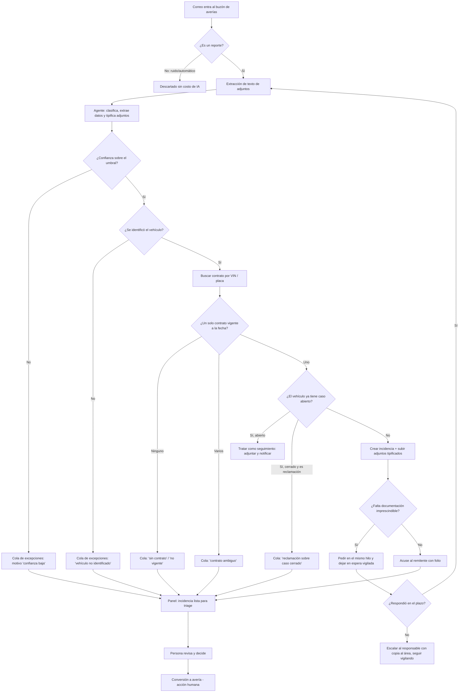
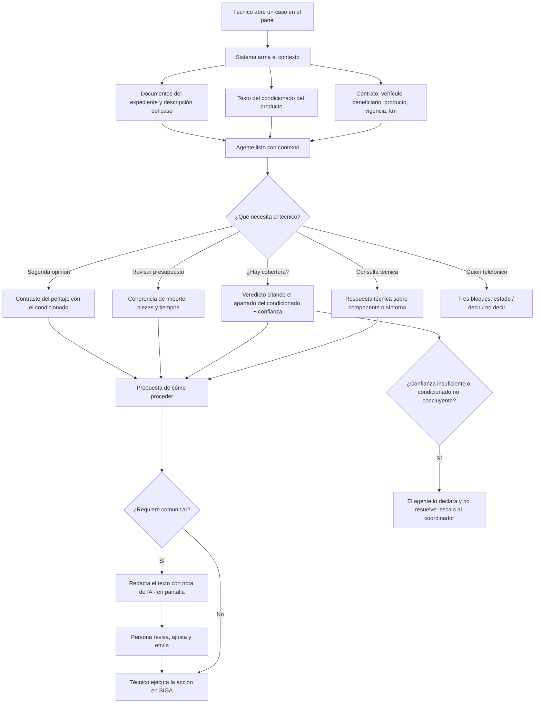
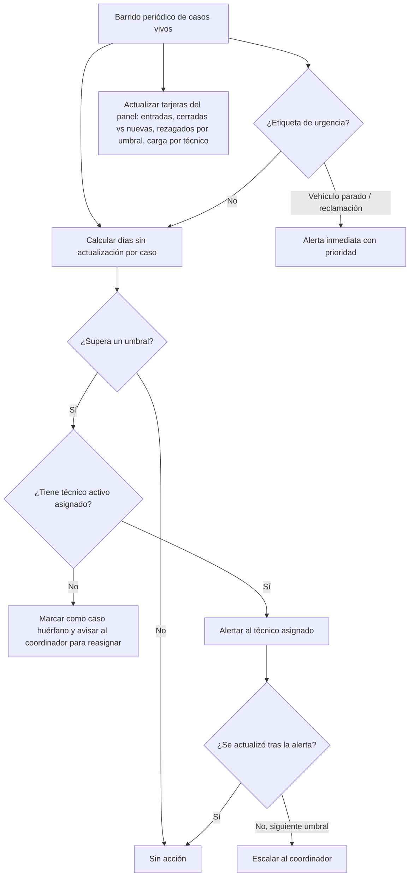

# PRD - Copiloto de Averías: ingesta automática, agente técnico de IA y panel de alertas

| **Campo** | **Detalle** |
| --- | --- |
| **Proyecto** | Copiloto de Averías — ingesta automática de reportes, agente técnico de IA y panel de alertas y seguimiento |
| **Área / empresa** | EngineCX (alcance operativo: SIGA, todos los países) |
| **Versión** | v0.1 |
| **Fecha** | 2026-08-25 |
| **Autores** | Omar André Lara Saldaña (omar.lara@enginecx.com) |
| **Revisión / liderazgo** | Aldo Álvarez — Director de TI *(por confirmar, ver §14)* |
| **Tipo de proyecto** | Automatización interna (n8n) + Feature web/API |

## 1. Resumen ejecutivo

El **Copiloto de Averías** es un desarrollo interno de EngineCX que busca reducir el tiempo y el esfuerzo manual que hoy invierte el equipo de averías en tres puntos del proceso: **capturar** el reporte que llega por correo, **decidir técnicamente** qué hacer con él, y **no perder de vista** los casos que se quedan atorados. No sustituye el módulo de Seguimiento de Averías de SIGA: lo alimenta, lo consulta y lo vigila.

El insumo de requerimientos de este PRD es la documentación operativa de un sistema equivalente ya en producción en **Garantía Global (Grupo Globartia, España)**, compuesto por un asistente de tramitación con 13 modos de uso y una decena de automatizaciones de correo. De ese material se toman las **tareas y funcionalidades** —qué hace el sistema y por qué—, no su implementación: aquel sistema automatiza sobre una intranet sin API mediante robots que simulan a un humano en pantalla (RPA), mientras que aquí se construye sobre la **API de SIGA**, con **n8n** para el correo y un **agente de IA** en lugar de un proyecto de chat operado a mano.

El problema concreto es de **eficiencia y de continuidad**. Hoy un reporte que entra por correo lo transcribe una persona a SIGA; el técnico que recibe el caso no siempre tiene el criterio mecánico para resolverlo y redacta las resoluciones a mano en una herramienta externa; y el módulo no emite alertas, por lo que un caso asignado a alguien ausente puede quedarse sin atender sin que nadie lo note.

El **MVP** cubre tres bloques: **(A)** una ingesta que convierte un correo en **incidencia** de SIGA con sus adjuntos ya clasificados y un acuse automático al remitente; **(B)** un **agente de IA** que, con el expediente y el condicionado ya cargados como contexto, responde las consultas técnicas y de cobertura del equipo y le propone cómo proceder; y **(C)** un **panel de alertas y seguimiento** con la cola de excepciones, las averías rezagadas y el estado de cada caso. Quedan para fases posteriores la generación de documentos oficiales, la notificación proactiva al cliente y los canales de WhatsApp y voz.

El resultado esperado es que el equipo deje de teclear reportes, deje de redactar desde cero y deje de descubrir tarde los casos atorados; y que ninguna avería quede sin seguimiento por ausencia de personal. La regla que gobierna todo el desarrollo es la que ya trae la propia API de SIGA: **el agente nunca convierte una incidencia en avería por su cuenta; eso es acción humana.**

**Correo entra** → **agente clasifica y valida contrato** → **incidencia creada en SIGA con adjuntos** → **panel: triage humano** → **conversión a avería** → **copiloto asiste al técnico** → **alertas hasta el cierre**

## 2. Contexto y problema

- **Cómo funciona hoy.** SIGA cuenta con el módulo **Seguimiento de Averías**, donde la avería se abre, se asigna a un técnico, se le cargan anexos (almacenados en S3), se le da seguimiento y se cierra. El coordinador técnico tiene visibilidad global y capacidad de reasignar; el técnico gestiona las averías asignadas a él. Los analistas de call center consultan. Los reportes llegan por **correo** y por **teléfono**, y alguien los captura manualmente en el sistema.
- **Dolor 1 — captura manual.** Cada reporte que llega por correo se transcribe a mano: datos del vehículo, kilometraje, descripción del fallo, y la carga de los adjuntos uno por uno. Es trabajo repetitivo, es el punto donde se introduce el error de dedo, y es tiempo del equipo que no se dedica a resolver.
- **Dolor 2 — falta de criterio técnico a la mano.** El técnico que recibe una avería no siempre domina la mecánica o la electrónica del caso, ni tiene el condicionado presente. Hoy resuelve consultando a compañeros o al coordinador, y **redacta la resolución a mano en una herramienta externa a SIGA**, transcribiendo datos que ya viven en el sistema. Eso genera trabajo repetitivo, riesgo de error de formato y de datos, y pérdida de trazabilidad porque el documento no queda asociado a la avería.
- **Dolor 3 — ausencia de alertas y casos huérfanos.** El módulo no avisa. Se abre una avería y el técnico no recibe ninguna notificación. Si el técnico se ausenta o deja la empresa, sus casos quedan sin visibilidad para los demás y nadie puede informar su estatus. No existe un semáforo de "qué llevo sin tocar hace más de N días".
- **Dolor 4 — el sistema es reactivo, no proactivo.** No hay un mecanismo que informe al cliente cuando su expediente avanza. En la operación de referencia esto se traduce en que **~60% de los casos que entran por correo terminan además en una llamada** porque el cliente no queda satisfecho con la respuesta, y en un **32% de llamadas abandonadas** sobre ~28.300 llamadas anuales. *(Cifras de la operación de Garantía Global, aportadas como referencia del tipo de dolor; la línea base propia está pendiente de medir — ver §12.)*
- **Por qué ahora.** Existe ya una API de SIGA que expone contratos, incidencias, averías y documentos; existe n8n con conectividad de correo; y existe acceso a la API de Claude. Las tres piezas que antes obligaban a un RPA frágil hoy están disponibles, y hay un sistema de referencia en producción del que se pueden tomar requerimientos ya validados en la operación real en lugar de diseñarlos desde cero.

### Distinciones de dominio que el equipo dev debe entender desde el día 1

| Concepto | Significado |
| --- | --- |
| **Incidencia** vs. **avería** | La **incidencia** es el primer contacto: se registra con el contrato, el vehículo, la descripción y el kilometraje, nace en estado inicial y **no cuenta en las métricas del área**. La **avería** es el expediente formal, y solo nace cuando alguien convierte la incidencia. Esta distinción no la inventa este PRD: ya está modelada en la API de SIGA. |
| **Consultar** vs. **gestionar** | *Consultar* es ver el detalle, el último estatus y los documentos (solo lectura). *Gestionar* es editar estatus, subir documentos y agregar seguimiento. El copiloto y el panel amplían la **consulta** y la **asistencia**; la gestión sigue sujeta a los permisos actuales de SIGA. |
| **El agente informa, el humano decide** | El agente de IA extrae datos, clasifica, resume y **propone**. No autoriza reparaciones, no determina cobertura por sí solo, no compromete importes y **no convierte una incidencia en avería**. Toda acción con efecto de negocio requiere una persona. |
| **Excepción** vs. **error** | Una **excepción** es un caso que el agente no pudo resolver o sobre el que no tiene confianza suficiente (vehículo no identificado, confianza baja, contrato ambiguo, condicionado no concluyente): es un resultado válido del proceso, y debe ser **notificada de inmediato** a una persona además de quedar visible y accionable. Un **error** es un fallo técnico del pipeline: alerta inmediata al equipo de TI. Nunca se confunden, nunca se silencian y nunca esperan a que alguien los descubra. |

## 3. Objetivo del producto

Reducir el tiempo y el esfuerzo manual del equipo de averías de EngineCX en el ciclo completo de un caso, mediante tres capacidades integradas sobre la API de SIGA: **(1)** una ingesta automática que convierte los reportes que llegan por correo en incidencias con su documentación ya adjunta y clasificada, sin captura manual; **(2)** un agente de IA que asiste al técnico con criterio técnico y de cobertura, con el expediente y el condicionado ya cargados como contexto, y que le propone cómo proceder y le redacta las comunicaciones; y **(3)** un panel de alertas y seguimiento que hace visible lo que hoy no avisa: la cola de excepciones, los casos rezagados y los casos huérfanos.

La mejora se mide en **tiempo de captura por reporte**, **tiempo desde la llegada del reporte hasta su registro**, **proporción de reportes registrados sin intervención manual** y **antigüedad media de las averías sin actualizar** (§12). El principio rector, heredado del sistema de referencia y ya presente en el contrato de la API de SIGA, es que **el agente decide flujo, nunca decide cobertura ni dinero**.

### 3.1 Estrategia de implementación por fases

| Fase | Nombre | Contenido | Estado |
| --- | --- | --- | --- |
| **Fase 1** | **MVP — Ingesta, copiloto y alertas** | Ingesta de correo a incidencia con adjuntos y acuse; agente de IA con contexto del expediente sobre los modos de consulta y propuesta; panel con cola de excepciones, vista de rezagadas y seguimiento de casos. | **Alcance de este PRD** |
| **Fase 2** | Documentos y proactividad | Generación de la resolución y del finiquito desde el sistema, con plantillas y trazabilidad en el expediente; notificación proactiva al cliente en los hitos del caso y portal de consulta de estado. | Posterior |
| **Fase 3** | Canales y cobertura | Canal de WhatsApp y atención de voz; extensión del copiloto a los modos que exigen cálculo de depreciación e importes; ingesta desde el canal del taller. | Posterior |

La separación no es arbitraria: la Fase 1 solo necesita **leer** de SIGA y **crear incidencias**; la Fase 2 requiere capacidades de escritura sobre la avería que hoy la API no expone (§10 y §14); y la Fase 3 depende de decisiones de negocio sobre canales y de reglas de importes que deben validarse con el área.

## 4. Usuarios y actores

| **Usuario / Actor** | **Rol en el proceso** |
| --- | --- |
| **Técnico** | Usuario principal del copiloto. Gestiona las averías asignadas a él, consulta al agente el criterio técnico y de cobertura, y recibe las alertas de sus casos rezagados. |
| **Coordinador técnico** | Supervisa la cola de excepciones y el panel global, convierte incidencias en averías, asigna y reasigna casos. Es el responsable de que ninguna incidencia se quede sin resolver. |
| **Analista de call center** | Consulta el estado de un caso para informar al cliente. Consume el modo de "resumen para front telefónico" del agente: qué está pasando, qué se le puede decir al cliente y qué no. |
| **Analista de garantías / operación-postventa** | Da seguimiento a los casos, recibe la documentación que llega después de la aceptación y revisa la evidencia incorporada. |
| **Taller** | Aporta evidencia técnica (fotos, presupuestos, órdenes de entrada, dictámenes). Es remitente frecuente de los correos que entran a la ingesta. |
| **Cliente / beneficiario** | Origen del reporte. Recibe el acuse automático en el MVP; en Fase 2, las notificaciones de avance. |
| **Administrador general** | Administra roles y permisos, y la lista de personas autorizadas a usar el copiloto. |
| **TI / Desarrollo (Engine)** | Construye y opera el pipeline y el panel; recibe las alertas de fallo técnico; mantiene el prompt del agente y su versionado. |
| **Sistema — Gmail** | Buzón de entrada de los reportes. Fuente del disparo del proceso. |
| **Sistema — n8n** | Orquestador de la ingesta: recibe el correo, llama al agente, llama a la API de SIGA, responde el acuse y registra el resultado. |
| **Sistema — API de SIGA** | Fuente de verdad del contrato, la incidencia, la avería y sus documentos. Todo lo que el copiloto muestra o registra pasa por aquí. |
| **Sistema — Agente de IA (API de Claude)** | Clasifica y extrae datos del correo y de sus adjuntos; responde las consultas del equipo; propone cómo proceder. No ejecuta acciones de negocio. |

## 5. Alcance MVP y funcionalidades

### A. Ingesta automática de reportes por correo

| **Funcionalidad** | **Descripción** |
| --- | --- |
| A1. Disparo por correo entrante | El proceso se activa **al llegar el correo** al buzón de averías, no por revisión periódica. Cada correo se procesa una sola vez, con el identificador del mensaje como clave de idempotencia. |
| A2. Descarte de ruido sin costo de IA | Antes de invocar al agente se descartan por regla los correos que no son reportes (avisos automáticos, rebotes, publicidad, correos de otros procesos). |
| A3. Lectura de adjuntos | Se extrae el texto de los adjuntos (PDF, imagen, documento, hoja de cálculo) y se descartan los adjuntos decorativos (logotipos, firmas, iconos) para que no ensucien el análisis ni el expediente. |
| A4. Clasificación del reporte | El agente clasifica el correo en **apertura / seguimiento / otro**, con un **nivel de confianza explícito**. Por debajo del umbral configurado, el caso va a la cola de excepciones sin crear nada. |
| A5. Extracción de datos | El agente extrae: identificador del vehículo (VIN y/o placa), número de caso si se menciona, kilometraje, descripción del fallo, datos de contacto del remitente, fechas relevantes, un resumen redactado y una **etiqueta de urgencia** (reclamación, vehículo parado, urgente). |
| A6. Clasificación de cada adjunto | Cada adjunto se etiqueta contra el catálogo de tipos de documento de SIGA, de modo que llegue al expediente ya tipificado y no como "varios". |
| A7. Identificación del contrato | Con el VIN y/o la placa se localiza el contrato del vehículo y se **valida su vigencia** a la fecha del reporte. Si hay más de un contrato vigente, o ninguno, el caso va a excepciones: **no se adivina**. |
| A8. Creación de la incidencia | Con el contrato resuelto se crea la **incidencia** en SIGA con la descripción y el kilometraje, y se le suben los adjuntos ya tipificados. La incidencia **no es una avería** y no afecta métricas del área. |
| A9. Detección de duplicados y de seguimientos | Antes de crear una incidencia se verifica si el vehículo ya tiene un caso abierto. Si lo tiene, el correo se trata como **seguimiento** de ese caso y no se duplica el expediente. |
| A10. Reclamación sobre caso cerrado | Si el reporte es una queja o reclamación sobre un caso ya cerrado, **nunca** se reabre ni se crea un caso nuevo: se marca y se envía a la cola de excepciones para decisión humana. |
| A11. Acuse automático al remitente | El remitente recibe una respuesta inmediata en el mismo hilo confirmando la recepción, con el folio de la incidencia y —si aplica— **la lista de lo que falta** para poder avanzar. |
| A12. Reclamo de documentación faltante | Si falta un dato o documento imprescindible, se pide en el mismo hilo y el caso queda **en espera con vigilancia**: cada respuesta del remitente se re-evalúa y se completa el expediente sin volver a empezar. |
| A13. Escalado con reloj | Si un caso en espera no recibe respuesta en el plazo configurado, se notifica al responsable **con copia al área** y el caso permanece vigilado; no se abandona ni se cierra por silencio. |
| A14. Cola de excepciones | Todo lo que el agente no pudo resolver queda registrado con **su motivo** (confianza baja, vehículo no identificado, sin contrato, contrato no vigente, múltiples contratos, caso cerrado, tipo no reconocido) y es visible y accionable en el panel. |
| A15. Notificación inmediata de la excepción | Registrar la excepción **no es suficiente**: al momento de generarse se notifica a la persona responsable con el motivo, el correo original y la acción esperada. El sistema nunca espera a que alguien descubra el caso revisando una pantalla. |
| A16. Remisión por desconfianza del agente | Si el agente tiene dudas sobre su propia lectura del reporte —confianza por debajo del umbral, datos contradictorios, adjuntos ilegibles—, **remite el caso a una persona en ese momento** en lugar de resolverlo con lo que tiene. Es preferible una remisión de más que un expediente mal deliberado. |

### B. Agente de IA copiloto del equipo técnico

| **Funcionalidad** | **Descripción** |
| --- | --- |
| B1. Contexto del expediente inyectado | Al abrir un caso, el agente recibe automáticamente el contrato (vehículo, beneficiario, producto, canal, fechas, kilometraje de contratación), el **texto del condicionado**, la lista de documentos y la descripción y el histórico del caso. **El usuario no copia ni pega nada.** |
| B2. Consulta técnica | Preguntas de mecánica y electrónica sobre un componente o un síntoma, con o sin expediente asociado. |
| B3. Análisis de evidencia visual | A partir de las fotos del expediente, identifica el componente, su estado y la causa probable, e indica si el caso amerita inspección o peritaje. |
| B4. Verificación de cobertura | Determina si el elemento reportado está o no amparado, **citando el apartado del condicionado** en el que se funda. Devuelve su nivel de confianza y, cuando el condicionado no alcanza para concluir, lo dice en lugar de resolver. |
| B5. Control documental | Revisa el presupuesto u orden de reparación del taller: coherencia del importe, correspondencia de piezas y referencias, y si los tiempos de mano de obra cuadran con el baremo de referencia. |
| B6. Propuesta de cómo proceder | Además de responder, **propone la siguiente acción**: pedir documentación, enviar a peritaje, aceptar, rehusar, cerrar por falta de documentación. |
| B7. Redacción de comunicaciones | Genera el texto de los correos al cliente, al taller y al perito, con el tono y la estructura definidos por el área. En el MVP la salida es **texto en pantalla** para que la persona lo revise, ajuste y envíe. |
| B8. Resumen para front telefónico | Devuelve **tres bloques separados**: estado del expediente (uso interno), guion para el cliente (solo lo comunicable y consolidado) y **no trasladar al cliente** (notas internas, sospechas de fraude, importes no aprobados, resoluciones no notificadas). Ante la duda, el dato va al tercer bloque. |
| B9. Segunda opinión sobre un peritaje | Contrasta el informe recibido con el condicionado y con la evidencia, y señala los puntos a cuestionar. |
| B10. Consulta de procedimiento interno | Responde cómo se gestiona un producto o una figura concreta, según los procedimientos del área. |
| B11. Nota de transparencia de IA | Toda salida del agente destinada a un tercero incorpora la indicación de que fue elaborada con asistencia de IA y validada por una persona. No se omite ni se abrevia. |
| B12. Anonimización de datos personales | El agente no reproduce identificadores oficiales, datos de contacto, datos bancarios ni datos de salud en sus respuestas; referencia los casos por su folio. |
| B13. Prompt versionado | El comportamiento del agente vive en un prompt versionado con un juego de casos de prueba, de modo que un ajuste no degrade el comportamiento sin que nadie lo note. |

### C. Panel de alertas y seguimiento de casos

| **Funcionalidad** | **Descripción** |
| --- | --- |
| C1. Bandeja de excepciones | Lista de todo lo que la ingesta no pudo resolver, con motivo, antigüedad, remitente y acceso al correo original. Es la pantalla de trabajo del coordinador. |
| C2. Resolución de una excepción | Sobre una excepción, la persona puede completar el dato que faltaba (típicamente el vehículo o el contrato) y disparar la creación de la incidencia, sin salir del panel. |
| C3. Conversión a avería | La conversión de incidencia a avería se ejecuta desde el panel y es **siempre** una acción humana, con registro de quién y cuándo. |
| C4. Vista de casos por antigüedad | Listado de casos vivos ordenado **de más antiguo a más reciente** —el primero es por donde hay que empezar—, con los **días sin actualizar** y semáforo por antigüedad. |
| C5. Vista "mis casos / todos" | Por defecto cada técnico ve los suyos; puede alternar a la vista global para consultar cualquier caso y conocer su estatus. La escritura sigue restringida por los permisos de SIGA. |
| C6. Alertas configurables | Avisos por umbrales de antigüedad sin actualización, por etiqueta de urgencia (vehículo parado, reclamación) y por caso sin asignar. Llegan al técnico y, escalando, al coordinador. |
| C7. Detección de casos huérfanos | Identificación de casos asignados a personal inactivo o ausente, para que el coordinador los reasigne antes de que se atoren. |
| C8. Indicadores del área | Tarjetas con entradas del día, cerradas frente a nuevas entradas y su tendencia, casos rezagados por umbral (más de 7, 14 y 30 días sin actualizar) y carga por técnico. |
| C9. Filtro por ámbito | Todas las vistas respetan el ámbito del usuario (proyecto, país, distribuidor) y permiten filtrar por cliente o distribuidor **como parámetro**, no como una copia del reporte por cliente. |
| C10. Trazabilidad de la ingesta | Por cada correo procesado queda registrado: fecha, identificador del mensaje, clasificación, confianza, vehículo, contrato resuelto, resultado y motivo. Auditable y exportable. |

### Principio que NO debe romperse en el MVP

> **El agente nunca ejecuta una acción con efecto de negocio.** No convierte incidencias en averías, no cambia estatus, no autoriza reparaciones, no determina cobertura de forma vinculante y no compromete importes. Crea incidencias (que por diseño no afectan métricas), adjunta documentación, propone y redacta. Todo lo demás lo ejecuta una persona, y queda registrado quién.
>
> **Corolario operativo — ningún fallo es silencioso y nada espera a ser descubierto.** Un caso que el agente no puede resolver, o sobre el que no tiene confianza suficiente, **se remite y se notifica de inmediato** a una persona: aparece en la cola de excepciones **y** genera un aviso con su motivo. Un fallo técnico del pipeline **siempre** alerta a TI. La ausencia de noticias nunca significa que todo está bien.
>
> **No hay casos mal deliberados.** Ante la duda, el agente no resuelve: remite. Una remisión innecesaria cuesta minutos de una persona; un expediente resuelto con criterio equivocado cuesta la relación con el cliente. La asimetría es deliberada y el sistema debe preferir siempre remitir.

## 6. Fuera de alcance

| **Excluido del MVP** | **Por qué / qué lo habilitaría** |
| --- | --- |
| Sustituir o duplicar el módulo de Seguimiento de Averías de SIGA | SIGA es y sigue siendo la fuente de verdad del expediente. El panel **complementa** (triage, alertas, copiloto) y no replica la ficha, el visor de documentos ni la gestión. Requiere acordar el reparto de responsabilidades entre panel y SIGA (§14). |
| Cierre, rehúse o aceptación automáticos de un caso | Es una decisión con efecto económico y contractual. Lo habilitaría un circuito de aprobación explícito con un responsable nombrado, más un histórico que demuestre que el agente acierta. |
| Cálculo y compromiso de importes, depreciación e indemnización | Depende de reglas de negocio (tablas de desgaste, exenciones por canal, umbrales de revisión, impuesto aplicable) que aún no están validadas para nuestra operación (§14). Fase 3. |
| Generación de la resolución y del finiquito en PDF | Requiere plantillas aprobadas y capacidad de escritura documental sobre la avería. Ya existe un PRD de plantillas de resolución en SIGA con el que hay que alinearse antes de construir. Fase 2. |
| Notificación proactiva al cliente y portal de consulta de estado | Es la mejora de mayor impacto sobre las llamadas, pero depende de definir los hitos que se comunican y el canal, y de un mecanismo de eventos (§10). Fase 2. |
| Canal de WhatsApp y atención de voz | Añaden superficie de integración y de seguridad que el MVP no necesita para demostrar valor. Fase 3. |
| Ingesta de altas, renovaciones y activaciones de contrato | Es otro dominio (venta y contratación), con su propia API y sus propias reglas. No se mezcla con averías. |
| Sustituir al equipo de call center | El copiloto le da mejor información para atender; no atiende por él. |
| Automatización por RPA o scraping | Existe API. Ningún componente de este desarrollo simula a un usuario en pantalla. |
| Informes recurrentes en hoja de cálculo enviados por correo | El sistema de referencia mantiene cuatro procesos solo para responder "¿por dónde empiezo?". Aquí eso son vistas y alertas del panel. |
| Réplica de la base de datos de contratos | Duplicar el padrón introduce una segunda verdad, desfase y datos personales fuera de su origen. La identificación del vehículo se resuelve contra la API, con una tabla puente de correlación si hace falta (§10). |
| Auditoría de consultas (quién vio qué caso) | No se registra en el MVP; se evalúa después si el área o auditoría lo requieren. |

## 7. Flujos principales

### 7.1 Ingesta del reporte y triage

Es el flujo central del MVP. La decisión clave es doble: primero si el agente entendió el reporte con suficiente confianza, y después si el vehículo resolvió a **un** contrato vigente. Cualquier respuesta negativa termina en la cola de excepciones, nunca en un registro a medias.

### 7.2 El copiloto asistiendo al técnico

El valor del flujo está en que el contexto se arma solo. La persona nunca transcribe el expediente ni busca el condicionado: elige qué quiere y el agente ya tiene con qué responder.

### 7.3 Alertas, rezagados y casos huérfanos

Este flujo es lo que hoy no existe: un vigilante que mira el conjunto y avisa antes de que el caso se atore.

## 8. Requerimientos funcionales

| **ID** | **Requerimiento** | **Descripción** |
| --- | --- | --- |
| RF-01 | Disparo por correo entrante | El sistema procesa cada correo del buzón de averías al momento de su llegada, sin depender de una revisión periódica. |
| RF-02 | Idempotencia por mensaje | Un mismo correo nunca se procesa dos veces, aun si el pipeline se reintenta o se reinicia. La clave es el identificador del mensaje. |
| RF-03 | Filtro previo sin costo de IA | El sistema descarta por regla los correos que no son reportes antes de invocar al agente. |
| RF-04 | Extracción de contenido de adjuntos | El sistema obtiene el texto de los adjuntos legibles y excluye los adjuntos decorativos del análisis y del expediente. |
| RF-05 | Clasificación con confianza explícita | El agente devuelve el tipo de reporte y un nivel de confianza numérico. El umbral es configurable sin desplegar código. |
| RF-06 | Extracción de datos del reporte | El agente devuelve VIN y/o placa, kilometraje, descripción, contacto, número de caso si existe, resumen y etiqueta de urgencia. |
| RF-07 | Tipificación de adjuntos | Cada adjunto se etiqueta contra el catálogo de tipos de documento de SIGA antes de subirse. |
| RF-08 | Resolución de vehículo a contrato | El sistema localiza el contrato a partir del VIN y/o la placa y valida su vigencia a la fecha del reporte. |
| RF-09 | No decidir ante ambigüedad | Si hay más de un contrato vigente, o ninguno, el sistema no crea nada y registra la excepción con su motivo. |
| RF-10 | Creación de incidencia con adjuntos | Con el contrato resuelto, el sistema crea la incidencia en SIGA y le sube los adjuntos ya tipificados. |
| RF-11 | Detección de caso abierto previo | Antes de crear una incidencia, el sistema verifica si el vehículo tiene un caso abierto; si lo tiene, trata el correo como seguimiento. |
| RF-12 | No reapertura de casos cerrados | Una reclamación sobre un caso cerrado nunca crea un caso nuevo ni reabre el anterior: genera una excepción. |
| RF-13 | Acuse automático | El remitente recibe respuesta en el mismo hilo con el folio y, si aplica, la lista de lo faltante. |
| RF-14 | Espera vigilada por documentación | Un caso incompleto queda en espera; cada respuesta del remitente se re-evalúa y completa el expediente sin reiniciar el proceso. |
| RF-15 | Contador de reclamos y escalado | Cada caso en espera registra cuántas veces se ha reclamado y escala al responsable, con copia al área, al vencer el plazo. |
| RF-16 | Cola de excepciones accionable | Toda excepción es visible en el panel con su motivo, su antigüedad y acceso al correo original, y puede resolverse desde ahí. |
| RF-16b | Notificación inmediata de excepciones | Al generarse una excepción, el sistema notifica en ese momento a la persona responsable, indicando el motivo, el caso o correo afectado y la acción esperada. Ninguna excepción depende de que alguien revise una pantalla para ser conocida. |
| RF-17 | Conversión humana a avería | La conversión de incidencia a avería solo la ejecuta una persona, y queda registrado quién y cuándo. |
| RF-18 | Contexto automático del agente | Al abrir un caso, el sistema arma el contexto del agente con contrato, condicionado, documentos e histórico, sin intervención del usuario. |
| RF-19 | Modos de consulta del agente | El agente atiende: consulta técnica, análisis de evidencia visual, verificación de cobertura con cita del condicionado, control documental, segunda opinión sobre peritaje, procedimiento interno y resumen para front telefónico. |
| RF-20 | Propuesta de siguiente acción | Toda respuesta del agente sobre un caso concreto incluye una propuesta de cómo proceder. |
| RF-21 | Declaración de incertidumbre | Si el condicionado no alcanza para concluir o la confianza es insuficiente, el agente lo declara, **no emite veredicto** y remite el caso a una persona en ese momento. |
| RF-21b | Remisión por desconfianza | Ante datos contradictorios, adjuntos ilegibles o confianza bajo el umbral, el agente remite el caso a una persona en lugar de resolverlo con información insuficiente. La remisión registra el motivo de la desconfianza. |
| RF-22 | Redacción de comunicaciones en pantalla | El agente genera el texto de las comunicaciones como salida revisable; no las envía. |
| RF-23 | Tres bloques del guion telefónico | El modo de front telefónico separa siempre estado interno, guion comunicable y lo que no debe trasladarse al cliente. |
| RF-24 | Nota de transparencia de IA | Toda salida destinada a un tercero incluye la indicación de contenido asistido por IA validado por una persona. |
| RF-25 | Anonimización en las respuestas | El agente no reproduce datos personales identificativos ni bancarios en sus respuestas; usa el folio del caso como referencia. |
| RF-26 | Vista de casos por antigüedad | El panel lista los casos vivos del más antiguo al más reciente, con días sin actualizar y semáforo por antigüedad. |
| RF-27 | Alternancia mis casos / todos | El técnico ve por defecto sus casos y puede alternar a la vista global de consulta. |
| RF-28 | Alertas por umbral y por urgencia | El sistema notifica por antigüedad sin actualización, por etiqueta de urgencia y por caso sin asignar, escalando al coordinador si no hay reacción. |
| RF-29 | Detección de casos huérfanos | El sistema identifica los casos asignados a personal inactivo o ausente y los reporta para reasignación. |
| RF-30 | Indicadores del área | El panel muestra entradas del día, cerradas frente a nuevas entradas con tendencia, rezagados por umbral y carga por técnico. |
| RF-31 | Filtro por ámbito y por cliente | Las vistas respetan el ámbito del usuario y permiten filtrar por cliente o distribuidor de forma parametrizada. |
| RF-32 | Registro de trazabilidad de la ingesta | Cada correo procesado deja un registro consultable y exportable con su resultado y su motivo. |
| RF-33 | Alerta de fallo técnico a TI | Un fallo del pipeline (API no disponible, agente sin respuesta, error de subida) genera alerta a TI; nunca se resuelve en silencio. |
| RF-34 | Umbrales y plazos configurables | Umbrales de confianza, plazos de escalado y umbrales de antigüedad se configuran sin desplegar código. |
| RF-35 | Prompt versionado con casos de prueba | El comportamiento del agente está versionado y cuenta con un juego de casos de regresión que se ejecuta antes de publicar un cambio. |

## 9. Requerimientos no funcionales

| **Categoría** | **Requerimiento** |
| --- | --- |
| **Seguridad** | Toda llamada a la API de SIGA se autentica con el esquema vigente (token de portador, con renovación). Las credenciales y las claves de API viven en un gestor de secretos, **nunca en el código ni en archivos de configuración en texto plano**. |
| **Permisos** | El agente y el pipeline operan con una identidad de servicio de **mínimo privilegio**: lectura de contratos, catálogos, incidencias, averías y documentos; escritura únicamente de incidencias y de sus documentos. Sin permiso de conversión, cambio de estatus ni cierre. El panel respeta el ámbito (proyecto, país, distribuidor) y los roles ya definidos en SIGA. |
| **Trazabilidad** | Toda acción del sistema queda registrada con fecha, actor (persona o servicio), caso afectado, resultado y motivo. Las acciones humanas registran el usuario. Las respuestas del agente registran la versión del prompt y del modelo con la que se generaron. |
| **Manejo de fallos** | Distinción obligatoria entre **excepción de negocio** (va a la cola visible) y **fallo técnico** (alerta a TI). Reintentos con espera creciente en las llamadas a la API y al agente. Un fallo en un caso nunca detiene el procesamiento de los demás. |
| **Prohibición de fallo silencioso** | El pipeline emite una señal de vida periódica. Si deja de procesar, el panel lo muestra y TI recibe alerta. **La ausencia de errores no se interpreta como funcionamiento correcto.** |
| **Comunicación inmediata** | Toda excepción de negocio y todo fallo técnico se comunican en el momento en que ocurren a un destinatario definido, con su motivo y la acción esperada. Ningún caso queda esperando a ser descubierto. Los destinatarios y los canales de aviso son configurables por tipo de excepción. |
| **Sesgo hacia la remisión** | Ante incertidumbre, el sistema remite a una persona en lugar de decidir. Una tasa de remisión alta es un resultado aceptable del MVP; un caso mal deliberado no lo es. |
| **Idempotencia** | Ninguna operación de escritura puede duplicar un registro si se reintenta. Aplica al procesamiento del correo, a la creación de la incidencia y a la subida de documentos. |
| **Privacidad** | Los datos personales del beneficiario no se almacenan fuera de SIGA. El agente los anonimiza antes de razonar y no los reproduce en sus respuestas. Los adjuntos permanecen en el almacenamiento de SIGA; el pipeline los maneja en tránsito y no los retiene. Los prompts y respuestas que se conserven para auditoría se guardan anonimizados. |
| **Cumplimiento de IA** | Toda salida destinada a un tercero lleva la indicación de contenido asistido por IA validado por una persona, conforme a las obligaciones de transparencia aplicables. La indicación no se omite ni se abrevia. |
| **Disponibilidad** | El pipeline de ingesta opera de forma continua (los reportes llegan a cualquier hora). El panel y el copiloto se requieren disponibles en horario operativo. La degradación es admisible: si el agente no responde, el correo queda en excepciones, no se pierde. |
| **Desempeño** | El acuse al remitente se emite en minutos desde la llegada del correo, no en horas. El panel responde con filtrado y paginación **del lado del servidor**, sin descargar conjuntos completos de datos. |
| **Observabilidad** | Métricas de volumen procesado, tasa de resolución automática, tasa de excepciones por motivo, latencia por etapa y consumo de IA, visibles para TI y para el área. |
| **Costo** | El consumo de IA se acota: filtro previo sin IA, contexto recortado a lo necesario y tope de gasto con alerta. El costo por reporte procesado es una métrica de seguimiento (§12). |
| **Escalabilidad** | El diseño soporta el crecimiento por país y por proyecto sin duplicar el proceso: cliente, distribuidor y país son parámetros, no copias del flujo. |
| **Mantenibilidad** | Nada de lógica de negocio duplicada entre componentes. Catálogos (tipos de documento, técnicos, motivos de excepción) se consumen de su fuente, no se copian. |

## 10. Integraciones y datos

### Integraciones

| **Sistema** | **Qué se espera** | **Notas** |
| --- | --- | --- |
| **API de SIGA — Authentication** | Autenticación de servicio y del panel; validación de token; catálogo de roles. | Se confirmó que la API exige token de portador. La renovación de token debe estar contemplada en el pipeline. |
| **API de SIGA — Contracts** | **Lectura.** Localizar el contrato del vehículo; leer vehículo, beneficiario, canal, producto y vigencia; obtener el **texto del condicionado** para alimentar al agente. | La disponibilidad del texto del condicionado es lo que hace viable la verificación de cobertura sin procesar PDFs por nuestra cuenta. |
| **API de SIGA — Claims (Issues)** | **Lectura y escritura.** Crear la incidencia, subir sus documentos, consultar y actualizar el estado de triage. Consultar incidencias por vehículo. | Es la única superficie de escritura del MVP. La conversión a avería la ejecuta una persona. |
| **API de SIGA — Claims (Averías y documentos)** | **Lectura.** Listar y filtrar casos por estatus, técnico, antigüedad y ámbito; consultar documentos del expediente. | El filtrado y la paginación se hacen del lado del servidor. |
| **API de SIGA — Catalogs** | **Lectura.** Tipos de documento, distribuidores, asesores, marcas y modelos, proyectos, ubicaciones. | Los catálogos se consumen, no se replican. |
| **Gmail (buzón de averías)** | **Lectura y respuesta.** Recepción por notificación de llegada; lectura del cuerpo y adjuntos; respuesta en el mismo hilo; etiquetado por resultado. | El buzón es el disparador del proceso. No se borra correspondencia. |
| **n8n** | Orquestación del pipeline de ingesta, de la espera vigilada, del escalado y del barrido de alertas. | Aloja el agente de IA de la ingesta. |
| **API de Claude** | Clasificación y extracción en la ingesta; respuestas del copiloto. | Un solo prompt versionado por función, con casos de regresión. |
| **Alojamiento del panel** | Publicación del panel como aplicación web. | Sirve también, en Fase 2, el portal de consulta del cliente. |

### Entidades y datos mínimos

| **Entidad** | **Campos clave** |
| --- | --- |
| **Reporte entrante** | Identificador del mensaje, remitente, fecha, asunto, cuerpo, adjuntos, clasificación, confianza, resultado, motivo de excepción. |
| **Contrato** | Identificador, estatus, vigencia (inicio y fin), producto, distribuidor, canal, asesor; vehículo (VIN, placa, marca, modelo, año, kilometraje de contratación); beneficiario (tipo, contacto). |
| **Incidencia** | Identificador, contrato, vehículo, descripción, kilometraje, estatus de triage, quién la registró, fecha, avería vinculada si se convirtió. |
| **Avería** | Identificador, contrato, póliza, descripción, estatus, técnico asignado, fecha de creación, fecha de última actualización, enlace de seguimiento. |
| **Documento** | Identificador, caso al que pertenece, nombre, tipo de documento, fecha de carga, quién lo cargó, tamaño. |
| **Excepción** | Caso o correo asociado, motivo, antigüedad, responsable, estado de resolución, quién la resolvió. |
| **Alerta** | Caso, tipo (antigüedad, urgencia, sin asignar, huérfano), umbral disparado, destinatario, fecha, si hubo reacción. |
| **Interacción con el agente** | Caso, modo utilizado, versión de prompt y de modelo, resultado, si la persona lo aprovechó o lo descartó. |

### Esquema de permisos

| **Operación** | **Quién** |
| --- | --- |
| Leer contratos, catálogos, incidencias, averías y documentos | Identidad de servicio del pipeline y del panel, acotada al ámbito correspondiente. |
| Crear incidencia y subir documentos de incidencia | Identidad de servicio del pipeline. |
| Convertir incidencia en avería | **Solo persona** (coordinador técnico o rol equivalente), con registro. |
| Cambiar estatus, asignar técnico, cerrar, rehusar, autorizar, comprometer importes | **Fuera del alcance del sistema.** Se ejecuta en SIGA con los permisos actuales. |
| Enviar comunicaciones a cliente, taller o perito | **Solo persona.** El agente redacta; no envía. |
| Administrar umbrales, plazos y lista de usuarios autorizados | Administrador general / TI. |

### Dependencias abiertas de la API

Estas capacidades no están disponibles hoy y condicionan el alcance. Se detallan como preguntas abiertas en §14, y su resolución define qué entra en Fase 1 y qué se posterga:

1. **Búsqueda de contrato por placa.** El identificador consultable hoy es el VIN. La placa se captura al crear el contrato pero no se devuelve ni se puede filtrar. Y en México es un campo opcional, por lo que puede no estar poblada en parte del padrón.
2. **Contrato obligatorio al crear la incidencia.** Si el vehículo no resuelve, no se puede registrar el primer contacto. Sin un estado de "pendiente de identificación", el sistema necesita un almacén intermedio propio para esos casos.
3. **Seguimiento sobre una avería existente.** No hay forma de agregar una nota o una observación a un caso ya abierto, lo que limita el tratamiento automático de los correos de seguimiento.
4. **Cambio de estatus, cierre y asignación de técnico.** No expuestos; condicionan la Fase 2.
5. **Notificación de cambios (eventos).** Sin un mecanismo de eventos, la vigilancia y la futura proactividad al cliente dependen de consultas periódicas.

## 11. Eventos y registro de resultados

Registro de la operación del pipeline y del copiloto, para medir eficiencia y poder auditar. Campos comunes a todos los eventos: `fecha_hora`, `actor` (servicio o usuario), `pais`, `proyecto`, `resultado`, `motivo`.

| **Categoría** | **Evento** | **Campos propios** |
| --- | --- | --- |
| Ingesta | `reporte_recibido` | `mensaje_id`, `remitente`, `numero_adjuntos` |
| Ingesta | `reporte_descartado_por_regla` | `mensaje_id`, `regla` |
| Ingesta | `reporte_clasificado` | `mensaje_id`, `tipo`, `confianza`, `version_prompt`, `version_modelo` |
| Ingesta | `vehiculo_identificado` | `mensaje_id`, `vin`, `placa`, `fuente_del_dato` |
| Ingesta | `contrato_resuelto` | `mensaje_id`, `contrato_id`, `vigente`, `contratos_candidatos` |
| Ingesta | `incidencia_creada` | `mensaje_id`, `incidencia_id`, `contrato_id`, `documentos_subidos` |
| Ingesta | `documento_subido` | `incidencia_id`, `tipo_documento`, `tamano`, `clasificado_por` |
| Ingesta | `acuse_enviado` | `mensaje_id`, `incidencia_id`, `faltantes_declarados` |
| Excepciones | `excepcion_registrada` | `mensaje_id`, `motivo`, `etapa` |
| Excepciones | `excepcion_notificada` | `mensaje_id`, `motivo`, `destinatario`, `canal`, `segundos_desde_registro` |
| Excepciones | `caso_remitido_por_desconfianza` | `mensaje_id`, `motivo`, `confianza`, `etapa`, `version_prompt` |
| Excepciones | `excepcion_resuelta` | `mensaje_id`, `motivo`, `usuario`, `minutos_en_cola`, `accion` |
| Espera y escalado | `documentacion_solicitada` | `incidencia_id`, `faltantes`, `veces_solicitada` |
| Espera y escalado | `respuesta_recibida` | `incidencia_id`, `completo`, `horas_desde_solicitud` |
| Espera y escalado | `caso_escalado` | `incidencia_id`, `nivel`, `destinatario`, `horas_sin_respuesta` |
| Triage | `incidencia_convertida_a_averia` | `incidencia_id`, `averia_id`, `usuario`, `minutos_desde_creacion` |
| Copiloto | `consulta_al_agente` | `averia_id`, `modo`, `version_prompt`, `version_modelo`, `tokens`, `latencia_ms` |
| Copiloto | `respuesta_con_incertidumbre` | `averia_id`, `modo`, `motivo` |
| Copiloto | `propuesta_utilizada` | `averia_id`, `modo`, `aprovechada` |
| Alertas | `alerta_emitida` | `averia_id`, `tipo`, `umbral`, `destinatario` |
| Alertas | `alerta_atendida` | `averia_id`, `tipo`, `horas_hasta_reaccion` |
| Alertas | `caso_huerfano_detectado` | `averia_id`, `tecnico_inactivo`, `dias_sin_actualizar` |
| Operación | `fallo_tecnico` | `etapa`, `sistema`, `mensaje`, `reintentos` |
| Operación | `latido_pipeline` | `procesados_ultima_hora` |

## 12. Métricas de éxito

No existe línea base propia medida para la mayoría de estos indicadores: **el primer entregable de la Fase 1 debe incluir su medición inicial**, coordinada con BI y con el área de averías. Las cifras que aparecen en §2 provienen de la operación de referencia y **no son metas propias**.

| **Métrica** | **Cómo se mide** | **Meta** |
| --- | --- | --- |
| Tiempo de captura por reporte | Minutos-persona invertidos en registrar un reporte que llega por correo, antes y después. | Reducción sustancial. Línea base y meta **pendientes de validar con operación**. |
| Reportes registrados sin intervención manual | Incidencias creadas por el pipeline sin pasar por la cola de excepciones, sobre el total de reportes válidos. | Meta **pendiente de validar**; se fija tras dos semanas de operación. |
| Tiempo desde la llegada del reporte hasta su registro | Minutos entre `reporte_recibido` e `incidencia_creada`. | Minutos, no horas. |
| Tasa de excepciones por motivo | Distribución de `excepcion_registrada` por motivo. | Es el indicador que dirige la mejora: identifica qué falta arreglar (dato, catálogo, API o prompt). |
| Tiempo hasta la notificación de una excepción | `segundos_desde_registro` de `excepcion_notificada`. | Segundos. Es criterio de aceptación: ninguna excepción sin notificar. |
| Tiempo de permanencia en la cola de excepciones | `minutos_en_cola` de `excepcion_resuelta`. | Ninguna excepción sin atender más de un día operativo. |
| Casos mal deliberados | Casos en los que el agente resolvió con criterio equivocado, detectados por el equipo o en revisión. | **Cero.** Criterio de aceptación. Se prefiere una remisión de más antes que un caso mal resuelto. |
| Antigüedad media de casos sin actualizar | Promedio de días sin actualización de los casos vivos, y conteo por umbral de 7, 14 y 30 días. | Reducción sostenida; meta **pendiente de validar**. |
| Casos huérfanos detectados y reasignados | `caso_huerfano_detectado` frente a reasignaciones efectivas. | Cero casos huérfanos sin reasignar al cierre de cada semana. |
| Adopción del copiloto | Consultas al agente por técnico y por semana; proporción de casos vivos con al menos una consulta. | Adopción creciente; meta **pendiente de validar**. |
| Utilidad percibida del copiloto | `propuesta_utilizada` con `aprovechada` verdadero, sobre el total de consultas, más encuesta breve al equipo. | Referencia a establecer en el primer mes. |
| Costo de IA por reporte procesado | Consumo de la API de IA dividido entre reportes procesados. | Acotado y estable; se vigila con alerta de tope. |
| Reportes perdidos | Correos válidos que no terminaron ni en incidencia ni en excepción. | **Cero.** Es un criterio de aceptación, no una métrica a optimizar. |

## 13. Riesgos y supuestos

### Riesgos

| **Riesgo** | **Impacto** | **Mitigación** |
| --- | --- | --- |
| La identificación del vehículo no resuelve por falta de placa consultable o por placa no poblada | Alto: es el paso que habilita todo lo demás. Sin él, la mayoría de los reportes cae en excepciones y el MVP no demuestra valor. | Estrategia de VIN primero; extracción del VIN de los adjuntos; tabla puente de correlación placa–VIN–contrato alimentada por los casos ya resueltos; y solicitud formal del campo a quien mantiene la API. |
| Las capacidades de escritura sobre la avería no se habilitan a tiempo | Medio-alto: los correos de seguimiento (una parte importante del volumen) no podrían tratarse automáticamente. | Acotar el MVP a apertura y a la cola de excepciones; tratar el seguimiento como notificación al técnico con el resumen, sin escribir en el expediente. |
| Duplicación de funcionalidad con SIGA y con PRDs ya existentes del módulo de averías | Medio: retrabajo y confusión sobre dónde se opera. | Acordar el reparto de responsabilidades antes de construir (§14) y alinear con los PRDs de plantillas de resolución y de visualización de averías. |
| El agente entrega respuestas plausibles pero incorrectas sobre cobertura | Alto: una decisión mal fundada afecta al cliente y a la relación contractual. | Cita obligatoria del apartado del condicionado; declaración explícita de incertidumbre; el agente propone y la persona decide; prompt versionado con casos de regresión y revisión periódica de aciertos. |
| Fallo silencioso del pipeline | Alto: los reportes dejan de procesarse sin que nadie lo note. Es el defecto principal del sistema de referencia. | Señal de vida periódica, alerta a TI, indicador visible en el panel, y reconciliación diaria entre correos recibidos y casos creados o en excepción. |
| Duplicación de expedientes por reintentos | Medio: contamina el conteo del área y confunde al equipo. | Idempotencia por identificador de mensaje y verificación de caso abierto previo antes de crear. |
| Costo de IA no acotado si crece el volumen o el contexto | Medio. | Filtro previo sin IA, contexto recortado, tope de gasto con alerta y seguimiento del costo por reporte. |
| Datos personales fuera de su origen | Medio-alto: exposición regulatoria. | Los datos permanecen en SIGA; anonimización antes de razonar; sin retención de adjuntos en el pipeline; secretos en gestor. |
| Baja adopción del copiloto por el equipo técnico | Medio: se construye y no se usa. | Involucrar al equipo desde las sesiones de levantamiento; que el copiloto viva donde el técnico ya trabaja; medir utilidad percibida desde el primer mes. |
| Dependencia de un prompt extenso sin dueño claro | Medio: el comportamiento se degrada con el tiempo. | Prompt versionado, casos de regresión y un responsable funcional nombrado. |

### Supuestos

| **Supuesto** | **Consecuencia si no se cumple** |
| --- | --- |
| Los reportes que hoy llegan por correo son un volumen relevante frente al canal telefónico. | Si el canal dominante es el teléfono, el valor del MVP se desplaza al copiloto y al panel, y la ingesta pierde prioridad. **Es la primera cosa a validar con el área.** |
| Los correos entrantes traen el vehículo identificable (VIN o placa) en el cuerpo o en los adjuntos. | La tasa de resolución automática cae y el sistema se convierte en una cola de excepciones. |
| El texto del condicionado disponible por la API es suficiente para fundamentar la verificación de cobertura. | El modo de cobertura del copiloto se limita a orientar sin citar, o requiere cargar los condicionados por otra vía. |
| El módulo de averías de SIGA seguirá siendo la fuente de verdad del expediente. | Cambia el encuadre completo del panel. |
| El equipo de la API puede atender las dependencias de §10 en un plazo compatible con el proyecto. | El alcance de la Fase 1 se reduce a apertura, copiloto y panel de solo lectura. |
| Existe un responsable funcional del área que valide las reglas técnicas y de cobertura del agente. | El prompt se construye sobre supuestos y su calidad no es verificable. |
| Las reglas de negocio del sistema de referencia (depreciación, umbrales, peritación) **no** aplican tal cual a nuestra operación. | Se asume que no aplican hasta que el área las valide; por eso están fuera del MVP. |

## 14. Preguntas abiertas

Agrupadas por tema. Las marcadas con **🔴** son bloqueantes para definir el alcance de la Fase 1.

### Canales y volumen del proceso

1. **🔴 ¿Qué proporción de las averías entra por correo, por teléfono, por el portal y por el taller?** Todo el bloque de ingesta asume que el correo es un canal relevante. Si la mayoría entra por teléfono, hay que reordenar prioridades.
2. ¿Existe hoy un buzón único de averías, o los reportes llegan a cuentas personales? ¿Quién lo atiende y con qué horario?
3. ¿Los talleres reportan por correo, por el portal o por otro medio? ¿Tienen usuario en SIGA?
4. ¿Cuántos reportes se reciben al día o a la semana, y cuánto tiempo toma hoy capturar uno?
5. ¿Hay reportes que llegan por WhatsApp de forma informal? Es habitual y cambia el diseño.

### Identificación del vehículo y del contrato

6. **🔴 ¿Las averías se reportan por VIN o por placa?** Es la pregunta que define el paso 1 del pipeline. La API expone búsqueda por VIN; la placa se captura pero no se puede consultar, y en México es un campo opcional.
7. **🔴 ¿La placa está poblada en el padrón de contratos de México, o llega vacía con frecuencia?** Si llega vacía, una estrategia basada en placa no es viable aquí aunque se exponga el campo.
8. ¿El cliente o el taller conocen y proporcionan el VIN, o solo la placa? ¿Qué documento suelen adjuntar (tarjeta de circulación, factura, póliza)?
9. ¿Puede un mismo vehículo tener más de un contrato vigente a la vez (renovación traslapada, endoso, producto adicional)? ¿Cómo se decide hoy cuál aplica?
10. ¿Qué se hace hoy cuando llega un reporte de un vehículo sin contrato o con contrato vencido?

### Proceso de la avería y estados

11. **🔴 ¿Cuáles son los estatus reales de una avería y quién puede moverla de uno a otro?** El PRD habla de "casos vivos" y "rezagados" sin conocer la máquina de estados real.
12. ¿Cómo se asigna un técnico hoy: automático, por carga, por especialidad, manual del coordinador?
13. ¿Existe un acuerdo de nivel de servicio por etapa, o umbrales de días que ya se consideren "rezagado"? El PRD propone 7, 14 y 30 días tomados del sistema de referencia; hay que validarlos.
14. ¿Qué documentos son obligatorios para abrir, para aceptar y para cerrar? Existe un PRD de SIGA sobre documentos obligatorios posteriores a la aprobación con el que hay que alinearse.
15. ¿En qué punto interviene un peritaje o una inspección, y quién lo decide?
16. ¿Se usa hoy la distinción entre incidencia y avería que la API ya modela, o se abre la avería directo? Si no se usa, ¿por qué?
17. ¿Quién revisa hoy la cola de lo que no se pudo procesar, si es que existe tal cola?

### El copiloto y el conocimiento técnico

18. **🔴 ¿Quién es el dueño funcional del criterio técnico y de cobertura, y está disponible para validar el comportamiento del agente?** Sin esa persona, el prompt se construye sobre supuestos.
19. ¿Dónde vive hoy el condicionado por producto y está completo y actualizado? ¿El texto que devuelve la API es suficiente para fundamentar una cobertura?
20. ¿Existen tablas de vida útil o de desgaste, y aplica depreciación en nuestra operación? ¿Hay canales o productos exentos?
21. ¿Existe un umbral de importe a partir del cual una indemnización requiere autorización, y de quién?
22. ¿Se usa un baremo de tiempos de mano de obra como referencia oficial para revisar presupuestos de taller?
23. ¿Cuáles de los 13 modos del sistema de referencia tienen sentido aquí y cuáles no? Concretamente: ¿el equipo necesita el guion para front telefónico, y quién lo usaría?
24. ¿Hay procedimientos internos escritos que el agente deba conocer, y en qué formato están?
25. ¿En qué idiomas debe operar? El sistema de referencia maneja el idioma de la póliza; aquí hay al menos México, Chile y Colombia, con vocabulario distinto.
26. ¿Qué obligaciones de transparencia de IA aplican en México, Chile y Colombia? La nota obligatoria del sistema de referencia responde a normativa europea; hay que definir la propia.

### El panel y su relación con SIGA

27. **🔴 ¿El panel se construye como módulo dentro de SIGA o como aplicación aparte?** SIGA ya tiene el listado de averías, el visor de documentos, la asignación y el toggle de "mis averías / todas". Duplicarlo sería retrabajo; no tenerlo obliga al equipo a saltar entre dos herramientas.
28. ¿Qué de lo que propone el panel ya existe o ya está comprometido en otro PRD de SIGA? Hay al menos doce PRDs del módulo de averías que conviene revisar antes de construir.
29. ¿Cómo se entera hoy un técnico de que tiene una avería nueva? ¿Por correo, por revisar el listado, porque alguien le avisa?
30. ¿Los indicadores del área los quiere ver el coordinador en el panel, o ya existen en una herramienta de BI?
31. ¿Qué roles existen hoy y cuáles necesitarían acceso al copiloto? ¿Call center incluido?

### Cliente y proactividad

32. ¿Qué se le informa hoy al cliente y en qué momentos? ¿Hay algo automático?
33. ¿Existe ya el enlace de seguimiento que la API devuelve en el caso, y se le entrega al cliente?
34. ¿Cuál es la línea base propia de llamadas: cuántas se reciben, cuántas se abandonan, cuántas son para preguntar el estado de un caso? Las cifras de §2 son de la operación de referencia, no nuestras.
35. ¿El acuse automático al remitente es aceptable para el área, o hay una política sobre lo que se le puede prometer al cliente por escrito?

### Alcance, gobierno y operación

36. **🔴 ¿Quién patrocina este desarrollo y quién lo revisa técnicamente?** El encabezado propone a Aldo Álvarez como revisión de TI; hay que confirmarlo y nombrar al responsable del área usuaria.
37. ¿El piloto arranca en un país, con un distribuidor o con un producto concreto, o abarca todo desde el inicio?
38. ¿Quién opera y mantiene el pipeline una vez en producción, y quién atiende sus alertas?
39. ¿Hay una restricción de fecha (compromiso, auditoría, temporada) que condicione el alcance de la Fase 1?
40. ¿Existe presupuesto acotado para consumo de IA, y un tope aceptable por mes?
