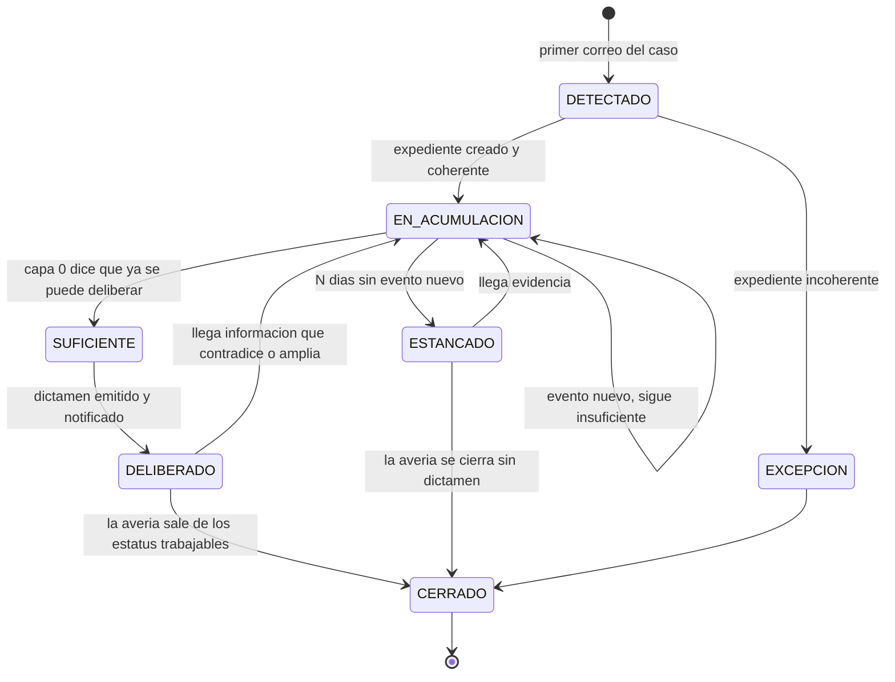
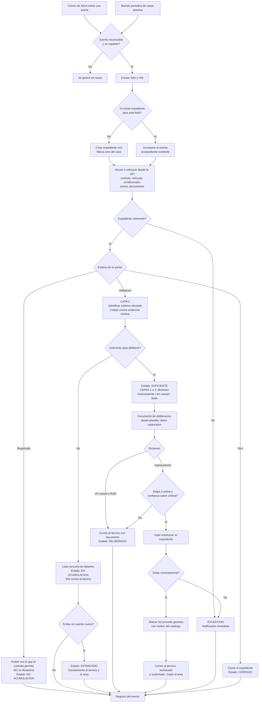
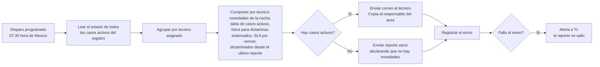
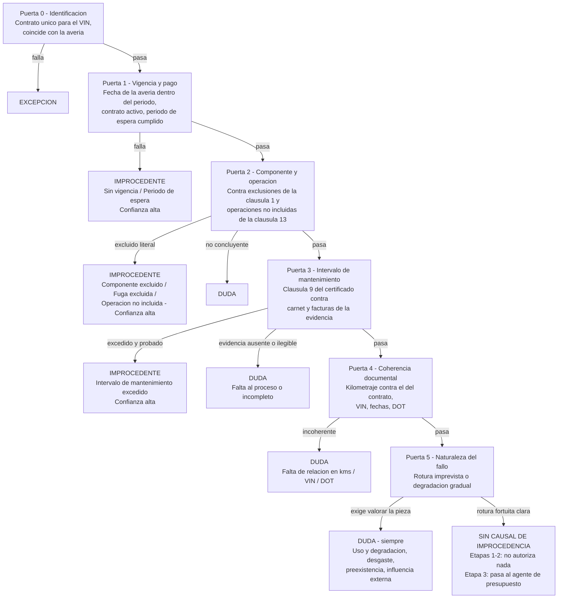
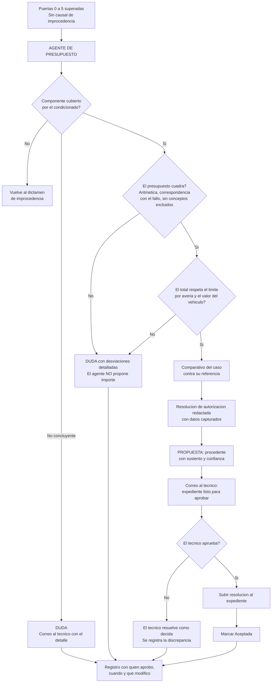
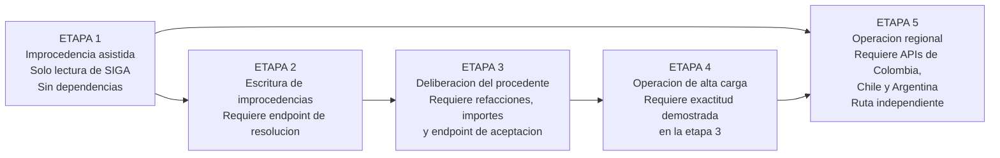
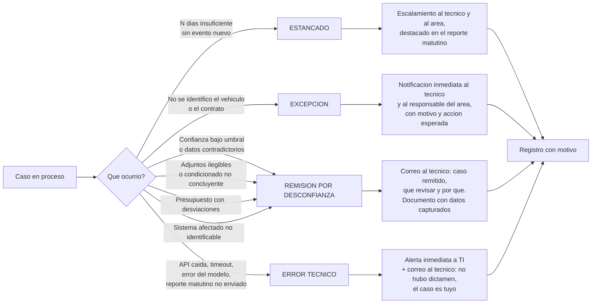

# PRD - Copiloto de Averías: automatización por etapas del ciclo de dictamen

| **Campo** | **Detalle** |
| --- | --- |
| **Proyecto** | Copiloto de Averías — seguimiento continuo del expediente y automatización por etapas del ciclo de dictamen, de la improcedencia asistida a la operación regional centralizada |
| **Área / empresa** | EngineCX (alcance operativo: Garantiplus México en las etapas 1–4; Colombia, Chile y Argentina en la etapa 5) |
| **Versión** | v0.3 |
| **Fecha** | 2026-09-01 |
| **Autores** | Omar André Lara Saldaña (omar.lara@enginecx.com) |
| **Revisión / liderazgo** | Héctor Izquierdo — Dirección General, patrocinio del estado futuro · Jefe directo del autor *(¿Aldo Álvarez? por confirmar, §14)* · David Simancas Estrada — Controller / Analista Técnico Regional de Averías LATAM, dueño del criterio técnico |
| **Tipo de proyecto** | Automatización interna (n8n) + Feature web/API |
| **Documento hermano** | `SIGA/PJ5682-api-averias-siga/PRD.md` — el estatus de falta de evidencia y la medición de tiempos por responsable, que este desarrollo consume |

> **Qué cambió respecto de la v0.2.** La v0.2 modelaba el copiloto como un **pipeline de un solo disparo**: llega el correo de asignación, se reúne el expediente, se dictamina, se responde, se acabó. Dos insumos del 2026-08-31 lo invalidan en su premisa.
>
> **(a) La sesión del 2026-08-31** con David Simancas, Miguel Ángel Rodríguez y Eduardo Álvarez estableció que **por cada avería llegan varios correos** —uno de apertura y los demás de actualización: la agencia subió un documento, cambió el estatus— y que el caso **casi nunca es deliberable al primero**. Miguel lo cuantificó: *"yo creo que el 5% de las averías ya con lo que mandan se puede evaluar"*. Un pipeline sin memoria emitiría `duda` en 19 de cada 20 casos. El copiloto pasa a ser un **seguidor de expedientes vivos**: acumula, evalúa en cada evento si ya tiene con qué deliberar, y **espera** mientras no lo tenga. De ahí salen también dos entregables nuevos: el **reporte matutino de estatus** que pidió el equipo y el **estado ESTANCADO** para que ningún caso espere en silencio.
>
> **(b) La propuesta de David del 2026-08-31** —*Asistente de Pre-Dictamen Técnico basado en datos históricos*— aporta la arquitectura del agente en **capas** y el **semáforo de confianza**, que este PRD adopta como estructura de alto nivel (§3.2) con las puertas de decisión de la v0.2 reubicadas dentro de ellas como criterio fino. La propuesta declara además alcance **Argentina**, que se incorpora a la etapa 5.
>
> **Una divergencia deliberada respecto de la propuesta de David,** registrada aquí para que no se lea como omisión: su semáforo otorga a **VERDE resolución automática** (≥90% de aprobación histórica, ≥30 casos comparables, monto bajo). Este PRD mantiene **RNF-04** —ninguna autorización sin confirmación humana, en ninguna etapa— y adopta el semáforo como **clasificador de riesgo y priorizador**, no como delegación de la firma. VERDE significa *expediente completo pre-armado con revisión mínima*. La razón es la asimetría del §2: un rechazo mal fundado se reclama y se corrige, una autorización mal fundada se paga. La propia propuesta recomienda la Alternativa A —*"asistencia, no decisión"*— y lista el sesgo del histórico como riesgo, de modo que la divergencia es con una de sus tablas, no con su tesis.
>
> Se conserva íntegro el marco de principios de las versiones anteriores: decisión humana en la resolución, prohibición del fallo silencioso, sesgo hacia la remisión.

## 1. Resumen ejecutivo

El **Copiloto de Averías** automatiza el ciclo de dictamen de una avería: desde que SIGA la asigna a un técnico hasta que existe una resolución sustentada en el expediente. Se construye en **cinco etapas** que van ampliando lo que el sistema decide por sí mismo y reduciendo lo que una persona tiene que construir a mano, sin quitarle nunca la decisión final.

**El caso no llega, se acumula.** El primer disparador es un correo que SIGA ya emite —*"Asignación de avería 3246 / Vin 9GAMM6108KB004600"*, que trae solo folio y VIN—, pero **no es el único**: después llegan los correos de actualización conforme la agencia carga documentos y el caso cambia de estatus. Un expediente rara vez es evaluable al abrirse: según el área, **solo en el 5% de los casos basta lo que se sube de entrada**. Por eso el copiloto no dictamina de un tiro: mantiene un **expediente vivo** por cada avería abierta, lo enriquece con cada evento —correo recibido o hallazgo del barrido periódico contra la API— y en cada enriquecimiento se hace una pregunta previa a cualquier otra: **¿ya tengo con qué deliberar?** Solo cuando la respuesta es sí corre el dictamen y emite el documento de deliberación. Mientras la respuesta sea no, el caso espera, y lo que falta se reporta.

Cuando el caso alcanza suficiencia, el sistema reúne el expediente completo desde la **API de SIGA** —contrato, vigencia, producto, vehículo, descripción del fallo, evidencia cargada y el **texto del certificado**— y lo somete a un agente de IA estructurado en **cuatro capas** (§3.2) que aplican, en orden, los criterios que hoy aplica el equipo.

**Nada espera en silencio.** Cada mañana, antes de la hora de entrada, el copiloto envía a cada técnico —con copia al responsable del área— un **reporte de estatus** con lo que llegó durante la noche, el estado de suficiencia de cada caso activo, **qué falta exactamente en cada uno** y cuáles ya están listos para dictaminar. Es un requisito expreso del área: las agencias cargan evidencia hasta las once de la noche y el equipo llega en la mañana a un buzón acumulado. Y todo caso que lleve demasiados días sin avanzar pasa a **ESTANCADO** y se escala, para que la espera nunca sea indefinida.

**Por qué se hace.** El objetivo no es ahorrarle minutos al equipo actual: es **aumentar el volumen que puede atender cada persona**. Hoy siete técnicos en tres países atienden del orden de 4 900 averías al año —unas 700 por persona—. El plan de negocio es consolidar la operación de Colombia y parte de la de Chile en México y operar el mismo volumen con cuatro o cinco personas, lo que exige que **la capacidad por persona crezca entre 45% y 75%**. Ese es el número que este desarrollo tiene que mover.

**Las cinco etapas.**

| | Etapa | Qué automatiza | Qué desbloquea |
| --- | --- | --- | --- |
| **1** | **Seguimiento del expediente e improcedencia asistida** | Expediente vivo por caso; evaluación de suficiencia en cada evento; dictamen de improcedencia con su resolución redactada cuando el caso ya es deliberable; plantilla con datos ya capturados para todos los demás casos; respuesta al técnico en el hilo; reporte matutino de estatus. **Cero escritura en SIGA.** | Nada. Arranca hoy. |
| **2** | **Escritura de improcedencias** | Lo mismo, pero el sistema sube la resolución al expediente y marca `No procede garantía`. | Endpoint de escritura de SIGA. |
| **3** | **Deliberación del caso procedente** | Agente especializado que valida cobertura, verifica que el presupuesto cuadre, arma el comparativo, redacta la resolución de autorización y **propone autorizar**. El técnico aprueba caso por caso. | Datos de refacciones e importes en la API; endpoint de aceptación. |
| **4** | **Operación de alta carga** | El humano deja de construir el expediente y pasa a revisar uno ya armado: cola priorizada, aprobación en bloque, cierre del ciclo hasta el pago. | Nada nuevo; depende de la exactitud demostrada en la etapa 3. |
| **5** | **Operación regional centralizada** | Colombia, Chile y Argentina con sus condicionados y catálogos, operados desde México. | APIs de Colombia, Chile y Argentina. |

**La asimetría que gobierna el diseño.** Rechazar es verificable: existe una cláusula concreta del contrato que lo dice. Autorizar no lo es: exigiría descartar 32 operaciones no incluidas, 7 exclusiones generales y valorar el estado físico de una pieza. Por eso las etapas 1 y 2 pueden llegar a escribir el rechazo por sí mismas, y las etapas 3 y 4 **nunca autorizan sin que una persona lo confirme**. La diferencia no es de madurez del modelo: es que un rechazo mal fundado se reclama y se corrige, y una autorización mal fundada se paga.

**El caso de negocio ya está en los datos del área.** En México, enero–julio de 2026: **1 582 averías, de las que 604 (38.2%) terminaron en `No procede garantía`**. De esos rechazos, **el 54.6% responde a cuatro causales verificables contra el condicionado** —intervalo de mantenimiento excedido 29.1%, componente excluido 15.7%, fuga excluida 6.8%, sin vigencia 3.0%—, o sea **una de cada cinco averías del país**. Ese es el alcance de la etapa 1. El 61.8% restante —los casos que hoy se aceptan— es el terreno de las etapas 3 y 4, y es donde está el grueso de la capacidad que hay que liberar.

## 2. Contexto y problema

### El proceso real, tal como opera hoy

1. El cliente lleva su vehículo a la agencia o taller. En más del 90% de los casos llega **sin llamarnos antes**: sabe que compró la unidad en el distribuidor y acude directo a él.
2. La **agencia registra la avería en SIGA** y sube la evidencia. SIGA exige al menos un documento en cada uno de tres tipos —evidencias, presupuesto y fotos de odómetro— antes de dejarla avanzar.
3. SIGA **asigna la avería a un técnico** por round-robin (en México son dos) y **le envía un correo de asignación** a su cuenta nominal con el folio y el VIN.
4. La agencia pasa la avería a **`Validación`**. Ahí arranca el compromiso de respuesta de **48 horas hábiles**, y solo entonces el técnico puede trabajarla. El equipo dedica el primer contacto a esto: *"al principio les solicitamos que pasen la avería a validación… compartimos los pasos para que la puedan pasar"*.
5. **El expediente se completa por goteo.** Pasar a `Validación` supone en teoría que ya hay presupuesto y evidencia, pero en la práctica no basta: *"yo creo que el 5% de las averías ya con lo que mandan se puede evaluar"*. El técnico solicita la evidencia que falta según el sistema afectado, la agencia la sube en días distintos, y **cada carga y cada cambio de estatus generan un correo nuevo sobre el mismo caso**. El caso queda en `Validación` todo ese tiempo, sin que el sistema distinga entre *"nadie lo ha mirado"* y *"está esperando al distribuidor"*.
6. El técnico descarga el certificado, revisa la evidencia y **dictamina: `Aceptada` o `No procede garantía`**. Es el único tramo de estatus que el área técnica puede mover.
7. Redacta la **resolución** en un machote de Word externo a SIGA, tecleando a mano folio, contrato, fecha, marca, modelo y datos de la unidad que ya están en pantalla, y la sube al expediente. Ese documento tiene **valor legal**: la agencia se lo entrega al cliente.
8. Si fue aceptada, la agencia mueve `Taller` → `Solucionada` y se procesa el pago. El área técnica ya no interviene.

Un canal minoritario entra por **call center**: se valida por teléfono que el contrato esté vigente y pagado, y se descartan operaciones no incluidas y exclusiones obvias. No cambia el proceso —la agencia igual registra la avería—, pero evita que el cliente se mueva en vano.

> **Cómo se debe leer esta descripción.** Es el **as-is**, y la instrucción directiva es explícita en que el estado futuro no se diseña sobre él: *"no es tanto el as-is… a Gisela y a David les gana mucho la operación, entonces tenemos que pensar en el estado futuro"*. Este PRD conserva el as-is por una razón concreta y limitada: **es la fuente del criterio técnico de dictamen**, que no cambia porque cambie quién lo ejecuta. Lo que el as-is no debe fijar es el alcance, la secuencia ni el destino del proyecto.

### Los dolores, con su tamaño

- **Dolor 1 — se trabaja completo aquello que ya se sabe que no procede.** David lo planteó sin rodeos: aun sabiendo de antemano que un caso no aplica, *"hay que crear la avería, hay que bajar la información, hay que generar la resolución, hay que poner datos, hay que poner información, enviarla"*. **604 de 1 582 averías (38.2%)** terminaron rechazadas en México en 2026, y **330 de ellas por causales verificables** contra el texto del contrato.
- **Dolor 2 — captura manual del documento.** El equipo transcribe a mano, en cada resolución, datos que ya viven en SIGA. Hay dos formatos vigentes: Garantiplus México y Mitsubishi. Es el mismo desarrollo que David intentó hace meses y no pudo terminar.
- **Dolor 3 — el reloj corre desde antes de que alguien mire el caso.** El compromiso es de 48 horas hábiles desde el paso a validación. El tablero registra en México una **mediana de 4.1 días y un p90 de 50.1 días**. Sobre la latencia de la alerta David fue tajante: *"si necesitamos intervenir al momento, las intervenimos y que no se brinquen al día siguiente… ya se nos fueron 8 o 9 horas"*.
- **Dolor 4 — el rechazo automático que ya existe en SIGA es un fallo silencioso.** Cuando un distribuidor captura solo refacciones no cubiertas, SIGA rechaza y cierra la avería **sin cargar resolución ni información alguna**. El caso desaparece sin explicación y cuando la agencia reclama nadie sabe qué contestar. **Este desarrollo no puede reproducir ese patrón.**
- **Dolor 5 — el techo de capacidad.** Es el dolor que introduce el estado futuro y el que gobierna las etapas 3 a 5. La deliberación de un caso procedente exige reunir el expediente, cotejar el componente contra el condicionado, revisar la evidencia y verificar el presupuesto. Todo eso lo hace hoy una persona a mano, y es lo que fija cuántos casos caben en un día. **Mientras no se automatice la construcción del expediente, la capacidad por persona no se mueve.**
- **Dolor 6 — el caso llega por goteo y nadie lleva la cuenta de qué falta.** Es el dolor que introduce la sesión del 2026-08-31 y el que reencuadra el MVP. Un expediente se arma a lo largo de días y de varios correos, y **no existe ningún lugar donde consultar en qué va cada caso abierto**: cuánta información tiene, qué le falta, cuál ya se puede dictaminar. El técnico lo lleva en la cabeza y en su buzón. Eduardo describió el efecto: *"empiezan a llegar casos hasta las 8, 9, 11 de la noche… llegamos en la mañana y ya tenemos un montón de correos de agencias que subieron después de las 7 u 8"*. El trabajo de la mañana empieza por reconstruir a mano un estado que el sistema podría tener calculado.
- **Dolor 7 — el reloj no distingue quién debe.** La avería se queda en `Validación` esté esperando al técnico o esperando a la agencia, y el indicador de tiempo se le carga al técnico en ambos casos. David: *"Miguel contesta a los 5 minutos pidiendo una foto más, y a él no le contestan hasta dentro de dos o tres días, y ahí a él ya le afectó. A pesar de que no es culpa de él. Y al distribuidor tampoco lo medimos."* Este dolor **no lo resuelve este desarrollo**: lo resuelve el estatus de falta de evidencia que se pide a la plataforma en el PRD hermano de SIGA. El copiloto lo consume y, mientras no exista, lo aproxima con su propio registro de eventos.
- **Por qué ahora.** La API de SIGA expone contrato, vehículo, avería, documentos y —clave— el **texto extraído del certificado**; existe n8n con conectividad de Gmail; y existe la API de Claude. El expediente completo es alcanzable por programa en el segundo en que llega cada correo del caso.

### Distinciones de dominio que el equipo dev debe entender desde el día 1

| Concepto | Significado |
| --- | --- |
| **El correo no trae el caso, trae la llave** | El correo de asignación contiene **solo folio y VIN**. No describe el fallo, no trae adjuntos, no dice quién reportó. El expediente se reúne después contra la API. Cualquier diseño que intente "leer el caso del correo" está mal planteado. |
| **Un caso, muchos eventos** | El correo de asignación es el **primero de una serie**, no el disparo único. Después llegan correos de actualización por cada documento que la agencia carga y por cada cambio de estatus. El copiloto no procesa correos: **procesa casos**, y los correos son solo una de las señales que los hacen avanzar. La otra es el barrido periódico contra la API. |
| **Suficiencia ≠ procedencia** | Son dos decisiones distintas y en ese orden. **Suficiencia** responde *¿tengo con qué deliberar?* y se contesta contra el catálogo de evidencia mínima del sistema afectado. **Procedencia** responde *¿procede o no?* y se contesta contra el condicionado. El copiloto **nunca contesta la segunda sin haber contestado que sí a la primera**: un dictamen emitido sobre evidencia insuficiente es un error, aunque acierte. |
| **Evidencia mínima por sistema** | Qué se necesita para dictaminar **depende del sistema afectado**, no del caso: una transmisión exige estado del aceite, presencia de residuos y escaneo; un compresor de A/C exige otra cosa. *"Nada más mandan una foto, pero con una foto no podemos sustentar el pago o el rechazo."* Ese catálogo lo define el área, no el desarrollo, y vive como configuración editable. |
| **Saber el resultado no exime de la evidencia** | Miguel, sobre las transmisiones de Captiva: *"el 99% de los casos se rechaza, pero aún así necesitamos la evidencia para poder rechazar"*. El copiloto **no puede atajar** por probabilidad histórica: la resolución tiene valor legal y necesita su sustento documental. Esta es la razón por la que el semáforo estadístico clasifica y prioriza, pero no resuelve (§3.2). |
| **Esperar no es no hacer nada** | Un caso insuficiente no es un caso fallido: es un caso en curso. Genera lista de faltantes, aparece en el reporte matutino, y su espera se cuenta. Lo inaceptable no es esperar, es **esperar sin que nadie lo sepa** — por eso existe el estado `ESTANCADO`. |
| **`Registrada` vs. `Validación`** | El correo de asignación se emite al **registrar**, pero la avería **no es trabajable ni tiene evidencia garantizada hasta que pasa a `Validación`**. Entre ambos momentos el expediente se abre y se puebla, pero **no se dictamina**: es el criterio del área, *"desde que pasa a validación ya pudiera tomarlo la inteligencia"* (§7.1). |
| **Improcedente vs. procedente vs. duda** | **Improcedente**: existe una cláusula concreta del contrato de ese vehículo que lo excluye, y la evidencia lo sostiene. **Duda**: exige valorar el estado físico de una pieza, o la evidencia es insuficiente, ilegible o contradictoria. **Procedente**: no se encontró causal de rechazo **y** la cobertura y el presupuesto se verificaron. |
| **Sin causal de improcedencia** ≠ **procedente** | En las etapas 1 y 2 el veredicto favorable es solo *"no encontré motivo de rechazo"*: no autoriza nada y no mueve nada. **Procedente** —con propuesta de autorización— aparece en la etapa 3, y siempre requiere confirmación humana. |
| **El agente rechaza por sí mismo, autoriza solo con confirmación** | Asimetría deliberada y permanente, no una limitación temporal. Un rechazo se sostiene citando una cláusula. Una autorización exigiría descartar 32 operaciones no incluidas, 7 exclusiones generales y valorar desgaste en fotografías. Además: un rechazo mal fundado se reclama; una autorización mal fundada se paga. |
| **Dictamen vs. resolución** | El **dictamen** es lo que produce el agente: una opinión razonada con su nivel de confianza. La **resolución** es el documento con efecto legal que se entrega al cliente. El agente redacta el borrador; **la resolución solo existe cuando una persona la valida**. |
| **Verificar el presupuesto ≠ fijar el importe** | Desde la etapa 3 el agente comprueba que el presupuesto cuadre: aritmética, correspondencia entre refacciones y fallo, ausencia de conceptos excluidos, y que el total no rebase el límite por avería ni el valor del vehículo. **Señala desviaciones; nunca fija cuánto se autoriza.** Eso lo pone la persona. |
| **Excepción vs. error** | Una **excepción** es un caso que el agente no pudo resolver o sobre el que no tiene confianza: es un resultado válido y **debe notificarse de inmediato**. Un **error** es un fallo técnico del pipeline: alerta inmediata a TI. Nunca se confunden, nunca se silencian, nunca esperan a que alguien los descubra revisando una pantalla. |

## 3. Objetivo del producto

**Multiplicar el número de averías que puede dictaminar una persona al día**, automatizando la construcción del expediente, la deliberación de los casos cuya improcedencia es verificable contra el contrato, y la pre-evaluación de los casos procedentes, de modo que el trabajo humano se concentre en confirmar decisiones en lugar de armarlas.

El objetivo secundario, y el que hace medible al primero, es que **la operación de averías de LATAM pueda ejecutarse desde México** con una plantilla consolidada, sin degradar el tiempo de respuesta ni la exactitud del dictamen.

La mejora se mide en **averías dictaminadas por persona y por día**, **minutos de trabajo humano por caso**, **proporción del expediente que llega pre-armado**, **exactitud del dictamen contra la decisión final** y —como criterios duros, no estadísticos— **cero rechazos sin resolución adjunta** y **cero autorizaciones sin confirmación humana** (§12).

El principio rector se mantiene y se hace explícito por etapa: **la IA construye y propone, la persona resuelve.** En las etapas 1 y 2 el sistema puede resolver por sí mismo un único tipo de caso —la improcedencia verificable, con su sustento por escrito ya en el expediente—. En las etapas 3, 4 y 5 **ninguna autorización existe sin que una persona la confirme**, aunque el esfuerzo de confirmarla se reduzca al mínimo.

### 3.1 Estrategia de implementación por etapas

| Etapa | Nombre | Qué automatiza | Escritura en SIGA | Desbloqueo requerido |
| --- | --- | --- | --- | --- |
| **1** | **Seguimiento del expediente e improcedencia asistida** | Mantiene un expediente vivo por avería abierta y lo enriquece con cada evento; **evalúa suficiencia** y espera mientras el caso no sea deliberable; cuando lo es, dictamina improcedente / sin causal / duda, redacta la resolución **solo en las improcedencias** y genera la plantilla con datos capturados **en los tres casos**; responde al técnico en el hilo del correo del caso; envía el **reporte matutino de estatus**; escala los casos estancados. | **Ninguna.** Solo lectura. | **Nada.** Arranca de inmediato. |
| **2** | **Escritura de improcedencias** | Lo de la etapa 1, más: sube la resolución al expediente y marca `No procede garantía` con su motivo. Orden inviolable: primero el documento, después el estatus. | Documento + estatus, **solo improcedencias de alta confianza**. | Endpoint de resolución de averías y tipo de documento "Resolución" (§10.4). |
| **3** | **Deliberación del caso procedente** | Agente especializado: valida cobertura del componente contra el condicionado; **verifica que el presupuesto cuadre**; clasifica el caso con el **semáforo de confianza** (§3.2); arma el comparativo; redacta la resolución de autorización; **propone autorizar** con su sustento. El técnico aprueba **caso por caso**. | Documento + estatus `Aceptada`, **solo tras aprobación humana explícita**. | Refacciones e importes en la API; endpoint de aceptación; histórico de casos comparables consumible; referencia de comparación de presupuesto (§14). |
| **4** | **Operación de alta carga** | El humano deja de construir el expediente y pasa a revisar uno ya armado: cola priorizada por riesgo e importe, aprobación en bloque, caso resumido en una pantalla. Cierra el ciclo: solicita al taller la documentación de pago y sigue el expediente hasta el comprobante. | Igual que la etapa 3, más la gestión documental del cierre. | Ninguno nuevo. **Condicionada a la exactitud demostrada en la etapa 3.** |
| **5** | **Operación regional centralizada** | Colombia, Chile y Argentina con sus condicionados, catálogos de motivos y plantillas propias, operados desde México. Enrutamiento por país y por tipo de caso. | Igual, por país. | **APIs de Colombia, Chile y Argentina** — hoy no existen y no tienen fecha. Normalización de los catálogos de motivos entre países. |

**Por qué esta secuencia y no otra.** Las etapas 1 y 2 son el mismo alcance funcional separadas por una dependencia externa: la etapa 1 entrega todo el valor de análisis y captura **sin depender de nadie**, y la etapa 2 solo añade el último clic cuando TI libere la escritura. No tiene sentido esperar. Las etapas 3 y 4 se separan por naturaleza y no por dependencia: la **3 construye la capacidad** de deliberar un caso procedente con supervisión caso por caso, y la **4 no agrega capacidad nueva** sino que reduce la carga de supervisarla, lo que solo es defendible con datos de exactitud de la etapa 3 sobre la mesa. La etapa 5 va aparte porque depende de una entrega de TI sin fecha y **no debe bloquear ni contaminar el avance en México**.

**Dónde vive el seguimiento del expediente.** El expediente vivo, la evaluación de suficiencia y el reporte matutino están **en la etapa 1 completos**, no repartidos entre etapas. La razón es que no dependen de nada: son de solo lectura, no escriben en SIGA y no necesitan datos que la API no tenga. Y son la precondición de todo lo demás: sin saber cuándo un caso es deliberable, ninguna etapa posterior sabe cuándo actuar.

### 3.2 Arquitectura del agente — cuatro capas y una capa cero

El agente procesa cada avería en secuencia de capas. Cada capa filtra y solo escala a la siguiente lo que no pudo resolver. La estructura de las capas 1 a 4 proviene de la propuesta *Asistente de Pre-Dictamen Técnico* de David Simancas (2026-08-31); la **capa 0** la exige el modelo de acumulación de este PRD y no existe en aquella propuesta.

| | Capa | Qué decide | Con qué la decide | ¿Resuelve sola? | Etapa |
| :-: | --- | --- | --- | --- | :-: |
| **0** | **Suficiencia del expediente** | Si el caso ya es deliberable. Identifica el **sistema afectado** (transmisión, motor, compresor de A/C, suspensión…) y coteja lo cargado contra el catálogo de evidencia mínima de ese sistema. | Catálogo de evidencia mínima por sistema, parametrizable por el área (§10.2). | No decide procedencia. Decide **cuándo** se decide. | 1 |
| **1** | **Validación administrativa** | Condiciones formales del contrato: vigencia del certificado, kilometraje contra el límite de cobertura, taller registrado y autorizado, situación de pagos. Binarias, sin interpretación técnica. | Datos duros de la API y del certificado. | **Sí — rechazo automático.** | 1–2 |
| **2** | **Componente contra cobertura** | Certificados **nominados**: si el componente reportado no aparece enumerado, el rechazo es automático con fundamento citado. | Texto del certificado + componente identificado. | **Sí — rechazo automático.** | 1–2 |
| **3** | **Semáforo de confianza** | Coberturas **amplias** (cubren todo salvo desgaste, uso, duración y exclusiones específicas). Distinguir desgaste de falla súbita exige criterio y evidencia física, así que aquí **no se automatiza el dictamen**: se automatiza la clasificación de riesgo y la preparación del caso. | Dos ejes: **confianza estadística** del histórico para la combinación marca/modelo/año/rango de km/componente, y **exposición económica**. | **No.** Clasifica, prioriza y pre-arma. | 3–4 |
| **4** | **Excepciones** | Monto alto, siniestro con antecedentes, patrón atípico o sensibilidad comercial. Excluido de toda automatización. | Umbrales y listas definidos por el área. | No, por definición. | 1–5 |

**Las puertas de decisión de la v0.2 viven dentro de las capas**, como su criterio fino: las puertas 0 y 1 (identificación, vigencia y pago) son la capa 1; la puerta 2 (componente y operación) es la capa 2; las puertas 3, 4 y 5 (intervalo de mantenimiento, coherencia documental, naturaleza del fallo) son la capa 3. El detalle operativo de las puertas está en el §7.3.

#### El semáforo, y por qué VERDE no autoriza solo

| Semáforo | Criterio de entrada | Qué hace el sistema | Quién decide |
| --- | --- | --- | --- |
| 🟢 **VERDE** | ≥90% de aprobación histórica para la combinación exacta, mínimo 30 casos comparables y monto bajo | Genera el expediente completo con la resolución redactada y **revisión mínima**: el caso llega listo para firmar | **Una persona confirma.** Elegible para aprobación en bloque desde la etapa 4 |
| 🟡 **ÁMBAR** | Confianza media, o casos comparables insuficientes | Entrega el caso pre-analizado con los casos similares y una propuesta razonada | El técnico valida y firma, caso por caso |
| 🔴 **ROJO** | Monto alto, componente sensible (motor, transmisión) o patrón anómalo | Escala con expediente completo y alertas; **excluido de la aprobación en bloque** | Revisión técnica y regional |

Los umbrales —90%, 30 casos, cortes de monto— son **valores de arranque** y se calibran contra el histórico real durante el piloto, por país y por cuenta. Así lo establece la propuesta de origen y así se conserva aquí.

La divergencia con la propuesta de David está en la última columna del renglón VERDE: allí VERDE decide automáticamente, aquí VERDE **abarata la confirmación pero no la elimina**. Tres razones, en orden de peso:

1. **La asimetría del §2 no depende del volumen de datos.** Un rechazo mal fundado se reclama y se corrige; una autorización mal fundada sale de la caja. Ninguna cantidad de histórico convierte lo segundo en lo primero.
2. **El histórico es un promedio, y la resolución es un documento legal sobre un caso concreto.** Es la misma objeción que Miguel puso sobre la mesa: saber que el 99% de esas transmisiones se rechaza no lo exime de reunir la evidencia de **esta**.
3. **El sesgo del histórico está listado como riesgo en la propia propuesta.** Un motor que aprende de decisiones pasadas replica sus errores, y la única barrera contra eso es que alguien mire.

Lo que sí se adopta íntegro del semáforo: **es el mecanismo de priorización de la cola** de la etapa 4 (RF-59), **determina cuánto esfuerzo de revisión** merece cada caso, y **define qué es elegible para aprobación en bloque** y qué no (RF-60, RF-61).

### 3.3 Ciclo de vida del caso

**Tres decisiones de diseño que este ciclo hace explícitas:**

- **`ESTANCADO` existe para que la espera no sea silenciosa.** Un caso al que nunca le llega la evidencia se quedaría esperando para siempre, que es exactamente el patrón de fallo silencioso que el §2 prohíbe (Dolor 4). Al cumplirse el umbral de días sin evento, el caso se escala y aparece destacado en el reporte matutino.
- **`DELIBERADO` no es terminal.** Si después del dictamen llega evidencia que lo contradice o lo amplía, el caso vuelve a acumulación y se reevalúa. Un dictamen es una opinión con fecha, no un cierre.
- **La transición a `SUFICIENTE` es la única que habilita el dictamen.** Ninguna otra ruta llega a emitir un veredicto de procedencia.

## 4. Usuarios y actores

| **Usuario / Actor** | **Rol en el proceso** |
| --- | --- |
| **Técnico de averías** | Usuario principal. Recibe el dictamen y el documento capturado, revisa, corrige y resuelve. En las etapas 3 y 4 su trabajo pasa de armar el expediente a **confirmar** el que le llega armado. En México son **Eduardo Álvarez** y **Miguel Ángel Rodríguez**, que absorben el 94% de la carga del país. |
| **Héctor** | Patrocinio directivo del estado futuro. Origen de la decisión de automatizar de punta a punta y de centralizar la operación regional en México. |
| **Jefe directo del autor** | Traduce la intención directiva a instrucción de diseño y fija la secuencia de etapas. *(Identidad por confirmar en el encabezado — §14.)* |
| **Responsable de Averías LATAM** | **David Simancas.** Dueño del criterio técnico de dictamen y de la data de rechazos. Valida las causales, los umbrales y las plantillas. Recibe copia de todos los dictámenes automáticos. Es también responsable de la operación que el proyecto consolida (§13). |
| **Call center** | **Gisela Aldana** y su equipo. Aportan el orden del filtro previo —vigencia y pago, operaciones no incluidas, exclusiones—, que es el orden que reproducen las puertas del §7.3. Fuera del alcance operativo hasta la etapa 5. |
| **Agencia / taller** | Registra la avería en SIGA, sube la evidencia y mueve los estatus posteriores a la aceptación. **No interactúa con el sistema** en las etapas 1 a 3; en la etapa 4 recibe la solicitud de documentación de pago. |
| **Cliente / beneficiario** | Origen del fallo. **No recibe nada de este desarrollo.** La resolución le llega por la agencia, como hoy. |
| **TI / Desarrollo (Engine)** | Construye y opera el flujo; recibe las alertas de fallo técnico; mantiene y versiona los prompts y el catálogo de causales. |
| **Equipo de SIGA (Alexis)** | Único que puede exponer las capacidades de escritura y los datos que hoy faltan (§10.4), y las APIs de Colombia y Chile. |
| **Sistema — Gmail** | Buzones de los técnicos. Fuente del disparo y canal de salida del dictamen. |
| **Sistema — n8n** | Orquestador: detecta el correo, reúne el expediente, invoca a los agentes, arma el documento, responde y registra. |
| **Sistema — API de SIGA** | Fuente de verdad del contrato, la avería, la evidencia y el condicionado. Nada se dictamina sobre datos que no vengan de aquí. |
| **Sistema — Evaluador de suficiencia** | **Capa 0.** Identifica el sistema afectado y determina si el expediente ya permite deliberar, o qué falta para que lo permita. Es quien decide si el caso avanza o espera. Presente desde la etapa 1. |
| **Sistema — Agente de cobertura** | Capas 1 a 3. Aplica las puertas de decisión y emite el dictamen de procedencia con motivo, sustento y confianza. Presente desde la etapa 1. |
| **Sistema — Agente de presupuesto** | Agente especializado que aparece en la **etapa 3**: coteja refacciones contra el fallo, verifica la aritmética, detecta conceptos excluidos y compara el total contra los límites del contrato. **No fija el importe autorizable.** |
| **Sistema — Clasificador del semáforo** | Etapa 3. Cruza confianza histórica y exposición económica para asignar verde, ámbar o rojo, priorizar la cola y determinar qué caso es elegible para aprobación en bloque. **No decide procedencia.** |
| **Sistema — Reporte matutino** | Etapa 1. Consulta el estado de todos los casos activos y compone el correo diario para cada técnico y para el responsable del área. No razona: reporta lo que el registro ya sabe. |

## 5. Alcance MVP y funcionalidades

**Qué es el MVP.** El MVP es la **etapa 1**, y está detallada al nivel de construcción en el §5.1. Las etapas 2 a 5 se especifican al nivel de capacidad y de requerimiento, no de implementación: cada una necesitará su propia revisión antes de construirse, porque las tres últimas dependen de datos de desempeño y de entregas de TI que hoy no existen.

### 5.1 Etapa 1 — Seguimiento del expediente e improcedencia asistida *(el MVP)*

El MVP no es "dictaminar averías": es **saber en todo momento en qué va cada avería abierta, y dictaminar la que ya se pueda**. Ese orden importa, porque es el que hace que el dictamen ocurra sobre evidencia suficiente y no sobre lo primero que llegó.

#### A. Disparo y captación de eventos

- **A1.** Vigilar por **suscripción push** —no por sondeo— los buzones de Gmail de los técnicos de averías de México (`david.simancas@`, `miguel.rodriguez@`, `eduardo.alvarez@garantiplus.mx` y los que el área designe).
- **A2.** Reconocer **la familia completa de correos que SIGA emite sobre una avería**: el de asignación (`Asignación de avería {folio} / Vin {VIN}`) y los de actualización —carga de documento, cambio de estatus y los que el levantamiento identifique—. Cualquier otro correo se ignora sin dejar rastro. *(El catálogo exacto de correos de actualización está pendiente de verificar — §14.)*
- **A3.** Extraer **folio** y **VIN** de cada correo, y validar que concuerden entre sí.
- **A4. Correlacionar por folio, no descartar.** Un correo cuyo folio ya tiene expediente abierto **no se descarta como duplicado: se incorpora como evento nuevo** a ese expediente. Solo se descarta el **mismo evento** llegado por varios buzones o reenviado — el mismo folio, el mismo tipo de evento y la misma marca de tiempo de origen.
- **A5. Barrido periódico como red de seguridad.** Con una cadencia configurable, revisar contra la API todos los casos abiertos en busca de cambios que ningún correo anunció: documentos nuevos, cambio de estatus, cierre. El barrido es lo que impide que el sistema quede ciego si un tipo de correo no existe, cambia de formato o se pierde, y es lo que alimenta el reporte matutino con lo que llegó de madrugada.
- **A6.** Registrar la **hora de llegada del primer evento** como marca cero del caso, y la hora de cada evento posterior. Todas las latencias del §12 se miden contra ellas.

#### B. El expediente vivo

- **B1. Un expediente persistente por folio**, creado en el primer evento y vigente hasta que la avería sale de los estatus trabajables. Es el objeto central del sistema: todo lo demás lo consulta o lo actualiza.
- **B2. Reunión incremental desde SIGA.** En cada evento, refrescar del expediente lo que pudo cambiar —documentos, estatus, descripción— y recuperar por primera vez lo que aún no se tenía. Lo inmutable (contrato, vehículo, texto del certificado) se recupera una vez y se reutiliza.
- **B3.** Al abrir el expediente, localizar el **contrato por VIN** (vigencia, estatus, producto, distribuidor, beneficiario), su **detalle** (marca, modelo, versión, año, kilómetros al contratar, fecha de primera factura, número de motor, periodo de vigencia) y el **texto extraído del certificado**, que es el condicionado aplicable y **la única fuente normativa admisible**: ninguna regla de cobertura se codifica como constante.
- **B4.** Recuperar y mantener al día la **avería por folio**: descripción del fallo, fecha, estatus, técnico asignado, registrante.
- **B5.** Listar y descargar la **evidencia** en cada refresco. Se procesa **en tránsito**, no se retiene; del documento se conserva en el expediente su identificador, su tipo, su fecha y lo que el análisis extrajo, nunca el archivo.
- **B6. Verificar la coherencia del expediente**: VIN del correo = VIN del contrato = VIN de la avería, y un solo contrato vigente para ese VIN. Cualquier discrepancia detiene el caso y genera excepción.
- **B7. Registrar qué cambió entre eventos.** El expediente lleva su propia bitácora: qué documento apareció, qué campo cambió, qué estatus se movió. Es lo que permite decir en el reporte matutino *"anoche llegaron el escaneo y la factura de servicio"* en vez de *"hay novedades"*.
- **B8.** El expediente **no se dictamina mientras la avería esté en `Registrada`**: se abre, se puebla con lo que el contrato ya permite saber, y espera el paso a `Validación`. Es la instrucción del área: *"en registrado a veces no va a haber mucho sentido, pero desde que pasa a validación ya pudiera tomarlo la inteligencia"*.

#### C. Evaluación de suficiencia *(capa 0)*

- **C1. Identificar el sistema afectado** —transmisión, motor, compresor de A/C, suspensión, dirección, eléctrico y los demás del catálogo— a partir de la descripción del fallo y del presupuesto, con **confianza explícita**. Si el sistema no se identifica con claridad, el caso se remite: sin sistema no hay requisitos que aplicar.
- **C2. Cotejar lo cargado contra el catálogo de evidencia mínima** de ese sistema: qué documentos exige, de qué tipo y con qué legibilidad.
- **C3. Emitir un veredicto de suficiencia de dos valores**: `suficiente` o `insuficiente`. Cuando es insuficiente, acompañarlo de la **lista concreta y accionable de lo que falta**, en el vocabulario del área —*"falta el escaneo de la transmisión y el estado del aceite"*, no *"documentación incompleta"*.
- **C4.** Un documento **presente pero ilegible o no interpretable cuenta como faltante**, y se dice así, distinguiéndolo de uno ausente. Un carnet borroso y un carnet inexistente exigen acciones distintas del técnico.
- **C5. El catálogo de evidencia mínima es configuración, no código.** Lo define y lo mantiene el área de averías, se versiona, y cada evaluación registra con qué versión se hizo. *(El documento oficial está pendiente de entrega por David — §14. Se arranca con una versión provisional derivada de lo levantado en sesión, marcada como tal.)*
- **C6. Ningún dictamen de procedencia se emite con suficiencia `insuficiente`.** Sin excepción, y con independencia de lo evidente que parezca el caso. La razón es del área: *"sabemos que estas averías se rechazan, pero aún así necesitamos la evidencia para poder rechazar"*.
- **C7.** Reevaluar la suficiencia **en cada evento**, no una sola vez. Un caso insuficiente el lunes puede ser suficiente el miércoles.
- **C8. Marcar el caso como `ESTANCADO`** cuando lleve más de N días sin evento nuevo estando insuficiente (N configurable, propuesta de arranque: 3 días hábiles). Un caso estancado se escala al técnico y al responsable del área, y aparece destacado en el reporte matutino.

#### D. Dictamen de procedencia *(capas 1 a 3, solo si la suficiencia es `suficiente`)*

- **D1.** Aplicar las puertas del §7.3 **en orden**, deteniéndose en la primera concluyente.
- **D2.** Emitir exactamente **un dictamen de tres valores**: `improcedente`, `sin_causal_de_improcedencia` o `duda`.
- **D3.** Todo `improcedente` va acompañado de **motivo** de catálogo cerrado, **cita textual** de la cláusula, **evidencia** concreta y **nivel de confianza**.
- **D4. Nunca emitir `improcedente` por debajo del umbral de confianza** de su causal. Por debajo del umbral, el resultado es `duda`, siempre.
- **D5.** Las causales que exigen valorar el estado físico de una pieza —**uso y degradación, desgaste, preexistencia, influencia externa, mala reparación anterior, negligencia**— producen `duda` por definición, aunque el agente tenga hipótesis. Concentran el 33.5% de los rechazos de México.
- **D6. Anonimizar** los datos personales del beneficiario antes de razonar y no reproducirlos en ninguna salida.
- **D7. No calcular, mencionar ni inferir importes.** En la etapa 1 el agente no mira el presupuesto salvo para identificar el componente reclamado y el sistema afectado.
- **D8. Versionar el prompt** y registrar en cada dictamen la versión con la que se produjo.
- **D9. Reevaluar cuando llegue información nueva** después de un dictamen. Si contradice o amplía lo dictaminado, el caso vuelve a acumulación, se emite un dictamen actualizado y **se dice explícitamente que sustituye al anterior y por qué**.

#### E. Documento de deliberación

- **E1.** Se genera **solo cuando el caso alcanza suficiencia y se dictamina**. Los eventos intermedios no producen documento.
- **E2.** Generar desde la **plantilla oficial** del producto: Garantiplus México o Mitsubishi. *(Ambas pendientes de entrega — §14.)*
- **E3.** **En los tres dictámenes**, rellenar todos los campos de captura desde SIGA: folio, contrato, fecha, marca, modelo, versión, año, VIN, kilometraje, distribuidor, producto y vigencia. Es la parte que hoy se teclea a mano y **se automatiza siempre**.
- **E4. Solo si el dictamen es `improcedente`**, redactar un par de párrafos que expliquen la improcedencia citando la cláusula del certificado y el hecho concreto que la activa.
- **E5.** Si el dictamen es `sin_causal_de_improcedencia` o `duda`, **el documento va con los datos y nada más**: sin redacción, sin conclusión, sin recomendación. Requisito expreso del área.
- **E6.** Partir de **borradores por causal** —intervalo de mantenimiento, fugas, componente excluido, vigencia—, tal como lo propuso David, en lugar de redacción libre por caso.
- **E7.** Enumerar la **evidencia en que se sostiene el dictamen**, identificando cada documento del expediente que se usó. Es lo que el área adjunta hoy a mano a la resolución.
- **E8.** Marcar visiblemente que **es un borrador producido con asistencia de IA y que requiere revisión humana** antes de tener validez.

#### F. Comunicación con el técnico

**Política de silencio deliberada.** Si el flujo corre a la recepción de cada correo y responde a cada uno, el técnico recibe cinco correos por caso y deja de leerlos. Los eventos intermedios **actualizan el expediente sin notificar**; se acumulan y se cuentan en el reporte matutino.

- **F1. Solo tres cosas generan correo inmediato**: (1) el caso alcanzó suficiencia y hay dictamen; (2) una excepción; (3) un fallo técnico.
- **F2.** Responder **en el mismo hilo** del correo del caso, para que el dictamen quede pegado al expediente en el buzón de quien lo trabaja.
- **F3.** Diseño claro y jerarquizado, con el veredicto destacado y visualmente diferenciado entre los tres valores.
- **F4.** Contenido del correo de dictamen: folio y VIN; vehículo y contrato; vigencia y producto; **veredicto y motivo en una línea**; sustento resumido; **qué revisó el agente y qué no pudo revisar**; **cuántos eventos y cuántos días tomó llegar a la suficiencia**; documento adjunto.
- **F5. Nota de transparencia**: quién produjo el dictamen, que es una opinión asistida por IA y que no constituye la resolución del expediente.
- **F6. Copia al responsable del área** en todos los casos, para el radar de rechazos que David pidió expresamente: *"para que el equipo tenga el radar de que se rechazó esta avería, por si te buscan"*.
- **F7.** Si el dictamen es `duda`, enunciar **exactamente qué habría que verificar**, sin adelantar veredicto.
- **F8.** El copiloto **no se comunica con la agencia ni con el distribuidor.** Le dice al técnico qué falta; a quién pedírselo y cómo lo decide él.

#### G. Reporte matutino de estatus

Requisito expreso del área, nacido de un problema concreto: las agencias cargan evidencia hasta las once de la noche y el equipo llega en la mañana a un buzón acumulado sin saber por dónde empezar.

- **G1. Un correo por técnico, con copia al responsable del área**, enviado antes de la hora de entrada. Hora configurable; propuesta de arranque: 07:30 hora de México.
- **G2. Qué llegó desde el último reporte**: casos nuevos, documentos cargados, cambios de estatus. Concreto, no agregado.
- **G3. Tabla de casos activos** con: folio, VIN, vehículo, días abierto, **estado de suficiencia**, **qué falta exactamente**, y días desde el último movimiento.
- **G4. Bloque destacado de casos listos para dictaminar**, que es el que dice por dónde empezar el día.
- **G5. Bloque destacado de casos `ESTANCADO`**, ordenados por días de espera, con lo que falta en cada uno. Es el insumo para que el técnico decida a qué agencia perseguir.
- **G6. Casos que se acercan al vencimiento del SLA** de 48 horas hábiles, con las horas restantes.
- **G7. Resumen de lo dictaminado** desde el reporte anterior, con su veredicto.
- **G8.** El reporte **no razona ni dictamina**: expone el estado que el registro ya tiene. Si el registro no lo sabe, el reporte no lo inventa.
- **G9.** El reporte se envía **aunque no haya novedades**, diciéndolo. Un reporte ausente es indistinguible de un sistema caído.
- **G10.** Los datos personales del beneficiario **no aparecen** en el reporte.

#### H. Registro, excepciones y observabilidad

- **H1. Registro completo por caso y por evento**: folio, VIN, contrato, cada evento con su hora y su origen, veredictos de suficiencia con su versión de catálogo, dictamen, motivo, confianza, versión del prompt, y qué se hizo y qué no con su razón.
- **H2. Toda excepción se notifica en el momento** en que se genera, con motivo, folio, VIN y acción esperada. Registrarla no sustituye a notificarla.
- **H3. Remisión por desconfianza.** Si el agente duda de su propia lectura —confianza bajo umbral, datos contradictorios, adjuntos ilegibles, condicionado no concluyente, sistema afectado no identificable— remite el caso a una persona **en ese momento**, en lugar de resolver con lo que tiene.
- **H4.** Un **fallo técnico** alerta a TI de inmediato y **deja el caso con el técnico sin dictamen**, con un correo que lo dice explícitamente. Un caso nunca se queda en silencio porque el sistema falló.
- **H5. Si el reporte matutino no se pudo enviar, se alerta a TI.** Su ausencia no puede pasar inadvertida.
- **H6.** El registro se conserva consultable, sin datos personales del beneficiario, para medir el §12 y alimentar las etapas siguientes. **El histórico que acumula es, además, el insumo que el semáforo de la etapa 3 necesita.**

#### Lo que la etapa 1 NO hace

**Cero escritura en SIGA.** No sube documentos, no cambia estatus, no crea nada. Su única interacción con la plataforma son consultas de lectura. **Cero contacto con la agencia.** El técnico recibe todo hecho y resuelve él.

### 5.2 Etapa 2 — Escritura de improcedencias

Mismo alcance funcional que la etapa 1, más la capacidad de cerrar el caso.

- **G1.** Cuando el dictamen sea `improcedente` **y** la confianza supere el umbral de su causal, subir la resolución al expediente y marcar la avería como **`No procede garantía`** con su motivo del catálogo.
- **G2. Ningún rechazo sin resolución adjunta.** El orden es inviolable: primero el documento, después el estatus. Si la carga del documento falla, **no se marca nada** y el caso se convierte en excepción. Esta regla existe para no repetir el fallo silencioso del auto-rechazo actual de SIGA.
- **G3.** En `sin_causal_de_improcedencia` y `duda` **no se escribe absolutamente nada** en SIGA.
- **G4.** El marcado automático se **desactiva por configuración** sin tocar el resto del flujo, para operar en modo solo-propuesta durante la validación y encenderlo cuando la exactitud lo justifique.
- **G5.** Toda escritura queda **atribuida a una identidad de servicio identificable**, nunca suplantando la cuenta de un técnico.
- **G6.** Todo lo que el sistema escribió debe poder **identificarse y revertirse** a mano.

### 5.3 Etapa 3 — Deliberación del caso procedente

Aparece un **segundo agente especializado**, entra en operación el **semáforo de confianza** (§3.2) y el alcance se extiende al 61.8% de los casos que hoy se aceptan. Cambia el perfil de riesgo: aquí un error cuesta dinero.

- **H0. Clasificación por semáforo.** Todo caso que llega a esta etapa se clasifica en 🟢 verde, 🟡 ámbar o 🔴 rojo, cruzando la **confianza estadística** del histórico para su combinación de marca, modelo, año, rango de kilometraje y componente con la **exposición económica** del caso. La clasificación determina el esfuerzo de revisión, el orden de la cola y la elegibilidad para aprobación abreviada, **y nada más**: no sustituye ninguna de las verificaciones H1 a H3, que se ejecutan igual en los tres colores. Los umbrales de arranque —≥90% de aprobación histórica, ≥30 casos comparables, cortes de monto— **se calibran contra el histórico real durante el piloto**, por país y por cuenta.
- **H0b. VERDE no autoriza solo.** Un caso verde llega con la resolución redactada y el expediente completo, listo para que una persona lo confirme con revisión mínima. **La confirmación humana sigue siendo obligatoria** (RNF-04). Un caso rojo queda excluido de toda forma de aprobación abreviada y se escala con alertas.
- **H0c. La clasificación se registra y se audita.** Cada caso guarda su color, los casos comparables que lo sustentaron y la versión de umbrales vigente. Durante el piloto se audita el **100% de los verdes**, tal como la propuesta de origen lo pide como mitigación del sesgo del histórico.
- **H0d. Sin histórico consumible, no hay semáforo.** Si al llegar a esta etapa el histórico de casos comparables no es consultable por programa (§10.2), el semáforo no se activa y todos los casos se tratan como ámbar. **Degradar a ámbar es la única degradación admisible**; nunca se asume verde por falta de datos.
- **H1. Validación de cobertura del componente.** Cotejar el componente reclamado contra el condicionado del contrato: los 9 grupos excluidos de la cláusula 1 y las 32 operaciones no incluidas de la cláusula 13. Emitir cobertura con confianza y cita.
- **H2. Verificación de que el presupuesto cuadre.** Comprobar la **aritmética** (refacciones + mano de obra = total), la **correspondencia** entre las refacciones presupuestadas y el fallo reportado, la **ausencia de conceptos excluidos** en el desglose, y que el total **no rebase el límite por avería ni el valor de venta del vehículo** (cláusula 11).
- **H3. El agente señala desviaciones, no fija importes.** Si el presupuesto no cuadra, si incluye conceptos no cubiertos o si excede un límite, lo reporta con el detalle. **Cuánto se autoriza lo decide la persona, siempre.**
- **H4. Comparativo.** Presentar el caso contra su referencia: el histórico del componente, el condicionado aplicable y los límites del contrato. La referencia exacta de comparación está pendiente de definir (§14).
- **H5. Resolución de autorización redactada.** Generar el documento de autorización con los datos capturados y el detalle de lo que se autoriza, listo para revisión.
- **H6. Propuesta de autorización.** Emitir un dictamen `procedente` con su sustento, su confianza y las verificaciones que pasó y las que no.
- **H7. Aprobación humana caso por caso, obligatoria.** El técnico revisa y aprueba. **Solo entonces** el sistema sube la resolución y marca `Aceptada`. Sin aprobación no hay escritura, sin excepción.
- **H8. Trazabilidad de la aprobación.** Registrar quién aprobó, cuándo, y si modificó algo respecto de lo propuesto. Ese registro es el insumo que habilita —o no— la etapa 4.
- **H9.** Los casos que no superen las verificaciones de H1–H2 salen como **`duda`** con el detalle de lo que falló, nunca como una autorización con reservas.

### 5.4 Etapa 4 — Operación de alta carga

No agrega capacidad de decisión: **reduce el costo de supervisarla**. El humano sigue confirmando toda autorización; lo que cambia es cuánto le cuesta hacerlo.

- **I1. Expediente pre-armado.** Todo lo necesario para decidir llega resuelto y resumido en una pantalla: veredicto, sustento, verificaciones, desviaciones detectadas y documento listo. El humano **revisa, no construye**.
- **I2. Cola priorizada por semáforo.** Los casos se ordenan por color, riesgo e importe, no por antigüedad, de modo que la atención se reparta según lo que está en juego.
- **I3. Aprobación en bloque, solo para verdes.** Los casos 🟢 verdes que superaron todas las verificaciones sin desviaciones se pueden aprobar en conjunto, tras revisión, en lugar de uno por uno. Los ámbar se aprueban uno a uno.
- **I4. Revisión reforzada por umbral.** Los casos 🔴 rojos, y cualquiera que exceda un importe o presente desviaciones, se marcan para revisión individual obligatoria y **no admiten aprobación en bloque bajo ninguna circunstancia**.
- **I5. Cierre del ciclo documental.** Solicitar al taller la documentación de pago —resolución firmada, identificación, facturas—, dar seguimiento a lo que falta y avisar cuando el expediente queda completo.
- **I6. Seguimiento hasta el comprobante.** Vigilar el avance del expediente después de la aceptación y alertar de lo que se atora, que es hoy un punto ciego reconocido por el área.
- **I7.** **Sigue sin existir la autorización sin humano.** La aprobación en bloque es una forma de confirmar varios casos revisados, no una delegación de la decisión.

### 5.5 Etapa 5 — Operación regional centralizada

El alcance regional declarado es **México, Colombia, Chile y Argentina**, conforme a la propuesta de David del 2026-08-31. Argentina entra como cuarto país con una advertencia registrada: **no tenemos su línea base**. El tablero que sustenta todas las cifras del §12 solo cubre México, Colombia y Chile, y no está confirmado si existe operación de averías en Argentina ni con qué plataforma (§14).

- **J1.** Condicionados, catálogos de motivos, plantillas de resolución, umbrales de confianza, catálogos de evidencia mínima y buzones **parametrizados por país**. La parametrización se construye desde la etapa 1 (RF-39) aunque solo opere México.
- **J2. Normalización del catálogo de motivos** entre los países. Hoy son **56 valores con duplicados y variantes de mayúsculas**, y Colombia y Chile usan nomenclatura propia; sin normalizar, la métrica regional no es comparable.
- **J3.** Integración con las **APIs de Colombia, Chile y Argentina** cuando existan, con el mismo esquema de permisos mínimos.
- **J4. Enrutamiento por país y por tipo de caso**, de modo que un mismo equipo en México pueda operar los cuatro mercados.
- **J5.** Soporte a los estatus propios de Chile y Colombia —`Excepción en revisión`, `Excepción no aprobada`— que en México no se usan.
- **J6. Calibración del semáforo por país y por cuenta.** Los umbrales de confianza estadística no se importan de un mercado a otro: cada país tiene su propio histórico y su propio marco legal, que se configura como regla independiente.

## 6. Fuera de alcance

**De todas las etapas, permanentemente:**

- **Autorizar una avería sin confirmación humana.** No existe en ninguna etapa. La etapa 4 abarata la confirmación; no la elimina.
- **Fijar el importe autorizable.** El agente verifica y señala; el importe lo pone la persona.
- **Ejecutar pagos** o tocar la pasarela de pagos.
- **Panel o interfaz operativa para el equipo de averías.** Decisión expresa del área: la salida vive en el correo y en SIGA. La cola priorizada de la etapa 4 es una vista de trabajo, no un sistema paralelo.
- **Registrar averías en SIGA.** Eso lo hace la agencia; no hay captura que automatizar.
- **Comunicación directa al cliente, al beneficiario, a la agencia o al distribuidor.** El copiloto habla con el técnico y con el responsable del área, y con nadie más. Cuando detecta que falta evidencia le dice al técnico **qué** falta; **a quién pedírsela y cómo lo decide él**. La alerta automática al distribuidor que planteó David vive en la plataforma SIGA, disparada por el estatus de falta de evidencia, no en este desarrollo.
- **Detección de anomalías por taller y distribuidor** —frecuencia atípica por componente, monto promedio desviado, concentración temporal cerca del vencimiento, reincidencia por VIN—. Es el módulo de control de red de la propuesta de David del 2026-08-31. **Se trata como proyecto hermano y no como parte del copiloto**, por dos razones: no depende de automatizar dictámenes y puede implementarse con la data actual, y su consumidor es el equipo comercial, no el técnico. Su PRD es independiente.
- **Mover el estatus de falta de evidencia.** El copiloto detecta y reporta la insuficiencia; **marcarla en SIGA es una capacidad de la plataforma** que se pide en el PRD hermano de SIGA. Si más adelante se decide que el copiloto la escriba, será una solicitud aparte con su propio análisis de riesgo.
- **Calcular métricas de desempeño de distribuidores.** El copiloto registra los tiempos que observa, pero la medición oficial por responsable sale de la bitácora de estatus de SIGA, que es la fuente de verdad.
- **Automatizar el llenado del formato dentro de SIGA.** Corresponde al equipo de la plataforma; este desarrollo produce el documento por fuera y lo adjunta.
- **Mover estatus fuera de los que el área técnica puede mover** (`Aceptada` y `No procede garantía` desde `Validación`).
- **Resolver la limitación de dos averías simultáneas por VIN.** Es una petición de cambio del área a TI, ajena a este desarrollo.

**Del MVP (etapa 1), pero contemplado en etapas posteriores:**

- Cualquier escritura en SIGA → etapa 2.
- Deliberación de casos procedentes, validación de presupuesto, semáforo de confianza y comparativo → etapa 3.
- Cola de trabajo, aprobación en bloque y cierre documental → etapa 4.
- Colombia, Chile, Argentina y el canal de call center → etapa 5.
- Copiloto conversacional sobre el expediente → sin etapa asignada.
- Predicción del resultado antes de tener evidencia suficiente. El sistema puede saber que el 99% de esas transmisiones se rechaza y **no puede usarlo para atajar**: la resolución tiene valor legal y necesita el sustento de este caso. Esa información alimenta la priorización del semáforo desde la etapa 3, nunca el veredicto.

## 7. Flujos principales

### 7.1 Flujo del evento — etapas 1 y 2

Este flujo corre **una vez por cada evento** del caso: cada correo recibido y cada hallazgo del barrido periódico. Un mismo folio lo recorre tantas veces como eventos tenga, hasta que alcanza suficiencia.

**Tres cosas que este diagrama hace explícitas y que la v0.2 no contemplaba.** La rama `M -- No` es la novedad central: **un caso insuficiente no falla, espera**, y espera sin generar correo. La rama `O -- Si` garantiza que esa espera tenga un techo. Y la entrada `A2` asegura que el sistema avance aunque ningún correo llegue.

### 7.2 Flujo del reporte matutino

El reporte **consulta, no razona**. Todo lo que muestra ya lo decidió el flujo del §7.1 en su momento; aquí solo se ordena y se presenta. Es lo que lo hace barato de construir y de confiar: si el reporte se equivoca, el error está en el registro, no en el reporte.

### 7.3 Puertas de decisión del dictamen de procedencia

Estas puertas son el **criterio fino dentro de las capas 1 a 3** del §3.2, y **solo se ejecutan cuando la capa 0 ha declarado el expediente suficiente**. El agente las evalúa **en orden** y se detiene en la primera concluyente. El orden reproduce el que aplica hoy el equipo y pone primero lo barato y verificable. Es el mismo orden que describió call center: vigencia y pago, operaciones no incluidas, exclusiones.

| Puertas | Capa del §3.2 |
| --- | --- |
| 0 — Identificación · 1 — Vigencia y pago | **Capa 1 — Validación administrativa** |
| 2 — Componente y operación | **Capa 2 — Componente contra cobertura** |
| 3 — Intervalo de mantenimiento · 4 — Coherencia documental · 5 — Naturaleza del fallo | **Capa 3 — Semáforo de confianza** |

**Por qué este reparto.** Las puertas 1 y 2 se resuelven contra datos duros y texto literal: son las que sostienen un rechazo automático. La puerta 3 es la de mayor volumen —29.1% de los rechazos de México— pero depende de leer facturas y carnets, así que su umbral es el más exigente y cualquier duda documental la degrada. La puerta 5 concentra el 33.5% de los rechazos y **nunca** produce un rechazo automático.

### 7.4 Flujo del caso procedente — etapa 3

Ninguna rama escribe `Aceptada` sin pasar por el nodo de aprobación. El registro de discrepancias del nodo M es lo que mide la exactitud real del agente y lo que habilita —o no— la etapa 4.

### 7.5 Progresión de etapas y qué desbloquea cada una

La etapa 5 cuelga de la 1 y no de la 4: su dependencia es externa y sin fecha, y **no debe bloquear ni retrasar el avance en México**.

### 7.6 Excepciones, desconfianza y fallo técnico *(todas las etapas)*

Ninguna de estas rutas escribe en SIGA. Ninguna espera a un lote nocturno ni a que alguien abra una pantalla.

## 8. Requerimientos funcionales

La columna **Et.** indica la etapa en que el requerimiento entra en vigor.

| ID | Et. | Requerimiento | Prioridad |
| --- | :-: | --- | --- |
| **RF-01** | 1 | Suscribirse por push a los buzones designados y disparar el flujo al recibir un correo, sin sondeo periódico. | Alta |
| **RF-02** | 1 | Reconocer **toda la familia de correos que SIGA emite sobre una avería** —asignación y actualizaciones— por remitente y patrón de asunto, e ignorar cualquier otro. | Alta |
| **RF-03** | 1 | Extraer folio y VIN, y validar su concordancia entre asunto y cuerpo. | Alta |
| **RF-04** | 1 | **Correlacionar cada evento con el expediente de su folio.** Un correo cuyo folio ya tiene expediente se incorpora como evento nuevo; solo se descarta el **mismo evento** repetido —igual folio, tipo y marca de tiempo de origen— llegado por varios buzones o reenviado. | Alta |
| **RF-05** | 1 | Registrar la hora del primer evento como marca cero del caso, y la hora y el origen de cada evento posterior. | Alta |
| **RF-06** | 1 | Localizar el contrato por VIN y recuperar vigencia, estatus, producto, distribuidor y beneficiario. | Alta |
| **RF-07** | 1 | Recuperar el detalle del contrato: vehículo, kilometraje al contratar, fecha de primera factura, vigencia. | Alta |
| **RF-08** | 1 | Recuperar el texto del certificado y usarlo como única fuente normativa del dictamen. | Alta |
| **RF-09** | 1 | Recuperar la avería por folio: descripción, fecha, estatus, técnico asignado y registrante. | Alta |
| **RF-10** | 1 | Listar y descargar la evidencia de la avería en cada refresco, procesándola en tránsito sin retenerla; conservar en el expediente solo su identificador, tipo, fecha y lo extraído. | Alta |
| **RF-11** | 1 | Verificar la coherencia del expediente y detener el dictamen si falla. | Alta |
| **RF-12** | 1 | Abrir y poblar el expediente cuando la avería esté en `Registrada`, **sin dictaminar**, y dejarlo en espera del paso a `Validación`. | Alta |
| **RF-13** | 1 | Detectar el paso a `Validación` y, a partir de ahí, someter el expediente a la evaluación de suficiencia en cada evento. | Alta |
| **RF-14** | 1 | Aplicar las puertas de decisión en orden, deteniéndose en la primera concluyente, **únicamente cuando la suficiencia sea `suficiente`**. | Alta |
| **RF-15** | 1 | Emitir un dictamen de tres valores: `improcedente`, `sin_causal_de_improcedencia`, `duda`. | Alta |
| **RF-16** | 1 | Acompañar todo `improcedente` de motivo del catálogo, cita textual de la cláusula, evidencia de apoyo y confianza. | Alta |
| **RF-17** | 1 | Degradar a `duda` todo `improcedente` cuya confianza no supere el umbral de su causal. | Alta |
| **RF-18** | 1 | Producir siempre `duda` en las causales que exigen valorar el estado físico de una pieza. | Alta |
| **RF-19** | 1 | Anonimizar los datos personales del beneficiario antes de razonar y no reproducirlos en ninguna salida. | Alta |
| **RF-20** | 1 | Impedir que el agente de cobertura calcule, mencione o infiera importes. | Alta |
| **RF-21** | 1 | Versionar los prompts y registrar en cada dictamen la versión con la que se produjo. | Alta |
| **RF-22** | 1 | Generar el documento desde la plantilla oficial del producto (Garantiplus México o Mitsubishi). | Alta |
| **RF-23** | 1 | Rellenar en los tres dictámenes todos los campos de captura con datos de SIGA. | Alta |
| **RF-24** | 1 | Redactar los párrafos de sustento **únicamente** cuando el dictamen sea `improcedente`, citando la cláusula. | Alta |
| **RF-25** | 1 | Entregar el documento sin redacción alguna en `sin_causal_de_improcedencia` y `duda`. | Alta |
| **RF-26** | 1 | Partir de borradores pre-redactados por causal, no de redacción libre por caso. | Media |
| **RF-27** | 1 | Marcar visiblemente el documento como borrador asistido por IA que requiere revisión humana. | Alta |
| **RF-28** | 1 | Responder en el mismo hilo del correo de asignación, con diseño jerarquizado y veredicto destacado. | Alta |
| **RF-29** | 1 | Incluir en el correo folio, VIN, vehículo, contrato, vigencia, producto, veredicto y motivo, sustento, qué se revisó y qué no, y el adjunto. | Alta |
| **RF-30** | 1 | Incluir la nota de transparencia de IA en el correo y en el documento. | Alta |
| **RF-31** | 1 | Copiar al responsable del área en todos los dictámenes. | Alta |
| **RF-32** | 1 | Enunciar en los dictámenes `duda` qué habría que verificar, sin adelantar veredicto. | Alta |
| **RF-33** | 1 | Registrar cada caso con folio, VIN, contrato, tiempos, dictamen, motivo, confianza, versión del prompt y acciones ejecutadas u omitidas con su razón. | Alta |
| **RF-34** | 1 | Notificar toda excepción en el momento de generarse, con motivo, folio, VIN y acción esperada. | Alta |
| **RF-35** | 1 | Remitir el caso a una persona en el momento en que el agente desconfíe de su lectura, registrando el motivo. | Alta |
| **RF-36** | 1 | Alertar a TI ante un fallo técnico y avisar al técnico que su caso quedó sin dictamen. | Alta |
| **RF-37** | 1 | Normalizar el motivo emitido contra un catálogo cerrado, sin texto libre. | Alta |
| **RF-38** | 1 | Conservar el registro de casos consultable, sin datos personales del beneficiario. | Media |
| **RF-39** | 1 | Parametrizar catálogo de motivos, plantillas, umbrales de confianza y buzones **por país**, aunque el MVP solo opere México. | Media |
| **RF-40** | 2 | Marcar la avería como `No procede garantía` con su motivo solo si el dictamen es `improcedente` y la confianza supera el umbral. | Alta |
| **RF-41** | 2 | Cargar el documento en el expediente **antes** de marcar el estatus, y abortar el marcado si la carga falla. | Alta |
| **RF-42** | 2 | No escribir nada en SIGA en `sin_causal_de_improcedencia` y `duda`. | Alta |
| **RF-43** | 2 | Permitir desactivar el marcado automático por configuración sin afectar el resto del flujo. | Alta |
| **RF-44** | 2 | Atribuir toda escritura a una identidad de servicio identificable, nunca a la cuenta de un técnico. | Alta |
| **RF-45** | 2 | Permitir identificar y revertir a mano todo lo que el sistema escribió. | Alta |
| **RF-46** | 3 | Validar la cobertura del componente reclamado contra el condicionado, con confianza y cita. | Alta |
| **RF-47** | 3 | Verificar la aritmética del presupuesto: refacciones más mano de obra igual al total. | Alta |
| **RF-48** | 3 | Verificar la correspondencia entre las refacciones presupuestadas y el fallo reportado. | Alta |
| **RF-49** | 3 | Detectar conceptos excluidos dentro del desglose del presupuesto. | Alta |
| **RF-50** | 3 | Verificar que el total no rebase el límite por avería ni el valor de venta del vehículo. | Alta |
| **RF-51** | 3 | Reportar toda desviación del presupuesto con su detalle, **sin proponer un importe autorizable**. | Alta |
| **RF-52** | 3 | Presentar el comparativo del caso contra su referencia. | Media |
| **RF-53** | 3 | Generar la resolución de autorización con los datos capturados y el detalle de lo autorizable. | Alta |
| **RF-54** | 3 | Emitir la propuesta `procedente` con sustento, confianza, verificaciones superadas y no superadas. | Alta |
| **RF-55** | 3 | **Exigir aprobación humana explícita** antes de subir la resolución y marcar `Aceptada`. Sin aprobación no hay escritura. | Alta |
| **RF-56** | 3 | Registrar quién aprobó, cuándo, y qué modificó respecto de lo propuesto. | Alta |
| **RF-57** | 3 | Emitir `duda` con el detalle de lo que falló cuando no se superen las verificaciones, nunca una autorización con reservas. | Alta |
| **RF-58** | 4 | Presentar el caso resuelto y resumido en una sola vista: veredicto, sustento, verificaciones, desviaciones y documento. | Alta |
| **RF-59** | 4 | Priorizar la cola de trabajo por riesgo e importe, no por antigüedad. | Alta |
| **RF-60** | 4 | Permitir aprobación en bloque de casos sin desviaciones y con confianza alta, tras revisión. | Alta |
| **RF-61** | 4 | Marcar para revisión individual obligatoria los casos que excedan un importe o presenten desviaciones, excluyéndolos de la aprobación en bloque. | Alta |
| **RF-62** | 4 | Solicitar al taller la documentación de pago y dar seguimiento a lo faltante. | Media |
| **RF-63** | 4 | Vigilar el avance del expediente tras la aceptación y alertar de lo que se atora. | Media |
| **RF-64** | 5 | Operar condicionados, catálogos, plantillas y umbrales por país. | Alta |
| **RF-65** | 5 | Normalizar el catálogo de motivos entre los tres países. | Alta |
| **RF-66** | 5 | Integrar las APIs de Colombia y Chile con el mismo esquema de permisos mínimos. | Alta |
| **RF-67** | 5 | Enrutar los casos por país y por tipo, para operación centralizada desde México. | Alta |
| **RF-68** | 5 | Soportar los estatus propios de Chile y Colombia (`Excepción en revisión`, `Excepción no aprobada`). | Media |

### 8.1 Requerimientos del seguimiento del expediente *(nuevos en la v0.3)*

| ID | Et. | Requerimiento | Prioridad |
| --- | :-: | --- | --- |
| **RF-69** | 1 | Mantener un **expediente persistente por folio**, creado en el primer evento y vigente hasta que la avería sale de los estatus trabajables. | Alta |
| **RF-70** | 1 | Refrescar incrementalmente el expediente en cada evento: recuperar lo que aún no se tiene y actualizar lo que pudo cambiar, sin volver a pedir lo inmutable. | Alta |
| **RF-71** | 1 | Registrar en el expediente **qué cambió entre un evento y el siguiente**: documento aparecido, campo modificado, estatus movido. | Alta |
| **RF-72** | 1 | Ejecutar un **barrido periódico** de los casos abiertos contra la API, con cadencia configurable, para detectar cambios que ningún correo anunció. | Alta |
| **RF-73** | 1 | **Identificar el sistema afectado** (transmisión, motor, compresor de A/C…) a partir de la descripción y del presupuesto, con confianza explícita; remitir el caso si no se identifica con claridad. | Alta |
| **RF-74** | 1 | **Evaluar la suficiencia del expediente** contra el catálogo de evidencia mínima del sistema afectado, y emitir `suficiente` o `insuficiente`. | Alta |
| **RF-75** | 1 | Acompañar todo `insuficiente` de la **lista concreta y accionable de lo que falta**, en el vocabulario del área. | Alta |
| **RF-76** | 1 | Tratar como faltante todo documento **presente pero ilegible o no interpretable**, distinguiéndolo explícitamente de uno ausente. | Alta |
| **RF-77** | 1 | Mantener el **catálogo de evidencia mínima por sistema como configuración editable por el área**, versionada, y registrar en cada evaluación la versión aplicada. | Alta |
| **RF-78** | 1 | **Impedir la emisión de cualquier dictamen de procedencia mientras la suficiencia sea `insuficiente`**, sin excepción. | Alta |
| **RF-79** | 1 | Reevaluar la suficiencia **en cada evento**, no una sola vez por caso. | Alta |
| **RF-80** | 1 | Marcar como **`ESTANCADO`** el caso insuficiente que lleve más de N días sin evento nuevo (N configurable), y escalarlo al técnico y al responsable del área. | Alta |
| **RF-81** | 1 | **No notificar los eventos intermedios.** Solo generan correo inmediato el dictamen, la excepción y el fallo técnico. | Alta |
| **RF-82** | 1 | **Reevaluar tras un dictamen** si llega información que lo contradice o lo amplía, emitiendo un dictamen actualizado que declara que sustituye al anterior y por qué. | Alta |
| **RF-83** | 1 | Informar en el correo de dictamen **cuántos eventos y cuántos días** tomó llegar a la suficiencia. | Media |
| **RF-84** | 1 | Enumerar en el documento la **evidencia concreta del expediente** en que se sostiene el dictamen. | Alta |

### 8.2 Requerimientos del reporte matutino *(nuevos en la v0.3)*

| ID | Et. | Requerimiento | Prioridad |
| --- | :-: | --- | --- |
| **RF-85** | 1 | Enviar **un reporte diario por técnico, con copia al responsable del área**, a una hora configurable anterior a la entrada del equipo. | Alta |
| **RF-86** | 1 | Incluir **qué llegó desde el último reporte**: casos nuevos, documentos cargados, cambios de estatus, en concreto y no en agregado. | Alta |
| **RF-87** | 1 | Incluir la **tabla de casos activos** con folio, VIN, vehículo, días abierto, estado de suficiencia, qué falta y días desde el último movimiento. | Alta |
| **RF-88** | 1 | Destacar en bloque aparte los **casos listos para dictaminar**. | Alta |
| **RF-89** | 1 | Destacar en bloque aparte los **casos `ESTANCADO`**, ordenados por días de espera, con lo que falta en cada uno. | Alta |
| **RF-90** | 1 | Señalar los casos que **se acercan al vencimiento del SLA** de 48 horas hábiles, con las horas restantes. | Media |
| **RF-91** | 1 | Resumir **lo dictaminado desde el reporte anterior** con su veredicto. | Media |
| **RF-92** | 1 | Enviar el reporte **aunque no haya novedades**, declarándolo, y **alertar a TI si el envío falla**. | Alta |
| **RF-93** | 1 | Excluir del reporte los datos personales del beneficiario. | Alta |

### 8.3 Requerimientos del semáforo de confianza *(nuevos en la v0.3)*

| ID | Et. | Requerimiento | Prioridad |
| --- | :-: | --- | --- |
| **RF-94** | 3 | Clasificar cada caso en 🟢 verde, 🟡 ámbar o 🔴 rojo cruzando **confianza estadística del histórico** y **exposición económica**. | Alta |
| **RF-95** | 3 | Mantener los **umbrales del semáforo como configuración calibrable por país y por cuenta**, con valores de arranque de ≥90% de aprobación histórica, ≥30 casos comparables y cortes de monto por definir. | Alta |
| **RF-96** | 3 | Ejecutar **todas las verificaciones de cobertura y presupuesto en los tres colores**: el semáforo no exime de ninguna. | Alta |
| **RF-97** | 3 | **Exigir confirmación humana también en los casos verdes.** El color determina el esfuerzo de revisión, nunca la delegación de la firma. | Alta |
| **RF-98** | 3 | Registrar en cada caso su color, los **casos comparables que lo sustentaron** y la versión de umbrales vigente. | Alta |
| **RF-99** | 3 | **Degradar todos los casos a ámbar** si el histórico de comparables no es consultable por programa. Nunca asumir verde por falta de datos. | Alta |
| **RF-100** | 3 | Excluir los casos 🔴 rojos de toda forma de aprobación abreviada y escalarlos con alertas. | Alta |

## 9. Requerimientos no funcionales

| ID | Requerimiento |
| --- | --- |
| **RNF-01** | **Inmediatez.** El dictamen se entrega dentro de la hora siguiente al evento que hizo suficiente el expediente. Requisito expreso del área: el reloj de las 48 horas hábiles ya está corriendo. |
| **RNF-02** | **Comunicación inmediata.** Excepciones, remisiones y errores se comunican en el momento en que se producen. Registrarlos no sustituye a notificarlos. |
| **RNF-03** | **Sesgo hacia la remisión.** Ante ambigüedad, remitir. Una tasa de remisión alta es un resultado aceptable; un caso mal deliberado no lo es. Una remisión innecesaria cuesta minutos de una persona; un rechazo mal fundado cuesta la relación con el cliente, y una autorización mal fundada cuesta dinero. |
| **RNF-04** | **Asimetría de la decisión.** El sistema puede resolver por sí mismo una improcedencia verificable (etapa 2). **No puede autorizar por sí mismo en ninguna etapa.** No es una limitación temporal del modelo: es la diferencia entre un error reclamable y un error pagado. |
| **RNF-05** | **Verificar sin fijar importes.** Desde la etapa 3 el agente comprueba que el presupuesto cuadre y señala desviaciones. **Nunca propone cuánto autorizar.** |
| **RNF-06** | **Trazabilidad.** Todo dictamen debe poder reconstruirse: qué datos se leyeron, de qué cláusula se sostuvo, con qué versión del prompt, quién aprobó y qué se hizo en consecuencia. |
| **RNF-07** | **Idempotencia.** Reprocesar un folio nunca produce un segundo marcado, un segundo documento ni un segundo correo. |
| **RNF-08** | **Degradación segura.** Si cualquier pieza falla —API, modelo, plantilla, correo—, el resultado por defecto es *el caso queda con el técnico, sin dictamen y con aviso*, nunca *el caso se resuelve de todas formas*. |
| **RNF-09** | **Reversibilidad.** El automatismo de cada etapa debe poder apagarse en minutos, y todo lo que el sistema escribió debe poder identificarse y revertirse. |
| **RNF-10** | **Secretos en gestor de secretos.** Credenciales de la API, del correo y del modelo nunca en código ni en configuración en claro. |
| **RNF-11** | **Privilegio mínimo por etapa.** La identidad de servicio solo obtiene los permisos que su etapa activa requiere, y ninguno más. |
| **RNF-12** | **Datos personales.** Los datos del beneficiario no salen de SIGA ni se almacenan en el registro. Los adjuntos se procesan en tránsito y no se retienen. Aplica la cláusula 19 del contrato y la LFPDPPP. |
| **RNF-13** | **Transparencia de IA.** Toda salida dirigida a una persona declara que fue producida con asistencia de IA y que no constituye la resolución del expediente. |
| **RNF-14** | **Capacidad, no solo velocidad.** El diseño se evalúa por **averías dictaminadas por persona y por día**, no por latencia del pipeline. Un pipeline rápido que no reduce el trabajo humano no cumple el objetivo. |
| **RNF-15** | **Volumen.** ~11 averías nuevas por día hábil en México hoy, cada una con varios eventos a lo largo de su vida, más el barrido periódico sobre todos los casos abiertos: el dimensionamiento se hace por **eventos**, no por averías. El diseño debe sostener el volumen combinado de los países de la etapa 5 sin cambios de arquitectura. |
| **RNF-16** | **Costo por caso conocido.** El consumo de modelo e infraestructura se mide por caso y se reporta mensualmente. Con dos agentes desde la etapa 3, el costo por caso crece y debe seguir siendo marginal frente al costo del tiempo humano que sustituye. |
| **RNF-17** | **Sin metas de rechazo en el prompt.** El área opera con la expectativa de que la tasa de aprobación sea baja. Esa información **no entra al contexto del agente** en ninguna etapa: el agente dictamina contra el condicionado, no contra un objetivo de negocio. |
| **RNF-18** | **La suficiencia precede al dictamen, siempre.** Ninguna ruta del sistema emite un veredicto de procedencia sobre un expediente declarado insuficiente. Un dictamen correcto emitido sobre evidencia insuficiente **sigue siendo un error del sistema**, porque la resolución tiene valor legal y necesita su sustento documental. |
| **RNF-19** | **Ningún caso espera en silencio.** Un expediente que no avanza tiene que hacerse visible por sí solo: se marca `ESTANCADO`, se escala y aparece destacado en el reporte matutino. Es la misma regla que prohíbe el fallo silencioso, aplicada al paso del tiempo. |
| **RNF-20** | **Economía de la atención.** El sistema compite por la atención de dos personas que ya reciben demasiados correos. Notificar de más lo vuelve ruido y lo desactiva de hecho. Por eso los eventos intermedios no notifican y el estado se consulta en un solo reporte diario. |
| **RNF-21** | **El estadístico prioriza, no decide.** La confianza histórica del semáforo determina cuánto esfuerzo de revisión merece un caso y en qué orden se atiende. **Nunca sustituye la verificación del caso concreto** ni la firma de una persona. |
| **RNF-22** | **Todo dato del expediente se puede rastrear a su evento.** Cada campo del expediente vivo sabe de qué evento vino y cuándo. Sin esa trazabilidad, un dictamen que cambia al llegar información nueva es indistinguible de un dictamen inconsistente. |
| **RNF-23** | **El estado sobrevive al reinicio.** El expediente vivo es persistente: reiniciar el orquestador no puede perder casos en acumulación ni reprocesar eventos ya incorporados. |

## 10. Integraciones y datos

### 10.1 Integraciones

| Sistema | Rol | Operaciones | Etapa |
| --- | --- | --- | :-: |
| **Gmail** | Disparo y salida | Suscripción push a los buzones para toda la familia de correos del caso; respuesta en hilo con adjunto; envío del reporte matutino. | 1 |
| **n8n** | Orquestación | Todo el flujo: detección, llamadas a la API, invocación de agentes, armado del documento, envío y registro. | 1 |
| **API de SIGA — `contracts`** | Contrato y condicionado | `GetAllContracts` (filtro por VIN), `GetContractById`, **`GetContractPdfDataById`** (texto del certificado). | 1 |
| **API de SIGA — `claims`** | Avería y evidencia | `GetClaims`, `GetClaimDocuments`, `DownloadClaimDocument`, `GetDocumentType`; `UploadClaimDocument` desde la etapa 2. | 1–2 |
| **API de SIGA — `authentication`** | Identidad | Token de la identidad de servicio. | 1 |
| **API de Claude — agente de cobertura** | Dictamen de procedencia | Lectura del expediente y del condicionado, puertas de decisión, dictamen estructurado. | 1 |
| **API de Claude — agente de presupuesto** | Verificación económica | Cobertura del componente, aritmética, correspondencia con el fallo, conceptos excluidos, límites. | 3 |
| **APIs de Colombia, Chile y Argentina** | Operación regional | Equivalentes a las de México. **No existen hoy.** De Argentina ni siquiera está confirmado que exista operación en plataforma (§14). | 5 |
| **Almacén de estado del copiloto** | Expediente vivo | Persistencia de los expedientes abiertos, sus eventos, sus veredictos de suficiencia y su histórico de dictámenes. Es la pieza de infraestructura nueva de la v0.3 y la fuente del reporte matutino. | 1 |
| **Programador de tareas de n8n** | Barrido y reporte | Barrido periódico de casos abiertos contra la API; disparo del reporte matutino; detección de casos estancados. | 1 |

### 10.2 De dónde sale cada dato

| Dato necesario | Origen | Estado | Etapa |
| --- | --- | --- | :-: |
| Folio de avería, VIN | Correo de asignación | ✅ | 1 |
| Contrato, vigencia, estatus, producto, distribuidor | `GetAllContracts` por VIN | ✅ | 1 |
| Vehículo: marca, modelo, año, km al contratar, 1ª factura, nº motor | `GetContractById` → `VehicleInfo` | ✅ | 1 |
| Condicionado aplicable (cláusulas 1, 9, 11, 12, 13) | `GetContractPdfDataById` | ✅ **habilitador clave** | 1 |
| Descripción del fallo, fecha, estatus, técnico | `GetClaims` por folio | ✅ | 1 |
| Evidencia: presupuesto, odómetro, diagnóstico, carnet | `GetClaimDocuments` + `DownloadClaimDocument` | ✅ | 1 |
| Kilometraje al momento de la avería | No expuesto | ⚠️ se extrae de la foto de odómetro | 1 |
| Componente reclamado | No expuesto | ⚠️ se infiere de la descripción y del presupuesto | 1 |
| Historial de mantenimientos | No existe en el sistema | ⚠️ solo desde facturas y carnet cargados | 1 |
| Fecha de paso a `Validación` | No expuesta | ❌ impide medir el SLA de 48 h. Lo resuelve la bitácora de estatus del PRD hermano de SIGA | 1 |
| **Sistema afectado (transmisión, motor, compresor…)** | No expuesto | ⚠️ se infiere de la descripción y del presupuesto, con confianza explícita | 1 |
| **Catálogo de evidencia mínima por sistema** | No existe en ningún sistema | ⚠️ **lo entrega el área de averías**; se opera como configuración versionada del copiloto. Pendiente de entrega (§14) | 1 |
| **Correos de actualización que emite SIGA** | Correo | ⚠️ **catálogo por verificar**: sabemos que existen, no cuáles ni con qué formato. Mitigado con el barrido periódico | 1 |
| **Estatus de falta de evidencia y bitácora de cambios de estatus** | No existe | ❌ solicitado en el PRD hermano de SIGA. Mientras no exista, el copiloto lo aproxima con su propio registro de eventos | 1 |
| Catálogo de motivos de rechazo | No expuesto | ❌ catálogo propio mientras tanto | 1 |
| Marcar `No procede garantía` | **No existe endpoint** | ❌ **bloquea la etapa 2** | 2 |
| **Desglose del presupuesto: refacciones, mano de obra, importes** | No expuesto | ❌ **bloquea la etapa 3** — el tablero lo tiene, la API no | 3 |
| **Límite por avería y valor de venta del vehículo** | Parcial: el certificado los enuncia como "Valor Venta Vehículo" | ⚠️ falta el valor numérico y su fuente (Libro Azul) | 3 |
| Marcar `Aceptada` con su detalle | **No existe endpoint** | ❌ **bloquea la etapa 3** | 3 |
| Histórico de casos por componente para el comparativo | Solo en el tablero, por extracción manual | ⚠️ no consumible en tiempo real | 3 |
| **Histórico de casos comparables para el semáforo** (marca, modelo, año, rango de km, componente, resolución, monto) | Solo en el tablero | ❌ **bloquea el semáforo de la capa 3.** Sin él todos los casos se tratan como ámbar (RF-99). El registro propio del copiloto lo va construyendo desde la etapa 1 | 3 |
| Estado del expediente tras la aceptación | `GetClaims` por estatus | ✅ | 4 |
| Contratos, averías y condicionados de Colombia, Chile y Argentina | **No existen APIs** | ❌ **bloquea la etapa 5** | 5 |

### 10.3 Esquema de permisos de la identidad de servicio, por etapa

| Etapa | Puede | No puede |
| :-: | --- | --- |
| **1** | Leer contratos, vehículos, certificados, averías y documentos. Descargar evidencia. | **Escribir cualquier cosa.** |
| **2** | Lo anterior, más: subir el documento de resolución y marcar `No procede garantía`. | Aceptar, convertir, cerrar, cancelar, tocar pagos, mover otros estatus. |
| **3** | Lo anterior, más: subir la resolución de autorización y marcar `Aceptada` **solo con aprobación humana registrada**. | Marcar `Aceptada` sin aprobación. Fijar importes. Ejecutar pagos. |
| **4** | Lo anterior, más: leer el estado del expediente tras la aceptación y solicitar documentación al taller. | Cerrar el expediente. Tocar la pasarela de pagos. |
| **5** | Lo anterior, replicado por país con credenciales separadas. | Cruzar datos entre países sin necesidad operativa. |

### 10.4 Lo que se le pide a la plataforma SIGA

**La etapa 1 no depende de ninguna solicitud.** Se diseñó así a propósito: acumula, evalúa suficiencia, dictamina y reporta sin escribir nada y sin datos que la API no tenga hoy.

De todo lo que el copiloto necesitará, **solo un bloque está formalizado como petición vigente**: el del PRD hermano `SIGA/PJ5682-api-averias-siga`, que pide el estatus de falta de evidencia, la bitácora de cambios de estatus, el reloj por responsable y la exposición de esos tiempos. Es lo que el área pidió el 2026-08-31 y lo que David declaró precondición de estos flujos: *"ese estatus no lo hemos desarrollado y creo que es muy importante hacerlo antes de que podamos continuar"*.

| Petición | Estado | Para qué la usa el copiloto | Bloquea |
| --- | --- | --- | :-: |
| **Estatus de falta de evidencia**, bitácora de transiciones, reloj por responsable y exposición de tiempos | ✅ **Formalizada** — PRD hermano de SIGA | Distinguir el tiempo imputable al técnico del imputable al distribuidor; medir de verdad la espera de los casos en acumulación; sustituir la aproximación que hoy hace el copiloto con su propio registro | Degrada las métricas de la etapa 1 |

Lo demás **está identificado pero no pedido**, por decisión de alcance: el PRD de la API se acotó a lo que el área necesita ya. Se listan aquí para que el orden de las etapas siga siendo legible y para que, cuando llegue el momento, la petición no se levante desde cero.

| Necesidad futura | Bloquea |
| --- | :-: |
| Endpoint para resolver una avería (`Aceptada` / `No procede garantía` con motivo) | **Etapas 2 y 3** |
| Tipo de documento "Resolución" aceptado por la carga de documentos | **Etapa 2** |
| Catálogo de motivos de rechazo normalizado con id estable | Degrada 2, **bloquea 5** |
| Desglose del presupuesto: refacciones, mano de obra e importes | **Etapa 3** |
| Límite por avería y valor de venta del vehículo como valores numéricos | **Etapa 3** |
| Histórico de casos comparables consultable por programa | **Semáforo de la etapa 3** |
| Notificación del paso a `Validación` y de las cargas de documento | Degrada 1 — mitigado con el barrido periódico |
| APIs de contratos y averías de Colombia, Chile y Argentina | **Etapa 5** |

**Cuándo se levantan.** El bloque de escritura (las dos primeras filas) debe pedirse **antes de que termine la construcción de la etapa 1**, porque su plazo de entrega es lo único que separa a la etapa 2 de estar lista. Las demás se piden cuando la etapa 3 entre a diseño.

## 11. Eventos y registro de resultados

El registro no es un log técnico: es la evidencia de por qué el sistema hizo lo que hizo, la materia prima de las métricas del §12 y **el criterio con el que se decide si una etapa habilita la siguiente**.

| Evento | Et. | Datos que registra |
| --- | :-: | --- |
| `evento_recibido` | 1 | folio, VIN, origen (correo o barrido), tipo de evento, buzón, hora; si es el primero, marca cero del caso |
| `evento_descartado_por_repetido` | 1 | folio, tipo de evento, buzón, evento original |
| `expediente_creado` | 1 | folio, contrato, producto, estatus inicial |
| `expediente_actualizado` | 1 | folio, **qué cambió** (documento aparecido, campo modificado, estatus movido), nº de evento, latencia |
| `expediente_incoherente` | 1 | folio, VIN del correo, VIN del contrato, discrepancia concreta |
| `expediente_abierto_sin_dictamen` | 1 | folio, estatus (`Registrada`), qué se pudo poblar |
| `paso_a_validacion_detectado` | 1 | folio, hora, minutos desde la marca cero, cómo se detectó (correo o barrido) |
| `barrido_ejecutado` | 1 | casos revisados, cambios encontrados, duración, errores |
| `sistema_afectado_identificado` | 1 | folio, sistema, confianza, de dónde se infirió |
| `suficiencia_evaluada` | 1 | folio, nº de evento, veredicto, **lista de faltantes**, versión del catálogo de evidencia mínima |
| `caso_alcanzo_suficiencia` | 1 | folio, **cuántos eventos y cuántos días** tomó, qué documento la desbloqueó |
| `caso_marcado_estancado` | 1 | folio, días sin evento, qué faltaba, a quién se escaló |
| `caso_reactivado_desde_estancado` | 1 | folio, días que estuvo estancado, qué llegó |
| `dictamen_revisado_por_informacion_nueva` | 1 | folio, dictamen anterior, dictamen nuevo, qué información lo cambió |
| `reporte_matutino_enviado` | 1 | destinatario, nº de casos activos, listos, estancados, por vencer SLA |
| `reporte_matutino_fallido` | 1 | destinatario, error, si se alertó a TI |
| `dictamen_emitido` | 1 | folio, dictamen, motivo, confianza, puerta decisoria, versión del prompt, cláusula citada, tokens |
| `caso_remitido_por_desconfianza` | 1 | folio, motivo de la remisión, puerta donde ocurrió, qué faltó |
| `documento_generado` | 1 | folio, plantilla, modo (con o sin redacción), campos rellenados |
| `correo_enviado_al_tecnico` | 1 | folio, destinatarios, dictamen, adjunto, minutos desde la marca cero |
| `excepcion_registrada` | 1 | folio, tipo, motivo |
| `excepcion_notificada` | 1 | folio, destinatario, **segundos desde el registro de la excepción** |
| `error_tecnico` | 1 | folio si se conoce, componente, error, si se avisó a TI y al técnico |
| `documento_cargado_en_siga` | 2 | folio, documentId, tipo de documento |
| `carga_de_documento_fallida` | 2 | folio, error — **implica que no se marca nada** |
| `averia_marcada_improcedente` | 2 | folio, motivo, confianza, documentId asociado, identidad de servicio |
| `marcado_omitido_por_configuracion` | 2 | folio, dictamen que se habría aplicado |
| `semaforo_asignado` | 3 | folio, color, % de aprobación histórica, nº de casos comparables, exposición económica, versión de umbrales |
| `semaforo_degradado_por_falta_de_historico` | 3 | folio, motivo — todos los casos pasan a ámbar |
| `cobertura_verificada` | 3 | folio, componente, cubierto sí/no/no concluyente, cláusula, confianza |
| `presupuesto_verificado` | 3 | folio, aritmética ok, correspondencia con el fallo, conceptos excluidos detectados, comparación contra límites |
| `desviacion_de_presupuesto_detectada` | 3 | folio, tipo de desviación, detalle, monto involucrado |
| `autorizacion_propuesta` | 3 | folio, confianza, verificaciones superadas y no superadas |
| `autorizacion_aprobada_por_humano` | 3 | folio, **quién aprobó**, cuándo, **qué modificó respecto de lo propuesto** |
| `autorizacion_rechazada_por_humano` | 3 | folio, quién, decisión final, motivo de la discrepancia |
| `averia_marcada_aceptada` | 3 | folio, documentId, aprobador, identidad de servicio |
| `caso_encolado` | 4 | folio, prioridad asignada, riesgo, importe |
| `aprobacion_en_bloque` | 4 | folios incluidos, quién aprobó, cuántos casos |
| `caso_marcado_para_revision_reforzada` | 4 | folio, razón (importe o desviación) |
| `documentacion_solicitada_al_taller` | 4 | folio, documentos pedidos, destinatario |
| `expediente_atorado` | 4 | folio, estatus, días sin avanzar |

Dos eventos merecen atención especial. **`suficiencia_evaluada`** es el que más se dispara —una vez por evento y por caso— y el que sostiene todo el modelo de la v0.3: su serie histórica dice cuántos eventos hace falta en promedio para que un caso sea deliberable, qué documento es el que suele desbloquearlo y qué tan bien calibrado está el catálogo de evidencia mínima. Y el evento **`autorizacion_rechazada_por_humano`** es el más importante del sistema: es el único que mide de verdad la exactitud del agente de presupuesto, y **la tasa de discrepancia que registre es el criterio con el que se autoriza o se niega el paso a la etapa 4**.

## 12. Métricas de éxito

### Línea base real

**México 2026 (enero–julio), del tablero del área:**

| Indicador | Valor |
| --- | --- |
| Averías recibidas | 1 582 (~226/mes, ~11 por día hábil) |
| Averías rechazadas (`No procede garantía`) | **604 — 38.2%** |
| Rechazos por causales verificables contra el condicionado | **330 — 54.6% de los rechazos, 20.9% del total** → alcance de la etapa 1 |
| Rechazos que exigen valorar el estado de la pieza | 202 — 33.5% de los rechazos → siempre `duda` |
| Casos que hoy se aceptan y se documentan a mano | **~61.8% del total** → alcance de las etapas 3 y 4 |
| Tiempo de resolución registrado | mediana 4.1 días · media 16.5 días · p90 50.1 días |
| Compromiso contractual de respuesta | 48 horas hábiles desde el paso a `Validación` |

**LATAM 2026 (enero–julio):** México 1 582 · Chile 519 · Colombia 749 = **2 850 averías en 7 meses (~4 900 al año)**, atendidas por **7 técnicos** (2 en México, 2 en Colombia, 3 en Chile) ≈ **700 averías por persona al año**.

**El número que el proyecto tiene que mover:** operar el mismo volumen desde México con **4–5 personas** implica llevar la capacidad a **1 000–1 200 averías por persona al año**, es decir **+45% a +75%**. *(La plantilla objetivo exacta está pendiente de confirmar — §14.)*

### Métricas por etapa

| Métrica | Et. | Cómo se mide | Criterio de aceptación |
| --- | :-: | --- | --- |
| **Cobertura del seguimiento** | 1 | % de averías asignadas con expediente vivo abierto y al día | **≥ 99%.** Un caso sin expediente es un caso invisible |
| **Cobertura del dictamen** | 1 | % de averías que alcanzan suficiencia y reciben dictamen automático | ≥ 90% de las que alcanzan suficiencia |
| **Latencia del dictamen** | 1 | Minutos entre el evento que hizo suficiente el expediente y el correo | Mediana ≤ 15 min · p90 ≤ 60 min |
| **Acierto del juicio de suficiencia** | 1 | Casos declarados suficientes que el técnico dictaminó sin pedir nada más | **≥ 90%.** Es la métrica que calibra el catálogo de evidencia mínima |
| **Falsos insuficientes** | 1 | Casos declarados insuficientes que el técnico pudo dictaminar tal cual | Se mide y se reporta; alimenta el ajuste del catálogo. Sin umbral de rechazo: errar hacia pedir de más es el sesgo correcto |
| **Eventos hasta la suficiencia** | 1 | Mediana de eventos y de días entre la apertura del caso y su suficiencia | Sin objetivo: es **la línea base que hoy nadie tiene**. Se reporta desde el día 1 y es el insumo de la conversación con las agencias |
| **Utilidad del barrido** | 1 | % de cambios detectados por el barrido que ningún correo había anunciado | Se mide. Si tiende a cero, el catálogo de correos está completo y el barrido puede espaciarse |
| **Casos estancados detectados** | 1 | Casos marcados `ESTANCADO` y escalados antes de que el área los notara | Se mide desde el día 1 |
| **Entrega del reporte matutino** | 1 | Reportes enviados antes de la hora objetivo / reportes debidos | **100%.** Criterio duro: un reporte ausente rompe la rutina que lo justifica |
| **Tasa de improcedencia automática** | 1 | % de averías dictaminadas `improcedente` sobre umbral | 12–21% (el 20.9% es el techo teórico) |
| **Dictámenes sobre evidencia insuficiente** | 1 | Veredictos de procedencia emitidos con suficiencia `insuficiente` | **Cero.** Criterio duro (RNF-18) |
| **Exactitud del rechazo** | 1 | Auditoría manual del 100% de los `improcedente` de los dos primeros meses, contra la decisión final del técnico | **≥ 98%.** Por debajo, no se habilita la etapa 2 |
| **Falsos negativos del rechazo** | 1 | Casos `duda` o `sin causal` que el técnico terminó rechazando por causal mecanizable | Se mide y se reporta; sin umbral de rechazo — es el costo aceptado del sesgo a la remisión |
| **Ahorro de captura** | 1 | Minutos de llenado del documento, antes y después, medidos con el equipo | ≥ 60% de reducción |
| **Tiempo hasta notificar una excepción** | 1 | Segundos entre `excepcion_registrada` y `excepcion_notificada` | p95 ≤ 60 s |
| **Casos sin dictamen ni aviso** | 1 | Averías asignadas donde el flujo falló y nadie se enteró | **Cero** |
| **Rechazos sin resolución adjunta** | 2 | Averías marcadas improcedentes sin documento en el expediente | **Cero.** Criterio duro |
| **Casos mal deliberados** | 2 | Expedientes marcados `No procede garantía` cuya causal resultó equivocada | **Cero.** Criterio duro |
| **Exactitud de la propuesta de autorización** | 3 | 1 − tasa de `autorizacion_rechazada_por_humano` | **≥ 95%** sostenido dos meses para habilitar la etapa 4 |
| **Desviaciones de presupuesto detectadas** | 3 | Desviaciones que el agente encontró y que el técnico confirmó como reales | ≥ 90% de precisión; los falsos positivos se reportan |
| **Desviaciones no detectadas** | 3 | Presupuestos con problema que el agente dejó pasar y el técnico atrapó | Se mide caso por caso; **cada uno se analiza individualmente** |
| **Autorizaciones sin confirmación humana** | 3 | Escrituras de `Aceptada` sin `autorizacion_aprobada_por_humano` | **Cero.** Criterio duro y absoluto |
| **Minutos de trabajo humano por caso** | 3–4 | Medición con el equipo, por tipo de dictamen | ≤ 40% del tiempo actual al cierre de la etapa 4 |
| **Averías por persona y por día** | 3–4 | Casos resueltos / técnicos activos / días hábiles | **De ~3.2 a ~5.5** al cierre de la etapa 4 |
| **Exactitud del semáforo** | 3 | % de casos 🟢 verdes que el técnico confirmó sin cambios | **≥ 98%** en la auditoría del 100% de los verdes durante el piloto. Por debajo, se recalibran los umbrales |
| **Verdes mal clasificados** | 3 | Casos verdes que resultaron improcedentes o con desviación de presupuesto | **Cada uno se analiza individualmente.** Es el indicador de sesgo del histórico |
| **Proporción del expediente pre-armado** | 4 | % de casos donde el humano solo confirma, sin buscar nada por su cuenta | ≥ 85% |
| **Expedientes atorados detectados** | 4 | Casos alertados antes de que el área los descubriera | Se mide desde el día 1 de la etapa 4 |
| **Tiempo de respuesta contra el SLA** | 2–4 | % de casos resueltos dentro de 48 h hábiles desde `Validación` | Requiere la bitácora de estatus del PRD hermano de SIGA |
| **Tiempo imputable al distribuidor** | 1–4 | Días que los casos pasan esperando evidencia, por distribuidor | Se aproxima desde el día 1 con el registro de eventos del copiloto; se vuelve oficial cuando exista el estatus de falta de evidencia |
| **Costo por caso** | 1–5 | Consumo de modelo e infraestructura por avería | Se mide desde el día 1 y se reporta mensualmente |

## 13. Riesgos y supuestos

### Riesgos

| Riesgo | Impacto | Mitigación |
| --- | --- | --- |
| **Una autorización mal fundada se paga.** Es el riesgo que introducen las etapas 3 y 4, y no tiene equivalente en las etapas 1 y 2: un rechazo equivocado se reclama y se corrige; un pago indebido sale de la caja. | **Muy alto** | Aprobación humana obligatoria en toda autorización, sin excepción y en todas las etapas (RNF-04). El agente verifica el presupuesto pero **nunca fija el importe** (RNF-05). La etapa 4 solo se habilita con ≥95% de exactitud sostenida dos meses. Aprobación en bloque **prohibida** para casos con desviaciones o importe alto. |
| **El estado futuro se diseña sobre criterio del as-is, y quienes lo aportan son quienes pierden alcance.** David y Gisela son la mejor —y única— fuente del criterio técnico, y a la vez responsables de las operaciones que se consolidan. | **Alto** | Separar explícitamente las dos conversaciones: el **criterio técnico** se levanta con ellos y se valida con ellos, porque no cambia; el **alcance y la secuencia** los fija la dirección. Cualquier validación de umbrales o causales debe registrarse por escrito, con quién la aprobó y cuándo, para que el criterio no dependa de la continuidad de una persona. Definir quién conduce la conversación de consolidación — **no es este proyecto**. |
| **El endpoint de escritura no llega.** Bloquea las etapas 2 y 3 completas. | Alto | **La etapa 1 se diseñó explícitamente para no depender de él** y entrega todo el valor de análisis y captura. La solicitud debe formalizarse antes de que termine la construcción de la etapa 1 (§10.4). En el peor caso el proyecto se queda en etapa 1 y sigue justificándose. |
| **El desglose del presupuesto no existe en la API.** Sin refacciones ni importes, la verificación económica de la etapa 3 no se puede construir. | Alto | Solicitud #8, con el argumento de que el dato ya existe en la base porque el tablero del área lo consume. Alternativa degradada: extraerlo del PDF del presupuesto cargado como evidencia, con confianza explícita y remisión ante cualquier ambigüedad. |
| **Las APIs de Colombia y Chile no existen y no tienen fecha.** La consolidación regional —que es el propósito de negocio— depende de ellas. | Alto | La etapa 5 se aísla como ruta independiente (§7.5) para que no bloquee México. La parametrización por país se construye desde la etapa 1 (RF-39) para que la expansión no exija rehacer. |
| **Un rechazo automático equivocado.** La resolución tiene efecto legal y se entrega al cliente. | Alto | Umbrales de confianza por causal; la puerta 5 nunca rechaza; auditoría del 100% de los rechazos en los dos primeros meses de la etapa 2; interruptor de apagado inmediato (RNF-09). |
| **La evidencia no está cuando llega el primer correo, y muchas veces tampoco cuando llega el quinto.** El correo de asignación se emite en `Registrada`, los documentos obligatorios solo se exigen para pasar a `Validación`, y ni siquiera eso basta: según el área, solo el 5% de los casos es evaluable con lo que se sube de entrada. | **Muy alto** — invalidaba el modelo de la v0.2 | Es el riesgo que reencuadra el MVP. Se resuelve con el expediente vivo y la capa 0 de suficiencia (§5.1): el sistema acumula y espera en lugar de dictaminar sobre lo que haya. |
| **El catálogo de evidencia mínima nace de criterio inventado.** El documento del área no ha llegado y el MVP arranca con una versión provisional derivada de lo que se levantó en sesión. Si esa versión pide de más, el sistema retiene casos que ya eran deliberables; si pide de menos, dictamina sobre evidencia pobre. | **Alto** | El catálogo es configuración versionada, no código (RF-77): corregirlo es editar una tabla, no redesplegar. Se marca explícitamente como provisional y se somete a validación del área antes de encender la etapa 2. La métrica de **acierto del juicio de suficiencia** y su contraparte de **falsos insuficientes** existen precisamente para calibrarlo con datos en las primeras semanas. |
| **Un caso espera para siempre.** Es el modo de fallo propio del modelo de acumulación: si la evidencia nunca llega y nadie lo nota, el copiloto se convierte en el lugar donde los casos van a morir en silencio — exactamente el patrón que el Dolor 4 prohíbe. | **Alto** | Estado `ESTANCADO` con escalamiento automático (RF-80) y bloque destacado en el reporte matutino (RF-89). El umbral de días es configurable y se ajusta con los datos reales de **eventos hasta la suficiencia**. |
| **El catálogo de correos de actualización no es el que creemos.** Todo el disparo depende de correos cuyo formato, remitente y cobertura no hemos verificado; sabemos que existen porque el área los recibe, no cuáles ni cuántos. | **Alto** | El **barrido periódico** (RF-72) hace que el sistema funcione aunque ningún correo llegue: los correos aceleran, el barrido garantiza. La métrica de **utilidad del barrido** mide cuánto se está apoyando el sistema en él y permite espaciarlo cuando el catálogo se confirme. |
| **El expediente vivo introduce estado, y el estado se corrompe.** Un caso puede quedar con datos de dos momentos distintos, o reprocesar un evento ya incorporado, o perderse en un reinicio. Es complejidad nueva que la v0.2 no tenía. | Medio | Persistencia obligatoria (RNF-23), trazabilidad de cada campo a su evento (RNF-22), idempotencia por evento (RNF-07). El barrido periódico actúa además como reconciliación: la API es la fuente de verdad y el expediente se corrige contra ella. |
| **El reporte matutino se vuelve un correo que nadie abre.** Es el destino natural de todo reporte periódico, y si muere se pierde la mitad del valor del MVP. | Medio | Se diseña accionable y no informativo: bloques destacados de *listos para dictaminar* y *estancados*, que son las dos decisiones que el técnico toma al llegar. Se mide su uso indirectamente —si los casos listos se dictaminan temprano en el día— y se ajusta con el equipo en las primeras semanas. |
| **El semáforo hereda el sesgo del histórico.** Un motor que aprende de las decisiones pasadas replica sus errores, y los replica con la autoridad de un porcentaje. | Alto | Verde **no autoriza solo** (RNF-04, RF-97); auditoría del 100% de los verdes durante el piloto (H0c); umbrales calibrables y revisables por país y cuenta; métrica de **verdes mal clasificados** analizada caso por caso. Riesgo reconocido también en la propuesta de origen. |
| **El histórico de comparables no es consultable y el semáforo no se puede construir.** Hoy vive en el tablero del área, por extracción manual. | Medio | Degradación definida: sin histórico, **todos los casos son ámbar** (RF-99), nunca verde por omisión. El registro propio del copiloto acumula el dato desde la etapa 1, de modo que el semáforo tenga con qué nacer aunque la API nunca lo exponga. |
| **El componente reclamado no está en la API.** Es el dato central de la puerta 2 y de la verificación de cobertura, y hay que inferirlo de texto libre y de un presupuesto. | Alto | Extracción con confianza explícita; si no se identifica con claridad, el dictamen es `duda`. Se mitiga además con el desglose del presupuesto listado en §10.4 como necesidad futura. |
| **Leer facturas y carnets es frágil.** La puerta 3 es la de mayor volumen y depende de fotos y PDFs de calidad variable. | Alto | Umbral de confianza más exigente de todas las puertas; evidencia ilegible degrada a `duda` con motivo *falta al proceso*. |
| **El sistema se convierte en un sesgo hacia el rechazo.** El área opera con la expectativa de que la tasa de aprobación sea baja; un agente que rechaza fácil "acierta" en apariencia. | Alto | Las metas de negocio **no entran al prompt** (RNF-17). La métrica de aceptación es exactitud auditada, no volumen de rechazos. Los falsos negativos se reportan sin castigarlos. |
| **La aprobación en bloque se degrada en un clic reflejo.** Es el modo natural de fallo de la etapa 4: revisar deja de ser revisar. | Alto | Exclusión obligatoria de casos con desviación o importe alto (RF-61); auditoría por muestreo de lo aprobado en bloque; medir la correlación entre tamaño del bloque y tasa de error posterior. Si aparece, se reduce el tamaño máximo del bloque. |
| **Se automatiza antes de que el criterio esté escrito.** Hoy el criterio vive en la experiencia de dos personas: *"ya se saben esos contratos de memoria"*. | Medio | La etapa 1 fuerza a explicitarlo: cada causal exige cláusula citada y umbral definido. Ese es un entregable colateral valioso del proyecto y una condición para la consolidación regional. |
| **Deriva del prompt.** Cambiar un prompt cambia dictámenes ya no comparables, y con dos agentes el problema se duplica. | Medio | Versionado obligatorio (RF-21) y registro de la versión en cada dictamen y en cada verificación. |
| **Acceso a los buzones.** Se requiere autorización sobre cuentas nominales de personas. | Medio | Definir el mecanismo con TI antes de construir: delegación de Google Workspace o cuenta de servicio con alcance acotado. **Nunca contraseñas compartidas.** |
| **Las plantillas no llegan.** El documento es la mitad del valor de la etapa 1 y ambos formatos están pendientes. | Medio | Bloqueante para D1–D5. Se escala desde el día 1; sin ellas el desarrollo arranca por el dictamen y el correo. |
| **Adopción.** Un equipo que percibe el sistema como el instrumento de su propia reducción no lo corrige ni lo alimenta, y sin su corrección el sistema no mejora. | Medio | El bucle de retroalimentación es el registro de discrepancias, que es automático y no depende de buena voluntad. Aun así, decidir qué se comunica al equipo y cuándo **antes** de encender la etapa 2 (§14). |
| **Dos averías por VIN.** SIGA no permite dos expedientes simultáneos y el equipo cierra y reabre a mano. | Bajo | Fuera de alcance, pero el flujo debe tolerar reaperturas sin duplicar dictámenes (RNF-07). |

### Supuestos

1. El correo de asignación de SIGA es **estable en formato y remitente** y se emite siempre que se asigna una avería. *(Verificar sobre una muestra real — §14.)*
2. **SIGA emite correos de actualización** por la carga de documentos y por los cambios de estatus, dirigidos al técnico asignado. Confirmado en sesión por el área como práctica observada; **no verificado** en cuanto a qué eventos exactamente los generan ni con qué formato. El barrido periódico existe para que el sistema no dependa de este supuesto.
3. El folio del correo corresponde al identificador de la avería consultable por la API.
4. `GetContractPdfDataById` devuelve texto **fiel y completo** del certificado, no un extracto parcial.
5. La agencia sube la evidencia obligatoria antes de pasar a `Validación`, y basta para las puertas 3 y 4 en la mayoría de los casos.
6. El equipo aceptará revisar el documento antes de subirlo en lugar de exigir que suba solo. Confirmado en sesión por David.
7. Un VIN tiene a lo sumo un contrato vigente. Confirmado en sesión: *"no, ni contratos ni averías"*.
8. El criterio técnico de dictamen es **el mismo** en todos los países, y lo que cambia son los condicionados, los catálogos y las plantillas. *(No verificado: Colombia rechaza 45.9% y Chile 17.5%, una diferencia que nadie ha explicado. De Argentina no tenemos dato alguno.)*
9. La capacidad por persona es el cuello de botella real de la consolidación, y no hay restricciones de idioma, husos horarios, marco legal local o relación con distribuidores que impidan operar Colombia, Chile y Argentina desde México. **Este supuesto es de negocio, no técnico, y no lo valida este PRD.**
10. Existe presupuesto para el consumo de dos agentes de IA en producción. **La v0.3 aumenta el consumo**: la evaluación de suficiencia corre una vez por evento y por caso, no una vez por caso.
11. La consolidación de plantilla es una decisión tomada, no una hipótesis que este proyecto deba probar.
12. **Qué evidencia hace falta para dictaminar depende del sistema afectado y es estable**, no del caso concreto ni del criterio del gestor. Es la premisa del catálogo de evidencia mínima y de todo el modelo de suficiencia. Si en la práctica dos casos de transmisión exigen evidencia distinta por razones que el catálogo no puede capturar, el evaluador de suficiencia falla y hay que replantearlo.
13. **El técnico aceptará que el sistema decida cuándo un caso es deliberable.** El copiloto retiene casos que el técnico podría haber querido mirar antes. El reporte matutino los hace visibles, pero la aceptación de ese reparto de control no está verificada.
14. **Existe un histórico de resoluciones con calidad suficiente** para calibrar el semáforo. La propuesta de David dedica su fase 1 completa a depurarlo y lo lista como su riesgo más alto.

## 14. Preguntas abiertas

> **Cerradas por la sesión del 2026-08-31.** La #9 de la v0.2 —*¿hay un correo cuando la avería pasa a `Validación`?*— queda respondida: el área confirma que llegan correos de actualización por cambio de estatus y por carga de documento, aunque su catálogo exacto sigue por verificar (#1 de esta sección). Y se resuelve una duda que la v0.2 dejaba implícita: el criterio del área es que el agente tome el caso **desde `Validación`**, no desde `Registrada` — *"en registrado a veces no va a haber mucho sentido"*.

### El seguimiento del expediente — 🔴 bloquean el MVP de la v0.3

1. 🔴 **¿Cuál es el catálogo exacto de correos que SIGA emite sobre una avería?** Qué eventos los generan, a quién van, con qué remitente y con qué patrón de asunto. Sabemos que existen; no sabemos cuáles. Levantarlo sobre una muestra real de un buzón es el primer trabajo de campo del proyecto.
2. 🔴 **¿Cuándo llega el documento de evidencia mínima por sistema?** David lo ofreció para el 2026-09-01. Hasta que llegue, el evaluador de suficiencia opera con un catálogo provisional que el área no ha validado, y esa es la mayor fuente de error del MVP.
3. 🔴 **¿Cuántos días sin evento convierten un caso en `ESTANCADO`?** Propuesta de arranque: 3 días hábiles. Debe fijarlo el área, porque de él depende cuánto ruido genera el escalamiento.
4. **¿A qué hora debe llegar el reporte matutino, y a quién exactamente?** Propuesta: 07:30 hora de México, un correo por técnico con copia a David. ¿Se quiere también uno agregado para el responsable, o le basta la copia?
5. **¿Con qué frecuencia debe correr el barrido periódico?** Es un equilibrio entre inmediatez y llamadas a la API. Propuesta: cada 30 minutos en horario hábil, una vez de madrugada para alimentar el reporte.
6. **¿Qué hace el copiloto con un caso que la agencia abandona?** ¿Se escala indefinidamente, se archiva tras N días, se propone cerrarlo? Hoy no hay política.
7. **¿El técnico quiere poder pedirle al copiloto que dictamine un caso insuficiente bajo su responsabilidad?** Sería una anulación manual de la capa 0. Tiene sentido operativo y contradice RNF-18; conviene decidirlo antes de construir, no después.
8. **¿Los casos de un técnico ausente se reasignan?** El reporte matutino se compone por técnico asignado, así que una ausencia deja casos sin quien los reciba.

### El semáforo de confianza — etapa 3

9. 🔴 **¿De dónde sale el histórico de casos comparables, y en qué forma?** Hoy vive en el tablero por extracción manual. Sin una fuente consultable por programa, el semáforo no existe y todos los casos son ámbar.
10. **¿Cuáles son los cortes de monto** que separan exposición baja, media y alta? La propuesta de David los deja como *"a definir"*.
11. **¿Qué componentes se consideran sensibles** además de motor y transmisión, a efectos de forzar rojo?
12. **¿Quién aprueba una recalibración de umbrales, y con qué evidencia?** Es la decisión que más silenciosamente puede cambiar el comportamiento del sistema.
13. **¿Se acepta la divergencia con la propuesta de David sobre el verde automático?** Este PRD la resuelve a favor de la confirmación humana y lo documenta en el encabezado y en §3.2. **Requiere el visto bueno explícito de David y de dirección**, porque es la única diferencia de fondo entre ambos documentos.

### Alcance regional

14. 🔴 **¿Existe operación de averías en Argentina, con qué volumen y sobre qué plataforma?** Se incorporó a la etapa 5 por la propuesta de David, pero no tenemos ni su línea base ni confirmación de que haya API que pedir.
15. **¿El módulo de detección de anomalías se levanta como proyecto hermano, y quién lo pide?** Está fuera del alcance de este PRD por decisión, pero sin dueño no ocurre.

### Estado futuro y gobierno — 🔴 definen el proyecto

16. 🔴 **¿Cuál es la plantilla objetivo exacta?** El audio dice recortar Colombia (2), recortar parte de Chile (3) y contratar "un par" más en México. De ahí sale el número de capacidad por persona que este desarrollo tiene que alcanzar, y hoy está estimado en un rango (+45% a +75%).
17. 🔴 **¿Quién valida el criterio técnico del agente, y cómo se conduce esa conversación?** Es David quien tiene el criterio y también quien responde por la operación que se consolida. Hay que decidir cómo se separan ambas conversaciones y quién conduce cada una.
18. 🔴 **¿Qué se le comunica al equipo de averías, cuándo y quién lo hace?** Encender la etapa 2 sin haberlo anunciado generaría desconfianza; anunciar la consolidación sin plan la haría inoperable.
19. 🔴 **¿Quién es el revisor y aprobador de este PRD?** El encabezado propone a Héctor Izquierdo como patrocinio directivo y al jefe directo del autor —¿Aldo Álvarez?— como responsable de diseño. Falta confirmarlo.
20. **¿Hay una fecha objetivo para la consolidación regional?** De ella depende si la etapa 5 se pide a TI ahora o después.
21. **¿Qué se hace si la exactitud de la etapa 3 no alcanza el 95%?** ¿Se reintenta, se acota a tipos de caso más simples, o se detiene la progresión?

### El disparador y el correo — 🔴 bloquean el arranque de la etapa 1

22. 🔴 **¿Cuál es el remitente exacto del correo de asignación en México?** La captura de referencia muestra `Contacto@garantiplus.co` (dominio `.co`), lo que sugiere que ese ejemplar era de Colombia.
23. 🔴 **¿Cómo se autoriza el acceso a los buzones?** ¿Delegación de Workspace, cuenta de servicio o buzón compartido? Definir antes de construir.
24. 🔴 **¿Hay un correo equivalente cuando la avería pasa a `Validación`?** Sería un disparador mucho mejor: ahí ya existe la evidencia y arranca el SLA.
25. **¿A qué buzones llega exactamente?** ¿Existe un buzón de área que reciba **todas** las asignaciones? Sería preferible a vigilar cuentas nominales.
26. **¿El correo se emite siempre al asignar, o solo en ciertos proyectos?** ¿Mitsubishi y Garantiplus México usan el mismo formato?
27. **¿El cuerpo cambia si la avería la registra un usuario interno de Garantiplus** en lugar de la agencia?

### El dictamen de procedencia

28. 🔴 **¿Se confirman las cuatro causales de rechazo automático** —intervalo de mantenimiento, componente excluido, fuga excluida, sin vigencia— y que todo lo demás sale como duda?
29. **¿Cuál es el umbral de confianza por causal?** Propuesta: 95% vigencia y componente excluido, 90% fuga, 97% intervalo de mantenimiento. Requiere validación.
30. **¿Cómo se determina si un vehículo es "nuevo" o "seminuevo"** a efectos de la cláusula 9? De ello depende si el intervalo es el del fabricante o el de 6 meses / 10 000 km.
31. **¿Qué se considera prueba suficiente de mantenimiento?** La cláusula 9 exige carnet sellado **y** facturas **y** servicio en distribuidor autorizado. ¿Se aplican los tres en la práctica?
32. **¿Cómo se maneja hoy un mantenimiento hecho fuera de distribuidor autorizado?** ¿Rechazo o valoración?
33. **¿El "periodo de espera" aplica en algún producto vigente de México?** El certificado de muestra dice que no, pero el catálogo registra 4 rechazos por esa causal en 2026.
34. **¿El producto `Expert` (nominado, 120 componentes) requiere lógica distinta** al `Excellence`? ¿Cuánto pesa en la cartera?

### La verificación del presupuesto — etapa 3

35. 🔴 **¿Contra qué referencia se compara el presupuesto?** ¿Baremo propio, tarifario del distribuidor, Libro Azul, histórico del componente? Sin definirlo, "que el presupuesto cuadre" no es implementable.
36. 🔴 **¿Qué es exactamente una desviación que debe detenerse?** ¿Un porcentaje sobre la referencia, un concepto excluido, un total sobre el límite? ¿Con qué tolerancia?
37. **¿De dónde sale el valor de venta del vehículo** para aplicar el límite de la cláusula 11? El certificado lo enuncia pero no lo cuantifica.
38. **¿Quién define el umbral de importe** que obliga a revisión individual en la etapa 4?
39. **¿El agente debe verificar la mano de obra** (tiempos, tarifa horaria) o solo las refacciones?

### El documento de deliberación

40. 🔴 **Las dos plantillas** —Garantiplus México y Mitsubishi— siguen pendientes de entrega. Sin ellas no se puede construir el bloque D.
41. **¿En qué formato se quiere el documento: Word editable o PDF?** El técnico tiene que poder corregirlo, lo que apunta a Word.
42. **¿Hay campos que el técnico deba llenar siempre a mano**, aunque el dato exista en SIGA?
43. **¿Se validan los borradores por causal con el área antes de usarlos**, o se ajustan sobre la marcha?
44. **¿Cómo se identifica al autor del documento** cuando lo produjo el sistema y lo revisó una persona?
45. **¿La resolución de autorización de la etapa 3 usa la misma plantilla** que la de rechazo? David indicó que *"no hay diferencia más que en el texto"*, pero conviene confirmarlo.

### SIGA y la API

46. 🔴 **¿El equipo de SIGA puede exponer el endpoint de resolución de averías, y en qué plazo?** De ello depende cuándo arranca la etapa 2.
47. 🔴 **¿Existe el tipo de documento "Resolución"** y `UploadClaimDocument` lo acepta?
48. 🔴 **¿Se puede exponer el desglose del presupuesto?** Bloquea la etapa 3 completa. El dato ya existe en la base: el tablero del área lo consume.
49. **¿El folio del correo es el `claimId` de la API**, o hay un número de avería visible distinto del identificador interno?
50. **¿Qué mide exactamente el campo de tiempo de respuesta del tablero** — registro a cierre, o validación a dictamen? La mediana de 4.1 días no es comparable con las 48 horas hábiles.
51. **¿Quién otorga la identidad de servicio** con los permisos escalonados del §10.3, y con qué proceso?
52. **¿Hay plan para las APIs de Colombia y Chile?** ¿Alcance, fecha, responsable?

### Operación

53. **¿Las averías dictaminadas automáticamente se le siguen asignando a un técnico?** David se inclinó por que no, pero pidió medirlas bajo otro parámetro. ¿Cuál?
54. **¿Cómo se mide el desempeño del equipo** cuando una parte de los casos deja de pasar por sus manos y otra llega pre-armada? Hay que ajustar el indicador antes de encender la etapa 2.
55. **¿Qué pasa cuando la agencia reclama un rechazo automático?** ¿Quién lo atiende y con qué información?
56. **¿Hay ventana de silencio** —fines de semana, festivos— en la que el flujo no deba enviar correos?
57. **¿Cuánto tiempo se conserva el registro de casos** y quién puede consultarlo?
58. **¿Existe alguna avería que por su naturaleza nunca deba tocar el flujo automático** —cuentas clave, flotas, casos escalados, importes sobre cierto monto?
59. **¿Colombia rechaza 45.9% y Chile 17.5% por producto, por criterio o por calidad del dato?** Si es por criterio, el supuesto 7 es falso y la etapa 5 es mucho más grande de lo que parece.
60. **¿Los estatus `Excepción en revisión` y `Excepción no aprobada`** —que solo aparecen en Chile y Colombia— tienen uso previsto en México?
