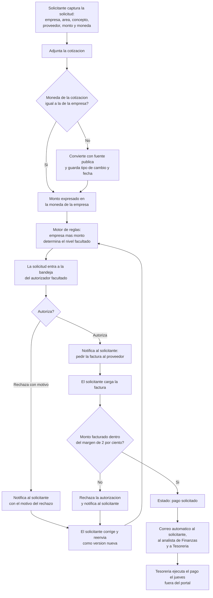
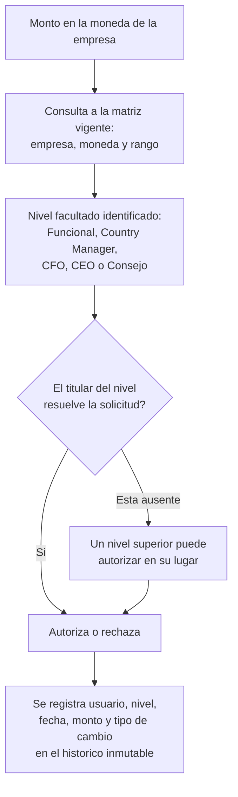

# PRD - Portal de Órdenes de Pago

| **Campo** | **Detalle** |
| --- | --- |
| **Proyecto** | Portal de Órdenes de Pago |
| **Área / empresa** | EngineCX — transversal a todas las empresas del Grupo Engine CX |
| **Versión** | v0.3 |
| **Fecha** | 2026-08-11 |
| **Autores** | Aldo Álvarez (Dirección de TI) |
| **Revisión / liderazgo** | Octavio Zetina Lara (CFO) — patrocinador; Aldo Álvarez — revisión técnica |
| **Tipo de proyecto** | Feature web / API |

## 1. Resumen ejecutivo

El Portal de Órdenes de Pago es una aplicación web interna para el Grupo Engine CX que concentra el ciclo completo de autorización de gastos: desde que un área captura su solicitud con la cotización del proveedor, pasando por la autorización del nivel jerárquico facultado según la política interna, hasta la recepción de la factura y el aviso a Finanzas y Tesorería para programar el pago. Sus usuarios son los colaboradores de todas las áreas que solicitan gastos, los niveles de autorización del grupo (Funcional, Country Manager, CFO, CEO y Consejo), y el equipo de Finanzas que gestiona los pagos.

Hoy el proceso vive al 100% en correo electrónico. Una solicitud recorre varios hilos —la cotización, la autorización expresa, el aviso al proveedor, la factura, la coordinación del pago— repartidos entre buzones distintos, sin un lugar donde consultar quién solicitó qué y quién lo autorizó. No existe una base de datos de gastos aprobados, de modo que el cierre financiero mensual obliga a reconstruir la información hilo por hilo. Con un volumen aproximado de 100 solicitudes al mes y diez empresas con reglas de autorización distintas por moneda y monto, el desorden es estructural, no de disciplina.

El MVP cubre el ciclo completo hasta dejar el pago solicitado: captura, conversión de moneda, determinación automática del nivel que debe autorizar, autorización o rechazo, carga y validación de la factura, notificación a Finanzas y Tesorería, e histórico auditable. La ejecución del pago sigue ocurriendo fuera del portal, como hoy. Las fases posteriores agregan el registro del pago ejecutado con sus tableros de cierre, y después la integración con contabilidad y el portal de proveedores.

El resultado esperado es una fuente única de verdad para el gasto del grupo: cada orden de pago con su solicitante, su autorizador, su monto, su moneda, su tipo de cambio y su factura, en un histórico que no se puede alterar. Operativamente elimina la gestión por correo; financieramente convierte el cierre en una consulta; y en control interno hace verificable el cumplimiento de una política que hoy solo se puede auditar leyendo correos.

**Solicitud con cotización** → **Autorización del nivel facultado** → **Factura del proveedor** → **Validación de monto** → **Aviso a Finanzas y Tesorería** → **Pago ejecutado fuera del portal**

## 2. Contexto y problema

**Cómo funciona hoy.** El proceso es enteramente por correo electrónico y sigue estos pasos:

1. Un área operativa —Infraestructura/TI, Ventas, Marketing u otra— necesita contratar un servicio o adquirir un bien y envía un correo con la **cotización y la explicación del servicio**.
2. Se requiere **autorización expresa** del Country Manager del negocio o de Dirección General, con copia al CFO para que esté enterado del gasto.
3. Autorizada la cotización, **se notifica al proveedor** para que emita la factura por el monto correspondiente.
4. La factura llega por correo y la toma el **analista de Finanzas asignado a la empresa** que absorbe el gasto.
5. Ese analista **solicita el pago** y **Tesorería lo ejecuta** el jueves siguiente.

**El dolor.** Al vivir todo en correo, la gestión se vuelve inmanejable: se acumulan hilos, y no existe un solo lugar donde confirmar quién solicitó un gasto y quién lo autorizó. No hay base de datos de gastos aprobados, lo que complica el cierre financiero y obliga a reconstruir el mes a partir de buzones. La consecuencia es desorden generalizado en la información del proceso y una política de autorización cuyo cumplimiento no es verificable sin auditar correspondencia.

**Por qué ahora.** La solicitud proviene directamente de Octavio Zetina, CFO del grupo, y llega respaldada por la política interna *Niveles de Autorización de Gastos* (versión 01, julio 2026), que fija niveles "de observación estricta y sin excepciones" para diez empresas en cuatro monedas. Existe la regla escrita, pero no existe el mecanismo que la haga cumplir: hoy nada impide que un gasto se autorice en un nivel que no le corresponde.

**Separación de conceptos.** Para el equipo de desarrollo, dos términos que la conversación usa casi como sinónimos pero que no lo son:

- **Solicitud de gasto**: la petición que un área captura con su cotización, y que puede ser rechazada o quedar sin resolver.
- **Orden de pago**: la solicitud que ya recorrió el ciclo completo — cotización autorizada, factura recibida y validada, y pago coordinado con Finanzas. Toda orden de pago nace de una solicitud de gasto, pero no toda solicitud de gasto llega a ser orden de pago.

Por ahora no se identifican otros términos del dominio que requieran distinción; podrán incorporarse conforme el portal opere.

## 3. Objetivo del producto

Centralizar en un portal único el ciclo completo de autorización de gastos del Grupo Engine CX —desde la captura de la solicitud con su cotización, pasando por la autorización jerárquica según empresa, moneda y monto, hasta la recepción de la factura y la notificación a Finanzas y Tesorería— eliminando la dependencia del correo electrónico y dejando un histórico auditable que sirva de fuente única para el cierre financiero.

La mejora medible esperada es que el 100% de las solicitudes de gasto se originen y resuelvan dentro del portal, que cada autorización quede registrada con el nivel facultado por la política, y que el cierre financiero pueda producirse consultando el sistema en lugar de reconstruirse desde correos.

### 3.1 Estrategia de implementación por fases

| **Fase** | **Nombre** | **Descripción** |
| --- | --- | --- |
| Fase 1 — **MVP** | Ciclo de autorización | Captura de la solicitud con cotización, conversión de moneda, motor de reglas que determina el nivel autorizador, autorización o rechazo, carga y validación de la factura, notificación a solicitante, analista de Finanzas y Tesorería, e histórico auditable con consulta y filtros. El pago se sigue ejecutando fuera del portal. |
| Fase 2 | Cierre del ciclo y visibilidad | Registro de que el pago fue ejecutado, con fecha y referencia; tablero de gastos autorizados, pendientes y pagados; reportes y exportación para el cierre financiero. |
| Fase 3 | Integración | Conexión con contabilidad y banca, portal de proveedores para que suban su factura directamente, y control presupuestal por área. |

**La Fase 1 es el MVP de este PRD.**

## 4. Usuarios y actores

| **Usuario / Actor** | **Rol en el proceso** |
| --- | --- |
| Solicitante | Colaborador de cualquier área —Infraestructura/TI, Ventas, Marketing, Operaciones— que captura la solicitud con la cotización y la explicación del servicio, y que posteriormente carga la factura que le entrega el proveedor |
| Funcional | Responsable funcional del área (Capital Humano, Finanzas, BI, Operaciones); primer nivel de autorización según la matriz |
| Country Manager | Autoriza los montos de su tramo en el negocio que dirige; no aplica en Engine CX ni Celta Soluciones |
| CFO (Octavio Zetina Lara) | Autoriza los montos de su tramo; es además el patrocinador de la política y del proyecto |
| CEO (Héctor Izquierdo) | Autoriza los montos altos de su tramo |
| Consejo | Autoriza los montos que exceden el tope del CEO. Está representado por Héctor Izquierdo, quien opera con un usuario distinto del de CEO para que quede registrado con qué investidura autorizó cada gasto |
| Analista de Finanzas | Asignado por empresa; recibe el aviso de pago autorizado y solicita el pago a Tesorería |
| Tesorería | Ejecuta el pago los jueves, fuera del portal |
| Proveedor | Actor externo; emite la factura por el monto autorizado. No es usuario del portal en el MVP |
| Administrador del sistema | TI en la etapa inicial, Tesorería más adelante; da de alta usuarios, los asocia a empresa y nivel, y mantiene los montos de la matriz |

## 5. Alcance MVP y funcionalidades

| **Funcionalidad** | **Descripción** |
| --- | --- |
| Captura de solicitud de gasto | El solicitante registra la empresa que absorbe el gasto, su área, el concepto y explicación del servicio, el proveedor, el monto y la moneda, y adjunta la cotización |
| Conversión de moneda | Cuando la moneda de la cotización difiere de la moneda de la empresa, el sistema la convierte usando una fuente pública gratuita y confiable, y guarda el tipo de cambio aplicado junto con su fecha en la solicitud |
| Motor de reglas de autorización | Con la empresa y el monto ya expresado en la moneda de esa empresa, el sistema determina automáticamente qué nivel debe autorizar, conforme a la matriz de la política |
| Bandeja de autorización | Cada autorizador ve las solicitudes que le corresponden y puede autorizarlas o rechazarlas; el rechazo exige capturar el motivo |
| Autorización jerárquica | Un nivel superior puede autorizar montos que corresponden a niveles inferiores, de modo que la ausencia de un titular no detenga el gasto |
| Aviso para solicitar la factura | Autorizada la cotización, el solicitante recibe la instrucción de pedirle al proveedor la factura por el monto autorizado |
| Carga de factura | El solicitante sube al portal la factura que le entregó el proveedor |
| Validación del monto facturado | El sistema compara la factura contra el monto autorizado con una tolerancia de ±2% por redondeo de centavos; fuera de ese margen rechaza la autorización y notifica al solicitante |
| Notificación de pago autorizado | Al validarse la factura, el portal envía correo automático al solicitante, al analista de Finanzas de esa empresa y a Tesorería |
| Corrección y reenvío | Ante un rechazo —de la cotización o de la factura— el solicitante puede corregir y reenviar la solicitud como una versión nueva, conservando el rechazo previo en el histórico |
| Cancelación de solicitud | El solicitante o el autorizador pueden cancelar una solicitud, incluso ya autorizada, mientras el pago no se haya solicitado; la cancelación exige motivo y queda en el histórico |
| Histórico auditable | Cada solicitud conserva de forma inalterable quién la pidió, quién la autorizó o rechazó, cuándo, con qué monto, moneda y tipo de cambio, y con qué documentos |
| Consulta y filtros | Bandeja de consulta con búsqueda y filtros por empresa, área, solicitante, estatus, rango de fechas y monto |
| Administración de catálogos | Alta de usuarios con su empresa y nivel de autorización, mantenimiento del catálogo de empresas y de los montos de la matriz cuando la política cambie de versión |

El principio rector del MVP es que **ningún pago se solicita a Tesorería sin autorización registrada del nivel que la matriz determina, y ninguna autorización puede borrarse ni editarse una vez otorgada**. El portal prioriza la integridad del rastro de autorización por encima de la comodidad: prefiere obligar a un reenvío antes que permitir una edición silenciosa. Coherente con ello, el MVP no toma ninguna decisión de negocio por sí mismo —no aprueba, no paga, no valida fiscalmente—; se limita a determinar quién debe decidir y a dejar constancia de lo que decidió.

## 6. Fuera de alcance

- **Ejecutar el pago o conectarse con la banca**: Tesorería sigue pagando fuera del portal los jueves; integrar banca es un proyecto de seguridad en sí mismo y se evalúa hasta la Fase 3.
- **Registrar que el pago fue ejecutado y los tableros de cierre financiero**: corresponden a la Fase 2, una vez que el ciclo de autorización esté estabilizado.
- **Portal de proveedores** para que el proveedor suba su factura directamente: Fase 3; implica accesos externos y un modelo de seguridad distinto.
- **Integración con contabilidad o ERP**: Fase 3; primero debe consolidarse la calidad del dato dentro del portal.
- **Control presupuestal por área**: el portal autoriza contra la matriz de montos, no contra un presupuesto disponible; requeriría que exista un presupuesto cargado y vigente por área.
- **Comparación de varias cotizaciones**: el proceso actual trabaja con una cotización ya elegida por el área solicitante.
- **Firma electrónica formal**: la autorización registrada con usuario identificado por SSO, fecha y sello de auditoría se considera suficiente para el control interno.
- **Viáticos, anticipos y reembolsos de gastos**: son un flujo distinto —el comprobante llega después de que el gasto ocurrió y no hay cotización previa— y se atenderán en un desarrollo aparte.
- **Validación fiscal de la factura ante el SAT**: en esta iteración basta con verificar el monto y conservar el archivo; la revisión fiscal la sigue haciendo el analista de Finanzas como hoy.

## 7. Flujos principales

### 7.1 Flujo principal — de la solicitud al pago solicitado

El flujo está construido sobre una idea: el sistema nunca decide si un gasto procede, solo determina **quién** tiene la facultad de decidirlo y deja constancia. Por eso la conversión de moneda ocurre *antes* del motor de reglas —el nivel se calcula siempre sobre la moneda de la empresa que absorbe el gasto, nunca sobre la moneda en que el proveedor cotizó— y por eso el tipo de cambio se guarda en la solicitud: sin ese dato, la autorización no sería reproducible ni auditable meses después.

Una solicitud puede además **cancelarse** en cualquier punto anterior a que el pago se solicite, incluso después de autorizada: un servicio que ya no se contrata, un proveedor que se cae. La cancelación exige motivo y no borra nada, de modo que el histórico distinga un gasto que se autorizó y se pagó de uno que se autorizó y se abandonó — sin esa distinción, toda solicitud autorizada sin pago parecería un pendiente eterno.

El segundo punto de control es la factura. La autorización se otorga sobre una cotización, pero lo que se paga es una factura, y entre una y otra puede haber diferencia. Un margen del ±2% absorbe el redondeo de centavos; cualquier cosa por encima significa que se está pagando algo distinto de lo autorizado, y el portal lo devuelve al solicitante en lugar de dejarlo pasar. El reenvío no borra nada: la versión rechazada permanece en el histórico, de modo que un auditor vea el intento fallido y no solo el desenlace.

### 7.2 Flujo transversal — determinación del nivel y suplencia

Este flujo aplica a toda solicitud, sea cual sea la empresa. La política define un único nivel facultado por monto —el gasto va directo a quien tiene la facultad, sin cadena de endosos previos— pero admite que un nivel superior resuelva en lugar del titular. Esa regla es deliberada: evita que la ausencia de una persona detenga la operación, sin abrir la puerta contraria, ya que un nivel inferior nunca puede autorizar por encima de su tramo. Engine CX y Celta Soluciones no tienen nivel de Country Manager, de modo que en esas empresas el Funcional escala directamente al CFO.

## 8. Requerimientos funcionales

| **ID** | **Requerimiento** | **Descripción** |
| --- | --- | --- |
| RF-01 | Captura de solicitud de gasto | El sistema permite registrar una solicitud con empresa que absorbe el gasto, área solicitante, concepto y explicación del servicio, proveedor, monto y moneda |
| RF-02 | Adjuntar cotización | El sistema permite adjuntar el archivo de la cotización a la solicitud y lo conserva asociado a ella de forma permanente |
| RF-03 | Conversión de moneda | Cuando la moneda de la cotización difiere de la moneda de la empresa, el sistema obtiene de una fuente pública el tipo de cambio vigente **a la fecha de envío de la solicitud** y calcula el monto equivalente |
| RF-04 | Persistencia del tipo de cambio | El sistema almacena el tipo de cambio aplicado, su fuente y su fecha, junto a la solicitud, de forma inalterable. El monto convertido queda fijo desde el envío y no se recalcula mientras la solicitud espera resolución |
| RF-05 | Determinación del nivel autorizador | El sistema determina el nivel facultado a partir de la empresa y del monto expresado en la moneda de esa empresa, conforme a la matriz vigente |
| RF-06 | Enrutamiento a la bandeja del autorizador | El sistema coloca la solicitud en la bandeja de pendientes del autorizador facultado y le notifica |
| RF-07 | Autorización | Un autorizador facultado puede autorizar una solicitud; el sistema registra usuario, nivel, fecha y monto autorizado |
| RF-08 | Rechazo con motivo | Un autorizador puede rechazar una solicitud, y el sistema exige capturar el motivo del rechazo |
| RF-09 | Autorización jerárquica | Un usuario de nivel superior al facultado puede autorizar la solicitud; el sistema lo permite y registra qué nivel resolvió efectivamente |
| RF-10 | Bloqueo de autorización por nivel inferior | El sistema impide que un usuario autorice montos que exceden su nivel según la matriz |
| RF-11 | Notificación de resolución al solicitante | El sistema notifica por correo al solicitante el resultado de la autorización, incluyendo el motivo en caso de rechazo |
| RF-12 | Instrucción de solicitar factura | Autorizada la cotización, el sistema notifica al solicitante que debe requerir al proveedor la factura por el monto autorizado |
| RF-13 | Carga de factura | El solicitante puede adjuntar a la solicitud autorizada el archivo de la factura y capturar su monto |
| RF-14 | Validación de monto facturado | El sistema compara el monto de la factura contra el monto autorizado y lo acepta si la diferencia no excede el ±2% |
| RF-15 | Rechazo automático por monto fuera de tolerancia | Si la diferencia excede el ±2%, el sistema rechaza la autorización y notifica al solicitante indicando la diferencia detectada |
| RF-16 | Notificación de pago autorizado | Validada la factura, el sistema envía correo al solicitante, al analista de Finanzas asignado a la empresa y a Tesorería |
| RF-17 | Corrección y reenvío | El solicitante puede corregir una solicitud rechazada y reenviarla como versión nueva; el sistema conserva la versión rechazada y su motivo |
| RF-18 | Histórico inmutable | El sistema conserva todos los cambios de estado, autorizaciones, rechazos y documentos sin permitir su edición ni eliminación posterior |
| RF-19 | Consulta con filtros | El sistema permite consultar solicitudes con filtros por empresa, área, solicitante, estatus, rango de fechas y rango de montos, y búsqueda por texto |
| RF-20 | Catálogo de empresas | El sistema opera sobre las diez empresas de la matriz vigente, cada una con su moneda asociada |
| RF-21 | Asignación de analista por empresa | El sistema mantiene el analista de Finanzas asignado a cada empresa, usado para dirigir la notificación de pago autorizado |
| RF-22 | Administración de usuarios y niveles | Un administrador puede dar de alta usuarios, asociarlos a su empresa y asignarles su nivel de autorización |
| RF-23 | Mantenimiento de la matriz | Un administrador puede actualizar los montos de la matriz sin requerir despliegue de código, y el sistema conserva la versión anterior y la fecha del cambio |
| RF-24 | Aplicación de la matriz vigente al momento de la solicitud | Cada solicitud se resuelve con la versión de la matriz vigente cuando fue enviada, de modo que un cambio posterior no altere autorizaciones ya registradas |
| RF-25 | Representación del Consejo | El sistema admite que una misma persona opere con usuarios separados para el nivel CEO y para el nivel Consejo, y registra en cada autorización con cuál de los dos resolvió. Un usuario de nivel CEO no puede autorizar montos que corresponden al Consejo: debe hacerlo con el usuario de ese nivel |
| RF-26 | Prohibición de autorizar la propia solicitud | El sistema impide que un usuario autorice una solicitud que él mismo originó, aun cuando su nivel cubra el monto, y la enruta al nivel inmediato superior |
| RF-27 | Cancelación de solicitud | El solicitante o el autorizador pueden cancelar una solicitud mientras el pago no se haya solicitado, incluso si ya estaba autorizada; el sistema exige motivo, deja la solicitud en estado cancelado y conserva todo su historial |

## 9. Requerimientos no funcionales

| **ID** | **Requerimiento** | **Descripción** |
| --- | --- | --- |
| RNF-01 | Autenticación por SSO | El acceso al portal se realiza mediante inicio de sesión único con la cuenta corporativa de **Google Workspace**; no se administran contraseñas propias del sistema |
| RNF-02 | Control de acceso por rol y empresa | Cada usuario ve y opera únicamente lo que su rol y su empresa le permiten; los niveles de autorización se derivan del catálogo administrado, no de la elección del usuario |
| RNF-03 | Trazabilidad y auditabilidad | Toda acción relevante —creación, envío, autorización, rechazo, carga de factura, cambio de catálogo— queda registrada con usuario, fecha, hora y valores involucrados |
| RNF-04 | Inmutabilidad del histórico | Ningún registro de autorización o rechazo puede editarse ni eliminarse; las correcciones se expresan como versiones nuevas |
| RNF-05 | Retención de información | El histórico de solicitudes se conserva por un mínimo de 2 años |
| RNF-06 | Accesibilidad desde internet y en móvil | El portal es accesible desde internet y su interfaz de autorización es utilizable desde teléfono, dado que Country Managers y CEO autorizan fuera de la oficina |
| RNF-07 | Disponibilidad | El portal debe estar disponible en horario operativo de las regiones que atiende — México, Colombia, Chile y España —, con ventanas de mantenimiento fuera de ese horario |
| RNF-08 | Tolerancia a fallas de la fuente de tipo de cambio | Si la fuente pública de tipo de cambio no responde, el sistema informa la situación y permite continuar mediante captura manual del tipo de cambio con registro de quién lo capturó, sin bloquear indefinidamente la operación |
| RNF-09 | Seguridad de documentos | Cotizaciones y facturas se almacenan cifradas y solo son accesibles a usuarios con permiso sobre la solicitud correspondiente |
| RNF-10 | Privacidad de información financiera | El portal concentra montos, proveedores y facturas de todo el grupo; el acceso se segmenta por empresa y rol, y no se expone información de una empresa a usuarios de otra |
| RNF-11 | Manejo de errores | Los fallos de envío de correo, de conversión de moneda o de carga de archivos se registran y se notifican, sin dejar solicitudes en estados intermedios indeterminados |
| RNF-12 | Escalabilidad proporcional | El volumen esperado es de aproximadamente 100 solicitudes mensuales; la solución debe privilegiar la simplicidad operativa y el bajo costo de infraestructura sobre la escala |
| RNF-13 | Mantenibilidad de las reglas | Los montos de la matriz, el catálogo de empresas y la asignación de analistas son datos administrables, no valores fijos en el código |
| RNF-14 | Soporte multimoneda | El sistema opera con pesos mexicanos, pesos colombianos, pesos chilenos y euros, respetando la moneda propia de cada empresa |
| RNF-15 | Observabilidad | El sistema expone registros y métricas técnicas que permitan diagnosticar fallas de notificación, de integración con la fuente de tipo de cambio y de autenticación |
| RNF-16 | Infraestructura | La solución se despliega en la infraestructura AWS del grupo |

## 10. Integraciones y datos

| **Integración / Fuente** | **Uso esperado** |
| --- | --- |
| Google Workspace — identidad (SSO) | Autenticación de todos los usuarios y obtención de su identidad verificada, base del registro de auditoría |
| Google Workspace — correo | Envío de las notificaciones a solicitantes, autorizadores, analistas de Finanzas y Tesorería. Debe considerarse el límite de envío por cuenta que impone la plataforma |
| Fuente pública de tipo de cambio | Consulta de solo lectura del tipo de cambio vigente a la fecha de envío de la solicitud, para convertir cotizaciones a la moneda de la empresa; se privilegian fuentes oficiales gratuitas —Banxico o DOF para peso mexicano, Banco Central Europeo para euro— y se registra la fuente utilizada |
| Almacenamiento de archivos en AWS | Resguardo de cotizaciones y facturas asociadas a cada solicitud |
| Base de datos relacional en AWS | Persistencia de solicitudes, catálogos, autorizaciones y bitácora de auditoría |

**Datos mínimos requeridos para operar el MVP:**

- **Empresa**: nombre canónico, moneda base, estatus activo. Diez empresas: Garantiplus México, Garantiplus Colombia, Garantiplus Chile, Go Virtual México, Go Virtual España, Invarat, Gplus Seguros, TPA, Celta Soluciones y Engine CX.
- **Matriz de autorización**: empresa, nivel, monto mínimo, monto máximo, versión de la política, vigencia.
- **Usuario**: identidad de SSO, nombre, correo, empresa, área, nivel de autorización, estatus.
- **Analista de Finanzas por empresa**: empresa, usuario asignado.
- **Solicitud de gasto**: folio, solicitante, empresa que absorbe el gasto, área, concepto y explicación, proveedor, monto y moneda de la cotización, monto convertido, tipo de cambio aplicado con fuente y fecha, nivel facultado calculado, estatus, versión, fechas de creación y de envío.
- **Autorización**: solicitud, usuario que resolvió, nivel con el que resolvió, resultado, motivo en caso de rechazo, fecha y hora.
- **Factura**: solicitud, monto facturado, moneda, archivo, diferencia contra lo autorizado, resultado de la validación, fecha de carga.
- **Documento**: solicitud, tipo —cotización o factura—, archivo, quién lo cargó, fecha.
- **Bitácora de auditoría**: entidad afectada, acción, usuario, fecha y hora, valores relevantes.

**Esquema de permisos.** El solicitante puede crear solicitudes, adjuntar cotizaciones y facturas, y consultar únicamente las suyas y las de su área; no puede modificar montos ni estatus una vez enviada la solicitud. El autorizador puede leer las solicitudes que le corresponden por nivel y empresa, y escribir exclusivamente el resultado de la autorización con su motivo; nunca puede editar el contenido de la solicitud que autoriza. El analista de Finanzas y Tesorería tienen acceso de lectura a las solicitudes de las empresas que atienden y a sus documentos. El administrador —TI en la etapa inicial— puede escribir sobre los catálogos de usuarios, empresas, asignación de analistas y montos de la matriz, pero no puede autorizar solicitudes ni alterar autorizaciones ya registradas. Queda bloqueado para todos, sin excepción de rol, la edición o eliminación de una autorización otorgada, de un rechazo registrado o de un documento adjunto: el histórico solo admite adiciones. Los cambios a la matriz de montos, por ser el permiso más sensible del portal —quien la edita cambia quién autoriza qué—, quedan registrados en bitácora con su versión anterior, su autor y su fecha.

## 11. Eventos para BI

**Eventos del ciclo de la solicitud**

- `solicitud_creada`: se registra cuando el solicitante guarda una solicitud, aún en borrador.
- `solicitud_enviada`: se registra cuando la solicitud se envía a autorización y el sistema determina el nivel facultado.
- `solicitud_autorizada`: se registra cuando un autorizador aprueba la solicitud.
- `solicitud_rechazada`: se registra cuando un autorizador rechaza la solicitud, con su motivo.
- `solicitud_reenviada`: se registra cuando el solicitante corrige y reenvía una solicitud previamente rechazada, generando una versión nueva.
- `solicitud_cancelada`: se registra cuando una solicitud se cancela antes de que se solicite el pago, con su motivo y quién la canceló.
- `autorizacion_bloqueada_por_autoria`: se registra cuando el sistema impide que un usuario autorice su propia solicitud y la escala al nivel superior.
- `autorizacion_por_nivel_superior`: se registra cuando quien resuelve tiene un nivel superior al facultado por el monto, para medir la frecuencia de suplencias.

**Eventos de conversión y factura**

- `tipo_cambio_aplicado`: se registra cuando el sistema convierte la cotización a la moneda de la empresa, indicando fuente y valor.
- `tipo_cambio_capturado_manual`: se registra cuando la fuente pública no respondió y un usuario capturó el tipo de cambio.
- `factura_cargada`: se registra cuando el solicitante adjunta la factura del proveedor.
- `factura_validada`: se registra cuando el monto facturado queda dentro del margen de tolerancia.
- `factura_fuera_de_tolerancia`: se registra cuando la diferencia excede el ±2% y el sistema rechaza la autorización.

**Eventos de pago y notificación**

- `pago_solicitado`: se registra cuando la solicitud alcanza el estado de pago solicitado y se notifica a Finanzas y Tesorería.
- `notificacion_enviada`: se registra por cada correo que el portal envía, con su destinatario y tipo.
- `notificacion_fallida`: se registra cuando un envío de correo falla.

**Eventos de administración**

- `matriz_actualizada`: se registra cuando un administrador modifica los montos de la matriz, con la versión anterior y la nueva.
- `usuario_nivel_modificado`: se registra cuando cambia el nivel de autorización o la empresa de un usuario.

**Campos mínimos por evento**: fecha y hora, usuario que lo originó, folio de la solicitud cuando aplica, empresa, área, monto y moneda original, monto convertido y tipo de cambio aplicado, nivel facultado, nivel que resolvió, resultado y motivo cuando aplica.

## 12. Métricas de éxito

| **Métrica** | **Descripción** |
| --- | --- |
| Adopción del portal | Porcentaje de solicitudes de gasto que se originan en el portal frente a las que siguen llegando por correo. Meta sugerida: 100% al tercer mes de operación, pendiente de validar con Finanzas |
| Tiempo de autorización | Días promedio entre el envío de la solicitud y su resolución por el autorizador. Línea base actual desconocida — pendiente de estimar con Finanzas y operación |
| Cumplimiento de la política | Porcentaje de gastos autorizados por el nivel que la matriz determina, incluyendo los resueltos por nivel superior. Meta: 100% |
| Trazabilidad completa | Porcentaje de órdenes de pago con histórico completo: solicitante, autorizador, monto, moneda, tipo de cambio y documentos. Meta: 100% |
| Facturas fuera de tolerancia | Porcentaje de facturas rechazadas por exceder el ±2% respecto de la cotización autorizada; mide la precisión de las cotizaciones de proveedores |
| Esfuerzo de cierre financiero | Reducción del tiempo que Finanzas dedica a reconstruir la información de gastos del mes. Línea base pendiente de definir con Finanzas |

## 13. Riesgos y supuestos

### Riesgos

| **Riesgo** | **Impacto potencial** |
| --- | --- |
| Convivencia con el correo durante la transición | Finanzas dejará de recibir autorizaciones por correo una vez que el portal opere, lo que elimina el riesgo de fondo. Subsiste el riesgo de transición: mientras la instrucción se difunde y las áreas se habitúan, pueden llegar solicitudes por el canal anterior y quedar fuera del histórico |
| Desalineación entre la matriz cargada y la política vigente | Se autorizarían gastos con niveles obsoletos, incumpliendo una política declarada de observancia estricta y sin excepciones |
| Indisponibilidad de la fuente gratuita de tipo de cambio | Al no tener acuerdo de nivel de servicio, su caída detendría la autorización de gastos en moneda extranjera si no existiera el mecanismo manual de respaldo |
| Manipulación del tipo de cambio o de la empresa que absorbe el gasto | Seleccionar una empresa o un tipo de cambio incorrectos, deliberadamente o por error, puede colocar el gasto en un nivel de autorización más bajo del que le corresponde |
| Concentración de información financiera sensible | El portal reúne montos, proveedores y facturas de todo el grupo con acceso desde internet, lo que eleva el impacto de un acceso indebido |
| Dependencia de la actualización de catálogos | Si TI no mantiene al día usuarios, niveles y analistas asignados, las solicitudes se enrutarían a personas equivocadas o quedarían sin autorizador |
| Concentración de empresas en un mismo analista | Una sola analista atiende cuatro empresas; su ausencia afectaría simultáneamente a varios negocios y no hay suplente definido |

### Supuestos

| **Supuesto** | **Descripción** |
| --- | --- |
| Sustitución del canal | Finanzas dejará de recibir autorizaciones de gasto por correo electrónico una vez que el portal esté en operación; el portal será el único canal válido para autorizar un gasto |
| Vigencia de la matriz | La matriz de niveles de autorización, versión 01 de julio 2026, con las diez empresas y sus rangos normalizados, es la regla vigente y aplicable |
| Rangos exclusivos y contiguos | Cada nivel de la matriz opera desde el monto inmediato superior al techo del nivel anterior, sin traslapes ni huecos |
| Identidad corporativa disponible | Todos los usuarios del portal —solicitantes, autorizadores, Finanzas y Tesorería— cuentan con cuenta corporativa habilitada para SSO |
| El pago se ejecuta fuera del portal | Tesorería mantiene su calendario de pagos los jueves y su mecanismo actual de ejecución durante todo el MVP |
| La factura la entrega el proveedor al solicitante | El proveedor no interactúa con el portal; el solicitante es quien recibe la factura y la carga |
| Volumen estimado | El portal se dimensiona para aproximadamente 100 solicitudes mensuales |
| Alcance limitado a gastos con cotización | Todo gasto que entra al portal tiene una cotización previa de un proveedor; viáticos, anticipos y reembolsos se atienden por otra vía |

## 14. Preguntas abiertas

| **Tema** | **Pregunta abierta** |
| --- | --- |
| Autorización | ¿Quién es el "Funcional" de cada área y empresa? La política nombra el nivel pero no identifica a las personas. Es el dato que falta para dar de alta usuarios y para enrutar las solicitudes de monto bajo, que son la mayoría |
| Tipo de cambio | ¿Qué fuente pública oficial y gratuita se usará para cada moneda? Banxico o DOF resuelven el peso mexicano y el Banco Central Europeo el euro, pero falta definir la fuente para las conversiones que involucren peso colombiano y peso chileno |
| Catálogo de empresas | ISAMAD aparece en la relación de gestión de pagos pero no tiene niveles en la matriz, por lo que queda fuera del portal. ¿Se le definirán niveles de autorización para incorporarla más adelante? |
| Catálogo de empresas | Go Virtual España está en la matriz pero no opera aún ni tiene analista asignado. ¿Cuándo se prevé su incorporación efectiva? |
| Datos de usuarios | Falta el apellido de "Brian", analista de Garantiplus Colombia, para su alta como usuario |
| Datos de usuarios | Garantiplus México, Garantiplus Colombia y Engine CX tienen registrados buzones genéricos —`administracion@`, `contabilidad@`— en lugar de cuentas personales. Sirven para recibir notificaciones, pero bajo SSO un buzón compartido no identifica a una persona. ¿Se dan de alta cuentas personales para esos analistas? |
| Retención | El histórico de solicitudes se conservará 2 años. ¿Los archivos de factura requieren un plazo mayor por criterio fiscal? En México lo habitual son 5 años; corresponde a Finanzas definirlo |
| Retención | ¿Qué debe ocurrir con la información una vez cumplido el plazo de retención: eliminación, archivado o exportación? |
| Operación | ¿Existe suplente para los analistas de Finanzas que concentran varias empresas, y debe el portal contemplarlo? |
| Infraestructura | ¿Cuál es el presupuesto disponible para la infraestructura AWS de este portal y quién lo aprueba? |
| Métricas | Falta establecer la línea base de tiempo de autorización y de esfuerzo de cierre financiero, para poder fijar metas numéricas |
