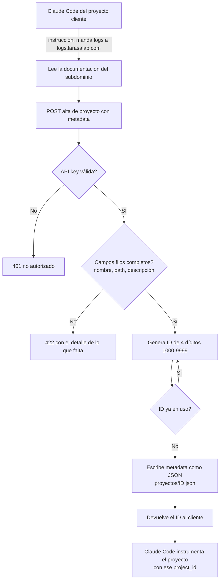
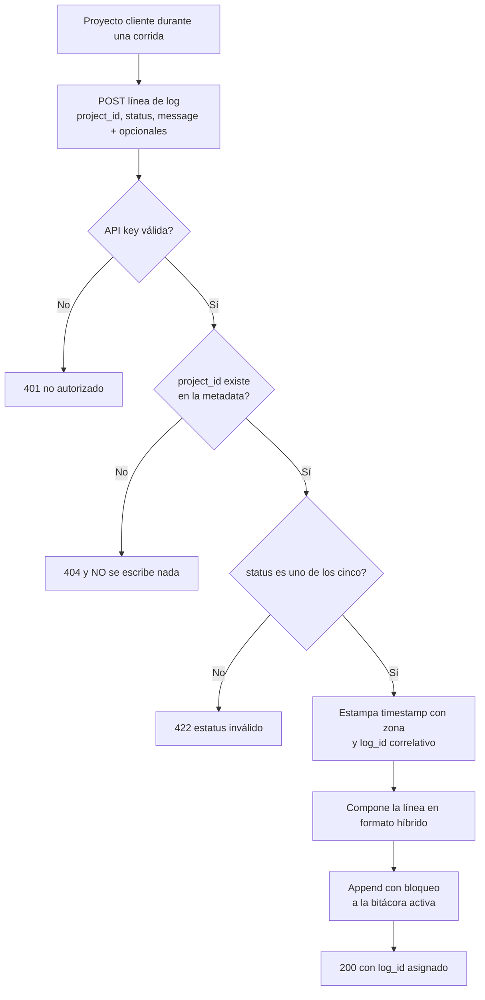
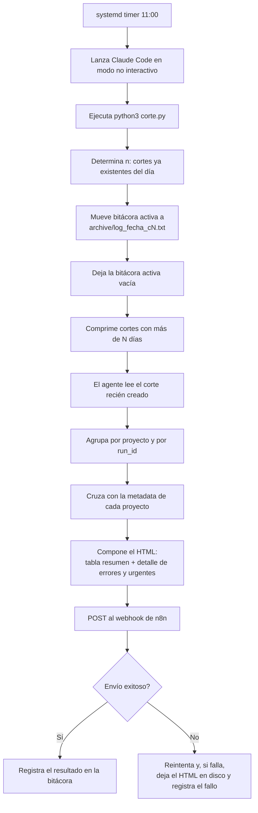
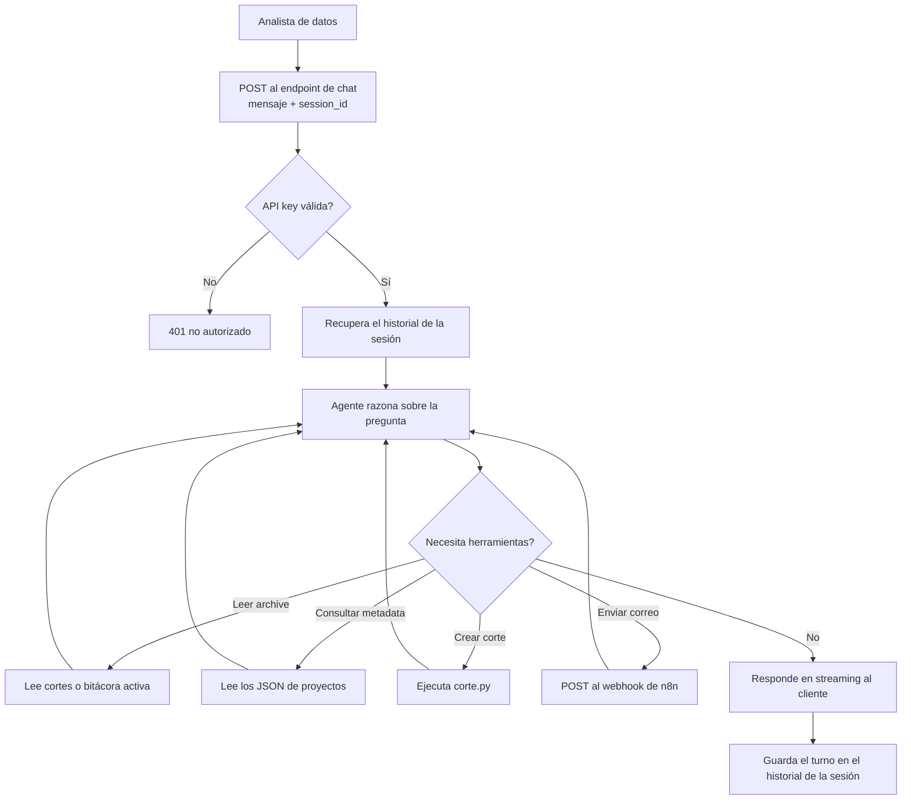

# PRD - API de Bitácora de Logs (logs.larasalab.com)

| **Campo** | **Detalle** |
| --- | --- |
| **Proyecto** | API de Bitácora de Logs (logs.larasalab.com) |
| **Área / empresa** | EngineCX |
| **Versión** | v0.1 |
| **Fecha** | 2026-08-28 |
| **Autores** | Omar Lara (omar.lara@enginecx.com) |
| **Revisión / liderazgo** | Omar Lara |
| **Tipo de proyecto** | Automatización interna |

## 1. Resumen ejecutivo

La **API de Bitácora de Logs** es un servicio interno que centraliza en un solo archivo de texto plano lo que reportan todos los proyectos, scripts y automatizaciones que Omar Lara mantiene en distintas máquinas y nubes. Cada request a la API se convierte en exactamente una línea del archivo de bitácora. El beneficiario directo es el analista de datos, que hoy no tiene un lugar único al que asomarse para saber qué corrió, qué falló y por qué.

El problema actual es triple: no existe visibilidad centralizada — hay que entrar a cada proyecto por separado —, los fallos son silenciosos — se descubren cuando alguien los nota, no cuando ocurren — y cuando sí hay un log, le falta contexto para diagnosticar: no dice de dónde vino, en qué máquina corrió ni bajo qué condiciones. El valor diferencial de este proyecto no es guardar mensajes: es **poder responder de dónde provino cada línea**. Eso se logra obligando a que todo proyecto se registre antes de emitir logs, quedando descrito en un archivo JSON de metadata libre y recibiendo un **ID único de 4 dígitos** que firma cada una de sus líneas.

El MVP de este PRD cubre dos fases completas. La **Fase 1** entrega el núcleo de la bitácora: alta de proyectos con asignación de ID, ingesta de líneas de log con campos de diagnóstico, la función de corte (`corte.py`) que rota el archivo al histórico, el alta del servicio en el sistema operativo con arranque automático, y la documentación OpenAPI autodescubrible desde el propio subdominio. La **Fase 2** pone la inteligencia encima: un corte diario a las 11:00 disparado por el sistema, un agente de IA que lee ese corte y lo analiza, un reporte ejecutivo en HTML enviado por correo a través del webhook de n8n existente, y un endpoint de chat con streaming para conversar con el agente sobre el histórico.

El resultado esperado es que un fallo deje de ser invisible: cualquier error o urgencia aparece en el reporte del día siguiente sin que nadie tenga que buscarlo, y que el histórico completo de todos los proyectos sea reconstruible uniendo los cortes del archive en orden. En el plano de adopción, el objetivo es que dar de alta un proyecto nuevo cueste una sola frase — *"las logs mándalas a mi API de logs.larasalab.com"* — porque la API se documenta a sí misma lo bastante bien para que Claude Code averigüe el resto solo.

**Registro del proyecto (obtiene ID)** → **envío de líneas de log** → **escritura en la bitácora activa** → **corte diario 11:00 al archive** → **análisis del agente de IA** → **reporte HTML por correo**

## 2. Contexto y problema

**Cómo funciona hoy.** Omar Lara opera varios proyectos heterogéneos — ETLs, scrapers, automatizaciones, servicios — distribuidos entre máquinas locales, una máquina Linux propia y proveedores de nube distintos (AWS, GCP). Cada uno registra su actividad como puede: `print` a la salida estándar, un archivo local, la consola del proveedor, o nada. No hay convención común ni destino compartido.

**El dolor concreto, en tres frentes.**

1. **Cero visibilidad centralizada.** Saber qué pasó ayer implica entrar a cada proyecto, en su máquina o su consola, con sus credenciales y su formato. El costo de revisar todo es tan alto que en la práctica no se revisa.
2. **Fallos silenciosos.** Cuando un proceso falla, nadie se entera hasta que el efecto se nota aguas abajo — un dato que no llegó, un correo que no salió. No existe ningún mecanismo de alerta.
3. **Falta de contexto al diagnosticar.** Incluso cuando hay un log, dice *qué* pasó pero no *dónde* ni *en qué condiciones*: qué proyecto lo emitió, en qué máquina, en qué entorno, cuánto tardó, cuántos registros movió. Reconstruir eso a mano consume el tiempo que debería usarse en resolver.

**Por qué ahora.** El número de proyectos activos ya superó el punto en que la revisión manual es viable, y no hay presupuesto ni justificación para un SaaS de observabilidad dimensionado para escalas mucho mayores. Con una máquina Linux propia ya disponible y un túnel de Cloudflare que puede exponerla, el costo marginal de construir la bitácora es prácticamente sólo el desarrollo.

**Separación de conceptos que el equipo dev debe distinguir desde el día 1.**

| Concepto | Definición |
| --- | --- |
| **Proyecto** | La entidad registrada, con metadata propia y un ID de 4 dígitos permanente. Existe independientemente de que corra o no. Vive como archivo JSON. |
| **Corrida (`run`)** | Una ejecución concreta de un proyecto, identificada por `run_id`. Un proyecto tiene muchas corridas al día. |
| **Línea de log** | Un evento dentro de una corrida. Una corrida emite varias líneas (una por paso). Es la unidad que la API recibe y escribe. |
| **Corte** | La rotación del archivo de bitácora activo hacia el archive. No es un evento de negocio: es una operación de archivado. Numerado por día empezando en `c0`. |
| **Bitácora activa** | El archivo único al que se están escribiendo las líneas en este momento. Se vacía en cada corte. |
| **Archive** | La carpeta con todos los cortes históricos. Unir sus archivos en orden reconstruye el histórico completo. |

Un punto crítico: **el archivo de texto es la fuente de verdad**, no una base de datos. Todo lo demás — reportes, análisis, chat — se deriva de leer esos archivos.

## 3. Objetivo del producto

Construir un servicio de bitácora centralizada, propio y autoalojado, que reciba por HTTP las líneas de log de cualquier proyecto previamente registrado, las escriba con contexto de diagnóstico suficiente en un archivo de texto que es la fuente de verdad, y las archive en cortes ordenados que permitan reconstruir el histórico completo. Sobre esa base, un agente de IA debe analizar el corte del día y entregar un reporte ejecutivo por correo que convierta los fallos silenciosos en fallos visibles en menos de 24 horas.

El servicio debe correr como servicio del sistema operativo en la máquina Linux, arrancar con ella, exponerse en `logs.larasalab.com` mediante túnel de Cloudflare, y documentarse a sí mismo con suficiente detalle y ejemplos para que un agente como Claude Code pueda integrar un proyecto nuevo partiendo únicamente del nombre del subdominio.

### 3.1 Estrategia de implementación por fases

| **Fase** | **Nombre** | **Descripción** |
| --- | --- | --- |
| Fase 1 | Núcleo de la bitácora | Alta de proyectos con asignación de ID de 4 dígitos, ingesta de líneas de log, escritura en formato híbrido, `corte.py`, carpeta archive con compresión de cortes antiguos, autenticación por API key única, alta como servicio del sistema con arranque automático, exposición vía túnel de Cloudflare y documentación OpenAPI autodescubrible con ejemplos completos. |
| Fase 2 | Inteligencia y reporte | Timer del sistema que a las 11:00 ejecuta el corte y lanza al agente de IA en modo no interactivo; análisis del corte del día; reporte ejecutivo en HTML enviado por el webhook de n8n; endpoint de chat con streaming, sesiones con historial y herramientas para leer el archive, consultar metadata, crear cortes y disparar correos a petición. |
| Fase 3 | Acción automatizada | *(Futuro, fuera de alcance de este PRD.)* Que el agente pase de alertar a actuar: reintentar procesos fallidos, abrir tickets, escalar por otros canales, correlacionar entre proyectos. |

**El MVP de este PRD son las Fases 1 y 2 completas.** La Fase 3 se documenta sólo para dejar claro el límite: en este alcance el agente **alerta y reporta, nunca remedia**.

## 4. Usuarios y actores

Por ser una automatización interna, los actores son mayoritariamente equipos y sistemas, no usuarios finales.

| **Usuario / Actor** | **Rol en el proceso** |
| --- | --- |
| **Analista de datos** (Omar Lara) | Consumidor principal. Lee el reporte ejecutivo diario y, cuando necesita profundizar, conversa con el agente o consulta el archive directamente. Es quien decide qué hacer con lo que la bitácora revela. |
| **Operador / TI** (Omar Lara) | Administra la máquina Linux, el servicio del sistema, el túnel de Cloudflare y la API key única. Da de alta proyectos nuevos y custodia el disco. |
| **Proyectos cliente** (ETLs, scrapers, automatizaciones, servicios) | Emisores de logs. Cada uno se registra una vez, obtiene su ID de 4 dígitos y desde entonces emite líneas de log durante sus corridas. |
| **Claude Code de cada proyecto cliente** | Integrador. A partir de la instrucción "manda las logs a logs.larasalab.com" descubre la API leyendo su documentación, registra el proyecto e instrumenta el código emisor. Es el consumidor real de la documentación OpenAPI. |
| **API de bitácora** (servicio FastAPI) | Valida la API key, valida que el `project_id` exista, estampa `timestamp` y `log_id`, y escribe la línea en la bitácora activa. |
| **`corte.py`** | Función de rotación. Mueve la bitácora activa al archive con nombre `log_{fecha}_c{n}.txt`, deja el archivo activo vacío y comprime los cortes antiguos. |
| **Agente de análisis** (Claude Code headless) | Lanzado por el timer a las 11:00. Ejecuta el corte, lee el corte resultante, lo analiza y compone el reporte. |
| **Agente conversacional** (endpoint de chat) | Atiende las conversaciones con el analista, con acceso al archive, a la metadata de proyectos, a la creación de cortes y al envío de correos. |
| **systemd** | Mantiene el servicio de la API activo y habilitado al arranque, y agenda el timer del corte diario. |
| **Webhook de n8n** | Canal de salida de correo. Recibe el HTML del reporte y lo envía. Ya existe y ya está preparado. |
| **Túnel de Cloudflare** | Publica `logs.larasalab.com` apuntando a la máquina Linux, sin exponer puertos ni IP. |

## 5. Alcance MVP y funcionalidades

| **Funcionalidad** | **Descripción** |
| --- | --- |
| **Alta de proyecto** | Endpoint que recibe la metadata del proyecto. Exige tres campos fijos — `nombre`, `path` y la descripción de qué hace — y acepta cualquier cantidad de campos libres adicionales (nube usada, periodicidad, máquina, responsable, dependencias, lo que cada proyecto necesite). Al quedar completo el alta, el sistema asigna un ID único de 4 dígitos y lo **devuelve al cliente en la respuesta**, que es la única manera en que el cliente conoce su ID. La metadata se persiste como un archivo JSON por proyecto. |
| **Asignación de ID de 4 dígitos** | Genera un identificador de 4 dígitos en el rango 1000–9999, verificando contra la carpeta de metadata que no esté en uso. El ID es permanente e inmutable: firma todas las líneas de log del proyecto para siempre. |
| **Consulta de proyectos** | Endpoints para listar los proyectos registrados y para leer la metadata completa de uno por su ID. Permite que el analista y el agente respondan "de dónde vino esta línea" sin abrir archivos a mano. |
| **Actualización de metadata** | Endpoint para modificar la metadata de un proyecto ya registrado (cambió de máquina, cambió la periodicidad, se agregó un campo). El ID nunca cambia. |
| **Ingesta de línea de log** | Endpoint que recibe una línea y la escribe en la bitácora activa. Obligatorios: `project_id`, `status` y `message`. Opcionales documentados: `run_id`, `step`, `duration_ms`, `records`, `host`, `env`, `trigger`, `attempt`, `error_code` y un objeto libre `extra`. Una request = exactamente una línea. |
| **Validación de estatus** | Sólo se aceptan los cinco estatus definidos: `error`, `success`, `warning`, `test`, `urgent`. Cualquier otro valor se rechaza, para que las agregaciones del reporte sean confiables. |
| **Validación de proyecto** | Si el `project_id` no está registrado, la API responde 404 y **no escribe nada**. Garantiza que toda línea del archivo sea rastreable a un proyecto con metadata — el propósito central del sistema. |
| **Estampado por el servidor** | La API estampa el `timestamp` en ISO 8601 con zona horaria y un `log_id` correlativo global. El cliente no controla la hora, así que ninguna línea puede mentir sobre cuándo ocurrió ni desordenar el archivo. |
| **Escritura en formato híbrido** | Cada línea se escribe con los campos críticos al frente, legibles en columnas (`timestamp \| project_id \| STATUS \| run=… \| step=…`), y los campos variables como objeto JSON al final. Se lee con los ojos en la terminal y se parsea sin ambigüedad desde código. |
| **Escritura segura y concurrente** | Las escrituras son atómicas y en modo append, con bloqueo, de forma que varias requests simultáneas no se entremezclen ni pierdan líneas, y un corte en curso no corrompa una escritura. |
| **Función de corte** | Un ejecutable `python3 corte.py`, sin más ceremonia: mueve la bitácora activa a `archive/log_{fecha}_c{n}.txt`, donde `n` es el número de corte del día empezando en `0`, y deja la bitácora activa vacía y lista para recibir. No es un endpoint; es una función disponible para el agente y para el operador. |
| **Numeración de cortes por día** | El número de corte se determina inspeccionando el archive: el primer corte de cada día es `c0` y va incrementando. Nunca sobrescribe un corte existente. |
| **Compresión del archive** | Los cortes con más de N días se comprimen a `.txt.gz`. Nada se borra nunca — el histórico completo sigue siendo reconstruible — pero el disco no crece sin control. |
| **Autenticación por API key única** | Todos los endpoints exigen una API key única y global enviada por header. Sin key válida, ninguna operación procede, incluido el alta de proyectos. |
| **Alta como servicio del sistema** | La API corre como servicio de `systemd`, habilitado para arrancar junto con la máquina, con reinicio automático ante caída y logs del propio servicio consultables por las herramientas del sistema. |
| **Exposición por túnel de Cloudflare** | `logs.larasalab.com` resuelve a la máquina Linux a través del túnel, que también corre como servicio habilitado. No se abren puertos ni se expone la IP. |
| **Documentación OpenAPI autodescubrible** | El propio subdominio sirve el esquema OpenAPI y una interfaz de documentación navegable, más un documento de integración en texto plano pensado para que un agente lo lea de una sola pasada. Cubre los cinco estatus con cuándo usar cada uno, el contrato de la línea de log campo por campo, la estructura fija y libre de la metadata de proyecto, todos los códigos de error, y **ejemplos ejecutables de todo** — alta, ingesta y consulta — en `curl` y en Python. |
| **Endpoint de health** | Endpoint de verificación que reporta que el servicio vive, cuál es el corte vigente y cuántas líneas lleva la bitácora activa. Sirve al monitoreo y al diagnóstico del propio servicio. |
| **Corte y análisis diario** | Un timer del sistema a las 11:00 ejecuta el corte y lanza al agente de IA en modo no interactivo, que lee el corte recién creado y lo analiza. Una vez al día por ahora, con la frecuencia como parámetro de configuración. |
| **Reporte ejecutivo por correo** | El agente compone un correo HTML con una tabla resumen de una fila por proyecto — ID, nombre, corridas, conteos de `success` / `warning` / `error` / `urgent` / `test`, registros procesados y duración — y debajo una sección con el detalle de cada error y cada urgente, con su mensaje, `step` y `error_code`, para no tener que abrir el archivo. Se envía por el webhook de n8n. |
| **Endpoint de chat con el agente** | Endpoint conversacional con respuesta en streaming, que mantiene sesiones con historial para permitir preguntas de seguimiento. El agente dispone de herramientas para leer cualquier corte del archive y la bitácora activa, consultar la metadata de los proyectos, ejecutar un corte a petición y disparar un correo cuando se le pida. |

**Principio rector del MVP.** Dos reglas no se rompen. La primera: **ninguna línea entra a la bitácora sin ser rastreable a un proyecto registrado** — si el ID no existe, se rechaza, aunque eso signifique perder el mensaje. La segunda: **el archivo de texto es la fuente de verdad y nunca se edita ni se borra** — sólo se le hace append y se rota. Las decisiones que el MVP explícitamente **no** toma: el agente no remedia nada, no reintenta procesos, no modifica configuraciones ni actúa sobre los proyectos cliente. Alerta y reporta; la acción es humana.

## 6. Fuera de alcance

- **Base de datos relacional o motor de índice:** el archivo de texto es la fuente de verdad por diseño. Se habilitaría si el volumen hiciera inviable el análisis por lectura secuencial.
- **Interfaz web para consultar logs:** el consumo es por reporte de correo y por chat. Una UI se justificaría cuando haya más de un consumidor humano.
- **Acción automatizada o remediación:** es explícitamente la Fase 3. En el MVP el agente alerta y reporta; actuar requiere primero confianza en el diagnóstico.
- **Alertas en tiempo real:** el ciclo es el corte diario de las 11:00. Se habilitaría con un umbral de urgencia y un canal inmediato, cuando la latencia de 24 h resulte insuficiente para algún proyecto.
- **API key por proyecto y esquema de roles:** hay una única key global. Se habilitaría si terceros ajenos al operador empezaran a emitir logs.
- **Ingesta por lotes o streaming:** una request es una línea, sin excepción. Un endpoint de lote se habilitaría si algún cliente generara suficiente volumen para que el costo por request importe.
- **Edición o borrado de líneas ya escritas:** la bitácora es inmutable. Corregir un log sería falsificar el histórico; lo correcto es emitir una línea nueva.
- **Retención con borrado automático:** nada se borra; los cortes viejos se comprimen. Una política de borrado rompería la promesa de histórico completo.
- **Dashboards y métricas técnicas tipo Grafana o Prometheus:** el MVP no expone series temporales. Se habilitaría si el diagnóstico requiriera tendencias visuales más allá del reporte.
- **Alta de proyectos editando los JSON a mano:** el camino oficial es el endpoint, porque es quien asigna el ID y garantiza su unicidad. Editar los archivos directamente queda como operación de emergencia, no soportada.
- **Alta disponibilidad y réplica:** una sola máquina, sin failover. Se habilitaría si la bitácora se volviera crítica para operación en vez de para diagnóstico.

## 7. Flujos principales

### 7.1 Alta de proyecto y obtención de ID

El alta es deliberadamente el primer paso obligatorio y el único que entrega el ID. Esto invierte el patrón habitual — donde el cliente elige su identificador — para garantizar dos cosas: que el ID sea único sin coordinación, y que **no exista ningún proyecto emitiendo logs sin metadata que explique qué es**. La metadata pide sólo tres campos fijos porque cada proyecto es distinto y forzar un esquema común los volvería mentirosos; todo lo demás es libre y se documenta con ejemplos para que el cliente sepa qué vale la pena incluir.

### 7.2 Ingesta de una línea de log

El rechazo con 404 ante un `project_id` desconocido es una decisión de diseño con consecuencia real: se prefiere perder un mensaje antes que ensuciar el archivo con una línea que nadie puede rastrear. La contrapartida es que un cliente mal configurado se queda callado, y por eso la respuesta 404 debe ser explícita sobre la causa y la documentación debe insistir en que el alta va primero. El estampado de hora del lado del servidor cierra la puerta a que relojes desfasados desordenen el archivo o falseen la cronología del análisis.

### 7.3 Corte diario, análisis y reporte

El corte y el análisis van juntos y en ese orden por una razón: analizar la bitácora activa mientras sigue recibiendo líneas daría resultados irreproducibles. Cortar primero congela el material de trabajo, y el nombre del archivo — con fecha y número de corte — lo vuelve citable. El agente cruza el corte con la metadata de proyectos porque un `project_id` de cuatro dígitos no le dice nada al lector humano: el reporte debe hablar de "ETL Bridgestone", no de "4821".

El eslabón frágil es el envío. Si el webhook de n8n falla, el análisis ya se hizo y perderlo en silencio sería exactamente el fallo silencioso que este proyecto existe para eliminar — de ahí el reintento, la persistencia del HTML en disco y el registro del fallo en la propia bitácora.

### 7.4 Conversación con el agente

El chat existe porque el reporte diario responde "qué pasó" pero no "por qué" ni "desde cuándo". Con acceso a todo el archive el agente puede contestar preguntas que ninguna tabla precomputada anticipa — *"¿este error ya venía de antes?"*, *"¿qué proyectos corren en esa máquina?"* —, y con la capacidad de crear cortes a petición permite analizar lo que está pasando ahora sin esperar a las 11:00. El streaming y las sesiones con historial no son adorno: sin ellos la experiencia deja de parecerse a conversar y vuelve a ser consultar.

### 7.5 Reglas transversales de degradación y fallos silenciosos

Aplicables a todos los flujos anteriores:

- **Una escritura de log nunca debe tumbar al cliente.** Si la API está caída o responde error, el proyecto cliente registra localmente el fallo y continúa su trabajo. La bitácora es observabilidad, no ruta crítica.
- **Un corte nunca pierde líneas.** Si el proceso muere a mitad de la rotación, el estado debe ser recuperable: o el corte quedó completo, o la bitácora activa sigue intacta. Nunca ambas cosas a medias.
- **Un fallo del análisis o del envío se registra en la propia bitácora.** El sistema se audita a sí mismo emitiendo sus propias líneas de log bajo un `project_id` reservado para la infraestructura.
- **La ausencia de reporte es una señal.** Si a las 11:00 no llegó correo, algo falló en la cadena; el health endpoint y los cortes del archive permiten verificar dónde.

## 8. Requerimientos funcionales

| **ID** | **Requerimiento** | **Descripción** |
| --- | --- | --- |
| RF-01 | Registrar un proyecto | La API acepta una solicitud de alta con metadata de estructura libre y exige los campos fijos `nombre`, `path` y descripción de qué hace. Si falta uno, rechaza con 422 detallando qué falta. |
| RF-02 | Asignar ID único de 4 dígitos | Al completarse el alta, el sistema genera un ID de 4 dígitos en el rango 1000–9999, verifica que no esté en uso contra la carpeta de metadata y lo asigna de forma permanente. |
| RF-03 | Devolver el ID al cliente | La respuesta del alta incluye el ID asignado. Es el único mecanismo por el que el cliente conoce con qué ID mandar sus logs. |
| RF-04 | Persistir la metadata como JSON | Cada proyecto se guarda como un archivo JSON independiente en la carpeta de metadata, nombrado por su ID. |
| RF-05 | Aceptar metadata de estructura libre | Más allá de los tres campos fijos, el alta acepta cualquier conjunto de campos adicionales sin validación de esquema, incluidos objetos y listas anidadas. |
| RF-06 | Listar proyectos registrados | La API devuelve el listado de proyectos con su ID y nombre, para consulta del analista y del agente. |
| RF-07 | Consultar un proyecto por ID | La API devuelve la metadata completa de un proyecto dado su ID de 4 dígitos, o 404 si no existe. |
| RF-08 | Actualizar la metadata de un proyecto | La API permite modificar los campos de metadata de un proyecto existente. El ID es inmutable y no puede alterarse. |
| RF-09 | Recibir una línea de log | La API acepta una línea con `project_id`, `status` y `message` obligatorios, y los opcionales `run_id`, `step`, `duration_ms`, `records`, `host`, `env`, `trigger`, `attempt`, `error_code` y `extra`. |
| RF-10 | Validar el estatus | Sólo se aceptan `error`, `success`, `warning`, `test` y `urgent`. Cualquier otro valor se rechaza con 422. |
| RF-11 | Rechazar `project_id` inexistente | Si el `project_id` no corresponde a un proyecto registrado, la API responde 404 y no escribe ninguna línea en la bitácora. |
| RF-12 | Estampar hora y correlativo | La API asigna a cada línea un `timestamp` en ISO 8601 con zona horaria y un `log_id` correlativo global, ambos determinados por el servidor. |
| RF-13 | Escribir en formato híbrido | La línea se serializa con los campos críticos en columnas legibles delimitadas y los campos variables como objeto JSON al final de la línea. |
| RF-14 | Garantizar escritura atómica | Las escrituras son en modo append con bloqueo, de modo que requests concurrentes no se entremezclen ni se pierdan. |
| RF-15 | Ejecutar el corte por línea de comandos | Existe un ejecutable invocable como `python3 corte.py` que realiza la rotación completa sin requerir argumentos. |
| RF-16 | Nombrar el corte con fecha y número | El corte se guarda en la carpeta archive como `log_{fecha}_c{n}.txt`, donde `n` es el número de corte del día empezando en `0` y determinado inspeccionando el archive. |
| RF-17 | Vaciar la bitácora activa tras el corte | Concluida la rotación, el archivo activo queda vacío y disponible para recibir líneas nuevas sin reiniciar el servicio. |
| RF-18 | Garantizar histórico reconstruible | La concatenación de los archivos del archive en orden de fecha y número de corte reproduce el histórico completo sin huecos ni duplicados. |
| RF-19 | Comprimir cortes antiguos | Los cortes con antigüedad mayor al umbral configurado se comprimen a `.txt.gz` sin eliminarse, y siguen siendo legibles por el agente. |
| RF-20 | Exigir API key en todos los endpoints | Toda operación requiere una API key única y global enviada por header. Sin ella, la API responde 401 sin ejecutar nada. |
| RF-21 | Exponer el health endpoint | La API responde un estado de salud que incluye que el servicio vive, el corte vigente y el número de líneas de la bitácora activa. |
| RF-22 | Servir el esquema OpenAPI | El subdominio expone el esquema OpenAPI completo de la API, con todos los endpoints, campos, tipos, enumeraciones y códigos de error descritos. |
| RF-23 | Servir documentación navegable | El subdominio expone una interfaz de documentación navegable por humanos sobre el mismo esquema. |
| RF-24 | Servir una guía de integración para agentes | El subdominio expone un documento en texto plano, autocontenido, que un agente pueda leer de una sola pasada para integrar un proyecto: los cinco estatus con cuándo usar cada uno, el contrato de la línea campo por campo, la estructura de la metadata, los códigos de error y ejemplos ejecutables de alta, ingesta y consulta. |
| RF-25 | Ejecutar el corte diario agendado | Un timer del sistema ejecuta a las 11:00 la secuencia de corte y análisis, con la hora y la frecuencia como parámetros de configuración. |
| RF-26 | Analizar el corte del día | El agente lee el corte recién generado, agrupa las líneas por proyecto y por `run_id`, y cruza los resultados con la metadata de cada proyecto para nombrarlos de forma legible. |
| RF-27 | Componer el reporte ejecutivo en HTML | El reporte incluye una tabla con una fila por proyecto — ID, nombre, corridas, conteos por estatus, registros procesados y duración — y una sección con el detalle de cada línea `error` y `urgent`, con mensaje, `step` y `error_code`. |
| RF-28 | Enviar el reporte por el webhook de n8n | El reporte se entrega al webhook de n8n existente, que se encarga del envío del correo. |
| RF-29 | Manejar el fallo de envío | Si el envío falla, el sistema reintenta; si sigue fallando, persiste el HTML en disco y registra el fallo como línea de log de la propia infraestructura. |
| RF-30 | Atender el chat con streaming | El endpoint de chat responde de forma incremental en streaming, no en un único bloque final. |
| RF-31 | Mantener sesiones con historial | El chat identifica conversaciones por sesión y conserva su historial, permitiendo preguntas de seguimiento sin repetir contexto. |
| RF-32 | Proveer herramientas al agente conversacional | El agente puede leer cualquier corte del archive y la bitácora activa, consultar la metadata de los proyectos, ejecutar un corte a petición y disparar el envío de un correo cuando se le solicite. |
| RF-33 | Correr como servicio del sistema | La API se instala como servicio de `systemd`, habilitado para arrancar con la máquina y con reinicio automático ante caída. |
| RF-34 | Exponer el subdominio por túnel | `logs.larasalab.com` resuelve a la máquina Linux mediante un túnel de Cloudflare que también corre como servicio habilitado, sin abrir puertos ni exponer la IP. |
| RF-35 | Registrar la actividad de la propia infraestructura | El sistema emite sus propias líneas de log — cortes ejecutados, análisis completados, envíos y sus fallos — bajo un `project_id` reservado. |

## 9. Requerimientos no funcionales

| **ID** | **Requerimiento** | **Descripción** |
| --- | --- | --- |
| RNF-01 | Latencia de la ingesta | La escritura de una línea debe responder en tiempo despreciable frente a la ejecución del cliente, de modo que instrumentar un proyecto no lo ralentice de forma perceptible. |
| RNF-02 | No ser ruta crítica | La indisponibilidad de la API nunca debe hacer fallar a un proyecto cliente. La documentación debe instruir a capturar el error de envío y continuar. |
| RNF-03 | Disponibilidad | El servicio debe estar disponible de forma continua, con reinicio automático ante caída y arranque automático con la máquina. No se contempla réplica ni failover. |
| RNF-04 | Autenticación | Toda operación exige una API key única y global por header. La key se administra por variable de entorno y nunca se versiona en el repositorio. |
| RNF-05 | Superficie de exposición mínima | El acceso llega exclusivamente por el túnel de Cloudflare. La máquina no abre puertos al público ni expone su IP. |
| RNF-06 | Inmutabilidad de la bitácora | Ninguna operación del sistema edita ni borra líneas ya escritas. La única mutación permitida es el append y la rotación al archive. |
| RNF-07 | Trazabilidad de origen | Toda línea del archivo debe ser rastreable a un proyecto registrado con metadata que explique qué es, dónde corre y qué hace. |
| RNF-08 | Integridad del corte | La rotación debe ser recuperable ante interrupción: el resultado es o el corte completo o la bitácora activa intacta, nunca un estado intermedio con pérdida. |
| RNF-09 | Manejo de errores explícito | Cada rechazo debe indicar la causa de forma accionable — qué campo falta, qué estatus es inválido, qué `project_id` no existe — para que un agente pueda corregirse solo a partir de la respuesta. |
| RNF-10 | Detección de fallos silenciosos | El sistema se audita a sí mismo: cortes, análisis y envíos emiten líneas de log propias, y la ausencia de reporte es en sí una señal verificable. |
| RNF-11 | Contención del disco | El crecimiento del archive se contiene por compresión de los cortes antiguos, sin eliminar contenido. El consumo de disco debe ser consultable. |
| RNF-12 | Legibilidad dual | El formato de línea debe ser cómodo de leer a ojo en la terminal y parseable sin ambigüedad desde código, sin necesidad de herramientas externas. |
| RNF-13 | Autodescubribilidad | La documentación debe ser suficiente para que un agente integre un proyecto nuevo partiendo únicamente del nombre del subdominio, sin intervención humana ni acceso al código fuente. |
| RNF-14 | Extensibilidad del contrato | Agregar un campo nuevo a la metadata de un proyecto o al objeto `extra` de una línea no debe requerir cambios en la API ni migración de datos. |
| RNF-15 | Costo acotado | La solución se autoaloja en infraestructura ya disponible. El único costo variable es el consumo del modelo en el análisis diario y en el chat, que debe ser acotable por configuración de frecuencia. |
| RNF-16 | Privacidad de los mensajes | Los mensajes de log pueden contener datos operativos sensibles. La documentación debe advertir explícitamente que no se envíen credenciales ni datos personales en `message` ni en `extra`. |
| RNF-17 | Mantenibilidad de la instalación | El alta del servicio, el timer y el túnel deben quedar documentados y reproducibles, de forma que reinstalar en otra máquina sea un procedimiento repetible. |
| RNF-18 | Consistencia del análisis | El análisis siempre opera sobre un corte cerrado, nunca sobre la bitácora activa, para que sus resultados sean reproducibles y citables por nombre de archivo. |

## 10. Integraciones y datos

| **Integración / Fuente** | **Uso esperado** |
| --- | --- |
| **Proyectos cliente vía HTTP** | Escritura: alta de proyecto e ingesta de líneas de log, autenticados con la API key única. |
| **Claude Code de los proyectos cliente** | Lectura de la documentación del subdominio (esquema OpenAPI y guía de integración) y escritura del alta e ingesta. Es el integrador principal. |
| **Sistema de archivos de la máquina Linux** | Persistencia completa: bitácora activa, carpeta archive con los cortes, carpeta de metadata con un JSON por proyecto y persistencia de las sesiones del chat. Es la única capa de almacenamiento del sistema. |
| **`systemd`** | Gestión del servicio de la API — habilitado al arranque, reinicio ante caída — y agenda del timer del corte diario de las 11:00. |
| **Claude Code en modo no interactivo** | Ejecución del análisis diario: lee el corte, lo interpreta y compone el reporte. Requiere credencial del modelo en la máquina. |
| **Claude Agent SDK (endpoint de chat)** | Motor del agente conversacional con streaming, sesiones y herramientas de lectura del archive, consulta de metadata, ejecución de cortes y envío de correos. |
| **Webhook de n8n (existente)** | Escritura: recibe el HTML del reporte y ejecuta el envío del correo. Ya existe y ya está preparado; el sistema sólo hace POST. |
| **Túnel de Cloudflare** | Publicación de `logs.larasalab.com` apuntando a la máquina Linux. Corre como servicio habilitado, sin abrir puertos ni exponer la IP. |

**Datos mínimos requeridos para operar el MVP.**

*Entidad Proyecto (un archivo JSON por proyecto, en la carpeta de metadata):*

| Campo | Naturaleza |
| --- | --- |
| `id` | Fijo. Cuatro dígitos, 1000–9999, único, permanente, asignado por el sistema. |
| `nombre` | Fijo. Nombre legible del proyecto, el que aparece en el reporte. |
| `path` | Fijo. Ubicación del proyecto en su máquina. |
| `descripcion` | Fijo. Qué hace el proyecto. |
| `creado_en` | Fijo. Fecha y hora del alta, estampada por el sistema. |
| *(libres)* | Cualquier cantidad de campos adicionales sin esquema: nube usada, periodicidad de ejecución, máquina donde corre, responsable, dependencias, entorno, y lo que cada proyecto necesite. |

*Entidad Línea de log (una línea del archivo de bitácora):*

| Campo | Naturaleza |
| --- | --- |
| `timestamp` | Estampado por el servidor. ISO 8601 con zona horaria. |
| `log_id` | Estampado por el servidor. Correlativo global. |
| `project_id` | Obligatorio del cliente. Cuatro dígitos de un proyecto registrado. |
| `status` | Obligatorio del cliente. Uno de `error`, `success`, `warning`, `test`, `urgent`. |
| `message` | Obligatorio del cliente. Texto libre del evento. |
| `run_id` | Opcional. Agrupa todas las líneas de una misma corrida. |
| `step` | Opcional. Nombre del paso dentro del proceso. |
| `duration_ms` | Opcional. Duración del paso o de la corrida en milisegundos. |
| `records` | Opcional. Volumen de registros procesados. |
| `host` | Opcional. Máquina donde corrió. |
| `env` | Opcional. `prod`, `staging`, `dev` o `local`. |
| `trigger` | Opcional. `cron`, `manual`, `webhook` o `retry`. |
| `attempt` | Opcional. Número de intento. |
| `error_code` | Opcional. Tipo de error normalizado. |
| `extra` | Opcional. Objeto JSON libre para lo específico de cada proyecto. |

*Estructura de almacenamiento:* una bitácora activa única, una carpeta archive con los cortes nombrados `log_{fecha}_c{n}.txt` (comprimidos a `.txt.gz` a partir del umbral de antigüedad), una carpeta de metadata con un JSON por proyecto, y persistencia de las sesiones del chat.

**Esquema de permisos.** Existe un único principal: el portador de la API key global, que es el operador y los agentes que actúan en su nombre. Con esa key se puede **leer** la metadata de proyectos, el listado de proyectos y el estado de salud; y se puede **escribir** el alta de un proyecto, la actualización de su metadata y la ingesta de líneas de log. Queda **bloqueado por diseño**, sin excepción ni ruta alternativa: modificar o borrar líneas ya escritas, alterar el `id` de un proyecto y borrar cortes del archive. El corte **no es un endpoint** y por tanto no es alcanzable desde la red: sólo lo ejecutan el timer del sistema, el operador en la máquina y el agente conversacional a través de su herramienta. Cualquier acción del agente sobre los proyectos cliente — reintentar, corregir, reconfigurar — está fuera de alcance del MVP y requiere validación humana. La API key vive en variable de entorno, nunca en el repositorio.

## 11. Eventos y registro de resultados

El sistema se audita a sí mismo emitiendo líneas de log bajo un `project_id` reservado para la infraestructura, de modo que su propia operación sea verificable con las mismas herramientas.

*Eventos de ingesta:*
- `log_recibido`: se registra cuando una línea se escribe correctamente en la bitácora activa.
- `log_rechazado_proyecto_inexistente`: se registra cuando se recibe una línea con un `project_id` no registrado.
- `log_rechazado_estatus_invalido`: se registra cuando el `status` no es uno de los cinco permitidos.
- `log_rechazado_no_autorizado`: se registra cuando falta la API key o es inválida.

*Eventos de proyectos:*
- `proyecto_registrado`: se registra cuando se completa un alta y se asigna un ID.
- `proyecto_metadata_actualizada`: se registra cuando se modifica la metadata de un proyecto existente.

*Eventos de corte:*
- `corte_ejecutado`: se registra cuando la rotación concluye, indicando el archivo generado y las líneas archivadas.
- `corte_fallido`: se registra cuando la rotación se interrumpe o no puede completarse.
- `archive_comprimido`: se registra cuando uno o más cortes antiguos se comprimen.

*Eventos de análisis y reporte:*
- `analisis_iniciado`: se registra cuando el agente comienza a leer un corte.
- `analisis_completado`: se registra cuando el agente termina el análisis, indicando proyectos y líneas evaluadas.
- `reporte_enviado`: se registra cuando el webhook de n8n confirma la recepción del HTML.
- `reporte_envio_fallido`: se registra cuando el envío falla tras los reintentos, indicando dónde quedó persistido el HTML.

*Eventos del chat:*
- `chat_sesion_iniciada`: se registra al crearse una sesión nueva.
- `chat_herramienta_ejecutada`: se registra cuando el agente usa una herramienta, indicando cuál.
- `corte_solicitado_por_chat`: se registra cuando el corte se dispara desde una conversación y no desde el timer.

*Eventos del servicio:*
- `servicio_iniciado`: se registra al arrancar la API, incluido el arranque con la máquina.
- `servicio_detenido`: se registra al detenerse de forma controlada.

**Campos mínimos de cada evento:** `timestamp` con zona horaria, `project_id` de infraestructura, `status` correspondiente, `step` con el nombre del evento, el identificador de negocio relevante (`log_id`, ID del proyecto, nombre del archivo de corte o `session_id` según el caso), el resultado, y el motivo cuando se trate de un rechazo o un fallo.

## 12. Métricas de éxito

La métrica adoptada como criterio central es la **continuidad del histórico**; las demás son sus facetas verificables. Ninguna tiene todavía línea base porque el sistema no existe: las metas numéricas quedan pendientes de definir con la primera semana de operación real.

| **Métrica** | **Descripción** |
| --- | --- |
| **Integridad de la cadena de cortes** | Que la concatenación de los archivos del archive reproduzca el histórico completo sin huecos, sin duplicados y sin días faltantes. Es el criterio de éxito principal: si el histórico no es reconstruible, el sistema falló en su función esencial. |
| **Cortes ejecutados vs. esperados** | Proporción de cortes diarios que efectivamente se ejecutaron a las 11:00 frente a los que debieron ejecutarse. Mide la fiabilidad del timer y del script. |
| **Líneas perdidas en la rotación** | Número de líneas que se pierden o se duplican al rotar, comparando el conteo de la bitácora activa antes del corte con el del archivo archivado. La meta es cero. |
| **Uptime del servicio** | Proporción del tiempo en que la API estuvo disponible para recibir líneas, incluida la verificación de que arrancó sola tras un reinicio de la máquina. |
| **Reportes entregados vs. cortes analizados** | Proporción de análisis diarios que terminaron en un correo efectivamente entregado. Un análisis que no llega es un fallo silencioso del propio sistema anti-fallos-silenciosos. |
| **Cobertura de campos de diagnóstico** | Proporción de líneas que traen `run_id`, `step`, `duration_ms` y `records`. Pendiente de validar como meta: mide si los clientes están aprovechando el contrato o mandando sólo lo mínimo, y de ello depende que el diagnóstico realmente mejore. |

## 13. Riesgos y supuestos

### Riesgos

| **Riesgo** | **Impacto potencial** |
| --- | --- |
| **Rechazo 404 deja al cliente callado** | Un proyecto mal configurado — ID equivocado o alta no realizada — no escribe ninguna línea y no aparece en ningún reporte. Su silencio se confunde con "no corrió nada", que es precisamente el fallo silencioso a eliminar. |
| **Punto único de falla** | Una sola máquina, un solo archivo, sin réplica. Una falla de disco o una corrupción del archivo activo pierde la ventana no archivada. |
| **Crecimiento del disco** | La compresión contiene el crecimiento pero no lo detiene. Sin monitoreo del consumo, el disco puede llenarse y detener la ingesta. |
| **Concurrencia en la escritura** | Requests simultáneas mal serializadas pueden entremezclar líneas o perderlas, corrompiendo el formato y con ello el análisis. |
| **Corte a mitad de escritura** | Si la rotación ocurre mientras se está escribiendo una línea, puede quedar partida entre el corte y el archivo activo. |
| **Costo del modelo sin acotar** | El análisis diario sobre cortes grandes y un chat de uso intensivo consumen tokens. Sin límite ni visibilidad del gasto, el costo puede crecer de forma inadvertida. |
| **Dependencia del webhook de n8n** | Es el único canal de salida. Si n8n cambia, se cae o su webhook se invalida, no hay reporte y la alerta desaparece. |
| **Dependencia del túnel de Cloudflare** | Si el túnel cae, todos los clientes pierden la capacidad de reportar simultáneamente, aunque la API esté sana. |
| **Documentación insuficiente para el autodescubrimiento** | Si la documentación no es lo bastante completa o precisa, Claude Code integrará mal los proyectos y la premisa central — integrar con una sola frase — se cae. |
| **Análisis poco confiable** | Un análisis que reporte falsos positivos o pase por alto errores reales erosiona la confianza en el reporte, y un reporte en el que no se confía se deja de leer. |
| **Datos sensibles en los mensajes** | Un cliente puede incluir credenciales o datos personales en `message` o `extra`. Al ser la bitácora inmutable, no se pueden borrar. |
| **Colisión de IDs al escalar** | El rango 1000–9999 acota el universo a 9000 proyectos. Muy holgado para el uso previsto, pero es un techo duro. |

### Supuestos

| **Supuesto** | **Descripción** |
| --- | --- |
| **Máquina Linux disponible y estable** | Existe una máquina Linux propia, encendida de forma continua, con permisos de administración para dar de alta servicios del sistema. |
| **Webhook de n8n operativo** | El webhook ya existe, ya está preparado para enviar correos y seguirá disponible con el mismo contrato. |
| **Subdominio y túnel configurables** | `logs.larasalab.com` puede apuntarse a la máquina mediante túnel de Cloudflare, con el dominio bajo control del operador. |
| **Credencial del modelo en la máquina** | La máquina tiene acceso autenticado al modelo para ejecutar el análisis diario y atender el chat. |
| **Un único operador de confianza** | Todos los emisores de logs están bajo control del operador, lo que hace suficiente una API key única y global. |
| **Volumen moderado** | El volumen de líneas es lo bastante bajo para que un archivo de texto plano y una lectura secuencial sean viables, sin necesidad de índice ni base de datos. |
| **Clientes cooperativos** | Los proyectos cliente instrumentarán sus logs de buena fe, se registrarán antes de emitir y capturarán los errores de envío sin fallar por ello. |
| **Un corte diario es suficiente** | Una latencia de detección de hasta 24 horas es aceptable para todos los proyectos en el alcance actual. |
| **El texto plano basta para el analista** | El consumo por reporte de correo y por chat cubre las necesidades de análisis, sin requerir interfaz gráfica ni dashboards. |

## 14. Preguntas abiertas

| **Tema** | **Pregunta abierta** |
| --- | --- |
| **Retención** | ¿Cuál es el umbral de antigüedad, en días, a partir del cual un corte se comprime? |
| **Retención** | ¿Cuál es el límite de disco a partir del cual hay que alertar, y por qué canal se alerta si es el propio sistema el que está en riesgo? |
| **Zona horaria** | ¿Qué zona horaria usa el servidor para el `timestamp` y para determinar la fecha del corte? Un corte a las 11:00 con clientes en zonas distintas puede partir corridas en dos archivos. |
| **Formato de fecha** | ¿Qué formato exacto lleva `{date}` en el nombre del corte? Se asumió `YYYY-MM-DD` por ordenamiento lexicográfico, pendiente de confirmar. |
| **Métricas** | ¿Cuáles son las metas numéricas y las líneas base, una vez que haya una semana de operación real? |
| **Métricas** | No se adoptaron métricas de adopción — proyectos dados de alta — ni de tiempo de detección de fallos. ¿Se dejan fuera de forma definitiva o se incorporan tras el arranque? |
| **Reporte** | ¿A qué dirección o direcciones llega el reporte, y el destinatario se configura en el sistema o ya está fijo dentro del flujo de n8n? |
| **Reporte** | ¿Qué debe ocurrir cuando un corte viene vacío — ningún proyecto reportó nada? ¿Se envía un correo diciéndolo, o el silencio del sistema es señal suficiente? |
| **Reporte** | ¿El contrato del webhook de n8n espera el HTML en un campo específico del payload, y admite asunto y destinatario como parámetros? |
| **Chat** | ¿Cuánto tiempo se conservan las sesiones y su historial, y dónde se persisten? |
| **Chat** | ¿El endpoint de chat tiene un cliente pensado — terminal, script, alguna interfaz — o se consume directamente con `curl`? |
| **Chat** | ¿Hay un límite de gasto o de mensajes por sesión para acotar el costo del modelo? |
| **Estatus** | ¿Qué distingue operativamente a `urgent` de `error` en el reporte? ¿`urgent` debería romper el ciclo diario y alertar de inmediato, aunque las alertas en tiempo real estén fuera de alcance? |
| **Estatus** | ¿Las líneas con estatus `test` se excluyen de la tabla resumen del reporte o se cuentan en su propia columna? |
| **Infraestructura** | ¿Cuál es la ruta base de la instalación en la máquina, y bajo qué usuario del sistema corre el servicio? |
| **Infraestructura** | ¿El túnel de Cloudflare ya existe para otros subdominios de `larasalab.com` o hay que crearlo desde cero para este proyecto? |
| **Seguridad** | ¿Cómo se rota la API key si se filtra, dado que todos los clientes la comparten y habría que actualizarlos todos? |
| **Ingesta** | ¿Hay un límite de tamaño para `message` y para el objeto `extra`, para que una línea no pueda volverse arbitrariamente grande? |
| **Ingesta** | ¿Se aplica algún límite de tasa por si un cliente en bucle empieza a inundar la bitácora? |
