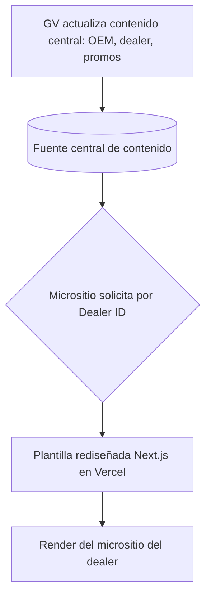
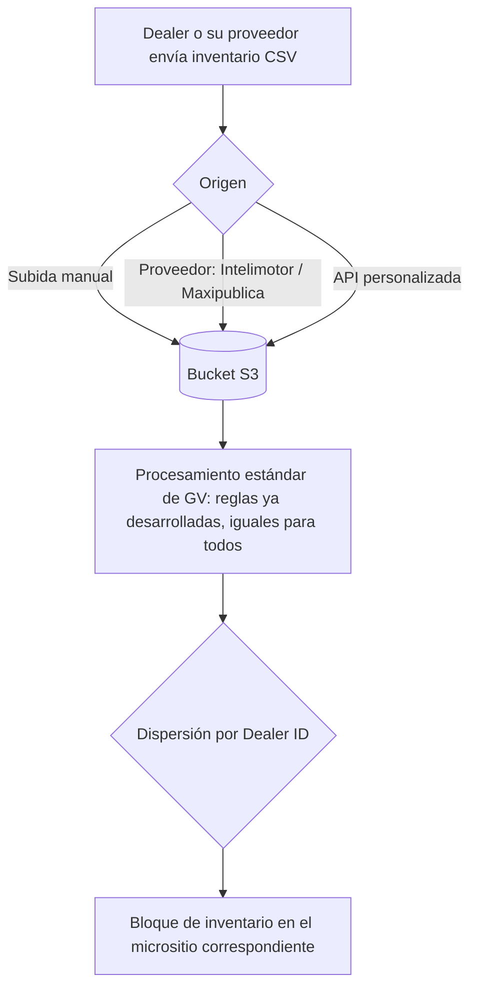
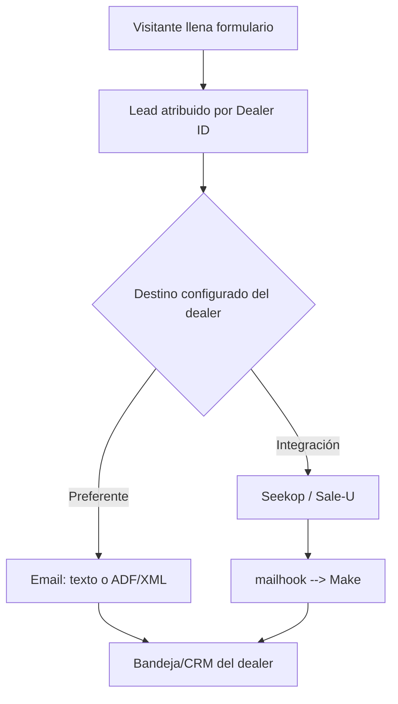

# PRD - GAC — Nuevo Sitio Dealers

| **Campo** | **Detalle** |
| --- | --- |
| **Proyecto** | GAC — Nuevo Sitio Dealers |
| **Área / empresa** | Go Virtual |
| **Versión** | v0.1 |
| **Fecha** | 2026-08-04 |
| **Solicita / patrocina** | Dioney Aguirre (Senior Media & Marketing Specialist, GAC México) |
| **Autores** | Abigail Estrada |
| **Revisión / liderazgo** | Aldo Álvarez |
| **Tipo de proyecto** | Feature web (rediseño de plantilla replicable existente) |

## 1. Resumen ejecutivo

GAC México es una marca relativamente nueva en el país. Su **sitio de marca acaba de rediseñarse** con enfoque en awareness y posicionamiento de modelos. Go Virtual (GV) **ya mantiene una plantilla estandarizada** para los sitios de la red de distribuidores y **una fuente central de contenido** (que GV actualiza a nivel **OEM**); sin embargo, tras el rediseño de marca, esa plantilla **ya no luce homologada** con la nueva imagen.

Este proyecto, solicitado por **Dioney Aguirre** y ejecutado por **GV (equipo de Sitios Web)**, busca **rediseñar la plantilla existente para homologarla con la nueva imagen de marca**, adaptando su propósito: mientras el sitio de marca posiciona a GAC, los micrositios de dealer deben **posicionar a la agencia y generar leads para vender sus unidades**. No es un problema de rendimiento, sino de **consistencia con la marca** y de reforzar la **conversión**.

El **MVP de este PRD (Fase 1)** entrega el **rediseño de la plantilla**: el **diseño final** de home y páginas internas modificadas, y el desarrollo de los **componentes de conversión** (inventario, promociones, CTAs de agendar servicio/visitar agencia, WhatsApp), **preservando** el modelo de parametrización por **Dealer ID** y el consumo de la fuente central existentes. La **Fase 2** replica y activa los **19 micrositios**, conectando las integraciones (inventario y destino de leads) por Dealer ID. El **CMS de autogestión del dealer** queda **fuera de este PRD** (documento propio).

Resultado esperado: una red de sitios de dealer **homologada con la marca**, **conversion-first**, operada de forma **centralizada** (una edición se propaga a todos) y con réplicas rápidas (~6 h por dealer).

**Fuente central de contenido (por Dealer ID)** → **Plantilla rediseñada (Next.js/Vercel)** → **Micrositio del dealer** → **Conversión (inventario · promos · agendar · WhatsApp/llamada)** → **Lead al dealer (email/ADF · integraciones)**

## 2. Contexto y problema

- **Hoy:** GV **ya opera** una plantilla estandarizada para los sitios de dealers y una **fuente central de contenido** que actualiza a nivel OEM. El sitio de marca se rediseñó recientemente sobre Next.js, y por contraste la plantilla de dealers **quedó desfasada** visualmente respecto a la nueva imagen.
- **Dolor concreto:** **falta de homologación** con la marca y una UX de dealer que puede **reforzarse hacia la conversión** (vender unidades de **su** agencia), aprovechando la operación centralizada que ya existe.
- **Por qué ahora:** el rediseño de marca dejó a los sitios de dealers "anticuados"; el driver es **homologar con la marca** (no resolver un problema de performance).
- **Distinción de conceptos clave para dev:**
  - **Sitio de marca** (branding/awareness, contenido OEM) vs. **micrositio de dealer** (conversión, posicionar la agencia).
  - **Contenido de marca (OEM)** —gestionado por GV, común a todos— vs. **contenido local** del dealer (promos y eventos locales).
  - **Dealer ID**: clave que parametriza cada micrositio y enruta contenido, inventario y leads.
  - Los **leads de estos micrositios son exclusivamente del dealer** (no se integra el CRM de marca).

## 3. Objetivo del producto

**Rediseñar la plantilla estandarizada existente** para **homologarla con el sitio de marca rediseñado**, reorientándola a **conversión** y a posicionar a la agencia: entregar el **diseño final** de los componentes y páginas modificados, y reforzar las acciones comerciales (inventario, promociones, agendar servicio, visitar la agencia, WhatsApp/llamada) para que **genere y atribuya leads al dealer**. Todo ello **preservando** el modelo ya existente de **parametrización por Dealer ID** y el consumo de la **fuente central**, de modo que la red siga operándose de forma centralizada y las réplicas sean rápidas y sin cambios de código.

### 3.1 Estrategia de implementación por fases

| **Fase** | **Nombre** | **Descripción** |
| --- | --- | --- |
| Fase 1 | Rediseño de la plantilla **(MVP de este PRD)** | Breve etapa de diseño y **diseño final** de home y páginas internas modificadas + desarrollo de los **componentes de conversión**, homologando con la marca y preservando la parametrización por Dealer ID y la fuente central existentes. |
| Fase 2 | Replicación y activación de la red | Réplica de los **19 micrositios** y conexión de integraciones (inventario S3→front y destino de leads) por Dealer ID, conforme cada sitio sale. Se estimará **tiempo por copia** (~6 h/dealer). |

**MVP de este PRD = Fase 1.** El **CMS** de autogestión del dealer queda **fuera de alcance** (documento propio); mientras no exista, **GV** administra el contenido en la fuente central.

## 4. Usuarios y actores

| **Usuario / Actor** | **Rol en el proceso** |
| --- | --- |
| Visitante / prospecto | Navega el micrositio del dealer y envía leads (cotización, prueba de manejo, contacto, agendar servicio); consulta inventario, promos y ubicación |
| Agencia / dealer | Recibe y gestiona los leads de **su** micrositio; aporta insumos (dominio, inventario, correos destino) y su **contenido local** (promos/eventos locales). *(Autogestión vía CMS cuando exista; entretanto, a través de GV.)* |
| Go Virtual — Sitios Web | Rediseña la plantilla; administra el **contenido central** (dealers, modelos, promos de marca/OEM); ejecuta réplicas y **deploys en Vercel**; procesa inventario y configura destinos de lead |
| GAC México (marca) | Define lineamientos de identidad y valida el diseño/homologación; provee contenido OEM |
| Fuente central de contenido (sistema, existente) | Fuente de verdad del contenido e info del dealer; parametriza cada micrositio por **Dealer ID** |
| Pipeline de inventario (S3 + reglas, existente) | Recibe (CSV), procesa y dispersa el inventario al front por Dealer ID |

## 5. Alcance MVP y funcionalidades

| **Funcionalidad** | **Descripción** |
| --- | --- |
| F1 — Rediseño de la plantilla existente | Homologación visual con la marca rediseñada, preservando el modelo de parametrización por Dealer ID |
| F2 — Diseño final de componentes/páginas modificados | Diseño (prototipo) de home y páginas internas que se modifican para cumplir el objetivo de conversión |
| F3 — Bloque de inventario (condicional) | Componente en home/listado si el dealer tiene inventario; **se construye en Fase 1**; la **conexión al dato real** (pipeline S3 por Dealer ID) se realiza en Fase 2 |
| F4 — Promociones | Promos de **marca (OEM, GV)** + espacio para **locales** del dealer |
| F5 — CTAs de conversión | Agendar servicio, visitar la agencia (mapa/geolocalización), cotizar, prueba de manejo, WhatsApp, llamar |
| F6 — Home reorientado a conversión | Menos branding que el sitio de marca, conservando identidad GAC |
| F7 — Formularios de lead atribuidos | Cotización, prueba de manejo, contacto y agendar servicio, atribuidos por **Dealer ID** |
| F8 — Enrutamiento de leads | Destino **parametrizable** por dealer (email/ADF; opcional Seekop/Sale-U/mailhook→Make); conexión real por dealer en Fase 2 |
| F9 — Blog (por definir técnicamente) | Revisar la implementación del blog en la fuente central, **o** diferirlo hasta el CMS, **o** hacer hardcode temporal para migrarlo luego al CMS |
| F10 — Conjunto de páginas | Home + **5 páginas internas** (a confirmar con la marca) + básicas (modelos, promociones, contacto, ubicación, cotización, prueba de manejo) |

**Principio rector del MVP:** la plantilla **sigue siendo única y parametrizada por Dealer ID** (**cero información hardcodeada**, se preserva el modelo existente). La variación **por dealer es solo de datos y contenido local** (no de diseño): el diseño es **estandarizado y homologado** con la marca para toda la red.

## 6. Fuera de alcance

- **CMS de autogestión del dealer** (Strapi u otro): irá en su **propio PRD**; en el MVP el contenido lo administra **GV** en la fuente central. *(Comprometido comercialmente; se reconcilia como entregable separado.)*
- **Panel/visualización de leads** para el dealer: forma parte del CMS, futuro.
- **Réplica y despliegue de los 19 sitios**: es **Fase 2**, no el MVP.
- **Apagado/migración de los sitios actuales** de dealers: no se apagan hasta validar el nuevo.
- **Rediseño del sitio de marca**: ya realizado, no aplica.
- **Multi-idioma / multi-región**: los micrositios estarán **solo en español MX**; multi-idioma no está en la cotización.
- **Alta de dominios** por dealer: los aporta el dealer en onboarding; no es desarrollo.

## 7. Flujos principales

**Flujo de parametrización de contenido (por Dealer ID) — existente, se preserva.**

Una sola fuente de verdad alimenta todos los micrositios: editar un precio o una promo OEM se refleja en todos los sitios que consuman ese dato, sin intervención sitio por sitio. El Dealer ID selecciona qué datos (del dealer y locales) se inyectan en la plantilla.

**Flujo de inventario (CSV → S3 → procesamiento estándar → front).**

El inventario de todos los dealers sigue el **mismo proceso estandarizado ya existente**: llega en **CSV** a un bucket S3 por distintos orígenes, se procesa con reglas de negocio **ya desarrolladas e idénticas para todos** (sin personalización por dealer) y se dispersa al front según Dealer ID. El componente de inventario se construye en Fase 1; la conexión al dato real se activa por dealer en Fase 2.

**Flujo de lead (captura → destino del dealer).**

La captura de leads es estándar para toda la red: el lead se atribuye por Dealer ID y se enruta al destino configurado del dealer. El formato preferente es **email (texto o ADF/XML)**; algunas agencias usan integraciones definidas (Seekop, Sale-U), a veces disparadas por un **mailhook → Make**. Estos leads son **exclusivamente del dealer**.

## 8. Requerimientos funcionales

| **ID** | **Requerimiento** | **Descripción** |
| --- | --- | --- |
| RF-01 | Rediseño de la plantilla homologada | Actualizar la plantilla existente para homologarla con la marca, preservando su parametrización por Dealer ID |
| RF-02 | Diseño final de componentes/páginas modificados | Entregar el diseño (prototipo) de home y páginas internas que se modifican para el objetivo de conversión |
| RF-03 | Bloque de inventario condicional | Renderizar inventario si el dealer tiene; construido en Fase 1, consumiendo del pipeline por Dealer ID (activación Fase 2) |
| RF-04 | Promociones marca + local | Mostrar promos OEM (GV) y locales del dealer, con vigencia |
| RF-05 | CTAs de conversión | Agendar servicio, visitar agencia (mapa), cotizar, prueba de manejo, WhatsApp, llamar |
| RF-06 | Home orientado a conversión | Priorizar acciones comerciales sobre branding, conservando identidad GAC |
| RF-07 | Formularios de lead atribuidos | Cotización, prueba de manejo, contacto y agendar servicio, atribuidos por Dealer ID |
| RF-08 | Enrutamiento de leads | Enviar el lead al destino del dealer (email texto/ADF; opcional Seekop/Sale-U/mailhook→Make), parametrizable por Dealer ID |
| RF-09 | Definición e implementación del blog | Revisar técnicamente la implementación del blog en la fuente central, **o** definir no integrarlo hasta el CMS, **o** hacer hardcode temporal para migrarlo luego al CMS |
| RF-10 | Preservar el modelo de parametrización | Mantener la plantilla única parametrizada por Dealer ID y el consumo de la fuente central existentes (no se rehacen) |
| RF-11 | Conjunto de páginas | Home + 5 páginas internas (a confirmar con marca) + básicas (modelos, promociones, contacto, ubicación, cotización, prueba de manejo) |
| RF-12 | Instrumentación de eventos (estándar ASC) | Emitir eventos conforme al estándar **ASC** (sobre GA4/GTM), atribuidos por Dealer ID |
| RF-13 | SEO técnico y geolocalización | Metadatos, sitemap/robots por micrositio y geolocalización de la agencia |

*(La variación por dealer se limita a **datos y contenido local**; no hay personalización de **diseño** por dealer.)*

## 9. Requerimientos no funcionales

| **ID** | **Requerimiento** | **Descripción** |
| --- | --- | --- |
| RNF-01 | Responsivo | Experiencia óptima en móvil, tablet y escritorio |
| RNF-02 | Stack y despliegue | Mismo stack que el sitio de marca (Next.js App Router); deploy en **Vercel** |
| RNF-03 | Mantenibilidad / cero hardcode | Preservar la parametrización total por Dealer ID; replicar y actualizar sin tocar código |
| RNF-04 | SEO y rendimiento web | SEO técnico y Core Web Vitals heredados del stack de marca |
| RNF-05 | Seguridad y privacidad | Protección de datos de leads, aviso de privacidad; secretos nunca con prefijo `NEXT_PUBLIC_` |
| RNF-06 | Trazabilidad por Dealer ID | Contenido, inventario, leads y eventos trazables por Dealer ID |
| RNF-07 | Observabilidad y estándar | GA4 + Looker Studio + tracking GTM existente, bajo estándar **Automotive Standards Council (ASC)** |
| RNF-08 | Manejo de errores en integraciones | Reintentos/alertas ante fallos silenciosos en inventario (S3) y leads |
| RNF-09 | Escalabilidad operativa | Soportar 19+ micrositios; réplica ~6 h/dealer sin degradar la operación |
| RNF-10 | Consistencia de datos | Contenido central cuasi-inmediato; inventario por cortes de procesamiento del bucket |
| RNF-11 | Homologación con la marca | Cumplir lineamientos e identidad del sitio de marca rediseñado |
| RNF-12 | Idioma / región | Español MX únicamente (multi-idioma fuera de alcance) |

## 10. Integraciones y datos

| **Integración / Fuente** | **Uso esperado** |
| --- | --- |
| Fuente central de contenido (existente) | Lectura de datos del dealer, modelos, promos y (posible) blog por Dealer ID; escritura/actualización OEM por GV |
| Bucket **S3** (inventario, existente) | Recepción de **CSV** (manual / Intelimotor / Maxipublica / API), **procesamiento estándar ya desarrollado** (igual para todos) y dispersión al front por Dealer ID |
| Destino de leads | **Email** (texto o **ADF/XML**) por dealer; opcional **Seekop**, **Sale-U**; a veces **mailhook → Make** |
| Google Analytics 4 / GTM | Instrumentación de eventos (estándar ASC) y web analytics por Dealer ID |
| Looker Studio | Reportes de desempeño por dealer |
| Google Maps | Geolocalización y mapa de la agencia |
| Vercel + dominio del dealer | Hosting operado por GV; **dominio aportado por el dealer** |

**Datos mínimos:**
- **Dealer:** `dealer_id`, nombre, dirección, geolocalización (lat/lng), teléfono, correo(s) destino de leads, WhatsApp, redes, dominio.
- **Contenido:** modelos (id, nombre, precio, imágenes, características, versiones), promociones (marca/local, vigencia), inventario (unidades desde CSV: modelo, versión, precio, stock/VIN, imágenes), blog (según definición de RF-09).
- **Lead:** `dealer_id`, tipo (cotización / prueba de manejo / contacto / servicio), datos del prospecto, modelo de interés, origen/UTM, fecha-hora, formato de envío (email texto/ADF).

**Esquema de permisos:** **GV** administra el contenido central (dealer, modelos, promos OEM). El **dealer** provee, vía onboarding, su **dominio**, su **inventario** (CSV a S3) y sus **correos destino**; su contenido local lo gestiona GV hasta que exista el CMS. El **front es solo lectura** del contenido central. No hay decisiones automáticas sensibles; el **autoservicio del dealer** queda **bloqueado hasta el CMS** (PRD aparte).

## 11. Eventos para BI

El registro de interacciones sigue el **estándar del Automotive Standards Council (ASC)** que GV ya maneja, instrumentado sobre **GA4/GTM** y atribuido por `dealer_id`. Eventos representativos (conforme a ASC):

- **Conversión:** envío de formulario de lead, solicitud de cotización, solicitud de prueba de manejo, solicitud de cita de servicio.
- **Interacción:** clic a WhatsApp, clic a teléfono, vista/clic de promoción, vista de inventario, vista de modelo, vista de ubicación del dealer, clic a "cómo llegar".

**Campos mínimos por evento:** fecha-hora, `dealer_id`, tipo de evento, modelo (si aplica), origen/UTM, resultado.

## 12. Métricas de éxito

*(El proyecto nace de **homologación con la marca**, no de un problema de performance; las métricas miden homologación, eficiencia operativa y calidad de la plantilla. El reporte se estandariza bajo **ASC** con GA4/Looker.)*

| **Métrica** | **Descripción** |
| --- | --- |
| % de dealers homologados | Cobertura de la red con la plantilla rediseñada alineada a la marca (avance de Fase 2) |
| Consistencia con la marca | Cumplimiento de lineamientos/identidad del sitio de marca (validación con la marca) |
| Tiempo de réplica por dealer | Horas para instanciar un micrositio (meta ~6 h) — eficiencia operativa |
| Esfuerzo de actualización de contenido | Una edición central se refleja en todos vs. actualizar sitio por sitio |
| Cobertura de parametrización | % de contenido servido desde la fuente central por Dealer ID (cero hardcode) |
| Cumplimiento de estándares técnicos | Responsive, SEO técnico y estándar ASC |

## 13. Riesgos y supuestos

### Riesgos

| **Riesgo** | **Impacto potencial** |
| --- | --- |
| Definición de las 5 páginas internas pendiente con la marca | Ajustes de alcance/tiempo del diseño y la plantilla |
| Reconciliación comercial (GRID/WordPress/CMS) vs. técnico (Next.js/Vercel/BD) | Desalineación de expectativas con el cliente |
| Envío de inventario por el proveedor del dealer | El proveedor puede tener que **desarrollar una solución** para mandar el **CSV** al bucket → retrasos en la activación |
| Calidad del dato de inventario recibido | Datos incompletos/erróneos en el CSV afectan lo mostrado (las reglas de procesamiento son fijas, iguales para todos) |
| Definición pendiente del blog | Reproceso si se decide integrar en BD o migrar a CMS más tarde |
| Dependencia de insumos del dealer (inventario, correos destino) | Retrasos en la activación de sitios (Fase 2) |

### Supuestos

| **Supuesto** | **Descripción** |
| --- | --- |
| Plantilla y fuente central existentes | Se rediseña la plantilla actual y se consume la fuente central OEM ya operada por GV |
| Stack y despliegue | Se construye sobre el stack de marca (Next.js) y se deploya en Vercel |
| Objetivo de red | 19 dealers objetivo; ~6 h de implementación por dealer |
| Flujos estandarizados existentes | Inventario (CSV→S3 + reglas ya desarrolladas, iguales para todos) y leads (email/ADF, Seekop/Sale-U, mailhook→Make) |
| CMS separado | El CMS vive en PRD aparte; mientras, GV gestiona el contenido |
| Naturaleza del proyecto | Nace de homologación con la marca, no de performance |
| Idioma | Español MX únicamente |

## 14. Preguntas abiertas

| **Tema** | **Pregunta abierta** |
| --- | --- |
| Páginas | ¿Cuáles son las **5 páginas internas** y su relación con las básicas? (revisar con la marca) |
| CMS | Alcance, herramienta (¿Strapi?), timing y su PRD propio |
| Reconciliación | Cómo se comunican al cliente los términos comerciales (GRID, hosting, WordPress) vs. la solución técnica real |
| Blog | ¿Integrar en la fuente central, diferir hasta el CMS, o hardcode temporal para migrar luego? |
| Inventario | ¿El dealer **tiene inventario** y con **qué proveedor**? |
| Leads | ¿Qué **proveedor** tiene cada dealer y qué **formato** requiere: email en texto o ADF? |
| Métricas | Líneas base y metas de homologación/eficiencia con BI/operación |
