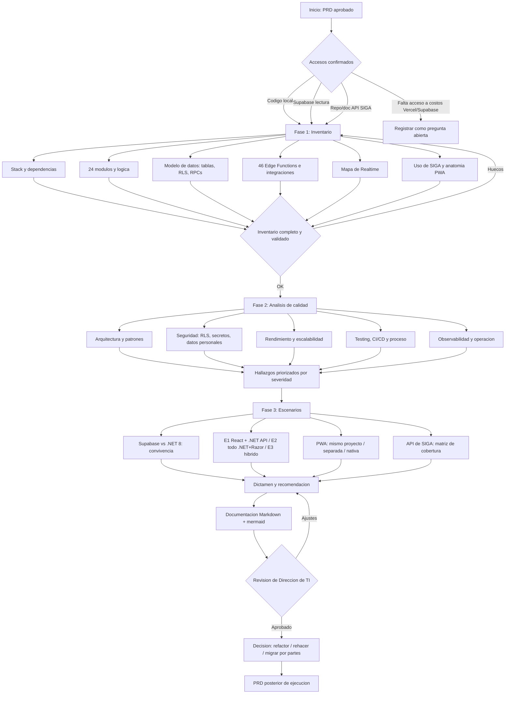
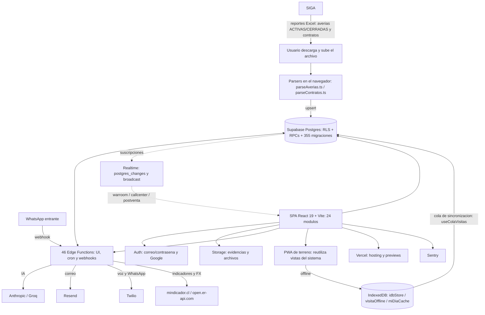
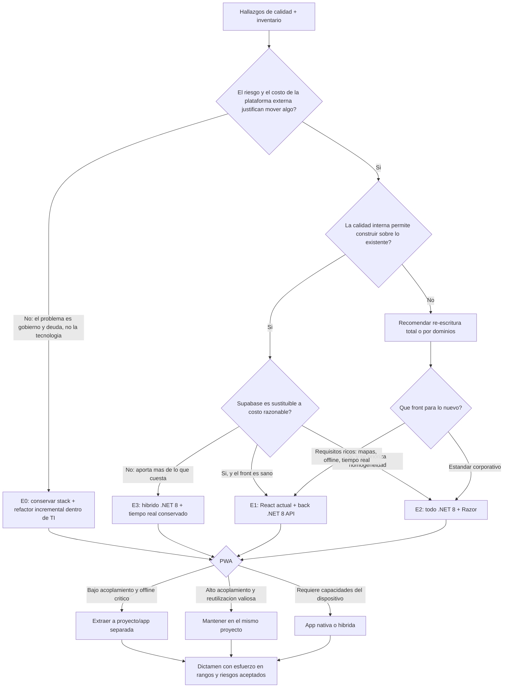

# PRD - Análisis técnico y documentación de GarantiMAX (Dashboard GarantiPLUS)

| **Campo** | **Detalle** |
| --- | --- |
| **Proyecto** | Análisis técnico y documentación de GarantiMAX (Dashboard GarantiPLUS) |
| **Área / empresa** | EngineCX |
| **Versión** | v0.1 |
| **Fecha** | 21-08-2026 |
| **Autores** | Javier Antonio Oropeza Camacho |
| **Revisión / liderazgo** | Aldo Álvarez — Director de TI (aprueba el dictamen) |
| **Tipo de proyecto** | Análisis técnico / discovery previo a migración (variante de Integración/migración) |

## 1. Resumen ejecutivo

**GarantiMAX** (repositorio `garantiplus-dashboard`) es la aplicación web de gestión comercial de garantías vehiculares del Hub Sur (Chile / Perú / Argentina). Hoy la usan Country Manager, gerentes de cuenta y asesores de terreno, con datos compartidos en tiempo real y permisos por rol. Está construida **fuera del estándar corporativo de Engine** (.NET 8 + Razor): es una SPA React 19 + Vite 8 + TypeScript, desplegada en Vercel, con **Supabase** como plataforma completa de backend (Postgres con RLS, Auth, Storage, Edge Functions y Realtime) y con una **PWA** que reutiliza vistas del propio sistema para el trabajo de terreno offline.

El problema no es que el sistema funcione mal: es que **TI no lo conoce, no lo gobierna y no puede dimensionarlo**. No existe documentación técnica que permita mantenerlo, auditarlo ni decidir su futuro, y hoy la operación depende de una plataforma externa (Supabase + Vercel) con datos de negocio, llaves y costos fuera del control del área. A la vez, la Dirección de TI necesita decidir si el sistema se **refactoriza**, se **rehace desde cero** o se **migra por partes** hacia el estándar .NET 8 — y esa decisión hoy se tomaría a ciegas.

Este proyecto **no construye ni migra nada**. Su producto es un **análisis técnico profundo y su documentación**: inventario completo del sistema (módulos, modelo de datos, RLS, RPCs, Edge Functions), qué consume realmente de SIGA y cómo, qué se guarda en Supabase, **dónde exactamente se usa Realtime**, cómo funciona la PWA offline, y una evaluación de calidad en cuatro dimensiones (seguridad, rendimiento, testing/CI-CD, observabilidad). Sobre esa base se comparan **cuatro escenarios de destino** —incluida la opción explícita de no migrar— y tres opciones para la PWA, cada uno con **pros, contras, riesgos y esfuerzo en rangos gruesos**, cerrando con una **recomendación técnica argumentada**.

El MVP de este PRD cubre las tres fases del análisis y entrega la documentación en Markdown versionado con diagramas mermaid, con fecha objetivo **04-09-2026**. Queda fuera la ejecución de la decisión: el plan de refactor o re-escritura será un PRD posterior alimentado por este documento.

Resultado esperado: que la Dirección de TI pueda decidir el futuro de GarantiMAX con evidencia en la mano, que TI pueda mantener el sistema sin depender de su autor original, y que quede cuantificado el costo real de conservar o abandonar Supabase.

**Inventario del sistema** → **Análisis de calidad y riesgos** → **Comparación de escenarios (pros/contras)** → **Documentación técnica + recomendación** → **Decisión de TI**

## 2. Contexto y problema

**Cómo funciona hoy.** GarantiMAX es una SPA React 19 / Vite 8 / TypeScript con Tailwind v4, desplegada en **Vercel** (dominio `www.garantimax.com`, con preview por PR). Todo el backend es **Supabase**: Postgres con RLS activo, **355 migraciones** versionadas, RPCs SQL, Auth (correo/contraseña y Google), Storage y **46 Edge Functions**. El código está organizado en **24 módulos** bajo `src/features/` (facturación, averías/postventa, visitas, warroom, callcenter, hunter, mora, cobertura, portal, entre otros), con **~109 mil líneas** en 455 archivos y **60 archivos de test** (Vitest). Varias Edge Functions consumen servicios externos: `api.anthropic.com` y `api.groq.com` (IA), `api.resend.com` (correo), `api.twilio.com` (voz/WhatsApp), `mindicador.cl` y `open.er-api.com` (indicadores y tipo de cambio).

**Los datos de SIGA entran por Excel, no por API.** La revisión del repositorio no encontró ninguna llamada HTTP a un host de SIGA, ni en `src/` ni en las 46 Edge Functions. Lo que existe son **importadores manuales de reportes**: `src/features/averias/ImportarAverias.tsx` con `parseAverias.ts` (reportes de averías ACTIVAS y CERRADAS) y `src/features/facturacion/ImportarContratos.tsx` con `parseContratos.ts` (contratos), que leen la planilla por nombre de columna, con el encabezado en la fila 3, y hacen upsert en Supabase. Es decir: **la integración con SIGA es humana y periódica**, y esa es una de las conclusiones que el análisis debe documentar y dimensionar.

**El dolor concreto.**

- **Cero documentación técnica.** El conocimiento vive en el `CLAUDE.md` del repositorio, en la memoria de las sesiones de su autor y en el propio código. No hay nada que permita a TI mantener, auditar o estimar el sistema.
- **Fuera del estándar corporativo.** Los sistemas de Engine son .NET 8 + Razor; hoy nadie del equipo mantiene React/Vite/Supabase. Riesgo de dependencia de una sola persona.
- **Plataforma externa no gobernada.** Datos de negocio, autenticación, archivos y lógica serverless viven en Supabase y Vercel, con llaves y costos fuera del control de TI.
- **Decisión bloqueada.** No se puede elegir entre refactorizar y rehacer sin conocer el tamaño real, la calidad interna y qué piezas son sustituibles.

**Por qué resolverlo ahora.** TI necesita absorber el sistema (gobierno, soporte y continuidad) y, al mismo tiempo, acotar el riesgo y el costo de la plataforma externa. Cualquier decisión de inversión —refactor, re-escritura o migración parcial— depende de este análisis, así que es el primer paso obligado.

**Distinciones de dominio que el equipo debe tener claras desde el día 1:**

- **Integración por archivo vs. integración por API.** Hoy SIGA se consume por **importación manual de Excel**. "Migrar a la API de SIGA" es un proyecto nuevo, no una refactorización.
- **Supabase como plataforma vs. Supabase como base de datos.** Supabase aporta cinco cosas distintas (Postgres+RLS, Auth, Storage, Edge Functions, Realtime). Reemplazarlo por ".NET 8" significa construir o sustituir **cada una** de ellas; el análisis las evalúa por separado.
- **Realtime vs. refresco por consulta.** No todo lo que se ve "al instante" usa Realtime. El análisis distingue las suscripciones reales (`.channel()`, `postgres_changes`, `broadcast`) de los refrescos por consulta o caché, para no sobredimensionar la dependencia.
- **PWA vs. app nativa.** La PWA actual **reutiliza las vistas** del sistema y trabaja offline con IndexedDB; no es un proyecto aparte. Sacarla implica decidir qué pasa con esa reutilización.
- **Refactor vs. re-escritura.** Refactor = se conserva el código y se corrige; re-escritura = se conserva el comportamiento y se reconstruye. El documento debe permitir elegir, no suponerlo.

## 3. Objetivo del producto

Producir la **documentación técnica completa y verificable de GarantiMAX** —tecnologías, estructura, lógica de negocio, modelo de datos, integraciones, uso de Realtime y funcionamiento de la PWA— junto con una **evaluación de su calidad** (arquitectura, patrones de diseño y buenas prácticas) y una **comparación argumentada de escenarios de destino** con pros, contras, riesgos y esfuerzo en rangos gruesos.

El objetivo medible es que, al 04-09-2026, la Dirección de TI cuente con un documento suficiente para (a) decidir entre refactorizar, rehacer o migrar por partes, (b) determinar si Supabase se conserva, se sustituye o convive con .NET 8, (c) definir el destino de la PWA, y (d) permitir que un desarrollador de Engine ajeno al proyecto entienda y opere el sistema sin recurrir a su autor original.

### 3.1 Estrategia de implementación por fases

| **Fase** | **Nombre** | **Descripción** |
| --- | --- | --- |
| Fase 1 | Inventario y mapeo (21-08-2026 → 26-08-2026) | Levantamiento factual del sistema: stack y dependencias, mapa de los 24 módulos y su lógica de negocio, inventario completo del modelo de datos (tablas, RLS, RPCs, 355 migraciones), catálogo de las 46 Edge Functions con su consumidor, integraciones externas, mapa exacto de uso de Realtime, datos que entran desde SIGA y anatomía de la PWA offline. Sin juicios de valor. |
| Fase 2 | Análisis de calidad y riesgos (27-08-2026 → 01-09-2026) | Evaluación de arquitectura, patrones de diseño y buenas prácticas, y auditoría en las cuatro dimensiones obligatorias: seguridad (RLS, secretos, datos personales), rendimiento y escalabilidad, testing/CI-CD y proceso, observabilidad y operación. Salida: hallazgos priorizados por severidad, con evidencia (archivo y línea). |
| Fase 3 | Escenarios, pros/contras y dictamen (02-09-2026 → 04-09-2026) | Capítulo Supabase vs. .NET 8 (qué puede convivir y qué conviene), comparación de los cuatro escenarios de destino y de las tres opciones de PWA, auditoría de la API de SIGA frente a los datos que hoy entran por Excel, esfuerzo en rangos gruesos y recomendación técnica argumentada. |

**Las tres fases constituyen el MVP de este PRD.** La ejecución de la decisión (refactor, re-escritura o migración) queda para un PRD posterior.

## 4. Usuarios y actores

| **Usuario / Actor** | **Rol en el proceso** |
| --- | --- |
| Javier Oropeza (Desarrollo / Engine) | Ejecuta el análisis, levanta la evidencia y redacta la documentación y el dictamen. |
| Aldo Álvarez (Director de TI) | Revisa el documento, aprueba el dictamen y toma la decisión de refactor / re-escritura / migración. |
| Fabrizio Álvarez (Country Manager, Hub Sur) | Dueño y usuario principal del sistema actual. Fuente de contexto funcional y de la criticidad real de cada módulo; valida que la documentación no omita procesos vivos. |
| Equipo de desarrollo .NET de Engine | Consumidor final del documento: lo usará para mantener el sistema y para estimar o ejecutar la migración. |
| Autor / mantenedor actual de GarantiMAX | Fuente de verificación de decisiones históricas y de lógica no evidente en el código. |
| Equipo responsable de la API de SIGA | Contraparte para auditar si la API ya cubre los datos que hoy entran por Excel o si habría que construir endpoints. |
| Usuarios operativos del Hub Sur (gerentes de cuenta, asesores de terreno) | No participan del análisis, pero su operación define qué es crítico y qué pérdida de funcionalidad sería inaceptable en un cambio futuro. |
| Operación / BI | Consumidores de los reportes y cierres que el sistema produce; determinan qué salidas de datos no pueden perderse. |

## 5. Alcance MVP y funcionalidades

Las "funcionalidades" de este proyecto son los **capítulos verificables de la documentación**. Cada uno debe quedar entregado con evidencia trazable al código, la base o la configuración.

| **Funcionalidad** | **Descripción** |
| --- | --- |
| C1. Ficha tecnológica y de dependencias | Inventario del stack real y sus versiones (React 19, Vite 8, TypeScript, Tailwind v4, Supabase JS, Recharts, Leaflet, jsPDF, pptxgenjs, xlsx, framer-motion, Twilio Voice SDK, Sentry, vite-plugin-pwa, Vitest). Por cada dependencia relevante: para qué se usa, dónde, si tiene equivalente en el ecosistema .NET y si es conservable, sustituible o riesgosa. |
| C2. Mapa de módulos y lógica de negocio | Para cada uno de los 24 módulos de `src/features/`: propósito, pantallas, reglas de negocio implementadas, tablas y RPCs que toca, dependencias con otros módulos y criticidad operativa. Identifica dónde vive la lógica de negocio (front, RPC de Postgres o Edge Function). |
| C3. Modelo de datos completo | Inventario de todas las tablas con su propósito, relaciones y volumen actual; políticas **RLS** por tabla; RPCs con firma, propósito y quién las llama; diagrama ER por dominio. Incluye lectura del historial de las 355 migraciones para detectar tablas muertas, campos en desuso y duplicidades. |
| C4. Catálogo de Edge Functions | Las 46 funciones documentadas: qué hacen, quién las invoca (UI, cron, webhook), qué servicios externos consumen, qué secretos requieren, si mutan datos y qué las hace o no portables a .NET 8. Identifica las que son cron y las que son webhooks públicos. |
| C5. Integraciones externas | Inventario de todas las integraciones: Anthropic y Groq (IA), Resend (correo), Twilio (voz/WhatsApp), mindicador.cl y open.er-api.com (indicadores y FX), Google (auth y calendario), Sentry, Vercel. Para cada una: uso, criticidad, dónde vive la llave y qué implicaría moverla a .NET. |
| C6. Uso de SIGA: qué entra, cómo y con qué frecuencia | Documentación del flujo real de importación: reportes de averías (ACTIVAS/CERRADAS) y de contratos, campos consumidos, transformaciones, validaciones, destino en Supabase, frecuencia y quién lo ejecuta. Deja explícito que hoy **no** hay consumo por API. |
| C7. Auditoría de la API de SIGA frente a lo que se necesita | Revisión de la API de SIGA existente para determinar si ya expone los datos que hoy entran por Excel. Salida: matriz campo por campo (dato requerido → endpoint que lo cubre / no existe) y lista de endpoints que habría que construir. |
| C8. Mapa de Realtime | Ubicación exacta de cada suscripción en tiempo real y qué la justifica. Punto de partida verificado: 11 usos de `.channel()` en tres áreas — `features/warroom` (`visitasRealtime.ts`, `useWarRoomEventos.ts`, `useVisitasEnCurso.ts`, `WarRoomView.tsx`), `features/callcenter` (`telefonoStore.ts`, `TelefonoPanel.tsx`, `TelefonoKpis.tsx`) y `features/postventa` (`casosDb.ts`, `ChatWhatsapp.tsx`). Por cada una: tabla o evento escuchado, consumidor, latencia requerida y si es realmente necesaria o sustituible por refresco. |
| C9. Anatomía de la PWA y del offline | Cómo se construye la PWA (`vite-plugin-pwa`, `registerType: autoUpdate`, manifest, service worker, assets), qué vistas del sistema reutiliza, qué funciona offline y cómo (IndexedDB vía `src/lib/idbStore.ts`, `visitaOffline.ts`, `miDiaCache.ts`, `bitacoraTerreno.ts`) y cómo sincroniza (`useColaVisitas.ts`, `visitaBorradorServidor.ts`). Incluye el grado de acoplamiento con el sistema web y qué costaría desacoplarla. |
| C10. Evaluación de arquitectura, patrones y buenas prácticas | Dictamen sobre la organización por features, separación de capas, patrones efectivamente usados (hooks, stores, repositorios de datos, dominio en `postventa/dominio`, parsers puros), consistencia, duplicación, acoplamientos, tamaño de archivos y componentes, tipado y manejo de estado. Con ejemplos concretos de lo que está bien hecho y de lo que no. |
| C11. Auditoría de seguridad | Políticas RLS por tabla y huecos detectados, uso de `anon key` vs `service_role`, secretos en Edge Functions, endpoints públicos (portal cliente, webhooks de WhatsApp), exposición y tratamiento de datos personales, y esquema de roles/permisos frente a lo que exige el estándar de Engine. |
| C12. Auditoría de rendimiento y escalabilidad | Tamaño de bundle y estrategia de chunks (incluida la regla de `manualChunks` para Recharts, que rompe solo en producción si se altera), consultas pesadas, el tope de 1000 filas de PostgREST, costo y volumen de Realtime, y comportamiento ante el crecimiento de datos y usuarios. |
| C13. Auditoría de testing, CI/CD y proceso | Qué cubren realmente los 60 archivos de test y qué queda sin cobertura, ausencia o presencia de pipeline propio, dependencia de Vercel para preview y deploy, flujo de ramas y gobierno de migraciones (incluidos los duplicados históricos de numeración y la red de contención `migracionesUnicas.test.ts`). |
| C14. Auditoría de observabilidad y operación | Sentry y qué se captura, logs de Edge Functions, alertas, tareas cron y su monitoreo, manejo de fallos silenciosos y procedimiento actual ante incidentes. |
| C15. Supabase vs. .NET 8: qué puede convivir y qué conviene | Capítulo central. Descompone Supabase en sus cinco servicios (Postgres+RLS, Auth, Storage, Edge Functions, Realtime) y para cada uno contrasta: qué aporta hoy, qué habría que construir u operar en .NET 8 (incluido SignalR frente a Supabase Realtime e Identity frente a Supabase Auth), qué se puede conservar en convivencia y qué implica en costo, riesgo y esfuerzo. |
| C16. Comparación de escenarios de destino | Cuatro escenarios evaluados con el mismo criterio (esfuerzo en rangos gruesos, riesgo, encaje con el estándar de TI, impacto operativo, costo de plataforma, mantenibilidad): **E0** conservar el stack actual con refactor incremental y gobierno dentro de TI —la opción de no migrar, evaluada en serio para que cualquier migración tenga que justificarse contra ella—; **E1** conservar el front React actual con back .NET 8 API; **E2** rehacer todo en .NET 8 + Razor; **E3** híbrido .NET 8 conservando el tiempo real. |
| C17. Opciones para la PWA | Evaluación con pros y contras de las tres opciones: dejarla dentro del mismo proyecto reutilizando vistas, extraerla a proyecto o app separada consumiendo la misma API, o llevarla a app nativa/híbrida. Cada una contrastada contra lo que hoy resuelve el offline de terreno. |
| C18. Dictamen y recomendación | Cierre: recomendación técnica argumentada (refactorizar, rehacer o migrar por partes), qué tecnología conviene conservar y cuál abandonar, en qué orden, qué debe decidirse antes de arrancar y qué riesgos deben aceptarse explícitamente. |
| C19. Resumen ejecutivo del análisis | Documento corto derivado de todo lo anterior, orientado a la decisión de Dirección: hallazgos críticos, escenarios y recomendación, sin detalle técnico. |

**Principio rector del MVP: nada se afirma sin evidencia.** Cada hallazgo, cifra o conclusión debe poder rastrearse a un archivo y línea, una consulta a la base o una configuración verificable; lo que no se pueda comprobar se declara explícitamente como supuesto o pregunta abierta. El análisis **no toca el sistema**: no modifica código, no escribe en la base y no altera configuración. Y **no toma la decisión** por la Dirección: entrega escenarios comparables con una recomendación, no un hecho consumado.

## 6. Fuera de alcance

- **Escribir código, refactorizar o migrar cualquier parte del sistema**: este proyecto entrega documentación y dictamen; la ejecución depende de la decisión que el documento habilita.
- **El plan de ejecución y el cronograma de la migración o el refactor**: será un PRD posterior, alimentado por este análisis. Aquí solo se estima esfuerzo en rangos gruesos para comparar escenarios.
- **Construir endpoints en la API de SIGA**: se audita si la API cubre los datos y se lista lo que faltaría, pero no se desarrolla nada.
- **Automatizar la importación de datos de SIGA**: aunque el análisis exponga que hoy es manual, resolverlo es un proyecto aparte.
- **Diseño técnico detallado de la arquitectura destino** (esquemas de base, contratos de API, diagramas de despliegue del sistema nuevo): requiere que la decisión de escenario esté tomada.
- **Estimación detallada módulo por módulo y presupuesto formal**: se decidió trabajar con rangos gruesos; el desglose fino se hará cuando exista un escenario elegido.
- **Cuantificación del costo mensual real de Supabase y Vercel**: hoy no hay acceso a esos paneles. Se analiza el **modelo** de costo y sus factores de riesgo; la cifra queda condicionada a obtener acceso (ver sección 14).
- **Auditoría de calidad funcional o de negocio del sistema** (si los KPIs, cierres o comisiones están bien calculados): el análisis es técnico; los errores de negocio que se detecten al paso se reportan como hallazgos, sin verificación exhaustiva.
- **Pruebas de carga o estrés sobre el ambiente productivo**: el análisis es estático y de lectura; medir carga real requeriría autorización y ventana propias.
- **Evaluación de otras aplicaciones del ecosistema Engine** (SIGA, Omega y demás): solo se documentan en aquello que GarantiMAX las toca.
- **Migración de datos históricos**: no se diseña ni se prueba; solo se documenta el volumen y la forma de los datos como insumo para una decisión futura.

## 7. Flujos principales

### 7.1 Flujo del análisis (proceso del proyecto)

El flujo es deliberadamente **secuencial con puertas de control**: no se juzga la calidad de algo que no está inventariado, y no se comparan escenarios sin hallazgos con evidencia. Las dos puertas (`inventario completo` y `revisión de Dirección`) existen porque el riesgo mayor de un análisis de este tamaño es concluir sobre una parte del sistema y descubrir después que faltaba un módulo crítico.

La rama de "falta acceso a costos" está en el diagrama a propósito: el análisis avanza igual, pero el hueco se declara en lugar de rellenarse con una estimación inventada. Ese es el patrón de todo el proyecto — lo que no se puede verificar no se afirma, se registra en la sección 14.

### 7.2 Flujo de datos actual del sistema (lo que hay que documentar)

Este diagrama es la hipótesis de partida que la Fase 1 debe **confirmar o corregir**, y explica por qué la pregunta "¿reemplazamos Supabase por .NET?" no tiene una respuesta única: Supabase aparece cinco veces con cinco responsabilidades distintas, y cada flecha que entra o sale de él es una pieza de migración con su propio costo.

También deja ver el punto más frágil del sistema hoy: **la entrada de datos de SIGA depende de que una persona descargue y suba un archivo**, y todo lo que sigue —cierres, siniestralidad, proyecciones— cuelga de eso.

### 7.3 Árbol de decisión del dictamen

El árbol se publica **antes** de tener los resultados, a propósito: fija los criterios con los que se va a decidir para que la recomendación final no parezca elegida por preferencia técnica.

Las preguntas están ordenadas de la más determinante a la menos. La primera es la que suele darse por contestada de antemano: **si el problema real es de gobierno y deuda técnica y no de tecnología, la respuesta correcta puede ser no migrar** (E0), y ese camino tiene que estar en el árbol para que las otras tres opciones tengan que justificarse contra él. Después, si la calidad interna no soporta construir encima, el resto del análisis solo cambia el *cómo* de la re-escritura, no el *si*. La decisión de la PWA se toma al final porque depende de qué API va a existir.

## 8. Requerimientos funcionales

| **ID** | **Requerimiento** | **Descripción** |
| --- | --- | --- |
| RF-01 | Ficha tecnológica con veredicto por dependencia | Documentar el stack y cada dependencia relevante con versión, uso, ubicación en el código, equivalente en .NET (si existe) y veredicto: conservable, sustituible o riesgosa. |
| RF-02 | Mapa de los 24 módulos | Una ficha por módulo de `src/features/`: propósito, pantallas, reglas de negocio, tablas y RPCs que toca, dependencias con otros módulos y criticidad operativa. |
| RF-03 | Ubicación de la lógica de negocio | Determinar y documentar, por módulo, si la lógica vive en el front, en RPCs de Postgres o en Edge Functions — es el dato que define el costo real de migrar el backend. |
| RF-04 | Inventario completo del modelo de datos | Todas las tablas con propósito, relaciones, volumen actual y política RLS asociada; todas las RPCs con firma, propósito y llamadores; diagramas ER por dominio. |
| RF-05 | Detección de datos muertos | A partir del historial de las 355 migraciones y de la base, identificar tablas, columnas y RPCs sin uso, y duplicidades — insumo directo para no arrastrar basura a un sistema nuevo. |
| RF-06 | Catálogo de las 46 Edge Functions | Por función: propósito, tipo de disparo (UI, cron, webhook), servicios externos que consume, secretos que requiere, si muta datos y portabilidad a .NET 8. |
| RF-07 | Inventario de integraciones externas | Todas las integraciones (Anthropic, Groq, Resend, Twilio, mindicador.cl, open.er-api.com, Google, Sentry, Vercel) con uso, criticidad, ubicación de la llave e implicación de moverla. |
| RF-08 | Documentación del consumo real de SIGA | Reportes que se importan, campos consumidos, transformaciones y validaciones, destino en la base, frecuencia y responsable. Debe dejar constancia explícita de que hoy no hay consumo por API. |
| RF-09 | Matriz de cobertura de la API de SIGA | Tabla dato requerido → endpoint que lo cubre / no cubierto, derivada de la auditoría de la API de SIGA, con la lista de endpoints que habría que construir. |
| RF-10 | Mapa exacto de uso de Realtime | Cada suscripción localizada (archivo y línea), con tabla o evento escuchado, consumidor, latencia requerida y veredicto sobre si es necesaria o sustituible por refresco por consulta. |
| RF-11 | Documentación de la PWA y su offline | Configuración de la PWA, vistas reutilizadas, alcance del offline, almacenamiento local (IndexedDB) y mecanismo de sincronización, con el grado de acoplamiento al sistema web. |
| RF-12 | Evaluación de arquitectura y patrones | Dictamen sobre organización, capas, patrones de diseño usados, consistencia, duplicación, acoplamiento y tipado, con ejemplos concretos de aciertos y de problemas. |
| RF-13 | Hallazgos de seguridad priorizados | Lista de hallazgos con severidad y evidencia: RLS faltante o permisiva, manejo de llaves, secretos, endpoints públicos y tratamiento de datos personales. |
| RF-14 | Hallazgos de rendimiento y escalabilidad | Bundle y chunks, consultas pesadas, límite de 1000 filas de PostgREST, carga de Realtime y comportamiento ante crecimiento, con severidad y evidencia. |
| RF-15 | Diagnóstico de testing, CI/CD y proceso | Cobertura real frente a lo crítico, estado del pipeline, dependencia de Vercel, flujo de ramas y gobierno de migraciones (incluidos los duplicados históricos). |
| RF-16 | Diagnóstico de observabilidad y operación | Qué se monitorea y qué no, alertas, crons, fallos silenciosos y procedimiento actual ante incidentes. |
| RF-17 | Comparativa Supabase vs. .NET 8 por servicio | Tabla por servicio (Postgres+RLS, Auth, Storage, Edge Functions, Realtime): qué aporta hoy, sustituto en .NET 8, esfuerzo, riesgo y veredicto de convivencia. Debe incluir SignalR frente a Supabase Realtime e Identity frente a Supabase Auth. |
| RF-18 | Comparación de los cuatro escenarios | E0 (no migrar: refactor incremental), E1 (React + .NET 8 API), E2 (todo .NET 8 + Razor) y E3 (híbrido con tiempo real) evaluados con criterios idénticos: esfuerzo en rangos gruesos, riesgo, encaje con el estándar, impacto operativo, costo de plataforma y mantenibilidad. E0 funciona además como línea base contra la que se mide el beneficio neto de las otras tres. |
| RF-19 | Evaluación de las tres opciones de PWA | Mismo proyecto / proyecto separado / app nativa-híbrida, cada una con pros, contras, esfuerzo y riesgo, contrastada con lo que hoy resuelve el offline de terreno. |
| RF-20 | Estimación de esfuerzo en rangos gruesos | Rango de esfuerzo por escenario y por módulo crítico, con el criterio de estimación declarado y sus supuestos. |
| RF-21 | Dictamen con recomendación argumentada | Recomendación explícita (refactor, re-escritura o migración por partes), qué conservar y qué abandonar, en qué orden, con los riesgos que se aceptan. |
| RF-22 | Resumen ejecutivo | Documento corto para Dirección con hallazgos críticos, escenarios y recomendación, sin detalle técnico. |
| RF-23 | Trazabilidad de la evidencia | Todo hallazgo, cifra o afirmación debe citar su fuente (archivo y línea, consulta, configuración o interlocutor). Lo no verificable se marca como supuesto. |
| RF-24 | Entrega en Markdown versionado | La documentación se entrega como conjunto de archivos `.md` versionados, con diagramas en mermaid, índice navegable y fecha/versión por documento. |

## 9. Requerimientos no funcionales

| **ID** | **Requerimiento** | **Descripción** |
| --- | --- | --- |
| RNF-01 | Análisis no intrusivo | El análisis es de solo lectura: no modifica código, no escribe en la base ni altera configuración del sistema productivo. Cualquier necesidad de escritura debe autorizarse por TI y quedar registrada. |
| RNF-02 | Verificabilidad | Cualquier lector con los mismos accesos debe poder reproducir cada hallazgo siguiendo la referencia citada. Sin afirmaciones de autoridad sin fuente. |
| RNF-03 | Manejo de credenciales | Ninguna llave, token, cadena de conexión ni secreto se transcribe en la documentación; se referencian por nombre y ubicación. Los accesos de solo lectura se usan solo para el análisis. |
| RNF-04 | Tratamiento de datos personales | Los ejemplos y capturas se anonimizan. No se extraen ni se copian fuera de la base datos personales de clientes, asesores o talleres. |
| RNF-05 | Documentación mantenible | Markdown versionado con diagramas mermaid, un archivo por capítulo, índice y control de versión — de modo que la documentación pueda actualizarse cuando el sistema cambie, en lugar de quedar congelada. |
| RNF-06 | Trazabilidad de decisiones | Cada juicio de valor y cada supuesto quedan registrados con su razón, para que la recomendación pueda auditarse o rebatirse después. |
| RNF-07 | Separación entre hecho y opinión | El documento distingue estructuralmente lo observado (inventario) de lo evaluado (dictamen), para que un desacuerdo de criterio no invalide el levantamiento. |
| RNF-08 | Legibilidad para dos audiencias | El detalle técnico sirve al equipo de desarrollo; el resumen ejecutivo debe ser comprensible para Dirección sin conocimiento del stack. |
| RNF-09 | Priorización por severidad | Los hallazgos se clasifican (crítico / alto / medio / bajo) con criterio declarado, para que la decisión no se pierda en una lista plana de observaciones. |
| RNF-10 | Neutralidad tecnológica | La evaluación aplica los mismos criterios a la tecnología actual y a la del estándar corporativo: el análisis no parte de que .NET 8 es la respuesta, ni de que hay que conservar React. |
| RNF-11 | Cobertura declarada | El documento indica explícitamente qué se revisó y qué no (módulos, tablas o funciones no alcanzados), para que nadie asuma exhaustividad donde no la hubo. |
| RNF-12 | Confidencialidad del entregable | La documentación expone arquitectura, integraciones y debilidades de seguridad: se publica en el repositorio interno de PRDs y su difusión se limita a TI y Dirección. |
| RNF-13 | Independencia del autor original | La documentación debe permitir operar y entender el sistema sin recurrir al mantenedor actual — es el criterio con el que se mide si el levantamiento sirvió. |
| RNF-14 | Vigencia del análisis | El documento deja constancia del commit y la fecha del código analizado, ya que el sistema sigue en desarrollo activo mientras corre el análisis. |

## 10. Integraciones y datos

Este proyecto no construye integraciones: las **inventaría y evalúa**. La tabla lista los sistemas a documentar y qué se necesita de cada uno durante el análisis.

| **Integración / Fuente** | **Uso esperado** |
| --- | --- |
| Repositorio `garantimax` (local, `C:\Users\JavierAntonioOropeza\Documents\Proyectos\garantimax`) | Fuente primaria: código de los 24 módulos, 355 migraciones, 46 Edge Functions, configuración de build y PWA, y la carpeta `docs/` existente (incluidas las auditorías previas de 2026-06-21 y 2026-07-11). Solo lectura. |
| Supabase (proyecto de GarantiMAX) | Acceso de **solo lectura** para inventariar tablas reales, políticas RLS, RPCs, volúmenes y datos muertos. Sin este acceso, el modelo de datos solo podría inferirse de las migraciones. |
| API de SIGA (repositorio y/o documentación) | Auditar qué endpoints existen y si cubren los datos de contratos y averías que hoy entran por Excel. Consulta documental y de código, sin escritura. |
| Reportes Excel de SIGA (averías ACTIVAS/CERRADAS, contratos) | Muestras de los archivos que hoy se importan, para documentar columnas, formatos y validaciones reales. |
| Edge Functions y sus servicios externos (Anthropic, Groq, Resend, Twilio, mindicador.cl, open.er-api.com, Google) | Documentar uso, criticidad, ubicación de secretos y portabilidad. No se ejecutan llamadas de prueba contra servicios de pago. |
| Vercel | Documentar el modelo de despliegue (SPA con rewrites, previews por PR) y la dependencia operativa. El acceso al panel de costos y métricas está pendiente. |
| Sentry | Documentar qué se está capturando y con qué cobertura. |
| Estándar corporativo Engine (.NET 8 + Razor) | Referencia de comparación: capacidades disponibles del lado .NET (Identity, SignalR, EF Core, hosting propio) para evaluar sustitución y convivencia. |
| Interlocutores (Fabrizio Álvarez, mantenedor actual, equipo de la API de SIGA) | Verificación de lógica no evidente en el código, criticidad operativa real y cobertura de la API. |

**Datos mínimos que el análisis debe recolectar y registrar:**

- **Por módulo:** nombre, propósito, pantallas, reglas de negocio, tablas y RPCs que toca, dependencias, criticidad operativa, ubicación de la lógica (front / RPC / Edge Function).
- **Por tabla:** nombre, dominio, propósito, claves y relaciones, volumen de filas, políticas RLS, módulos que la leen y escriben, señal de uso o desuso.
- **Por RPC:** nombre, firma, propósito, si muta datos, `security definer` sí/no, llamadores.
- **Por Edge Function:** nombre, disparo (UI / cron / webhook), propósito, servicios externos, secretos requeridos, si muta datos, portabilidad a .NET.
- **Por suscripción Realtime:** archivo y línea, canal, tabla o evento, tipo (`postgres_changes` / `broadcast`), consumidor, latencia requerida, sustituibilidad.
- **Por integración externa:** proveedor, propósito, criticidad, ubicación de la llave, modelo de costo.
- **Por dato de SIGA:** reporte de origen, columna, transformación, tabla destino, frecuencia, responsable de la carga, endpoint de la API que lo cubriría.
- **Por hallazgo:** dimensión, severidad, descripción, evidencia (archivo/línea o consulta), impacto y recomendación.
- **Commit y fecha** del código analizado, para fijar la vigencia del documento.

**Esquema de permisos del análisis.** El proyecto opera con **mínimo privilegio y solo lectura**: lectura del repositorio, lectura de la base Supabase y lectura de la documentación de la API de SIGA. **Queda bloqueado sin autorización explícita de TI**: cualquier escritura o DDL en la base, ejecución de Edge Functions que muten datos o consuman servicios de pago, pruebas de carga contra producción, alta de nuevos accesos o servicios, y extracción de datos personales o secretos fuera del entorno. El acceso a los paneles de costo de Vercel y Supabase debe solicitarse a quien administre esas cuentas; hasta obtenerlo, el capítulo de costo se limita al modelo y sus factores de riesgo, sin cifras.

## 12. Métricas de éxito

| **Métrica** | **Descripción** |
| --- | --- |
| Decisión habilitada | Al 04-09-2026 la Dirección de TI cuenta con el documento y puede pronunciarse sobre refactor / re-escritura / migración por partes sin pedir análisis adicionales. Es la métrica que define el éxito del proyecto. |
| Cobertura del inventario | Porcentaje de módulos, tablas, RPCs y Edge Functions documentados sobre el total (meta: 100% de los 24 módulos y las 46 funciones; el detalle por tabla se reporta como cobertura alcanzada y declarada). |
| Trazabilidad de hallazgos | Porcentaje de hallazgos y afirmaciones con evidencia citada (meta: 100%; lo no verificable declarado como supuesto). |
| Independencia del autor original | Un desarrollador .NET de Engine, sin contacto previo con el proyecto, logra explicar el flujo de un módulo crítico y ubicar dónde vive su lógica usando solo la documentación. Validación cualitativa al cierre. |
| Preguntas de la revisión | Número de dudas o vacíos que la revisión de Dirección detecta y que el documento debía cubrir. Cuantas menos, mejor; se registran y se cierran antes de dar el documento por final. |
| Escenarios comparables | Los cuatro escenarios (E0 a E3) y las tres opciones de PWA quedan evaluados con los mismos criterios y con rango de esfuerzo, sin que ninguno quede sin dictamen. |
| Riesgos de seguridad detectados y priorizados | Cantidad de hallazgos de seguridad con severidad asignada y recomendación. No hay meta numérica: sirve como línea base de seguimiento, independientemente del escenario elegido. |
| Cumplimiento de fechas de fase | Las tres fases cierran en las fechas comprometidas (26-08, 01-09 y 04-09-2026); cualquier desvío se documenta con su causa. |

## 13. Riesgos y supuestos

### Riesgos

| **Riesgo** | **Impacto potencial** |
| --- | --- |
| Tamaño real del sistema mayor al abarcable en dos semanas (109k LOC, 24 módulos, 355 migraciones, 46 funciones) | El inventario completo se vuelve superficial en algunos dominios y el dictamen pierde base. Mitigación: profundidad completa en módulos críticos y cobertura declarada explícitamente en el resto. |
| El sistema sigue en desarrollo activo durante el análisis | La documentación queda desactualizada al entregarse. Mitigación: fijar y declarar el commit analizado; registrar los cambios relevantes ocurridos en el período. |
| No obtener acceso a la base Supabase con la profundidad necesaria | El modelo de datos se inferiría solo de las migraciones, con riesgo de describir tablas que ya no existen o volúmenes equivocados. |
| No obtener acceso a los paneles de costo de Vercel y Supabase | El capítulo de costo —uno de los dos drivers del proyecto— queda sin cifras y la comparación de escenarios pierde una dimensión clave. |
| La API de SIGA no cubre los datos que hoy entran por Excel | Cualquier escenario de migración arrastra la dependencia manual, o suma un proyecto de construcción de endpoints no contemplado. |
| Lógica de negocio no documentada ni evidente en el código | Reglas críticas (cálculo de cierres, comisiones, siniestralidad, proyecciones) podrían perderse en una re-escritura. Mitigación: verificación con Fabrizio Álvarez y con el mantenedor actual. |
| Baja disponibilidad de los interlocutores en la ventana de dos semanas | Hallazgos sin validar y decisiones basadas en supuestos. |
| Subestimar lo que Supabase resuelve sin costo de desarrollo (RLS, Auth, Storage, Realtime, serverless) | Un escenario de migración parece viable en el papel y en ejecución resulta mucho más caro. Es precisamente lo que el capítulo Supabase vs. .NET 8 debe prevenir. |
| Sesgo hacia el estándar corporativo | Concluir "hay que rehacerlo en .NET" por homogeneidad y no por evidencia. Mitigación: criterios de decisión publicados antes de los resultados (sección 7.3), neutralidad tecnológica (RNF-10) y evaluación formal del escenario E0 (no migrar), que obliga a justificar cualquier migración contra la opción de no hacerla. |
| Detectar vulnerabilidades activas durante la auditoría | Obliga a escalar de inmediato y podría desviar el foco del análisis. Se acuerda reportarlas a TI al detectarlas, sin esperar al documento final. |
| Que el análisis se lea como juicio al autor del sistema | Fricción organizacional y pérdida de colaboración de quien más conoce el sistema. Mitigación: el documento evalúa decisiones técnicas y su contexto, no personas. |
| Que el resultado no derive en decisión | El análisis queda como documento archivado y el sistema sigue sin gobierno. Mitigación: la revisión de Dirección con fecha es parte del alcance, no un paso posterior opcional. |

### Supuestos

| **Supuesto** | **Descripción** |
| --- | --- |
| Accesos disponibles | Se cuenta con el código del repositorio en local, acceso de lectura a la base Supabase y acceso al repositorio o documentación de la API de SIGA. |
| El repositorio local está actualizado | La copia en `C:\Users\JavierAntonioOropeza\Documents\Proyectos\garantimax` refleja lo que está en producción; se verificará contra el commit desplegado. |
| El sistema está en operación real | GarantiMAX es un sistema productivo en uso por el Hub Sur, no un piloto; los hallazgos tienen impacto operativo real. |
| Alcance limitado al análisis | Nadie espera código, migración ni prototipos como parte de este PRD. |
| Interlocutores disponibles para consultas puntuales | Fabrizio Álvarez, el mantenedor actual y el equipo de la API de SIGA pueden responder dudas dentro de la ventana del análisis. |
| El estándar .NET 8 + Razor sigue vigente | La referencia de comparación no cambiará durante el proyecto. |
| Dedicación suficiente | El responsable puede dedicar al análisis el tiempo que exige la ventana de dos semanas, con la profundidad comprometida. |
| Estimación en rangos | Se acepta esfuerzo en rangos gruesos (no desglose por módulo) como base suficiente para decidir. |
| La documentación previa en `docs/` es insumo, no verdad | Las auditorías existentes en el repositorio se usan como punto de partida y se verifican; no se dan por vigentes. |
| El repositorio central de PRDs es destino válido | La documentación puede vivir versionada en `enginecx_prd` con la confidencialidad que exige RNF-12. |

## 14. Preguntas abiertas

| **Tema** | **Pregunta abierta** |
| --- | --- |
| Costos de plataforma | ¿Quién administra las cuentas de Supabase y Vercel y puede dar acceso (o exportar) el costo mensual, tráfico, invocaciones de Edge Functions y consumo de Realtime? Sin esto, uno de los dos drivers del proyecto queda sin cifras. |
| Costos de plataforma | ¿Existe un techo de costo o una política corporativa de gasto en servicios externos contra la cual comparar? |
| API de SIGA | ¿Cuál es la fuente autoritativa de la API de SIGA (repositorio, Swagger, documentación) y quién es el contacto para validar cobertura y capacidad de agregar endpoints? |
| API de SIGA | ¿La API de SIGA expone hoy contratos y averías con el detalle que consumen los importadores actuales, o habría que construirlo? |
| Propiedad del código | El repositorio principal está en una cuenta personal de GitHub (`fabriziolag/garantiplus-dashboard`) y la transferencia a la organización nunca se concretó; solo hay una copia de `master` en `garantiplusmexico`. ¿Regularizar la propiedad es parte de la decisión de TI y con qué urgencia? |
| Continuidad operativa | ¿Se congela el desarrollo de GarantiMAX durante el análisis o sigue avanzando? Define la vigencia del documento y cuánto hay que re-verificar al cierre. |
| Alcance del dictamen | Si el análisis concluye que conviene conservar el stack actual con refactor, ¿es una conclusión aceptable para TI, o la migración al estándar ya está decidida por política? Conviene aclararlo antes para no producir un documento que nadie va a usar. |
| Requisitos no negociables | ¿Hay requisitos corporativos que cualquier escenario deba cumplir de todas formas (datos en infraestructura propia, SSO corporativo, ambiente on-premise, retención o residencia de datos)? Cambian la evaluación de raíz. |
| Alcance funcional futuro | ¿Los 24 módulos actuales se conservarían todos en un sistema nuevo, o hay módulos que la operación ya no usa y podrían quedar fuera? Afecta directamente el esfuerzo estimado. |
| Duplicidad con SIGA | ¿Hay funcionalidad de GarantiMAX que debería absorber SIGA (u otro sistema de Engine) en lugar de reconstruirse? |
| PWA | ¿Cuántos usuarios de terreno la usan hoy y qué tan crítico es el offline real? Sin ese dato, la comparación entre PWA y app nativa se queda en lo cualitativo. |
| PWA | ¿Hay requisitos de dispositivo que la PWA hoy no cubra (cámara avanzada, notificaciones push nativas, geolocalización en segundo plano, biometría) y que justifiquen una app nativa? |
| Realtime | ¿Qué latencia exige realmente la operación en War Room y call center? Define si SignalR, polling o Supabase Realtime es la respuesta correcta. |
| Datos personales | ¿Qué clasificación tienen los datos que maneja el sistema (clientes, asesores, talleres) y qué exige la normativa aplicable en Chile, Perú y Argentina para su tratamiento y residencia? |
| Recursos futuros | ¿Con qué equipo y qué dedicación contaría una eventual migración? El esfuerzo en rangos necesita ese dato para traducirse en tiempo calendario. |
| Publicación | ¿El documento final se publica solo en `enginecx_prd` o también debe vivir dentro del repositorio de GarantiMAX para que lo vea quien lo mantiene? |
