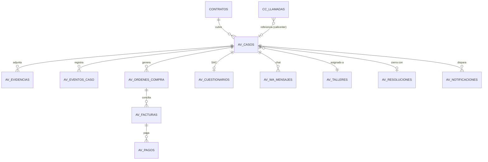
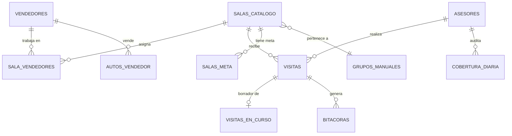
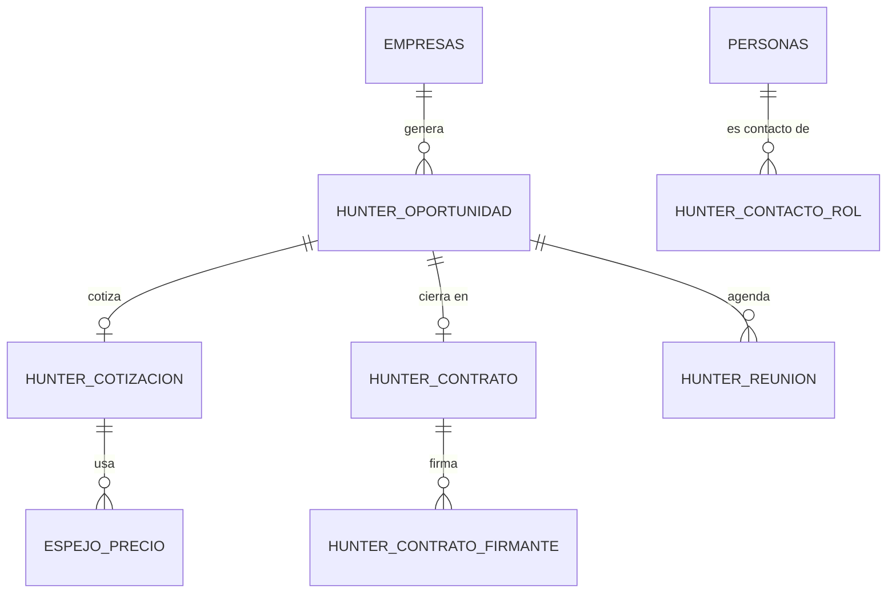

# 03 · Modelo de datos

| Campo | Detalle |
|---|---|
| Capítulo | C3 |
| Requerimiento(s) | RF-04 |
| Etapa | A (inferido) — T-08, T-09 · B (verificado) — T-31, T-33 |
| Versión | 1.0 (Etapa A — **inferido de migraciones, no verificado contra el catálogo real**) |
| Fecha | 2026-08-24 |
| Estado | 🟡 Cerrado en Etapa A — pendiente de verificación en Etapa B |

> **Marca obligatoria de lectura:** todo este capítulo es **Inferido** (`00-metodologia-y-evidencia.md` §1) — reconstruido leyendo las 364 migraciones, no consultando el catálogo real de Postgres (bloqueado por falta de A1). Esto significa: (a) no hay **volúmenes** de filas — eso es exclusivamente T-31; (b) una tabla puede haberse creado y luego alterado o eliminada fuera del control de versiones (vía dashboard) sin que quede registro aquí; (c) el estado de RLS aquí descrito es **RLS declarado**, no **RLS real** — la diferencia entre ambos es precisamente lo que T-32 (Etapa B) existe para cerrar, y ya produjo un hallazgo Crítico (`hallazgos.md` #1) antes de terminar este capítulo.

---

## 1. Cifras generales (hecho, sobre el propio SQL versionado)

| Métrica | Valor | Método |
|---|---|---|
| Sentencias `CREATE TABLE` en el historial | 152 | `inventarios/tablas-creadas.txt` |
| Tablas eliminadas (`DROP TABLE`) | 16 | `inventarios/tablas-eliminadas.txt` |
| **Tablas vivas (inferido)** | **136** | `tablas-creadas` − `tablas-eliminadas` |
| Declaraciones `CREATE [OR REPLACE] FUNCTION` | 422 | `inventarios/rpcs-todas-declaraciones.txt` |
| **RPCs únicas por nombre (inferido, vivas)** | **262** | `inventarios/rpcs-unicas.txt` |
| Archivos que mencionan `SECURITY DEFINER` | 171 de 364 | proxy — no es el conteo exacto de funciones `security definer`, se afina en T-33 |
| Vistas (`CREATE [OR REPLACE] VIEW`/`MATERIALIZED VIEW`) | 3 | `mora_salud_salas` (mencionada en 0329) y 2 más a nombrar en profundización futura |

**Corrección de método, documentada por transparencia (RNF-02):** la primera pasada de extracción de RLS y policies usando `grep` con espacio literal produjo **falsos negativos masivos** — Supabase/el equipo alinea las sentencias `ALTER TABLE` con espacios múltiples (`alter table public.usuarios         enable row level security;`), y además usa **bloques PL/pgSQL dinámicos** (`foreach t in array array[...] loop execute format('alter table %I enable row level security', t)`) para aplicar RLS y políticas a grupos de tablas en una sola sentencia. Un grep de texto literal no ve el nombre de la tabla en ese patrón. Se corrigió iterando manualmente sobre los **7 archivos** que usan este patrón (`0002`, `0010`, `0012`, `0199`, `0311`, `0323`, `0343`) y sumando sus arrays al inventario. **Implicación para quien retome este análisis:** cualquier grep simple sobre estas migraciones subestima la cobertura real de seguridad — hay que buscar también `foreach t in array`.

---

## 2. RLS — cobertura declarada (inferido, hallazgo central de este capítulo)

| Categoría | Tablas | Lectura |
|---|---|---|
| **Tablas vivas con RLS declarado en algún punto del historial** | **136 de 136 (100%)** | Ninguna tabla viva carece de un `ENABLE ROW LEVEL SECURITY` en su historial — mejor postura de lo que sugería la primera pasada (que reportaba 45 sin RLS, un falso positivo de método). |
| Sin regresión detectada | 0 sentencias `DISABLE ROW LEVEL SECURITY` en todo el historial | Ninguna tabla revirtió RLS después de activarlo. |
| Tablas vivas con RLS **y** al menos una política encontrada | 118 de 136 | Incluye las 25 recuperadas de los bloques dinámicos de `0002`/`0199`/`0323`. |
| **Tablas vivas con RLS activo pero sin política identificada** | **18 de 136** | Ver lista abajo — patrón consistente con "solo accesible por `service_role`", a confirmar en T-32. |
| **Política sin ninguna restricción de acceso (`using (true)`, sin `to authenticated`)** | **1 confirmada: `mora_corte`** | **`hallazgos.md` #1 — Crítico, ya escalado.** Otras 3 ocurrencias de `using (true)` sí llevan `to authenticated` o son la tabla pública intencional `tv_dashboard_state`. |

### 2.1 Las 18 tablas con RLS activo y sin política propia identificada

```
av_encuesta_tokens        notif_email_enviado        portal_recupera
av_encuesta_wa            portal_auditoria           portal_sesion
hunter_contrato_firmante  portal_demo_caso           portal_usuario
tarea_email_enviado       portal_demo_contrato       proveedor_email_enviado
                          portal_informe_envio       proveedor_magic
                          portal_org                 proveedor_otp
                          portal_otp                 proveedor_sesion
```

**Lectura (evaluación, no hecho puro):** el patrón de nombres es consistente — son tablas de **tokens, sesiones, magic links, envíos de correo y auditoría**, todas del área `portal`/`proveedor` (superficie pública semi-anónima, C2/T-07) más un puñado de tablas de bitácora de envío (`*_email_enviado`). RLS activo sin política es, en Postgres, **denegar todo excepto al rol `service_role`** (que hace `BYPASSRLS`). Si estas tablas están diseñadas para leerse/escribirse **solo desde Edge Functions** (que sí usan `service_role`), esto es el patrón correcto y deseable — más seguro que darles una política abierta. Confirmado indirectamente: `0152_portal_proveedor_login.sql` hace `revoke all on public.proveedor_otp, public.proveedor_sesion from authenticated, anon` — coherente con "solo el backend las toca". **No se marca como hallazgo de riesgo; se marca como pendiente de confirmar en T-32** que ninguna de las 18 se intente leer directamente desde el front con la `anon`/`authenticated` key (lo cual fallaría en silencio y sería un bug funcional, no de seguridad).

---

## 3. Tablas por familia (agrupación por dominio del sistema)

> Organización por prefijo de tabla, que en este repositorio coincide casi siempre con el módulo dueño (confirmado cruzando contra `inventarios/tablas-rpcs-por-modulo.txt`, C2/T-07).

| Familia | # tablas vivas | Dominio (C2/T-07) | Módulo(s) dueño(s) | Notas |
|---|---|---|---|---|
| `av_*` | 23 | Operación de garantías | `postventa` | Núcleo del sistema de casos de avería. Incluye las 15 con RLS del bloque dinámico de `0199` (endurecido en `0311`). |
| `salas_*` | 12 | Comercial | `salas`, `config` | Catálogo, asignación, geo, metas, comentarios. |
| `portal_*` | 9 | Operación de garantías (superficie externa) | `portal` | Sesión, OTP, org, auditoría, envíos — mayoría en la lista de "solo `service_role`" (§2.1). |
| `hunter_*` | 9 | Comercial | `hunter` | Actividad, contacto, contrato, cotización, handoff, oportunidad, precio, reunión, firmante. |
| `incentivo_*` | 6 | Comercial | `incentivos` | Comentario, envío, evento, línea, pago, período. |
| `cc_*` | 6 | Transversal → cruza a operación vía `av_casos` | `callcenter` | Config, eventos de llamada, llamadas, pausas, presencia, sesiones. |
| `proveedor_*` | 5 | Operación de garantías | `config`, `portal`, `solicitudes` | OTP, magic link, sesión, email enviado — mismo patrón de "solo backend" que `portal_*`. |
| `usuario_*` | 3 | Transversal | `config` | Áreas, grupos, roles de usuario. |
| `tarea_*` | 3 | Transversal (workflow compartido) | `solicitudes`, `visitas` | Avances, comentarios, email enviado. |
| `grupos_*` | 3 | Transversal | `config` | Distribuidores, manuales, meta-unidades. |
| `gasto_*` | 3 | Transversal | `gastos` | Archivos, asignaciones, categorías. |
| `mora_*` (+ `mora_corte`, `mora_clientes`, `mora_vinculos`) | 3 | Operación de garantías | `mora` | **`mora_corte` es el hallazgo Crítico #1.** `mora_clientes`/`mora_vinculos` ya endurecidas en `0329` tras auditoría externa previa. |
| `americar_*` | 2 | Comercial | `salas` | Datos de un actor de mercado ("Americar") mapeados a vendedor/sucursal — nombre propio de negocio no explicado en el código, candidato a pregunta para Fabrizio. |
| `solicitud_*` + `solicitudes` | 3 | Transversal | `solicitudes` | Eventos, tipos, tabla principal. |
| `visitas_*` + `visitas` | 3 | Comercial | `visitas` | Abiertas, en curso, principal. |
| `espejo_*` | 3 | Comercial | `hunter` | Plan, precio, tramo — "espejo" del catálogo de productos para cotizar sin tocar el maestro (confirma la hipótesis de C2/T-07). |
| `mercado_*` | 4–5 (a confirmar exacto) | Comercial | `hunter` | Concesionario, financiera, importador, marca, parámetro — el "mapa de mercado" que consumen los informes de mercado (`feat/mercado`, visto en commits recientes del repositorio). |
| Maestros sin prefijo de familia | resto | Transversal | Múltiples | `usuarios`, `asesores`, `vendedores`, `clientes`, `contratos`, `salas`, `productos_catalogo`, `presupuestos`, `feriados`, `monedas`, `roles`, `areas`, `proyectos`, `agenda_eventos`, `bitacoras`, `lobbies`, `notificaciones`, `plan_tareas`, `planes_accion`, `tv_dashboard_state`, `sala_vendedores`, `interacciones_vendedor`, `autos_vendedor`, `compromisos`, `fotos_herencia`, `notas_historicas`, `saludos_cumpleanos`, `uno_a_uno_sesiones`, `proyecto_operadores`, `cobertura_diaria`, `proyeccion_diaria`, `resumen_diario`. |

**Cobertura:** 136/136 tablas vivas agrupadas por familia (100%, RNF-11). El detalle columna-por-columna de cada tabla **no** se produjo en esta etapa — es un volumen que RF-04 permite diferir a un diagrama ER + agrupación por dominio cuando el catálogo real (T-31) puede confirmar cuáles de las 136 siguen realmente en uso, para no invertir el detalle fino en tablas que T-10 podría marcar como muertas.

---

## 4. Diagramas ER por dominio (simplificados, relaciones inferidas por nombre de columna y uso conjunto en RPCs — a confirmar con `information_schema` en T-31)

### 4.1 Operación de garantías — núcleo `postventa`/`averias`/`facturacion`



### 4.2 Comercial — núcleo `salas`/`visitas`/`vendedores`



### 4.3 Comercial — prospección `hunter`



---

## 5. RPCs — panorama general (detalle firma-por-firma se difiere; ver §6)

**262 RPCs únicas** es un universo demasiado grande para documentar firma por firma en el tiempo de la Etapa A sin sacrificar el resto del capítulo — RF-04 exige "RPCs con firma, propósito y llamadores"; aquí se resuelve **el propósito y el llamador** (ya cruzado por módulo en `inventarios/tablas-rpcs-por-modulo.txt` y C2/T-07) y se **difiere la firma exacta** de cada una a consulta puntual con `pg_get_functiondef` — que de todas formas requiere A1 para confirmarse contra la versión realmente desplegada (T-33).

| Familia de RPC (por prefijo del nombre) | Aproximado | Módulo dueño | Patrón |
|---|---|---|---|
| `av_*` | ~40 | `postventa` | Una función por transición de estado del caso — el patrón de "lógica en RPC" más consistente del sistema (confirmado en C2). |
| `hunter_*` | ~12 | `hunter` | Firma digital, agenda, cierre de oportunidad. |
| `incentivos_*` | ~9 | `incentivos` | Ciclo de vida del período de incentivos. |
| `solicitud_*` / `tarea_*` / `proveedor_*` | ~15 | `solicitudes` | Workflow de solicitudes y tareas a proveedores. |
| `cc_kpi_*` | 5 | `callcenter` | Cálculo de KPIs de call center, cada uno una función independiente. |
| `salas_*` / `cierre_salas_*` / `pc_*` | ~19 | `salas` | Cierre de mes por sala, activación, mix de productos. |
| `facturacion_*` / `aplicar_contratos_*` | ~8 | `facturacion` | Cálculo agregado + patrón *staging → aplicar*. |
| `vendedor_*` / `*_vendedor*` | ~11 | `vendedores` | Resolución/fusión de identidad. |
| `app_rol` / `puede` / `es_miembro` / helpers | ~10 | Transversal | Funciones de autorización reutilizadas por RLS en múltiples tablas (`security definer`, ver `0002_rls.sql`). **Estas son las más críticas de todo el sistema**: si `app_rol()` tiene un error, afecta la política de decenas de tablas simultáneamente. |
| Resto (siniestralidad, cobertura, resumen, mora, organigrama, etc.) | ~130 | Múltiples | Una función por cálculo agregado específico de cada módulo — ver C2. |

---

## 6. Pendiente explícito para completar este capítulo

- **Firma exacta y `security definer` sí/no de cada una de las 262 RPCs** — diferido a T-33 (Etapa B), porque requiere `pg_get_functiondef` contra la base real para no documentar una firma que ya cambió.
- **Columnas y relaciones (claves foráneas) exactas de cada tabla** — diferido a T-31, mismo motivo: `information_schema` da la verdad; las migraciones dan una aproximación de alta confianza pero no definitiva (una tabla pudo alterarse fuera de migración).
- **Volumen de filas por tabla** — exclusivo de T-31, imposible de inferir del código.
- **Nombres de negocio no explicados en el código** (ej. `americar_*` — ¿qué es "Americar"?) — trasladado a `preguntas-abiertas.md` para resolver con Fabrizio Álvarez.

**Cobertura declarada (RNF-11):** 100% de las tablas vivas inferidas agrupadas y con dominio; 100% de las familias de RPC caracterizadas por propósito; 0% de las RPCs con firma exacta documentada (diferido íntegramente a Etapa B, con la razón declarada arriba, no por omisión).
