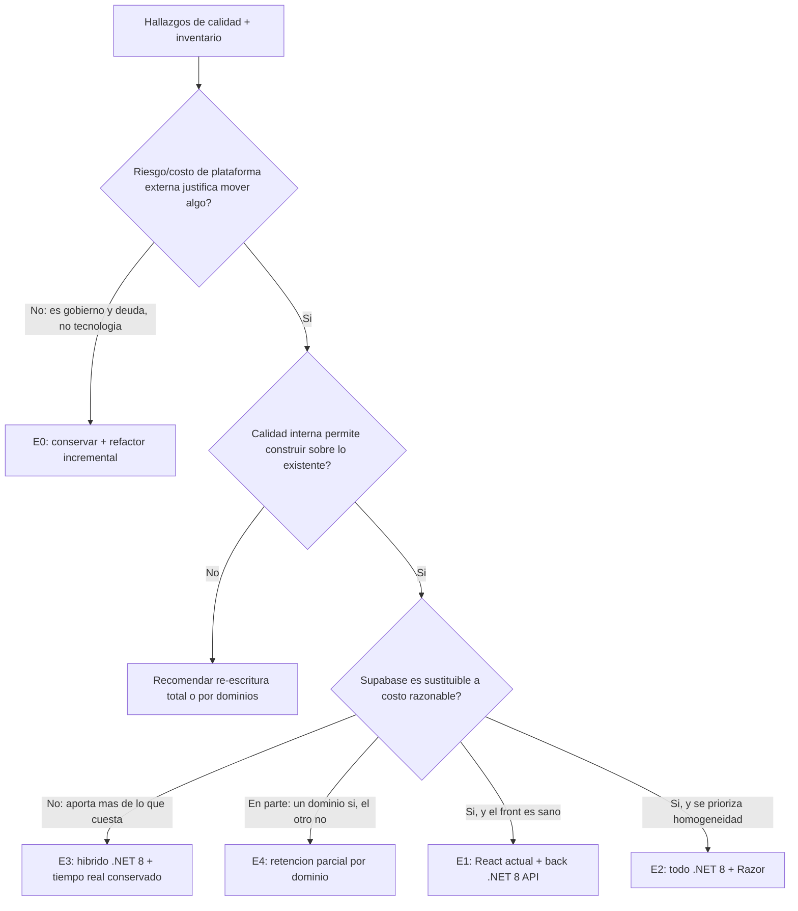

# 17 · Comparación de escenarios de destino (E0–E4)

| Campo | Detalle |
|---|---|
| Capítulo | C16 |
| Requerimiento(s) | RF-18, RF-20 |
| Etapa | A (preliminar) — T-24 · B (E4 resuelto) — T-37 |
| Versión | 1.0 (Etapa A — preliminar; E4 y el costo real se cierran en T-37/T-35) |
| Fecha | 2026-08-24 |
| Estado | 🟡 Cerrado en Etapa A — pendiente T-35/T-37 |

> Criterios idénticos para los cinco (RNF-10): esfuerzo en rangos gruesos, riesgo, encaje con el estándar de TI, impacto operativo, costo de plataforma, mantenibilidad. **E0 es la línea base**: los otros cuatro deben justificarse contra ella, no al revés (árbol de decisión del PRD §7.3, y confirmación de la Dirección de que la migración no está decidida — `PLAN.md` §12 nota 5).

---

## Árbol de decisión — republicado con la rama de E4 (antes de aplicarlo, T-26)

El árbol original del PRD (§7.3) pregunta *"¿Supabase es sustituible a costo razonable?"* como sí/no. Con E4 sobre la mesa, admite un tercer valor:

---

## Los cinco escenarios, con la misma rejilla

### E0 — Conservar el stack actual + refactor incremental con gobierno en TI

| Criterio | Evaluación |
|---|---|
| **Esfuerzo** | Bajo-Medio — no hay migración; el esfuerzo es absorber gobierno (documentación ya producida por este PRD, credenciales bajo control de TI, proceso de PR/CI ya existente) y ejecutar los hallazgos de Fase 2 (tests de UI, `strict`, CORS, observabilidad backend). |
| **Riesgo** | Bajo técnico, **Medio de gobierno** — sigue dependiendo de que TI absorba una tecnología que hoy no opera (React/Vite/Supabase), y de resolver la propiedad del código (`fabriziolag/garantiplus-dashboard`, cuenta personal — pregunta abierta del PRD). |
| **Encaje con el estándar de TI** | Bajo — el stack sigue fuera de .NET 8/Razor. |
| **Impacto operativo** | **Ninguno** — cero interrupción, cero re-entrenamiento de usuarios. |
| **Costo de plataforma** | Se mantiene (Supabase + Vercel); no cuantificado (A2 pendiente), pero sin el costo adicional de una migración. |
| **Mantenibilidad** | Mejora sustancialmente solo con la documentación de este PRD — antes de este análisis, dependía enteramente del mantenedor original. |
| **Lo que E0 no resuelve** | Ninguno de los 8 hallazgos de Fase 2 desaparece solo — hay que ejecutarlos igual, dentro del mismo stack. |

### E1 — React actual + back .NET 8 API

| Criterio | Evaluación |
|---|---|
| **Esfuerzo** | **Muy alto** — reconstruir Postgres+RLS→autorización .NET (§1.1 de C15), Auth→Identity, Storage→S3, 46 Edge Functions→servicio(s) .NET, y **todo el Realtime** (9 de 11 canales necesarios, C15 §1.5) en SignalR con su backplane. El front (24 módulos, 464 archivos) se conserva, pero cada llamada a Supabase (`.from()`, `.rpc()`, `.channel()`) se reescribe contra la nueva API .NET. |
| **Riesgo** | Alto — es la combinación más grande de piezas a reconstruir en paralelo (los 5 servicios completos) sin cambiar el front, lo que exige que las dos puntas (React viejo, .NET nuevo) queden perfectamente sincronizadas mientras se migra. |
| **Encaje con el estándar de TI** | Medio — el backend sí calza (.NET 8), el frontend sigue fuera. |
| **Impacto operativo** | Medio — si se ejecuta bien, la UI no cambia para el usuario; el riesgo es en el período de transición (dos backends convivientes, o corte con ventana). |
| **Costo de plataforma** | Baja Supabase, sube AWS (ECS+Fargate para 46 funciones + SignalR, RDS, S3) — sin cifra (A2/T-35 pendiente), pero es el escenario que más servicios nuevos de AWS requiere de los cuatro no-E0. |
| **Mantenibilidad** | Alta a largo plazo (backend en el estándar de Engine), pero el front sigue siendo una isla tecnológica que solo React/TS puede mantener. |

### E2 — Todo .NET 8 + Razor (rehacer completo)

| Criterio | Evaluación |
|---|---|
| **Esfuerzo** | **El más alto de los cinco** — todo lo de E1 más re-escribir los 24 módulos de UI (113 587 líneas, incluidos componentes de hasta 3525 líneas, C10) en Razor. Pierde de raíz el mapa de mercado (Leaflet), la generación de PPT en cliente (`pptxgenjs`), y tendría que resolver la PWA/offline (C9) desde cero en un paradigma server-rendered, que no es el fuerte de Razor. |
| **Riesgo** | Alto — riesgo clásico de "re-escritura completa": todo el conocimiento de negocio no documentado en código (lógica implícita en 3525 líneas de `CasoDetalle.tsx`, por ejemplo) se puede perder si no se verifica con el mantenedor actual y Fabrizio antes de reescribir. |
| **Encaje con el estándar de TI** | **Máximo** — es, por definición, el estándar completo de Engine. |
| **Impacto operativo** | **Alto** — cambio total de UI, re-entrenamiento de usuarios, riesgo de regresión funcional en 24 módulos simultáneamente. |
| **Costo de plataforma** | Máximo esfuerzo de desarrollo, pero el destino de costo de infraestructura es el más alineado con lo que Engine ya opera (menos servicios nuevos que aprender a administrar). |
| **Mantenibilidad** | Máxima a largo plazo — homogéneo con el resto de Engine (SIGA, Omega). |

### E3 — Híbrido .NET 8 conservando el tiempo real

| Criterio | Evaluación |
|---|---|
| **Esfuerzo** | Alto, pero **menor que E1** en la pieza más cara — si "conservar el tiempo real" significa mantener Supabase Realtime (o su equivalente) en convivencia en vez de reconstruirlo en SignalR, se evita el ítem de mayor riesgo de C15 §1.5. |
| **Riesgo** | Medio-Alto — la convivencia de dos plataformas (Supabase para Realtime, .NET para el resto) es arquitectónicamente más compleja de operar (dos fuentes de verdad a sincronizar) pero evita la re-implementación más riesgosa. |
| **Encaje con el estándar de TI** | Medio — el núcleo migra a .NET, pero Supabase permanece como pieza operativa permanente, no transitoria. |
| **Impacto operativo** | Medio — similar a E1 en el front, pero con menor riesgo de romper la experiencia en vivo (War Room, call center, chat de postventa) porque esa pieza no se toca. |
| **Costo de plataforma** | Paga las dos plataformas en paralelo indefinidamente (Supabase para Realtime + AWS para el resto) — a diferencia de E1/E2, que consolidan en una. |
| **Mantenibilidad** | Media — dos plataformas que mantener es, por definición, más superficie que una. |

### E4 — Retención parcial por dominio *(preliminar — resuelto con evidencia en T-37, Etapa B)*

| Criterio | Evaluación preliminar |
|---|---|
| **Esfuerzo** | Depende enteramente de las costuras — C2/T-07 y C3/T-08 ya identificaron las candidatas: `callcenter` (toca `av_casos`), los catálogos transversales (`productos`, `solicitudes`, `config`). Si esas costuras son pocas y desacoplables, el esfuerzo podría ser el **menor de los cuatro no-E0** (se migra solo el dominio de operación de garantías, ~23 tablas `av_*` + averías/facturación/mora/portal). Si son muchas o profundas, se acerca al esfuerzo de E1. |
| **Riesgo** | Depende del resultado de T-37 — el riesgo estructural (identificado) es bajo; el riesgo real depende de si el peso de datos/tráfico está parejo o concentrado, algo que solo T-35 puede decir. |
| **Encaje con el estándar de TI** | Parcial por diseño — es su naturaleza: una parte queda fuera del estándar a propósito, si el análisis de costo lo justifica. |
| **Impacto operativo** | Depende de cuál mitad se mueve — si es la de operación de garantías (más RPCs por tabla, C15 §2), el impacto de reescritura de lógica es mayor por tabla movida que si fuera el lado comercial. |
| **Costo de plataforma** | **Es la pregunta que E4 existe para responder** — si el dominio comercial (que no tiene equivalente en SIGA ni en ningún sistema de Engine, `PLAN.md` §1.3) concentra la mayoría del costo y se queda en Supabase, el ahorro podría ser sustancial. Sin T-35, esto es hipótesis, no conclusión. |
| **Mantenibilidad** | Dos plataformas en convivencia permanente (como E3), pero con una frontera de dominio clara en vez de una frontera técnica (Realtime vs. resto) — potencialmente más fácil de razonar para un equipo nuevo, si la frontera de negocio es intuitiva. |
| **Veredicto de este cierre (Etapa A)** | **No se descarta ni se aprueba.** Es el escenario con más incógnitas genuinas de los cinco, y es correcto que así sea — es el que depende más de datos que hoy no existen (T-35/T-37). |

---

## Tabla comparativa consolidada (rango de esfuerzo relativo, no cifra)

| Escenario | Esfuerzo relativo | Riesgo | Encaje TI | Impacto operativo | Plataformas a mantener |
|---|---|---|---|---|---|
| E0 | Bajo-Medio | Bajo-Medio | Bajo | Ninguno | 1 (Supabase+Vercel) |
| E4 | **Medio (hipótesis)** — a confirmar T-37 | Medio (depende de T-37) | Parcial | Medio (parcial) | 2 |
| E3 | Alto | Medio-Alto | Medio | Medio | 2 |
| E1 | Muy alto | Alto | Medio | Medio | 1 (solo AWS) |
| E2 | El más alto | Alto | Máximo | Alto | 1 (solo AWS) |

**Lectura para el dictamen preliminar (T-26):** el esfuerzo crece de E0 a E2 de forma consistente con cuánto se toca — es el patrón esperado y confirma que el árbol de decisión del PRD está bien planteado (empezar preguntando si de verdad hay que mover algo). **La pieza que más cambia la conversación en cualquier escenario que no sea E0 es el Realtime** (C15 §1.5) — subestimarla es el error más probable de todo este ejercicio de estimación.

---

## Cobertura declarada (RNF-11)

Los cinco escenarios evaluados con la misma rejilla de seis criterios (100%, RF-18). Esfuerzo en rangos **relativos** (no cifras de días-persona ni de dinero — RF-20 exige rangos gruesos, aquí se entregan ordinales comparables entre sí, coherentes con lo estimado capítulo a capítulo). **E4 queda explícitamente sin cerrar** — es su diseño, no un hueco: T-37 lo resuelve con el peso real de T-35. El costo de plataforma de los cinco queda **sin cifra** en todos por igual (A2 pendiente), para no sesgar la comparación favoreciendo al que por casualidad tuviera un dato y penalizando al que no.
