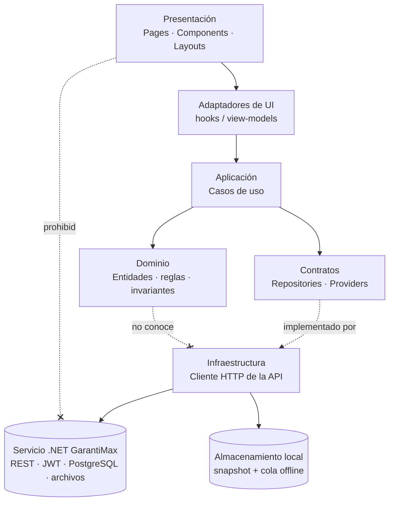
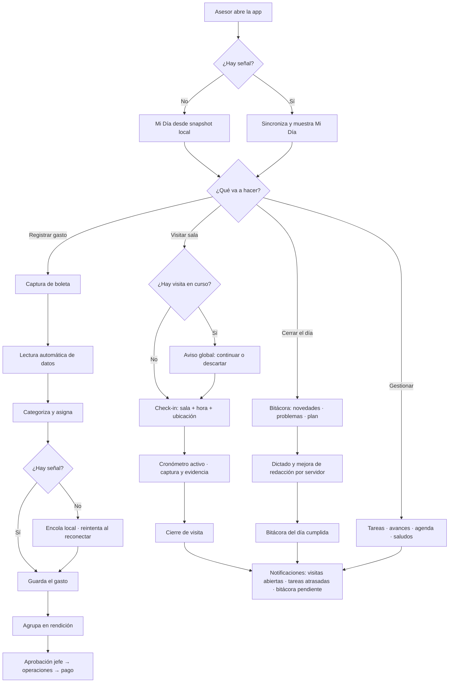
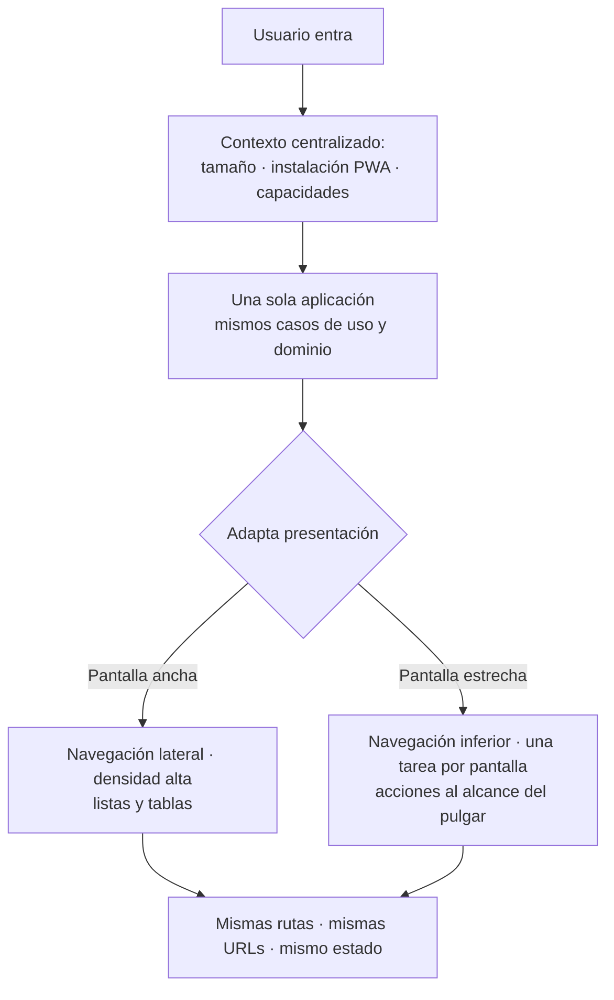

# PRD - Reconstrucción de GarantiMAX — Fase 1: núcleo del Asesor Farmer

| **Campo** | **Detalle** |
| --- | --- |
| **Proyecto** | Reconstrucción de GarantiMAX — Fase 1: núcleo del Asesor Farmer |
| **Área / empresa** | EngineCX |
| **Versión** | v0.2 |
| **Fecha** | 26-08-2026 (v0.1: 25-08-2026) |
| **Autores** | Javier Antonio Oropeza Camacho |
| **Revisión / liderazgo** | Aldo Álvarez — Director de TI |
| **Tipo de proyecto** | Re-plataforma / re-arquitectura (reconstrucción de la aplicación sobre un backend nuevo, sin migración de datos) |

> **Anexos técnicos** (en `manager/anexos/`): [A1 — Arquitectura propuesta](anexos/A1-arquitectura.md) · [A2 — ADRs](anexos/A2-adrs.md) · [A3 — Inventario del sistema actual y clasificación por fases](anexos/A3-inventario.md)

> ### ⚠️ Cambio de la v0.2 — 26-08-2026: se abandona Supabase
>
> Decisión del responsable, registrada en **[ADR-011](anexos/A2-adrs.md#adr-011--backend-propio-en-net-se-abandona-supabase)**. El backend deja de ser Supabase y pasa a un **servicio .NET propio** —`Services/GarantiMax/` en el monorepo `garantiplusmexico/gp_3.0_siga_api`— con base de datos PostgreSQL propia. Tres consecuencias que cambian la lectura de todo el documento:
>
> 1. **No hay migración de datos ni convivencia sobre una misma base.** Borrón y cuenta nueva: la base arranca vacía y el sistema actual queda aislado. Lo que antes era un riesgo de invariantes divergentes ahora es un problema de **poblar los catálogos** de referencia.
> 2. **La autorización deja de ser RLS y pasa a ser código de servidor**, resuelta con los roles que el JWT de la API ya emite. Desaparece la matriz `roles × capacidades` (ADR-008) y desaparece con ella el riesgo de la clave anónima pública.
> 3. **Las siete Edge Functions dejan de ser activos reutilizables y pasan a ser especificaciones** que hay que reimplementar como endpoints. Es el mayor aumento de alcance del cambio.
>
> **La §2 (contexto y situación actual) describe el sistema viejo y por eso sigue hablando de Supabase: es historia, no plan.** Todo lo demás está actualizado. ADR-002, ADR-004 y ADR-008 quedan superados; ADR-005 modificado; ADR-001, ADR-003, ADR-006, ADR-007, ADR-009 y ADR-010 **no cambian** — es la arquitectura de dependencias hacia adentro la que hizo que este cambio se pague solo en `infrastructure/`.

## 1. Resumen ejecutivo

**GarantiMAX** es la aplicación de gestión comercial de garantías vehiculares del Hub Sur (Chile / Perú / Argentina). Funciona y se usa a diario, pero su arquitectura interna llegó al límite: **926 llamadas a la base de datos**, de las cuales **443 viven dentro de componentes visuales**; un `App.tsx` de **916 líneas** que consulta tablas, decide el layout, drena la cola offline y contiene reglas de negocio; **ningún router, ninguna capa de datos y ninguna gestión de estado**; y dos aplicaciones conceptualmente distintas —el dashboard de escritorio y la PWA de terreno— que comparten un solo componente entre sí. Sumar una funcionalidad hoy cuesta desproporcionadamente caro y cada cambio puede romper algo que nadie previó.

Este proyecto **reconstruye la aplicación** —no la base de datos, no el producto— empezando por el actor que más valor genera y más sufre la fricción: el **Asesor Farmer (AF)**, el vendedor de terreno que visita las salas, registra visitas, gestiona tareas, lleva su bitácora y rinde sus gastos desde el celular, muchas veces sin señal. La reconstrucción parte de una premisa dura: el sistema actual sirve para **descubrir qué hace el producto y qué reglas existen**, no como plantilla de cómo implementarlo. Todo requisito funcional se conserva; toda decisión técnica se vuelve a tomar.

El MVP de este PRD es el **núcleo de terreno del asesor**: autenticación y perfil, Mi Día, visitas con check-in, tareas, agenda, bitácora diaria y gastos/boletas con rendición — una aplicación nueva con separación estricta entre presentación, casos de uso, dominio e infraestructura, servida por un **servicio .NET propio** (`Services/GarantiMax/` en el monorepo `gp_3.0_siga_api`) con base de datos propia y sin migración de datos — borrón y cuenta nueva (ADR-011). El backend queda detrás de contratos que permiten sustituirlo sin reescribir el negocio. Quedan para fases posteriores Facturación, Salas, Cobertura, Incentivos y Solicitudes; y fuera de este PRD, los módulos que no pertenecen al asesor (Post-Venta, Hunter, Call Center, War Room, Portal, Mora, 1:1).

El resultado esperado es que el asesor tenga una herramienta de terreno más rápida y confiable, y que TI recupere el control técnico del sistema: una base donde el negocio esté en un solo lugar, se pueda probar sin backend, y absorber un módulo nuevo no signifique tocar diez archivos que no tienen nada que ver.

**Descubrimiento del sistema actual** → **Diseño de arquitectura y ADRs** → **Construcción del núcleo del asesor** → **Validación con asesores en terreno** → **Corte único al nuevo sistema** → **Fases siguientes absorben el resto**

## 2. Contexto y problema

### Cómo funciona hoy

GarantiMAX es una SPA **React 19 + Vite 8 + TypeScript** con Tailwind v4, desplegada en Vercel (`www.garantimax.com`). Todo el backend es **Supabase**: Postgres con RLS activo, **128 tablas**, **364 migraciones**, Auth, Storage y **46 Edge Functions**. El código son **~109 mil líneas en 455 archivos**, organizadas en **24 módulos** bajo `src/features/`, con **65 archivos de test** (Vitest).

El acceso a datos es **directo desde el frontend**: `getSupabase()` se importa en **152 archivos** y se ejecutan **926 llamadas** `.from()` / `.rpc()`, de las cuales **443 están dentro de archivos `.tsx`** — es decir, la vista consulta la base de datos.

La aplicación se bifurca en dos experiencias: si detecta que corre como PWA instalada (`usePwaStandalone()` en `App.tsx:454`) monta `MiDiaMovil` —972 líneas, 7 pantallas propias—; si no, monta el dashboard con 12 pestañas. Ambas ramas comparten exactamente **un** componente (`GastosView`).

Los permisos viven en una matriz `roles × capacidades` en base de datos (13 roles reales en `usuarios.rol_principal`, más roles funcionales en `usuario_roles`), que **convive** con un sistema anterior de tres niveles (`CM` / `GTE` / `FARMER`) que el propio código documenta como *"plumbing para módulos legacy"*.

### El dolor concreto

- **La vista sabe demasiado.** 443 queries dentro de componentes significa que no se puede cambiar una regla de negocio sin abrir la UI, ni probar una regla sin renderizar. Cada `useEffect` + `.from()` + `useState` repetido es una oportunidad de divergencia.
- **No hay dónde poner el negocio.** Sin capa de dominio ni de casos de uso, una misma regla se reimplementa en el componente móvil y en el de escritorio, y se desincronizan. La duplicación entre `MiDiaMovil` y el dashboard es el caso más visible.
- **`App.tsx` es un cuello de botella.** 916 líneas que hacen enrutamiento, consultas, autorización, drenaje de cola offline y reglas de negocio. Todo cambio estructural pasa por ahí.
- **Vendor lock-in sin contención.** Supabase está esparcido por 152 archivos. Hoy no hay forma de estimar qué costaría cambiarlo, porque no hay una frontera que medir.
- **Dos aplicaciones que deberían ser una.** Web y PWA divergen en funcionalidad y en corrección de bugs, con `if (isPWA)` como mecanismo de bifurcación.
- **Sin router, sin caché, sin estado.** La navegación es `useState<Tab>`; no hay URLs compartibles ni historial; cada componente refetchea por su cuenta sin invalidación ni reintentos.

### Por qué resolverlo ahora

El sistema no está roto de cara al usuario: está bloqueado de cara al equipo. Cada mes que pasa se agregan módulos sobre la misma base, aumentando el costo de la reconstrucción. Además, la Dirección de TI necesita absorber el sistema y hoy no puede: no hay una arquitectura que un desarrollador ajeno pueda entender ni mantener sin recurrir a su autor original.

### Distinciones de dominio que el equipo debe tener claras

- **Asesor Farmer vs. Vendedor de sala.** El **Asesor Farmer (AF)** es usuario del sistema: es quien visita las salas, registra las visitas y rinde gastos. El **Vendedor** es la persona del concesionario que vende la garantía; hoy **no tiene login** y se administra como dato desde el módulo de Salas. Este PRD trata del **Asesor Farmer**.
- **Requisito funcional vs. decisión técnica.** Que hoy la visita se guarde con un `.from('visitas').insert()` dentro del componente es una decisión técnica y se descarta. Que la visita exija check-in con geolocalización es un requisito funcional y se conserva.
- **Realtime vs. refresco por consulta.** Realtime se usa en exactamente **9 archivos** —War Room, Post-Venta y Call Center—; **ningún módulo del asesor lo usa**. Lo que en Mi Día parece "en vivo" es refetch al recuperar el foco.
- **Base de datos vs. aplicación.** Este proyecto reconstruye la **aplicación**. El esquema de datos en producción se conserva.
- **Offline vs. sincronización.** La PWA hoy guarda un snapshot de Mi Día y una cola de boletas en IndexedDB. Offline es un requisito del negocio del asesor, no un lujo técnico: hay salas sin cobertura.

## 3. Objetivo del producto

Reconstruir la aplicación de terreno del **Asesor Farmer** sobre una arquitectura con responsabilidades separadas —presentación, casos de uso, dominio e infraestructura— en la que las reglas de negocio tengan una única fuente de verdad, ninguna vista consulte la base de datos, y el backend quede encapsulado detrás de contratos sustituibles. El backend es un **servicio .NET propio con base de datos propia** (ADR-011): la base arranca vacía y **no hay migración de datos**. El esquema del sistema actual sirve como inventario de campos y de reglas, no como plantilla del modelo.

El objetivo es verificable: al cierre de la Fase 1 el asesor debe poder ejecutar **todo su trabajo de terreno** en el nuevo sistema —Mi Día, visitas con check-in, tareas, agenda, bitácora y gastos, con soporte offline— con paridad funcional respecto al sistema actual; y el equipo debe poder ejecutar las pruebas del dominio y de los casos de uso **sin backend levantado**.

### 3.1 Estrategia de implementación por fases

| **Fase** | **Nombre** | **Descripción** |
| --- | --- | --- |
| **Fase 1 — MVP de este PRD** | Núcleo de terreno del asesor | Autenticación, perfil y bienvenida; Mi Día; visitas con check-in y evidencia; tareas y avances; agenda y saludos de cumpleaños; bitácora diaria; gastos, boletas y rendición. Incluye la arquitectura base (dominio, casos de uso, repositorios, providers), el layout adaptativo y el soporte offline. Cierra con **corte único** para los asesores. |
| Fase 2 | Cartera comercial del asesor | Facturación (vista de consulta del asesor), Salas con fichas de sala y vendedor, Cobertura e Incentivos. Absorbe el doble acceso temporal y lo termina. |
| Fase 3 | Solicitudes y gestión operativa | Solicitudes, planes de acción, proyectos y notificaciones avanzadas. |
| Futuro | Módulos de otros roles | Post-Venta / Averías, Hunter, Call Center, War Room, Portal de clientes y proveedores, Mora / Cobranza, 1:1, Productos, Resumen, Inducción. Se consideran arquitectónicamente, **no se implementan**. |
| Legacy | Candidatos a eliminación | Sistema de tier `CM/GTE/FARMER`; módulos `farmer/` y `bitacora/` (carpetas vacías); `MiDiaMovilPreview` y el parámetro `?midia`; el `if (isPWA)` distribuido. |

**El MVP de este PRD es la Fase 1.**

## 4. Usuarios y actores

| **Usuario / Actor** | **Rol en el proceso** |
| --- | --- |
| **Asesor Farmer (AF)** | Usuario principal y único de la Fase 1. Visita salas, registra visitas con check-in, gestiona sus tareas y agenda, escribe su bitácora diaria y rinde gastos. Trabaja mayormente desde el celular, con frecuencia sin señal. |
| **Country Manager (CM)** | Supervisa la operación del Hub Sur. En Fase 1 solo como consumidor de la información que el asesor genera; su experiencia sigue en el sistema actual. |
| **Gerente Comercial (GC)** | Jefe directo del asesor. Aprueba rendiciones de gasto y revisa bitácoras. Participa en Fase 1 únicamente en el flujo de aprobación de gastos. |
| **Gerente / Asistente de Operaciones (GO / AO)** | Segundo nivel de aprobación de rendiciones y pago. Participa en Fase 1 solo en ese flujo. |
| **Asesor de Onboarding (ON) y roles Hunter (HC / HD / HI)** | Tienen la capacidad `midia` en la matriz actual. Se debe confirmar si entran al corte de Fase 1 o permanecen en el sistema actual (ver §14). |
| **Vendedor de sala** | Persona del concesionario a la que el asesor visita y sobre la que registra interacciones. **No es usuario del sistema**: es un dato de referencia. |
| **TI / Engine** | Responsable de la arquitectura, el gobierno del sistema y su mantenimiento posterior. Destinatario principal del beneficio técnico. |

## 5. Alcance MVP y funcionalidades

| **Funcionalidad** | **Descripción** |
| --- | --- |
| **Autenticación y sesión** | Inicio de sesión con correo/contraseña y Google. Resolución del perfil del usuario y sus roles. Manejo explícito del caso "cuenta sin perfil". Cierre de sesión. La sesión persiste y se renueva sin intervención del usuario. |
| **Autorización por roles del JWT** | El acceso a cada módulo se resuelve contra los **roles que el token de la API ya trae** como claims, **no** contra el tier legacy ni contra una matriz de capacidades propia (ADR-011 supera a ADR-008). La resolución ocurre una sola vez, en un punto central, y el resultado se expone a la UI como una decisión ya tomada. |
| **Bienvenida y perfil** | Pantalla de bienvenida descartable por el usuario y persistente por perfil. Datos básicos del asesor y su asignación. |
| **Mi Día** | Pantalla de entrada del asesor: qué tiene que hacer hoy —eventos de agenda, tareas pendientes, visitas planificadas, saludos de cumpleaños del día— con acceso directo a registrar cada cosa. Debe abrir y ser útil **sin señal**, a partir del último snapshot sincronizado. |
| **Visitas con check-in** | Registro de una visita a una sala: apertura con check-in, cronómetro de duración, captura de lo observado, evidencia y cierre. Solo puede existir **una visita en curso por asesor**; el sistema lo impide y lo hace visible en cualquier pantalla. El borrador sobrevive al cierre de la app y a la falta de señal. |
| **Registro de lobbies y otros eventos** | Además de la visita a sala, el asesor registra lobbies y actividades de otro tipo, con su propio detalle e historial. |
| **Tareas y avances** | Lista de tareas del asesor, con creación, avances comentados, calificación y cierre. Las tareas pueden originarse en una sala o en un plan y arrastran ese vínculo. |
| **Agenda** | Calendario de eventos del asesor: visitas planificadas, lobbies, reuniones y recordatorios. Permite agendar desde Mi Día y marcar realizado, cancelado o reagendado. Respeta el calendario de días hábiles y feriados. |
| **Saludos de cumpleaños** | El sistema le indica al asesor qué vendedores de sus salas cumplen años y le permite registrar el saludo como interacción. |
| **Bitácora diaria** | Registro diario obligatorio del asesor: novedades, problemas, plan y texto libre, con las salas mencionadas. Incluye dictado por voz y mejora de redacción asistida por IA, ambos vía función de servidor. El sistema controla su cumplimiento diario. |
| **Gastos, boletas y rendición** | Captura de una boleta desde la cámara, con lectura automática de sus datos vía función de servidor; categorización y asignación a sala, visita o proyecto; agrupación en una rendición; y el flujo de aprobación jefe → operaciones → pago. La captura funciona **sin señal**: la boleta se encola localmente y se sincroniza al recuperar conexión, con reintentos. |
| **Notificaciones al asesor** | Avisos de tareas atrasadas, visitas abiertas sin cerrar y bitácoras pendientes. |
| **Modo offline** | Snapshot de Mi Día y cola de operaciones pendientes en almacenamiento local del dispositivo. La sincronización es explícita, observable por el usuario y resistente a fallos parciales. |
| **Layout adaptativo** | Una sola aplicación cuya presentación se adapta a escritorio y móvil. La detección de instalación como PWA está centralizada en un único punto y **no** se consulta desde componentes. |

**Principio rector del MVP.** La Fase 1 prioriza **paridad funcional con corrección arquitectónica**: el asesor no debe perder ninguna capacidad que hoy tenga en su trabajo de terreno, y ninguna regla de negocio debe quedar dentro de un componente. Lo que este MVP deliberadamente **no** decide todavía: qué librería concreta resuelve cada responsabilidad más allá de las ya fijadas (ver §14), cómo se implementa Realtime (queda solo el puerto), y qué roles distintos del AF entran al corte.

## 6. Fuera de alcance

- **Facturación, Salas, Cobertura, Incentivos y Solicitudes**: son módulos que el asesor usa, pero no forman parte de su trabajo de terreno. Van a Fase 2 y Fase 3. Durante la transición el asesor los sigue consultando en el sistema actual (doble acceso temporal).
- **Post-Venta / Averías, Hunter, Call Center, War Room, Portal, Mora / Cobranza, 1:1, Productos, Resumen, Inducción**: pertenecen a otros roles. Siguen operando sin cambios en el sistema actual. Se consideran al diseñar los límites entre dominios, pero **no se construye nada** para ellos.
- **Implementación de Realtime**: ningún módulo del asesor lo usa. Queda declarado el puerto `RealtimeProvider` como decisión arquitectónica documentada; la implementación se decide cuando alguna funcionalidad la exija (ADR-005, modificado por ADR-011).
- **Migración del histórico de terreno**: no hay. La base del servicio nuevo arranca vacía — borrón y cuenta nueva, decisión del responsable. Las visitas, bitácoras y gastos registrados en el sistema actual **no** se trasladan.
- **Cualquier cambio en la base del sistema actual**: el servicio nuevo tiene su propia base. El esquema de Supabase se lee como documentación y no se toca, ni con cambios aditivos.
- **Los módulos de otros roles dentro del servicio .NET**: `Services/GarantiMax/` cubre el alcance de Fase 1. Los módulos de Fase 2, Fase 3 y posteriores se agregan al mismo servicio cuando llegue su fase; no se anticipan endpoints.
- **Multi-país operativo**: la primera entrega opera **solo Chile**. El país se modela como dato desde el día uno, pero Perú y Argentina no se ponen en marcha en Fase 1 — moneda, identificador fiscal y feriados por país quedan pendientes.
- **Cambio del stack de frontend**: se conserva React + TypeScript.
- **Rediseño visual del producto**: la reconstrucción es arquitectónica. La identidad visual y los flujos que el asesor ya conoce se conservan, salvo donde el layout adaptativo obligue a unificarlos.
- **Importadores de Excel de SIGA**: son operación de CM/GTE, no del asesor. Permanecen en el sistema actual hasta Fase 2.
- **Cronograma y estimaciones**: este PRD define qué y por qué. El plan de desarrollo se elabora aparte.

## 7. Flujos principales

### 7.1 Arquitectura objetivo — flujo de una operación

La regla que sostiene todo el diseño es la dirección de las flechas: **las dependencias apuntan hacia adentro**. La presentación conoce los casos de uso; los casos de uso conocen el dominio y los contratos; solo la infraestructura conoce la API. Un componente que necesita datos pide un caso de uso, nunca un endpoint. Esto es lo que hoy no existe: las 443 queries dentro de vistas son flechas que van directo de la esquina superior a la inferior, saltándose todo.

El corolario práctico: cuando cambie la forma de guardar una visita, se toca una implementación de repositorio. Cuando cambie la **regla** de que solo hay una visita en curso, se toca el dominio. Hoy ambas cosas viven en el mismo `useEffect`.

### 7.2 Flujo del asesor en terreno (Fase 1)

El flujo importa por una razón que la arquitectura tiene que respetar: **la señal es un estado del entorno, no un error**. Hoy la falta de conexión se maneja con parches distribuidos (`useSincronizarBoletas` drenando desde `App.tsx` en cualquier pestaña). En el diseño nuevo, el caso de uso decide si una operación se ejecuta contra el servidor o se encola, y la UI solo refleja el resultado. El asesor debe poder trabajar tres horas sin señal y que la app se comporte igual.

La segunda regla que el flujo revela: **una visita en curso por asesor** es una invariante del dominio, no una condición de la pantalla. Hoy vive en un aviso global montado en `App.tsx` que se liga al usuario real para que "Ver como" no lo rompa — exactamente el tipo de regla que se pierde cuando el negocio vive en la UI.

### 7.3 Decisión Web / PWA

Se adopta la **alternativa C — layout adaptativo**. Hoy existen dos aplicaciones: `MiDiaMovil` (972 líneas, 7 pantallas) y el dashboard de 12 pestañas, que comparten un solo componente. Eso significa que cada funcionalidad del asesor se implementa dos veces y se corrige dos veces, y que la experiencia diverge según cómo entró el usuario. `GastosView`, el único componente compartido, demuestra que el patrón unificado es viable.

La detección del contexto —tamaño, instalación como PWA, capacidades del dispositivo— se resuelve en **un único proveedor**, y los componentes reciben la decisión ya tomada. Queda prohibido el `if (isPWA)` dentro de un componente. Esto elimina la duplicación sin sacrificar la experiencia móvil: la diferencia entre escritorio y terreno es de **presentación y navegación**, no de aplicación.

## 8. Requerimientos funcionales

| **ID** | **Requerimiento** | **Descripción** |
| --- | --- | --- |
| RF-01 | Inicio de sesión | El asesor inicia sesión con correo/contraseña o Google. La sesión persiste entre aperturas y se renueva sola. Si la cuenta existe pero no tiene perfil, el sistema lo informa y ofrece cerrar sesión. |
| RF-02 | Resolución de permisos | El acceso a cada módulo se resuelve contra los roles del JWT que emite la API, en un único punto de la aplicación. Ningún componente consulta permisos por su cuenta. |
| RF-03 | Mi Día | Muestra los eventos de agenda del día, tareas pendientes, visitas planificadas y cumpleaños de vendedores, con acceso directo a registrar cada uno. |
| RF-04 | Mi Día sin señal | Mi Día abre y es utilizable sin conexión, a partir del último snapshot sincronizado, indicando la antigüedad de los datos. |
| RF-05 | Check-in de visita | El asesor abre una visita con sala, hora y ubicación. Un cronómetro registra la duración. |
| RF-06 | Visita única en curso | El sistema impide abrir una segunda visita mientras haya una en curso, y muestra un aviso desde cualquier pantalla con la opción de continuar o descartar. |
| RF-07 | Borrador persistente de visita | El borrador de una visita sobrevive al cierre de la aplicación y a la falta de señal, y se recupera al volver. |
| RF-08 | Cierre de visita | El asesor cierra la visita registrando lo observado y la evidencia asociada. La visita cerrada queda en el historial de la sala. |
| RF-09 | Lobbies y otros eventos | El asesor registra lobbies y actividades distintas de la visita a sala, con su propio detalle e historial. |
| RF-10 | Gestión de tareas | El asesor consulta sus tareas, registra avances comentados, las califica y las cierra. Las tareas conservan su vínculo con la sala o el plan que las originó. |
| RF-11 | Agenda | El asesor agenda visitas, lobbies y recordatorios, y marca cada evento como realizado, cancelado o reagendado. |
| RF-12 | Días hábiles | La agenda y los vencimientos respetan el calendario de días hábiles y feriados. |
| RF-13 | Saludos de cumpleaños | El sistema indica qué vendedores de las salas del asesor cumplen años y permite registrar el saludo como interacción. |
| RF-14 | Bitácora diaria | El asesor registra novedades, problemas, plan y texto libre del día, con las salas mencionadas. El sistema controla el cumplimiento diario. |
| RF-15 | Dictado y mejora de bitácora | El asesor dicta la bitácora por voz y solicita mejora de redacción. Ambas operaciones se ejecutan en el servidor; el cliente nunca maneja credenciales de los proveedores. |
| RF-16 | Captura de boleta | El asesor fotografía una boleta y el sistema extrae sus datos automáticamente vía función de servidor, permitiendo corregirlos antes de guardar. |
| RF-17 | Captura de boleta sin señal | Si no hay conexión, la boleta se guarda localmente con su imagen y se sincroniza al recuperar señal, con reintentos y sin duplicar el gasto. |
| RF-18 | Categorización y asignación de gasto | El asesor asigna categoría y destino del gasto (sala, visita o proyecto). |
| RF-19 | Rendición de gastos | El asesor agrupa gastos en una rendición y la envía. La rendición recorre aprobación de jefe, aprobación de operaciones y pago, con rechazo y reenvío. |
| RF-20 | Notificaciones del asesor | El sistema avisa de visitas abiertas sin cerrar, tareas atrasadas y bitácoras pendientes. |
| RF-21 | Sincronización observable | El estado de sincronización (pendiente, en curso, fallida) es visible para el asesor, con la posibilidad de reintentar manualmente. |
| RF-22 | Layout adaptativo | La aplicación adapta navegación y densidad según el tamaño de pantalla y el contexto de instalación, desde un único punto de detección, conservando las mismas rutas y el mismo estado. |
| RF-23 | Navegación por rutas | Cada pantalla tiene una URL propia, navegable, compartible y con historial funcional. |
| RF-24 | Lectura de catálogos de referencia | La Fase 1 lee salas, vendedores de sala, clientes y asesores como datos de referencia, sin capacidad de gestionarlos. |
| RF-25 | Paridad funcional verificada | Antes del corte, cada funcionalidad de terreno del sistema actual tiene su equivalente verificado en el nuevo, registrado en una lista de paridad firmada. |

## 9. Requerimientos no funcionales

| **ID** | **Requerimiento** | **Descripción** |
| --- | --- | --- |
| RNF-01 | Cero acceso a datos desde la vista | Ningún archivo bajo la capa de presentación puede importar el cliente HTTP de la API ni llamar a `fetch` directo. Se verifica con una regla de linter que falla la compilación. Meta: **0 infracciones** (línea base del sistema actual: 443 queries en vistas). |
| RNF-02 | Frontera de proveedor medible | Las referencias al cliente HTTP viven exclusivamente en `infrastructure/api/`. Meta: **0 archivos** fuera de infraestructura hablando con la red (línea base del sistema actual: 152 archivos importando el SDK). |
| RNF-03 | Dominio y casos de uso probables sin backend | La suite de pruebas de dominio y casos de uso se ejecuta sin el servicio .NET levantado, con dobles de prueba de los repositorios. Meta: **100 %** de esas pruebas sin red. |
| RNF-04 | Cobertura de reglas de negocio | Toda invariante del dominio identificada en Fase 1 tiene al menos una prueba unitaria que la verifica. |
| RNF-05 | Pruebas E2E de flujos críticos | Existen pruebas de extremo a extremo para: inicio de sesión, visita completa con check-in y cierre, captura de boleta sin señal con sincronización posterior, y registro de bitácora. |
| RNF-06 | Apertura de Mi Día | Mi Día es interactivo en **≤ 2 s** desde el arranque de la app con conexión móvil típica, y en **≤ 1 s** desde snapshot local sin conexión. |
| RNF-07 | Respuesta a la acción del asesor | Toda acción del asesor produce retroalimentación visible en **≤ 200 ms**, aunque la operación de servidor siga en curso. |
| RNF-08 | Resistencia a la pérdida de señal | Ninguna operación del asesor se pierde por falta de conexión: check-in, cierre de visita, avance de tarea, bitácora y boleta se encolan y se reintentan. Meta: **0 %** de pérdida en pruebas de corte de red. |
| RNF-09 | No duplicación al sincronizar | El reintento de una operación encolada no puede crear un registro duplicado; cada operación lleva un identificador de idempotencia. |
| RNF-10 | Autorización en el servidor | Toda restricción de acceso está garantizada en el servicio .NET: cada endpoint valida el JWT y que el recurso pertenezca al asesor que lo pide. Los controles de la interfaz son de usabilidad y **nunca** la única defensa. Las reglas que no se entienden leyendo el código se documentan en `Services/GarantiMax/doc/`. |
| RNF-11 | Secretos fuera del cliente | Ninguna credencial de proveedor externo (IA, correo, mensajería) ni de base de datos está presente en el cliente. Lo único que el frontend guarda es el token de sesión del usuario. |
| RNF-12 | Errores comprensibles | La interfaz recibe errores tipificados por categoría (dominio, aplicación, infraestructura, red, autenticación, autorización, validación) y nunca expone mensajes internos del proveedor ni datos sensibles. |
| RNF-13 | Trazabilidad de operaciones críticas | Quedan registradas con actor, momento y resultado: apertura y cierre de visita, cambios de estado de rendición, envío de bitácora y fallos de sincronización. |
| RNF-14 | Observabilidad de errores | Los errores no controlados se reportan a la plataforma de monitoreo con contexto suficiente para diagnosticar, y sin datos personales. |
| RNF-15 | Instalable y offline | La aplicación es instalable como PWA y su shell carga sin conexión. |
| RNF-16 | Uso en una mano | En pantalla estrecha, las acciones frecuentes del asesor están al alcance del pulgar y son operables con una sola mano. |
| RNF-17 | Accesibilidad | Contraste mínimo AA, objetivos táctiles de al menos 44 px, navegación por teclado en escritorio y etiquetas accesibles en controles. |
| RNF-18 | Compatibilidad | Navegadores móviles actuales (Chrome Android, Safari iOS) y de escritorio en sus dos últimas versiones mayores. |
| RNF-19 | Aislamiento del sistema actual | El servicio nuevo no lee ni escribe la base del sistema actual. Ningún cambio de la Fase 1 puede afectar a los módulos que siguen en producción para los demás roles. |
| RNF-20 | Tamaño de la carga inicial | Los módulos se cargan bajo demanda; la carga inicial no incluye código de funcionalidades que el asesor no usa. |
| RNF-21 | Reversibilidad del corte | Existe un procedimiento documentado y probado para devolver a los asesores al sistema actual dentro de la misma jornada. |

## 10. Integraciones y datos

| **Integración / Fuente** | **Uso esperado** |
| --- | --- |
| **Servicio .NET `GarantiMax`** | Única fuente de datos de la Fase 1. `Services/GarantiMax/` en el monorepo `gp_3.0_siga_api`, con base PostgreSQL y `DbContext` propios. Endpoints REST encapsulados tras repositorios. |
| **Servicio .NET `Authentication`** | Ya existe y **no se toca**. Emite el JWT con `Id`, `UserName`, nombre, correo y los roles como `ClaimTypes.Role`. Encapsulado tras el contrato `AuthProvider`. El login de Google del sistema actual **queda fuera de alcance**. |
| **Almacenamiento de archivos del servicio** | Evidencia de visitas e imágenes de boletas. Endpoint propio de subida y lectura; encapsulado tras el contrato `StorageProvider`. Hay que construirlo: no existe hoy. |
| **Endpoint de lectura de boleta (IA)** | Extracción de datos de la imagen de una boleta. Obligatoriamente en servidor: usa credenciales de IA. Reimplementa la Edge Function `leer-boleta`. |
| **Endpoints de dictado y redacción** | Transcripción de voz y mejora de redacción de la bitácora. Reimplementan `transcribir-bitacora`, `mejorar-bitacora` y `mejorar-redaccion`. |
| **Notificaciones y procesos programados** | Avisos al asesor, visitas sin cerrar y tareas atrasadas. Reimplementan `notificar`, `visitas-abiertas-cron` y `tareas-atrasadas-cron`. |
| **Realtime** | **No se usa en Fase 1.** Queda declarado el puerto `RealtimeProvider`; no se implementa ni se acopla a un proveedor. |
| **Sentry** | Reporte de errores no controlados en producción. Encapsulado tras el contrato de monitoreo. |
| **Almacenamiento local del dispositivo** | Snapshot de Mi Día y cola de operaciones pendientes, incluidas imágenes. Encapsulado tras un contrato de almacenamiento local, sustituible. |
| **Sistema actual de GarantiMAX** | Convive durante la transición: el asesor sigue accediendo a Facturación, Salas y Cobertura ahí hasta la Fase 2. **Ya no comparten base de datos** — son dos sistemas independientes, y los catálogos de referencia que la Fase 1 necesita hay que poblarlos en la base nueva. |
| **SIGA** | **Sin integración directa.** Los datos de contratos entran por importación manual de Excel, operada por CM/GTE, fuera del alcance de la Fase 1. |

### Datos mínimos para operar la Fase 1

> **Lectura de esta lista tras ADR-011.** Estos nombres son el **inventario de campos y conceptos** heredado del sistema actual, no el modelo de la base nueva. El modelo .NET se diseña desde el dominio, con claves de un solo tipo y FKs reales, y **no transcribe** el esquema viejo — que degradó sus claves (`asesor_id text`, `sala_key` sin FK, vínculos blandos) por no poder migrar datos. Las trampas concretas del esquema viejo están en A3 §3.

**Identidad y permisos:** `usuarios`, `roles`, `usuario_roles`, `rol_capacidades`, `usuario_areas`, `asesores`, `areas`.

**Terreno:** `visitas`, `visitas_abiertas`, `visitas_en_curso`, `lobbies`, `agenda_eventos`, `saludos_cumpleanos`, `feriados`.

**Tareas y planes:** `plan_tareas`, `tarea_avances`, `tarea_comentarios`, `planes_accion`, `proyectos`, `proyecto_operadores`.

**Bitácora:** `bitacoras`.

**Gastos:** `gastos`, `gasto_archivos`, `gasto_asignaciones`, `gasto_categorias`, `rendiciones`, `rendicion_eventos`.

**Notificaciones:** `notificaciones`.

**Referencia (solo lectura):** el catálogo de salas —que en el sistema actual **no** es la tabla `salas`, abandonada, sino `salas_catalogo` más `salas_asignacion`, `salas_zona`, `salas_geo` y `salas_grupo`—, los vendedores de sala (identificados **por nombre**, no por id) y los clientes. Ver A3 §3.

**Reglas hoy implementadas como funciones de base de datos**, que pasan a ser lógica del servicio .NET y quedan tras repositorios en el frontend. Son la **especificación de los endpoints** de Fase 1: resolución de permisos (`puede`, `app_rol`, `app_tiene_capacidad`, `mis_capacidades` — sustituidas por los roles del JWT), tareas (`crear_tarea_sala`, `completar_tarea`, `set_tarea_completada`, `calificar_tarea`, `tarea_avance_crear`), gastos y rendiciones (`gasto_crear`, `gasto_fusionar`, `rendicion_enviar`, `rendicion_aprobar_jefe`, `rendicion_aprobar_ops`, `rendicion_rechazar`, `rendicion_reenviar`, `rendicion_marcar_pagada`), vendedores (`vendedor_por_nombre`, `vendedor_inactivo_por_nombre`, `cumpleanos_vendedores`), calendario (`limite_habil`), perfil (`marcar_bienvenida_vista`, `marcar_induccion`) y organización (`organigrama`).

### Esquema de permisos

La autorización es responsabilidad del **servidor**. Cada endpoint que la Fase 1 consume debe garantizar que el asesor solo lee y escribe lo suyo: sus visitas, sus tareas, su bitácora, sus gastos y las salas de su cartera. Los controles de la interfaz existen para no mostrar lo que no corresponde, nunca como mecanismo de protección.

Esto es un **cambio de mecanismo, no de requisito**: lo que hasta ahora garantizaban unas 150 políticas RLS sobre las tablas de Fase 1 ahora lo garantiza el servicio. Esas políticas siguen siendo la fuente a leer para saber **qué** hay que garantizar, y la regla resultante se documenta en `Services/GarantiMax/doc/`, un archivo por pregunta.

**Puede leer:** su perfil y sus roles; sus visitas, lobbies, tareas, agenda, bitácoras, gastos y rendiciones; y los catálogos de referencia de su cartera (salas, vendedores, clientes asociados).

**Puede escribir:** sus propias visitas, lobbies, tareas y avances, eventos de agenda, bitácoras, gastos y el envío de rendiciones.

**Queda bloqueado sin aprobación:** la aprobación y el pago de rendiciones (jefe y operaciones); la gestión de salas, vendedores y clientes; cualquier importación de datos; y la administración de usuarios, roles y capacidades.

Ya **todo** pasa por el servidor: no queda acceso directo del cliente a ninguna base (ADR-011 supera a ADR-004). Las cuatro condiciones que antes obligaban a una función de servidor siguen sirviendo como criterio de diseño de los endpoints — señalan cuáles necesitan cuidado especial de autorización y de secretos:

1. Operaciones que usan credenciales de un proveedor externo (IA, correo, mensajería).
2. Escrituras que afectan a más de un usuario o cruzan la frontera del propio asesor (aprobaciones de rendición, notificaciones a terceros).
3. Escrituras masivas o procesos programados.
4. Operaciones cuya regla de autorización no es un simple "es dueño del recurso".

## 11. Eventos para BI

Cada evento registra como mínimo: fecha y hora, identificador del asesor, identificadores de negocio involucrados (sala, visita, tarea, gasto), resultado y motivo cuando aplique.

**Eventos de terreno**

- `visita_iniciada`: el asesor hace check-in en una sala.
- `visita_cerrada`: el asesor cierra la visita; incluye duración.
- `visita_descartada`: el asesor descarta una visita en curso sin cerrarla.
- `lobby_registrado`: se registra un lobby o evento distinto de visita a sala.
- `saludo_registrado`: el asesor registra el saludo de cumpleaños a un vendedor.

**Eventos de gestión**

- `tarea_creada`, `tarea_avance_registrado`, `tarea_completada`, `tarea_calificada`.
- `evento_agendado`, `evento_realizado`, `evento_reagendado`, `evento_cancelado`.
- `bitacora_registrada`: incluye si se usó dictado o mejora asistida.
- `bitacora_incumplida`: el día cerró sin bitácora.

**Eventos de gasto**

- `boleta_capturada`: incluye si hubo lectura automática y si se corrigieron los datos.
- `gasto_registrado`, `rendicion_enviada`, `rendicion_aprobada_jefe`, `rendicion_aprobada_ops`, `rendicion_rechazada`, `rendicion_pagada`.

**Eventos técnicos de la transición**

- `operacion_encolada`: una operación no pudo ejecutarse por falta de señal.
- `sincronizacion_completada` / `sincronizacion_fallida`: con motivo y número de reintentos.
- `sesion_iniciada`, `sesion_cerrada`.

## 12. Métricas de éxito

| **Métrica** | **Descripción** |
| --- | --- |
| **Queries dentro de vistas** | De 443 a 0. Se mide automáticamente con la regla de linter de RNF-01. Es la métrica que define el éxito arquitectónico del proyecto. |
| **Archivos que hablan con la red fuera de infraestructura** | De 152 (línea base del sistema actual) a 0. |
| **Duplicación entre experiencias web y móvil** | De 2 implementaciones de Mi Día a 1. Se mide como número de componentes de terreno con equivalente duplicado. |
| **Pruebas ejecutables sin backend** | Porcentaje de la suite de dominio y casos de uso que corre sin el servicio .NET levantado. Meta: 100 %. |
| **Paridad funcional al corte** | Porcentaje de funcionalidades de terreno del sistema actual con equivalente verificado. Meta: 100 % antes del corte. |
| **Operaciones perdidas por falta de señal** | Meta: 0 en las pruebas de corte de red y en el primer mes de producción. |
| **Tiempo de apertura de Mi Día** | Línea base a medir sobre el sistema actual antes de empezar; meta según RNF-06. |
| **Adopción tras el corte** | Porcentaje de asesores operando exclusivamente en el nuevo sistema para su trabajo de terreno a los 15 días del corte. Meta a validar con la operación. |
| **Incidencias reportadas por asesores** | Comparación de incidencias por asesor y por semana antes y después del corte. Meta: no aumentar. |
| **Costo de agregar una funcionalidad** | Archivos tocados y tiempo para incorporar una funcionalidad equivalente antes y después. Requiere definir el caso de referencia con TI. |

## 13. Riesgos y supuestos

### Riesgos

| **Riesgo** | **Impacto potencial** |
| --- | --- |
| **El corte único concentra el riesgo** | Es la decisión de mayor exposición del proyecto. Si el nuevo sistema falla el día del corte, todos los asesores quedan afectados a la vez y en terreno. **Mitigación:** lista de paridad funcional verificada antes del corte (RF-25), procedimiento de reversión probado dentro de la misma jornada (RNF-21), piloto con un grupo reducido de asesores antes del corte general, y corte en un día de baja actividad. |
| **Meses sin entrega visible** | El corte único implica construir toda la Fase 1 antes de que un asesor la use. El proyecto pierde retroalimentación temprana y el riesgo de haber entendido mal algo se descubre tarde. **Mitigación:** validaciones periódicas con asesores reales sobre versiones internas, sin esperar al corte. |
| **Pérdida de reglas de negocio no documentadas** | Hay reglas que hoy solo existen dentro de un `useEffect` y que nadie recuerda haber decidido (el aviso de visita en curso ligado al usuario real por "Ver como" es un ejemplo). Reescribir sin encontrarlas produce regresiones sutiles. **Mitigación:** extracción sistemática de reglas del código actual como paso previo, con registro en el dominio y prueba unitaria por cada una. |
| **Doble acceso temporal que se vuelve permanente** | El asesor usando dos sistemas es aceptable por un tiempo acotado; si la Fase 2 se retrasa, se normaliza y el proyecto pierde su razón de ser. **Mitigación:** el doble acceso se declara con fecha de vencimiento y su cierre es criterio de aceptación de la Fase 2. |
| **Dependencia de un backend que hay que construir en paralelo** | El frontend no puede avanzar más allá del dominio y los casos de uso si los endpoints no existen. Es el riesgo que **reemplaza** al de la convivencia sobre una misma base, y es de calendario, no de corrección. **Mitigación:** los contratos de los puertos se fijan primero y el frontend se desarrolla contra dobles de prueba (RNF-03), de modo que el orden de construcción no bloquee; y los endpoints se priorizan siguiendo el orden de las fases del plan. |
| **Sobreingeniería** | El propio requerimiento advierte del riesgo: construir capas, interfaces y providers que no resuelven ningún problema real. Una arquitectura sobredimensionada para siete módulos es tan dañina como la actual. **Mitigación:** cada abstracción debe declarar en su ADR qué problema concreto resuelve; sin razón válida, no se agrega. |
| **Deriva del alcance hacia Fase 2** | Las visitas son a salas y las tareas nacen de salas; la frontera entre "leer salas" y "gestionar salas" es delgada y tiende a moverse. **Mitigación:** la Fase 1 accede a los catálogos de referencia solo en lectura (RF-24); cualquier capacidad de gestión es Fase 2 por definición. |
| **Dependencia de una sola persona** | El conocimiento del sistema actual está concentrado. Si esa persona no está disponible durante la extracción de reglas, el proyecto se detiene. **Mitigación:** el análisis técnico en curso y la documentación de reglas en el dominio reducen la dependencia. |
| **Autorización reconstruida desde cero en el servicio** | Lo que garantizaban ~150 políticas RLS pasa a ser código de servidor. Una regla mal traducida es un hueco de seguridad, y a diferencia de RLS no hay una prueba que lo detecte: **el repo de la API no tiene proyectos de test**. **Mitigación:** las políticas del sistema actual se leen tabla por tabla como especificación antes de escribir cada endpoint; cada regla resultante se documenta en `Services/GarantiMax/doc/`; y la revisión de esas reglas es criterio de aceptación, no una tarea opcional. |
| **Roles distintos del AF que hoy usan Mi Día** | Diez roles tienen hoy la capacidad `midia` en el sistema actual. Si alguno la usa en producción, el corte los afecta sin haberlo planeado. **Mitigación:** verificar el uso real antes de definir el alcance del corte (§14). |
| **Los catálogos de referencia hay que poblarlos** | Sin migración de datos, la base nueva arranca sin salas, sin vendedores de sala y sin clientes — y una visita es siempre a una sala. El asesor no puede trabajar con catálogos vacíos. **Mitigación:** definir el mecanismo de carga inicial y de actualización de los catálogos antes de construir el módulo de visitas; es pregunta abierta de §14. |

### Supuestos

| **Supuesto** | **Descripción** |
| --- | --- |
| Continuidad del stack de frontend | Se conserva React + TypeScript. El backend **sí** cambia: pasa a .NET (ADR-011). |
| La API .NET absorbe el backend | El monorepo `gp_3.0_siga_api` admite un servicio más con su propia base, y su autenticación ya resuelta (`Services/Authentication`) cubre las necesidades de identidad de la Fase 1. |
| Base de datos nueva y vacía | La base del servicio GarantiMAX arranca sin datos. El histórico de terreno del sistema actual no se conserva — decisión del responsable. |
| El sistema actual sigue operando | Los módulos de otros roles permanecen en producción sin cambios durante toda la Fase 1 y la transición. |
| Alcance del vendedor | "El vendedor" del requerimiento es el **Asesor Farmer (AF)**, no el vendedor de sala del concesionario. |
| Disponibilidad de asesores para validar | Habrá asesores reales disponibles para validar versiones internas y participar en el piloto previo al corte. |
| Las Edge Functions se reimplementan | Las siete funciones de servidor que la Fase 1 consumía (`leer-boleta`, `transcribir-bitacora`, `mejorar-bitacora`, `mejorar-redaccion`, `notificar` y los dos procesos programados) **se rehacen como endpoints .NET**. Su código actual es la especificación. Es el mayor aumento de alcance de ADR-011. |
| El análisis técnico en curso alimenta este PRD | El PRD hermano de análisis técnico de GarantiMAX (PJ3896) entrega el inventario detallado y sus hallazgos se incorporarán a este documento cuando estén disponibles. |

## 14. Preguntas abiertas

| **Tema** | **Pregunta abierta** |
| --- | --- |
| **Alcance del corte** | Diez roles además del AF tienen hoy la capacidad `midia` (GPV, JPV, AS, CC, GO, AO, HC, ON, HD, HI). ¿Cuáles de ellos usan realmente Mi Día en producción, y entran al corte de Fase 1 o permanecen en el sistema actual? |
| **Alcance del corte** | ¿El corte es simultáneo para todos los asesores o escalonado por país (Chile / Perú / Argentina)? |
| **Librerías** | El ADR-006 propone React Router (navegación), TanStack Query (datos de servidor) y Zustand acotado (estado de UI transversal). ¿TI las aprueba como decisión cerrada del PRD? |
| ~~**Repositorio**~~ | **Resuelto (25-08-2026).** Repositorio propio: `garantiplusmexico/siga_alfa` para el frontend. El backend vive en `Services/GarantiMax/` del monorepo `garantiplusmexico/gp_3.0_siga_api` (ADR-011). |
| **Despliegue** | ¿Dónde y bajo qué dominio se despliega el **frontend** durante el desarrollo y tras el corte? ¿Qué pasa con `www.garantimax.com` el día del corte? El backend sigue el estándar del repo de la API: AWS ECS + Fargate. |
| **Offline** | ¿Cuál es el tiempo máximo que el asesor debe poder operar sin señal antes de exigir sincronización? Define el tamaño y la caducidad del snapshot. |
| **Evidencia de visitas** | ¿Las fotos de evidencia deben poder capturarse y encolarse sin señal, igual que las boletas, o requieren conexión? Impacta directamente en el diseño de la cola offline. Del lado del servicio hay precedente de almacenamiento en S3 (`Services/Claims/Services/S3Service.cs` y `Common/Storage`), así que el hueco es de contrato, no de tecnología. |
| ~~**Rol legacy**~~ | **Resuelto por ADR-011.** No se toca el sistema actual: el sistema nuevo tiene identidad y roles propios, y el tier `CM/GTE/FARMER` no se reimplementa. Su eliminación del sistema actual deja de ser asunto de este proyecto. |
| **Identificador de rol del asesor** | El JWT de la API trae roles como claims, y el identificador es nuevo respecto al sistema actual. ¿Qué roles concretos representan al Asesor Farmer, y quién los da de alta? El frontend necesita el nombre exacto para resolver permisos en un solo punto. |
| **Datos de referencia** | ¿Qué ocurre si el asesor necesita corregir un dato de un vendedor de sala durante una visita, siendo que la gestión de Salas es Fase 2? |
| **Métricas** | Falta establecer la línea base medida del tiempo de apertura de Mi Día y de las incidencias por asesor antes de iniciar la construcción. |
| **Revisión de la autorización del servicio** | Sustituye a la auditoría de RLS, que ya no aplica. ¿Quién revisa y firma que cada endpoint del servicio GarantiMAX garantiza que el asesor solo toca lo suyo, y contra qué criterio? Agravante: el repo de la API **no tiene proyectos de test**. |
| ~~**Carga inicial de los catálogos**~~ | **Resuelto (26-08-2026).** Para construir y probar se usan **datos de prueba sembrados** en las tablas nuevas; la carga real la hace el responsable cuando tenga el conocimiento de la base vieja. Deja de ser bloqueante para el módulo de visitas. Lo que **sigue abierto** es el mecanismo de **actualización continua** de los catálogos una vez en producción: hoy salas y vendedores se mantienen en el sistema actual, y su gestión es Fase 2. |
| **Construcción del servicio .NET** | ¿Quién construye `Services/GarantiMax/` y con qué calendario respecto a las fases del plan? El frontend puede avanzar contra dobles de prueba, pero el corte depende de que los endpoints existan. |
| **Procesos programados** | En Supabase eran dos cron (`visitas-abiertas-cron`, `tareas-atrasadas-cron`). Sobre AWS ECS + Fargate, ¿cómo se programan — tarea programada de ECS, EventBridge, otra cosa? |
| **Equipo y calendario** | Este PRD no fija fechas ni tamaño de equipo. El plan de desarrollo y su cronograma se elaboran aparte. |
