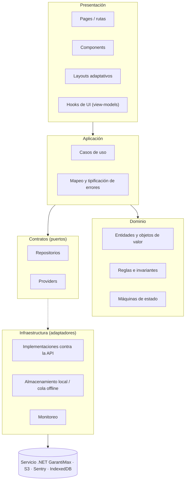

# Anexo A1 — Arquitectura propuesta

> Complemento técnico del PRD `manager/PRD.md` (Reconstrucción de GarantiMAX — Fase 1).
> Este anexo desarrolla el **cómo estructural**; el PRD define el **qué** y el **por qué**.
> Versión v0.1 — 25-08-2026.

---

## 1. Principio rector

Una sola frase gobierna todas las decisiones de este anexo:

> **Las dependencias apuntan hacia adentro.** La presentación conoce los casos de uso; los casos de uso conocen el dominio y los contratos; solo la infraestructura conoce el backend.

> ⚠️ **Corregido el 26-08-2026 por [ADR-011](A2-adrs.md#adr-011--backend-propio-en-net-se-abandona-supabase).** El backend deja de ser Supabase y pasa a un servicio .NET propio con base de datos propia. **La arquitectura de este anexo no cambia** — es la que hace que el cambio se pague solo en `infrastructure/`. Lo que cambia son los nombres de las implementaciones, la §9 (Realtime), la §13 (lock-in) y la §14 (migración). Donde el texto describe el **sistema actual** sigue siendo válido: es el punto de partida.

Y una sola prueba la verifica: si borrar la carpeta de infraestructura rompe la compilación del dominio, el diseño está mal.

Cada abstracción de este documento existe porque resuelve un problema concreto y comprobado en el sistema actual. Las que no se justifican, no están. El propio requerimiento lo exige: *"no crear abstracciones únicamente por seguir un patrón"*.

---

## 2. Las capas



| Capa | Responsabilidad | Prohibiciones |
| --- | --- | --- |
| **Presentación** | Renderizar, capturar interacción, componer, y sostener estado **estrictamente de UI** (qué modal está abierto, qué pestaña está activa, texto de un campo antes de enviarlo). | No consulta datos. No importa el cliente HTTP. No contiene reglas de negocio. No conoce en qué tabla ni en qué endpoint vive nada. |
| **Aplicación** | Coordinar una operación completa del usuario: orquestar dominio y repositorios, decidir si algo se ejecuta o se encola, y traducir fallos de infraestructura a errores tipificados. | No renderiza. No sabe de React. No conoce el proveedor de datos. |
| **Dominio** | Entidades, reglas, invariantes y transiciones de estado. Es la única fuente de verdad del negocio. | No conoce React, ni la API, ni la red, ni el almacenamiento. Sin dependencias externas: TypeScript puro. |
| **Contratos** | Interfaces que el dominio y la aplicación necesitan del mundo exterior. | No contienen implementación. |
| **Infraestructura** | Implementar los contratos contra proveedores reales. Es el **único** lugar donde aparece el cliente HTTP. | No contiene reglas de negocio. No decide flujo. |

### El caso de la regla que hoy vive en la UI

Ejemplo real del sistema actual: *"solo puede haber una visita en curso por asesor, y con 'Ver como' activo el aviso es de solo lectura para que un CM no borre el borrador del asesor"*. Hoy eso son 40 líneas dentro de `App.tsx`.

En el diseño nuevo se reparte así:

- **Dominio** — la invariante «un asesor tiene como máximo una visita en curso» y la transición `abierta → cerrada | descartada`.
- **Aplicación** — el caso de uso `DescartarVisitaEnCurso`, que verifica identidad efectiva vs. real, borra las tres capas (servidor, borrador local, marca de visita abierta) en orden y devuelve un resultado tipificado.
- **Presentación** — un aviso que muestra el estado y ofrece dos acciones.

Y una prueba unitaria, sin backend, que verifica que un usuario impersonado no puede descartar.

---

## 3. Organización: features sobre capas

La estructura es **híbrida** — features en el primer nivel, capas dentro de cada feature — porque es la que refleja cómo crece este producto: por capacidad de negocio, no por tipo de archivo.

Los features se nombran por **capacidad de dominio**, no por rol ni por pantalla. `visitas`, no `asesor`; `gastos`, no `midia-movil`.

### Estructura de directorios

```
src/
├─ app/                       # Composición de la aplicación
│  ├─ routes/                 # Definición de rutas y carga bajo demanda
│  ├─ providers/              # Composición de contextos (sesión, contexto de dispositivo, cliente de datos)
│  ├─ container.ts            # Ensamblado: qué implementación satisface cada contrato
│  └─ App.tsx                 # Sin lógica: monta providers y router
│
├─ domain/                    # Dominio compartido entre features. TypeScript puro.
│  ├─ identidad/              # Usuario, Rol, reglas de autorización
│  ├─ agenda/                 # Evento, día hábil, feriado
│  └─ shared/                 # Objetos de valor comunes (Dinero, RangoFechas, Ubicacion)
│
├─ features/
│  ├─ visitas/
│  │  ├─ domain/              # Visita, EstadoVisita, invariantes, transiciones
│  │  ├─ application/         # IniciarVisita, CerrarVisita, DescartarVisitaEnCurso…
│  │  ├─ ports/               # VisitaRepository (interfaz)
│  │  ├─ infrastructure/      # ApiVisitaRepository, VisitaRepositoryOffline
│  │  └─ ui/                  # Pantallas, componentes y hooks de UI del feature
│  ├─ tareas/                 # misma estructura
│  ├─ agenda/
│  ├─ bitacora/
│  ├─ gastos/
│  ├─ identidad/              # Sesión, perfil, roles
│  └─ referencia/             # Catálogos de solo lectura: salas, vendedores, clientes
│
├─ shared/
│  ├─ ui/                     # Sistema de componentes: botones, campos, listas, modales
│  ├─ layouts/                # Layout adaptativo, navegación, app shell
│  ├─ errors/                 # Jerarquía de errores y su traducción a mensajes
│  ├─ sync/                   # Cola offline, política de reintentos, idempotencia
│  └─ observability/          # Contrato de monitoreo y su implementación
│
├─ infrastructure/            # Infraestructura transversal, no de un feature
│  ├─ api/                    # Cliente HTTP, mapeadores, manejo de errores de la API
│  ├─ auth/                   # ApiAuthProvider
│  ├─ storage/                # ApiStorageProvider
│  ├─ realtime/               # (contrato definido; sin implementación en Fase 1)
│  └─ local/                  # IndexedDBLocalStore
│
└─ config/                    # Variables de entorno tipadas y validadas al arrancar
```

**Qué evita esta estructura.** No hay `utils/`, no hay `lib/`, no hay `helpers/`: son los depósitos de código sin dueño que el requerimiento pide evitar. Cada archivo pertenece a un feature o a una responsabilidad compartida nombrada. Si algo no encuentra dónde vivir, es señal de que falta un concepto de dominio, no una carpeta genérica.

**Cómo se importa.** Un feature puede importar de `domain/`, `shared/` y sus propias capas. **No puede importar de la `ui/` ni de la `infrastructure/` de otro feature**; si necesita algo de otro feature, lo obtiene por su `application/` o se promueve al dominio compartido. Se verifica con regla de linter.

---

## 4. Estrategia de frontend

### Responsabilidades

| Elemento | Responsabilidad |
| --- | --- |
| **Page** | Corresponde a una ruta. Compone componentes y conecta con hooks de UI. Sin lógica propia. |
| **Component** | Renderizado, interacción y estado visual. Recibe datos ya listos por props. |
| **Hook de UI (view-model)** | Puente entre la vista y los casos de uso: invoca el caso de uso, expone estado de carga y error ya traducidos, y adapta los datos al formato que la vista necesita. **Es la única capa de presentación que habla con la aplicación.** |
| **Layout** | Navegación, header, navegación inferior, app shell y distribución. Nada más. |
| **Provider** | Contexto transversal: sesión, contexto de dispositivo, cliente de datos, contenedor de dependencias. |

### Navegación, datos y estado — tres cosas distintas

El sistema actual las confunde en una sola: `useState` dentro de `App.tsx`. Se separan explícitamente:

| Responsabilidad | Herramienta propuesta | Por qué |
| --- | --- | --- |
| **Navegación** | **React Router** | Hoy no hay rutas: la navegación es `useState<Tab>`, sin URL, sin historial, sin enlaces compartibles y sin carga bajo demanda real por pantalla. Es el estándar del ecosistema y no impone estructura al resto. |
| **Datos de servidor** | **TanStack Query** | Resuelve exactamente el problema que hoy se repite 926 veces a mano: caché, deduplicación, invalidación, reintentos, estado de carga y error, y refetch al recuperar el foco. Se consume **desde los hooks de UI, invocando casos de uso** — nunca llamando al cliente HTTP directamente. |
| **Estado de UI transversal** | **Zustand**, solo donde haga falta | Para lo poco que debe ser global y no es dato de servidor: estado de la cola de sincronización, aviso de visita en curso, preferencias de vista. Se usa **solo cuando el estado cruza ramas del árbol**; para lo local, `useState` basta. |
| **Estado de UI local** | `useState` / `useReducer` | Modales, campos, pestañas. No sale del componente. |

**Regla que hace que TanStack Query no rompa la arquitectura:** la función que se le pasa siempre invoca un **caso de uso**, no un repositorio ni el SDK. La caché es un detalle de presentación; la operación es de aplicación.

### Layout adaptativo

Un único `DeviceContextProvider` resuelve, en un solo lugar: tamaño de pantalla, instalación como PWA, capacidades del dispositivo (cámara, geolocalización) y estado de conexión. Expone una decisión, no datos crudos.

Los componentes consumen esa decisión; **ninguno consulta `matchMedia` ni `navigator.standalone`**. Se verifica con regla de linter que prohíbe esos accesos fuera del provider.

La diferencia entre escritorio y móvil es de **navegación y densidad**: navegación lateral y listas densas en pantalla ancha; navegación inferior y una tarea por pantalla en estrecha. Mismas rutas, mismos casos de uso, mismo estado.

---

## 5. Capa de aplicación — casos de uso

Un caso de uso es una operación completa del asesor, con un nombre que un no-técnico entiende. Recibe un comando, devuelve un resultado tipificado y **nunca lanza excepciones de infraestructura hacia arriba**.

Los de Fase 1, por feature:

| Feature | Casos de uso |
| --- | --- |
| **Identidad** | `IniciarSesion`, `CerrarSesion`, `ResolverSesionActual`, `ResolverPermisos`, `MarcarBienvenidaVista` |
| **Mi Día** | `ObtenerMiDia`, `SincronizarMiDia` |
| **Visitas** | `IniciarVisita`, `GuardarBorradorVisita`, `CerrarVisita`, `DescartarVisitaEnCurso`, `ObtenerVisitaEnCurso`, `RegistrarLobby`, `RegistrarOtroEvento`, `ObtenerHistorialDeSala` |
| **Tareas** | `CrearTarea`, `RegistrarAvance`, `CompletarTarea`, `CalificarTarea`, `ListarMisTareas` |
| **Agenda** | `AgendarEvento`, `MarcarEventoRealizado`, `ReagendarEvento`, `CancelarEvento`, `ObtenerAgendaDelDia`, `ObtenerCumpleanosDelDia`, `RegistrarSaludo` |
| **Bitácora** | `RegistrarBitacoraDelDia`, `TranscribirDictado`, `MejorarRedaccion`, `VerificarCumplimientoDiario` |
| **Gastos** | `CapturarBoleta`, `LeerDatosDeBoleta`, `RegistrarGasto`, `AsignarGasto`, `FusionarGastos`, `ArmarRendicion`, `EnviarRendicion`, `AprobarRendicionJefe`, `AprobarRendicionOperaciones`, `RechazarRendicion`, `ReenviarRendicion`, `MarcarRendicionPagada` |
| **Sincronización** | `EncolarOperacion`, `DrenarCola`, `ReintentarOperacion`, `ObtenerEstadoDeSincronizacion` |

Los casos de uso de aprobación de rendición existen en el catálogo porque el flujo los necesita, pero su ejecución la realizan GC/GO/AO — se construyen en Fase 1 solo hasta donde el asesor los observa (estado de su rendición).

---

## 6. Capa de dominio

### Entidades principales de Fase 1

| Entidad | Invariantes y transiciones |
| --- | --- |
| **Usuario / Asesor** | Un usuario tiene uno o más roles, que llegan en el token de la API. Sus permisos son los de sus roles, resueltos **una sola vez** al abrir sesión. Un usuario sin perfil no puede operar. |
| **Visita** | `planificada → en_curso → cerrada` \| `descartada`. Un asesor tiene como máximo **una** visita en curso. Una visita en curso exige sala, hora de inicio y ubicación. No se cierra sin el registro de lo observado. |
| **Lobby / Otro evento** | Comparte el ciclo de la visita pero sin exigir sala. |
| **Tarea** | `abierta → en_progreso → completada` \| `cancelada`. Una tarea completada admite calificación. Los avances son inmutables una vez registrados. |
| **Evento de agenda** | `agendado → realizado` \| `reagendado` \| `cancelado`. Un evento no se agenda en día inhábil salvo marca explícita. |
| **Bitácora** | Una por asesor y día. Se considera cumplida cuando tiene contenido en los campos obligatorios. El incumplimiento se evalúa al cierre del día hábil. |
| **Gasto** | Pertenece a un asesor y tiene categoría y asignación. Un gasto ya incluido en una rendición enviada no se modifica. |
| **Rendición** | `borrador → enviada → aprobada_jefe → aprobada_ops → pagada`, con `rechazada` como salida desde cualquier estado de aprobación y reentrada por `reenviada`. El asesor solo transiciona `borrador → enviada` y `rechazada → reenviada`. |
| **Operación encolada** | `pendiente → sincronizando → completada` \| `fallida`. Lleva identificador de idempotencia. Una operación fallida se reintenta con espera creciente hasta un tope, luego exige acción del usuario. |

### Entidades de referencia (solo lectura en Fase 1)

`Sala`, `VendedorDeSala`, `Cliente`, `Feriado`. Se modelan como objetos de valor de lectura; la Fase 1 no define su ciclo de vida porque no los gestiona.

---

## 7. Estrategia de repositorios

Un repositorio por **agregado del dominio**, no por tabla. `VisitaRepository` puede tocar `visitas`, `visitas_abiertas` y `visitas_en_curso`: eso es un detalle de persistencia que el dominio no debe conocer.

```
features/visitas/ports/VisitaRepository.ts        ← interfaz, sin implementación
features/visitas/infrastructure/
  ├─ ApiVisitaRepository.ts                       ← implementación actual
  └─ VisitaRepositoryOffline.ts                   ← decorador: encola si no hay señal
```

Repositorios de Fase 1: `UsuarioRepository`, `VisitaRepository`, `TareaRepository`, `AgendaRepository`, `BitacoraRepository`, `GastoRepository`, `RendicionRepository`, `NotificacionRepository`, `ReferenciaRepository`.

**Reglas:**

1. La interfaz habla en lenguaje de dominio (`obtenerVisitaEnCursoDe(asesor)`), nunca en lenguaje de proveedor (`selectVisitasWhereEstado`).
2. El mapeo entre fila de base de datos y entidad ocurre **dentro** de la implementación. El dominio nunca ve una fila.
3. Los errores del proveedor se traducen a errores de infraestructura tipificados antes de salir.
4. El soporte offline es un **decorador** sobre el repositorio, no una rama `if (online)` dentro de él.

**Lo que NO se abstrae, y por qué.** No se define un contrato para los endpoints de lógica propia del producto (lectura de boleta, mejora de redacción): son negocio nuestro, no un proveedor sustituible. Se invocan desde infraestructura, pero sin interfaz intermedia — una abstracción ahí no resolvería ningún problema real.

---

## 8. Infraestructura y providers

| Contrato | Implementación Fase 1 | Justificación de la abstracción |
| --- | --- | --- |
| `AuthProvider` | `ApiAuthProvider` | Habla con `Services/Authentication`, que ya existe. El token es lo único que el frontend persiste. |
| `StorageProvider` | `ApiStorageProvider` | Evidencia y boletas, contra el endpoint de archivos del servicio (S3 por detrás). |
| `LocalStore` | `IndexedDBLocalStore` | El almacenamiento local hoy es una implementación a mano (`idbStore.ts`). Abstraerlo permite probar la cola offline sin navegador. |
| `MonitoringProvider` | `SentryMonitoringProvider` | Evita que el SDK de monitoreo se esparza por el código, como ya ocurre con `reportarError`. |
| `RealtimeProvider` | **Ninguna en Fase 1** | Contrato definido, implementación diferida. Ver §9. |
| `ClockProvider` | Reloj del sistema | Existe por una razón concreta: las reglas de bitácora diaria, días hábiles y vencimientos dependen del tiempo, y no se pueden probar sin controlarlo. |

**Composición.** Un único punto (`app/container.ts`) decide qué implementación satisface cada contrato. Cambiar de proveedor es cambiar una línea ahí y agregar una implementación — el resto del código no se entera. Eso es lo que hoy costaría 152 archivos.

---

## 9. Estrategia de Realtime

**Mapa de uso real en el sistema actual — 9 archivos, ninguno del asesor:**

| Módulo | Archivos | Qué escucha | ¿Necesita Realtime? |
| --- | --- | --- | --- |
| War Room | `useWarRoomEventos.ts`, `visitasRealtime.ts`, `useVisitasEnCurso.ts`, `WarRoomView.tsx` | Visitas en curso y eventos, para un tablero en vivo proyectado en pantalla | **Sí.** Es un tablero de monitoreo continuo sin interacción del usuario. |
| Post-Venta | `casosDb.ts`, `ChatWhatsapp.tsx` | Cambios en casos y mensajes entrantes de WhatsApp | **Sí** para el chat (conversación en curso). A evaluar para los casos. |
| Call Center | `telefonoStore.ts`, `TelefonoKpis.tsx`, `TelefonoPanel.tsx` | Estado de llamadas y KPIs del panel telefónico | **Sí.** Estado de llamada en vivo. |

**Decisión: en Fase 1 no se implementa.** Se define el contrato `RealtimeProvider` como decisión arquitectónica documentada (ADR-005) y se deja sin implementación. Construirlo ahora sería exactamente la abstracción prematura que el requerimiento prohíbe: no hay un solo consumidor en el alcance.

Lo que la Fase 1 **sí** hace y a menudo se confunde con Realtime: refrescar al recuperar el foco de la aplicación y al reconectar. Eso lo resuelve la capa de datos de servidor, no una suscripción.

**Regla permanente:** la UI nunca conoce `postgres_changes`, `.channel()` ni `broadcast`. Cuando llegue la implementación, entrará por el contrato.

---

## 10. Manejo de errores

Jerarquía tipificada, con traducción en un solo sentido — de adentro hacia afuera:

| Categoría | Origen | Qué ve el asesor |
| --- | --- | --- |
| `DomainError` | Una invariante del negocio se violó | El motivo real, en su idioma: *"Ya tienes una visita en curso en Sala Norte."* |
| `ValidationError` | Un dato de entrada no es válido | El campo y qué se espera. |
| `AuthenticationError` | Sesión inválida o expirada | Invitación a iniciar sesión de nuevo, conservando lo que estaba haciendo. |
| `AuthorizationError` | Sin permiso para la operación | Mensaje neutro, sin revelar qué existe detrás. |
| `NetworkError` | Sin conexión o tiempo agotado | *"Sin señal. Lo guardamos y lo enviamos cuando vuelvas a tener conexión."* — y se encola. |
| `ProviderError` | Fallo del proveedor externo | Mensaje genérico de reintento. **Nunca** el mensaje original. |
| `InfrastructureError` | Fallo inesperado de persistencia | Mensaje genérico; se reporta a monitoreo con contexto completo. |

**Reglas:**

1. La infraestructura **traduce**: ningún error HTTP —ni un 401, ni un 500, ni una caída de red— cruza hacia la aplicación con su forma original.
2. La aplicación **decide**: un `NetworkError` en una operación encolable no es un error para el usuario, es un encolamiento.
3. La presentación **muestra**: nunca inspecciona códigos de proveedor para decidir qué decir.
4. Ningún mensaje al usuario contiene nombres de tabla, SQL, rutas internas ni datos de otros usuarios.

---

## 11. Logging y observabilidad

| Qué | Dónde | Contenido |
| --- | --- | --- |
| **Errores no controlados** | Plataforma de monitoreo (Sentry) | Traza, versión, ruta, categoría de error, identificador de usuario. **Sin** datos personales ni contenido de bitácoras. |
| **Auditoría de negocio** | Base de datos | Apertura y cierre de visita, transiciones de rendición, envío de bitácora. Actor, momento, resultado. |
| **Eventos de producto** | Capa de eventos (§11 del PRD) | Los eventos de BI, emitidos desde los casos de uso — nunca desde la UI. |
| **Sincronización** | Local + monitoreo | Operaciones encoladas, drenajes, reintentos y fallos definitivos. Es la métrica de salud del trabajo offline. |
| **Registro de desarrollo** | Consola, solo en desarrollo | Se elimina en producción por configuración de compilación. |

**Operaciones que exigen trazabilidad obligatoria:** todo lo que tenga consecuencia sobre dinero (rendiciones), sobre cumplimiento (bitácoras) o sobre la evidencia de que el asesor estuvo donde dice (check-in de visita).

**Regla de logging seguro:** nunca se registra contenido de bitácoras, imágenes de boletas, ubicaciones exactas ni datos de contacto. Solo identificadores.

---

## 12. Estrategia de pruebas

| Nivel | Qué cubre | Con qué | Sin backend |
| --- | --- | --- | --- |
| **Dominio** | Invariantes y transiciones de estado. Toda regla identificada tiene su prueba. | Vitest | Sí — no hay nada que simular |
| **Casos de uso** | Orquestación, decisión de encolar, traducción de errores | Vitest + repositorios falsos en memoria | Sí |
| **Repositorios** | Mapeo fila↔entidad y traducción de errores del proveedor | Vitest + cliente simulado | Sí |
| **Componentes** | Renderizado e interacción con casos de uso simulados | Vitest + Testing Library | Sí |
| **Integración** | Repositorios contra una base real de pruebas | Vitest + instancia dedicada | No — es el punto |
| **Extremo a extremo** | Flujos críticos completos | Playwright | No |

**Flujos críticos con pruebas E2E obligatorias (RNF-05):**

1. Inicio de sesión y resolución de permisos.
2. Visita completa: check-in → captura → evidencia → cierre.
3. Visita en curso: intento de abrir una segunda y descarte de la primera.
4. Boleta sin señal: captura offline → reconexión → sincronización sin duplicado.
5. Bitácora diaria: registro con dictado y mejora de redacción.

**Lo que hace posible todo esto** es la inversión de dependencias: si el caso de uso recibe sus repositorios, se prueba con dobles. Hoy, con la query dentro del componente, probar la regla exige renderizar y simular la red.

**Línea base:** 65 archivos de prueba sobre 455 de código. La meta de Fase 1 no es un porcentaje de cobertura, sino la garantía de RNF-04: **cada invariante del dominio, una prueba**.

---

## 13. Matriz de proveedores y vendor lock-in

> **Esta matriz se cobró.** Se escribió para dimensionar una salida *hipotética* de Supabase. La salida ocurrió (ADR-011), y sus predicciones se pueden contrastar con lo que realmente costó: acertó en que el dominio y los casos de uso no se tocan, en que la autorización es la parte cara, y en que las funciones de servidor eran la dependencia más difícil de romper. La tabla queda reescrita con el proveedor nuevo.

| Capacidad | Proveedor actual | Abstracción | Riesgo de lock-in hoy | Impacto de un reemplazo futuro |
| --- | --- | --- | --- | --- |
| **Base de datos** | PostgreSQL propio, tras el servicio .NET | Repositorios por agregado | **Bajo** — el frontend no conoce tablas | **Bajo.** El frontend ya no depende del motor; cambiarlo es asunto del servicio. |
| **Autenticación** | `Services/Authentication` (JWT) | `AuthProvider` | **Bajo** — una implementación, un token | **Bajo.** Una implementación nueva. |
| **Almacenamiento de archivos** | Endpoint del servicio, S3 por detrás | `StorageProvider` | **Bajo** — pocos puntos de uso | **Bajo.** Una implementación nueva. |
| **Realtime** | Ninguno | `RealtimeProvider` (puerto, sin implementación) | **Ninguno** — no se usa en Fase 1 | **Bajo.** No hay nada que reemplazar. Para War Room, Post-Venta y Call Center se implementaría contra el puerto. |
| **Funciones de servidor** | Endpoints del propio servicio | Sin abstracción intermedia (decisión deliberada) | **Ninguno** — el código es nuestro y corre en nuestra infraestructura | **N/A.** Este era el lock-in principal y desapareció: la lógica ya no vive en el entorno de un proveedor. |
| **Hospedaje** | Vercel | Ninguna | **Bajo** — es una SPA estática con reescrituras | **Bajo.** |
| **Monitoreo de errores** | Sentry | `MonitoringProvider` | **Bajo** | **Bajo.** |
| **Almacenamiento local** | IndexedDB (implementación propia) | `LocalStore` | **Bajo** — API estándar del navegador | **Bajo.** La abstracción existe para poder probar, no para cambiar de proveedor. |
| **IA (lectura de boletas, redacción)** | Anthropic / Groq, dentro de los endpoints del servicio | Ninguna desde el cliente — el cliente solo invoca el endpoint | **Bajo desde el cliente**, medio dentro del servicio | **Bajo para la aplicación.** El cambio ocurre dentro del endpoint. |

**Dependencia crítica identificada, y cobrada.** La v0.1 de este anexo señaló las **Edge Functions** como el mayor costo de una salida futura: lógica propia corriendo en el entorno del proveedor, que ninguna abstracción del cliente protege. Fue exactamente así. Rehacer las siete que la Fase 1 consumía es el mayor aumento de alcance de ADR-011. Las 39 restantes pertenecen a módulos de otros roles, siguen corriendo en Supabase, y cada fase posterior tendrá que portar las suyas.

---

## 14. Estrategia de migración

| Categoría | Qué |
| --- | --- |
| **Se conserva** | Nada de la infraestructura anterior. El esquema, las funciones y las políticas RLS del sistema actual se conservan como **documentación de las reglas** —es la mejor fuente que existe— no como código. Los datos no se migran: la base nueva arranca vacía. |
| **Se reimplementa** | Toda la capa de aplicación de los siete módulos de Fase 1: Mi Día, visitas, lobbies, tareas, agenda, saludos, bitácora y gastos. Sin copiar código: se extraen las reglas y se reconstruye. |
| **Se rediseña** | La navegación (de `useState<Tab>` a rutas). El acceso a datos (de query en vista a repositorio). La experiencia web/móvil (de dos apps a layout adaptativo). La detección de PWA (de distribuida a centralizada). El manejo de errores (de improvisado a tipificado). El soporte offline (de parche distribuido a decisión del caso de uso). |
| **Se elimina — deuda que NO se traslada** | El tier legacy `CM/GTE/FARMER`. Las carpetas vacías `farmer/` y `bitacora/`. `MiDiaMovilPreview` y el parámetro `?midia`. El `if (isPWA)` distribuido. `IncentivosView` incrustado dentro de `SalasView` (se resuelve en Fase 2). Las 443 queries en vistas. El drenaje de cola offline desde `App.tsx`. |
| **Datos a migrar** | **Ninguno.** Ambos sistemas operan sobre la misma base. |
| **Integraciones que se mantienen** | Sentry. Los proveedores de IA se conservan, movidos a endpoints del servicio propio. |
| **Qué se simplifica** | La resolución de permisos: los roles del token, sin tier paralelo y sin matriz propia. La entrada a la aplicación: una sola, adaptativa. El acceso a datos: un patrón, no 152 variantes. La seguridad: desaparece la clave pública en el navegador. |

### Riesgos de migración

1. **Reglas invisibles.** El mayor riesgo no es técnico: es que una regla que solo existe dentro de un `useEffect` no se descubra hasta que un asesor reporte que "antes hacía otra cosa". La extracción sistemática de reglas es un paso obligatorio y con entregable propio.
2. **Convivencia sobre la misma base.** Dos aplicaciones escribiendo las mismas tablas. Las invariantes críticas deben estar garantizadas en la base, no solo en el código nuevo.
3. **Cambios de esquema.** Cualquier cambio durante Fase 1 debe ser aditivo: el sistema actual sigue en producción para los demás roles.
4. **El corte único.** Concentra el riesgo en un día. Se mitiga con paridad verificada, piloto previo y reversión probada — ver §13 del PRD.

---

## 15. Criterios de aceptación de la Fase 1

**Arquitectónicos** — verificables automáticamente:

1. Cero archivos de presentación importan el cliente HTTP o llaman a `fetch`. Regla de linter que falla la compilación.
2. Cero archivos fuera de `infrastructure/api/` hablan con la red.
3. El dominio compila sin ninguna dependencia externa.
4. Ningún feature importa la `ui/` o la `infrastructure/` de otro feature.
5. Ningún componente accede a `matchMedia` ni a `navigator.standalone`.
6. Las pruebas de dominio y casos de uso corren sin red ni servicio levantado.

**Funcionales:**

7. Cada funcionalidad de terreno del sistema actual tiene equivalente verificado en la lista de paridad, firmada antes del corte.
8. Cada invariante del dominio identificada tiene al menos una prueba unitaria.
9. Los cinco flujos críticos tienen prueba de extremo a extremo en verde.
10. Las pruebas de corte de red no pierden ninguna operación ni generan duplicados.

**Operativos:**

11. Revisión de las reglas de autorización de los endpoints de Fase 1, firmada por TI, con las políticas RLS del sistema actual como especificación.
12. Procedimiento de reversión documentado y probado en un ensayo real.
13. Piloto con un grupo reducido de asesores completado, con sus hallazgos resueltos o aceptados explícitamente.

---

## 16. Recomendaciones para fases posteriores

- **Fase 2 cierra el doble acceso.** No se considera terminada hasta que el asesor deje de necesitar el sistema actual. Es su criterio de aceptación principal.
- **Extraer Incentivos como feature propio.** Hoy vive incrustado dentro de `SalasView` y se monta dos veces. Es un dominio con reglas propias.
- **Facturación entra en dos piezas.** La consulta del asesor (Fase 2) y los importadores de Excel de CM/GTE (Fase 3 o posterior): son responsabilidades distintas que hoy comparten módulo.
- **Realtime entra con War Room.** Es el primer consumidor real. Ahí se implementa el contrato, y ahí se decide si Post-Venta y Call Center comparten implementación o necesitan otra.
- **Eliminar el tier legacy cuando el sistema actual se apague.** Mientras conviva, quitarlo obliga a tocar código fuera de alcance.
- **Las 39 Edge Functions restantes merecen su propio análisis.** La Fase 1 rehace las 7 que consumía; las demás pertenecen a módulos de otros roles y siguen corriendo en Supabase. Cada fase posterior tendrá que portar las suyas, y dimensionarlas es un proyecto propio.
- **No adelantar dominios.** `customers`, `contracts`, `documents` y `notifications` aparecen en el requerimiento como ejemplos de organización, no como encargo. Se crean cuando llegue el módulo que los necesite.
