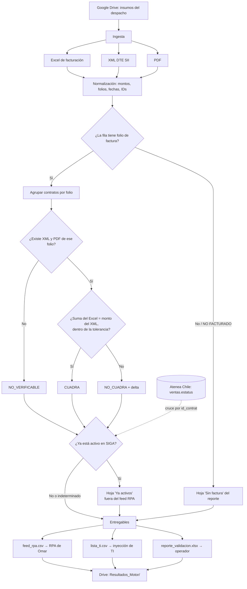
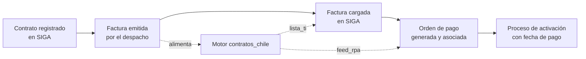

# PRD - Activación de Contratos Chile

| **Campo** | **Detalle** |
| --- | --- |
| **Proyecto** | Activación de Contratos Chile — motor de datos `contratos_chile` |
| **Área / empresa** | Garantiplus Chile |
| **Versión** | v1.3 |
| **Fecha** | 2026-08-04 |
| **Autores** | Gustavo Iván Carreto Abascal (datos / automatización) |
| **Revisión / liderazgo** | Aldo Álvarez |
| **Tipo de proyecto** | Automatización |

## 1. Resumen ejecutivo

En México y Colombia la obligación sobre un contrato de garantía existe **solo hasta que el contrato está pagado**, por lo que activarlo en SIGA es lo que le da respaldo legal. En Chile la responsabilidad legal existe **desde que el cliente adquiere la garantía**, sin importar si el distribuidor pagó. Por eso Chile nunca necesitó activar contratos, y hoy tiene alrededor de 60 mil contratos sin activar desde 2022.

Eso dejó a la operación chilena sin dos capacidades que el resto de los países sí tiene. La primera es **control de cartera**: sin la relación contrato↔factura conciliada no se sabe qué distribuidor debe cuánto ni desde cuándo. La segunda es el **seguimiento de averías sobre contratos no pagados**: en Chile la avería se paga igual por obligación legal, pero hoy no queda registro de sobre qué contratos no activos se está pagando, así que nadie va a cobrarle al distribuidor.

Activar un contrato en SIGA exige cuatro pasos en orden —registro, factura cargada, orden de pago asociada, proceso de activación— y Chile solo cumple el primero. El cuello de botella es que la orden de pago debe corresponder **1:1** con la factura para cargarse de forma automática, pero se genera a mano, contrato por contrato, en un buscador de SIGA. Con 600–800 ventas al mes y facturas consolidadas que agrupan decenas de contratos, hacerlo manualmente es inviable. El work-around vigente es un RPA que carga órdenes de pago una por una mientras TI inyecta las facturas directamente en base de datos.

**El MVP de este PRD es el motor de datos que alimenta ese work-around**: consolida y valida los insumos del despacho contable alojados en Google Drive, y produce tres entregables confiables —el listado para el RPA, el listado para la inyección de TI y un reporte de conciliación—. El motor **no activa contratos, no ejecuta el RPA y no inyecta nada**: solo garantiza que los datos con los que operan Omar y TI estén completos y cuadrados. La conciliación de pagos y la generación del set de activación quedan para una fase posterior.

El resultado esperado es habilitar la regularización histórica (~15 días de RPA nocturno sobre el acervo desde 2022) y dejar instalado el proceso mensual recurrente, con la relación contrato↔factura auditable como subproducto que alimenta el control de cartera y el tablero de averías.

**Insumos del despacho en Drive** → **Ingesta y normalización** → **Conciliación Excel↔XML por factura** → **Tres entregables validados** → **RPA de órdenes de pago (Omar) e inyección de facturas (TI)**

## 2. Contexto y problema

**Cómo funciona hoy.** El contrato se registra en SIGA sin problema —Chile ya lo hace—. A partir de ahí el proceso se rompe. La factura no se emite automáticamente: hay que pedirle al despacho contable que la genere, y en el **85–90%** de los casos se emite **consolidada a fin de mes**, agrupando muchos contratos en un solo folio. Existe además facturación manual bajo pedido de ciertos clientes, que agrupan contratos de varios meses en una factura. La pasarela de pago que se usa en otros países no aplica en Chile: si Garantiplus recauda directamente, empieza a operar como aseguradora, lo que tiene implicaciones normativas.

**El dolor concreto.** Para cargar una factura automáticamente en SIGA, la orden de pago debe corresponder 1:1 con ella. Pero la orden de pago se genera manualmente, contrato por contrato, buscando cada uno en un buscador. Para 600–800 ventas mensuales por país, con una persona y unos pocos días disponibles, no hay manera. El resultado es un doble work-around: el RPA de Omar carga órdenes de pago individuales, y como no coinciden 1:1 con las facturas consolidadas, TI inyecta las facturas directamente en la base de datos, saltándose la validación del sistema.

**Por qué ahora.** Dos drivers concretos. El de cartera: sin la conciliación no hay visibilidad de cuánto debe cada distribuidor ni desde cuándo, y las facturas chilenas tienen crédito a 30 días. El de averías: David solicitó poder identificar las averías pagadas sobre contratos no activos para que el vendedor gestione el cobro. A eso se suma el volumen acumulado —~60 mil contratos desde 2022— que solo crece.

**Distinción crítica para el equipo de desarrollo.** El *filtro de averías* de este contexto **no es un bloqueo**. El filtro de aprobación ya existe en SIGA (una avería sobre contrato no activo escala a aprobación). Lo que se decidió es lo contrario: **dejar pasar las averías** —en Chile hay que pagarlas de todas formas— e **identificarlas** en un tablero cliente por cliente para que ventas gestione el cobro. El motor de este PRD habilita esa identificación al producir la relación contrato↔factura; el tablero es una fase posterior.

## 3. Objetivo del producto

Construir un motor de datos headless, orquestable por n8n, que a partir de los insumos del despacho contable alojados en Google Drive produzca los entregables que permiten regularizar y luego mantener la activación de contratos en Chile: el listado para el RPA de órdenes de pago, el listado para la inyección de facturas por TI, y un reporte de validación que garantice que los datos cuadran **antes** de operar sobre ellos.

El mismo motor debe servir para los dos modos de uso: la **regularización histórica** de los años ya facturados, y el **proceso mensual recurrente** que se instala después (se factura → se valida → se carga → se activa). La mejora medible es la cobertura de activación: pasar de un acervo mayoritariamente inactivo a tener activados los contratos con factura emitida y pagada.

### 3.1 Estrategia de implementación por fases

| **Fase** | **Nombre** | **Descripción** |
| --- | --- | --- |
| Fase 1 | Motor de validación **(MVP de este PRD)** | Ingesta de Excel, XML y PDF; conciliación Excel↔XML a nivel factura; generación de `feed_rpa`, `lista_ti` y `reporte_validacion`; publicación en Drive. Cubre 2025 y 2026. |
| Fase 2 | Conciliación de pagos y activación | Generación del set de contratos a activar con su fecha de pago derivada por regla (ver §3.2). Primero 2024 → hoy, luego hacia atrás hasta 2022. |
| Fase 3 | Orquestación y tableros | Automatización mensual end-to-end en n8n; tableros de cartera vencida y de averías sobre contratos no activos. |

**La Fase 1 es el MVP de este PRD.** Las Fases 2 y 3 se documentan para dar contexto de dirección, pero su alcance detallado se define en sus propios PRD.

**Prioridad de regularización acordada:** activar de **2024 a la fecha** primero, porque resuelve la mayor parte del problema, y después pedir el histórico hacia atrás hasta 2022.

### 3.2 Criterio de pago y fecha de activación

No existe registro de fechas de pago: se verificó sobre los 23.556 contratos entregados y la columna `F. Pago` está poblada en **cero** de ellos. La operación resolvió el vacío con dos reglas:

1. **El pago se acredita por presencia, no por fecha.** Un contrato que aparece en el listado de facturación con folio válido se considera pagado. No se requiere confirmación adicional de finanzas para el histórico.
2. **La fecha de pago se deriva por regla:** `fecha de emisión de la factura + 30 días`, tomada del campo `FchEmis` del documento electrónico. Cuando el contrato no tenga factura, la base es la fecha de alta del contrato. El plazo de 30 días corresponde a la política de crédito vigente en Chile.

**A partir de agosto de 2026 el despacho comienza a registrar las fechas de pago reales.** La regla de los 30 días es, por tanto, el mecanismo para regularizar el histórico; el proceso mensual usará la fecha real en cuanto esté disponible. El motor debe distinguir ambos casos: una fecha derivada por regla y una fecha confirmada no valen lo mismo, y el entregable debe decir cuál es cuál.

## 4. Usuarios y actores

| **Usuario / Actor** | **Rol en el proceso** |
| --- | --- |
| Despacho contable (Chile) | Emite las facturas y deposita mensualmente los Excel de facturación, XML y PDF en la carpeta compartida de Drive. Es el origen de todos los insumos. |
| Andrés Merino Sotomayor | Propietario de la carpeta de Drive. Gestiona al despacho contable, mantiene la relación contrato↔factura y lleva el control de pagos por número de factura. |
| Operador del motor | Ejecuta el motor, revisa el reporte de validación y **decide qué contratos se mandan al RPA**. El motor no filtra solo. |
| Omar | Opera el RPA que carga las órdenes de pago en SIGA, una por una. Consume `feed_rpa.csv`. |
| Equipo de TI | Inyecta las facturas directamente en la base de datos de SIGA. Consume `lista_ti.csv` junto con los XML y PDF. |
| David Simancas Estrada | Solicitante del seguimiento de averías sobre contratos no activos. Hoy aprueba esas averías tras la redirección del country manager. |
| Vendedores | Gestionan el cobro con el distribuidor a partir de la información de contratos no activos con avería pagada. |
| Finanzas | Confirma que la factura está pagada y en qué fecha. Insumo indispensable para la activación (Fase 2). |
| Dirección / liderazgo | Consume la visibilidad de cartera vencida por distribuidor que habilita el proceso. |

## 5. Alcance MVP y funcionalidades

| **Funcionalidad** | **Descripción** |
| --- | --- |
| Ingesta de Excel de facturación | Lee los Excel del despacho (`FACTURACION AÑO 2025.xlsx`, `FACTURACION 2026.xlsx`). Cada fila es un contrato. El mapeo de columnas es **por nombre, no por posición**, y tolera columnas ausentes: el esquema varía entre años (el archivo 2026 trae `Impuestos`, `Total` y `Garant. Fabrica`, que 2025 no tiene). |
| Ingesta y parseo de XML (DTE SII) | Parsea los documentos tributarios electrónicos `F{folio}T{tipo}.xml` para extraer folio, tipo de DTE, fecha de emisión, RUT del receptor y montos (neto, IVA, total). Se usa exclusivamente para validar **a nivel factura**. |
| Inventario de PDF | Registra qué folios tienen PDF disponible. El PDF es evidencia y respaldo para la inyección de TI; no se extrae texto de él. |
| Normalización | Estandariza montos (formato chileno `$1.234.567` → entero), folios, fechas e identificadores de contrato. Marca las filas vacías y las marcadas como `NO FACTURADO`. |
| Conciliación Excel↔XML por factura | Compara la suma de los montos de los contratos que el Excel asigna a un folio contra el monto de ese folio en el XML, con una tolerancia de redondeo configurable. |
| Clasificación en tres estados | Cada factura queda en `CUADRA` (folio existe y montos coinciden), `NO_CUADRA` (folio existe, montos no) o `NO_VERIFICABLE` (no hay XML/PDF, o el folio no está en el Excel). |
| Cruce contra el estado de activación en SIGA | Consulta la vista de ventas de Chile (`ventas` en Atenea Chile) para determinar el estado de activación de cada contrato, y **excluye del feed del RPA los que ya están activos**. Evita generar órdenes de pago duplicadas sobre el acervo histórico. El cruce se hace por `id_contrato`, que además **valida empíricamente** que el `ID` del Excel es el identificador de SIGA. |
| Generación de `feed_rpa.csv` | Un renglón por contrato con factura emitida, con los datos que el RPA necesita para buscarlo en SIGA más los de trazabilidad, y su estado de validación. |
| Generación de `lista_ti.csv` | Un renglón por factura, agrupando sus contratos, con los datos del XML y las referencias a los archivos XML y PDF. |
| Generación de `reporte_validacion.xlsx` | Libro de control con seis hojas: Resumen, No cuadra, No verificable, Sin factura, Excluidos y **Ya activos**. |
| Publicación de resultados | Sube los tres entregables a una subcarpeta `Resultados_Motor/` en Drive, con fecha en el nombre. Nunca escribe sobre las carpetas de insumos. |
| Ejecución headless | Corre sin sesión interactiva, con logging estructurado y código de salida distinto de cero ante fallo, para que n8n pueda detectarlo. |

**Principio rector del MVP: reportar, no decidir.** El motor clasifica y expone; **no filtra automáticamente qué va al RPA**. Los casos problemáticos —sin factura, montos que no cuadran, sin XML— se reportan con su motivo y nunca se descartan en silencio. La decisión de qué se opera es del operador, porque una exclusión automática equivocada sobre 60 mil contratos es mucho más costosa que una revisión manual.

## 6. Fuera de alcance

- **Activación de contratos en SIGA**: el motor produce insumos; la activación es un proceso de SIGA que se ejecuta con la fecha de pago confirmada por finanzas.
- **Ejecución del RPA de órdenes de pago**: lo opera Omar. El motor solo lo alimenta.
- **Inyección de facturas en base de datos**: la hace TI. El motor solo produce el listado.
- **Conciliación de pagos y derivación de la fecha de pago**: queda para la Fase 2. La carpeta "Fechas de Pago" está vacía a la fecha de este PRD.
- **Generación del set de contratos a activar**: depende de la conciliación de pagos, por lo tanto Fase 2.
- **Orquestación mensual automatizada en n8n**: Fase 3. El MVP se diseña compatible (headless, exit code, log limpio), pero corre invocado manualmente.
- **Tableros de cartera vencida y de averías sobre contratos no activos**: Fase 3. Requieren que la relación contrato↔factura ya esté establecida y validada, que es justo lo que produce este MVP.
- **Validación contrato por contrato contra el XML**: técnicamente imposible. El detalle del XML no contiene los números de contrato (ver §10), así que la validación solo puede ser agregada por factura.
- **Extracción de contratos desde las facturas con IA**: era el enfoque original, descartado al confirmarse que el XML no contiene esa información. El Excel es la única fuente de la relación.

## 7. Flujos principales

### 7.1 Flujo del motor

El flujo tiene una asimetría deliberada: **todo lo que no se puede verificar sigue avanzando hacia los entregables, marcado**. No hay ninguna rama que termine en un descarte silencioso. Esto es consecuencia directa del volumen: sobre 60 mil contratos, un filtro automático mal calibrado produce un error masivo e invisible, mientras que un caso marcado de más solo cuesta una revisión.

La conciliación ocurre en el nodo de agrupación por folio, no antes. Es el punto donde el diseño reconoce que el Excel y el XML viven en granularidades distintas —el Excel es por contrato, el XML es por factura— y que la única granularidad común es la factura.

El cruce contra el estado de activación es la **única exclusión real** del flujo, y aun así respeta el principio: un contrato ya activo no entra al feed del RPA, pero **sí aparece en el reporte**, en su propia hoja y con su conteo. La rama de indeterminación es deliberada — si el cruce no puede resolver el estado de un contrato, este **avanza al feed marcado** en lugar de excluirse. Excluir por defecto ante la duda dejaría contratos sin activar de forma silenciosa, que es precisamente el problema que el proyecto vino a resolver.

### 7.2 Flujo del proceso completo de activación (contexto)

Este segundo diagrama existe para ubicar el alcance: **el motor toca dos de los cinco pasos, y solo como proveedor de datos**. El paso 1 ya funciona, el paso 5 depende de finanzas, y los pasos 3 y 4 los ejecutan TI y Omar con los entregables del motor. Entender esto evita que el equipo de desarrollo asuma responsabilidad sobre resultados que el motor no controla.

## 8. Requerimientos funcionales

| **ID** | **Requerimiento** | **Descripción** |
| --- | --- | --- |
| RF-01 | Ingesta multi-año de Excel | Leer los Excel de facturación de los años configurados, mapeando columnas **por nombre** y tolerando las que falten o sobren respecto de otros años. |
| RF-02 | Normalización de montos | Convertir montos en formato chileno (`$1.234.567`, con `$` y punto como separador de miles) a entero, sin pérdida ni error de escala. |
| RF-03 | Detección de contratos sin factura | Identificar como "sin factura" toda fila cuyo `FACTURA N°` esté vacío o diga `NO FACTURADO`, y llevarla a la hoja correspondiente del reporte en lugar de descartarla. |
| RF-04 | Parseo de DTE del SII | Extraer de cada XML: folio, tipo de DTE, fecha de emisión, RUT del receptor, razón social y montos neto, IVA y total. |
| RF-05 | Inventario de documentos | Determinar, para cada folio, si existe su XML y si existe su PDF, a partir de la convención `F{folio}T{tipo}.{ext}`. |
| RF-06 | Agrupación por folio | Agrupar los contratos del Excel por folio de factura y calcular la suma de sus montos y la cantidad de contratos. |
| RF-07 | Conciliación de montos | Comparar la suma agrupada contra el monto del XML del mismo folio, aplicando una tolerancia de redondeo configurable. |
| RF-08 | Clasificación en tres estados | Asignar a **cada** factura exactamente uno de: `CUADRA`, `NO_CUADRA`, `NO_VERIFICABLE`, junto con el motivo legible de la clasificación. |
| RF-09 | Reporte de documentos huérfanos | Reportar los XML o PDF cuyo folio no tiene correspondencia en ningún Excel, como posible factura no registrada en la relación. |
| RF-10 | Generación de `feed_rpa.csv` | Emitir un renglón por contrato con factura emitida, con: identificador de contrato, folio, monto, beneficiario, RUT, VIN, patente, distribuidor, fecha de alta y estado de validación. |
| RF-11 | Generación de `lista_ti.csv` | Emitir un renglón por factura con: folio, tipo de DTE, fecha de emisión, RUT del receptor, monto del XML, monto del Excel, cantidad de contratos, lista de contratos, referencia al XML, referencia al PDF y estado de validación. |
| RF-12 | Generación del reporte de validación | Emitir un libro Excel con seis hojas: Resumen (conteos por estado, montos, cobertura por año y **tasa de correspondencia del cruce con la vista de ventas**), No cuadra (con el delta), No verificable, Sin factura, Excluidos y **Ya activos** (contratos excluidos del feed por figurar ya activos en SIGA). |
| RF-13 | Conservación de filas | Garantizar que `contratos con factura + contratos sin factura + excluidos = total de filas del Excel`, y abortar la ejecución si la igualdad no se cumple. |
| RF-14 | Publicación de resultados | Subir los tres entregables a la subcarpeta `Resultados_Motor/` de Drive, con la fecha en el nombre del archivo, sin sobrescribir corridas anteriores. |
| RF-15 | Configurabilidad sin código | Permitir cambiar años a procesar, IDs de carpetas de Drive, tolerancias, tipos de DTE válidos y reglas de exclusión editando **únicamente** el archivo de configuración. |
| RF-16 | Consulta del estado de activación | Obtener, para cada contrato del Excel, su estado de activación desde la vista de ventas de Chile, cruzando por identificador de contrato. |
| RF-17 | Exclusión de contratos ya activos | Excluir del `feed_rpa.csv` los contratos que ya figuran como activos, y reportarlos en su propia hoja del reporte de validación con el conteo correspondiente. Un contrato cuyo estado no se pudo determinar **no se excluye**: se marca y se reporta, consistente con el principio de marcar y no borrar. |

| RF-18 | Consolidación multi-pestaña | Leer **todas** las pestañas de cada libro, resolviendo el esquema de cada una por nombre de columna de forma independiente. Un libro tiene hasta 12 pestañas y hasta 11 esquemas distintos; leer solo la primera pierde el 95% de los contratos. |
| RF-19 | Tolerancia a los alias reales de columna | Reconocer el folio bajo `FACTURA N°`, `FACTURA` y `Factura`; el monto bajo sus siete denominaciones; y el identificador fiscal bajo `R.U.T.` y `R.F.C.`. Distinguir el `Factura` que es folio del `Factura` de la zona de comisiones, que no lo es. |
| RF-20 | Preservación de folios no numéricos | Cuando el folio traiga texto (`OBSERVADA`, `V°B° PENDIENTE`, `NO FACTURADO`) o un folio con anotación (`19272-NC 1168`), separar el folio numérico cuando exista y **conservar la anotación en un campo aparte**. Nunca descartar la fila. |
| RF-21 | Resolución del documento por folio | Para cada contrato con folio, resolver la ruta exacta de su XML y su PDF (`F{folio}T{tipo}.{ext}`) y reportar el caso en que el documento no exista. Es lo que permite a TI saber qué archivo cargar. |
| RF-22 | Derivación de la fecha de pago | Calcular la fecha de pago como `fecha de emisión de la factura + 30 días`, con la fecha de alta del contrato como base alterna cuando no haya factura, y **marcar el resultado como derivado por regla o confirmado** según su origen (§3.2). |

> **Nota sobre RF-16 a RF-22.** Se numeran al final para no alterar el significado de los RF ya publicados en versiones anteriores, que pueden estar referenciados en pruebas o revisiones. En el flujo de ejecución, RF-18 a RF-21 pertenecen a la ingesta (antes de RF-06) y RF-22 a la generación de entregables.

## 9. Requerimientos no funcionales

| **ID** | **Requerimiento** | **Descripción** |
| --- | --- | --- |
| RNF-01 | Ejecución headless | El motor corre sin sesión interactiva ni intervención humana durante la corrida, de modo que pueda invocarse desde n8n en la Fase 3. |
| RNF-02 | Fallo ruidoso | Ante cualquier error, el motor termina con código de salida distinto de cero y un mensaje de log que identifica la causa, para que el orquestador lo detecte. Nunca falla en silencio ni continúa con datos parciales. |
| RNF-03 | Trazabilidad de cada fila | Cada renglón de los entregables permite rastrear su origen hasta la fila del Excel de la que salió. |
| RNF-04 | Idempotencia | Dos corridas sobre los mismos insumos producen el mismo resultado. Los entregables se versionan por fecha; no se sobrescriben corridas anteriores. |
| RNF-05 | Integridad de los insumos | El motor **nunca escribe** en las carpetas de insumos de Drive. Los resultados van a una subcarpeta separada. |
| RNF-06 | Privacidad de los datos | Los insumos contienen RUT, nombres de beneficiarios, VIN y patentes de personas reales. Los datos reales son efímeros y locales, viven fuera del control de versiones y no se copian a documentación, notas ni reportes de avance. |
| RNF-07 | Gestión de credenciales | Las credenciales de acceso a Drive viven fuera del control de versiones. La plantilla de configuración documenta cada llave con valor vacío. |
| RNF-08 | Mínimo privilegio | La identidad con la que el motor accede a Drive tiene lectura sobre las carpetas de insumos y escritura **solo** sobre la carpeta de resultados. |
| RNF-09 | Logging sin datos personales | Los registros de ejecución referencian folios, conteos y estados; nunca RUT, nombres, VIN ni patentes. |
| RNF-10 | Tolerancia a la variación de esquema | Un cambio de columnas entre años del Excel no rompe la ejecución; las columnas ausentes se manejan y las nuevas se ignoran si no están mapeadas. |
| RNF-11 | Operabilidad por un tercero | Una persona ajena al desarrollo puede instalar y ejecutar el motor siguiendo únicamente el README del repositorio. |
| RNF-12 | Legibilidad de los entregables en Chile | Los CSV se abren correctamente en Excel con la configuración regional chilena, sin que las columnas se colapsen por el separador. |

## 10. Integraciones y datos

| **Integración / Fuente** | **Uso esperado** |
| --- | --- |
| Google Drive — `Cruce Facturas/Contratos` | **Lectura.** Excel de facturación por año. Fuente de verdad de la relación contrato↔factura, montos, fechas y datos del beneficiario. |
| Google Drive — `Facturas XML` | **Lectura.** Documentos tributarios electrónicos del SII para validación a nivel factura. |
| Google Drive — `Facturas PDF` | **Lectura.** Evidencia y respaldo; insumo para la inyección de TI. |
| Google Drive — `Fechas de Pago` | **Lectura (Fase 2).** Vacía a la fecha de este PRD. |
| Google Drive — `Resultados_Motor/` | **Escritura.** Único destino de salida del motor. |
| RPA de órdenes de pago (Omar) | **Consumo.** Recibe `feed_rpa.csv`. El motor no lo invoca ni conoce su estado. |
| Equipo de TI | **Consumo.** Recibe `lista_ti.csv` junto con los XML y PDF referenciados. |
| **Atenea Chile** (Supabase, org Engine-CX) — tabla `ventas` | **Lectura.** Vista de ventas de Chile replicada desde SIGA. Aporta el **estado de activación** por contrato (`estatus`), con `id_contrato` como clave de cruce contra el `ID` del Excel. Es la única fuente que permite saber qué contratos ya están activos. |
| SIGA | **Sin integración directa.** El motor no lee ni escribe en SIGA; accede a su información de ventas a través de la réplica en Atenea Chile. Los identificadores de contrato que produce son los que el RPA usa para buscar allí. |

**Datos mínimos requeridos para operar.** Del Excel: `FACTURA N°` (folio), `ID` (contrato), `Producto`, `Importe` y `Monto a Facturar`, las fechas (`F. Alta`, `F. Pago`, `F. Cancelación`, `F. Inicio`, `F. Fin`), los datos del beneficiario y vehículo (`Beneficiario`, `R.U.T.`, `VIN`, `Patente`), los del canal (`Id Distr.`, `Distribuidor`, `Canal`, `Punto Venta`, `Grupo`) y `Estatus`. Del XML: tipo de DTE, folio, fecha de emisión, RUT del emisor, RUT y razón social del receptor, y los montos neto, IVA y total. De los archivos: la convención de nombre `F{folio}T{tipo}.{ext}`, que es lo que permite asociar documento y folio.

**Hallazgo estructural que condiciona todo el diseño.** El bloque `Detalle` del XML **no contiene los números de contrato**: una línea consolidada declara la cantidad (`17 UNID`) sin desglosar cuáles son los diecisiete contratos. Por eso el XML sirve para validar a nivel factura pero **nunca** para recuperar contratos individuales, y la relación contrato↔factura existe únicamente en el Excel. Cualquier diseño que asuma lo contrario es inviable.

**Verificado sobre los insumos reales (2026-08-06).** Se midió el universo completo: 806 documentos (764 facturas T33, 41 notas de crédito T61, 1 boleta T39) y 23.556 contratos. Intentar recuperar contratos desde las facturas rinde **1,3%**: solo 342 de 1.851 líneas de detalle llevan un identificador (la patente embebida en el nombre del producto, p. ej. `"Excellence 365 Portillo Sur PATENTE: STDS69"`). El PDF es un render del mismo DTE y no agrega nada.

### 10.1 Estructura real de los insumos

Lo que los archivos entregados demostraron, y que difiere de lo que este PRD asumía en sus primeras versiones:

| Hecho | Detalle |
|---|---|
| **Los Excel son multi-pestaña** | 16 pestañas: 12 en el archivo 2025 (una por mes) y 4 en el de 2026 (enero–abril). Leer solo la primera pierde el 95% de los datos. |
| **Hay 11 esquemas distintos entre las 16 pestañas** | De 46, 47, 58 y 59 columnas. `FEBRERO 2026` agrega `ESTADO` y `AGOSTO 2025` agrega `Refacturado`, y ambas **corren todas las columnas siguientes**. |
| **El folio tiene tres nombres** | `FACTURA N°`, `FACTURA` y `Factura`, según la pestaña. Cuidado: en los esquemas de 58 columnas existe además una columna `Factura` en la zona de comisiones que **no** es el folio. |
| **El monto tiene siete nombres** | `Monto a Facturar`, `Valor Facturar`, `Valor Neto`, `Valor Neto a Facturar`, `Neto`, `Valor a Facturar`, `Importe`. |
| **El identificador fiscal cambia de nombre** | `R.U.T.` en 2025, `R.F.C.` en 2026. |
| **Los XML reales no declaran namespace** | Son `<DTE version="1.0">` sin `xmlns`. Un parser que exija el namespace del SII no encuentra nada y no levanta error. |
| **Los montos del consolidado usan coma como separador de miles** | `$132,282` son 132.282 pesos — formato inverso al de los Excel de origen. Verificado contra `PrcItem` del XML. |

### 10.2 Cobertura medida de la relación contrato↔factura

Sobre el consolidado regenerado correctamente (mapeo por nombre de columna en cada pestaña):

| Métrica | Valor |
|---|---|
| Contratos totales | 23.556 |
| **Con folio de factura** | **22.659 (96,2%)** |
| **Con folio Y documento (XML + PDF) resueltos** | **22.659 (100% de los anteriores)** |
| Folios distintos | 600, **todos con su XML** |
| Sin folio | 897 (3,8%) |
| **Fechas de pago disponibles** | **0** |

**La normalización folio → documento es directa y completa:** el folio del consolidado es el mismo del nombre de archivo (`19272` → `F19272T33.xml` / `F19272T33.pdf`). No hay un solo folio que apunte a un documento inexistente.

Los 897 sin folio no son un problema de normalización: su factura no existe. Vienen marcados como `OBSERVADA` (321), `V°B° PENDIENTE` (86), `NO FACTURADO` (30), `AUTORIZACIÓN PENDIENTE` (11), otros estados (16), o sin marca alguna (430). Se verificó que **ninguno** se recupera buscando el mismo contrato en otra fila.

**Documentos huérfanos: 206.** De ellos 41 son notas de crédito y 1 una boleta (esperado, no son facturas de venta). Las 164 facturas T33 huérfanas se cruzaron por receptor contra los contratos sin folio y dieron **cero coincidencias**: son de clientes distintos. 55 corresponden a mayo y junio de 2026, meses que el Excel todavía no cubre; las **109 restantes (~$385 millones netos)** son un hueco real de conciliación en el origen.

**Esquema de permisos.** El motor **lee** las cuatro carpetas de insumos de Drive y la tabla `ventas` de Atenea Chile, y **escribe únicamente** en `Resultados_Motor/`. No tiene permiso de modificación sobre los insumos, ni escritura sobre Atenea Chile, ni acceso alguno a SIGA. Toda acción que altere el estado de un contrato —cargar una orden de pago, inyectar una factura, activar— queda fuera del motor y requiere la intervención de Omar o de TI. El acceso a Atenea Chile debe otorgarse con una credencial **de solo lectura y limitada a la tabla `ventas`**: el motor no necesita nada más, y esa base contiene la información comercial completa de la operación chilena.

## 11. Eventos para BI

Estos eventos alimentan los tableros de cartera vencida y de averías sobre contratos no activos previstos en la Fase 3. Se registran por corrida del motor.

**Eventos de ejecución**

- `corrida_iniciada`: se registra al arrancar el motor, con los años a procesar y el origen de los insumos.
- `corrida_finalizada`: se registra al terminar correctamente, con los conteos por estado y el total de filas procesadas.
- `corrida_fallida`: se registra ante un error que aborta la ejecución, con la causa.

**Eventos de conciliación**

- `factura_clasificada`: se registra por cada factura evaluada, con su estado resultante y el motivo.
- `factura_no_cuadra`: se registra cuando la suma del Excel difiere del monto del XML más allá de la tolerancia, con el delta.
- `factura_no_verificable`: se registra cuando falta el XML o el PDF de un folio presente en el Excel.
- `documento_huerfano`: se registra cuando existe un XML o PDF cuyo folio no aparece en ningún Excel.
- `contrato_sin_factura`: se registra por cada contrato cuyo folio viene vacío o marcado como `NO FACTURADO`.

**Campos mínimos por evento:** fecha y hora, identificador de la corrida, año de origen del insumo, folio (cuando aplique), cantidad de contratos afectados, monto involucrado, estado y motivo. **Los eventos no incluyen datos personales** —ni RUT, ni beneficiario, ni VIN, ni patente—: la trazabilidad hacia el contrato individual se hace por identificador de contrato, no por identidad de la persona.

## 12. Métricas de éxito

| **Métrica** | **Descripción** |
| --- | --- |
| **Cobertura de activación** | Porcentaje de contratos con factura emitida que quedan efectivamente activados en SIGA. Es la métrica principal del proyecto y la razón por la que existe. **Se instrumenta sobre `ventas.estatus` en Atenea Chile**: la línea base es el conteo de contratos activos antes de la regularización, y el avance se mide como el incremento de ese conteo tras cada corrida del RPA. **Requiere validación con BI y operación** para fijar la meta por período. |
| Clasificación completa | Porcentaje de facturas clasificadas en alguno de los tres estados. La meta es 100%: una factura sin estado es un caso invisible. Se mide dentro del propio reporte de validación. |
| Conservación de filas | La suma de contratos con factura, sin factura y excluidos debe igualar el total de filas del Excel en cada corrida. Es binaria: se cumple o la corrida es inválida. |
| Tasa de correspondencia documental | Porcentaje de folios del Excel que tienen su XML y PDF. Mide la completitud de lo que entrega el despacho contable y sirve para gestionar con Andrés lo que falte. |
| Facturas que cuadran | Porcentaje de facturas en estado `CUADRA` sobre el total verificable. Mide la calidad de los datos del despacho; una caída señala un problema de origen, no del motor. |

Las cuatro métricas posteriores a la principal se derivan de los criterios de calidad del diseño original y son observables en el propio reporte de validación, sin instrumentación adicional.

**La métrica principal no la produce el motor, pero ya se sabe dónde leerla.** `ventas.estatus` en Atenea Chile distingue contratos activos de no activos, así que la cobertura es un conteo directo sobre esa columna, comparado entre corridas. Adicionalmente, **`ventas.fecha_pago` se poblará al completarse la carga de activación**, lo que la convierte en una señal de verificación de segundo orden: un contrato activado sin fecha de pago es una anomalía que vale la pena revisar.

## 13. Riesgos y supuestos

### Riesgos

| **Riesgo** | **Impacto potencial** |
| --- | --- |
| **Parte del histórico ya está activo.** Hubo una activación masiva hasta aproximadamente mediados de 2023, y posiblemente algunos contratos de 2024. | Alimentar al RPA con contratos ya activos generaría órdenes de pago duplicadas sobre ~60 mil contratos. **Mitigado:** el motor cruza contra `ventas.estatus` en Atenea Chile y los excluye del feed (RF-16, RF-17). El riesgo residual es que el cruce falle por desalineación de identificadores, cubierto por el riesgo siguiente. |
| **Desfase o indisponibilidad de la réplica de Atenea Chile.** El cruce depende de que `ventas` esté actualizada y accesible. | Si la réplica está desfasada, un contrato activado recientemente podría no figurar como activo y colarse al feed. Si está inaccesible, el motor no puede determinar el estado. En ambos casos la regla es **no excluir por defecto**: un contrato de estado indeterminado se marca y se reporta, nunca se descarta ni se asume activo. Conviene registrar la fecha de última actualización de la réplica en el reporte. |
| **Baja correspondencia entre el `ID` del Excel y el `id_contrato` de la vista de ventas.** | Si el cruce tiene baja tasa de coincidencia, ni el filtro de activos ni la validación del supuesto de identificadores funcionan. Es un riesgo con lado bueno: el cruce **mide** esa correspondencia, así que una tasa baja se detecta de inmediato y en la misma corrida, en vez de descubrirse operando. |
| **Ambigüedad en la base de comparación de montos.** El monto total del DTE incluye IVA, mientras que los montos del Excel podrían ser netos. | Si se compara la suma del Excel contra el monto total del XML y los montos del Excel son netos, prácticamente todas las facturas se marcarían como `NO_CUADRA` por la diferencia del 19%, haciendo el reporte inservible y ocultando las discrepancias reales. |
| **El supuesto de correspondencia folio ↔ `FACTURA N°` no está verificado.** En Chile no existe un consecutivo de SIGA, y en Colombia el número de factura coincide en dígitos con el folio pero no en las letras. | Si la correspondencia no es 1:1, la asociación entre documentos y contratos es incorrecta y todo el reporte pierde validez. Debe medirse antes de operar. |
| **Los insumos del despacho pueden estar incompletos o desactualizados.** La entrega llegó hasta marzo o abril. | La regularización quedaría parcial y habría que repetir el ciclo, con el costo de coordinación que implica. |
| **Método de acceso a Drive sin definir.** | Bloquea la ejecución automatizada y, en Fase 3, la orquestación con n8n. |
| **Tratamiento de notas de crédito sin definir.** | Una nota de crédito no contemplada altera los montos conciliados y puede generar diferencias que se interpreten como errores del despacho. |
| **Desfase entre facturación y activación.** Las facturas chilenas tienen crédito a 30 días, y el pico de siniestralidad ocurre en el primer mes. | Existe una ventana estructural en la que el contrato está vigente, con siniestralidad alta, y todavía no activado. Es una característica del negocio, no un defecto del motor, pero condiciona las expectativas sobre la métrica de cobertura. |
| **El documento de orden de pago vigente en Chile es una plantilla de México.** | No aplica al proceso chileno y requiere ajuste propio, fuera del alcance de este motor pero en la misma cadena. |

### Supuestos

| **Supuesto** | **Descripción** |
| --- | --- |
| El Excel es la fuente de verdad | La relación contrato↔factura del Excel del despacho es correcta y completa. El XML y el PDF validan, no corrigen. |
| `ID` es el identificador de SIGA | Se asume que la columna `ID` del Excel es el identificador con el que el RPA busca el contrato en SIGA. **Pendiente de confirmar con Omar.** |
| Convención de nombres estable | Los archivos siguen el patrón `F{folio}T{tipo}.{ext}` y el folio del nombre corresponde al `FACTURA N°` del Excel. |
| El despacho mantiene la entrega mensual | El proceso recurrente depende de que el despacho deposite cada mes las facturas emitidas en la carpeta compartida. |
| Los tipos de DTE relevantes son 33 y 34 | Factura afecta y exenta. El tipo 61 (nota de crédito) existe pero su tratamiento está por definir. |
| El RUT emisor es constante | Todas las facturas provienen del mismo emisor (Garantiplus Chile SpA), lo que permite validarlo como control. |
| El motor procesa lo que exista | Los años faltantes (2024, 2022–2023) entran cuando el despacho los cargue; su ausencia no bloquea la operación sobre los años disponibles. |

## 14. Preguntas abiertas

| **Tema** | **Pregunta abierta** |
| --- | --- |
| **Contratos ya activos** | ~~¿Cómo se identifican los contratos ya activados para excluirlos del feed?~~ **RESUELTO (v1.2):** `ventas.estatus` en Atenea Chile distingue contratos activos de no activos. El motor lo consume y los excluye (RF-16, RF-17). |
| **Accesos** | ¿Con qué credencial accede el motor a Atenea Chile? Debe ser **de solo lectura y acotada a la tabla `ventas`**. ¿Quién la gestiona? |
| **Datos** | ¿Con qué frecuencia se actualiza la réplica `ventas` desde SIGA? El desfase determina cuán confiable es el filtro de contratos ya activos para activaciones recientes. |
| **Datos** | ¿Qué valores concretos toma `ventas.estatus` y cuál o cuáles corresponden a "activo"? Debe fijarse como parámetro de configuración, no hardcodearse. |
| **Montos** | ~~¿Los montos del Excel son netos o incluyen IVA?~~ **RESUELTO (v1.3) con datos:** son **netos**. Verificado aritméticamente: la factura 18655 declara 17 unidades a `$132.282`, que es el `Monto a Facturar` del contrato, y su `MntNeto` es `2.248.794` = 17 × 132.282 exacto. La base de comparación `neto` queda confirmada. |
| **Montos** | ¿Cuál es la tolerancia de redondeo aceptable en la conciliación? |
| **Identificadores** | ¿La columna `ID` del Excel es efectivamente el identificador con el que el RPA busca el contrato en SIGA? **Ahora es medible:** el cruce contra `ventas.id_contrato` (clave primaria de la vista de ventas) produce una tasa de correspondencia que confirma o refuta el supuesto con datos. Queda pendiente definir qué tasa se considera aceptable para operar. |
| **Identificadores** | ~~¿El folio del nombre de archivo corresponde 1:1 con el `FACTURA N°`?~~ **RESUELTO (v1.3) con datos:** correspondencia **100%**. Los 600 folios distintos del consolidado tienen su XML, y los 22.659 contratos con folio resuelven además su PDF. Cero folios apuntando a un documento inexistente. |
| **Reglas de negocio** | ¿Qué líneas deben excluirse del feed por no ser garantías (reparaciones, cotizaciones, órdenes de compra)? ¿Los patrones identificados hasta ahora son suficientes? |
| **Reglas de negocio** | ¿Cómo se tratan las notas de crédito (DTE 61) y los contratos cancelados en la conciliación? |
| **Accesos** | ¿Qué método de autenticación se usa en producción para acceder a Drive: cuenta de servicio o credencial OAuth del orquestador? ¿Quién es el responsable de gestionarla? |
| **Cobertura** | ¿Cuándo entrega el despacho contable los Excel de 2024 y de 2022–2023? ¿Se confirma la entrega actualizada más allá de marzo/abril? |
| **Fase 2** | ~~¿Cuál es el formato y la fuente del control de pagos?~~ **RESUELTO (v1.3):** no existe control de fechas de pago (cero registros en 23.556 contratos). El pago se acredita **por presencia** y la fecha se deriva como emisión + 30 días (§3.2). Desde agosto de 2026 el despacho registra fechas reales. |
| **Conciliación** | Hay **109 facturas T33 emitidas (~$385 millones netos) sin contratos asociados** en el listado, dentro del rango de meses que sí cubre. Se descartó que correspondan a los 897 contratos sin folio: son de receptores distintos. ¿Qué son y quién las concilia? |
| **Reglas de negocio** | ¿Qué significan operativamente `OBSERVADA` (321 filas), `V°B° PENDIENTE` (86) y `AUTORIZACIÓN PENDIENTE` (11), y qué debe hacer el motor con ellas? Sin folio no hay documento que cargar ni activación posible. |
| **Cobertura** | 430 filas no traen folio **ni** marca de estado. ¿Es un contrato sin facturar, un error de captura, o algo más? |
| **Salida** | ¿Cuáles son el nombre y la ubicación definitivos de la subcarpeta de resultados y de los archivos de salida? |
