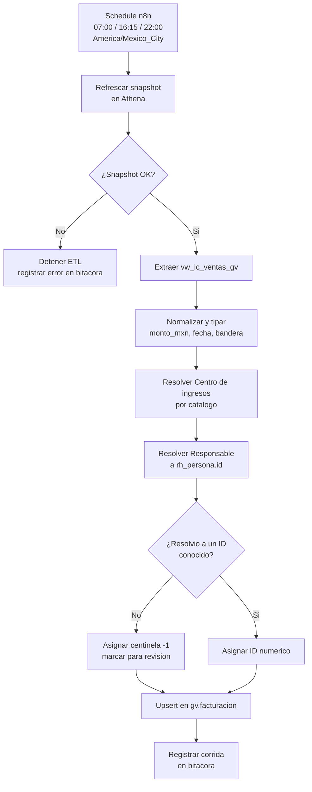
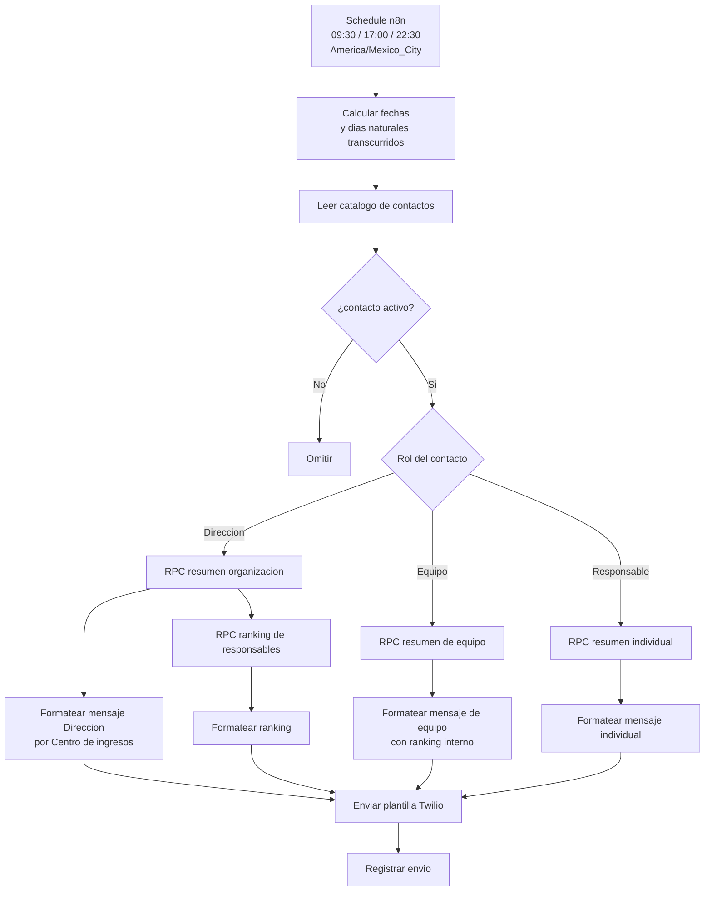
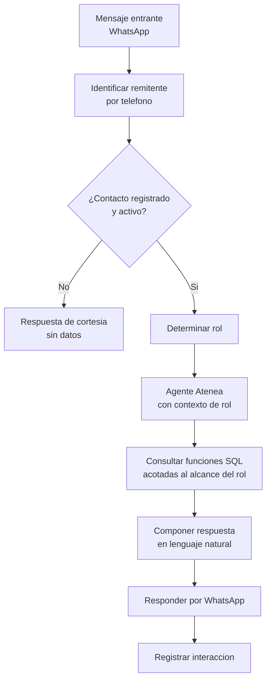

# PRD - Atenea Go Virtual

| **Campo** | **Detalle** |
| --- | --- |
| **Proyecto** | Atenea Go Virtual |
| **Área / empresa** | Go Virtual |
| **Versión** | v0.4 |
| **Fecha** | 2026-08-08 |
| **Autores** | Aldo Álvarez (solicitante) |
| **Revisión / liderazgo** | Aldo Álvarez (Director de TI, revisión técnica) |
| **Tipo de proyecto** | Agente conversacional |

---

## 1. Resumen ejecutivo

Atenea Go Virtual es un agente de reporteo comercial por WhatsApp para **Go Virtual**, la unidad de negocio que vende publicidad digital, sitios web y soluciones digitales. Replica el modelo que Atenea ya opera en GarantiPlus México, Colombia y Chile —ETL automatizado, Envío Diario y chat conversacional— pero sobre un dominio distinto: en lugar de contratos de garantía, mide **facturación**.

Hoy el seguimiento comercial de Go Virtual vive en un Google Sheet llamado **Tool**, que alguien actualiza **manualmente una vez al mes** y circula al equipo de ventas y a la organización. Entre cierre y cierre nadie tiene visibilidad del avance: el equipo comercial descubre que va abajo de objetivo cuando el mes ya terminó y no queda margen para corregir. La dirección quiere para Go Virtual la misma visibilidad diaria que ya tienen los demás negocios.

El producto es deliberadamente **más transparente en sus cálculos que Atenea GarantiPlus**. Aquí no existe la dualidad presupuesto/objetivo ni las métricas derivadas (venta pagada, venta recuperada, ritmo de ventas): hay **una sola meta** y tres números que reportar — **facturado MTD**, **alcance vs objetivo MTD** y **alcance vs objetivo Full Month** —, desglosados por **Centro de ingresos**, que es el eje de lectura del negocio.

El MVP cubre las **Fases 0 y 1**: llevar la facturación de Athena a Supabase, establecer Supabase como maestro de objetivos, validar la correspondencia contra el Tool en meses cerrados, y publicar el Envío Diario tres veces al día por WhatsApp con routing por rol en tres niveles: Dirección ve la organización completa, cada Equipo ve su consolidado con el ranking interno de sus integrantes, y cada Responsable ve su propio corte. La **Fase 2** añade el chat conversacional sobre esos mismos números.

El resultado esperado es operativo y de negocio: **retirar de circulación el reporte mensual manual** y sustituirlo por información diaria y confiable, de modo que el equipo comercial pueda reaccionar dentro del mes en curso y no después.

Flujo resumido: `Athena vw_ic_ventas_gv` → `ETL n8n` → `Supabase RH_Analytics (esquema gv)` → `Funciones SQL de agregación` → `Envío Diario WhatsApp / Chat conversacional`

---

## 2. Contexto y problema

- **Proceso actual:** el desempeño comercial de Go Virtual se consolida en un Google Sheet ("Tool", pestaña TOOL COMERCIAL). Una persona lo actualiza **manualmente, una vez al mes**, y el resultado se comparte al equipo de ventas y a la organización en general. No hay proceso automatizado que alimente ese archivo.

- **Dolor concreto:**
  - **Latencia:** un mes de ceguera entre actualizaciones. Cuando el reporte llega, el periodo que describe ya cerró.
  - **Fragilidad de la fuente:** el Tool tiene celdas combinadas, fórmulas que devuelven `#N/A` y `#DIV/0!`, y llaves construidas por **concatenación de texto** (`Llave (ID +Producto)`, `Llave (Centro de Ingresos)`). Es una hoja de trabajo humana, no una fuente de datos.
  - **Dependencia de una persona:** el proceso no es reproducible ni auditable.
  - **Sin corte individual:** el equipo de ventas recibe el consolidado; cada Responsable no tiene su propio número a la mano.

- **Por qué ahora:** Atenea ya demostró el modelo en tres países de GarantiPlus. La infraestructura (n8n, Twilio, Supabase, patrones de ETL y de Envío Diario) está probada y es reutilizable. El costo marginal de extenderla a Go Virtual es bajo comparado con construirla desde cero, y la dirección quiere paridad de visibilidad entre unidades de negocio.

### Separación de conceptos del dominio (día 1 para dev)

Este proyecto **no es un clon de Atenea GarantiPlus**. Comparte la arquitectura, no las reglas de negocio. Las diferencias que más confusión pueden causar:

| Concepto | Atenea GarantiPlus | Atenea Go Virtual |
|---|---|---|
| Unidad medida | Contrato de garantía vendido | **Peso facturado** |
| Metas | Dos: `objetivo` y `presupuesto` (presupuesto solo a nivel Dirección) | **Una sola: objetivo** |
| Métricas derivadas | `ritmo_ventas_mtd`, `venta_pagada_mtd`, `venta_recuperada_mtd`, `resultado_mes_mtd` | **Ninguna.** Solo facturado y alcance vs objetivo |
| Eje de agregación | Ejecutivo (KAE) → Gerente (DRM) → Grupo → Distribuidor → Dirección | **Centro de ingresos**, y en paralelo **Responsable → Equipo → Dirección** |
| Regla de cancelación | Existe `fecha_cancelacion` en la venta | La vista de Athena ya entrega una **`bandera`** calculada por línea |
| Curva de participación | Prorrateo por curva histórica/semanal según país | **Días naturales transcurridos**, plano |

Cuatro términos del dominio de Go Virtual que el equipo debe distinguir desde el inicio:

- **Centro de ingresos** — la línea de negocio, y el eje principal de lectura. Viene de `clasificacion_gv` en la vista de Athena. El catálogo canónico son **12 centros**, definidos por decisión de Aldo: `1 Sitios Web`, `2 Medios`, `3 Publicidad Digital`, `4 Atención Multicanal`, `5 Herramienta de Gestión`, `6 Inventario Multimedia`, `7 Contenidos`, `8 Project Manager`, `9 Consultoría`, `10 Otros`, `11 Intereses`, `12 CRM`. Dos de ellos absorben alias: **Atención Multicanal** consolida `At. Multicanal` y `Atencion Multicanal`; **Inventario Multimedia** consolida `Inv. Multimedia` e `Inventario Multimedia`. `Otros`, `Intereses` y `CRM` son canales propios, no residuos.
- **Producto / subproducto** — el detalle debajo del Centro de ingresos (`subproducto_gv`): "Dealer Base", "Advanced", "Consultoría en contenido", etc.
- **Responsable** — la persona de ventas dueña de la cuenta. Existe además un `Responsable Publicidad Digital` distinto para ese centro específico.
- **Equipo** — agrupación de Responsables, y el nivel intermedio entre la persona y la organización. Son cinco: **Nuevos Negocios**, **Customer Success Manager**, **Brand Success Manager**, **CRM** y **Longtale**. Verificado en el Tool: la suma de objetivos de los integrantes cuadra exactamente con el objetivo del equipo, y la suma de los cinco equipos cuadra con el total de GoVirtual. Es el equivalente funcional del nivel Gerente (DRM) de GarantiPlus.
- **Bandera** — clasificación por línea que ya calcula la vista `vw_ic_ventas_gv`: `venta`, `venta_devengar`, `cancelada`, `nota_credito`, `refactura_mes_anterior`, `refactura_origen_no_encontrado`. Es lo que permite reproducir las columnas del Tool sin reimplementar su lógica.

---

## 3. Objetivo del producto

Dar al equipo comercial y a la dirección de Go Virtual **visibilidad diaria y automática del facturado del mes y su alcance contra objetivo por Centro de ingresos**, sustituyendo el reporte manual mensual del Tool por un flujo reproducible que va de Athena a WhatsApp sin intervención humana.

La tecnología principal es la ya probada en Atenea: **AWS Athena** como origen, **n8n** como orquestador de ETL y de envío, **Supabase PostgreSQL** (proyecto `RH_Analytics`) como capa de datos y cálculo, y **Twilio WhatsApp** como canal. La mejora medible es el paso de **una actualización mensual manual a tres actualizaciones diarias automatizadas**, con los números validados contra el Tool en meses cerrados antes de darse por buenos.

### 3.1 Estrategia de implementación por fases

| Fase | Nombre | Descripción |
|---|---|---|
| **Fase 0** | Capa de datos y validación | Esquema `gv` en `RH_Analytics`; carga de la sábana de facturación desde `vw_ic_ventas_gv`; catálogos de Centro de ingresos y de Responsables ligados a `rh_persona`; carga de objetivos 2026 con Supabase como maestro; **validación retroactiva contra el Tool** empezando por julio y junio 2026. |
| **Fase 1** | ETL automatizado + Envío Diario | Workflow n8n de ETL contra Athena, 3x/día, con bitácora. Funciones SQL de agregación. Workflow de Envío Diario con routing por rol y plantillas Twilio de Go Virtual. **Este PRD entrega hasta aquí.** |
| **Fase 2** | Chat conversacional | Agente Atenea que responde preguntas en lenguaje natural sobre los mismos indicadores, con las mismas reglas de visibilidad por rol. |
| **Fase 3** | Evoluciones | Corte individual para Responsables de Publicidad Digital; comparativos MoM/YoY; Go Virtual España (EUR). |

**El MVP de este PRD son las Fases 0 y 1.** La Fase 2 está descrita porque forma parte del producto comprometido y condiciona decisiones de diseño de datos, pero su construcción es posterior a que el Envío Diario opere de forma estable.

---

## 4. Usuarios y actores

| Usuario / Actor | Rol en el proceso |
|---|---|
| **Dirección Go Virtual** | Recibe el Envío Diario con el consolidado de toda la organización: facturado MTD, alcance vs objetivo MTD y Full Month por Centro de ingresos, y el ranking de Responsables. Es el consumidor principal. |
| **Responsable (equipo de ventas)** | Recibe su propio corte con los mismos indicadores acotados a sus cuentas. Identificado en el Tool por la columna `Responsable` y ligado a `rh_persona` por ID numérico. |
| **Equipo** | Nivel intermedio entre Responsable y Dirección. Cinco equipos: Nuevos Negocios, Customer Success Manager, Brand Success Manager, CRM y Longtale. Recibe el consolidado de sus integrantes y el ranking interno del equipo. Es el tercer rol de routing del Envío Diario. |
| **Responsable Publicidad Digital** | Dueño del Centro de ingresos Publicidad Digital. **No recibe envío en el MVP**, pero su identificador se persiste desde la Fase 0 para habilitarlo en Fase 3 sin rehacer el modelo. |
| **Aldo Álvarez (Director de TI)** | Solicitante, revisor técnico y operador. Ejecuta manualmente los pasos de Athena/AWS, autoriza cargas a producción y define el parámetro de tolerancia de la validación. |
| **Finanzas / quien fija objetivos** | Origen de los objetivos mensuales. Hoy los captura en el Tool; a partir de la Fase 0 la fuente de verdad es Supabase. |
| **Atenea (agente)** | Actor no humano. Ejecuta el ETL, compone y envía los mensajes y responde consultas en Fase 2. |

---

## 5. Alcance MVP y funcionalidades

| Funcionalidad | Descripción |
|---|---|
| **Sábana de facturación en Supabase** | Ingesta de `vw_ic_ventas_gv` (Athena, `db-rpa`) al esquema `gv` de `RH_Analytics`, con la `bandera` de cada línea preservada. |
| **Catálogo de Centros de ingresos** | Catálogo explícito y estable de los 9 centros, con su llave numérica, para no agregar por texto. |
| **Catálogo de Responsables** | Cada `Responsable` del Tool ligado a `rh_persona.id` (`empresa_id = 4`). Incluye `Responsable Publicidad Digital` aunque no se use en el MVP. |
| **Objetivos maestros en Supabase** | Objetivo mensual 2026 por Responsable y Centro de ingresos, migrado una sola vez desde el Tool. Supabase pasa a ser la fuente de verdad. |
| **Facturado MTD** | Facturado acumulado del mes en curso al día de corte, neto de cancelaciones, notas de crédito y refacturas, e incluyendo devengado, según la `bandera`. |
| **Objetivo MTD prorrateado** | Objetivo mensual × (días naturales transcurridos ÷ días naturales del mes). |
| **Alcance vs objetivo MTD** | Facturado MTD ÷ objetivo MTD. |
| **Alcance vs objetivo Full Month** | Facturado MTD ÷ objetivo mensual completo, sin prorratear. |
| **Desglose por Centro de ingresos** | Los tres indicadores anteriores abiertos por cada uno de los 9 centros. |
| **Desglose por subproducto** | Un nivel de detalle adicional bajo cada Centro de ingresos, desde `subproducto_gv`. |
| **Corte individual por Responsable** | Los mismos indicadores acotados a las cuentas de cada persona. |
| **Corte por Equipo** | Los mismos indicadores consolidados por equipo, con el ranking interno de sus integrantes. |
| **Ranking de Responsables** | Lista ordenada por alcance vs objetivo, para el mensaje de Dirección. |
| **Alcance Full Month junto al MTD** | Ambas cifras se muestran en el mismo mensaje. El `Alcance` que el equipo conoce del Tool es Full Month; el MTD prorrateado es una métrica nueva y presentarla sola provocaría que se lea como discrepancia. |
| **ETL automatizado** | Workflow n8n contra Athena, 3x/día en el horario de México, con bitácora de cada corrida. |
| **Envío Diario por WhatsApp** | Tres envíos diarios vía Twilio, con routing por rol y catálogo de contactos con bandera de activo. |
| **Validación retroactiva** | Reproducción de meses cerrados (julio, junio y anteriores) contra el Tool, con análisis de variación documentado. |

### Principio rector del MVP

**Ningún número sale al canal antes de estar validado contra el Tool en un mes cerrado.** El proyecto se juega su credibilidad en la primera cifra que reciba la dirección: si el bot y el Tool discrepan y nadie lo detectó antes, el producto queda desacreditado y el reporte manual regresa. Por eso la Fase 0 es de validación, no de construcción, y el Envío Diario no se activa hasta que la variación esté explicada y dentro de un parámetro que Aldo apruebe.

Del mismo principio se deriva la segunda regla: **nada se agrega por texto**. Los joins van por ID numérico y toda fila que no logre resolverse a un ID conocido cae a un centinela **visible** en el reporte, nunca a un cero silencioso.

Decisiones críticas que el MVP **no** toma todavía: el parámetro de tolerancia de desviación (sale del propio ejercicio de validación), el catálogo definitivo de Centros de ingresos cuando las dos listas del Tool discrepan, y el tratamiento de los Responsables dados de baja en RH que siguen activos en el Tool.

---

## 6. Fuera de alcance

| Exclusión | Justificación / condición para incluirla después |
|---|---|
| **Comparativos MoM / YoY** | Exige cargar y validar el histórico desde `Ene'23` de la matriz del Tool, que mezcla filas `HISTÓRICO` y `OBJETIVO` con llaves de texto concatenado. Es un frente de validación propio. Entra cuando el histórico esté cargado y cuadrado. |
| **Corte individual para Responsables de Publicidad Digital** | Decisión explícita de diferirlo. El identificador se persiste desde la Fase 0, así que habilitarlo es añadir un rol al routing, no rehacer el modelo. |
| **Go Virtual España (EUR)** | La entidad existe en RH (`buk_company_id = 8`) pero el MVP es monomoneda MXN, alineado a `importe_mxn` de la vista y al Tool. Entra cuando se resuelva multimoneda y objetivos por país; `rh_tipo_cambio` ya existe en el proyecto. |
| **Desglose por cliente o grupo** | El dato existe (`cliente`, `grupo` en la vista), pero abrir el mensaje a ese nivel lo vuelve ilegible en WhatsApp. Entra si se pide como consulta puntual del chat en Fase 2, no como parte del envío. |
| **Chat conversacional** | Es Fase 2. Depende de que el Envío Diario opere de forma estable y de que los números estén validados. |
| **Reemplazo del Tool como herramienta de trabajo** | El Tool sigue existiendo para captura y análisis de Finanzas y Comercial. Lo que se retira es su rol de **canal de reporte mensual**, no el archivo. |
| **Escritura de vuelta hacia el Tool o hacia Athena** | El flujo es de solo lectura desde el origen. Atenea nunca modifica la vista de Athena ni el Google Sheet. |
| **Modificación de las tablas `rh_*` existentes** | El proyecto convive en `RH_Analytics` pero no toca el dominio de RH. Solo lee `rh_persona` y `rh_empresa`. |
| **Cálculo de comisiones** | El Tool calcula comisiones (`Porcentaje de Comisión`, `cobrado este mes`, `Por cobrar`, `TOTAL`). Atenea no las reproduce: implica reglas de cobranza que no están en la vista de Athena. Entra si se define su lógica y se agrega el dato de cobranza a la sábana. |

---

## 7. Flujos principales

### 7.1 ETL — de Athena a Supabase

El ETL corre **antes** de cada envío, con el mismo patrón que México: el snapshot se refresca primero y, si falla, el proceso se detiene en lugar de extraer contra datos viejos. Un ETL que falla en silencio y deja pasar el envío es peor que un ETL que no corre, porque produce un mensaje que parece fresco y no lo es.

La decisión de diseño que más importa está en el rombo de resolución de `Responsable`: las filas que no empatan **no se descartan ni se mandan a cero** — caen a un centinela negativo que aparece explícitamente en el reporte. Este modo de falla ya se materializó en Colombia y en Chile, donde un `CASE` con nombres hardcodeados mandaba a cero a quien no estuviera en la lista y esas ventas desaparecían del reporte sin que nadie lo notara.

### 7.2 Envío Diario

El routing por rol es lo que hace que un mismo workflow sirva a tres audiencias con reglas de visibilidad distintas. Dirección recibe dos mensajes (consolidado y ranking); cada líder de Equipo recibe el consolidado de su equipo con el ranking interno de sus integrantes; cada Responsable recibe uno solo con sus propias cifras.

Un detalle operativo aprendido en Chile y que debe quedar explícito en el diseño: los nodos de formateo tienen que hacer **fan-out** —emitir un ítem por destinatario— y no colapsar la lista a un solo elemento. Cuando esto se hizo mal en el Envío Diario de Chile, solo el primer contacto de Dirección recibió el mensaje y el resto no, sin error visible en la ejecución.

### 7.3 Chat conversacional (Fase 2)

La regla que no puede romperse en Fase 2 es que **el alcance de la consulta lo determina el rol del remitente, no lo que pida en el mensaje**: un Responsable que pregunte por el total de la organización o por las cifras de un compañero debe recibir únicamente lo suyo. El filtro vive en la capa de datos, no en el prompt.

---

## 8. Requerimientos funcionales

| ID | Requerimiento | Descripción |
|---|---|---|
| RF-01 | Ingesta de facturación | Extraer `vw_ic_ventas_gv` desde Athena (`db-rpa`) y persistirla en el esquema `gv` de Supabase `RH_Analytics`, preservando `bandera`, `clasificacion_gv`, `subproducto_gv`, `monto_mxn`, `fecha`, `documento`, `cliente`, `grupo` e `id_gv`. |
| RF-02 | Idempotencia del ETL | La carga debe poder repetirse sin duplicar registros, usando una llave de negocio estable por línea de factura. |
| RF-03 | Catálogo de Centros de ingresos | Mantener un catálogo con llave numérica para los 9 centros. Toda agregación se hace por esa llave, nunca por el texto de `clasificacion_gv`. |
| RF-04 | Catálogo de Responsables | Mapear cada `Responsable` y `Responsable Publicidad Digital` del Tool a `rh_persona.id` filtrando `empresa_id = 4`. La resolución debe tolerar diferencias de acentuación y de nombre completo vs. nombre corto. |
| RF-05 | Centinela visible | Toda fila cuyo Centro de ingresos o Responsable no resuelva a una llave conocida se asigna a un centinela negativo y **aparece explícitamente** en el reporte de Dirección. Está prohibido asignarla a cero o descartarla. |
| RF-06 | Objetivos maestros | Persistir el objetivo mensual 2026 por Responsable y Centro de ingresos en Supabase, migrado una vez desde el Tool. Supabase es la fuente de verdad a partir de la carga. |
| RF-07 | Facturado MTD | Calcular el facturado acumulado del mes en curso hasta el día de corte, aplicando la `bandera`: suma de `venta` y `venta_devengar`, menos `cancelada`, `nota_credito` y refacturas. La correspondencia exacta se fija en la validación (ver RF-16). |
| RF-08 | Objetivo MTD | Prorratear el objetivo mensual por **días naturales transcurridos** sobre días naturales del mes. |
| RF-09 | Alcance vs objetivo MTD | Exponer facturado MTD ÷ objetivo MTD, a nivel organización, Centro de ingresos y Responsable. |
| RF-10 | Alcance vs objetivo Full Month | Exponer facturado MTD ÷ objetivo mensual completo, sin prorrateo, en los mismos tres niveles. |
| RF-11 | Desglose por subproducto | Permitir abrir cada Centro de ingresos por `subproducto_gv`. |
| RF-12 | Ranking de Responsables | Producir la lista de Responsables ordenada por alcance vs objetivo, excluyendo centinelas del orden pero reportándolos aparte. |
| RF-13 | Envío Diario | Enviar tres veces al día por WhatsApp/Twilio, con routing por rol: Dirección recibe consolidado y ranking; cada Equipo recibe su consolidado con ranking interno; cada Responsable recibe su corte individual. |
| RF-19 | Catálogo de Equipos | Mantener el catálogo de los cinco equipos y la pertenencia de cada Responsable a uno solo de ellos, con llave numérica y vigencia. |
| RF-20 | Consolidado por Equipo | Calcular los mismos indicadores agregados por equipo, y el ranking interno de sus integrantes. |
| RF-21 | Invariante de cuadre jerárquico | La suma de los Responsables de un equipo debe igualar al equipo, y la suma de los cinco equipos debe igualar al total de la organización. La verificación se ejecuta en cada corrida y su incumplimiento se reporta como error, no como advertencia. |
| RF-22 | Doble alcance en el mensaje | Presentar en el mismo mensaje el alcance vs objetivo MTD prorrateado y el Full Month, etiquetados de forma que se distingan sin ambigüedad. |
| RF-14 | Catálogo de contactos | Mantener contactos con teléfono, rol, vínculo a `rh_persona.id` y bandera de activo. Solo se envía a contactos activos. |
| RF-15 | Bitácora de ETL | Registrar cada corrida con inicio, fin, estado, filas leídas, filas insertadas o actualizadas, centinelas generados y error si lo hubo. |
| RF-16 | Validación retroactiva | Reproducir meses cerrados (julio 2026 hacia atrás) y compararlos contra el Tool por Centro de ingresos, documentando la variación de cada columna (`Facturado`, `REFA`, `Cancelaciones`, `Devengado`, `Total`). |
| RF-17 | Visibilidad por rol | Las funciones de consulta deben acotar los datos al alcance del rol del solicitante en la propia capa de datos. |
| RF-18 | Chat conversacional *(Fase 2)* | Responder consultas en lenguaje natural sobre los indicadores del MVP, respetando RF-17. |

---

## 9. Requerimientos no funcionales

| ID | Requerimiento | Descripción |
|---|---|---|
| RNF-01 | Aislamiento de datos | Todo lo comercial vive en un esquema propio (`gv`) dentro de `RH_Analytics`. No se modifican ni se mezclan las tablas `rh_*`; el acceso a RH es de solo lectura y limitado a `rh_persona` y `rh_empresa`. |
| RNF-02 | Privacidad | El proyecto convive con `rh_persona_sensible` en el mismo proyecto de Supabase. Ninguna función, rol o consulta del bot debe poder alcanzar esa tabla ni ninguna otra del dominio de RH fuera de las dos autorizadas. |
| RNF-03 | Least privilege | El bot y el ETL operan con un rol de Postgres propio y de bajo privilegio, no con `service_role` ni con credenciales compartidas con otros países o proyectos. |
| RNF-04 | RLS | Las tablas nuevas del esquema `gv` se crean con RLS habilitado, consistente con el resto de `RH_Analytics`. |
| RNF-05 | Fallo ruidoso | Si el ETL falla, el Envío Diario no debe enviar cifras desactualizadas: es preferible no enviar y alertar, que enviar un número viejo con apariencia de fresco. |
| RNF-06 | Trazabilidad | Toda cifra reportada debe poder reconstruirse hasta las líneas de factura que la componen y hasta la corrida de ETL que la cargó. |
| RNF-07 | Consistencia de agregación | La suma de los Responsables y la suma de los Centros de ingresos deben cuadrar con el total de la organización. Esta invariante se verifica en cada despliegue. |
| RNF-08 | Idempotencia y no regresión | Reejecutar el ETL sobre un periodo ya cargado no debe alterar las cifras de meses cerrados. |
| RNF-09 | Legibilidad en WhatsApp | Los mensajes deben ser legibles en pantalla de teléfono: cifras abreviadas cuando corresponda y jerarquía clara entre organización, Centro de ingresos y detalle. |
| RNF-10 | Fan-out de destinatarios | Los nodos de formateo del Envío Diario emiten un ítem por destinatario. Debe existir una verificación explícita de que el número de mensajes enviados iguala al de contactos activos del rol. |
| RNF-11 | Aislamiento entre negocios | Atenea Go Virtual no comparte base de datos, credenciales ni workflows con Atenea GarantiPlus México, Colombia o Chile. Los workflows nuevos se nombran con sufijo propio y jamás se editan los existentes. |
| RNF-12 | Zona horaria | ETL y Envío Diario operan en `America/Mexico_City`, alineados a que la sábana fuente se actualiza según el reloj de México. |
| RNF-13 | Manejo de fechas | Las fechas se manipulan por descomposición directa de la cadena, nunca instanciando objetos de fecha desde texto, para evitar el corrimiento por UTC en zona horaria negativa. |

---

## 10. Integraciones y datos

| Integración / Fuente | Uso esperado |
|---|---|
| **AWS Athena — `db-rpa.vw_ic_ventas_gv`** | **Lectura.** Origen único de la facturación. La vista ya resuelve refacturación, cancelación y devengamiento en el campo `bandera`; el proyecto **consume** esa lógica, no la reimplementa. Acceso desde n8n con credenciales de AWS. |
| **AWS Athena — snapshot** | **Lectura / refresco.** Paso previo al extract, siguiendo el patrón de México y Colombia: se refresca el snapshot y solo entonces se extrae. |
| **Supabase `RH_Analytics` (`onbnobxiwvppfiyjlooh`, us-east-1)** | **Lectura y escritura.** Capa de datos y de cálculo. Escritura limitada al esquema `gv`. |
| **Supabase — `rh_persona`** | **Lectura.** Resolución de `Responsable` a ID numérico, filtrando `empresa_id = 4`. Aporta además `activo`, que permite detectar bajas. |
| **Supabase — `rh_empresa`** | **Lectura.** Identificación de la entidad Go Virtual (`buk_company_id = 4`) y su moneda. |
| **Supabase — RBAC existente (`rol`, `permiso`, `usuario_rol`, `rol_permiso`)** | **Lectura, y escritura de filas nuevas.** Se evalúa reutilizar el modelo de permisos ya presente en el proyecto en lugar de crear uno paralelo. |
| **Supabase — `sync_log`** | **Escritura.** Bitácora del ETL. Se evalúa reutilizarla o crear una equivalente en `gv` si sus columnas resultan demasiado específicas del dominio de RH. |
| **n8n** | **Orquestación.** Dos workflows nuevos, con sufijo propio de Go Virtual. Se clonan patrones existentes; **jamás se editan los workflows de GarantiPlus**. |
| **Twilio WhatsApp** | **Escritura / salida.** Plantillas nuevas para Go Virtual. Los `ContentVariables` se envían serializados como JSON, no como objeto. |
| **Google Sheet "Tool"** | **Lectura, una sola vez.** Origen de la migración inicial de objetivos y referencia de validación retroactiva. **No es una integración viva**: tras la Fase 0 deja de ser fuente de verdad. |

### Datos mínimos requeridos

**Facturación (por línea):** `documento`, `fecha`, `tipo_documento`, `id_gv`, `cliente`, `grupo`, `rfc`, `clasificacion_gv`, `subproducto_gv`, `moneda`, `monto_mxn`, `bandera`, `es_cancelada`, `mes_factura`, `folios_sustitutos`, `origenes_encontrados`, `alerta_origen_sin_cancelar`.

**Catálogo de Centros de ingresos:** llave numérica, nombre canónico, y los alias de texto con que aparece en las distintas fuentes.

**Catálogo de Responsables:** llave numérica propia, `rh_persona.id`, nombre como aparece en el Tool, nombre como aparece en RH, tipo (`Responsable` / `Responsable Publicidad Digital`), equipo al que pertenece, vigencia.

**Catálogo de Equipos:** llave numérica, nombre canónico (Nuevos Negocios, Customer Success Manager, Brand Success Manager, CRM, Longtale), y vigencia.

**Objetivos:** `id_gv` de la cuenta, llave de Responsable, llave de Centro de ingresos, año, mes, monto objetivo, origen y fecha de carga.

**Contactos:** teléfono, `rh_persona.id`, rol (`Direccion` / `Responsable`), activo.

**Bitácora:** inicio, fin, estado, filas leídas, filas afectadas, centinelas generados, error.

### Esquema de permisos

| Acción | Permiso |
|---|---|
| Leer `vw_ic_ventas_gv` en Athena | **Permitido** al ETL. |
| Escribir en el esquema `gv` | **Permitido** al ETL, con rol propio de bajo privilegio. |
| Leer `rh_persona` y `rh_empresa` | **Permitido**, solo lectura, solo las columnas necesarias para la resolución de identidad. |
| Leer cualquier otra tabla `rh_*`, en particular `rh_persona_sensible` | **Bloqueado.** |
| Escribir en cualquier tabla `rh_*` | **Bloqueado.** |
| Modificar la vista de Athena o el Google Sheet | **Bloqueado.** |
| Cargar o recalibrar objetivos | **Requiere validación humana.** La ejecuta Aldo con respaldo previo y verificación de cuadre contra el total del periodo. |
| Activar el Envío Diario en producción | **Requiere validación humana.** No se activa hasta cerrar la validación retroactiva y fijar el parámetro de tolerancia. |
| Enviar mensajes por Twilio | **Permitido** al workflow de envío, solo a contactos con `activo = true`. |

---

## 11. Eventos para BI

- `etl_corrida_iniciada`: se registra al arrancar cada corrida del ETL.
- `etl_corrida_finalizada`: se registra al terminar una corrida, con estado y conteos.
- `etl_corrida_fallida`: se registra cuando la corrida se interrumpe, con el error y la etapa donde ocurrió.
- `fila_sin_responsable`: se registra cuando una línea de factura no resuelve a un Responsable conocido y cae al centinela.
- `fila_sin_centro_ingresos`: se registra cuando una línea no resuelve a un Centro de ingresos del catálogo.
- `responsable_inactivo_detectado`: se registra cuando una línea se atribuye a un Responsable cuyo `rh_persona.activo` es `false`.
- `objetivos_cargados`: se registra en cada carga o recalibración de objetivos, con periodo afectado y monto total.
- `envio_diario_ejecutado`: se registra en cada corrida del Envío Diario, con la ventana horaria.
- `mensaje_enviado`: se registra por cada mensaje entregado a Twilio, con rol y resultado.
- `mensaje_fallido`: se registra cuando Twilio rechaza o falla la entrega.
- `consulta_chat_recibida` *(Fase 2)*: se registra al recibir un mensaje entrante de un contacto identificado.
- `consulta_chat_respondida` *(Fase 2)*: se registra al responder, con el tipo de consulta resuelta.
- `consulta_chat_rechazada` *(Fase 2)*: se registra cuando el remitente no está registrado o pide datos fuera del alcance de su rol.

**Campos mínimos por evento:** fecha y hora con zona horaria, actor (`rh_persona.id` o identificador del proceso), rol, identificadores de negocio involucrados (periodo, Centro de ingresos, documento cuando aplique), resultado y motivo cuando el resultado no sea exitoso.

---

## 12. Métricas de éxito

| Métrica | Descripción |
|---|---|
| **Retiro del reporte manual** | El reporte mensual del Tool deja de circularse como canal oficial. Es la métrica que define el éxito del proyecto. |
| **Cuadre contra el Tool en meses cerrados** | Desviación entre el `Total` por Centro de ingresos calculado por Atenea y el del Tool, en julio y junio 2026. El umbral tolerable **se define a partir de este ejercicio**, no antes. |
| **Cobertura de atribución** | Porcentaje de monto facturado que resuelve a un Responsable, un Equipo y un Centro de ingresos conocidos. El complemento es el monto en centinela, que debe tender a cero. |
| **Cuadre jerárquico** | Corridas en que la suma de Responsables iguala a su Equipo y la suma de Equipos iguala a la organización. Debe ser 100%; cualquier incumplimiento es un error bloqueante. |
| **Fiabilidad del ETL** | Porcentaje de corridas programadas que terminan en estado exitoso, medido semanalmente. |
| **Entregabilidad del Envío Diario** | Mensajes entregados ÷ contactos activos por corrida. Detecta el modo de falla de fan-out. |
| **Frescura del dato** | Diferencia entre la última corrida exitosa de ETL y la hora del envío. Un envío nunca debe apoyarse en datos de más de una ventana de atraso. |
| **Uso del chat** *(Fase 2)* | Consultas por semana y número de personas distintas que consultan. |

---

## 13. Riesgos y supuestos

### Riesgos

| Riesgo | Impacto potencial |
|---|---|
| **El empate de Responsables por nombre falla en silencio** | Verificado en la base: el Tool escribe "Brimar Diego Piñón Miranda" y RH "Brimar Diego Piñon Miranda"; el Tool escribe "Naomi Farfán" y RH "Naomi Montserrath Farfan Bejar". Un join por texto manda esas ventas a cero y desaparecen del reporte sin error. Es el mismo modo de falla que ya se materializó en Colombia y Chile. Mitigación: RF-04 y RF-05, con centinela visible. |
| **Responsables dados de baja en RH siguen activos en el Tool** | Verificado: `Juan Carlos Jimenez Mejia` (id 125) tiene `activo = false` en `rh_persona` y sigue apareciendo como `Responsable Publicidad Digital` en el Tool. Si el ETL filtra por activos, esas cuentas quedan huérfanas; si no filtra, se envían mensajes a alguien que ya no está. |
| **Los dos catálogos de Centro de ingresos del Tool no coinciden** | El bloque resumen lista "Herramienta de Gestión" y "Consultoría"; el bloque por vendedor lista "CRM", "Servicio" y "Consultoría y Capacitación". Agregar por el catálogo equivocado produce cifras que no cuadran con las que el equipo ya conoce. |
| **La correspondencia `bandera` → columnas del Tool es una hipótesis, no un hecho** | Se asume que `refactura_*` alimenta REFA, que `cancelada` y `nota_credito` alimentan Cancelaciones, y que `venta_devengar` alimenta Devengado. Si el Tool aplica algún criterio adicional no visible, las cifras no cuadrarán y habrá que reconstruir la lógica. |
| **Los objetivos del Tool pueden no estar completos ni cuadrados** | Las filas de objetivo que se alcanzaron a leer traen ceros en 2026 y la hoja contiene `#N/A` y `#DIV/0!`. Cargar objetivos incompletos produce alcances inflados que nadie detecta hasta que un Responsable reclama. Mitigación: validar que la suma de objetivos por mes cuadre contra el total del bloque resumen antes de dar la carga por buena. |
| **Los pivotes del Tool están desactualizados respecto de su propia matriz** | **Resuelto.** La discrepancia de julio (pivote 9,219,841.71 vs rollup 9,293,066) se explicó al leer la hoja `TOOL_COMERCIAL` del libro completo: la matriz suma **9,293,066.27**, coincide con el rollup y con la serie mensual, y reproduce el facturado de julio al centavo (5,936,719.26). El pivote era una foto vieja. **Implicación permanente:** las pestañas de pivote del Tool no son fuente confiable; solo la matriz lo es. |
| **La capitalización parte a una persona en dos** | Verificado: la matriz contiene `Montserrat González García` y `montserrat González García` como valores distintos, con **$279,990 del objetivo 2026** bajo la variante en minúscula. Un `GROUP BY` por texto la habría reportado como dos vendedoras, cada una con parte de su meta. La normalización debe colapsar mayúsculas y acentos antes de resolver identidad, y aun así el resultado final debe ser un ID numérico. |
| **Objetivo y facturación del mismo centro viven bajo etiquetas distintas** | Verificado: `At. Multicanal` tiene 14,057,428.68 de objetivo y **cero** facturado; `Atencion Multicanal` tiene **cero** objetivo y 2,401,194.82 facturado. Sin tabla de alias, ese centro se reportaría con 0% de alcance sobre 14 millones de meta, y en otro renglón con facturación sin objetivo. Mismo patrón entre `Inv. Multimedia` e `Inventario Multimedia`. |
| **El Tool tiene errores de fórmula no detectados** | Verificado en el bloque de abril: la columna `Alcance` está **corrida un renglón hacia abajo** — cada porcentaje pertenece a la fila anterior, y el total del mes aparece como 100.6% cuando en realidad fue 76.5%. Implicación doble: la validación retroactiva no puede tomar los porcentajes del Tool como referencia (solo los montos), y es probable que decisiones comerciales pasadas se hayan tomado sobre cifras equivocadas. |
| **El equipo conoce el alcance Full Month, no el MTD** | El `Alcance` del Tool es facturado ÷ objetivo mensual completo, sin prorrateo. Si el primer envío muestra solo el MTD prorrateado, el equipo lo va a comparar contra el Tool y concluir que el bot está mal. Mitigación: RF-22. |
| **Convivencia con datos sensibles de RH** | El proyecto vive en el mismo Supabase que `rh_persona_sensible`. Un rol mal acotado expone información de nómina. Aldo aceptó explícitamente la convivencia; el riesgo se gestiona con RNF-01 a RNF-04, no eliminándolo. |
| **Dependencia de credenciales de AWS accesibles desde n8n** | El ETL automatizado exige que n8n pueda consultar Athena. Si no hay credenciales disponibles, la Fase 1 se bloquea y hay que retroceder a carga manual, perdiendo la promesa de visibilidad diaria. |
| **Alta de número y plantillas de Twilio** | Es un trámite externo con tiempos propios. Puede convertirse en el camino crítico aunque todo lo técnico esté listo. |
| **La facturación no es pareja a lo largo del mes** | El prorrateo por días naturales asume distribución uniforme, pero la facturación se concentra en bloques a inicio de mes. Los primeros días mostrarán alcances muy por encima del 100% y los últimos parecerán una caída. Es un efecto esperado del método elegido, pero debe explicarse al equipo o se leerá como error del bot. |
| **Pérdida de credibilidad en el primer envío** | Si la primera cifra que ve la dirección discrepa del Tool, el reporte manual regresa y el proyecto pierde su razón de ser. Mitigación: el principio rector del MVP. |

### Supuestos

| Supuesto | Descripción |
|---|---|
| **`clasificacion_gv` = Centro de ingresos** | Se asume equivalencia directa entre el campo de la vista y el eje del Tool. |
| **`subproducto_gv` = Producto** | Misma equivalencia para el nivel de detalle. |
| **`importe_mxn` es la cifra de negocio** | Todo el MVP opera en pesos mexicanos; no se hace conversión de moneda. |
| **La vista de Athena es correcta y estable** | Se consume su `bandera` sin reimplementar ni auditar la lógica de refacturación y devengamiento. |
| **Los Responsables del Tool existen en `rh_persona` con `empresa_id = 4`** | Verificado para tres casos; se asume para el resto y se validará en la Fase 0. |
| **El objetivo es mensual y no cambia dentro del mes** | Si Finanzas recalibra a media marcha, se maneja como carga nueva con respaldo, no como edición en vivo. |
| **Días naturales, no hábiles** | Decisión explícita de Aldo. |
| **Tres niveles de visibilidad** | Dirección ve todo; cada Equipo ve su consolidado y el ranking interno de sus integrantes; cada Responsable ve lo suyo. Verificado contra el Tool: los cinco equipos suman exactamente el total de la organización. |
| **Cada Responsable pertenece a un solo equipo** | Se asume pertenencia única, consistente con que las sumas por equipo cuadren sin duplicar. Debe confirmarse al cargar el catálogo. |
| **La fuente de objetivos es la hoja `TOOL_COMERCIAL` del libro, no sus pivotes** | Verificado: la matriz cuadra con las tres cifras de control (Ene'26 objetivo 9,319,472.19, Jul'26 objetivo 9,293,066.27, Jul'26 facturado 5,936,719.26). Los objetivos viven exclusivamente en filas con `Fuente = OBJETIVO`; las otras seis fuentes (`HISTÓRICO`, `FACTURADO`, `CANCELACION`, `ANDANAC`, `AMECAH`, `DEVENGADO`) tienen objetivo cero. |
| **Objetivo total 2026 = 108,219,141.95** | Suma de los doce meses de la matriz, con 266 combinaciones de Responsable × Centro de ingresos sobre 8,756 filas. El total se preserva al centavo tras consolidar los alias del catálogo. |
| **El catálogo de Centros de ingresos tiene 12 entradas y está cerrado** | Decisión de Aldo. Dos consolidaciones de alias (Atención Multicanal, Inventario Multimedia) y tres canales propios (`Otros`, `Intereses`, `CRM`). Materializado en `Go Virtual/catalogo_centro_ingresos_GV.csv`. |
| **La infraestructura de Atenea es reutilizable** | n8n, Twilio y los patrones de ETL y Envío Diario se clonan sin rediseño de arquitectura. |

---

## 14. Preguntas abiertas

| Tema | Pregunta abierta |
|---|---|
| **Clasificación de Intereses en Athena** | En el export de Athena, la única línea de intereses trae `clasificacion_gv` **vacío**; su clasificación SAT es `84101700 INTERESES NO PROVENIENTES DEL SISTEMA FINANCIERO`. El Tool sí la ubica en el centro `Intereses`. ¿La regla es mapear por código SAT cuando `clasificacion_gv` viene vacío, o se corrige la vista de Athena para que lo etiquete? Sin resolverlo, esas líneas caen al centinela. |
| **Representatividad de la muestra de Athena** | El export disponible (`2026_08_06_facturacion_GV.csv`) contiene **100 filas reales de 2025** más 14,828 filas vacías de relleno, y solo exhibe 4 de los 12 centros y 2 de las 6 banderas. Es insuficiente para validar la cobertura del catálogo y la correspondencia `bandera` → columnas del Tool. Se requiere un export de 2026 completo antes de cerrar la Fase 0. |
| **Pertenencia a equipos** | Falta el catálogo explícito de qué Responsable pertenece a qué equipo, y qué ocurre con Responsables que no aparecen en ningún equipo (`Mariana Rojas` y `Cesar Valverde` aparecen en unos bloques y no en otros). |
| **Contactos de Equipo** | ¿Quién recibe el mensaje de cada equipo — un líder designado, todos sus integrantes, o ambos? |
| **Tolerancia de desviación** | ¿Cuál es la variación máxima aceptable entre Atenea y el Tool para dar por buena la validación? Se define tras reproducir julio y junio 2026. Nota: la comparación debe hacerse contra los **montos** del Tool, no contra sus porcentajes de `Alcance`, que están corridos un renglón. |
| **Catálogo de Centros de ingresos** | ¿Cuál de las dos listas del Tool es la canónica? ¿"Herramienta de Gestión" y "CRM"/"Servicio" son el mismo centro con distinto nombre o son centros distintos? |
| **Responsables inactivos** | ¿Qué hacer con las cuentas de un Responsable dado de baja en RH? ¿Se reasignan, se agrupan aparte, o se mantienen atribuidas a la persona saliente hasta el cierre del mes? |
| **Responsable Publicidad Digital** | ¿Su objetivo es un subconjunto del objetivo del `Responsable` de la cuenta, o es una meta independiente? Determina si los objetivos suman doble al consolidar. |
| **Contactos y teléfonos** | ¿Quién exactamente recibe el Envío Diario? Falta la lista de Dirección y de Responsables con sus números. |
| **Twilio** | ¿Se da de alta un número nuevo para Go Virtual o se reutiliza uno existente? ¿Quién gestiona la aprobación de plantillas y en qué plazo? |
| **Credenciales de AWS para n8n** | ¿Existen credenciales con acceso a `db-rpa` utilizables desde n8n, o hay que crearlas? |
| **Bitácora** | ¿Se reutiliza `sync_log` (cuyas columnas son específicas del dominio de RH: `vacaciones`, `ausencias`, `postulaciones`) o se crea una bitácora propia en el esquema `gv`? |
| **RBAC** | ¿Se reutiliza el modelo `rol`/`permiso`/`usuario_rol`/`rol_permiso` ya presente en `RH_Analytics` o se crea uno independiente para el dominio comercial? |
| **Ventana de datos** | ¿Desde qué mes se carga la facturación histórica? La validación retroactiva necesita al menos julio y junio 2026, pero conviene definir el horizonte completo. |
| **Número de proyecto** | Falta asignar el identificador `PJ####` que usa la convención de carpetas de `enginecx_prd`. |

---

*Engine CX — Departamento de Desarrollo*
*Versión: v0.4*
