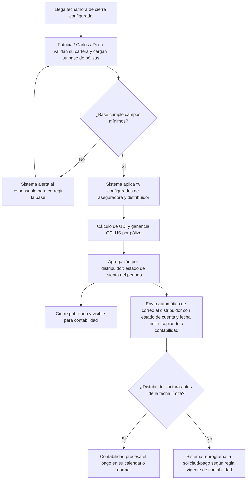

# PRD - Dispersión y cobro de comisiones GPLUS

| **Campo** | **Detalle** |
| --- | --- |
| **Proyecto** | Dispersión y cobro de comisiones GPLUS |
| **Área / empresa** | Gplus Seguros |
| **Versión** | v0.1 |
| **Fecha** | 2026-07-28 |
| **Autores** | Daniela Carbajal Vega |
| **Revisión / liderazgo** | Alexis Herrera |
| **Tipo de proyecto** | Automatización interna |

## 1. Resumen ejecutivo

Este proyecto automatiza el ciclo mensual de comisiones de GPLUS Seguros, que hoy se opera casi por completo en Excel y por correo. Cubre dos funciones relacionadas pero distintas: (1) el **pago de comisiones (UDI) a distribuidores** —lo que GPLUS paga a negocios como Roca, Misol, Autocom/CAF, Changan, entre otros, por la producción que colocan— y (2) el **cobro de comisiones a aseguradoras** —lo que GPLUS cobra a las aseguradoras por comisiones, derechos y rechazos de póliza. Beneficia directamente al equipo de cartera y contabilidad (Norma Zacarias, Patricia Ramirez Villegas, Juan Carlos Palafox Reyes) y, de forma indirecta, a los distribuidores y a contabilidad.

Hoy el "cierre" mensual —el proceso de conciliar pólizas, calcular la UDI que corresponde a cada distribuidor y generar el estado de cuenta— se arma a mano en Excel por cada responsable de cartera, y las facturas se solicitan una por una por correo, con seguimientos manuales constantes a contabilidad. Esto ocurre porque solo ~20% de las pólizas se emiten desde Omega; el resto se gestiona en micrositios externos, por lo que no existe hoy una fuente única y automatizable de datos. El resultado es un ciclo de pago lento (de cierre a pago real puede tomar hasta 3 semanas) y un uso intensivo de tiempo del equipo en seguimiento de correos.

El MVP (Fase 1) cubre la automatización del cálculo del cierre de pago a distribuidores a partir de bases que el equipo sigue validando manualmente, la generación automática del estado de cuenta, su visualización directa por contabilidad, y el envío automático de la solicitud de factura a cada distribuidor con recordatorios por incumplimiento. Fases posteriores incorporan la integración con el bot de descargas (Omar) y la carga masiva de producción externa en Omega (Fase 2), y el módulo de cobro de comisiones a aseguradoras (Fase 3).

El impacto esperado es operativo: reducir el tiempo entre el cierre y el pago real a distribuidores, eliminar el volumen de correos de seguimiento manual, y dar a contabilidad visibilidad directa del cierre sin depender de que el equipo comercial se lo comparta.

**Carga de bases** → **Cálculo automático del cierre y UDI** → **Estado de cuenta visible para contabilidad** → **Solicitud automática de factura al distribuidor**

## 2. Contexto y problema

Hoy el cierre mensual de comisiones a distribuidores se hace de forma manual en Excel: cada responsable (Patricia para cartera de externas, Juan Carlos para Autocom/CAF, Deca para su cartera) valida sus pólizas, calcula a mano el % de UDI que paga cada aseguradora y el % que GPLUS paga a cada distribuidor (incluyendo el reparto a Garanti Plus), y genera el estado de cuenta con tablas dinámicas. Solo ~20% de las pólizas se emiten desde Omega —el resto se gestiona en micrositios externos por limitantes de Omega en líneas como servicio público, motos y algunos modelos— por lo que no existe una fuente única de datos que hoy permita automatizar el proceso desde su origen.

Una vez armado el cierre, las facturas se solicitan a cada distribuidor por correo, uno por uno (Patricia llega a enviar entre 10 y 20 correos mensuales), y el seguimiento a contabilidad para que procese el pago también es manual y repetitivo. El dolor concreto es el tiempo: en otras agencias el ciclo cierre→factura→pago ocurre el mismo día, mientras que en GPLUS el cierre se arma alrededor del día 2 y el pago real puede no llegar hasta el día 24 o después. Resolverlo ahora responde principalmente al costo operativo/tiempo que representa este seguimiento manual constante, y al riesgo de que pagos subsecuentes (pólizas semestrales/fraccionadas) se pierdan por falta de recordatorios.

Por separado, Juan Carlos gestiona el cobro de comisiones, derechos y rechazos de póliza a las aseguradoras (a mes vencido), proceso que también depende de reportes que envían las aseguradoras y de la generación manual de la factura correspondiente ligada a contabilidad.

**Distinción de conceptos del dominio** (el documento original solo tenía dos renglones sin descripción, y en la reunión los propios participantes debatieron su significado — se fija aquí para el equipo de desarrollo):
- **Pago de comisiones (a distribuidores):** lo que GPLUS paga a los negocios/distribuidores por la producción que colocan, calculado como UDI.
- **Cobro de comisiones (a aseguradoras):** lo que GPLUS cobra a las aseguradoras por comisiones, derechos y rechazos de póliza.
- **UDI:** la utilidad/comisión que corresponde pagar por una póliza, calculada como diferencia entre el % que paga la aseguradora y el % que se reparte a distribuidor y a Garanti Plus.
- **Cierre:** el proceso periódico (mensual) de conciliar las pólizas del periodo y calcular los montos anteriores.

## 3. Objetivo del producto

Automatizar el cálculo, generación y seguimiento del cierre mensual de comisiones —tanto lo que GPLUS paga a distribuidores como lo que cobra a aseguradoras— para reducir el trabajo manual de conciliación y correo, y acelerar el ciclo de pago, beneficiando al equipo de cartera (Patricia, Juan Carlos, Deca), a contabilidad y, de forma indirecta, a los distribuidores.

### 3.1 Estrategia de implementación por fases

| **Fase** | **Nombre** | **Descripción** |
| --- | --- | --- |
| Fase 1 (MVP) | Automatización del cierre de pago a distribuidores | Carga de bases por negocio, cálculo automático de UDI y estado de cuenta, visualización directa para contabilidad, y envío automático de correos de solicitud de factura con recordatorios/reprogramación. |
| Fase 2 | Integración con bot de descargas y autoconsulta en Omega | Uso del bot de Omar para descargar pólizas/facturas y validar pagos aplicados, carga masiva de producción externa en Omega para autoconsulta de distribuidores, y alertas de pagos subsecuentes. |
| Fase 3 | Cobro de comisiones a aseguradoras | Automatización de la facturación de cobro (comisiones, derechos, rechazos) a partir del reporte de cada aseguradora, ligada a contabilidad; exploración de un bot para portales de aseguradoras. |

## 4. Usuarios y actores

| **Usuario / Actor** | **Rol en el proceso** |
| --- | --- |
| Patricia Ramirez Villegas | Valida pólizas de cartera externa; hoy genera el cierre/estado de cuenta manualmente en Excel. |
| Juan Carlos Palafox Reyes | Valida aplicación de pagos (Autocom/CAF); en Fase 3 gestiona el cobro de comisiones a aseguradoras. |
| Deca (equipo/negocio) | Genera su propia base de pólizas para el cierre. |
| Norma Zacarias | Dueña del proceso de negocio; define reglas de pago por distribuidor. |
| Contabilidad | Consume el cierre generado, procesa pagos a distribuidores y facturación con aseguradoras. |
| Distribuidores (Roca, Misol, Autocom/CAF, Changan, etc.) | Reciben estado de cuenta, envían factura para cobrar su UDI. |
| Omar (Fase 2) | Dueño/operador del bot de descarga y validación de pólizas/facturas. |
| Aseguradoras (Fase 3) | Envían reporte de montos a cobrar; posible fuente de un bot de portal. |
| Daniela Carbajal Vega | PM — levanta y da seguimiento al requerimiento. |

## 5. Alcance MVP y funcionalidades

| **Funcionalidad** | **Descripción** |
| --- | --- |
| Carga de bases por negocio/distribuidor | Cada responsable (Patricia, Carlos, Deca) sube su base ya validada de pólizas del periodo (núm. póliza, aseguradora, cliente, vigencia, prima/recargos/derecho/IVA/prima total, clave especial o tradicional, negocio/distribuidor) al sistema en la fecha de cierre. |
| Configuración de % de pago por aseguradora y distribuidor | Norma, Patricia y Carlos mantienen vigentes los porcentajes de UDI que paga cada aseguradora y los que GPLUS paga a cada distribuidor (incluyendo el reparto a Garanti Plus), sin depender de fórmulas sueltas en Excel. |
| Cálculo automático del cierre y estado de cuenta | El sistema cruza las bases cargadas con los % configurados y genera, por distribuidor, el estado de cuenta (pólizas, monto de UDI a pagar) y la ganancia resultante para GPLUS. |
| Visualización del cierre para contabilidad | Contabilidad accede directo al cierre generado (qué se debe pagar a cada distribuidor) sin que el equipo se lo comparta manualmente por correo. |
| Envío automático de estado de cuenta y solicitud de factura | Correo automático al distribuidor con su estado de cuenta y monto a facturar, copiando a contabilidad, con fecha límite de facturación. |
| Recordatorios/reprogramación por facturación tardía | Si el distribuidor no factura antes de la fecha límite, el sistema reprograma el pago según las reglas de tiempos que defina contabilidad, sin que el equipo tenga que dar seguimiento manual. |

**Principio rector del MVP:** el sistema calcula y comunica el cierre, pero no reemplaza la validación humana de qué pólizas están efectivamente pagadas/aplicadas — Patricia y Carlos siguen validando eso antes de cargar su base; el sistema no toma decisiones de pago sin ese insumo ya validado.

## 6. Fuera de alcance

- **Integración con el bot de Omar** (descarga/validación automática de pólizas y pagos aplicados): se difiere a Fase 2; en el MVP la validación de "pagado/aplicado" sigue siendo manual antes de cargar la base.
- **Carga masiva de producción externa en Omega para autoconsulta de distribuidores**: se difiere a Fase 2; requiere primero validar con Omar si el bot puede conservar columnas de negocio/agencia.
- **Alertas de pagos subsecuentes** (pólizas semestrales/fraccionadas): se difiere a Fase 2; hoy Sigma lo hacía y Omega no, se retoma cuando se resuelva dónde vivirá el módulo.
- **Módulo de cobro de comisiones a aseguradoras** (incl. posible bot a portales de aseguradoras): se difiere a Fase 3; Juan Carlos pidió tiempo para proponer cómo automatizarlo, y el acceso a portales de aseguradoras implica riesgo/permiso adicional por el manejo de dinero.
- **Automatización del pago semanal a Autocom**: fuera de alcance en toda fase por ahora; depende de otra persona (Eric) fuera del proceso que se está documentando.
- **Reemplazo de la validación manual de pólizas pagadas/aplicadas**: el MVP calcula y comunica sobre bases ya validadas por Patricia/Carlos, no decide por sí mismo si un pago está aplicado.
- **Apagado del proceso manual actual**: no se retira el Excel de conciliación hasta validar en paralelo que el cierre automatizado coincide con el cálculo manual, dado el riesgo de manejar dinero/comisiones.

## 7. Flujos principales

Este flujo cubre el proceso de cierre de la Fase 1: parte de la carga de bases ya validadas manualmente por el equipo, pasa por el cálculo automático de UDI y estado de cuenta, y termina en la solicitud de factura al distribuidor con una única decisión relevante (facturó a tiempo o no) que determina si el pago sigue su calendario normal o se reprograma. El punto de corte exacto de la reprogramación (qué día/regla aplica) queda pendiente de la definición formal de contabilidad (ver sección 14).

## 8. Requerimientos funcionales

| **ID** | **Requerimiento** | **Descripción** |
| --- | --- | --- |
| RF-01 | Carga de bases de pólizas por negocio | El sistema debe permitir que cada responsable (Patricia, Carlos, Deca) cargue un archivo con las pólizas del periodo de cierre, identificando el negocio/distribuidor de origen. |
| RF-02 | Validación de campos mínimos | El sistema debe validar que la base cargada contenga los campos mínimos requeridos (núm. póliza, aseguradora, cliente, vigencia, prima, recargos, derecho, IVA, prima total, clave especial/tradicional, negocio/distribuidor) y alertar si falta alguno. |
| RF-03 | Configuración de porcentajes de pago | El sistema debe permitir mantener vigentes los % de UDI que paga cada aseguradora y los % que GPLUS paga a cada distribuidor (incluyendo reparto a Garanti Plus), editables por Norma, Patricia y Carlos. |
| RF-04 | Cálculo automático de UDI y ganancia por póliza | A partir de la base cargada y la configuración vigente, el sistema debe calcular por póliza el monto de UDI a pagar al distribuidor y la ganancia resultante para GPLUS. |
| RF-05 | Generación de estado de cuenta por distribuidor | El sistema debe consolidar el cálculo por distribuidor y generar un estado de cuenta con el detalle de pólizas y el monto total a pagar. |
| RF-06 | Visualización del cierre para contabilidad | El sistema debe exponer a contabilidad el cierre generado (montos a pagar por distribuidor) sin depender de que el equipo comercial lo comparta manualmente. |
| RF-07 | Envío automático de solicitud de factura | El sistema debe enviar automáticamente un correo a cada distribuidor con su estado de cuenta, monto a facturar y fecha límite, copiando a contabilidad. |
| RF-08 | Reprogramación por facturación tardía | Si el distribuidor no factura antes de la fecha límite, el sistema debe reprogramar la solicitud/pago según la regla vigente que defina contabilidad. |

## 9. Requerimientos no funcionales

| **ID** | **Requerimiento** | **Descripción** |
| --- | --- | --- |
| RNF-01 | Disponibilidad continua para consulta | El estado de cuenta/cierre debe poder consultarse en cualquier momento del mes, aunque el cálculo del cierre sea un proceso batch programado. |
| RNF-02 | Control de permisos por rol | Norma, Patricia y Carlos pueden editar los % de configuración; contabilidad y distribuidores solo consultan; cada distribuidor ve únicamente su propio estado de cuenta. |
| RNF-03 | Trazabilidad/auditabilidad | Debe quedar registro de quién cargó cada base, qué % estaban vigentes al momento del cálculo, y cuándo se envió cada correo de solicitud de factura. |
| RNF-04 | Manejo de errores y alertas | Si una base no cumple los campos mínimos o falla el envío de un correo, el sistema debe alertar al responsable en vez de fallar en silencio. |
| RNF-05 | Privacidad de montos y datos de pólizas | El acceso a montos de comisión y datos de pólizas se limita a los roles definidos en RNF-02; sin exposición pública. |
| RNF-06 | Consistencia entre cierre y consulta | El estado de cuenta que ven contabilidad/distribuidor debe reflejar exactamente el cálculo del periodo cerrado, sin discrepancias por recálculos no versionados. |

## 10. Integraciones y datos

| **Integración / Fuente** | **Uso esperado** |
| --- | --- |
| Correo corporativo (SMTP/Office 365 o similar) | Escritura — envío automático de estados de cuenta y solicitudes de factura a distribuidores, con copia a contabilidad. |
| Bases de pólizas por negocio (archivos cargados por Patricia/Carlos/Deca) | Lectura — insumo de entrada para el cálculo del cierre. |
| Bot de Omar / Omega (Fase 2 — fuera de este MVP) | Futuro: lectura de pólizas/facturas validadas y escritura hacia Omega/Sigma. |
| Portales de aseguradoras (Fase 3 — fuera de este MVP) | Futuro: posible lectura de montos a cobrar; pendiente de definir por Juan Carlos. |

**Datos mínimos:** núm. de póliza, aseguradora, cliente, vigencia, prima/recargo/derecho/IVA/prima total, clave especial o tradicional, negocio/distribuidor, % de UDI por aseguradora, % de pago por distribuidor, % de reparto a Garanti Plus, fecha de cierre, fecha límite de facturación, estatus de facturación.

**Permisos:** Norma, Patricia y Carlos pueden leer y escribir (cargar bases, editar %); contabilidad y distribuidores tienen solo lectura sobre su propio cierre/estado de cuenta; nadie fuera de estos roles accede a montos de comisión.

## 11. Eventos para BI

**Cierre**
- `base_cargada`: se registra cuando un responsable sube su base de pólizas del periodo. Campos: fecha/hora, usuario, negocio/distribuidor, número de registros.
- `cierre_generado`: se registra cuando el sistema termina de calcular el estado de cuenta del periodo. Campos: fecha/hora, periodo, distribuidores incluidos, monto total calculado.

**Facturación**
- `correo_solicitud_factura_enviado`: se registra cuando se envía el correo automático a un distribuidor. Campos: fecha/hora, distribuidor, monto solicitado, fecha límite.
- `factura_recibida`: se registra cuando el distribuidor responde con su factura. Campos: fecha/hora, distribuidor, si fue a tiempo o tarde.
- `pago_reprogramado`: se registra cuando un pago se reprograma por facturación tardía. Campos: fecha/hora, distribuidor, nueva fecha de pago, motivo.

## 12. Métricas de éxito

| **Métrica** | **Descripción** |
| --- | --- |
| Tiempo entre cierre y pago al distribuidor | Hoy ronda ~22 días (cierre día 2 → pago día 24, según el ejemplo de Patricia); meta de reducción pendiente de validar con negocio. |
| Correos de seguimiento manual por cierre | Hoy 10-20 correos/mes enviados por Patricia; meta: 0 tras automatizar el envío. |
| % de distribuidores que facturan antes de la fecha límite sin recordatorio manual | Sin línea base medida hoy (proceso 100% manual); pendiente de validar con operación tras el primer cierre automatizado. |
| Horas dedicadas al armado manual del cierre (Excel) | Pendiente de medir con el equipo antes del piloto; se espera reducción sustancial. |
| Discrepancias entre cálculo automático y validación manual durante el periodo de paralelo | Meta: 0 discrepancias antes de retirar el proceso manual. |

## 13. Riesgos y supuestos

### Riesgos

| **Riesgo** | **Impacto potencial** |
| --- | --- |
| Solo ~20% de pólizas se emiten desde Omega; el resto vive en micrositios externos | La automatización depende de bases heterogéneas por negocio en vez de una fuente única, con mayor esfuerzo de mantenimiento e inconsistencias posibles. |
| Cada negocio/distribuidor (Autocom/CAF, externas, otros) tiene un proceso ligeramente distinto | La configuración del cierre no puede ser 100% uniforme; requiere reglas especiales por distribuidor. |
| El pago semanal a Autocom depende de un tercero (Eric), fuera de este proceso | Esa parte queda fuera de la automatización de forma indefinida; el proceso resultante es híbrido manual/automático. |
| Contabilidad aún no ha emitido el comunicado oficial de tiempos de pago/provisión | La regla de reprogramación por facturación tardía (RF-08) no puede implementarse en detalle hasta que exista esa definición formal. |
| Se maneja dinero real (comisiones) | Un error de cálculo afectaría pagos reales; se requiere correr en paralelo con el proceso manual antes de confiar 100% en el sistema. |
| Limitantes técnicas del bot de Omar aún no se conocen (Fase 2) | Se recomendó invitar a Omar a una sesión; hasta entonces no se puede comprometer el alcance de esa fase. |

### Supuestos

| **Supuesto** | **Descripción** |
| --- | --- |
| La validación manual de Patricia/Carlos/Deca sigue siendo la fuente de verdad en el MVP | El sistema no reemplaza esa validación, solo automatiza el cálculo y la comunicación posteriores. |
| Contabilidad definirá formalmente los tiempos de pago/provisión | El sistema podrá usar esa regla para la reprogramación automática (RF-08). |
| Existe un servicio de correo corporativo disponible para integrarse | No se requiere contratar un servicio externo de envío transaccional para el MVP. |
| Los distribuidores aceptarán el nuevo flujo de correo automatizado | No se requiere un canal de comunicación distinto al correo que ya usan hoy. |

## 14. Preguntas abiertas

| **Tema** | **Pregunta abierta** |
| --- | --- |
| Reprogramación de pagos | ¿Cuál es la regla exacta de reprogramación si el distribuidor no factura a tiempo? Depende del comunicado oficial de contabilidad, aún no emitido. |
| Ubicación técnica del módulo | ¿El módulo vivirá dentro de Omega o como sistema aparte? No se definió en la reunión. |
| Bot de Omar (Fase 2) | ¿Qué limitantes técnicas tiene? ¿Puede conservar columnas de negocio/agencia para evitar cruces manuales posteriores? Pendiente de sesión con Omar. |
| Pago semanal a Autocom / Eric | ¿Se integrará en algún momento a esta automatización o queda permanentemente fuera de alcance? |
| Cobro de comisiones a aseguradoras (Fase 3) | Juan Carlos pidió tiempo para proponer cómo automatizarlo, en especial el bot a portales de aseguradoras (acceso, permisos, riesgo de manejo de dinero). |
| Mecanismo de correo | Confirmar con TI el mecanismo técnico exacto (SMTP/API) para el envío automático desde el correo corporativo. |
| Fecha/hora exacta de cierre | Se mencionó "las 9 de la noche" como ejemplo, no como regla confirmada; falta definir el disparador exacto del proceso mensual. |
