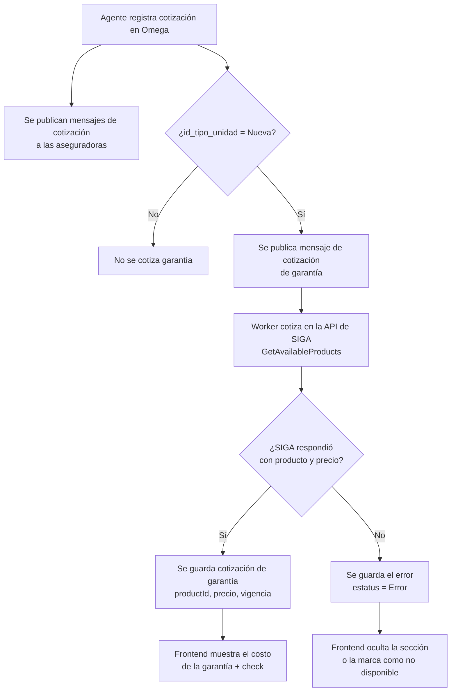
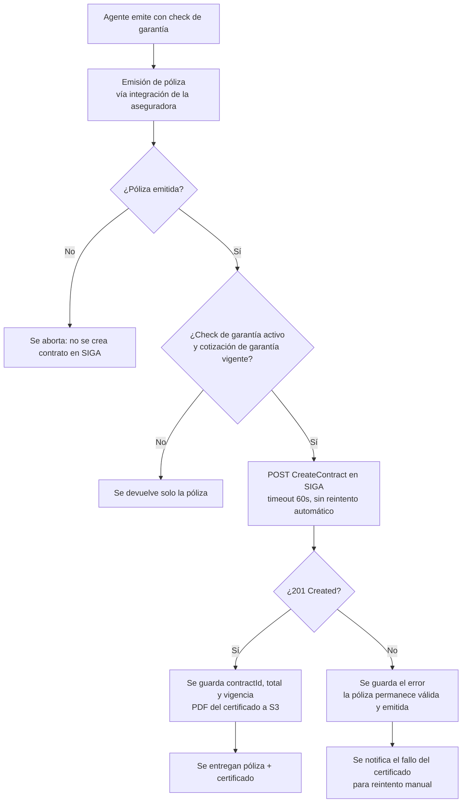

# PRD - Productos Adicionales (Garantía SIGA en Omega)

| **Campo** | **Detalle** |
| --- | --- |
| **Proyecto** | Productos Adicionales — Garantía SIGA en Omega |
| **Folio** | PJ6803 |
| **Área / empresa** | GPLUS Seguros |
| **Versión** | v0.2 |
| **Fecha** | 2026-08-18 |
| **Autores** | Israel Escutia del Moral (patrocinador), Daniela Carbajal Vega (discovery/análisis) |
| **Revisión / liderazgo** | Alexis Herrera |
| **Tipo de proyecto** | Feature web / API |
| **Sistemas afectados** | Omega backend (`gp_seguros`), Omega frontend (`frontend-omega`), API de SIGA (consumo) |

> **Historial de versiones**
>
> - **v0.1 (2026-07-15)** — Versión de discovery. Incluía pago consolidado, cuenta concentradora y repartición interna de pagos.
> - **v0.2 (2026-08-18)** — Ajuste de alcance solicitado por Alexis Herrera. El MVP se reduce a **cotizar y emitir la garantía contra la API de SIGA**. Todo lo relativo a pago consolidado, cuenta concentradora y repartición interna (antes RF-05, RF-06 y Flujo 3) **sale del alcance** y queda como iniciativa separada. Se incorpora la definición técnica de la integración con la API de SIGA y la convención de valores default.

## 1. Resumen ejecutivo

Este proyecto habilita la venta cruzada de productos adicionales propios de GPLUS Seguros dentro del proceso de cotización y emisión de **Omega**, el sistema que usan los agentes de ventas y distribuidores para cotizar y emitir pólizas de seguro de auto con las aseguradoras partner.

Hoy Omega solo cotiza y emite seguros de terceros. No existe mecanismo para ofrecer, junto con la póliza, productos propios de GPLUS Seguros. Los canales de distribución ya existen y cotizan miles de pólizas al mes (~700-1000/mes), pero ese volumen no se traduce en venta de adicionales propios.

El MVP de este PRD cubre un solo producto adicional — la **garantía de neumáticos**, que en SIGA corresponde al tipo de producto *Garantía de Llanta* — ofrecido en la cotización de **autos nuevos** dentro de Omega. El alcance concreto es:

1. **Al cotizar** un vehículo en Omega, si es auto nuevo, el sistema además cotiza el contrato de garantía contra la API de SIGA.
2. **En el frontend** se muestra la información y el costo de ese contrato de garantía junto con las opciones de las aseguradoras, con un check para incluirla o no.
3. **Al emitir**, si el check de garantía quedó activo, se emite la póliza de la aseguradora (integración existente) **y** se crea el contrato de garantía en SIGA, obteniendo su certificado en PDF.

El cobro del adicional **no forma parte de este MVP**: se valida primero el pipeline técnico de cotización y emisión combinada.

**Cotización combinada** → **Selección/deselección del adicional** → **Emisión de póliza + contrato SIGA**

## 2. Contexto y problema

Hoy, en Omega, el proceso de cotización y emisión funciona exclusivamente con los productos de las compañías de seguros con las que GPLUS Seguros tiene acuerdo. El agente cotiza un vehículo, el sistema regresa opciones de aseguradoras con sus primas, y al emitir se genera únicamente la póliza de la aseguradora elegida.

El dolor concreto no es la ausencia de producto — GPLUS Seguros ya tiene productos adicionales operando en SIGA (garantía de llanta, garantía extendida, coberturas segregadas) — sino la **falta de un canal integrado** para ofrecerlos junto con la cotización de seguro.

Se resuelve ahora porque hay una oportunidad de negocio concreta: aprovechar el volumen de cotizaciones que ya pasa por Omega para demostrar, con datos reales, que existe mercado para estos adicionales, y abrir la conversación con las aseguradoras partner para integrarlo en sus propios sistemas.

Distinciones de dominio clave para el equipo de desarrollo:

- **Cotización combinada**: la cotización de la garantía se obtiene de SIGA en paralelo a las cotizaciones de las aseguradoras, y su costo se presenta al agente junto con las opciones de póliza. La garantía **no** es una aseguradora más: es un producto propio con su propio proveedor, su propio precio y su propio documento.
- **Solo autos nuevos**: en Omega el discriminante es `cotizacion.id_tipo_unidad = 1` (`TipoUnidadEnum.TiposUnidad.Nueva`). Si la unidad es seminueva, no se cotiza garantía.
- **Emisión con doble documento**: al emitir se genera (1) la póliza tradicional vía el web service de la aseguradora, y (2) el contrato/certificado de garantía en SIGA vía API REST, con su PDF.
- **La garantía es opcional y no bloqueante**: que SIGA no cotice o no responda no debe impedir la cotización de pólizas. Que el contrato de garantía falle al emitir no debe invalidar una póliza ya emitida.

## 3. Objetivo del producto

Habilitar dentro de Omega la cotización y emisión de un producto adicional propio de GPLUS Seguros (garantía de llanta, vía la API de SIGA) junto con la cotización y emisión de seguros de auto para vehículos nuevos, de forma que el agente vea el costo del adicional desde la cotización y pueda decidir incluirlo al emitir, obteniendo ambos documentos en un solo flujo.

### 3.1 Estrategia de implementación por fases

| **Fase** | **Nombre** | **Descripción** |
| --- | --- | --- |
| Fase 1 | Garantía SIGA en cotización y emisión (MVP — este PRD) | Un solo producto adicional, solo autos nuevos, seleccionable por el agente. Cotización combinada + emisión de doble documento. Sin cobro del adicional. |
| Fase 2 | Cobro del adicional | Pago consolidado, cuenta concentradora y repartición interna del pago entre aseguradora y GPLUS Seguros. Bloqueado por definiciones de finanzas. |
| Fase 3 | Combos de adicionales | Selección de múltiples productos adicionales (garantía extendida, coberturas segregadas, asistencias, protección de robo de autopartes). |

La **Fase 1 es el MVP de este PRD**.

## 4. Usuarios y actores

| **Usuario / Actor** | **Rol en el proceso** |
| --- | --- |
| Agente de ventas / distribuidor | Opera Omega: cotiza, ve el costo de la garantía, explica el producto al cliente, decide incluirla y emite. |
| Cliente final | Recibe ambos documentos (póliza y certificado de garantía). No interactúa con el sistema. |
| Equipo de TI de GPLUS Seguros | Implementa la cotización y emisión combinadas contra la API de SIGA. |
| Garantiplus (proveedor de la API de SIGA) | Entrega credenciales, `projectId`, alta del distribuidor y permisos de perfil para cotizar, crear contrato y descargar PDF. |

## 5. Alcance MVP y funcionalidades

| **Funcionalidad** | **Descripción** |
| --- | --- |
| Cotización de garantía en autos nuevos | Al registrar una cotización de auto nuevo en Omega, el sistema cotiza además el producto de garantía contra `GET /contracts/api/Contracts/v1/GetAvailableProducts` de la API de SIGA, de forma asíncrona y no bloqueante respecto a las cotizaciones de aseguradoras. |
| Persistencia de la cotización de garantía | El resultado (productId, nombre del producto, precio, duración mín/máx) se guarda asociado a la cotización de Omega, junto con el estatus y el error en caso de falla. |
| Consulta de la cotización de garantía | El frontend obtiene la cotización de garantía por un endpoint propio, con el mismo patrón de polling que ya usa para las aseguradoras. |
| Presentación del costo en el frontend | La pantalla de cotización muestra el producto de garantía, su costo y su vigencia, con un check para incluirla. Si SIGA no cotizó, la sección se oculta o se muestra como no disponible, sin romper la pantalla. |
| Check de garantía en emisión | La pantalla de emisión arrastra la decisión tomada en la cotización, permite cambiarla y la envía al backend como parte del payload de emisión. |
| Emisión del contrato en SIGA | Si el check está activo, después de emitir la póliza con éxito el backend crea el contrato en SIGA (`POST /contracts/api/Contracts/v1/CreateContract/{projectId}`), guarda el `contractId`, el total y la vigencia, y almacena el PDF del certificado en S3. |
| Descarga del certificado | El agente puede descargar el PDF del certificado de garantía desde la póliza, igual que ya descarga la póliza y los recibos. |
| Convención de valores default | Los campos que SIGA exige y Omega no tiene se envían con un valor default identificable: `"Valor default"` para texto y `-1` para numérico, de modo que sea evidente en SIGA qué dato no vino del origen. Los ids de catálogo que SIGA valida contra sus propias tablas son la excepción — esos se configuran con valores reales. |

Fuera del MVP: cobro del adicional, selección de múltiples adicionales, integración directa del adicional en el sistema de la aseguradora, autos usados.

## 6. Fuera de alcance

- **Cobro del adicional**: pago consolidado, cuenta concentradora y repartición interna del pago (Fase 2). El certificado se emite sin que Omega registre ni disperse el importe de la garantía.
- **Selección de múltiples adicionales / combos**: Fase 3.
- **Adicionales para autos usados**: el MVP se enfoca exclusivamente en autos nuevos.
- **Integración directa del adicional en el sistema de la aseguradora partner**: objetivo de mediano plazo del negocio, no se construye aquí.
- **Iniciativa "a la inversa"** (SIGA ofreciendo seguros embebidos al emitir una garantía): PRD separado.
- **Alta y mantenimiento de catálogos en SIGA**: los distribuidores, asesores, puntos de venta y productos los configura Garantiplus del lado de SIGA.

## 7. Flujos principales

### Flujo 1 — Cotización combinada

La cotización de la garantía es **independiente y no bloqueante**: viaja por su propio canal y su propio registro. Una falla de SIGA nunca degrada las cotizaciones de pólizas.

### Flujo 2 — Emisión con doble documento

El orden es **póliza primero, contrato después**. La póliza es el producto principal: nunca se pone en riesgo por un fallo del adicional. Un contrato que falló queda registrado con su error para reintentarse desde la póliza, sin volver a emitir.

## 8. Requerimientos funcionales

| **ID** | **Requerimiento** | **Descripción** |
| --- | --- | --- |
| RF-01 | Identificación automática de auto nuevo | El sistema debe identificar cuando una cotización corresponde a un auto nuevo (`id_tipo_unidad = Nueva`) y solo en ese caso disparar la cotización de garantía. |
| RF-02 | Cotización de garantía asíncrona | El sistema debe cotizar el producto de garantía contra la API de SIGA sin bloquear ni condicionar la cotización de las aseguradoras. |
| RF-03 | Persistencia y consulta de la cotización de garantía | El sistema debe guardar el resultado de la cotización de garantía (producto, precio, vigencia, estatus, error) y exponerlo por API para el frontend. |
| RF-04 | Presentación del costo en el frontend | El frontend debe mostrar el nombre del producto de garantía, su costo y su vigencia en la pantalla de cotización, con un check para incluirlo. |
| RF-05 | Arrastre de la decisión a la emisión | La pantalla de emisión debe reflejar la decisión tomada en la cotización, permitir cambiarla y enviarla al backend. |
| RF-06 | Emisión del contrato en SIGA | Al emitir con el check activo, y solo después de que la póliza se emitió con éxito, el sistema debe crear el contrato en SIGA y guardar `contractId`, total y vigencia. |
| RF-07 | Certificado en PDF | El sistema debe obtener el PDF del certificado (de la respuesta de creación o vía `GetContractPdfById`), guardarlo en S3 y permitir su descarga desde la póliza. |
| RF-08 | Tolerancia a fallos del adicional | Un fallo en la cotización o en la creación del contrato de garantía nunca debe invalidar la cotización ni la póliza. El error debe quedar registrado y consultable. |
| RF-09 | Valores default identificables | Los campos requeridos por SIGA que Omega no captura se envían como `"Valor default"` (texto) o `-1` (numérico). Los ids de catálogo validados por SIGA se toman de configuración con valores reales. |
| RF-10 | Reintento manual del contrato | Debe existir forma de reintentar la creación del contrato de garantía sobre una póliza ya emitida cuyo contrato falló, verificando antes por VIN que no se haya creado. |

## 9. Requerimientos no funcionales

| **ID** | **Requerimiento** | **Descripción** |
| --- | --- | --- |
| RNF-01 | Disponibilidad | La cotización y emisión en Omega deben seguir disponibles 24/7 con independencia del estado de la API de SIGA. |
| RNF-02 | Latencia de cotización | La cotización de garantía no debe agregar tiempo perceptible al flujo actual: viaja asíncrona y el frontend la resuelve por polling con el mismo intervalo que las aseguradoras. |
| RNF-03 | Manejo de timeouts en creación de contrato | La creación de contrato en SIGA puede tardar varios segundos: timeout de cliente de al menos 60s y **sin reintento automático** ante timeout (el contrato pudo haberse creado; se verifica por VIN antes de reintentar). |
| RNF-04 | Trazabilidad | Cada llamada a la API de SIGA (cotización y creación de contrato) debe quedar registrada con su request, response y resultado, siguiendo el esquema de logging y OpenTelemetry ya usado en Omega. |
| RNF-05 | Seguridad de datos y secretos | Las credenciales de la API de SIGA y el `projectId` se manejan por variable de entorno / AWS Secrets Manager, nunca en `appsettings.json`. Los datos personales enviados a SIGA (RFC, domicilio, VIN) no se registran en logs. |
| RNF-06 | Caché de catálogos | Los catálogos de SIGA (marcas, modelos, estados, municipios, colonias, tipos de uso, propulsión) cambian poco: se consultan y se guardan en caché con refresco periódico. La cotización nunca se cachea. |

## 10. Integraciones y datos

| **Integración / Fuente** | **Uso esperado** |
| --- | --- |
| Web service de la aseguradora | Integración ya existente. Cotiza y emite la póliza tradicional. **No requiere cambios.** |
| API de SIGA — autenticación | `POST /authentication/api/Auth/v1/Login` → `accessToken` (JWT Bearer, `expiresIn` en segundos). Token cacheado y renovado antes de expirar. |
| API de SIGA — catálogos | `/catalogs/...` para resolver dealer, punto de venta, canal de venta, asesor, marca, modelo, tipo de uso, propulsión, estado, municipio, colonia y tipo de producto. OData con paginación. |
| API de SIGA — cotización | `GET /contracts/api/Contracts/v1/GetAvailableProducts` → `productId`, `productName`, `price`, `minMonths`, `maxMonths`. El `productId` es obligatorio para crear el contrato y no debe fijarse en código. |
| API de SIGA — creación de contrato | `POST /contracts/api/Contracts/v1/CreateContract/{projectId}` → `201` con `contractId`, `status`, vigencia, `total` y `pdfBase64` (puede venir en `null`). |
| API de SIGA — PDF y consultas | `GET /contracts/api/Contracts/v1/GetContractPdfById/{contractId}` y `GetAllContracts` (OData, filtrable por VIN) para verificación antes de reintentar. |
| S3 | Almacenamiento del PDF del certificado, en el mismo bucket y patrón que ya usan las pólizas. |

Ambientes de la API de SIGA: QA `https://qa-siga-api.garantiplus.com` · Producción `https://siga-api.garantiplus.com`.

### 10.1 Datos requeridos por SIGA y su origen en Omega

**Cotización** (`GetAvailableProducts`):

| Campo SIGA | Origen en Omega |
| --- | --- |
| `ProductTypeId` | Configuración (tipo de producto de garantía de llanta) |
| `DealerId` | Configuración (distribuidor de Omega en SIGA) |
| `BrandId` | Mapeo desde `marca_vehiculo` de la versión cotizada |
| `VehicleYear` | `cotizacion.anho_auto` |
| `RegistrationDate` | Fecha de factura del vehículo; en auto nuevo se asume la fecha de registro de la cotización |
| `Duration`, `TireDuration` | Configuración (duración default de la garantía en meses) |
| `TireCount` | Configuración (default 4) |
| `HasFactoryWarranty`, `ServicesOnTime` | Configuración (auto nuevo: `true`) |
| `MonthsWithoutInterest` | `0` |

**Creación de contrato** (`CreateContract`) — bloques `channel`, `beneficiary`, `vehicle`, `product`, `tireLines`:

| Bloque | Campos con origen real en Omega | Campos sin origen (valor default) |
| --- | --- | --- |
| `channel` | — | `dealerId`, `salesChannelId`, `pointOfSaleId`, `advisorId` desde configuración (ids reales de SIGA) |
| `beneficiary` | `personType`, nombre/apellidos o razón social, `rfc`, `phone`, `email`, `postalCode`, `stateId`, `municipalityId`, `colonyName`, `address`, `birthDate`/`constitutionDate` — todos capturados en la emisión de Omega | `colonyId` (se envía `colonyName` en su lugar) |
| `vehicle` | `brandId`, `modelId`, `versionText`, `year`, `vin`, `engineNumber`, `licensePlate`, `usageTypeId`, `propulsionTypeId`, `purchaseDate` | `kilometers`, `horsepower`, `cubicCapacity` → `-1` cuando no existan en Omega |
| `product` | `productTypeId`, `productId` (de la cotización), `startDate`, `durationMonths` | `hasFactoryWarranty`, `hasTimelyServices` desde configuración |
| `tireLines` | — | `tireBrand`, `tireModel`, `tireSize`, `dot` → `"Valor default"`; `quantity` desde configuración (4) |

> **Nota sobre `-1` y `"Valor default"`**: aplica solo a campos de formato libre o numéricos que SIGA no valida contra un catálogo. Los ids que SIGA sí valida (`dealerId`, `advisorId`, `stateId`, `municipalityId`, `brandId`, `modelId`, `usageTypeId`, `propulsionTypeId`) **no admiten `-1`**: SIGA responde `400` con `"... con ID -1 no encontrado"`. Esos se resuelven por mapeo o configuración con valores reales.

### 10.2 Reglas y validaciones de SIGA a respetar

- `personType` debe ser exactamente `"Fisica"` o `"Moral"` — sin acento, con mayúscula inicial.
- `vin` de 17 caracteres, mayúsculas, sin espacios.
- `rfc` de 12 a 13 caracteres.
- Persona física: mayor de 18 años.
- `startDate` no puede ser anterior a hoy.
- `durationMonths` dentro de `minMonths`–`maxMonths` del producto cotizado.
- Año del vehículo entre (año actual − 30) y (año actual + 1).
- Coherencia de catálogos: el municipio debe pertenecer al estado, el modelo a la marca, el asesor y el punto de venta al distribuidor.
- `409 Conflict` si ya existe un contrato vigente con el mismo VIN cuya vigencia se empalma.

## 11. Eventos para BI

- `cotizacion_garantia_solicitada`: se solicita la cotización de garantía para una cotización de auto nuevo.
- `cotizacion_garantia_obtenida`: SIGA devolvió producto y precio.
- `cotizacion_garantia_error`: SIGA no devolvió producto (con el motivo).
- `garantia_incluida` / `garantia_excluida`: decisión del agente al momento de emitir.
- `contrato_garantia_emitido`: contrato creado en SIGA (incluye `contractId` y total).
- `contrato_garantia_error`: la creación del contrato falló después de una póliza emitida.

Cada evento debe incluir como mínimo: fecha/hora, `id_cotizacion` y/o `id_poliza`, agente/distribuidor, monto y resultado (éxito/error).

## 12. Métricas de éxito

| **Métrica** | **Descripción** |
| --- | --- |
| % de cotizaciones de autos nuevos con cotización de garantía exitosa | Salud de la integración con SIGA. Meta inicial: ≥ 95%. |
| % de emisiones de autos nuevos que incluyen la garantía | Tasa de adopción del producto. Línea base y meta pendientes con BI/operación. |
| Número de contratos de garantía emitidos al mes vía Omega | Volumen de venta del adicional. Línea base y meta pendientes con BI/operación. |
| % de contratos de garantía que fallan tras una póliza emitida | Debe tender a 0. Cada caso requiere reintento manual. |
| Tiempo adicional en el flujo de emisión | La emisión con garantía no debe tardar significativamente más que la emisión sin garantía. |

## 13. Riesgos y supuestos

### Riesgos

| **Riesgo** | **Impacto potencial** | **Mitigación** |
| --- | --- | --- |
| La póliza se emite pero el contrato en SIGA falla | El cliente pagó/contrató una garantía sin certificado | Orden póliza→contrato, registro del error y reintento manual verificando por VIN (RF-10) |
| `tireLines` con valores default | El certificado sale con datos de llanta no reales | Decisión de negocio ya tomada: valores default identificables (`"Valor default"`). Si negocio requiere datos reales, se agrega captura en emisión (fase posterior) |
| Mapeo de marca/modelo Omega ↔ SIGA incompleto | `BrandId` incorrecto cambia el precio cotizado; `modelId` inválido rechaza el contrato | Mapeo explícito con caché, y registro de error claro cuando no hay correspondencia |
| Permisos del perfil de la cuenta de SIGA incompletos | `403` con token válido en cotización, creación de contrato o descarga de PDF | Validar con Garantiplus el flujo completo antes de iniciar desarrollo |
| Timeout en `CreateContract` con contrato creado | Contratos duplicados si se reintenta a ciegas | Timeout ≥ 60s, sin reintento automático, verificación por VIN antes de cualquier reintento |
| Latencia de SIGA en la cotización | El agente no ve el costo de la garantía a tiempo | Flujo asíncrono con polling; la ausencia de garantía no bloquea la cotización |

### Supuestos

| **Supuesto** | **Descripción** |
| --- | --- |
| Garantiplus entrega credenciales, `projectId` y perfil con permisos completos | Sin esto no hay integración posible. Es prerequisito duro. |
| El distribuidor de Omega ya está dado de alta en SIGA con su producto de garantía habilitado | `GetProductTypesByDealer` y `GetAvailableProducts` deben devolver resultados para ese distribuidor. |
| Omega captura en la emisión los datos del beneficiario que SIGA exige | RFC, teléfono, email, CP, estado, municipio, colonia, dirección, fecha de nacimiento/constitución, VIN y número de motor ya existen en el formulario de emisión. |
| La integración con el web service de la aseguradora no requiere cambios | Se usa tal como existe hoy. |
| El cobro del adicional se resuelve en una fase posterior | El MVP emite el certificado sin registrar ni dispersar su importe. |

## 14. Preguntas abiertas

| **Tema** | **Pregunta abierta** |
| --- | --- |
| Producto | ¿Cuál es el `productTypeId` y la duración default (meses) del producto de garantía que se ofrecerá vía Omega? — pendiente con negocio/Garantiplus |
| Catálogos SIGA | ¿Qué `dealerId`, `salesChannelId`, `pointOfSaleId`, `advisorId` y `projectId` se usarán? ¿Un distribuidor único para Omega o uno por agencia? — pendiente con Garantiplus |
| Certificado | ¿El certificado con datos de llanta default es aceptable para negocio y para el cliente final, o se requerirá captura real en una fase posterior? |
| Reintento | ¿El reintento del contrato fallido lo hace Mesa de Control desde la póliza, o se automatiza con un proceso de barrido? |
| Métricas | Línea base y metas numéricas de adopción — pendiente de validar con BI/operación |
| Alcance relacionado | La iniciativa "a la inversa" (SIGA ofreciendo seguros embebidos al emitir una garantía) queda como PRD separado — pendiente de decidir si se prioriza |
