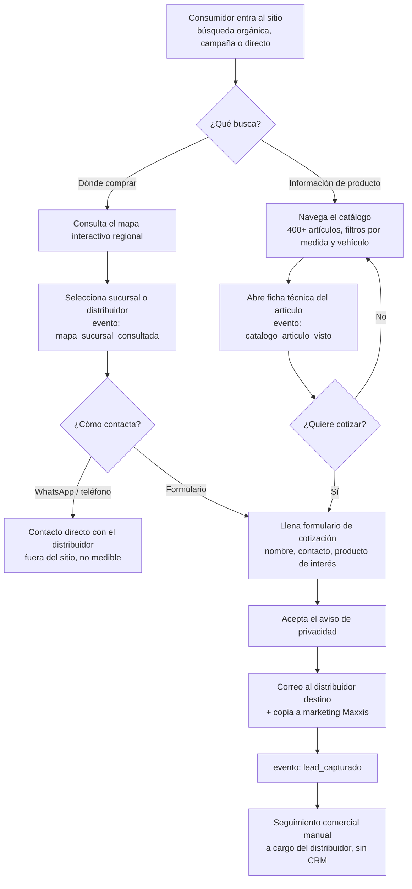
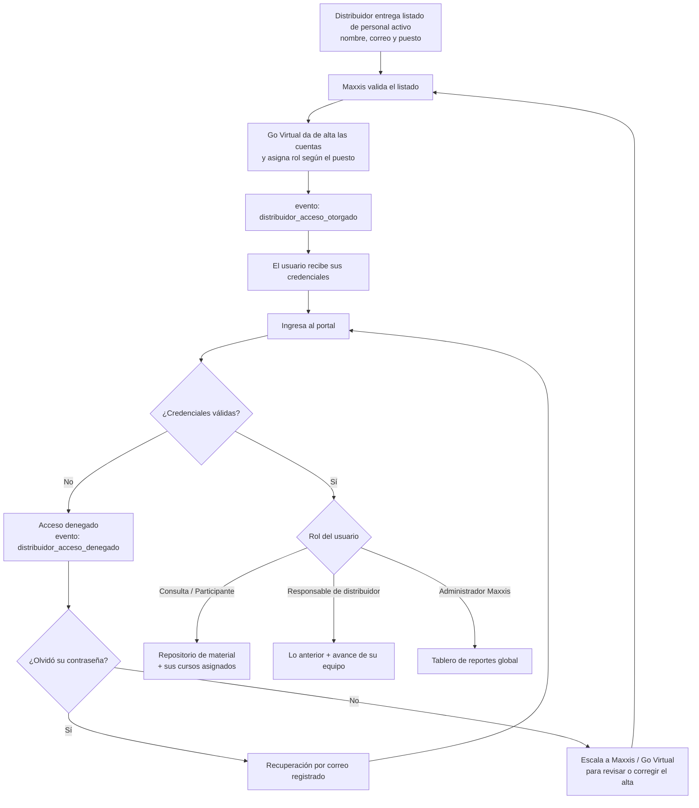
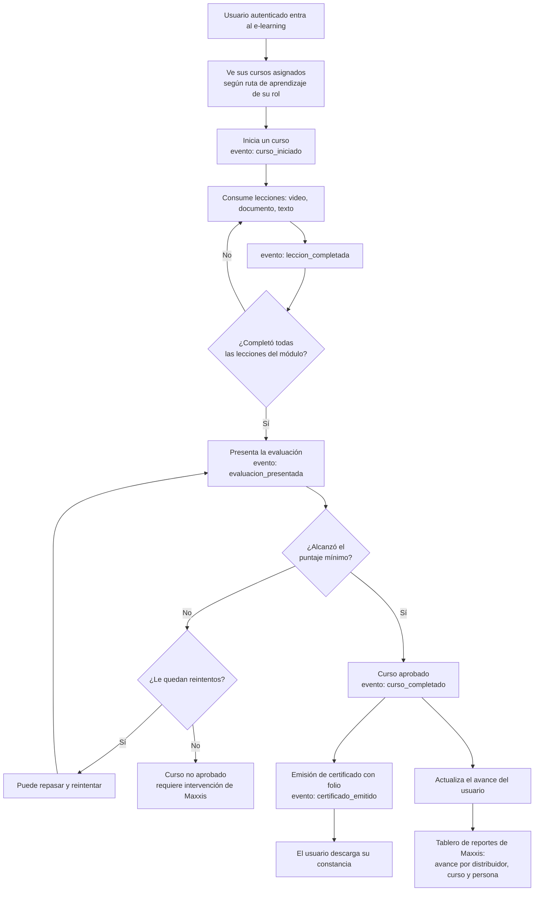

# PRD - Ecosistema Digital Maxxis México y LatAm

| **Campo** | **Detalle** |
| --- | --- |
| **Proyecto** | Ecosistema Digital Maxxis — Sitio Web, Portal de Distribuidor y Plataforma de E-learning |
| **Área / empresa** | Go Virtual (Oficina de Proyecto) — Cliente: Grupo Maxxis |
| **Versión** | v0.3 |
| **Fecha** | 14 de agosto de 2026 |
| **Solicita / patrocina** | Antonio — Líder de Mercadotecnia, Maxxis México y LatAm |
| **Autores** | Equipo de Oficina de Proyecto, Go Virtual |
| **Revisión / liderazgo** | Aldo Álvarez, Director de TI |
| **Tipo de proyecto** | Feature web/API (desarrollo nuevo) |

> **Cómo leer este documento.** El proyecto tiene **alcance único**: sitio público, portal de distribuidor y plataforma de e-learning forman un solo desarrollo contratado como un todo. La liberación es escalonada en **dos hitos**: **H1** (salida en vivo del sitio y el portal, 30 de septiembre de 2026) y **H2** (plataforma de e-learning). Las tablas de funcionalidades, requerimientos, integraciones, eventos y métricas llevan columna **Hito** para permitir estimar cada bloque por separado sin fragmentar el alcance.

## 1. Resumen ejecutivo

Este proyecto consiste en el desarrollo del ecosistema digital propio de Grupo Maxxis para México y América Latina, región que hoy no cuenta con un canal digital unificado. El ecosistema atiende a dos audiencias con necesidades distintas dentro de un mismo sitio: el consumidor final, con contenido informativo orientado a generar interés y adquisición, y el personal de los distribuidores, mediante un área de acceso restringido dedicada a la consulta de material y a la capacitación formal.

Hoy Maxxis no cuenta con un sitio adaptado a la región. La información de producto y de sucursales no está centralizada, el consumidor no tiene forma de localizar dónde comprar, y no existe un espacio formal de capacitación para el personal de los distribuidores, lo que limita su nivel de conocimiento de producto y la consistencia de la experiencia comercial que ofrecen. El proyecto responde a un driver con fecha firme: Maxxis busca salir en vivo con el sitio el **30 de septiembre de 2026**.

El alcance contratado comprende un **único sitio regional en español** que da servicio tanto a México como a los países de LatAm donde Maxxis opera, e incluye: sitio informativo de marca y producto; catálogo público de más de 400 artículos con ficha técnica completa; mapa interactivo de sucursales y distribuidores; formularios de contacto y cotización cuyos leads se rutean por correo al distribuidor con copia a Maxxis; portal de acceso restringido para personal de distribuidores con repositorio de material descargable; y una **plataforma de e-learning desarrollada a medida** dentro del mismo sitio, con cursos, lecciones en video, evaluaciones calificadas, seguimiento de progreso, emisión de certificados, rutas de aprendizaje por rol y tablero de reportes de avance para Maxxis. La plataforma de e-learning es la pieza de mayor valor percibido por el cliente y comparte el mismo control de usuarios que el portal.

La entrega se escalona en dos hitos: **H1** libera el sitio público y el portal de distribuidor el 30 de septiembre de 2026; **H2** libera la plataforma de e-learning, cuya fecha se define a partir de la estimación de este documento. **La integración de un CRM queda fuera del alcance por confirmación del cliente.**

El resultado esperado es que Maxxis cuente con un ecosistema digital propio para la región que profesionalice la capacitación de su canal, mejore la experiencia informativa del consumidor final y canalice la demanda hacia sus distribuidores, con trazabilidad de qué se consulta, quién se capacita y qué contactos comerciales genera el sitio.

**Consumidor explora catálogo y mapa → Envía cotización que se rutea al distribuidor → El personal del distribuidor entra con su cuenta → Consulta material y toma cursos → Aprueba evaluaciones y obtiene certificado → Maxxis mide el avance de capacitación de su canal**

## 2. Contexto y problema

Actualmente Maxxis no tiene un sitio web propio para México y América Latina. La información de producto y de sucursales no está centralizada en un canal digital regional, y no existe un sistema de gestión de leads ni un espacio formal de capacitación para el canal.

El dolor concreto es triple: (1) falta de un canal informativo adaptado a la región para el consumidor final, que hoy no tiene dónde consultar el producto ni dónde comprarlo; (2) ausencia de un espacio formal de consulta de material para el personal de los distribuidores; y (3) inexistencia de un mecanismo de capacitación estructurado y medible, que es precisamente la necesidad que el cliente prioriza — hoy Maxxis no puede saber si el personal que vende su producto conoce el producto.

El proyecto se resuelve ahora por un driver de negocio con fecha definida: Maxxis busca la salida en vivo del sitio el 30 de septiembre de 2026. Antonio, como líder de mercadotecnia de la región, es quien lidera la decisión, aunque importadores y distribuidores también influyen en ella.

**Distinciones clave del dominio** que el equipo de desarrollo debe entender desde el día 1:

- **Consumidor final vs. personal de distribuidor.** Dos audiencias con niveles de acceso distintos dentro del mismo sitio: contenido público orientado a la adquisición, y zona restringida orientada a la capacitación. Esta distinción determina el esquema de accesos y la arquitectura de información.
- **Distribuidor (entidad comercial) vs. personal del distribuidor (usuario).** El acceso no se otorga al distribuidor como empresa sino a cada persona de su plantilla activa, con credenciales individuales. Toda la trazabilidad de capacitación y de descargas depende de esta distinción: un certificado se emite a una persona, no a una empresa.
- **Repositorio de material vs. plataforma de e-learning.** Son dos capacidades distintas que conviven en el portal. El **repositorio** entrega material descargable organizado, sin registrar avance. El **e-learning** estructura ese conocimiento en cursos con lecciones, evalúa, registra progreso y certifica. Confundirlos subestima el esfuerzo del proyecto: el segundo es un desarrollo sustancialmente mayor que el primero.
- **Consulta vs. acreditación.** Descargar un documento no acredita conocimiento; aprobar una evaluación sí. El valor que Maxxis busca está en la acreditación, y de ahí que el módulo de evaluaciones y certificados no sea accesorio.

## 3. Objetivo del producto

Dar a Maxxis México y LatAm un ecosistema digital propio que informe al consumidor final sobre marca y producto y lo dirija al distribuidor más cercano, y que a la vez profesionalice la capacitación de su canal mediante una plataforma de e-learning propia, con acreditación medible del conocimiento de producto del personal que lo comercializa — operando el sitio en vivo el 30 de septiembre de 2026 y liberando el e-learning en un segundo hito del mismo proyecto.

### 3.1 Alcance único e hitos de liberación

El proyecto **no se fragmenta en fases contratadas por separado**: es un alcance único con entrega escalonada. La distinción entre hitos existe para permitir la salida en vivo comprometida y para que la planeación pueda estimar y secuenciar el trabajo.

| **Hito** | **Nombre** | **Contenido** | **Fecha** |
| --- | --- | --- | --- |
| H1 | Sitio público y Portal de Distribuidor | Sitio informativo regional, catálogo de más de 400 artículos con ficha técnica, mapa interactivo de sucursales, formularios de contacto/cotización con ruteo de leads, portal de acceso restringido con repositorio de material descargable y control de usuarios por roles. | 30 de septiembre de 2026 (comprometida) |
| H2 | Plataforma de E-learning | Cursos con lecciones y video, evaluaciones con calificación automática, seguimiento de progreso, emisión de certificados, rutas de aprendizaje por rol y tablero de reportes de avance para Maxxis. Construida a medida sobre la misma plataforma y el mismo control de usuarios de H1. | Por definir a partir de la estimación de este PRD |

> **Nota para planeación.** El cronograma debe dimensionar y visualizar los tiempos de desarrollo de **todo el alcance, H1 y H2 completos**, para dar visibilidad del esfuerzo total del ecosistema digital. El compromiso de fecha del 30 de septiembre de 2026 aplica exclusivamente a la liberación de H1; la fecha de H2 es un resultado de la estimación, no un dato de entrada. El cronograma detallado se gestiona fuera de este PRD.

## 4. Usuarios y actores

| **Usuario / Actor** | **Rol en el proceso** |
| --- | --- |
| Consumidor final | Visita el sitio con fines informativos y de adquisición; consulta el catálogo, localiza sucursales en el mapa y envía solicitudes de cotización o contacto. |
| Personal de distribuidor — consulta | Accede al portal con credenciales individuales para consultar y descargar material de producto y capacitación. |
| Personal de distribuidor — participante de cursos | Toma cursos asignados según su rol, presenta evaluaciones y obtiene certificados. Es el mismo usuario que el anterior, con permisos de e-learning habilitados. |
| Distribuidor — responsable de canal | Entrega y mantiene actualizado el listado de personal activo (nombre, correo y puesto) que debe tener acceso; recibe los leads generados por el sitio y les da seguimiento comercial; consulta el avance de capacitación de su equipo. |
| Maxxis (Antonio / equipo de marketing) | Provee el contenido del sitio, el material y los insumos de los cursos; valida los listados de personal antes del alta; recibe copia de los leads; consulta el tablero de avance de capacitación por distribuidor; cuenta con acceso de lectura sobre el contenido publicado. |
| Go Virtual — equipo de proyecto | Desarrolla y opera la plataforma; carga y actualiza contenido, material y cursos en el back office; da de alta y baja las cuentas del portal; administra los roles; ofrece mantenimiento mensual post-lanzamiento. |
| Go Virtual — analítica | Configura la instrumentación de eventos y los reportes de tráfico, leads y adopción de capacitación. |

## 5. Alcance y funcionalidades

### 5.1 Sitio público

| **Funcionalidad** | **Descripción** | **Hito** |
| --- | --- | --- |
| Sitio informativo regional | Páginas de marca y producto orientadas al consumidor final, en un solo sitio en español que da servicio a México y a los países de LatAm donde Maxxis opera. | H1 |
| Catálogo público de productos | Catálogo navegable de más de 400 artículos, visible a cualquier visitante, con ficha técnica completa por artículo (medidas, aplicación, especificaciones e imágenes). | H1 |
| Búsqueda y filtrado del catálogo | Filtros por medida y por tipo de vehículo/aplicación, y búsqueda directa de artículo. | H1 |
| Mapa interactivo de sucursales | Localizador de sucursales y distribuidores de la región, con dirección, coordenadas, horarios, teléfono, WhatsApp, redes sociales y correo de contacto por distribuidor y departamento. | H1 |
| Formularios de contacto y cotización | Captura de leads (nombre, contacto, mensaje/producto de interés) con aceptación del aviso de privacidad. | H1 |
| Ruteo de leads por correo | Cada lead se envía por correo al distribuidor/sucursal destino, con copia al equipo de marketing de Maxxis. El seguimiento comercial posterior es manual. | H1 |
| Aviso de privacidad y consentimiento | Aviso publicado y consentimiento explícito en todo formulario que recabe datos personales. | H1 |

### 5.2 Portal de distribuidor

| **Funcionalidad** | **Descripción** | **Hito** |
| --- | --- | --- |
| Acceso restringido con login único | Zona separada del contenido público, con autenticación individual. Un mismo acceso habilita tanto el repositorio de material como el e-learning. | H1 |
| Roles y perfiles de usuario | Perfiles diferenciados: consulta de material, participante de cursos, responsable de distribuidor (ve el avance de su equipo) y administrador (Maxxis/Go Virtual, ve reportes y administra). | H1 |
| Alta manual de usuarios | El distribuidor entrega su listado de personal activo (nombre, correo y puesto); Maxxis lo valida y Go Virtual da de alta cada cuenta individual. No hay autoregistro. | H1 |
| Recuperación de acceso | Restablecimiento autónomo de contraseña mediante el correo registrado, sin intervención de Maxxis ni Go Virtual. | H1 |
| Repositorio de material | Documentos, videos y guías descargables y organizados por categoría. Incluye la migración del material existente de Maxxis (~4TB). | H1 |

### 5.3 Plataforma de e-learning

| **Funcionalidad** | **Descripción** | **Hito** |
| --- | --- | --- |
| Estructura de cursos | Modelo curso → módulos → lecciones, con contenido en video, documento y texto enriquecido, organizado por línea de producto o tema. | H2 |
| Reproducción de lecciones en video | Consumo de video dentro del curso, con registro de la lección como vista o completada. | H2 |
| Evaluaciones y calificación | Cuestionarios por módulo o curso, con banco de preguntas, calificación automática, puntaje mínimo aprobatorio y política de reintentos. | H2 |
| Seguimiento de progreso | Avance por usuario y por curso: lecciones completadas, porcentaje de avance, cursos aprobados y pendientes, visible para el propio usuario. | H2 |
| Emisión de certificados | Constancia descargable emitida a nombre de la persona al aprobar un curso, con folio verificable. | H2 |
| Rutas de aprendizaje por rol | Asignación de cursos obligatorios y opcionales según el puesto del usuario (por ejemplo vendedor, técnico, gerente), de modo que cada persona vea lo que le corresponde. | H2 |
| Tablero de reportes para Maxxis | Vista de avance de capacitación por distribuidor, por curso y por persona, para que Maxxis mida la cobertura de capacitación de su canal. | H2 |
| Back office de autoría de cursos | Herramienta interna para que Go Virtual cree cursos, cargue lecciones y construya evaluaciones a partir del contenido que Maxxis provee. | H2 |

**Principio rector del alcance.** El sistema **informa, capacita y acredita, pero no otorga accesos ni transacciona por su cuenta**: no da acceso al portal sin aprobación humana de Maxxis, no emite cotizaciones en firme ni precios comprometidos, y no cierra ventas. La única decisión que el sistema sí automatiza es la **calificación de evaluaciones y la emisión del certificado correspondiente**, conforme a reglas explícitas de puntaje mínimo definidas por Maxxis; toda otra decisión comercial o de acceso permanece en manos de una persona.

## 6. Fuera de alcance

- **Integración de CRM**: excluida del proyecto por confirmación expresa del cliente. Los leads se rutean por correo y su gestión posterior es manual, con el proceso comercial del distribuidor. Una integración futura requeriría un PRD propio.
- **E-commerce / compra en línea**: el sitio es informativo y dirige al distribuidor físico, sin venta directa en línea.
- **Publicación de precios y disponibilidad de inventario**: el sitio no muestra precios ni stock, porque esa información la controla cada distribuidor y Maxxis no puede comprometerla de forma centralizada.
- **Sitio multi-idioma**: el ecosistema se publica únicamente en español, incluidos los cursos del e-learning. Portugués u otros idiomas quedarían fuera y requerirían ampliación de alcance en sitio, catálogo y contenido de cursos.
- **Autogestión de cursos por parte de Maxxis**: el back office de autoría es operado por Go Virtual. Que el equipo de Maxxis cree y publique sus propios cursos de forma autónoma no entra en este alcance.
- **Automatización del alta de distribuidores**: el alta es manual y validada por Maxxis. Un flujo de aprobación automatizado podría evaluarse una vez estabilizado el proceso manual.
- **Aplicación móvil nativa**: la experiencia móvil se resuelve con diseño responsive sobre el mismo sitio.
- **Certificación con validez oficial ante terceros**: los certificados acreditan capacitación interna de Maxxis; no constituyen una certificación oficial ni tienen validez ante organismos externos.

## 7. Flujos principales

### 7.1 Flujo del consumidor final

El flujo público tiene dos puntos de entrada que convergen en el mismo desenlace comercial: quien llega buscando producto termina en la ficha técnica, y quien llega buscando dónde comprar termina en el mapa. Ambos caminos desembocan en el formulario de cotización o en un contacto directo por WhatsApp/teléfono con el distribuidor. Esa bifurcación final importa para las métricas: el contacto directo **sale del sitio y no es medible**, por lo que la métrica de leads solo captura la porción que pasa por formulario — un sesgo que debe considerarse al fijar metas con Maxxis.

Sin CRM, el correo al distribuidor con copia a Maxxis es el **único registro** del lead y el seguimiento depende enteramente del proceso manual del distribuidor. El sistema no confirma que el lead haya sido atendido, y esa limitación es una decisión consciente del cliente, no una omisión del diseño.

### 7.2 Flujo de alta y acceso del personal de distribuidor

La cadena de alta es enteramente humana — el distribuidor propone, Maxxis valida, Go Virtual ejecuta — de modo que el sistema nunca otorga acceso por sí mismo, en línea con el principio rector. El **puesto** que el distribuidor reporta no es un dato administrativo menor: determina el rol del usuario y, con él, la ruta de aprendizaje que verá en el e-learning. Un listado sin puestos correctos deja a las personas sin cursos asignados.

El manejo de excepciones evita que el portal genere carga operativa insostenible: sin autoservicio de contraseña, **cada olvido se convierte en un ticket manual**. Por eso la recuperación por correo registrado se incluye desde H1, y el escalamiento humano queda reservado a altas incorrectas o personal no incluido en el listado. El bucle de retorno hacia la validación de Maxxis refleja que el listado de personal activo es un dato vivo: las altas y bajas del distribuidor deben reflejarse en el portal, o personal que ya no labora conservará acceso.

### 7.3 Flujo de capacitación y acreditación

Este es el flujo que concentra el valor del proyecto para el cliente y el grueso del esfuerzo de desarrollo. A diferencia del repositorio de material, aquí el sistema **mantiene estado por usuario**: qué lección vio, qué evaluación presentó, con qué calificación, cuántos reintentos le quedan y qué certificados tiene. Ese estado es lo que alimenta el tablero de Maxxis y lo que convierte la capacitación en algo medible.

Hay dos puntos de diseño que deben resolverse antes del desarrollo y que impactan directamente la estimación. El primero es la **política de reintentos**: qué ocurre cuando alguien agota sus intentos sin aprobar — si se bloquea, si requiere que Maxxis lo reactive, o si simplemente puede volver a intentarlo tras un periodo. El segundo es la **vigencia de la acreditación**: si un certificado caduca y obliga a recertificar, el sistema necesita manejar temporalidad de la acreditación, lo que agrega complejidad relevante. Ambos están registrados en la sección 14.

## 8. Requerimientos funcionales

### 8.1 Sitio público

| **ID** | **Requerimiento** | **Descripción** | **Hito** |
| --- | --- | --- | --- |
| RF-01 | Sitio informativo regional | Contenido de marca y producto orientado a consumidor final, en español, cubriendo México y los países de LatAm donde Maxxis opera. | H1 |
| RF-02 | Catálogo público de productos | Catálogo navegable de más de 400 artículos visible sin autenticación, con ficha técnica completa por artículo (medidas, aplicación, especificaciones e imágenes). | H1 |
| RF-03 | Búsqueda y filtrado del catálogo | Filtrado por al menos medida y tipo de vehículo/aplicación, y búsqueda directa de artículo. | H1 |
| RF-04 | Mapa interactivo de sucursales | Localización de sucursales y distribuidores de la región mediante mapa interactivo, con dirección, coordenadas, horarios, contacto y redes por distribuidor y departamento. | H1 |
| RF-05 | Formularios de contacto y cotización | Formularios que capturen datos básicos del lead (nombre, contacto, mensaje/producto de interés). El detalle final de campos por formulario está pendiente de validar (ver sección 14). | H1 |
| RF-06 | Ruteo de leads por correo | Envío de cada lead al distribuidor/sucursal destino correspondiente, con copia al equipo de marketing de Maxxis. | H1 |
| RF-07 | Aviso de privacidad y consentimiento | Todo formulario que recabe datos personales debe presentar el aviso de privacidad y requerir consentimiento explícito antes del envío. | H1 |
| RF-08 | Gestión de contenido | Go Virtual debe poder cargar y actualizar, desde el back office, el contenido público, el catálogo, los datos de sucursales y el material del portal. | H1 |
| RF-09 | Instrumentación de eventos | Registro de los eventos definidos en la sección 11 con sus campos mínimos, en zona pública y restringida. | H1 |

### 8.2 Portal de distribuidor y control de acceso

| **ID** | **Requerimiento** | **Descripción** | **Hito** |
| --- | --- | --- | --- |
| RF-10 | Zona de acceso restringido | Área separada del contenido público, no accesible ni indexable sin autenticación. | H1 |
| RF-11 | Autenticación con login único | Credenciales individuales por persona que habilitan tanto el repositorio de material como el e-learning, sin necesidad de un segundo registro. | H1 |
| RF-12 | Roles y permisos | Perfiles de consulta, participante de cursos, responsable de distribuidor y administrador, con visibilidad y capacidades diferenciadas. | H1 |
| RF-13 | Alta y baja manual de usuarios | Alta de cuentas individuales a partir del listado de personal activo (nombre, correo y puesto) validado por Maxxis, y baja de cuentas cuando el personal deja de laborar. El sistema no debe permitir autoregistro. | H1 |
| RF-14 | Recuperación de acceso | Restablecimiento autónomo de contraseña mediante el correo registrado. | H1 |
| RF-15 | Repositorio de material | Repositorio organizado y navegable por categoría de documentos, videos y guías descargables, alimentado con el material existente de Maxxis. | H1 |

### 8.3 Plataforma de e-learning

| **ID** | **Requerimiento** | **Descripción** | **Hito** |
| --- | --- | --- | --- |
| RF-16 | Estructura de cursos | Modelo curso → módulos → lecciones, con contenido en video, documento y texto enriquecido. | H2 |
| RF-17 | Consumo de lecciones | Reproducción de video y visualización de contenido dentro de la lección, con registro de lección vista/completada por usuario. | H2 |
| RF-18 | Banco de preguntas y evaluaciones | Construcción de evaluaciones por módulo o curso a partir de un banco de preguntas, con distintos tipos de reactivo. | H2 |
| RF-19 | Calificación automática | Calificación automática de la evaluación contra un puntaje mínimo aprobatorio configurable, con registro del resultado por intento. | H2 |
| RF-20 | Política de reintentos | Control del número de intentos permitidos por evaluación y del comportamiento al agotarlos. La política concreta está pendiente de definir (ver sección 14). | H2 |
| RF-21 | Seguimiento de progreso | Registro y visualización del avance por usuario y curso: lecciones completadas, porcentaje de avance, cursos aprobados y pendientes. | H2 |
| RF-22 | Emisión de certificados | Generación de constancia descargable a nombre de la persona al aprobar el curso, con folio verificable y fecha de emisión. | H2 |
| RF-23 | Rutas de aprendizaje por rol | Asignación automática de cursos obligatorios y opcionales según el puesto/rol del usuario. | H2 |
| RF-24 | Tablero de reportes de capacitación | Vista para Maxxis del avance por distribuidor, por curso y por persona, con posibilidad de exportar. | H2 |
| RF-25 | Back office de autoría | Herramienta interna para que Go Virtual cree y publique cursos, cargue lecciones y construya evaluaciones a partir del contenido de Maxxis. | H2 |
| RF-26 | Instrumentación de eventos de capacitación | Registro de los eventos de e-learning definidos en la sección 11. | H2 |

## 9. Requerimientos no funcionales

| **ID** | **Requerimiento** | **Descripción** | **Hito** |
| --- | --- | --- | --- |
| RNF-01 | Disponibilidad 24/7 | El sitio público debe estar disponible de forma continua, sin ventanas de mantenimiento que afecten al consumidor final. | H1 |
| RNF-02 | Stack y despliegue | Desarrollo sobre Next.js (App Router) con despliegue en Vercel, alineado al stack estándar de Go Virtual. | H1 |
| RNF-03 | Almacenamiento y entrega de archivos | Alojamiento en S3 del material existente (~4TB de documentos, video e imágenes) con entrega por CDN, dimensionado para soportar además el contenido de los cursos. | H1 |
| RNF-04 | Separación de acceso público/restringido | El contenido del portal y del e-learning debe estar aislado del contenido público y no ser accesible ni indexable sin autenticación. | H1 |
| RNF-05 | Autenticación y manejo de sesión | Credenciales individuales, cierre de sesión y expiración por inactividad. No se permiten cuentas compartidas por distribuidor. | H1 |
| RNF-06 | Trazabilidad | Registro consultable de accesos, descargas de material y actividad de capacitación, con fecha/hora y usuario. | H1 |
| RNF-07 | Privacidad y cumplimiento | Cumplimiento de la LFPDPPP (México) en el manejo de datos de leads y de personal: aviso de privacidad publicado, consentimiento explícito, finalidad declarada y atención de derechos ARCO. La normativa aplicable en los demás países de la región está pendiente de definir (ver sección 14). | H1 |
| RNF-08 | Escalabilidad de catálogo | Soporte de más de 400 artículos y su crecimiento sin degradar navegación, búsqueda ni filtrado. | H1 |
| RNF-09 | SEO e indexabilidad | Contenido público indexable, con URLs semánticas, metadatos por artículo y sitemap. El catálogo es el principal activo de búsqueda orgánica de la marca en la región. | H1 |
| RNF-10 | Desempeño de carga | Tiempos de carga competitivos para navegación móvil en páginas públicas y fichas de producto. Los umbrales específicos quedan pendientes de acordar (ver sección 14). | H1 |
| RNF-11 | Diseño responsive | Funcionamiento correcto en móvil, tableta y escritorio, tanto en el sitio público como en el portal y el e-learning. La consulta del mapa ocurre predominantemente desde móvil. | H1 |
| RNF-12 | Manejo de errores | Degradación controlada: si falla el envío de un formulario el usuario recibe aviso y el lead no se pierde silenciosamente; si el servicio de mapas no responde se ofrece un listado alterno de sucursales. | H1 |
| RNF-13 | Observabilidad | Monitoreo de disponibilidad y registro de errores de aplicación e integraciones, suficiente para sostener el compromiso 24/7 y el mantenimiento mensual. | H1 |
| RNF-14 | Cobertura regional | Modelado de contenido, catálogo y sucursales capaz de admitir distintos países de LatAm, con sus datos de contacto y horarios, sobre un mismo sitio en español. | H1 |
| RNF-15 | Entrega de video de cursos | Reproducción fluida de las lecciones en video para usuarios concurrentes de la región, sin exigir descarga previa del archivo completo. | H2 |
| RNF-16 | Integridad de la acreditación | Los resultados de evaluación y los certificados emitidos deben ser inalterables desde el front y verificables por folio. | H2 |
| RNF-17 | Retención de datos de capacitación | El historial de avance, calificaciones y certificados debe conservarse aunque el usuario sea dado de baja, para sostener el reporte histórico de Maxxis. El periodo de retención está pendiente de definir (ver sección 14). | H2 |
| RNF-18 | Desempeño del tablero de reportes | El tablero debe responder en tiempos razonables con el volumen total de usuarios y cursos de la región. | H2 |

## 10. Integraciones y datos

El ecosistema opera de forma independiente de los sistemas de negocio de Maxxis y **no se integra con ningún CRM**, por decisión confirmada del cliente. Sí depende de los siguientes servicios:

| **Integración / Fuente** | **Uso esperado** | **Hito** |
| --- | --- | --- |
| Vercel (hosting y despliegue) | Alojamiento y despliegue continuo del sitio, operado por Go Virtual. | H1 |
| Amazon S3 + CDN | Almacenamiento y entrega del material (~4TB) y de los archivos de curso: documentos, imágenes de producto y video. | H1 |
| Proveedor de mapas (Google Maps u equivalente) | Renderizado del mapa interactivo y geolocalización de sucursales a partir de sus coordenadas. Requiere API key y tiene costo por volumen; el proveedor específico está pendiente de definir. | H1 |
| Google Analytics 4 / GTM | Registro de tráfico y de los eventos de la sección 11. Es la fuente de las métricas de tráfico, leads y adopción; sin esta integración las métricas de éxito no son medibles. | H1 |
| Servicio de correo transaccional | Envío de leads al distribuidor con copia a Maxxis, y envío de credenciales, recuperación de contraseña y notificaciones del portal. Requiere configuración y autenticación de dominio para evitar entrega en spam. | H1 |
| Back office de contenido | Carga y actualización del contenido público, catálogo, sucursales, material y cursos por parte de Go Virtual, con Maxxis en modo lectura. | H1 |
| Looker Studio | Reportes de desempeño del sitio y de adopción de capacitación. | H2 |
| Servicio de entrega de video | Entrega de las lecciones en video con reproducción progresiva. La decisión entre servir desde S3/CDN propio o apoyarse en un servicio especializado está pendiente (ver sección 14). | H2 |

**Datos mínimos requeridos**

- **Distribuidor / sucursal**: nombre, departamento, país, dirección completa, ubicación y coordenadas, horarios de atención, teléfono y WhatsApp, redes sociales, y correo(s) de destino para leads.
- **Usuario del portal**: nombre, correo electrónico, distribuidor al que pertenece, puesto/rol, estado de la cuenta (activa/inactiva) y fecha de alta.
- **Artículo del catálogo**: identificador, nombre/modelo, familia o línea, medidas, aplicación o tipo de vehículo, especificaciones técnicas e imágenes. Más de 400 artículos.
- **Material del repositorio**: título, tipo (documento/video/guía), categoría o producto asociado, y archivo.
- **Curso**: identificador, nombre, descripción, línea de producto o tema, roles a los que aplica, módulos y lecciones, y estado de publicación.
- **Lección**: identificador, curso y módulo al que pertenece, tipo de contenido, archivo o recurso asociado y orden dentro del módulo.
- **Evaluación**: curso o módulo asociado, banco de preguntas con sus respuestas correctas, puntaje mínimo aprobatorio y número de intentos permitidos.
- **Avance del usuario**: usuario, curso, lecciones completadas, intentos de evaluación con su calificación y fecha, estado (en curso / aprobado / no aprobado).
- **Certificado**: folio, usuario, curso, fecha de emisión y, si aplica, vigencia.
- **Lead**: nombre, datos de contacto, producto o mensaje de interés, sucursal/distribuidor destino, país, fecha-hora y constancia de aceptación del aviso de privacidad.

**Esquema de permisos.** Go Virtual administra el contenido, el catálogo, el material y los cursos, y es quien da de alta y baja las cuentas y asigna roles. Maxxis **valida** los listados de personal antes de cualquier alta, consulta el tablero de capacitación y tiene acceso de lectura sobre el contenido publicado; no edita ni publica. El responsable del distribuidor ve el avance de su propio equipo y **no** el de otros distribuidores. El personal del distribuidor solo consume: consulta material, toma cursos y descarga sus propios certificados; no ve datos de otros usuarios ni resultados ajenos. Ninguna cuenta se crea sin validación humana de Maxxis, y ningún contenido llega a producción sin pasar por Go Virtual. Los resultados de evaluación y los certificados no son editables desde el front por ningún rol.

## 11. Eventos para BI

**Eventos del sitio público (H1)**

- `catalogo_articulo_visto`: se registra cuando un visitante abre la ficha de un producto del catálogo.
- `mapa_sucursal_consultada`: se registra cuando un visitante busca o selecciona una sucursal en el mapa interactivo.
- `lead_capturado`: se registra cuando un visitante envía correctamente un formulario de cotización o contacto, incluyendo el distribuidor/sucursal destino al que se ruteó.

**Eventos del portal de distribuidor (H1)**

- `distribuidor_acceso_otorgado`: se registra cuando Go Virtual da de alta a un nuevo usuario en el portal.
- `distribuidor_acceso_denegado`: se registra cuando un intento de ingreso falla, para detectar problemas de alta o de credenciales antes de que se conviertan en tickets.
- `distribuidor_material_descargado`: se registra cuando un usuario autenticado descarga un documento o video del repositorio.

**Eventos de capacitación (H2)**

- `curso_iniciado`: se registra cuando un usuario abre por primera vez un curso asignado.
- `leccion_completada`: se registra cuando un usuario termina una lección.
- `evaluacion_presentada`: se registra cada intento de evaluación, con su calificación y número de intento.
- `curso_completado`: se registra cuando un usuario aprueba todos los módulos y la evaluación del curso.
- `certificado_emitido`: se registra cuando el sistema genera la constancia de un curso aprobado.

Cada evento debe incluir como mínimo: fecha/hora, identificador de usuario o sesión, identificador del recurso, y resultado de la acción. Los eventos del portal y de capacitación deben incluir además el **distribuidor**, el **país** y el **rol** del usuario, para permitir el análisis de adopción y de cobertura de capacitación por canal y por región.

## 12. Métricas de éxito

| **Métrica** | **Descripción** | **Hito** |
| --- | --- | --- |
| Cumplimiento de la fecha de salida | El sitio y el portal deben estar en vivo el 30 de septiembre de 2026 — métrica binaria (se cumple / no se cumple). | H1 |
| Tráfico al sitio | Visitas y sesiones medidas por analítica web. Línea base y meta pendientes de validar con Maxxis. | H1 |
| Leads generados | Número de leads capturados vía formularios. Mide solo el contacto que pasa por el sitio; el contacto directo por WhatsApp o teléfono queda fuera de la medición. Línea base y meta pendientes de validar. | H1 |
| Cobertura del catálogo publicado | Porcentaje de los más de 400 artículos publicados con ficha técnica completa al momento de la salida. | H1 |
| Adopción del portal | Porcentaje del personal dado de alta que ingresa al menos una vez en el periodo. Indica si el canal efectivamente se está usando. | H1 |
| Consumo de material | Número de descargas por distribuidor y por categoría. Meta pendiente de validar. | H1 |
| Cobertura de capacitación | Porcentaje del personal activo del canal que completó los cursos obligatorios de su rol. Es la métrica que responde a la necesidad central del cliente. | H2 |
| Tasa de aprobación | Porcentaje de evaluaciones aprobadas respecto de las presentadas, y promedio de intentos por curso. Indica si el contenido y las evaluaciones están bien calibrados. | H2 |
| Certificados emitidos | Número de constancias emitidas por curso y por distribuidor en el periodo. | H2 |
| Distribuidores con capacitación activa | Número de distribuidores con al menos un porcentaje mínimo de su personal capacitado. Meta pendiente de validar. | H2 |

## 13. Riesgos y supuestos

### Riesgos

| **Riesgo** | **Impacto potencial** |
| --- | --- |
| Desarrollo del e-learning a medida sin experiencia previa en LMS | **Crítico para la estimación.** El módulo de e-learning con cursos, evaluaciones, progreso, certificados, rutas por rol y tablero de reportes es el componente más grande y complejo del proyecto, y se construye a medida sin base previa del equipo en plataformas de este tipo. La estimación de H2 tiene alta incertidumbre y debe reservar margen explícito. |
| Migración completa de ~4TB comprometida para la salida de H1 | **Crítico.** Se comprometió la migración total del material antes del 30 de septiembre de 2026, con aproximadamente 6.5 semanas disponibles desde la fecha de este PRD y sin claridad sobre la organización o etiquetado del material. Es el principal riesgo de incumplimiento de la fecha y depende de que Maxxis entregue el material ya organizado y de inmediato. |
| Fichas técnicas completas de 400+ artículos en la misma ventana | **Alto.** El compromiso de ficha técnica completa exige que Maxxis entregue más de 400 fichas estructuradas. Si el dato llega incompleto o sin estructura, se convierte en captura manual que compite por el mismo calendario que la migración de 4TB. |
| Disponibilidad del contenido de los cursos | **Alto.** No está confirmado que Maxxis cuente con el material didáctico necesario (guiones, videos, reactivos de evaluación) para poblar la plataforma. Una plataforma de e-learning sin cursos no entrega valor, y la producción de ese contenido no es desarrollo de software. |
| Autoría de cursos centralizada en Go Virtual | Todo curso nuevo o actualizado depende de la capacidad de Go Virtual para construirlo en el back office. Si Maxxis espera actualizar contenido con frecuencia, esto se vuelve un cuello de botella operativo permanente y una fuente de fricción post-lanzamiento. |
| Recolección de datos de sucursales multi-país | La lista de países no está cerrada y los datos de sucursales de LatAm (coordenadas, horarios, contactos, correos de lead) son más difíciles de obtener y validar que los de México. Es una dependencia directa del mapa, que es funcionalidad de H1. |
| Cumplimiento de privacidad en varios países | El sitio captura datos personales de toda la región, pero el marco definido hoy es únicamente la LFPDPPP de México. Operar en otros países sin revisar su normativa local expone a Maxxis a incumplimiento. |
| Costo variable de mapas y entrega de video | Tanto el servicio de mapas como la entrega de video de los cursos cobran por volumen. Sin límites y monitoreo definidos, el costo operativo puede crecer de forma no acotada al escalar la región y la capacitación. |
| Sin CRM, la trazabilidad del lead termina en el correo | Por decisión del cliente no hay CRM. El lead se entrega por correo y no existe confirmación de atención ni medición del resultado comercial, por lo que el retorno del sitio en ventas no será demostrable con datos. |
| Actualización del listado de personal activo | Si los distribuidores no reportan bajas, personal que ya no labora conserva acceso al material restringido y a los cursos, y el reporte de cobertura de capacitación queda inflado. |
| Carga operativa del alta manual de usuarios | El alta y baja de personal es enteramente manual. Con un canal regional grande o con rotación alta, la operación recurrente puede exceder lo previsto para Maxxis y Go Virtual. |
| Falta de contenido gráfico personalizado | Si Maxxis no cuenta con equipo de diseño propio, puede haber dependencia de contenido genérico o de sitios de referencia de terceros (Toyo Tires, Maxxis Europe). |
| Tiempos administrativos previos a implementación | El llenado del setup doc, la generación y presentación de la propuesta y la firma de contrato consumen tiempo de la ventana disponible antes del 30 de septiembre de 2026. |

### Supuestos

| **Supuesto** | **Descripción** |
| --- | --- |
| Entrega oportuna y organizada de material | Maxxis entregará el material (~4TB) ya organizado y etiquetado, y el setup doc de distribuidores y sucursales, con margen suficiente para cumplir la salida de H1. |
| Disponibilidad de fichas técnicas estructuradas | Maxxis puede proveer la información técnica de los más de 400 artículos en formato estructurado y reutilizable. |
| Disponibilidad de insumos de capacitación | Maxxis proveerá el contenido de los cursos (material, videos y reactivos de evaluación) y los criterios de aprobación; Go Virtual lo estructura, no lo produce. |
| Stack tecnológico | El desarrollo se realiza sobre el stack estándar de Go Virtual: Next.js con despliegue en Vercel, S3 para archivos y GA4/GTM con Looker para analítica. |
| Alcance regional en un solo sitio | Un único sitio en español da servicio a México y a los países de LatAm donde Maxxis tenga distribuidor, sin versiones por país ni traducciones. |
| CRM fuera del alcance | Confirmado por el cliente: no habrá integración con CRM en este proyecto, y la gestión de leads será manual por parte del distribuidor. |
| Vigencia de los datos de sucursales | Maxxis puede entregar y mantener actualizados los datos de sucursales de la región, incluidos los correos de destino de leads. |
| Aviso de privacidad provisto por Maxxis | Maxxis proveerá o validará con su área legal el texto del aviso de privacidad antes de la salida en vivo. |

## 14. Preguntas abiertas

| **Tema** | **Pregunta abierta** |
| --- | --- |
| Fecha de H2 | ¿Qué fecha de liberación del e-learning se compromete con Maxxis una vez concluida la estimación? El 30 de septiembre de 2026 aplica solo a H1. |
| Alcance regional | ¿Qué países de LatAm entran concretamente y en qué orden se recolectan sus datos de sucursales? Es dependencia directa del mapa en H1. |
| Contenido de cursos | ¿Con qué material didáctico cuenta Maxxis hoy (videos, guiones, reactivos) y quién produce lo que falte? Determina si la plataforma puede lanzarse con cursos reales. |
| Estructura de capacitación | ¿Cuántos cursos y de qué extensión se contemplan para el arranque, y a qué roles aplica cada uno? Define el volumen de carga inicial. |
| Evaluaciones | ¿Cuál es el puntaje mínimo aprobatorio, cuántos reintentos se permiten y qué ocurre cuando un usuario los agota sin aprobar? |
| Certificados | ¿El certificado tiene vigencia y obliga a recertificar? Si la respuesta es sí, el sistema debe manejar temporalidad de la acreditación, con impacto relevante en la estimación. |
| Certificados | ¿Qué formato, diseño y datos debe llevar la constancia, y quién la firma institucionalmente? |
| Roles | ¿Cuál es la lista definitiva de puestos del personal de distribuidor y qué ruta de aprendizaje corresponde a cada uno? |
| Notificaciones | ¿El sistema debe notificar asignación de cursos, recordatorios de pendientes o vencimientos? No está incluido en el alcance actual y es una funcionalidad frecuentemente esperada en un LMS. |
| Reportes | ¿Qué cortes y exportaciones necesita Maxxis en el tablero de capacitación, y quién más debe tener acceso además del equipo de marketing? |
| Video | ¿Las lecciones se sirven desde S3/CDN propio o mediante un servicio especializado de video? Impacta costo operativo y experiencia de reproducción. |
| Captura de leads | ¿Cuáles son los campos exactos de cada formulario y qué nivel de respuesta se espera del distribuidor al recibir el lead? |
| Captura de leads | Sin CRM, ¿se conserva algún registro de los leads además del correo, y bajo qué política de retención? |
| Alta y baja de usuarios | ¿Cuántos distribuidores y cuántas personas por distribuidor se estiman? El volumen determina si el alta manual es sostenible. |
| Alta y baja de usuarios | ¿Con qué periodicidad actualiza el distribuidor su listado de personal y quién solicita las bajas? |
| Catálogo | ¿En qué formato y con qué completitud entregará Maxxis la información técnica de los más de 400 artículos? |
| Contenido | ¿Cómo está organizado hoy el material de ~4TB y qué criterio de categorización debe seguir el repositorio? |
| Privacidad | Además de la LFPDPPP de México, ¿qué normativa de datos personales aplica en los demás países de la región y quién la valida? |
| Retención | ¿Cuánto tiempo deben conservarse el historial de capacitación y los certificados de personal dado de baja? |
| Integraciones | ¿Qué proveedor de mapas y de correo transaccional se utilizará, y quién asume su costo variable? |
| Desempeño | ¿Qué umbrales de tiempo de carga y qué nivel de disponibilidad se comprometen formalmente con Maxxis? |
| Métricas | ¿Cuáles son la línea base y la meta numérica de tráfico, leads, adopción del portal y cobertura de capacitación? |
