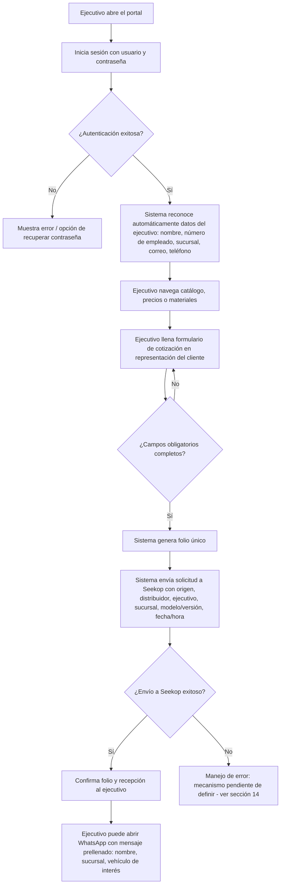
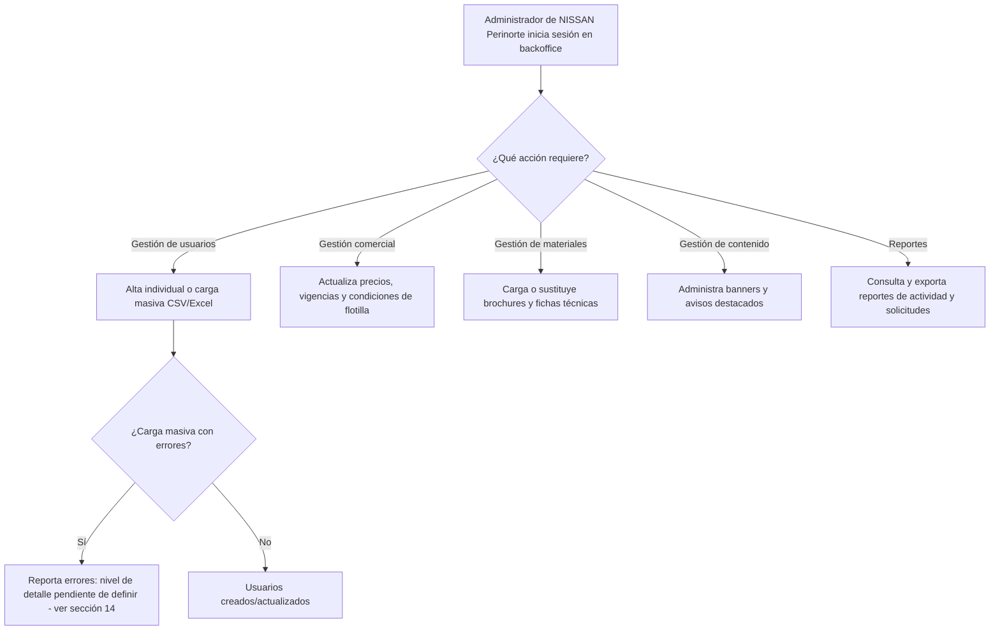

# PRD - NISSAN Business Hub (Alianza Valladolid) — Primera implementación del Portal Comercial B2B

| Campo | Detalle |
|---|---|
| Proyecto | NISSAN Business Hub – Alianza Valladolid (primera implementación del Portal Comercial B2B) |
| Área / empresa | Go Virtual — Oficina de Proyectos |
| Versión | v0.1 |
| Fecha | 2026-08-18 |
| Autores | Tony Estrada (Go Virtual) |
| Revisión / liderazgo | Andrea López de Nava (responsable de cuenta, Go Virtual). Revisión técnica de Aldo Álvarez: pendiente de confirmar (ver sección 14). Solicitante: Christian Torres (NISSAN Perinorte) |
| Tipo de proyecto | Feature web/API |

## 1. Resumen ejecutivo

NISSAN Business Hub es un portal web privado que habilitará a los ejecutivos de las aproximadamente 100 sucursales de Valladolid Caja Financiera para consultar información comercial de NISSAN Perinorte (catálogo de vehículos, precios y condiciones de flotilla, materiales descargables) y canalizar directamente hacia el distribuidor las oportunidades de venta que surjan de esa relación. El proyecto beneficia tanto a los ejecutivos de sucursal, que ganan un canal formal y directo, como a NISSAN Perinorte, que gana visibilidad, trazabilidad y control sobre el origen de cada oportunidad.

Hoy no existe un canal digital formal entre ambas partes: no se tiene identificado un mecanismo específico mediante el cual Valladolid canaliza hoy sus solicitudes de cotización hacia NISSAN Perinorte (queda como pregunta abierta en la sección 14). El proyecto se dispara por un compromiso comercial firmado con Valladolid Caja Financiera, que exige contar con una primera versión funcional publicada en un máximo de tres semanas a partir de la validación final de alcance, diseño y contenidos — es decir, un driver de deadline contractual con un aliado comercial, no una mejora incremental interna.

El MVP de este PRD cubre: autenticación individual por ejecutivo con reconocimiento automático de sus datos de sesión, consulta de catálogo/precios/materiales, formulario de solicitud de cotización con folio y confirmación, integración de escritura hacia Seekop, acceso directo a WhatsApp con mensaje prellenado, diseño responsivo, analítica básica, y un panel de backoffice para que NISSAN Perinorte administre usuarios, precios, materiales, contenido y reportes. Queda fuera de este PRD la generalización de la arquitectura hacia otras alianzas comerciales (Fase 2 del Portal Comercial B2B).

El resultado esperado es doble: por un lado, cumplir el compromiso comercial con Valladolid dentro de la ventana de 2-3 semanas; por otro, dejar sentada una base de arquitectura, autenticación, administración de contenidos e integraciones que pueda reutilizarse en futuras alianzas comerciales bajo el paraguas del Portal Comercial B2B.

**Flujo de valor central:** Login del ejecutivo → Consulta de catálogo/precios/materiales → Solicitud de cotización con folio → Envío a Seekop y confirmación (WhatsApp opcional)

## 2. Contexto y problema

- **Proceso actual:** no existe hoy un canal digital privado, administrable ni medible entre los ejecutivos de sucursal de Valladolid y NISSAN Perinorte. No se tiene identificado cómo se canalizan actualmente las solicitudes de cotización (informalmente, por otro medio, o de plano sin mecanismo alguno) — esto queda como pregunta abierta a validar con operación.
- **Dolor concreto:** sin un canal formal, las oportunidades comerciales generadas por la alianza con Valladolid no tienen trazabilidad hacia Seekop, ni forma de medir la actividad por ejecutivo o sucursal, ni un mecanismo de autoservicio para consultar catálogo, precios o materiales protegidos.
- **Por qué ahora:** existe un compromiso comercial firmado con Valladolid Caja Financiera que obliga a publicar una primera versión funcional en un máximo de tres semanas desde la validación final de alcance, diseño y contenidos. Es un deadline contractual con un aliado comercial, con seguimiento semanal de avance, riesgos y pendientes.
- **Conceptos de dominio a distinguir desde el día 1:**
  - "NISSAN Business Hub – Alianza Valladolid" (esta implementación específica, objeto de este PRD) vs. "Portal Comercial B2B" (la plataforma reutilizable de la que esta es la primera instancia). No deben construirse como si fueran lo mismo: la reutilización es un objetivo de arquitectura, no un alcance funcional de este MVP.
  - "Solicitud de cotización" (lo que captura el formulario del portal) vs. "Oportunidad" (el registro que vive en Seekop y que se da seguimiento hasta venta). Son entidades relacionadas pero no idénticas: una solicitud genera una oportunidad, pero el ciclo de vida de la oportunidad ocurre fuera del portal.

## 3. Objetivo del producto

Habilitar un canal digital privado, administrable y medible — NISSAN Business Hub — para que los ejecutivos de las aproximadamente 100 sucursales de Valladolid Caja Financiera consulten información comercial de NISSAN Perinorte (catálogo, precios, materiales) y canalicen oportunidades de venta directamente hacia el distribuidor, con trazabilidad completa hasta Seekop. Esta primera implementación debe, además, sentar las bases de arquitectura, autenticación, administración de contenidos e integraciones del Portal Comercial B2B, para que puedan reutilizarse en futuras alianzas comerciales distintas a Valladolid.

### 3.1 Estrategia de implementación por fases

| Fase | Nombre | Descripción |
|---|---|---|
| Fase 1 (MVP de este PRD) | NISSAN Business Hub – Alianza Valladolid | Portal con el alcance funcional descrito en la sección 5 (acceso seguro, catálogo, precios, formulario de cotización, WhatsApp, backoffice, integración con Seekop), publicado en ventana de 2-3 semanas posteriores a la validación final. Se entrega como un único entregable, sin desglose de funcionalidades priorizadas dentro de la fase. |
| Fase 2 (futura, fuera de este PRD) | Generalización a Portal Comercial B2B | Reutilización de arquitectura, autenticación, administración de contenidos e integraciones para otras alianzas comerciales distintas a Valladolid |

## 4. Usuarios y actores

| Usuario / Actor | Rol en el proceso |
|---|---|
| Ejecutivo de sucursal (Valladolid) | Usuario final del portal: consulta catálogo, precios y materiales; genera solicitudes de cotización desde su sesión autenticada |
| Equipo administrador (NISSAN Perinorte) | Usa el backoffice: gestiona usuarios, cargas masivas, precios, brochures, banners y reportes de actividad |
| Christian Torres (NISSAN Perinorte) | Solicitante / patrocinador del proyecto del lado del cliente |
| Andrea López de Nava (Go Virtual) | Responsable de cuenta; punto de contacto y validación de alcance/entregables |
| Equipo de desarrollo (Go Virtual) | Construye, integra y da mantenimiento al portal |
| Equipo de QA y seguridad (Go Virtual) | Responsable de pruebas funcionales y de seguridad — persona específica pendiente de asignar (ver sección 14) |
| Equipo de BI (por definir) | Consume la analítica básica del portal — pendiente de definir si es NISSAN Perinorte o el propio equipo administrador (ver sección 14) |
| Seekop | Sistema externo que recibe cada solicitud como oportunidad, para seguimiento hasta venta |

## 5. Alcance MVP y funcionalidades

| Funcionalidad | Descripción |
|---|---|
| Autenticación individual por ejecutivo | Login con usuario/contraseña individual, asociado a un ejecutivo y su sucursal; el sistema reconoce automáticamente nombre, número de empleado, sucursal, correo y teléfono desde la sesión, y esos datos acompañan cada solicitud posterior |
| Gestión de sesión de usuario | Recuperación de contraseña, activación y suspensión de cuentas de ejecutivo (la ejecución la hace el backoffice; el ejecutivo solo dispara recuperación de contraseña) |
| Home de la alianza | Página de inicio con identidad visual de la alianza NISSAN–Valladolid (según prototipo de Figma) |
| Catálogo de vehículos | Catálogo de modelos Nissan, versiones y características, navegable por el ejecutivo |
| Precios y condiciones de flotilla | Lista de precios y condiciones especiales para flotillas, visible solo para usuarios autenticados |
| Biblioteca de materiales | Brochures, fichas técnicas y descargables, protegidos (no accesibles vía enlace público) |
| Formulario de cotización | El ejecutivo solicita una cotización en representación del cliente de la sucursal; captura modelo/versión de interés |
| Folio y confirmación | Al enviar el formulario, el sistema genera un folio único y confirma la recepción al ejecutivo |
| Burbuja de WhatsApp | Enlace directo a WhatsApp desde cualquier pantalla; el mensaje se prellena con nombre del ejecutivo, sucursal y vehículo de interés |
| Diseño responsivo | Experiencia funcional en escritorio, tablet y móvil |
| Integración con Seekop | Cada solicitud del formulario se envía a Seekop como oportunidad, con los identificadores de origen (alianza, distribuidor, ejecutivo, sucursal, modelo/versión, fecha/hora) |
| Analítica básica | Métricas por ejecutivo, sucursal y tipo de acción (consulta de catálogo, descarga de material, solicitud de cotización, etc.) |
| Backoffice – Usuarios | Alta, modificación, suspensión y eliminación de usuarios ejecutivos, incluyendo carga masiva vía Excel/CSV |
| Backoffice – Precios y condiciones | Actualización de listas de precios, vigencias y condiciones comerciales |
| Backoffice – Materiales | Carga o sustitución de brochures, fichas técnicas y documentos |
| Backoffice – Contenido | Administración de banners, avisos y contenidos destacados |
| Backoffice – Reportes | Consulta y exportación de reportes de actividad y solicitudes |

**Principio rector del MVP:** el portal no decide ni cierra ventas: solo captura, identifica el origen y canaliza la oportunidad hacia NISSAN Perinorte vía Seekop; toda negociación, autorización de precio especial y cierre de venta la resuelve el distribuidor de forma humana.

## 6. Fuera de alcance

- **Generalización multi-alianza del Portal Comercial B2B**: esta primera versión se construye específicamente para la alianza Valladolid; la reutilización de arquitectura para otros aliados comerciales es Fase 2, fuera de este PRD.
- **Cierre de venta o autorización de precio especial dentro del portal**: por el principio rector del MVP, el portal solo capta y canaliza la oportunidad; la negociación y cierre los resuelve el distribuidor de forma humana.
- **Pasarela de pagos o cualquier transacción financiera en línea**: no se mencionó en el alcance solicitado; se agregaría solo si una fase futura lo requiere.
- **Bot conversacional o automatización de respuestas en WhatsApp**: lo solicitado es una burbuja de acceso directo a WhatsApp con mensaje prellenado, no un agente conversacional con lógica propia.
- **Aplicación móvil nativa (iOS/Android)**: el requerimiento es diseño responsivo web, no una app nativa.
- **Migración o carga de historial de solicitudes/leads previos a Seekop**: no existe hoy un mecanismo formal identificado; no hay un universo de datos previos que migrar.

## 7. Flujos principales

### Flujo 1 — Consulta y solicitud de cotización

Este es el flujo que concentra el valor central del proyecto: el ejecutivo nunca vuelve a capturar manualmente sus propios datos (nombre, sucursal, empleado), y cada solicitud queda trazada desde el primer clic hasta Seekop. El punto de decisión sobre el éxito del envío a Seekop se deja explícitamente abierto porque el propio cliente indicó que los flujos de error se definirían en el arranque; sin embargo, Go Virtual señala este punto como un riesgo real para la fecha de entrega (ver sección 13), por lo que se recomienda resolverlo antes de iniciar desarrollo y no dejarlo para el arranque.

### Flujo 2 — Administración (backoffice)

Este flujo cubre todo lo que el equipo autorizado de NISSAN Perinorte necesita para operar el portal sin depender de Go Virtual día a día: alta y mantenimiento de las ~100 sucursales, actualización de contenido comercial, y visibilidad sobre la actividad generada. El punto de validación de la carga masiva es crítico dado el volumen de sucursales, y su nivel de detalle exacto queda pendiente de definir junto con los demás flujos complementarios señalados como riesgo.

## 8. Requerimientos funcionales

| ID | Requerimiento | Descripción |
|---|---|---|
| RF-01 | Autenticación individual | El ejecutivo se autentica con usuario y contraseña individuales, asociados a su sucursal |
| RF-02 | Reconocimiento automático de sesión | El sistema identifica nombre, número de empleado, sucursal, correo y teléfono del ejecutivo autenticado y los adjunta a cada solicitud |
| RF-03 | Recuperación de contraseña | El ejecutivo puede solicitar recuperación de contraseña de forma autoservicio |
| RF-04 | Activación/suspensión de usuarios | El backoffice permite activar y suspender el acceso de un ejecutivo |
| RF-05 | Home de la alianza | Página de inicio con identidad visual de la alianza NISSAN–Valladolid |
| RF-06 | Catálogo de vehículos | Consulta de modelos, versiones y características |
| RF-07 | Precios y condiciones de flotilla | Consulta de precios y condiciones especiales, solo para usuarios autenticados |
| RF-08 | Biblioteca de materiales | Consulta y descarga de brochures/fichas técnicas, sin exposición vía enlace público |
| RF-09 | Formulario de cotización | El ejecutivo captura una solicitud de cotización en representación de un cliente |
| RF-10 | Folio y confirmación | El sistema genera folio único y confirma recepción al enviar el formulario |
| RF-11 | Envío a Seekop | Cada solicitud se envía a Seekop con origen, distribuidor, ejecutivo referidor, sucursal, modelo/versión y fecha/hora |
| RF-12 | Burbuja de WhatsApp | Enlace directo a WhatsApp con mensaje prellenado (ejecutivo, sucursal, vehículo) |
| RF-13 | Diseño responsivo | Experiencia funcional en escritorio, tablet y móvil |
| RF-14 | Analítica básica | Registro de acciones por ejecutivo, sucursal y tipo de acción |
| RF-15 | Gestión de usuarios (backoffice) | Alta, modificación, suspensión y eliminación de usuarios, incluyendo carga masiva CSV/Excel |
| RF-16 | Gestión de precios (backoffice) | Actualización de listas de precios, vigencias y condiciones comerciales |
| RF-17 | Gestión de materiales (backoffice) | Carga o sustitución de brochures, fichas técnicas y documentos |
| RF-18 | Gestión de contenido (backoffice) | Administración de banners, avisos y contenidos destacados |
| RF-19 | Reportes (backoffice) | Consulta y exportación de reportes de actividad y solicitudes |
| RF-20 | Manejo de errores en envío a Seekop | El sistema debe manejar fallas al enviar una solicitud a Seekop; mecanismo exacto (reintento, aviso a TI, o reproceso manual) pendiente de definir antes del arranque, dado el riesgo señalado en sección 13 |
| RF-21 | Validación de carga masiva | El backoffice debe validar y reportar errores en cargas CSV/Excel; nivel de detalle pendiente de definir antes del arranque |

## 9. Requerimientos no funcionales

| ID | Requerimiento | Descripción |
|---|---|---|
| RNF-01 | Seguridad de documentos y precios | Brochures, fichas técnicas y precios especiales solo accesibles a usuarios autenticados; sin enlaces públicos |
| RNF-02 | Control de permisos | Separación estricta entre rol ejecutivo (lectura + creación de solicitudes) y rol administrador (gestión completa), sin acceso cruzado entre sucursales |
| RNF-03 | Trazabilidad | Cada solicitud de cotización queda trazada end-to-end desde el portal hasta Seekop, incluyendo folio, ejecutivo, sucursal y fecha/hora |
| RNF-04 | Disponibilidad | Nivel de disponibilidad requerido (24/7 vs. horario operativo) pendiente de definir (ver sección 14) |
| RNF-05 | Privacidad y protección de datos personales | El sistema maneja datos personales de ejecutivos y de clientes referidos; requerimientos regulatorios o de política interna específicos pendientes de definir (ver sección 14) |
| RNF-06 | Escalabilidad | El sistema debe soportar el acceso concurrente de ejecutivos de las ~100 sucursales de Valladolid; volumen exacto de usuarios concurrentes pendiente de validar (ver sección 14) |
| RNF-07 | Manejo de errores | Las fallas en el envío a Seekop y en cargas masivas deben tener un tratamiento definido antes del arranque; no debe haber pérdida silenciosa de solicitudes |
| RNF-08 | Observabilidad | El sistema debe registrar logs suficientes para auditar solicitudes fallidas, inicios de sesión fallidos y cargas masivas con errores |

## 10. Integraciones y datos

| Integración / Fuente | Uso esperado |
|---|---|
| Seekop | Escritura: creación de oportunidad por cada solicitud de cotización, con identificadores de origen. Lectura/consulta de estatus: pendiente de definir (ver sección 14) |
| Sitio nissanperinorte.com.mx | El portal se integra como una sección/enlace de navegación del sitio actual (no como landing aislada). Mecanismo de autenticación (base propia vs. directorio existente): pendiente de definir (ver sección 14) |
| WhatsApp | Enlace directo (tipo wa.me) con mensaje prellenado (ejecutivo, sucursal, vehículo de interés) — no requiere integración vía API |

**Datos mínimos a manejar:**

- Usuario ejecutivo: nombre, número de empleado, sucursal, correo, teléfono, credenciales, estatus (activo/suspendido)
- Catálogo: modelo, versión, características
- Precios/condiciones: modelo, versión, precio, vigencia, condición especial de flotilla
- Materiales: tipo (brochure/ficha técnica), archivo, vehículo asociado
- Solicitud de cotización: folio, ejecutivo, sucursal, modelo/versión, fecha/hora, estatus de envío a Seekop
- Contenido del backoffice: banners, avisos, vigencia

**Esquema de permisos:** el ejecutivo tiene lectura de catálogo, precios y materiales, creación de solicitudes de cotización, y gestión de su propia contraseña, sin acceso a datos de otras sucursales ni al backoffice. El administrador del backoffice tiene gestión completa de usuarios, precios, materiales y contenido, además de lectura y exportación de reportes y solicitudes. Los documentos y precios especiales permanecen bloqueados sin autenticación, sin quedar expuestos mediante enlaces públicos.

## 11. Eventos para BI

**Eventos de sesión y usuario**

- `usuario_login`: se registra cuando un ejecutivo inicia sesión exitosamente.
- `usuario_login_fallido`: se registra cuando falla un intento de inicio de sesión.
- `password_recuperacion_solicitada`: se registra cuando el ejecutivo solicita recuperar su contraseña.

**Eventos de catálogo y contenido**

- `catalogo_consultado`: se registra cuando el ejecutivo visualiza el catálogo o un modelo/versión específico.
- `precio_consultado`: se registra cuando el ejecutivo consulta la lista de precios o condiciones de flotilla.
- `material_descargado`: se registra cuando se descarga un brochure o ficha técnica.

**Eventos de cotización**

- `cotizacion_solicitada`: se registra cuando el ejecutivo envía el formulario de cotización.
- `cotizacion_enviada_seekop`: se registra cuando la solicitud se envía exitosamente a Seekop.
- `cotizacion_error_seekop`: se registra cuando falla el envío a Seekop (mecánica exacta pendiente de RF-20).
- `whatsapp_contacto_iniciado`: se registra cuando el ejecutivo abre la burbuja de WhatsApp.

**Eventos de backoffice**

- `usuario_alta_backoffice`: se registra cuando el administrador da de alta un usuario, individual o vía carga masiva.
- `carga_masiva_procesada`: se registra al procesar un archivo CSV/Excel, con total de registros, exitosos y fallidos.
- `contenido_actualizado`: se registra cuando se actualiza un precio, material o banner.

**Campos mínimos por evento:** fecha/hora, identificador del ejecutivo o administrador que dispara la acción, sucursal (cuando aplique), identificador de negocio relevante (folio, modelo/versión, material), y resultado/motivo cuando el evento representa un intento (login fallido, error de envío a Seekop, carga masiva).

## 12. Métricas de éxito

| Métrica | Descripción |
|---|---|
| Adopción de sucursales | % de las ~100 sucursales de Valladolid con al menos un ejecutivo activo en el portal (línea base y meta pendientes de validar con BI/operación) |
| Volumen de solicitudes de cotización | Número de solicitudes generadas por semana/mes desde el portal (línea base y meta pendientes de validar) |
| Tasa de envío exitoso a Seekop | % de solicitudes que llegan a Seekop sin error, sobre el total generadas (meta pendiente de validar) |
| Cumplimiento del plazo comprometido | Publicación del MVP dentro de la ventana de 3 semanas posteriores a la validación final |
| Uso de biblioteca de materiales | Descargas de brochures/fichas técnicas por sucursal/ejecutivo (línea base pendiente de validar) |
| Conversión hacia oportunidad | % de solicitudes de cotización que avanzan como oportunidad en Seekop (requiere reporte cruzado con el equipo de Seekop/NISSAN; meta pendiente de validar) |

## 13. Riesgos y supuestos

### Riesgos

| Riesgo | Impacto potencial |
|---|---|
| Definición tardía de flujos complementarios (autenticación, manejo de errores, recuperación de contraseña) | Señalado explícitamente como posible bloqueador: si no se resuelve antes del arranque, puede detener el desarrollo y comprometer la ventana de 3 semanas |
| El plazo de 3 semanas inicia hasta la validación final de alcance, diseño y contenidos | Cualquier retraso en esa validación por parte de NISSAN Perinorte/Valladolid recorre automáticamente la fecha de publicación comprometida |
| Disponibilidad y documentación de la API/mecanismo de integración de Seekop | Si Seekop no tiene una integración madura o documentada, puede ser el cuello de botella técnico más grande del MVP dado el plazo |
| Entrega tardía de contenidos reales (catálogo, precios, brochures, banners) por parte de NISSAN Perinorte | El desarrollo puede avanzar con datos de prueba, pero la publicación real depende de contenido definitivo a tiempo |
| Onboarding de ~100 sucursales con datos correctos de ejecutivos | Errores en la carga masiva (sucursal inexistente, datos duplicados) pueden bloquear accesos el día de publicación |
| Mecanismo de autenticación aún sin definir (propio vs. directorio existente) | Puede implicar retrabajo si se define tarde y ya se avanzó desarrollo bajo un supuesto distinto |

### Supuestos

| Supuesto | Descripción |
|---|---|
| El prototipo de Figma es la referencia visual válida y suficiente para el MVP | El equipo de diseño no partirá de cero, solo lo complementará con los flujos no cubiertos ahí |
| NISSAN Perinorte proveerá catálogo, precios, brochures y banners en tiempo para no retrasar el desarrollo | Necesario para poder publicar contenido real dentro del plazo |
| Seekop cuenta con un mecanismo de integración (API o similar) disponible para uso de Go Virtual | Condición para cumplir RF-11 dentro del plazo |
| La validación final de alcance, diseño y contenidos ocurrirá en una fecha concreta y cercana | Es el disparador formal de la ventana de 2-3 semanas |
| Aldo Álvarez (u otra persona designada) realizará la revisión técnica antes de iniciar el diseño técnico | Pendiente de confirmar (ver sección 14) |

## 14. Preguntas abiertas

| Tema | Pregunta abierta |
|---|---|
| Proceso actual | ¿Cómo se manejan hoy (antes del portal) las solicitudes de cotización de Valladolid hacia NISSAN Perinorte — canal informal, ninguno, u otro mecanismo? **R:** se está generando una alianza (actual) con objetivo de tener mayor control (antes no se tenía) |
| Recursos y roles | ¿Quién consumirá la analítica básica del portal: un equipo de BI de NISSAN Perinorte, o el propio equipo administrador del backoffice? **R:** Admin (analytics - reportes por GV). Cliente quiere administrar inventarios |
| Recursos y roles | ¿Quién de Go Virtual cubrirá QA y pruebas de seguridad para este proyecto? — pendiente |
| Recursos y roles | ¿Aldo Álvarez interviene como revisor técnico de este proyecto, o es otra persona quien lidera la revisión técnica en Go Virtual? — pendiente |
| Flujos complementarios (crítico) | ¿Qué mecanismo se usará ante fallas en el envío de una solicitud a Seekop: reintento automático, aviso a TI, o reproceso manual? Señalado como posible bloqueador de la entrega si no se resuelve antes del arranque. **R:** Pasar por 3 pasos (reintento, notificación interna y a cliente) |
| Flujos complementarios (crítico) | ¿Qué nivel de validación y reporte de errores debe tener la carga masiva de usuarios (CSV/Excel)? — pendiente |
| Flujos complementarios (crítico) | Definición completa de los flujos de autenticación, seguridad, manejo de errores, recuperación de contraseña y confirmaciones — el cliente indicó que se resolverían en el arranque, pero se recomienda cerrarlos antes de iniciar desarrollo por el riesgo de retraso señalado — pendiente |
| Requerimientos no funcionales | ¿El portal debe estar disponible 24/7, o basta con horario operativo? **R:** 24/7 |
| Requerimientos no funcionales | ¿Existe algún requerimiento regulatorio o de política interna sobre protección de datos personales que deba aplicarse (datos de ejecutivos y de clientes referidos)? — pendiente |
| Requerimientos no funcionales | ¿Cuál es la estimación de usuarios concurrentes o volumen de solicitudes esperado, considerando las ~100 sucursales? **R:** los mismos de DO (no son 100, el enfoque es de NISSAN Perinorte) |
| Integraciones | ¿La autenticación de ejecutivos se construye como base propia de este portal, o debe integrarse con un directorio/SSO existente de NISSAN Perinorte o Valladolid? — pendiente |
| Integraciones | ¿Seekop requiere además lectura/consulta de estatus de oportunidad desde el portal, o solo escritura al crearla? — pendiente |
| Métricas | Líneas base y metas numéricas de las métricas de éxito de la sección 12, pendientes de validar con BI/operación de NISSAN Perinorte |
