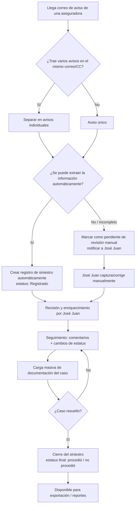

# PRD - Módulo de Siniestros

| **Campo** | **Detalle** |
| --- | --- |
| **Proyecto** | Módulo de Siniestros |
| **Área / empresa** | Gplus Seguros |
| **Versión** | v0.2 |
| **Fecha** | 2026-07-28 |
| **Autores** | Daniela Carbajal Vega (TI, arma el PRD). Solicitan: Norma Zacarias y José Juan Mendoza Díaz (negocio/operación de siniestros) |
| **Revisión / liderazgo** | Aldo Álvarez (Director de TI) |
| **Tipo de proyecto** | Feature web/API (con automatización de captura de avisos como funcionalidad crítica del MVP) |

## 1. Resumen ejecutivo

El Módulo de Siniestros busca reemplazar el proceso manual que hoy usa el equipo de siniestros de Gplus Seguros (José Juan Mendoza Díaz, con supervisión de Norma Zacarias) para registrar y dar seguimiento a los siniestros de las pólizas que administran. Hoy, cada aviso de siniestro llega por correo desde las distintas aseguradoras (Potosí, HDI, Chubb, Qualitas, Latino, GNP, entre otras), en formatos distintos (texto, PDF o imagen), y José Juan lo transcribe manualmente a un Excel ("bitácora" con hojas de avisos, pérdidas totales y devoluciones de primas) que además utiliza como única fuente para sus reportes internos y hacia un tercero ("CAF").

El problema concreto es doble: (1) la captura es 100% manual y depende de que José Juan copie y pegue la información de cada aviso, sin poder automatizarla con fórmulas porque los avisos llegan en PDF o imagen; y (2) el reporte oficial de siniestralidad que da la aseguradora llega "mes vencido", lo cual no permite atender al cliente con la oportunidad que el negocio requiere (1-3 días después del siniestro). Ya se había intentado antes resolver esto con un robot externo aislado (solicitado a Aldo) que no se concretó; ahora se busca una solución integral, no otro parche puntual.

El MVP de este PRD (Fase 1) cubre la captura automatizada de avisos de siniestro multi-formato — extrayendo la totalidad de los campos que envía cada aseguradora, no solo los esenciales que hoy se transcriben a mano —, el registro del siniestro, la bitácora de seguimiento (comentarios y estatus), la gestión documental por caso con almacenamiento propio del sistema (reemplazando Google Drive) y la migración del acervo histórico de expedientes que hoy vive en Drive, dada la obligación legal de conservarlos un mínimo de 10 años. Fases posteriores (no comprometidas en este PRD) contemplan vincular los siniestros con las pólizas emitidas en Omega, mostrar el histórico de siniestros al consultar una póliza, y — a más largo plazo — un portal de solicitudes ("tickets") para distribuidores y una eventual integración con el sistema de siniestros de un socio externo ("la financiera").

El resultado esperado es que José Juan deje de depender de la transcripción manual, pueda atender los siniestros con la oportunidad que exige el negocio, y que la información quede centralizada, trazable y disponible para los mismos reportes que hoy produce a mano — sin generar trabajo adicional.

**Aviso recibido de aseguradora** → **Extracción automática de datos** → **Registro y seguimiento del siniestro** → **Gestión documental** → **Cierre y reporte**

## 2. Contexto y problema

Hoy el proceso es completamente manual: cada aseguradora envía un correo de aviso de siniestro (a veces con varios avisos agrupados en el mismo hilo/CC) directamente al correo personal de José Juan Mendoza Díaz. Él abre cada aviso — que puede venir como texto, PDF o imagen, con nomenclatura distinta según la aseguradora (por ejemplo, "Potosí" vs. "Chubb" pueden nombrar de forma distinta al mismo campo) — y copia/pega manualmente los datos relevantes a un Excel único que funciona como bitácora, con hojas separadas para avisos, pérdidas totales y devoluciones de primas. El volumen real de esta operación es de 1 a 10 avisos por día, alrededor de 70 por semana y entre 200 y 250 por mes.

Con ejemplos reales de aviso compartidos por Norma y José Juan se confirmó qué tan heterogéneos son los formatos: GNP, Qualitas y HDI envían correos HTML con campos claramente etiquetados; La Latino envía una tabla dentro del cuerpo del correo, también etiquetada; El Potosí envía un PDF estructurado con secciones y etiquetas; y **Chubb envía una tabla de texto plano sin ningún nombre de campo — solo valores en un orden fijo**, lo que la vuelve la fuente más difícil de interpretar automáticamente. Además, cada aviso trae muchos más datos de los que José Juan alcanza a capturar hoy a mano: ubicación detallada del siniestro, cabinero y ajustador asignado, coberturas afectadas y montos, y los datos completos del vehículo (marca, tipo, año, color, placas, valor comercial), entre otros.

El dolor concreto tiene dos caras. Primero, la carga operativa: como los avisos llegan en PDF o imagen, no es posible automatizar la captura con fórmulas de Excel ("no puedo decirle a Excel que ponga el nombre aquí, tengo que copiar y pegar"), lo que hace el proceso lento y propenso a error. Segundo, y más crítico para el negocio: la aseguradora sí entrega un reporte oficial de siniestralidad, pero llega con un mes de retraso ("mes vencido"), lo cual es inaceptable porque el equipo necesita atender al cliente en los primeros 1-3 días después de ocurrido el siniestro, no un mes después.

Es importante resolverlo ahora porque ya se intentó una solución parcial anteriormente (un robot externo solicitado a Aldo, enfocado solo en automatizar avisos) que no se concretó. El equipo de negocio explícitamente pidió esta vez evitar "parchecitos" aislados y construir una solución global que además sirva de base para necesidades futuras (vínculo con pólizas, visibilidad del histórico de siniestros, eventual autoservicio de distribuidores).

Distinción de dominio relevante para el equipo de desarrollo: un **aviso de siniestro** es la notificación cruda que envía la aseguradora (por correo, en cualquier formato); un **siniestro registrado** es la entidad de negocio ya capturada en el sistema, con su propio ciclo de vida (registrado → en seguimiento → cerrado); y el **reporte de siniestralidad de la aseguradora** es un reporte oficial mensual que hoy no sirve para la operación diaria porque llega retrasado. También es clave distinguir entre pólizas **emitidas en Omega** (vinculables en fases futuras) y pólizas de cartera externa o de micrositios (que no se pueden vincular automáticamente, pero sí deben poder registrar un siniestro).

## 3. Objetivo del producto

Dar al equipo de siniestros de Gplus Seguros (José Juan Mendoza Díaz, con supervisión de Norma Zacarias) un módulo que capture automáticamente los avisos de siniestro enviados por las aseguradoras y centralice su registro, seguimiento y documentación — reemplazando la captura manual en Excel y permitiendo atender al cliente en 1-3 días en vez de esperar el reporte mensual de la aseguradora. La mejora medible esperada es reducir el tiempo entre la recepción del aviso y su disponibilidad como siniestro registrado y accionable, y eliminar la dependencia de la transcripción manual como único medio de captura.

### 3.1 Estrategia de implementación por fases

| **Fase** | **Nombre** | **Descripción** |
| --- | --- | --- |
| Fase 1 (MVP) | Captura y registro de siniestros | Automatización de captura de avisos multi-formato, registro del siniestro, bitácora/seguimiento (comentarios + estatus) y gestión documental (carga masiva por caso, almacenamiento propio) |
| Fase 2 | Vínculo con pólizas | Vinculación del siniestro con la póliza correspondiente cuando fue emitida en Omega; visualización del histórico de siniestros al consultar una póliza; exportación/reportes en Excel |
| Fase 3 | Autoservicio y ecosistema | Portal de "tickets" para que distribuidores soliciten seguimiento directo con alertas a José Juan; integración bidireccional con el sistema de siniestros de un socio externo ("la financiera"); módulo de cobranza vinculado al siniestro |

Este PRD cubre el **MVP de la Fase 1**. Las Fases 2 y 3 se documentan como visión de producto, sin fecha ni alcance técnico comprometido todavía.

## 4. Usuarios y actores

| **Usuario / Actor** | **Rol en el proceso** |
| --- | --- |
| José Juan Mendoza Díaz (equipo de siniestros) | Usuario operativo principal: registra avisos, da seguimiento, carga documentos, cambia estatus y cierra siniestros |
| Norma Zacarias (negocio/supervisión) | Junto con José Juan, puede crear, modificar y cerrar siniestros; define reglas de negocio y supervisa el proceso |
| Distribuidores/agencias (usuarios ya existentes en Omega) | Fuera del MVP: en fases futuras solicitarían seguimiento de siniestros directamente desde Omega |
| Equipo comercial | Consumidor indirecto en fases futuras: usaría la vinculación siniestro↔póliza como métrica de uso de Omega |
| TI (Daniela Carbajal Vega, Alexis, Aldo Álvarez) | Dueños del requerimiento, análisis técnico y revisión de liderazgo |

## 5. Alcance MVP y funcionalidades

| **Funcionalidad** | **Descripción** |
| --- | --- |
| Captura automatizada de avisos de siniestro | El sistema lee los correos de aviso de las aseguradoras (texto, PDF o imagen según la aseguradora, incluyendo correos con varios avisos agrupados en CC) y extrae y estructura **todos** los campos que envía cada aviso (no solo los esenciales), incluyendo el caso de Chubb, que no etiqueta sus campos y requiere un mapeo posicional propio. Debe soportar múltiples formatos de entrada, ya que cada aseguradora usa su propio formato y nomenclatura. |
| Registro del siniestro | Alta con los campos que hoy captura José Juan (número de siniestro, número de póliza, serie, teléfono de contacto, tipo de siniestro, nombre del asegurado/contacto, causa, estatus) más el resto de los campos estructurados del aviso (ubicación, cabinero/ajustador, coberturas afectadas y montos, datos completos del vehículo). Debe permitir también captura manual cuando un aviso no se pueda leer automáticamente. |
| Bitácora / seguimiento | Campo abierto de comentarios/notas por siniestro, más un campo de estatus (ej. abierto/en proceso/cerrado, con resultado "procedió"/"no procedió"). |
| Gestión documental | Carga masiva de documentos por caso (sin desglosar campo por campo según tipo de documento, ya que varía por aseguradora), con almacenamiento propio del sistema y registro de quién y cuándo cargó cada archivo. |
| Migración de expedientes históricos | Migrar al almacenamiento propio del sistema el acervo documental de siniestros que hoy vive en Google Drive, preservando su asociación por caso/cliente/aseguradora, para cumplir la obligación legal de conservación de 10 años. |
| Reemplazo funcional del Excel actual | Los datos capturados permiten generar los mismos reportes que hoy salen del Excel (hacia "CAF" y reportes internos), sin que José Juan tenga que producir reportes adicionales por fuera del sistema. |

El principio rector del MVP es que **el sistema solo captura y organiza información — no decide sobre el siniestro**: no determina procedencia, no autoriza pagos ni montos, y no cierra un siniestro por sí mismo. Esas decisiones siguen siendo humanas, a cargo de José Juan y Norma.

## 6. Fuera de alcance

- **Vínculo automático con pólizas de Omega**: no toda la cartera vive en Omega (hay micrositios/cartera externa); en el MVP el siniestro se registra solo con el número de póliza, sin búsqueda ni vinculación automática. Se habilita en Fase 2.
- **Portal de "tickets" para distribuidores**: las solicitudes de seguimiento seguirán llegando por los canales actuales (correo, WhatsApp, llamada); no se construye un flujo de autoservicio para distribuidores en el MVP. Se evalúa en Fase 3.
- **Integración bidireccional con el sistema de siniestros de "la financiera"**: es un desarrollo conjunto con un tercero, de largo plazo y no prioritario frente al alcance general del negocio; no entra al MVP.
- **Módulo de cobranza vinculado al siniestro**: es una visión de largo plazo sin fecha ni alcance definido aún; no entra al MVP.
- **Automatización infalible de lectura de avisos**: dado que algunos avisos llegan en imagen o PDF de calidad variable, el MVP no garantiza que el 100% se capture sin revisión — los casos no reconocidos se degradan a captura manual, no se pierden ni se fuerzan.

## 7. Flujos principales

Este flujo refleja que la automatización actúa como una primera capa de captura, pero siempre con una vía de respaldo manual: ningún aviso se pierde si no puede leerse automáticamente, simplemente pasa a revisión humana. El ciclo de seguimiento (comentarios, estatus, documentos) se repite tantas veces como sea necesario hasta que José Juan o Norma consideren el caso resuelto y lo cierren, momento en el cual la información queda disponible para los reportes que hoy se generan manualmente desde el Excel.

## 8. Requerimientos funcionales

| **ID** | **Requerimiento** | **Descripción** |
| --- | --- | --- |
| RF-01 | Monitoreo del correo de avisos | El sistema debe monitorear el nuevo buzón compartido de siniestros (a crear en Google Workspace, ej. `siniestros@...`) para detectar avisos de siniestro entrantes de las aseguradoras. |
| RF-02 | Extracción automática de datos | El sistema debe extraer y estructurar automáticamente todos los campos del aviso (identificación del siniestro y la póliza, contacto, tipo y causa, ubicación, cabinero/ajustador, coberturas afectadas y montos, datos del vehículo) cuando el formato lo permita (texto, PDF o imagen), incluyendo formatos sin etiquetas de campo mediante un mapeo posicional específico por aseguradora (caso Chubb). |
| RF-03 | Separación de avisos agrupados | Cuando un correo contenga múltiples avisos agrupados (CC), el sistema debe separarlos en registros individuales. |
| RF-04 | Degradación a revisión manual | Cuando la extracción automática falle o resulte incompleta, el sistema debe marcar el aviso como "pendiente de revisión manual" y notificar al usuario responsable. |
| RF-05 | Registro manual de siniestro | El usuario debe poder registrar manualmente un siniestro cuando no se haya capturado automáticamente. |
| RF-06 | Comentarios de seguimiento | El sistema debe permitir agregar comentarios/notas de seguimiento asociados a cada siniestro. |
| RF-07 | Cambio de estatus | El sistema debe permitir cambiar el estatus del siniestro (ej. abierto/en proceso/cerrado, con resultado procedió/no procedió). |
| RF-08 | Carga masiva de documentos | El sistema debe permitir cargar documentos de forma masiva asociados a un siniestro, registrando quién y cuándo los cargó. |
| RF-09 | Exportación de reportes | El sistema debe permitir exportar/filtrar los siniestros registrados a Excel, replicando la información que hoy se reporta manualmente (interno y hacia "CAF"). |
| RF-10 | Número de siniestro de la aseguradora | El sistema debe registrar el número de siniestro asignado por la aseguradora, distinto del identificador interno, para trazabilidad. |
| RF-11 | Migración de expedientes históricos | El sistema debe permitir migrar el acervo documental histórico de siniestros que hoy vive en Google Drive hacia el almacenamiento propio, conservando su asociación por siniestro/cliente/aseguradora. |

## 9. Requerimientos no funcionales

| **ID** | **Requerimiento** | **Descripción** |
| --- | --- | --- |
| RNF-01 | Control de acceso | Solo José Juan Mendoza Díaz y Norma Zacarias pueden crear, modificar y cerrar siniestros en el MVP; otros roles quedan pendientes de definir. |
| RNF-02 | Trazabilidad / auditoría | Cada cambio de estatus y cada carga de documento debe quedar registrado con usuario, fecha y hora (bitácora completa de actividad). |
| RNF-03 | Retención documental | Los expedientes de siniestro deben conservarse por un mínimo de 10 años, conforme a la obligación legal aplicable al broker. |
| RNF-04 | Manejo de errores en extracción | Si la extracción automática falla, el aviso no debe perderse: pasa a un estado de revisión manual visible para el usuario. |
| RNF-05 | Disponibilidad 24/7 | La captura automatizada de avisos debe operar de forma continua (24/7), ya que los avisos de las aseguradoras pueden llegar en cualquier momento. |
| RNF-06 | Privacidad de datos personales | La información capturada incluye datos personales del asegurado/contacto (nombre, teléfono, causa del siniestro, documentos asociados) y debe protegerse conforme a las políticas de datos personales de la empresa. |

## 10. Integraciones y datos

| **Integración / Fuente** | **Uso esperado** |
| --- | --- |
| Google Workspace / Gmail (nuevo buzón compartido de siniestros) | Lectura de correos entrantes para detectar y extraer avisos de siniestro (solo lectura sobre el buzón) |
| Aseguradoras (Potosí, HDI, Chubb, Qualitas, Latino, GNP, entre otras) | Fuente externa de los avisos de siniestro; no hay API/webservice formal, la única vía de entrada hoy es el correo. Formatos observados: GNP, Qualitas y HDI en HTML etiquetado; La Latino con tabla etiquetada en el cuerpo del correo; El Potosí en PDF estructurado; Chubb en texto plano sin etiquetas (mapeo posicional) |
| Google Drive (acervo histórico) | Lectura, para la migración única del histórico de expedientes hacia el almacenamiento propio del sistema (RF-11) |
| Almacenamiento documental propio del sistema | Escritura: carga y resguardo de los documentos/expedientes de cada siniestro (nuevos e históricos migrados), reemplazando el uso actual de Google Drive |

Datos mínimos requeridos para operar el MVP: número de siniestro (interno y de la aseguradora), número de póliza/inciso/certificado, nombre del asegurado/conductor/quien reporta, teléfono(s), tipo y causa del siniestro, fecha/hora de ocurrencia y de reporte, ubicación del siniestro (estado, ciudad, municipio, calle, colonia), datos del vehículo (marca, tipo, modelo, año, color, serie, placas, valor comercial), coberturas afectadas y montos, cabinero/ajustador asignado, estatus, comentarios de seguimiento, y los documentos asociados al caso.

Esquema de permisos: José Juan y Norma pueden leer, crear, modificar y cerrar siniestros. El resto de los roles (equipo comercial, otros perfiles de TI) queda, por ahora, sin acceso de escritura; cualquier ampliación de permisos deberá validarse explícitamente con negocio antes de habilitarse.

## 11. Eventos para BI

- `aviso_recibido`: se registra cuando llega un correo de aviso de una aseguradora.
- `aviso_capturado_automaticamente`: se registra cuando el sistema extrae los datos del aviso sin intervención humana.
- `aviso_pendiente_revision`: se registra cuando la extracción automática falla o es incompleta y el aviso se envía a revisión manual.
- `siniestro_registrado`: se registra cuando se crea el registro del siniestro, ya sea de forma automática o manual.
- `siniestro_estatus_cambiado`: se registra cuando cambia el estatus de un siniestro, incluyendo el estatus anterior y el nuevo.
- `documento_cargado`: se registra cuando se sube documentación asociada a un caso.
- `siniestro_cerrado`: se registra cuando un siniestro se marca como cerrado, incluyendo su resultado (procedió/no procedió).

Cada evento debe incluir como mínimo: fecha/hora, usuario responsable (o "sistema" cuando sea automático), número de siniestro, aseguradora, y resultado/motivo cuando aplique.

## 12. Métricas de éxito

| **Métrica** | **Descripción** |
| --- | --- |
| % de avisos capturados automáticamente | Proporción de avisos que se registran sin intervención manual frente a los que requieren revisión manual |
| Tiempo entre aviso y registro | Tiempo transcurrido entre la recepción del correo de aviso y su registro como siniestro en el sistema (meta: 1-3 días, no "mes vencido" como hoy) |
| % de siniestros con documentación completa en el sistema | Mide la adopción del almacenamiento propio frente a seguir usando Google Drive |
| Horas/semana de captura manual ahorradas | Mide la reducción del trabajo manual de transcripción de José Juan |
| Reportes generados directamente desde el sistema | Sustituyen los reportes manuales que hoy se producen desde el Excel (hacia "CAF" y reportes internos) |

El volumen base ya se conoce (1-10 avisos/día, ~70/semana, 200-250/mes); la línea base y meta numérica del resto de las métricas (tiempos de captura, % de automatización actual) quedan pendientes de validar con negocio/BI una vez arranque el sistema (ver sección 14).

## 13. Riesgos y supuestos

### Riesgos

| **Riesgo** | **Impacto potencial** |
| --- | --- |
| Formatos heterogéneos y calidad variable de los avisos (PDF/imagen) | Puede limitar la precisión de la extracción automática, generando más revisión manual de la esperada |
| Chubb no etiqueta los campos de su aviso (solo valores en un orden fijo) | Si la aseguradora cambia el orden o estructura de su plantilla, la extracción se rompe sin previo aviso; es la fuente de mayor fragilidad técnica |
| Intento previo similar (robot solicitado a Aldo) no se concretó | El alcance técnico real podría ser más complejo o costoso de lo anticipado |
| El nuevo buzón compartido de siniestros no se ha aprovisionado todavía | Si no está listo a tiempo, el desarrollo/pruebas de la captura automatizada podría retrasarse |
| Tamaño real del acervo histórico en Google Drive aún no dimensionado | Puede afectar el tiempo de migración dentro de la Fase 1 si el volumen histórico es mayor al esperado |
| Indefinición de si el desarrollo es interno o con proveedor externo | Puede impactar tiempos y costo una vez el proyecto pase a análisis técnico |

### Supuestos

| **Supuesto** | **Descripción** |
| --- | --- |
| Las aseguradoras mantendrán sus canales y formatos actuales de envío de avisos durante el desarrollo | Si cambian, la lógica de extracción tendría que ajustarse |
| José Juan sigue siendo el punto de captura/validación durante el MVP | No se contempla personal adicional en esta fase |
| El vínculo con pólizas de Omega no es necesario para el MVP | Se difiere a Fase 2, según lo confirmado en la sección 3.1 |
| Se creará un nuevo buzón de correo compartido de siniestros antes del arranque del desarrollo | Reemplaza la dependencia del correo personal de José Juan como único canal de entrada |
| El volumen mensual de siniestros (200-250) permite que la revisión manual siga siendo viable como respaldo | Confirmado por negocio; no se considera un volumen que vuelva inviable el respaldo manual |

## 14. Preguntas abiertas

| **Tema** | **Pregunta abierta** |
| --- | --- |
| Acceso a bitácora actual | Dar acceso de solo lectura a Daniela Carbajal Vega a la bitácora Excel vigente (hojas: avisos, pérdidas totales, devoluciones de primas). |
| Desarrollo interno vs. externo | Definir con Alexis y Aldo Álvarez si el desarrollo se realiza internamente o requiere proveedor externo — impacta directamente las fechas del proyecto. |
| Fechas | Sin fecha de inicio comprometida aún; el proyecto se encuentra en fase de discovery. |
| Tamaño del acervo histórico a migrar | Dimensionar cuántos años/expedientes existen realmente en Google Drive, para estimar el esfuerzo de la migración (RF-11) dentro de la Fase 1. |
| Provisión del nuevo buzón compartido | Definir quién y cuándo aprovisiona el nuevo correo de siniestros, y si el histórico de correos ya recibidos en el correo personal de José Juan debe migrarse a ese buzón o si el cambio aplica solo hacia adelante. |
| Línea base de tiempos y automatización | Validar con BI/operación los tiempos actuales de captura y el % de avisos que hoy requieren corrección manual, para tener una línea base de las métricas de la sección 12 (el volumen ya se conoce: 200-250 siniestros/mes). |
