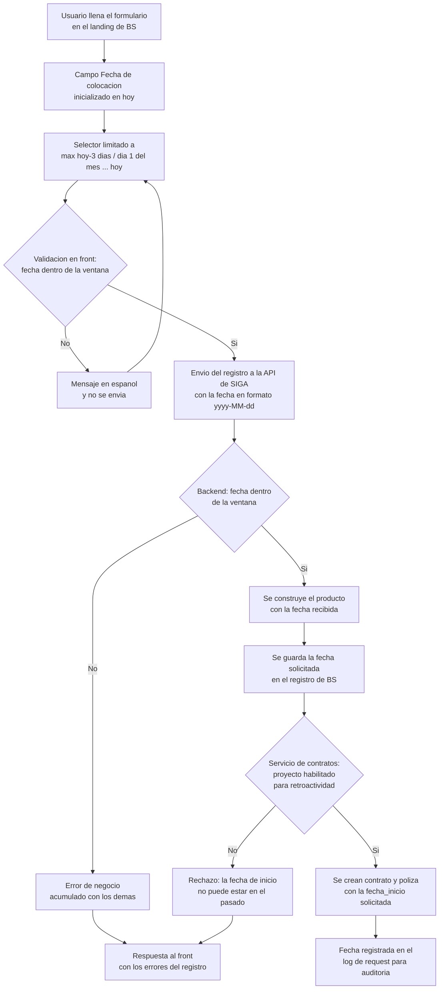
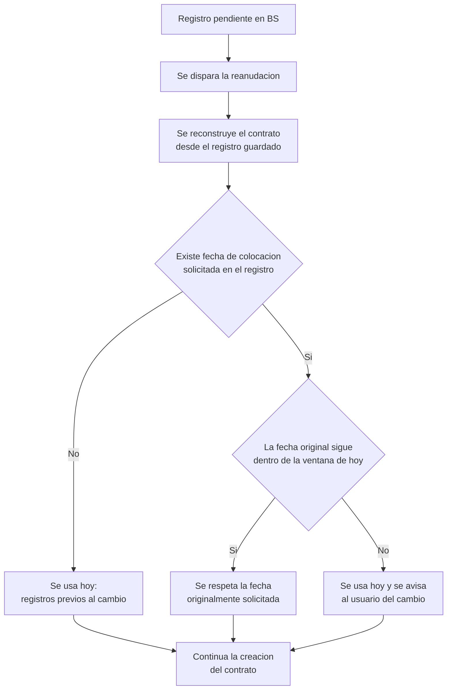

# PRD - Fecha de colocación retroactiva en el landing de Bridgestone (SIGA)

| **Campo** | **Detalle** |
| --- | --- |
| **Proyecto** | Fecha de colocación retroactiva en el landing de Bridgestone (SIGA) |
| **Área / empresa** | Garantiplus México |
| **Versión** | v0.1 |
| **Fecha** | 2026-08-20 |
| **Autores** | Javier Oropeza |
| **Revisión / liderazgo** | Aldo Álvarez (Director de TI) |
| **Tipo de proyecto** | Feature web/API |

## 1. Resumen ejecutivo

Este proyecto habilita en el **landing de Bridgestone (BS)** la captura de la **fecha de colocación** del contrato, permitiendo colocar con **hasta 3 días naturales de retroactividad** siempre que la fecha resultante **no cruce a un mes distinto** al de hoy. Beneficia directamente a los **usuarios que colocan contratos en el landing de BS** y al área de **facturación**, que hoy absorbe el desfase entre la venta real y la fecha con la que el contrato entra al sistema.

Hoy la fecha de colocación **no existe en el front**: se fija automáticamente en el backend a la fecha del día, y la única puerta dura del sistema rechaza cualquier fecha anterior a hoy. En la práctica, una venta cerrada el viernes que se captura el lunes queda registrada con fecha de lunes, y la facturación no refleja el momento real de la operación. El límite de 3 días es la holgura que el negocio necesita; el candado de mismo mes existe para **evitar malas prácticas de facturación** — que una venta se arrastre al periodo anterior una vez cerrado el mes.

El MVP (alcance único) expone la fecha de colocación como campo del formulario del landing, aplica la ventana `max(hoy − 3 días, día 1 del mes actual) … hoy` validada en front y backend, y habilita la retroactividad **solo para BS** mediante configuración por proyecto/canal —sin relajar la validación para BMW, financieras ni WhatsApp, que comparten el mismo servicio de creación de contratos. Incluye además persistir la fecha solicitada para que el **flujo de reanudación** de registros pendientes no pierda la intención del vendedor.

El resultado esperado es que la fecha con la que se factura corresponda a la fecha real de la venta dentro de una ventana acotada, sin abrir la puerta a colocaciones en meses ya cerrados.

**Captura de la fecha en el landing** → **Validación de ventana (3 días + mismo mes)** → **Envío a la API de SIGA** → **Validación de retroactividad por proyecto** → **Contrato y póliza creados con la fecha_inicio solicitada**

## 2. Contexto y problema

- **Proceso actual:** el usuario llena el formulario del landing de BS y envía el registro a la API de SIGA. La **fecha de colocación nunca se captura**: el backend la fija automáticamente al construir el producto del contrato, y esa fecha es la que termina en `contrato.fecha_inicio` y `poliza.fecha_inicio` — es decir, **la fecha que factura**. Existe una validación dura que rechaza el contrato si la fecha de inicio es anterior a hoy, y esa validación vive en el servicio de creación de contratos **compartido** con BMW, financieras y WhatsApp.
- **Dolor concreto:** no hay forma de registrar una venta con su fecha real cuando la captura ocurre uno o más días después. El contrato entra con la fecha del día de captura, la facturación queda desalineada de la operación y el vendedor no tiene ningún mecanismo para corregirlo.
- **Por qué ahora:** lo pide el negocio para BS. El límite de 3 días con el candado de mismo mes es el diseño que hace viable la retroactividad **sin comprometer el cierre contable**: sin el candado, una venta podría colocarse en un mes ya facturado.
- **Conceptos clave del dominio** (crítico para dev — hay cuatro fechas y solo una factura):
  - **Fecha de colocación** = `StartDate` del producto → `contrato.fecha_inicio` y `poliza.fecha_inicio`. **Es la fecha que factura y la única que este proyecto modifica.** También es el punto de partida de la vigencia.
  - **`bs_registro.fecha_creacion`** — la pone el default de la base de datos, es **solo auditoría** del registro. No factura y no se toca.
  - **`registrationDate`** (front) — solo se imprime en el PDF local; **no viaja a la API**. No factura y no se toca.
  - **Fecha de factura** (`InvoiceDate`) — dato del comprobante de compra del cliente, campo distinto y ya existente en el formulario. No se confunde con la fecha de colocación.
  - **Ventana de retroactividad** — el rango de fechas de colocación aceptables hoy. Se calcula con dos límites simultáneos: los 3 días naturales y el día 1 del mes actual.

## 3. Objetivo del producto

Permitir que el usuario del landing de Bridgestone capture explícitamente la **fecha de colocación** del contrato y pueda colocarla **hasta 3 días naturales hacia atrás**, con el límite absoluto de **no salir del mes en curso**, de modo que `contrato.fecha_inicio` y `poliza.fecha_inicio` reflejen la fecha real de la venta sin permitir colocaciones en periodos de facturación ya cerrados.

El cambio se habilita **exclusivamente para BS** mediante configuración por proyecto/canal, dejando intacto el comportamiento actual (solo hoy y hacia adelante) para BMW, financieras y WhatsApp, que comparten el mismo servicio de creación de contratos. El alcance es **único**, sin fases.

## 4. Usuarios y actores

| **Usuario / Actor** | **Rol en el proceso** |
| --- | --- |
| Usuario del landing de BS | Captura el registro y **elige la fecha de colocación** dentro de la ventana permitida. Es quien gana la capacidad nueva. |
| Área de facturación / administración | Consumidor del resultado: recibe contratos cuya `fecha_inicio` corresponde a la venta real y **dentro del mes en curso**. Es el área que impone el candado de mes. |
| Bridgestone (cliente/patrocinador) | Origen del requerimiento de negocio. |
| TI / Desarrollo | Diseño técnico, construcción y configuración de la ventana por proyecto. |
| Revisión / liderazgo TI (Aldo Álvarez) | Aprueba el diseño y la decisión de habilitar retroactividad por canal. |

## 5. Alcance MVP y funcionalidades

| **Funcionalidad** | **Descripción** |
| --- | --- |
| Campo "Fecha de colocación" en el landing | Nuevo campo de fecha en el formulario del landing de BS, ubicado junto a "Fecha Factura". **Inicializado en hoy** y editable dentro de la ventana permitida. Es la primera vez que esta fecha es visible para el usuario. |
| Selector acotado por la ventana | El control de fecha limita la selección a `[max(hoy − 3 días naturales, día 1 del mes actual) … hoy]`. Las fechas fuera de rango **no son seleccionables** — el usuario no puede equivocarse por accidente. |
| Validación de la ventana en el front | Espejo de la regla antes de enviar, con mensaje en español. Es conveniencia de UX: **el backend sigue siendo la autoridad**. |
| Envío de la fecha a la API de SIGA | El formulario transmite la fecha de colocación a la API en el formato que el backend espera (`yyyy-MM-dd`). Requiere cuidado: el campo de fecha de factura hoy se envía en otro formato. |
| Recepción y uso de la fecha en el backend | El backend deja de fijar la fecha de colocación automáticamente y usa la fecha recibida para construir el producto del contrato. |
| Validación de la ventana en el backend | Se valida la ventana completa (3 días + mismo mes) y, si no cumple, se devuelve el error como error de negocio junto con los demás del registro, no como excepción. |
| Retroactividad habilitada por proyecto/canal | El servicio compartido de creación de contratos deja de rechazar el pasado **solo para los proyectos configurados como retroactivos**, con su propio límite de días. BMW, financieras y WhatsApp conservan el comportamiento actual sin cambios. |
| Ventana parametrizada en configuración | Los valores de la regla (días máximos de retroactividad y permiso de cruce de mes) viven en configuración, **no hardcodeados** — requisito explícito del repositorio. |
| Persistencia de la fecha solicitada | La fecha de colocación elegida se guarda en el registro de BS (nueva columna) y se incorpora al snapshot del registro. |
| Reanudación que respeta la fecha original | Al reanudar un registro pendiente, se usa la **fecha originalmente solicitada** si sigue dentro de la ventana; si ya salió, se usa hoy y **se avisa al usuario** del cambio. |
| Fecha de colocación en el log de auditoría | La fecha solicitada se incluye en el registro de request que ya se serializa para auditoría. |

**Principio rector del MVP:** la fecha de colocación es un dato de negocio con impacto en facturación, así que **el backend es la única autoridad** sobre su validez — el front solo evita el error obvio. Y la retroactividad es una **excepción por canal, nunca una relajación global**: ningún cambio de este proyecto debe permitir que otro consumidor del servicio de contratos coloque en el pasado.

## 6. Fuera de alcance

- **Corrección del cálculo de fecha en zona horaria (UTC vs. hora local):** hoy la fecha de colocación se calcula en UTC mientras la validación compara contra la fecha local del servidor (`America/Mexico_City`, UTC−6 sin horario de verano). De las 18:00 h en adelante, la fecha automática ya es la del día siguiente — un contrato colocado el 31 a las 19:00 h **ya hoy se guarda en el mes siguiente**. Se decidió atenderlo como **bugfix independiente**; queda registrado como **dependencia bloqueante** en riesgos y preguntas abiertas, porque la ventana de este proyecto necesita un "hoy" confiable para calcularse.
- **Auditoría y corrección de contratos históricos afectados por el desfase de zona horaria:** no se revisa ni corrige lo ya facturado con el mes equivocado. Se habilitaría como ejercicio aparte una vez cerrado el bugfix anterior.
- **Retroactividad para BMW, financieras o WhatsApp:** el diseño por configuración lo deja habilitable en el futuro sin código nuevo, pero **ninguno se activa en este MVP**. Se habilitaría cuando el negocio lo solicite para ese canal.
- **Colocación con fecha futura:** la ventana termina en hoy. No se abre la posibilidad de colocar hacia adelante; sería un cambio de regla de negocio distinto y con otro riesgo de facturación.
- **Esquema de permisos para retrodatar:** cualquier usuario del landing de BS puede usar la ventana. No se crea rol ni permiso específico — la ventana de 3 días con candado de mes se considera control suficiente. Se habilitaría si aparece un caso de abuso.
- **Motivo obligatorio al retrodatar:** no se pide justificación cuando la fecha no es hoy. Se habilitaría si facturación requiere sustento por operación.
- **Reporte o vista de contratos colocados retroactivamente:** no se construye entregable de consulta para operación. La información queda en el log de request y en la columna del registro, consultables si se necesitan.
- **Cambio en el cálculo de vigencia:** la vigencia sigue siendo la duración del producto contada **desde la fecha de colocación**, así que al retroceder la fecha el contrato también termina antes. Es el comportamiento actual y se conserva a propósito.
- **Cambio en la validación de duplicados por VIN:** el traslape por VIN usa la fecha de inicio pero no estorba al retroceder días. No requiere ajuste.

## 7. Flujos principales

### 7.1 Colocación de contrato con fecha de colocación

La ventana se valida **tres veces y a propósito**: el selector la impone visualmente para que el error no ocurra, el front la revalida antes de enviar para dar mensaje inmediato en español, y el backend la vuelve a validar porque es el único punto que no se puede eludir. La validación de negocio se acumula con los demás errores del registro en vez de lanzarse como excepción, para que el usuario vea todos los problemas del formulario en una sola respuesta y no uno a la vez.

El último candado —la habilitación por proyecto en el servicio compartido de contratos— es deliberadamente redundante con el del landing. Su función no es validar al usuario de BS, sino **impedir que la relajación se filtre a los otros canales** que consumen el mismo servicio. Si el proyecto no está en la lista de retroactivos, el rechazo del pasado opera exactamente como hoy.

### 7.2 Reanudación de un registro pendiente

Este flujo existe porque la reanudación reconstruye el contrato desde el registro guardado y, sin la fecha persistida, siempre colocaría con la fecha del día de reanudación — perdiendo silenciosamente la intención del vendedor. El caso crítico es el cruce de mes: un registro que quedó pendiente el 31 y se reanuda el 2 tiene una fecha original que **ya es inválida** por definición. Ahí el sistema no puede respetarla, pero tampoco debe cambiarla en silencio: usa hoy y **lo hace explícito**. Los registros creados antes de este desarrollo no tienen la fecha guardada y caen al comportamiento actual.

## 8. Requerimientos funcionales

| **ID** | **Requerimiento** | **Descripción** |
| --- | --- | --- |
| RF-01 | Capturar la fecha de colocación en el landing | El formulario del landing de BS presenta un campo de fecha "Fecha de colocación", ubicado junto a "Fecha Factura", inicializado con la fecha de hoy. |
| RF-02 | Acotar el selector a la ventana permitida | El control de fecha impide seleccionar fechas fuera de `[max(hoy − 3 días naturales, día 1 del mes actual) … hoy]`. |
| RF-03 | Validar la ventana en el front antes de enviar | Si la fecha capturada está fuera de la ventana, el formulario no se envía y muestra un mensaje en español que indica el rango válido. |
| RF-04 | Transmitir la fecha a la API en el formato esperado | La fecha de colocación se envía a la API de SIGA como `yyyy-MM-dd`, independientemente del formato con que se presente al usuario. |
| RF-05 | Usar la fecha recibida como fecha de inicio del producto | El backend construye el producto del contrato con la fecha de colocación recibida, en lugar de fijarla automáticamente a la fecha del día. |
| RF-06 | Validar la ventana en el backend | El backend valida que la fecha recibida cumpla simultáneamente el límite de días de retroactividad y la pertenencia al mes en curso. |
| RF-07 | Reportar la fecha inválida como error de negocio | Si la fecha no cumple la ventana, el error se acumula con los demás errores de validación del registro y se devuelve en la misma respuesta, no como excepción. |
| RF-08 | Rechazar el registro sin fecha de colocación válida | Un registro con fecha de colocación ausente, no parseable o fuera de ventana no genera contrato ni póliza. |
| RF-09 | Habilitar la retroactividad por proyecto/canal | El servicio de creación de contratos acepta fechas de inicio en el pasado únicamente para los proyectos configurados como retroactivos, y solo dentro del límite de días configurado para ese proyecto. |
| RF-10 | Conservar el rechazo del pasado para los demás canales | Para cualquier proyecto no configurado como retroactivo, la validación que rechaza fechas de inicio anteriores a hoy opera sin cambios. |
| RF-11 | Parametrizar la ventana en configuración | Los días máximos de retroactividad y el permiso de cruce de mes se leen de configuración, sin valores hardcodeados en el código. |
| RF-12 | Persistir la fecha de colocación solicitada | La fecha elegida se almacena en el registro de BS y se incorpora al snapshot del registro para que esté disponible en la reanudación. |
| RF-13 | Respetar la fecha original al reanudar si sigue vigente | Al reanudar un registro pendiente que tiene fecha solicitada, se usa esa fecha si continúa dentro de la ventana calculada al momento de reanudar. |
| RF-14 | Recalcular y notificar al reanudar fuera de ventana | Si la fecha original ya no cumple la ventana, la reanudación usa la fecha de hoy y notifica al usuario que la fecha se ajustó. |
| RF-15 | Reanudar registros previos al cambio | Un registro sin fecha solicitada almacenada (creado antes de este desarrollo) se reanuda con la fecha de hoy, sin error. |
| RF-16 | Registrar la fecha de colocación en el log de auditoría | La fecha de colocación solicitada se incluye en los datos del request que se serializan al log de auditoría del registro. |
| RF-17 | Propagar la fecha a contrato y póliza | La fecha de colocación validada se refleja en `contrato.fecha_inicio` y `poliza.fecha_inicio`. |
| RF-18 | Etiquetar el campo en español en los mensajes de validación | El nuevo campo cuenta con su etiqueta en español en el catálogo de nombres de campo usado para presentar errores de validación de la API. |

## 9. Requerimientos no funcionales

| **ID** | **Requerimiento** | **Descripción** |
| --- | --- | --- |
| RNF-01 | El backend es la autoridad de la regla | Ninguna validación del front puede ser el único control de la ventana. El backend valida siempre, incluso si el request llega de un cliente que no aplicó la regla. |
| RNF-02 | La habilitación no debe ser manipulable desde el request | El permiso de retroactividad se resuelve por configuración del proyecto/canal, no por un dato que el cliente pueda enviar. Un consumidor externo no puede auto-habilitarse. |
| RNF-03 | Cero cambio de comportamiento para los demás canales | BMW, financieras y WhatsApp deben seguir rechazando fechas de inicio en el pasado exactamente como hoy. Se requiere verificación explícita de no-regresión. |
| RNF-04 | Nada hardcodeado | Los parámetros de la ventana viven en configuración, conforme al lineamiento del repositorio. Cambiar de 3 a otro número de días no debe requerir despliegue de código. |
| RNF-05 | Trazabilidad de la fecha solicitada | Debe ser posible reconstruir, para cualquier contrato de BS, qué fecha de colocación se solicitó y cuándo se envió el registro. |
| RNF-06 | Mensajes de error accionables y en español | Los errores de ventana deben indicar el rango válido, no solo que la fecha es inválida — en particular en los primeros días del mes, cuando la ventana se encoge y el usuario no lo espera. |
| RNF-07 | Consistencia de formato de fecha entre front y backend | La fecha debe viajar en un único formato acordado. El formulario ya envía otra fecha en formato distinto, así que el riesgo de confusión es real y debe quedar cerrado. |
| RNF-08 | Consistencia de la referencia temporal | El cálculo de la ventana y su validación deben usar la **misma** referencia de "hoy" en todos los puntos (selector del front, validación del front, validación del backend). Dos referencias distintas producen rechazos inexplicables en los bordes del día y del mes. |
| RNF-09 | Idempotencia de la reanudación | Reanudar un registro no debe alterar la fecha almacenada. La decisión de usar hoy en lugar de la original no reescribe el dato solicitado. |
| RNF-10 | Compatibilidad con registros existentes | El cambio de esquema en el registro de BS debe ser retrocompatible: los registros existentes sin fecha almacenada deben seguir procesándose. |

## 10. Integraciones y datos

| **Integración / Fuente** | **Uso esperado** |
| --- | --- |
| Landing de Bridgestone (front) | Origen de la fecha de colocación. Escritura: envía el registro con la nueva fecha a la API. Lectura: recibe y presenta los errores de validación de la ventana. |
| API de SIGA — servicio de Contracts (`gp_3.0_siga_api`) | Recibe la fecha, valida la ventana, construye el producto del contrato y orquesta la creación. Es el punto donde vive la regla de negocio. |
| Servicio compartido de creación de contratos | Consulta la configuración de retroactividad por proyecto para decidir si acepta una fecha de inicio en el pasado. Compartido con BMW, financieras y WhatsApp. |
| Base de datos (PostgreSQL) — registro de BS | Escritura: nueva columna con la fecha de colocación solicitada. Lectura: la reanudación la consulta vía el snapshot del registro. |
| Base de datos (PostgreSQL) — contrato y póliza | Escritura: `fecha_inicio` con la fecha de colocación validada. |
| Configuración de la aplicación (`appsettings`) | Lectura: días máximos de retroactividad, permiso de cruce de mes y lista de proyectos habilitados. |
| Log de auditoría de requests | Escritura: la fecha de colocación solicitada se incorpora a los datos serializados del request. |
| Core de SIGA — validación de duplicados por VIN | Consume la fecha de inicio para detectar traslapes. **No requiere cambio**, pero es dependencia a verificar en pruebas al retroceder fechas. |

**Datos mínimos requeridos para operar el MVP:**

- **Fecha de colocación solicitada** — dato nuevo, capturado en el front, viajando como `yyyy-MM-dd`, persistido en el registro de BS y reflejado en `contrato.fecha_inicio` y `poliza.fecha_inicio`.
- **Identificador del proyecto/canal** — ya disponible en el servicio de contratos; es la llave para resolver si aplica retroactividad.
- **Parámetros de la ventana** — días máximos de retroactividad (3) y permiso de cruce de mes (no), por proyecto.
- **Referencia de "hoy"** — la fecha del día contra la que se calcula la ventana, con la misma zona horaria en todos los puntos de validación.
- **Duración del producto** — ya existente; determina la vigencia contada desde la fecha de colocación.

**Esquema de permisos.** Cualquier usuario del landing de BS puede colocar dentro de la ventana; no se introduce rol ni permiso nuevo, porque el límite de negocio (3 días y nunca fuera del mes) es el control. Lo que **sí** queda bloqueado sin intervención de TI es la habilitación misma: solo un cambio de configuración puede volver retroactivo a un proyecto, y ningún dato del request puede lograrlo. Fuera de la ventana, ningún usuario del landing puede colocar — no existe mecanismo de excepción ni override desde la interfaz. Ampliar los días o habilitar otro canal es decisión de negocio ejecutada por TI en configuración, no una acción de usuario.

## 12. Métricas de éxito

| **Métrica** | **Descripción** |
| --- | --- |
| Contratos de BS colocados con fecha retroactiva | Volumen y proporción de contratos cuya fecha de colocación no es la fecha de captura. Indica si la capacidad realmente se usa. Línea base: 0 (hoy es imposible). |
| Distribución de la retroactividad usada | Cuántos contratos se colocan a 1, 2 o 3 días. Si casi todo se concentra en 3 días, la ventana podría estar corta; si nadie pasa de 1, podría estar sobrada. |
| Contratos de BS con `fecha_inicio` en mes distinto al de captura | **Debe ser cero** una vez cerrada la dependencia de zona horaria. Es la métrica que valida el objetivo de facturación. |
| Rechazos por ventana inválida | Cuántos intentos se rechazan y en qué días del mes. Una concentración en los días 1-3 confirmaría que el encogimiento de la ventana necesita mejor comunicación al usuario. |
| Reanudaciones con fecha ajustada a hoy | Cuántos registros pendientes pierden su fecha original por salir de la ventana. Si es alto, el flujo de registros pendientes tarda demasiado. |
| Regresiones en otros canales | Contratos de BMW, financieras o WhatsApp con fecha de inicio en el pasado. **Debe ser cero.** |

Todas las métricas dependen de validación con BI/operación para definir línea base y meta numérica; no se fijan cifras objetivo en este PRD.

## 13. Riesgos y supuestos

### Riesgos

| **Riesgo** | **Impacto potencial** |
| --- | --- |
| **Dependencia con el bugfix de zona horaria** (fuera de alcance) | La ventana se calcula contra un "hoy" que hoy no es confiable: de las 18:00 h en adelante la referencia UTC ya es el día siguiente. Sin el bugfix, la nueva regla puede aceptar o rechazar fechas incorrectamente justo en el borde del mes — el escenario exacto que el proyecto busca evitar. **Es dependencia bloqueante, no un detalle menor.** |
| Relajación de la validación que se filtra a otros canales | Un error en la habilitación por proyecto permitiría a BMW, financieras o WhatsApp colocar en el pasado, con impacto directo en su facturación. Es el riesgo más caro del proyecto. |
| Inconsistencia de formato de fecha entre front y backend | El formulario ya envía otra fecha en un formato distinto al que el backend espera para este campo. Un desajuste produciría fechas mal interpretadas —potencialmente día y mes invertidos— sin error visible. |
| Referencia de "hoy" divergente entre front y backend | El front calcula la ventana con la hora del navegador del usuario y el backend con la del servidor. Un usuario en otra zona horaria, o cerca de medianoche, vería un selector que ofrece fechas que el backend rechaza. |
| Migración del esquema del registro de BS | La nueva columna requiere cambio de esquema en producción. Si los registros existentes no se manejan como ausencia de fecha, la reanudación de pendientes previos podría fallar. |
| Vigencia acortada no comunicada al cliente | Al retroceder la fecha de colocación, la póliza también termina antes. Si el cliente firmó esperando cobertura desde la captura, hay expectativa desalineada aunque el sistema sea consistente. |
| Ventana encogida en los primeros días del mes | Los días 1 y 2 la ventana es de 1 y 2 días en lugar de 3. Es correcto por diseño, pero contraintuitivo: sin un mensaje claro se leerá como una falla del sistema. |
| Uso de la retroactividad como práctica corriente | Si la ventana se vuelve el mecanismo habitual para capturar tarde, se normaliza el retraso en la captura sin que nadie lo note — no hay motivo obligatorio ni reporte que lo evidencie en este MVP. |
| Traslapes por VIN al retroceder fechas | El core valida duplicados por VIN usando la fecha de inicio. Retroceder fechas podría hacer que un contrato traslape con otro previo del mismo vehículo. No se espera bloqueo, pero requiere prueba explícita. |

### Supuestos

| **Supuesto** | **Descripción** |
| --- | --- |
| La fecha de colocación es la que factura | `contrato.fecha_inicio` y `poliza.fecha_inicio` son el dato de facturación relevante, y ninguna otra fecha del sistema cumple ese papel. |
| El límite de mes es contable, no operativo | El candado de mismo mes existe por el cierre de facturación. Por eso el límite es el día 1 del mes calendario y no una fecha de corte distinta. |
| 3 días naturales, no hábiles | La ventana no considera fines de semana ni días festivos. Una venta de viernes capturada el lunes cabe (3 días naturales); una de jueves capturada el lunes, no. |
| No hay otra validación de fecha pasada | El análisis previo confirma que la única puerta dura está en el servicio de creación de contratos y que el core no impone otra restricción de fecha. |
| El identificador de proyecto está disponible y es confiable | El servicio de contratos ya recibe y consulta el proyecto, así que puede resolver la configuración de retroactividad sin cambios de contrato en las llamadas. |
| El precedente de BMW es aplicable | BMW ya expone una fecha de inicio de producto en su formulario de landing, así que el patrón de captura, transporte y parseo existe y se reutiliza en lugar de inventarse. |
| La vigencia se recorre con la fecha | Se conserva a propósito: el producto vale su duración completa contada desde la fecha de colocación real. |
| El volumen de colocación retroactiva será bajo | Se asume uso excepcional, lo que justifica no construir reporte ni exigir motivo en el MVP. |

## 14. Preguntas abiertas

| **Tema** | **Pregunta abierta** |
| --- | --- |
| Zona horaria (dependencia) | ¿Se atiende el bugfix de zona horaria **antes** de liberar este desarrollo, o se libera en paralelo asumiendo el comportamiento errático en el borde del día? Es la única pregunta que puede invalidar la regla completa. |
| Zona horaria | ¿Cuál es la referencia de "hoy" oficial para la ventana: la hora local del servidor o la del usuario? Definirla cierra también el riesgo de divergencia front/backend. |
| Zona horaria | ¿Qué se hace con los contratos históricos que quedaron con `fecha_inicio` del mes equivocado por el desfase UTC? ¿Se cuantifican al menos, o se dejan como están? |
| Formato de fecha | ¿Se aprovecha este cambio para unificar el formato de todas las fechas que el formulario envía a la API, o solo se atiende el campo nuevo con el formato correcto? |
| Configuración | ¿Los 3 días y el candado de mes se configuran por proyecto o globalmente con excepciones? Afecta qué tan directo será habilitar otro canal después. |
| Configuración | ¿Quién puede cambiar estos parámetros en producción y con qué proceso de aprobación? Cambiar el número de días tiene efecto contable inmediato. |
| Reanudación | ¿Cómo se le comunica al usuario que su fecha original se ajustó a hoy: mensaje en pantalla, notificación, o solo queda en el log? |
| Reanudación | ¿Hay un tiempo máximo que un registro puede permanecer pendiente? Si excede la ventana con frecuencia, el problema real está en el flujo de pendientes, no en la fecha. |
| Vigencia | ¿Se necesita comunicar al cliente que la vigencia arranca en la fecha de colocación retroactiva y no en la de captura, o el documento del contrato ya lo deja claro? |
| Negocio | ¿La ventana de 3 días es definitiva o es un punto de partida a revisar tras los primeros meses de uso? |
| Negocio | ¿Facturación requiere ser notificada de las colocaciones retroactivas, o le basta que estén dentro del mes? |
| Datos | ¿La nueva columna del registro de BS debe poblarse retroactivamente para los registros pendientes existentes, o se acepta que se reanuden con la fecha de hoy? |
| QA | ¿Qué casos borde se consideran obligatorios en la prueba de aceptación? Propuesta: día 1, 2 y 3 del mes; último día del mes a las 17:59 y a las 18:01; reanudación con cruce de mes; y no-regresión en BMW, financieras y WhatsApp. |
