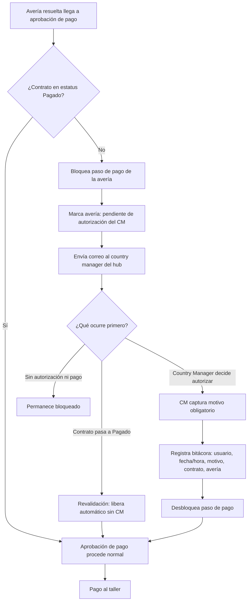

# PRD - Bloqueo de pago de avería a contratos aún no pagados (PV-07)

| **Campo** | **Detalle** |
| --- | --- |
| **Proyecto** | Bloqueo de pago de avería a contratos aún no pagados (PV-07) |
| **Área / empresa** | Garantiplus México (patrocinador; el control aplica a todos los hubs de SIGA) |
| **Versión** | v0.1 |
| **Fecha** | 2026-08-12 |
| **Autores** | Alejandro Govea Hernández |
| **Revisión / liderazgo** | Alexis Salvador Herrera Garcia (alexis.herrera@gplusseguros.mx) |
| **Tipo de proyecto** | Feature web/API |

## 1. Resumen ejecutivo

SIGA gestiona el ciclo de contratos y las averías que los talleres resuelven y cobran. Hoy, una avería puede recorrer el proceso hasta la **aprobación de pago al taller sin que el sistema valide si el contrato asociado ya fue pagado**. Como regla de negocio, una avería solo debería pagarse cuando el contrato está en estatus **Pagado**; sin embargo, contratos en estatus **Registrado** (sin pago confirmado) avanzan libremente, generando riesgo de **pagar averías de contratos que aún no han sido pagados**.

Este proyecto introduce un **control en el paso de aprobación de pago**: al llegar una avería a ese paso, SIGA valida el estatus del contrato. Si el contrato **no está Pagado**, el sistema **bloquea la aprobación de pago** de esa avería, la marca como pendiente y **notifica por correo al country manager**, quien es el único autorizado para decidir —con motivo obligatorio y bitácora— si se paga al taller pese al contrato no pagado. Si el contrato se paga después, el bloqueo se **libera automáticamente** sin intervención del country manager.

El **MVP** cubre: validación del estatus del contrato en el paso de pago, bloqueo automático, aviso por correo al country manager, y acción de autorización/desbloqueo restringida al rol Country Manager con motivo y bitácora. Aplica de forma **transversal a todos los países/hubs de SIGA**.

El resultado esperado es **cerrar la fuga de pagos de averías sobre contratos no pagados**, manteniendo una vía controlada y auditable para los casos legítimos que el country manager decida autorizar.

**Avería llega a pago** → **valida estatus del contrato** → **si no está Pagado: bloquea + avisa al CM** → **CM autoriza (motivo+bitácora) o el contrato se paga** → **pago al taller**

## 2. Contexto y problema

- **Proceso actual:** cuando un taller resuelve una avería, esta avanza en SIGA hasta el paso de **aprobación de pago** al taller. Hoy ese paso **no valida** el estatus de pago del contrato asociado: la avería puede aprobarse y pagarse aunque el contrato esté en **Registrado** (sin pago confirmado).
- **Dolor concreto:** riesgo financiero directo — se pagan averías de contratos que aún no han sido pagados por el cliente. No hay control ni trazabilidad de quién y por qué se pagó en esos casos.
- **Por qué ahora:** es una fuga de dinero evitable; existen además casos legítimos de averías sobre contratos no pagados que **el country manager autoriza**, pero hoy se resuelven sin un mecanismo formal y auditable.
- **Conceptos de dominio a distinguir:**
  - **Contrato Registrado**: alta del contrato sin pago confirmado.
  - **Contrato Pagado**: estatus que habilita, por regla, el pago de sus averías al taller.
  - **Autorización del country manager**: excepción controlada para pagar una avería aun con el contrato no pagado.

## 3. Objetivo del producto

Garantizar que **ninguna avería se pague al taller sobre un contrato que no está en estatus Pagado**, salvo autorización explícita, con motivo y registro en bitácora, del **country manager**. El producto añade una validación y un bloqueo en el paso de aprobación de pago de SIGA, con notificación por correo al country manager y una acción de desbloqueo restringida a ese rol, aplicable a todos los hubs de SIGA. La mejora medible es la **eliminación de pagos de averías sobre contratos no pagados sin autorización**.

## 4. Usuarios y actores

| **Usuario / Actor** | **Rol en el proceso** |
| --- | --- |
| Country Manager | Único autorizado para desbloquear el pago de una avería cuyo contrato no está Pagado; captura el motivo. Recibe el aviso por correo. |
| Operador / área que aprueba pagos de averías | Intenta aprobar el pago; ve el bloqueo y el motivo cuando el contrato no está Pagado. |
| Taller | Resuelve la avería y es el destinatario del pago; su cobro depende de que el pago sea aprobado. |
| SIGA (sistema) | Valida el estatus del contrato, aplica el bloqueo, envía el correo, registra la bitácora y libera automáticamente cuando el contrato se paga. |
| TI / Desarrollo | Implementa y mantiene la validación, el control de permisos y la bitácora. |
| BI / Operación | Consume eventos y métricas de bloqueos y autorizaciones para seguimiento y auditoría. |

## 5. Alcance MVP y funcionalidades

| **Funcionalidad** | **Descripción** |
| --- | --- |
| Validación del contrato en el paso de pago | Al llegar una avería a la aprobación de pago, SIGA valida el estatus del contrato asociado (Pagado vs. no Pagado). |
| Bloqueo del paso de pago | Si el contrato no está Pagado, se bloquea **únicamente** el paso de aprobación de pago de esa avería; el resto del flujo de la avería sigue disponible. |
| Marca de avería pendiente de autorización | La avería queda visiblemente marcada como "pendiente de autorización del country manager", con mensaje claro del motivo del bloqueo. |
| Aviso por correo al country manager | Se envía un correo al country manager con los datos de identificación (contrato, avería, taller, monto, país/hub) informando que hay una avería esperando su decisión. |
| Autorización/desbloqueo (solo Country Manager) | Solo usuarios con rol Country Manager pueden autorizar el pago; la acción exige **motivo obligatorio** y desbloquea el paso de pago de esa avería. |
| Bitácora de autorización | Se registra usuario (CM), fecha/hora, motivo, contrato y avería para auditoría. |
| Auto-liberación al pagarse el contrato | Si el contrato pasa a Pagado antes de la autorización, al revalidar en el paso de pago el bloqueo se libera automáticamente y la aprobación procede sin intervención del CM. |
| Cobertura transversal por hub | El comportamiento aplica a todos los países/hubs de SIGA, resolviendo el country manager destinatario por país. |

**Principio rector del MVP:** el sistema **no paga automáticamente** ninguna avería de un contrato no pagado; toda excepción exige **decisión humana del country manager**, con motivo y registro. El control nunca debe poder saltarse por un rol distinto al Country Manager.

## 6. Fuera de alcance

- **Cambiar el proceso de pago del contrato en sí (cómo/cuándo un contrato pasa a Pagado):** el proyecto solo lee ese estatus; no modifica la conciliación ni el cobro del contrato.
- **Flujo de aprobación multinivel o topes por monto:** en el MVP la autorización es una sola decisión del country manager; escalamientos por monto quedan para una fase posterior (requieren definir umbrales con negocio).
- **Recordatorios/reenvíos automáticos del correo si el CM no actúa:** el MVP envía el aviso una vez; los recordatorios se evaluarán después.
- **Panel/reporte dedicado de averías bloqueadas:** el MVP marca la avería y emite eventos; un tablero específico se valora en una fase posterior con BI.
- **Autorización desde fuera de SIGA (correo/WhatsApp) con captura manual:** se descarta para el MVP; la autorización se ejecuta dentro de SIGA para garantizar permisos y bitácora.

## 7. Flujos principales

Flujo del control en el paso de aprobación de pago de una avería. El punto de entrada es una avería resuelta que llega a la aprobación de pago; la decisión central es el estatus del contrato; las salidas son el pago al taller o el bloqueo con aviso al country manager.

El flujo prioriza la **excepción controlada**: el camino normal (contrato Pagado) no cambia; solo cuando el contrato no está Pagado se activa el bloqueo. Dos vías cierran el bloqueo: que el contrato termine pagándose (liberación automática, sin costo de decisión humana) o que el country manager autorice explícitamente con motivo y bitácora. Mientras no ocurra ninguna, la avería queda retenida solo en su paso de pago.

## 8. Requerimientos funcionales

| **ID** | **Requerimiento** | **Descripción** |
| --- | --- | --- |
| RF-01 | Validar estatus del contrato en el paso de pago | Al llegar una avería a la aprobación de pago, el sistema consulta el estatus del contrato asociado. |
| RF-02 | Bloquear pago si el contrato no está Pagado | Si el contrato no está en estatus Pagado, el sistema bloquea el paso de aprobación de pago de esa avería; el resto del flujo de la avería continúa disponible. |
| RF-03 | Marcar avería pendiente de autorización | El sistema marca de forma visible la avería como "pendiente de autorización del country manager" con mensaje del motivo del bloqueo. |
| RF-04 | Notificar por correo al country manager | El sistema envía un correo al country manager del hub correspondiente con contrato, avería, taller, monto y país. |
| RF-05 | Restringir la autorización al rol Country Manager | Solo usuarios con rol Country Manager pueden ejecutar la acción de autorizar/desbloquear el pago. |
| RF-06 | Exigir motivo al autorizar | Al autorizar, el sistema obliga a capturar un motivo/justificación. |
| RF-07 | Registrar la autorización en bitácora | El sistema guarda usuario (CM), fecha/hora, motivo, contrato y avería. |
| RF-08 | Desbloquear tras autorización | Tras la autorización válida, el sistema desbloquea el paso de aprobación de pago de esa avería. |
| RF-09 | Auto-liberar al pagarse el contrato | Si el contrato pasa a Pagado antes de la autorización, al revalidar en el paso de pago el bloqueo se libera automáticamente, sin intervención del CM. |
| RF-10 | Aplicar el control en todos los hubs | La validación, el bloqueo y la autorización aplican a todos los países/hubs de SIGA, resolviendo el country manager por país. |

## 9. Requerimientos no funcionales

| **ID** | **Requerimiento** | **Descripción** |
| --- | --- | --- |
| RNF-01 | Seguridad / permisos | La acción de autorizar/desbloquear está restringida al rol Country Manager; ningún otro rol puede aprobar el pago de una avería con contrato no pagado. |
| RNF-02 | Trazabilidad / auditabilidad | Toda autorización queda registrada de forma persistente (usuario, fecha/hora, motivo, contrato, avería) para auditoría. |
| RNF-03 | Consistencia de datos | La validación del estatus del contrato se evalúa en el momento del paso de pago (estado actual), habilitando la auto-liberación si el contrato ya fue pagado. |
| RNF-04 | Manejo de errores | Si falla el envío del correo, el bloqueo se mantiene (no se pierde el control) y el fallo se registra para reintento/seguimiento. |
| RNF-05 | Compatibilidad multi-país | Comportamiento uniforme en todos los hubs; el destinatario country manager se resuelve por país. |
| RNF-06 | Observabilidad | Se registran en logs los bloqueos, autorizaciones y auto-liberaciones. |
| RNF-07 | Experiencia de usuario | El operador que intenta aprobar el pago ve un mensaje claro del motivo del bloqueo y del paso a seguir. |

## 10. Integraciones y datos

| **Integración / Fuente** | **Uso esperado** |
| --- | --- |
| SIGA — módulo de averías / aprobación de pago | Lectura del punto de pago; escritura del estado de bloqueo/autorización de la avería. |
| SIGA — contratos | Lectura del estatus del contrato (Registrado / Pagado) por hub. |
| SIGA — roles y usuarios | Identificación del rol Country Manager y del usuario que autoriza, por país. |
| Servicio de correo de SIGA | Envío de la notificación por email al country manager del hub. |
| Bitácora / auditoría de SIGA | Persistencia del registro de autorización (usuario, fecha/hora, motivo, contrato, avería). |

**Datos mínimos:** Contrato (id, estatus Registrado/Pagado, país/hub); Avería (id, contrato asociado, taller, monto a pagar, estado del paso de pago: bloqueado/autorizado); Autorización (usuario CM, fecha/hora, motivo); Country manager por país/hub (correo destino).

**Esquema de permisos:** el sistema **lee** el estatus del contrato y **bloquea** el pago automáticamente; la acción de **autorizar/desbloquear** queda **bloqueada para todos salvo el rol Country Manager**. Ningún rol operativo puede aprobar el pago de una avería con contrato no pagado sin esa autorización.

## 11. Eventos para BI

- `pago_averia_bloqueado_contrato_no_pagado`: se registra cuando el sistema bloquea el paso de pago por contrato no Pagado.
- `notificacion_country_manager_enviada`: se registra cuando se envía el correo de aviso al country manager.
- `pago_averia_autorizado_country_manager`: se registra cuando el country manager autoriza el pago (incluye motivo).
- `pago_averia_liberado_automatico_contrato_pagado`: se registra cuando el bloqueo se libera solo porque el contrato pasó a Pagado.

**Campos mínimos por evento:** fecha/hora, usuario (cuando aplique), id_contrato, id_averia, id_taller, monto, pais/hub, motivo (en la autorización) y resultado.

## 12. Métricas de éxito

| **Métrica** | **Descripción** |
| --- | --- |
| Pagos de averías con contrato no pagado sin autorización | Meta de control: **0**. Es la fuga que el proyecto elimina. |
| Averías bloqueadas por contrato no pagado | Conteo por periodo y por país/hub. |
| Autorizadas por CM vs. auto-liberadas | Número y % de averías desbloqueadas por decisión del CM frente a las liberadas automáticamente al pagarse el contrato. |
| Monto retenido / potencialmente evitado | Suma de montos que quedaron bloqueados a la espera de autorización o pago del contrato (pendiente de línea base con BI/operación). |
| Tiempo de resolución del bloqueo | Tiempo promedio entre el bloqueo y su cierre (autorización o pago del contrato). |

## 13. Riesgos y supuestos

### Riesgos

| **Riesgo** | **Impacto potencial** |
| --- | --- |
| Diferencias en cómo cada hub marca "Pagado" | La validación podría fallar o ser inconsistente entre países si el estatus no es homogéneo. |
| Retraso operativo del country manager | Averías legítimas se frenan si el CM tarda en autorizar (el MVP no envía recordatorios). |
| Falla en el envío del correo | El CM no se entera y la avería queda retenida; se mitiga manteniendo el bloqueo y registrando el fallo. |
| Rol Country Manager no asignado en algún hub | Nadie podría autorizar en ese país, bloqueando pagos legítimos. |

### Supuestos

| **Supuesto** | **Descripción** |
| --- | --- |
| Estatus de contrato confiable | SIGA expone un estatus del que se deriva "Pagado" de forma confiable en todos los hubs. |
| Paso de pago identificable | Existe un punto único e identificable de "aprobación de pago de avería" donde insertar la validación. |
| Rol Country Manager disponible | Existe (o se creará) el rol Country Manager en SIGA, con un usuario y correo por país. |
| Un country manager por hub | Cada país/hub tiene un country manager con correo registrado para el aviso. |

## 14. Preguntas abiertas

| **Tema** | **Pregunta abierta** |
| --- | --- |
| Rol y permisos | ¿El rol Country Manager ya existe en SIGA en todos los hubs o hay que crearlo/asignarlo? |
| Destinatario del aviso | ¿El correo del country manager es único por país? ¿De dónde se toma (configuración, tabla de usuarios)? |
| Contenido del correo | ¿Qué campos incluye, en qué idioma por país, y lleva enlace directo a la avería? |
| Recordatorios | ¿Se reenvía/recuerda el aviso si el CM no actúa en cierto tiempo? (fuera del MVP, ¿se requiere después?) |
| Visibilidad de la bitácora | ¿La bitácora de autorización se muestra en la avería y/o en un reporte accesible a auditoría/BI? |
| Topes por monto | ¿Existe un monto por encima del cual se requiera una autorización adicional o distinta? |
| BI y métricas | Confirmar con BI/operación los eventos definitivos y la línea base de las métricas (montos, tiempos). |
