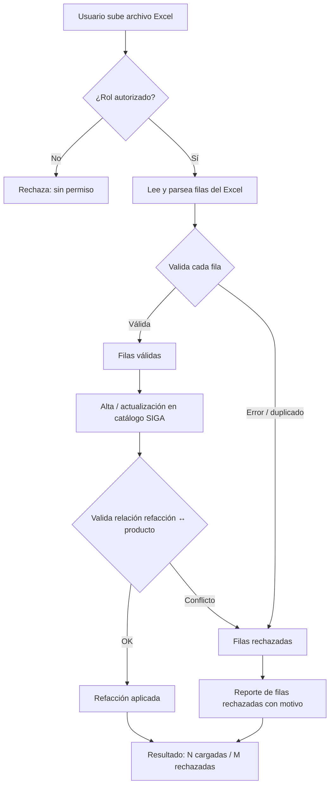

# PRD - Catálogo de Refacciones

| **Campo** | **Detalle** |
| --- | --- |
| **Proyecto** | Catálogo de Refacciones |
| **Área / empresa** | Garantiplus México |
| **Versión** | v0.1 |
| **Fecha** | 2026-07-23 |
| **Autores** | Operaciones / Averías |
| **Revisión / liderazgo** | Alexis Salvador Herrera García (alexis.herrera@gplusseguros.mx) |
| **Tipo de proyecto** | Feature web / API |

## 1. Resumen ejecutivo

El proyecto habilita al **área operativa autorizada** a **mantener el catálogo de refacciones de SIGA** (Garantiplus México) de forma autónoma, sin depender de TI para cada alta o cambio. Hoy el catálogo es limitado y difícil de actualizar: registrar componentes nuevos requiere intervención de TI, lo que retrasa la resolución de averías.

El sistema ya cuenta con un CRUD de refacciones (`RefaccionesController`), pero su mantenimiento no está en manos del área operativa. Este desarrollo extiende esa base para permitir **alta y edición individual** de refacciones y, adicionalmente, **carga masiva por Excel**, todo bajo el **esquema de permisos por rol ya existente** en SIGA y **validando el impacto sobre la relación refacción↔producto** (permitidas / no permitidas).

El MVP cubre, en una sola entrega: alta/edición individual, carga masiva por Excel con validación por fila, control por rol y validación de la relación con producto. La trazabilidad/auditoría queda para una fase posterior.

El resultado esperado es **eficiencia operativa**: un catálogo actualizable por quien lo necesita, que **agiliza la resolución de averías** y **reduce la dependencia de TI**.

**Área autorizada sube/edita refacción** → **valida rol y datos** → **aplica en catálogo SIGA** → **valida relación con producto** → **refacción disponible**

## 2. Contexto y problema

- **Hoy:** el catálogo de refacciones vive en SIGA con un CRUD (`RefaccionesController`), pero el alta de componentes nuevos y las modificaciones dependen de TI. El área operativa (Averías) no puede mantenerlo por sí misma.
- **Dolor:** el catálogo es limitado y difícil de actualizar; los componentes nuevos no pueden registrarse a tiempo, lo que **frena la resolución de averías** y genera **dependencia de TI** para tareas de mantenimiento operativo.
- **Por qué ahora:** se busca eficiencia operativa y autonomía del área, quitando a TI del camino crítico del mantenimiento del catálogo.
- **Concepto clave del dominio:** las refacciones se clasifican como **permitidas / no permitidas por producto**; cualquier alta o edición debe respetar y validar esa relación para no dejar el catálogo inconsistente.

## 3. Objetivo del producto

Permitir al área autorizada **mantener el catálogo de refacciones de SIGA** —alta/edición individual y carga masiva por Excel— de forma **autónoma y controlada**, reduciendo la dependencia de TI y agilizando la resolución de averías. Es una **entrega única** (sin fases), apoyada en el CRUD y el esquema de roles ya existentes en SIGA.

## 4. Usuarios y actores

| **Usuario / Actor** | **Rol en el proceso** |
| --- | --- |
| Área autorizada (según rol de usuario ya definido en SIGA) | Crea y edita refacciones (individual y por carga masiva Excel). |
| Operaciones / Averías (solicitante — Alexis Salvador Herrera García) | Impulsa la necesidad; usuario operativo del catálogo actualizado. |
| Administrador General (TI) | Acceso total; configura permisos y da soporte. |
| Consumidores del catálogo | Usan las refacciones al resolver averías (rol específico *pendiente de definir* — ver sección 13). |

## 5. Alcance MVP y funcionalidades

| **Funcionalidad** | **Descripción** |
| --- | --- |
| Alta de refacción | Crear refacciones nuevas, incluyendo componentes que hoy no pueden registrarse. |
| Edición de refacción | Modificar refacciones existentes (sobre el CRUD actual `RefaccionesController`). |
| Carga masiva por Excel | Subir un archivo Excel para dar de alta/actualizar múltiples refacciones; **carga las filas válidas y reporta las rechazadas**. |
| Control por permisos / rol | Solo el rol autorizado puede crear/editar; los demás solo consultan. Reutiliza el esquema de roles existente en SIGA. |
| Validación refacción ↔ producto | Al crear/editar (individual o masivo), valida el impacto en refacciones permitidas / no permitidas por producto. |

**Principio rector del MVP:** no permitir que un rol no autorizado modifique el catálogo, ni que una carga masiva deje refacciones en estado inconsistente respecto a los productos.

## 6. Fuera de alcance

- **Rediseño del esquema de roles/permisos:** se usa el que ya existe en SIGA; no se crean nuevos roles. *(Habilitable después si se requiere un perfil dedicado de "catálogo".)*
- **Eliminación física de refacciones:** no se borran definitivamente, para no romper históricos ni averías; una eventual desactivación sería de una fase futura.
- **Trazabilidad / auditoría (quién y cuándo, bitácora de cargas):** diferida a una fase posterior.
- **Reportes / BI sobre el catálogo:** fuera del MVP.
- **Migración o depuración masiva del catálogo actual:** el MVP habilita el mantenimiento, no limpia el catálogo histórico existente.

## 7. Flujos principales

Flujo de la **carga masiva por Excel**, que concentra la lógica de decisión del MVP (validación por fila, carga parcial y reporte de rechazos):

El flujo prioriza **no bloquear toda la carga por errores individuales**: valida rol primero, procesa fila por fila, aplica solo las válidas y consistentes con la relación producto, y devuelve un **reporte claro** de lo cargado y lo rechazado con su motivo. El alta/edición **individual** sigue el mismo tronco (validación de rol → validación refacción↔producto → aplicación), sin el paso de parseo de archivo.

## 8. Requerimientos funcionales

| **ID** | **Requerimiento** | **Descripción** |
| --- | --- | --- |
| RF-01 | Alta de refacción | El sistema permite al rol autorizado crear una refacción nueva en el catálogo de SIGA. |
| RF-02 | Edición de refacción | El sistema permite al rol autorizado modificar los datos de una refacción existente. |
| RF-03 | Carga masiva por Excel | El sistema permite subir un Excel para alta/actualización múltiple; carga las filas válidas y **omite y reporta** las que tengan error o duplicado. |
| RF-04 | Reporte de resultado de carga | Al terminar una carga masiva, el sistema muestra el total de filas cargadas y el detalle de las rechazadas con su motivo. |
| RF-05 | Control de acceso por rol | Solo el rol autorizado puede crear/editar refacciones; los demás perfiles solo consultan. |
| RF-06 | Validación refacción ↔ producto | En toda alta/edición (individual o masiva), el sistema valida el impacto sobre refacciones permitidas / no permitidas por producto y rechaza lo inconsistente. |

## 9. Requerimientos no funcionales

| **ID** | **Requerimiento** | **Descripción** |
| --- | --- | --- |
| RNF-01 | Seguridad y permisos | Reutiliza el esquema de roles de SIGA; solo el rol autorizado modifica el catálogo. Administrador General (TI) con acceso total. |
| RNF-02 | Consistencia de datos | La carga masiva no deja el catálogo inconsistente: valida por fila y aplica solo las válidas y consistentes con la relación producto. |
| RNF-03 | Manejo de errores | La carga parcial no aborta por un error individual; reporta con claridad las filas rechazadas y su motivo. |
| RNF-04 | Usabilidad | El reporte de carga es entendible para un usuario operativo (no técnico). |
| RNF-05 | Mantenibilidad | Se extiende el `RefaccionesController` existente sin duplicar la lógica de negocio del catálogo. |

## 10. Integraciones y datos

| **Integración / Fuente** | **Uso esperado** |
| --- | --- |
| SIGA — `RefaccionesController` / base de datos (PostgreSQL / RDS) | Lectura y escritura del catálogo de refacciones y de su relación con productos. Todo el desarrollo vive dentro de SIGA; sin servicios externos. |

**Datos mínimos (borrador — a confirmar contra el modelo real de `RefaccionesController`, ver sección 13):** clave/código de refacción, descripción/nombre, categoría o tipo, estatus (activo/inactivo) y la relación con producto(s) (permitida / no permitida).

**Esquema de permisos:** cualquier usuario con acceso al catálogo puede **leer**; solo el **rol autorizado** puede **crear/editar** (individual o por carga masiva); el **Administrador General (TI)** tiene acceso total. La definición de roles **ya existe en SIGA** y no se modifica en este MVP.

## 11. Métricas de éxito

*Sin línea base disponible; todas quedan pendientes de validar con operación/BI para fijar meta numérica.*

| **Métrica** | **Descripción** |
| --- | --- |
| Altas/ediciones hechas por el área autorizada | # de refacciones creadas/editadas sin intervención de TI (mide autonomía). *(Pendiente línea base.)* |
| Reducción de solicitudes a TI | Baja en tickets/pedidos a TI para dar de alta o modificar refacciones. *(Pendiente línea base.)* |
| Tiempo de alta de una refacción nueva | Tiempo de "se necesita" a "disponible en catálogo". *(Pendiente línea base.)* |
| Éxito de cargas masivas | % de filas cargadas correctamente vs. rechazadas por carga. *(Pendiente línea base.)* |

## 12. Riesgos y supuestos

### Riesgos

| **Riesgo** | **Impacto potencial** |
| --- | --- |
| Carga masiva mal formada | Refacciones inconsistentes respecto a productos si la validación no es robusta. |
| Falta de plantilla/formato de Excel definido | Retraso en el desarrollo y en la adopción por el área. |
| Rol mal configurado | Ediciones indebidas al catálogo por perfiles no autorizados. |

### Supuestos

| **Supuesto** | **Descripción** |
| --- | --- |
| Roles de SIGA vigentes | El esquema de roles/permisos ya distingue al área autorizada y funciona. |
| CRUD reutilizable | El `RefaccionesController` existente es estable y reutilizable. |
| Relación refacción↔producto modelada | La relación permitidas/no permitidas ya está modelada en SIGA. |

## 13. Preguntas abiertas

| **Tema** | **Pregunta abierta** |
| --- | --- |
| Consumidores del catálogo | ¿Qué rol/usuario consume las refacciones al resolver averías? |
| Modelo de datos | ¿Cuáles son los campos exactos de una refacción en `RefaccionesController`? |
| Carga masiva | ¿Cuál será el formato/plantilla del Excel y las reglas de duplicados? |
| Rol autorizado | ¿Qué rol específico de SIGA es "el área autorizada" para crear/editar? |
| Área / empresa | El solicitante usa correo @gplusseguros.mx; confirmar si el área/empresa es Garantiplus México o Gplus Seguros. |
