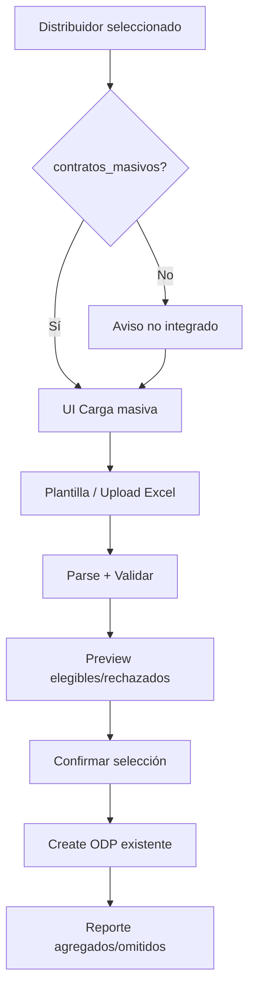

# Plan de Desarrollo — Carga masiva de contratos a Orden de Pago (PJ1027)

> Generado por Claude Code a partir del PRD correspondiente.
> Este documento es el punto de partida para la ejecución. El programador lo valida y refina antes de ejecutar.

| Campo | Detalle |
|---|---|
| PRD de origen | `enginecx_prd/SIGA/PJ1027-carga-masiva-contratos-odp/PRD.md` |
| Repositorio | `gp_4.0_siga` (SIGA Web — GarantiplusWeb) |
| Rama base | `develop` |
| Rama | `feature/PJ1027-carga-masiva-contratos-odp` |
| Tipo | Feature |
| Responsable | Alejandro Govea Hernandez |
| Folio PRD | `PJ1027` |
| Fecha de generación | 2026-07-23 |
| Estado | Borrador |
| ID plan (BD) | 17 |
| Modelo / esfuerzo | Claude Opus 4.8 (`claude-opus-4-8`) — normal |

---

## 1. Resumen técnico

Habilitar en **SIGA Web** la **carga masiva de folios de contrato** al armar una Orden de Pago (ODP): el operador descarga una plantilla Excel, sube los folios, el sistema valida elegibilidad, muestra preview (elegibles / rechazados con motivo, con deselección) y, tras confirmar, alimenta el flujo existente de creación de ODP (`poliza_ordenpago` en lote).

- **Arquitectura:** modificación sobre monolito existente SIGA Web (EC2 + .NET 8 + Razor/MVC Areas). No se crea microservicio nuevo ni endpoint en API de SIGA.
- **Stack:** .NET 8 / C#, MVC Areas + jQuery, PostgreSQL, EPPlus (`OfficeOpenXml`) ya usado en el proyecto.
- **Base reutilizable:**
  - `OrdenesPagoController` — `ContractsRegistered` / `Pregeneracion` / `Create` (alta de `poliza_ordenpago`). **No hay** hoy endpoint para agregar contratos a una ODP ya creada (`Details` es solo lectura).
  - `VentasBusinessRules.GetContractsForPaymentOrder` — reglas de elegibilidad por `id_momento_facturacion` del distribuidor.
  - Flag `distribuidor.contratos_masivos` (ya existe; **aún no cableado** al flujo ODP).
  - Patrón Excel a copiar: `CargaCodigos` en el mismo controller (EPPlus directo). Ver nota sobre `BatchLoadFromExcel` abajo.
- **Países:** México, Colombia y Chile (vistas `_EditMEX` / `_EditCOL` / `_EditCHL` + lógica compartida en controller / business rules).
- **Sin recursos AWS nuevos.** Despliegue habitual de SIGA Web.

**Nota `BatchLoadFromExcel`:** existe el ensamblado `Common/BatchLoad/src/BatchLoadFromExcel` con interfaces `IBatchLoader` / `IValidatableBatchLoader`, pero `BatchLoader` hoy lanza `NotImplementedException` y **ningún `.csproj` de GarantiplusWeb lo referencia**. Para el MVP se usará **EPPlus directo** (mismo patrón que catálogos / reportes). Completar el stub genérico queda **fuera de alcance** salvo que el programador lo pida explícitamente.

---

## 2. Prerequisitos

- [ ] PRD validado por revisión / liderazgo (Alexis Salvador Herrera Garcia)
- [ ] Acceso al repositorio `gp_4.0_siga` confirmado
- [ ] Rama `develop` actualizada (completado al generar este plan — *Already up to date*)
- [ ] `CLAUDE.md` presente en el repositorio ✅
- [ ] Ambiente local con BD del país de prueba (MEX / COL / CHL) y ODP de prueba
- [ ] **Cerrar preguntas abiertas del PRD §14** en Fase 0 (transaccionalidad, tope de filas, estados válidos, semántica del flag, columnas de plantilla)
- [ ] No se requieren secrets nuevos para el MVP

---

## 3. Arquitectura del cambio

Se respeta la arquitectura monolítica de SIGA Web (`rules/arquitectura.md`): feature sobre componente existente.

```
[Operador] → [Views OrdenesPago _Edit{MEX|COL|CHL} + Create]
    → [OrdenesPagoController: plantilla / preview / confirmación]
        → [Parse EPPlus folios]
        → [Validación = mismas reglas que GetContractsForPaymentOrder
            + pertenencia al distribuidor + no duplicado en lote]
        → [Preview JSON: elegibles | rechazados+motivo]
        → [Confirmación] → reutiliza Pregeneracion/Create
            → [PostgreSQL: orden_pago + poliza_ordenpago]
```

**Decisión de diseño:** no reinventar el alta de ODP. La carga masiva **selecciona y valida** contratos; la persistencia sigue el `Create` existente (transacción ya usada hoy). El preview es un paso previo; la confirmación dispara el mismo camino de negocio que marcar checkboxes y generar la ODP.

**Flag `contratos_masivos`:** no bloquea la operación (PRD RF-02); muestra aviso de que el distribuidor no está integrado al flujo ODP. Confirmación operativa del copy/semántica en T-01.



---

## 4. Tareas de desarrollo

### Fase 0 — Alineación funcional y reglas reales (P1)

- [ ] **T-01** — Cerrar preguntas abiertas del PRD contra código y operación
  - **Estado válido:** en código actual = `"Registrado"` (`EstatusContratos.CONTRATO_REGISTRADO` / filtros en `GetContractsForPaymentOrder` y `Create`). Confirmar con operación si hay excepciones por país.
  - **Elegibilidad completa:** reutilizar `VentasBusinessRules.GetContractsForPaymentOrder` (rama por `id_momento_facturacion`: caso 2 “Orden de pago” vs default con factura sellada). Documentar motivos de rechazo en español.
  - **Flag:** confirmar copy del aviso y que se puede confirmar igual tras el aviso (PRD RF-02).
  - **Plantilla:** solo columna `folio` / `id_contrato` vs columnas de apoyo no validadas.
  - **Tope de filas** y **semántica transaccional:** propuesta técnica — tope configurable (p. ej. 500–2000); alta = misma transacción del `Create` actual (todo-o-nada al generar la ODP; el lote parcial solo aplica a **omisión de rechazados en preview**, no a fallos a mitad de insert).
  - Archivos: nota en `PLAN.md` §12 / `AVANCE.md`
  - Criterio de completitud: respuestas documentadas; sin bloqueos abiertos para Fase 1–2

- [ ] **T-02** — Inventario de puntos de extensión UI/API
  - Mapear `getContracts()` en `_EditMEX` / `_EditCOL` / `_EditCHL`, `Create.cshtml`, roles de `OrdenesPagoController`
  - Confirmar que el MVP aplica al **armar ODP (Create)**, no a editar ODP ya autorizada/cerrada
  - Criterio de completitud: lista de archivos a tocar cerrada y acordada

### Fase 1 — Backend: plantilla, validación y preview (P1)

- [ ] **T-03** — Descargar plantilla Excel
  - Acción MVC `GET` que genera `.xlsx` con encabezado de folio (EPPlus)
  - Archivos: `OrdenesPagoController.cs` (+ helper estático/parcial si el controller crece)
  - Criterio de completitud: descarga un Excel usable con una fila de ejemplo opcional

- [ ] **T-04** — Parseo de Excel y validación de elegibilidad por folio
  - Leer folios; deduplicar dentro del archivo; rechazar filas vacías / no numéricas
  - Por folio: existe, estado válido, pertenece al `id_distribuidor` de la ODP, elegible según mismas reglas que el listado actual, no ya seleccionado/duplicado en el lote
  - Motivos claros en español (RNF-03, RNF-06)
  - Preferir servicio/clase en `FinanzasBusinessRules` o helper dedicado inyectable/llamado desde el controller — **sin refactor amplio** del `Create` existente
  - Archivos: nuevo helper/service + `OrdenesPagoController`; posible DTO interno de preview
  - Criterio de completitud: dado un Excel de prueba, clasifica elegibles vs rechazados con motivos correctos

- [ ] **T-05** — Endpoint de preview (sin escritura)
  - `POST` multipart: archivo + `id_distribuidor` (+ anti-forgery)
  - Respuesta JSON: totales, lista elegibles (datos mínimos para UI), lista rechazados + motivo
  - Emitir/registrar evento o log estructurado alineado a `carga_masiva_iniciada` / `carga_masiva_preview_generado` (PRD §11) vía `ILogger` / patrón de auditoría existente si lo hay
  - Archivos: `OrdenesPagoController.cs`
  - Criterio de completitud: preview no crea `orden_pago` ni `poliza_ordenpago`

- [ ] **T-06** — Aviso por `contratos_masivos`
  - Al cargar distribuidor / al abrir carga masiva: si `contratos_masivos == false`, devolver flag + mensaje de aviso (no bloquear)
  - Archivos: endpoint de contratos existente o preview + JS en vistas país
  - Criterio de completitud: RF-02 verificable en UI

### Fase 2 — UI preview, confirmación y reporte (P1)

- [ ] **T-07** — UI “Carga masiva de contratos” en pantallas de armar ODP
  - Botón/enlace visible con distribuidor seleccionado; descarga plantilla; input file; envío a preview
  - Aplicar en `_EditMEX.cshtml`, `_EditCOL.cshtml`, `_EditCHL.cshtml` (y `Create.cshtml` si concentra JS compartido)
  - Mismos roles que agregar contratos hoy (RNF-01): sin rol nuevo
  - Criterio de completitud: operador llega al preview sin salir del flujo de ODP

- [ ] **T-08** — Preview accionable (deselección) + confirmación de lote parcial
  - Tabla/listas: elegibles (checkbox, todos marcados por defecto) y rechazados (solo lectura + motivo)
  - Confirmar: solo IDs elegibles aún seleccionados; rechazados omitidos
  - Integrar con flujo actual: marcar `contratos[]` / llamar `Pregeneracion` + continuar a `Create`, **o** acción dedicada que reutilice la misma lógica de `Create` sin duplicar reglas de negocio
  - Log/evento `carga_masiva_confirmada` (agregados / omitidos)
  - Criterio de completitud: RF-06, RF-07, RF-08, RF-09; ODP queda consistente como en alta manual

- [ ] **T-09** — Reporte de resultado post-confirmación
  - Resumen en UI: agregados / omitidos (con motivo); coherente si `Create` falla (mensaje de error sin estado a medias — misma transacción actual)
  - Criterio de completitud: operador entiende el resultado sin consultar BD

- [ ] **T-10** — Tope de volumen y manejo de errores de archivo
  - Validar extensión `.xlsx`, tamaño máximo, tope de filas (config opcional en `appsettings`)
  - Archivo corrupto / columna faltante → 400 con mensaje claro, sin abortar la sesión de ODP
  - Criterio de completitud: RNF-03, RNF-04 cubiertos con pruebas manuales de borde

### Fase 3 — Multi-país, auditoría y cierre (P1)

- [ ] **T-11** — Verificar comportamiento multi-país
  - Probar (o checklist con datos) MEX / COL / CHL: elegibilidad según `GetContractsForPaymentOrder` / momento de facturación del distribuidor
  - Asegurar que no se asume lógica solo México en el parseo
  - Criterio de completitud: RNF-07 documentado en AVANCE con resultado por país disponible en el ambiente del dev

- [ ] **T-12** — Trazabilidad / auditoría (RNF-02) y eventos BI mínimos
  - Registrar usuario, timestamp, `id_orden` (si ya existe al confirmar) o pre-create context, `id_distribuidor`, conteos
  - Si no hay tabla de bitácora dedicada: Serilog estructurado + campos mínimos del PRD §11; no inventar microservicio BI
  - Criterio de completitud: se puede rastrear quién ejecutó una carga y el resultado agregado

- [ ] **T-13** — Pruebas manuales y checklist de aceptación
  - Matriz: Excel 100% OK; mixto; todos inválidos; flag off con aviso; sin permiso; archivo inválido; volumen cerca del tope
  - Criterio de completitud: §10 marcada; hallazgos críticos cerrados

---

## 5. Cambios en base de datos *(si aplica)*

| Tabla | Tipo de cambio | Descripción |
|---|---|---|
| `distribuidor` | Sin cambio | Columna `contratos_masivos` ya existe |
| `orden_pago` | Sin cambio de esquema | Se reutiliza alta actual |
| `poliza_ordenpago` | Sin cambio de esquema | Alta en lote vía `Create` existente |
| `contrato` / `poliza` | Solo lectura | Validación de elegibilidad |

> No se esperan migraciones. Si operación exige bitácora persistente en BD (más allá de logs), evaluar en T-12 como **extensión opcional** (fuera del MVP mínimo del PRD si los logs bastan).

---

## 6. Endpoints nuevos o modificados *(si aplica)*

| Método | Ruta (MVC Area Contratos) | Descripción | Estado |
|---|---|---|---|
| GET/POST | `/Contratos/OrdenesPago/Create` | Alta ODP + `poliza_ordenpago` | Sin cambio de contrato; alimentado por IDs de la carga |
| POST | `/Contratos/OrdenesPago/Pregeneracion` | Preview económico actual | Reutilizado / invocado tras selección masiva |
| *(existente)* | acción que alimenta `getContracts()` | Listado elegibles | Posible extensión: devolver `contratos_masivos` |
| GET | `/Contratos/OrdenesPago/DescargarPlantillaCargaMasiva` | Plantilla Excel de folios | **Nuevo** |
| POST | `/Contratos/OrdenesPago/PreviewCargaMasiva` | Parse + validación + preview JSON | **Nuevo** |
| POST | `/Contratos/OrdenesPago/ConfirmarCargaMasiva` *(opcional)* | Si no se reutiliza Create vía JS | **Nuevo solo si T-08 lo requiere** |

> No son APIs REST versionadas: acciones MVC del Area Contratos (patrón SIGA Web). Mismos roles que Create/Pregeneracion.

---

## 7. Variables de entorno y configuración *(si aplica)*

| Variable | Descripción | Ambiente |
|---|---|---|
| *(ninguna nueva obligatoria)* | EPPlus y connection string ya existen | — |
| `OrdenesPago:CargaMasiva:MaxFileSizeMb` (opcional) | Tope de tamaño Excel | Desarrollo / QA / Prod |
| `OrdenesPago:CargaMasiva:MaxRows` (opcional) | Tope de filas por carga | Desarrollo / QA / Prod |

Secrets: no aplica. Connection string sigue en configuración existente.

---

## 8. Consideraciones de seguridad

- Mismos roles que agregar contratos a ODP hoy (RNF-01); sin rol nuevo
- `[ValidateAntiForgeryToken]` en POSTs de preview/confirmación
- Validar tipo `.xlsx`, tamaño y número de filas
- Solo leer valores de celdas (no macros)
- No registrar PII innecesaria ni dumps completos del Excel en logs
- No autorizar/cerrar la ODP desde esta feature (fuera de alcance)

---

## 9. Consideraciones de infraestructura *(si aplica)*

- **Sin recursos AWS nuevos.** Cambio en SIGA Web (EC2 existente por país).
- Sin cambios en ECS, esquema RDS (esperado), S3, Cloudflare o Route 53.
- Despliegue: proceso habitual de SIGA Web en cada instancia país.

---

## 10. Criterios de aceptación

- [ ] Con distribuidor seleccionado, existe la opción “Carga masiva de contratos” (RF-01)
- [ ] Si `contratos_masivos` es false, se muestra aviso y se puede continuar (RF-02)
- [ ] Se descarga plantilla con columna de folio (RF-03)
- [ ] Se importa Excel y se extraen folios (RF-04)
- [ ] Cada folio se valida: estado, distribuidor, no duplicado en lote, no comprometido en otra ODP según reglas actuales (RF-05)
- [ ] Preview muestra elegibles y rechazados con motivo; se pueden deseleccionar elegibles (RF-06)
- [ ] Al confirmar, solo entran elegibles seleccionados; rechazados se omiten (RF-07)
- [ ] Se crean `poliza_ordenpago` vía el flujo de Create (RF-08)
- [ ] Resumen final de agregados / omitidos (RF-09)
- [ ] Mismos permisos que alta manual (RNF-01)
- [ ] Queda registro de quién/cuándo/conteos (RNF-02)
- [ ] Errores de archivo no tumban el flujo completo (RNF-03)
- [ ] Funciona en instancias MEX / COL / CHL (RNF-07)
- [ ] Código nuevo en inglés; mensajes de usuario en español

---

## 11. Riesgos técnicos identificados

| Riesgo | Probabilidad | Impacto | Mitigación |
|---|---|---|---|
| Volúmenes grandes degradan preview/`GetContractsForPaymentOrder` | Media | Alto | Tope de filas; validar por lookup de folios (no cargar todo el listado del distribuidor a memoria si es enorme) |
| Malentendido: agregar a ODP existente vs armar en Create | Media | Alto | T-02 confirma alcance Create; no implementar remoción/edición masiva |
| Diferencias de elegibilidad por `id_momento_facturacion` / país | Alta | Alto | Reutilizar `GetContractsForPaymentOrder`; pruebas T-11 |
| `BatchLoadFromExcel` citado en PRD pero stub | Baja | Bajo | EPPlus directo; documentado en §1 |
| Semántica “todo-o-nada” vs “best-effort” confunde a operación | Media | Medio | Aclarar en T-01: parcial = omitir inválidos en preview; Create sigue atómico |
| Duplicar lógica de `Create` al confirmar | Media | Medio | Reutilizar Create/Pregeneracion; no copiar bloques de transacción |

---

## 12. Notas para el programador

1. **Preguntas abiertas (cerrar en T-01)** — ver PRD §14. Propuestas por defecto del plan:
   - Estado válido = `Registrado`.
   - Flag = aviso + permitir continuar.
   - Plantilla = una columna `id_contrato` (folio).
   - Transacción = lote parcial en preview; Create atómico.
   - Tope = configurable (sugerido 1000 filas) hasta que operación defina otro.

2. **Hallazgos de código al planear:**
   - Alta actual: `OrdenesPagoController.Create` crea `poliza_ordenpago` dentro de transacción (≈ L931+).
   - Listado elegibles: `ContractsRegistered` → `VentasBusinessRules.GetContractsForPaymentOrder` (≈ L1364+).
   - **Hueco a cerrar en T-04:** `Pregeneracion`/`Create` solo revalidan `Registrado` + mismo distribuidor; **no** revalidan “no en otra ODP” ni `medio_pago`. La carga masiva debe aplicar la elegibilidad completa del listado (o intersectar folios con el set de `GetContractsForPaymentOrder`) antes de confirmar.
   - Matiz momento facturación: en case 2 (ODP), un contrato puede seguir elegible si ya está en otra ODP **sin** factura (`id_factura` vacío/0); en `default` (p. ej. CO), cualquier ODP no cancelada lo excluye.
   - UI: checkboxes `contratos[]` vía `getContracts()` → `ContractsRegistered`.
   - Patrón Excel: `CargaCodigos` (pagos por código bancario) — no confundir con carga de contratos.
   - `contratos_masivos` ya editable en catálogo Distribuidores; falta cablearlo al aviso ODP.

3. **No refactorizar** `OrdenesPagoController` completo ni migrar a API de SIGA; solo el alcance del PRD.

4. **Fuera de alcance:** CSV/API externa, crear/editar contratos, autorizar/cerrar ODP, remoción masiva, implementar el stub genérico `BatchLoadFromExcel`.

5. **Identificador en Excel:** el “folio” operativo es `contrato.id_contrato` (long), no el folio fiscal de factura — confirmar wording de plantilla con operación en T-01.

---

## 13. Relación de tareas y tiempos

| Fase | Incluye | Tareas | Días hábiles (rango) | ID (BD) |
|---|---|---|---|---|
| **Fase 0 — Alineación (P1)** | Preguntas abiertas, inventario UI/API | T-01 a T-02 | 1 – 2 días | 13 |
| **Fase 1 — Backend preview (P1)** | Plantilla, parseo, validación, preview, flag | T-03 a T-06 | 2 – 4 días | 14 |
| **Fase 2 — UI + confirmación (P1)** | UI masiva, preview accionable, Create, reporte, topes | T-07 a T-10 | 3 – 5 días | 15 |
| **Fase 3 — Multi-país y cierre (P1)** | MEX/COL/CHL, auditoría/BI logs, pruebas | T-11 a T-13 | 2 – 3 días | 16 |
| **Total proyecto (P1 completo)** | Entrega única del MVP | 13 tareas | **~8 – 14 días hábiles (≈ 1.5 – 3 semanas)** | — |
| **Solo P1 (guardarraíl del PRD)** | Todo el MVP es P1 (sin P2/P3 en el PRD) | T-01 a T-13 | **~8 – 14 días hábiles** | — |

> El PRD declara **alcance único (MVP)** sin fases de producto posteriores y **sin fecha límite**. Las “fases” de esta tabla son solo desglose técnico de ejecución.
>
> **Riesgo de deadline:** no hay fecha límite en el PRD. Con un desarrollador, el rango realista es **8–14 días hábiles**. El mayor riesgo de desvío es T-01 (criterios de elegibilidad / plantilla) y T-11 (diferencias por momento de facturación entre países). Un segundo desarrollador puede comprimir ~20–30% si separa UI (Fase 2) de validación backend (Fase 1) **después** de cerrar T-01; no paralelizar antes.

---

*Generado por Claude Code — Engine CX*
*Basado en: `rules/infraestructura.md`, `rules/coding-guidelines.md`, `rules/stack.md`, `rules/arquitectura.md`, `rules/version-control.md`*
*Modelo: Claude Opus 4.8 (`claude-opus-4-8`) — esfuerzo: normal*
*Rama base verificada: `develop` (up to date con origin)*
