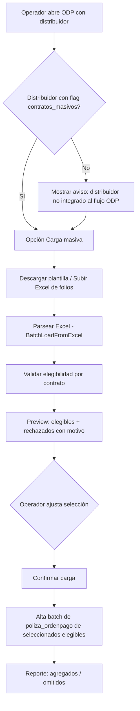

# PRD - Carga masiva de contratos a Orden de Pago

| **Campo** | **Detalle** |
| --- | --- |
| **Proyecto** | Carga masiva de contratos a Orden de Pago (ODP) |
| **Área / empresa** | Garantiplus México (aplica a los 3 países: México, Colombia, Chile) |
| **Versión** | v0.1 |
| **Fecha** | 2026-07-23 |
| **Autores** | Operaciones (solicitante) |
| **Revisión / liderazgo** | Alexis Salvador Herrera Garcia (alexis.herrera@gplusseguros.mx) |
| **Tipo de proyecto** | Feature web/API (SIGA) |

## 1. Resumen ejecutivo

El proyecto habilita la **carga masiva de contratos a una Orden de Pago (ODP)** dentro de SIGA, para el área de Operaciones / Administración financiera. Hoy, agregar contratos a una ODP se hace **contrato por contrato**: el operador consulta el distribuidor, SIGA muestra el listado de contratos que puede agregar, y el operador debe **ubicar manualmente** cada contrato dentro de ese listado — proceso lento y propenso a error cuando el volumen es alto.

La mejora permite **importar un Excel con los folios de contrato** a agregar. El sistema los valida contra las reglas de elegibilidad, muestra un **preview** de elegibles y rechazados (con motivo) y, tras la confirmación del operador, crea en **lote** los registros correspondientes (`poliza_ordenpago`).

El **MVP** cubre: importación por Excel (folio de contrato), validación de elegibilidad, preview con deselección, confirmación de lote parcial y creación batch. Es un **alcance único** (sin fases posteriores planeadas en este PRD).

El resultado esperado es **ahorro de horas operativas**, menos errores de captura y mayor rapidez para armar ODP con muchos contratos.

**Abrir ODP (distribuidor)** → **Importar Excel de folios** → **Validar elegibilidad + preview** → **Confirmar** → **Alta batch en la ODP**

## 2. Contexto y problema

- **Proceso actual:** en SIGA, al armar una ODP se consulta el distribuidor y el sistema despliega el listado de todos los contratos que se pueden agregar. El operador agrega los contratos **uno a uno**; el cuello de botella es **localizar** dentro de ese listado los contratos específicos que se quieren incluir, lo cual es tardado cuando son muchos.
- **Dolor concreto:** alto costo de tiempo operativo, fricción y riesgo de error/omisión al capturar en volumen.
- **Por qué ahora:** oportunidad de eficiencia operativa de alto impacto en Administración financiera; ahorra horas al procesar contratos en lote.
- **Conceptos de dominio:** *Contrato* (identificado por su folio) vs. *poliza_ordenpago* (el vínculo contrato↔ODP que se crea al agregarlo). *Distribuidor* es el eje por el que se listan los contratos elegibles.

## 3. Objetivo del producto

Permitir que un operador agregue **múltiples contratos a una ODP en una sola operación**, importando un Excel de folios, con validación automática de elegibilidad y confirmación previa, reduciendo drásticamente el tiempo frente al alta manual contrato por contrato. Es un alcance único (MVP), sin fases posteriores planeadas.

## 4. Usuarios y actores

| **Usuario / Actor** | **Rol en el proceso** |
| --- | --- |
| Operador de Operaciones / Admin. financiera | Arma la ODP, importa el Excel, revisa el preview y confirma la carga masiva. |
| Revisión / liderazgo (Alexis Salvador Herrera Garcia) | Revisión técnica y liderazgo del desarrollo. |
| SIGA (sistema) | Provee el listado de contratos por distribuidor, valida elegibilidad y persiste los `poliza_ordenpago`. |

## 5. Alcance MVP y funcionalidades

| **Funcionalidad** | **Descripción** |
| --- | --- |
| Punto de entrada de carga masiva | Opción "Carga masiva de contratos" disponible al armar una ODP con distribuidor seleccionado. Si el distribuidor **no** tiene habilitado el flag `contratos_masivos`, se **permite** la operación pero se **advierte** que no está integrado al flujo ODP. |
| Plantilla de Excel descargable | El sistema ofrece una plantilla con la columna de **folio de contrato**. |
| Importación / parseo de Excel | Carga del Excel y lectura de los folios (reutilizando la infraestructura `BatchLoadFromExcel` si aplica). |
| Validación de elegibilidad | Por cada folio: estado del contrato válido, pertenece al distribuidor de la ODP, no duplicado en la ODP y no comprometido en otra ODP. |
| Preview antes de confirmar | Muestra contratos **elegibles** y **rechazados con su motivo**; el operador puede **deseleccionar** elegibles antes de confirmar. |
| Confirmación de lote parcial | Agrega los contratos válidos seleccionados y **omite** los rechazados (no bloquea el lote por unos cuantos inválidos). |
| Creación batch de `poliza_ordenpago` | Alta en lote de los vínculos contrato↔ODP para los contratos confirmados. |
| Reporte de resultado | Al finalizar, resumen de **agregados** y **omitidos** (con motivo). |

**Principio rector del MVP:** ningún contrato se agrega sin pasar las validaciones de elegibilidad y sin la **confirmación explícita** del operador sobre el preview. La carga masiva agiliza el alta, pero **no** autoriza ni cierra la ODP.

## 6. Fuera de alcance

- **Otros formatos de importación (CSV/API):** el MVP solo acepta Excel; otras fuentes se evaluarían después.
- **Edición o creación de contratos:** la carga solo **agrega contratos existentes** a la ODP; no crea ni modifica contratos.
- **Autorización automática de la ODP:** no autoriza ni cierra la ODP; se mantiene el flujo normal de aprobación.
- **Remoción masiva de contratos:** el MVP solo agrega en lote; quitar contratos en lote queda fuera.

## 7. Flujos principales

El flujo prioriza la **validación antes de escribir** y el **control humano** vía preview: el operador siempre ve qué entrará y qué se descartó (y por qué) antes de confirmar. La creación batch solo ocurre sobre los contratos elegibles que el operador dejó seleccionados.

## 8. Requerimientos funcionales

| **ID** | **Requerimiento** | **Descripción** |
| --- | --- | --- |
| RF-01 | Punto de entrada de carga masiva | Ofrecer la opción de carga masiva al armar una ODP con distribuidor seleccionado. |
| RF-02 | Aviso por flag de distribuidor | Si el distribuidor no tiene `contratos_masivos` habilitado, permitir la operación mostrando un aviso de que no está integrado al flujo ODP. |
| RF-03 | Plantilla descargable | Proveer una plantilla de Excel con la columna de folio de contrato. |
| RF-04 | Importación/parseo de Excel | Aceptar un Excel y extraer los folios de contrato (reutilizar `BatchLoadFromExcel` si aplica). |
| RF-05 | Validación de elegibilidad | Validar por contrato: estado válido, pertenece al distribuidor de la ODP, no duplicado en la ODP, no está en otra ODP. |
| RF-06 | Preview de resultados | Mostrar elegibles y rechazados (con motivo) y permitir deseleccionar elegibles. |
| RF-07 | Confirmación de lote parcial | Al confirmar, agregar solo los elegibles seleccionados y omitir los rechazados. |
| RF-08 | Creación batch de `poliza_ordenpago` | Crear en lote los vínculos contrato↔ODP de los contratos confirmados. |
| RF-09 | Reporte de resultado | Presentar resumen de agregados y omitidos con su motivo. |

## 9. Requerimientos no funcionales

| **ID** | **Requerimiento** | **Descripción** |
| --- | --- | --- |
| RNF-01 | Permisos | La carga masiva usa el **mismo permiso** que agregar contratos a una ODP manualmente; no requiere rol nuevo. |
| RNF-02 | Trazabilidad / auditoría | Registrar quién ejecutó la carga, cuándo, cuántos contratos se agregaron y cuántos se omitieron. |
| RNF-03 | Manejo de errores | Manejar archivo inválido/corrupto, columna faltante, folios inexistentes o formato incorrecto, con mensajes claros sin abortar toda la operación. |
| RNF-04 | Rendimiento | Soportar cargas de alto volumen (sin límite duro definido); validar comportamiento del preview y del alta batch bajo volumen. |
| RNF-05 | Consistencia de datos | La creación batch debe evitar duplicados y dejar la ODP en estado consistente (definir semántica transaccional — ver Preguntas abiertas). |
| RNF-06 | Experiencia de usuario | Preview claro y accionable (motivos de rechazo comprensibles, deselección simple). |
| RNF-07 | Compatibilidad multi-país | La funcionalidad debe operar en las instancias de los 3 países (México, Colombia, Chile). |

## 10. Integraciones y datos

| **Integración / Fuente** | **Uso esperado** |
| --- | --- |
| SIGA (BD PostgreSQL) | Lectura de contratos por distribuidor y su estado; escritura batch de `poliza_ordenpago`. |
| Infra `BatchLoadFromExcel` | Parseo/lectura del Excel de folios (reutilización si aplica). |

**Datos mínimos:** folio de contrato (columna del Excel), distribuidor de la ODP, estado del contrato, identificador de la ODP, y los campos requeridos para crear `poliza_ordenpago`. Flag `contratos_masivos` a nivel distribuidor.

**Esquema de permisos:** puede **leer** el listado de contratos elegibles del distribuidor y **escribir/crear** registros `poliza_ordenpago` **solo** sobre la ODP en curso y solo tras la confirmación del operador en el preview. No modifica contratos, no autoriza/cierra la ODP ni cambia configuración del distribuidor.

## 11. Eventos para BI

- `carga_masiva_iniciada`: se registra cuando el operador inicia una importación de Excel para una ODP.
- `carga_masiva_preview_generado`: se registra al generar el preview (incluye conteo de elegibles y rechazados).
- `carga_masiva_confirmada`: se registra al confirmar la carga (incluye agregados y omitidos).

**Campos mínimos por evento:** fecha/hora, usuario, identificador de ODP, distribuidor, cantidad de contratos (total/elegibles/rechazados/agregados), y motivo de rechazo agregado cuando aplique.

## 12. Métricas de éxito

| **Métrica** | **Descripción** |
| --- | --- |
| Tiempo por ODP | Reducción del tiempo para armar una ODP con muchos contratos (línea base pendiente con Operación). |
| N° de contratos por carga | Volumen promedio de contratos agregados por operación de carga masiva. |
| Errores / reprocesos | Reducción de errores de captura y reprocesos frente al alta manual (línea base pendiente con Operación/BI). |

## 13. Riesgos y supuestos

### Riesgos

| **Riesgo** | **Impacto potencial** |
| --- | --- |
| Volúmenes muy grandes por carga | Degradación de rendimiento en validación/alta batch si no se acota o se optimiza. |
| Folios ambiguos o inexistentes en el Excel | Rechazos masivos o confusión si el motivo no es claro. |
| Definición incompleta de estados "válidos" | Contratos aceptados/rechazados incorrectamente. |
| Semántica transaccional del batch no definida | Estados parciales inconsistentes ante fallo a mitad del alta. |

### Supuestos

| **Supuesto** | **Descripción** |
| --- | --- |
| Existe infra `BatchLoadFromExcel` reutilizable | El parseo de Excel se apoya en componente existente. |
| El folio de contrato es identificador suficiente | Un folio ubica de forma única al contrato del distribuidor. |
| El flag `contratos_masivos` existe o se agregará al distribuidor | Se puede consultar por distribuidor para el aviso. |

## 14. Preguntas abiertas

| **Tema** | **Pregunta abierta** |
| --- | --- |
| Transaccionalidad | ¿El alta batch es todo-o-nada o best-effort por contrato? ¿Cómo se maneja un fallo a mitad del lote? |
| Rendimiento | ¿Se define un tope de filas por carga para proteger el rendimiento? |
| Elegibilidad | ¿Cuáles son los estados exactos del contrato considerados "válidos"? |
| Flag distribuidor | Cuando el distribuidor no tiene `contratos_masivos`, ¿el operador puede confirmar igual tras el aviso, o solo continuar? |
| Plantilla | ¿La plantilla lleva solo el folio u otras columnas de apoyo (no validadas)? |
