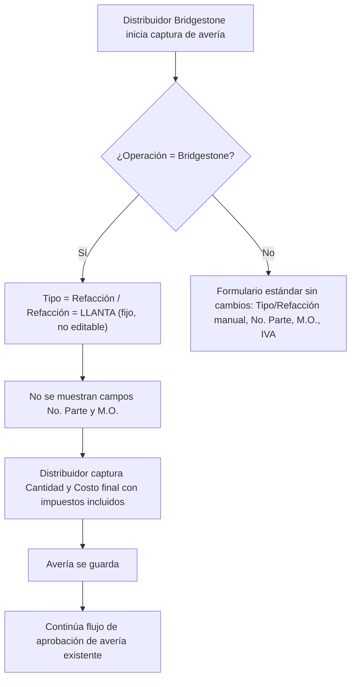

# PRD - Restructura de datos para averías en Bridgestone

| **Campo** | **Detalle** |
| --- | --- |
| **Proyecto** | Restructura de datos para averías en Bridgestone |
| **Área / empresa** | Garantiplus México |
| **Versión** | v0.1 |
| **Fecha** | 2026-07-31 |
| **Autores** | David Simancas (Gerente de Averías, solicitante) — PRD elaborado por PM·AI (Daniela Carbajal Vega) |
| **Revisión / liderazgo** | Alexis (revisión técnica) |
| **Tipo de proyecto** | Integración / Migración (ajuste acotado de datos, sin migración de históricos) |

## 1. Resumen ejecutivo

Este proyecto ajusta la captura de averías para la operación **Bridgestone** dentro de SIGA, que hoy vive en un proyecto/sub-carpeta separado de las demás operaciones. Bridgestone es un cliente y producto distintos a la operación normal: su distribuidor únicamente maneja **llantas** como refacción, por lo que el formulario actual de "Refacciones y mano de obra" — pensado para cualquier tipo de refacción/mano de obra y con IVA desglosado — le exige capturar y ver campos que no aplican a su operación (Tipo/Refacción manuales, No. Parte, M.O., IVA).

El MVP simplifica esa captura exclusivamente para Bridgestone: fija los campos `Tipo`/`Refacción` en `Refacción`/`LLANTA` (sin edición manual), elimina "No. Parte" y "M.O.", y elimina el campo "IVA" (el distribuidor captura el costo final con impuestos incluidos). No se toca el formulario de ninguna otra marca/distribuidor ni se migran o recalculan averías históricas de Bridgestone ya capturadas.

Resultado esperado: menos fricción y menos datos irrelevantes o mal capturados para el distribuidor Bridgestone, sin impacto en el resto de la operación de averías.

**Distribuidor entra a capturar avería (proyecto Bridgestone)** → **Sistema fija Tipo=Refacción / Refacción=LLANTA** → **Distribuidor captura cantidad y costo final (impuestos incluidos)** → **Avería se guarda y sigue el flujo de aprobación existente**

## 2. Contexto y problema

- Hoy, el distribuidor Bridgestone captura manualmente, por cada línea de "Refacciones y mano de obra": el `Tipo` de concepto, la `Refacción` (vía dropdown, ej. LLANTA), el "No. Parte", el "M.O." (mano de obra) y el "IVA".
- Bridgestone opera en un **proyecto/sub-carpeta separado** del resto de las operaciones en SIGA — no hay mezcla de registros entre operaciones.
- El dolor concreto: Bridgestone únicamente vende llantas, por lo que capturar/ver Tipo y Refacción como selección libre, además de No. Parte y M.O. (que no aplican a su operación), es captura manual innecesaria y fuente de error.
- Adicionalmente, el campo IVA no es viable de mantener genérico porque el ambiente se usará en distintos países con distintos porcentajes de impuestos; es más simple que el distribuidor capture directamente el costo final con impuestos incluidos.
- Por qué ahora: Bridgestone es un cliente y producto distintos a la operación normal, y así lo solicitó explícitamente David Simancas (Gerente de Averías) vía correo.

## 3. Objetivo del producto

Simplificar y ajustar la captura de refacciones y costos de averías para la operación Bridgestone en SIGA, eliminando campos y decisiones de captura que no aplican a su operación (Tipo/Refacción manual, No. Parte, M.O., IVA), de forma que el distribuidor Bridgestone solo capture lo que su operación real requiere: cantidad y costo final con impuestos incluidos.

Este PRD contempla una única fase (no hay evolución posterior planeada por ahora).

## 4. Usuarios y actores

| **Usuario / Actor** | **Rol en el proceso** |
| --- | --- |
| Distribuidor Bridgestone | Captura las averías (refacciones/llantas y costo) en el formulario ajustado. |
| David Simancas (Gerente de Averías) | Solicitante y patrocinador del proyecto; valida que el ajuste responda a la operación real de Bridgestone. |
| Técnicos de averías (equipo de David Simancas) | Dan seguimiento/soporte operativo a las averías capturadas por el distribuidor. |
| Alexis (TI) | Revisión y diseño técnico de la implementación (incluyendo decisiones de esquema de datos). |

## 5. Alcance MVP y funcionalidades

| **Funcionalidad** | **Descripción** |
| --- | --- |
| Autocompletado fijo de Tipo/Refacción | En el formulario de averías de la operación Bridgestone, al agregar una línea en "Refacciones y mano de obra", los campos `Tipo` y `Refacción` se presentan fijos como `Refacción` y `LLANTA`, sin permitir captura o edición manual a otro valor. |
| Eliminación de "No. Parte" y "M.O." | Estos campos dejan de mostrarse y capturarse en la vista de averías de Bridgestone. |
| Eliminación de "IVA" | El campo IVA se retira de la vista de averías de Bridgestone; el distribuidor captura el costo final con impuestos incluidos en el campo de costo/precio existente. |

Principio rector del MVP: **el distribuidor Bridgestone no debe poder capturar un Tipo/Refacción distinto a Refacción/LLANTA** — el ajuste asume que su operación maneja únicamente llantas, y no introduce configuración ni excepciones para otros conceptos.

## 6. Fuera de alcance

- **Formulario de averías de otras marcas/distribuidores**: no se modifica; conserva Tipo/Refacción manual, No. Parte, M.O. e IVA. Justificación: el ajuste responde a una necesidad específica de la operación Bridgestone (solo maneja llantas), no aplica al resto de operaciones.
- **Migración o recálculo de averías históricas de Bridgestone**: las averías ya capturadas con los campos anteriores (No. Parte, M.O., IVA) no se migran ni recalculan. Justificación: el cambio es hacia adelante, sobre nueva captura; alterar históricos no aporta valor y añade riesgo innecesario.

## 7. Flujos principales

Este flujo aplica únicamente dentro del proyecto/sub-carpeta de la operación Bridgestone, que ya está aislado de las demás operaciones en SIGA; por eso la condición de la operación determina el comportamiento del formulario sin riesgo de afectar a otros distribuidores.

## 8. Requerimientos funcionales

| **ID** | **Requerimiento** | **Descripción** |
| --- | --- | --- |
| RF-01 | Autocompletado fijo de Tipo/Refacción | Al agregar una línea de "Refacciones y mano de obra" en el formulario de averías de la operación Bridgestone, el sistema presenta `Tipo = Refacción` y `Refacción = LLANTA`, sin permitir su edición a otro valor. |
| RF-02 | Eliminación de No. Parte y M.O. | El sistema oculta/elimina los campos "No. Parte" y "M.O." de esa vista para la operación Bridgestone. |
| RF-03 | Eliminación de IVA | El sistema elimina el campo "IVA" de esa vista para la operación Bridgestone; el distribuidor captura el costo final con impuestos incluidos en el campo de costo/precio existente. |
| RF-04 | Aislamiento por operación | Los cambios anteriores aplican únicamente a los registros/formularios del proyecto/sub-carpeta de la operación Bridgestone, sin afectar el formulario de otras marcas/distribuidores. |
| RF-05 | Preservación de históricos | Las averías de Bridgestone capturadas antes de este cambio conservan sus valores (No. Parte, M.O., IVA) sin modificación ni recálculo. |

## 9. Requerimientos no funcionales

| **ID** | **Requerimiento** | **Descripción** |
| --- | --- | --- |
| RNF-01 | Trazabilidad | Hereda el esquema de trazabilidad/auditoría ya existente en el módulo de averías de SIGA; no se requieren mecanismos nuevos de bitácora. |
| RNF-02 | Permisos | Hereda el esquema de permisos ya existente en el módulo de averías de SIGA (captura por distribuidor, seguimiento por técnicos/gerencia); no se requieren roles ni permisos nuevos. |
| RNF-03 | Aislamiento de regresión | El cambio debe quedar acotado al proyecto/sub-carpeta de la operación Bridgestone; cualquier implementación que module el comportamiento general del formulario de averías para todas las operaciones se considera una desviación del alcance. |

## 10. Integraciones y datos

| **Integración / Fuente** | **Uso esperado** |
| --- | --- |
| Módulo de averías de SIGA (proyecto/sub-carpeta Bridgestone) | Ajuste de UI/captura sobre el formulario existente; no se agregan integraciones externas nuevas. |

Datos mínimos requeridos para operar el MVP: `Tipo` (fijo: Refacción), `Refacción` (fijo: LLANTA), `Cantidad`, `Costo final` (con impuestos incluidos). Se eliminan de la captura: `No. Parte`, `M.O.`, `IVA`.

Esquema de permisos: el distribuidor Bridgestone únicamente captura `Cantidad` y `Costo final`; `Tipo` y `Refacción` quedan fijos y no editables por el distribuidor. La decisión técnica de cómo se implementa esta restricción (validación en UI, restricción a nivel de esquema/base de datos, etc.) queda a cargo de TI (Alexis) en el diseño técnico.

## 11. Métricas de éxito

| **Métrica** | **Descripción** |
| --- | --- |
| Averías Bridgestone con Tipo/Refacción distinto a Refacción/LLANTA | Debe ser 0 tras el despliegue (ya no es posible por diseño). |
| Incidencias/quejas del distribuidor Bridgestone sobre captura de No. Parte, M.O. o IVA | Debe ser 0 tras el despliegue. |

## 12. Riesgos y supuestos

### Riesgos

| **Riesgo** | **Impacto potencial** |
| --- | --- |
| El cambio se implementa a nivel de módulo general de averías en vez de acotarse al proyecto/sub-carpeta Bridgestone | Afectaría sin querer el formulario de otras marcas/distribuidores que sí requieren Tipo/Refacción manual, No. Parte, M.O. e IVA. |
| Bridgestone requiere en el futuro capturar un concepto distinto a llanta (ej. mano de obra o refacción adicional) | El campo fijo Refacción=LLANTA no lo contemplaría; requeriría revisar este ajuste. |

### Supuestos

| **Supuesto** | **Descripción** |
| --- | --- |
| Bridgestone maneja únicamente llantas como refacción | Se asume que la operación Bridgestone no capturará mano de obra ni otro tipo de refacción distinto a llanta durante la vigencia de este PRD. |

## 13. Preguntas abiertas

| **Tema** | **Pregunta abierta** |
| --- | --- |
| Diseño técnico de la restricción de campos | ¿La restricción de Tipo/Refacción fijos y la eliminación de No. Parte/M.O./IVA se implementa a nivel de UI, de esquema de base de datos, o ambos? Queda a definir por Alexis en el diseño técnico. |
