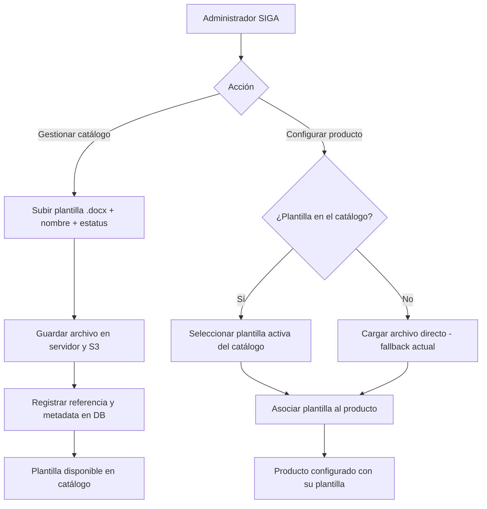

# PRD - Catálogo de plantillas de productos

| **Campo** | **Detalle** |
| --- | --- |
| **Proyecto** | Catálogo de plantillas de productos (OP-16) |
| **Área / empresa** | Garantiplus Colombia |
| **Versión** | v0.1 |
| **Fecha** | 2026-08-13 |
| **Autores** | Alejandro Govea Hernández |
| **Revisión / liderazgo** | Alexis Salvador Herrera García (alexis.herrera@gplusseguros.mx) |
| **Tipo de proyecto** | Feature web/API |

## 1. Resumen ejecutivo

El proyecto crea un **catálogo central de plantillas de contrato** dentro de SIGA, dirigido al **Administrador SIGA** que configura productos para Garantiplus Colombia. Hoy cada producto requiere su propia plantilla de contrato (archivo `.docx`) y ésta se carga individualmente al configurar el producto; no existe un repositorio común, por lo que en ocasiones no se tiene el archivo a la mano y la gestión documental se dificulta.

El MVP habilita un módulo donde el administrador **sube plantillas al catálogo** y, al **configurar un producto**, puede **seleccionar** una plantilla del listado en lugar de volver a cargar el archivo; si la plantilla no está en el catálogo, se mantiene la vía **actual de carga directa** como alternativa. Una misma plantilla del catálogo puede asociarse a **múltiples productos** (reutilización), y el catálogo es **compartido entre hubs** (multi-país).

Quedan fuera del MVP el versionado/historial, la edición del documento en línea, las variables dinámicas de auto-relleno y la migración masiva automática de las plantillas ya cargadas.

Resultado esperado: menos incidencias por "no se encuentra el archivo de la plantilla" y menor tiempo para dejar un producto configurado con su plantilla.

**Subir plantilla al catálogo** → **Configurar producto** → **Seleccionar plantilla del catálogo (o cargar directa)** → **Producto configurado**

## 2. Contexto y problema

- **Hoy:** al configurar un producto en SIGA se carga manualmente el archivo `.docx` de la plantilla de contrato. No hay catálogo: cada producto guarda su propia copia y no hay un lugar común donde encontrar las plantillas.
- **Dolor concreto:** en ocasiones no se tiene a la mano el archivo de la plantilla, lo que dificulta la gestión documental y obliga a re-buscar o re-solicitar el documento. También implica volver a cargar la misma plantilla en cada producto que la use.
- **Por qué ahora:** el driver principal es la **gestión documental** — dejar de perder/re-buscar los archivos y tener un repositorio único y reutilizable.
- **Distinción de dominio:** *plantilla de contrato* (documento base reutilizable, en el catálogo) vs. *producto* (entidad de SIGA que se configura y que **referencia/consume** una plantilla). Una plantilla puede servir a varios productos.

## 3. Objetivo del producto

Proveer al Administrador SIGA un **catálogo reutilizable de plantillas de contrato** que pueda subir, listar y dar de baja, y que pueda **seleccionar al configurar un producto** — conservando la carga directa como alternativa —, de modo que se centralice la gestión documental y se reduzca la fricción de re-cargar el mismo archivo en cada producto. Es un alcance **único (MVP)**, sin fases posteriores comprometidas.

## 4. Usuarios y actores

| **Usuario / Actor** | **Rol en el proceso** |
| --- | --- |
| Administrador SIGA | Gestiona el catálogo (sube, edita metadata, inactiva plantillas) y configura productos seleccionando la plantilla. Actor principal. |
| Operación / Postventa Colombia | Solicitante del desarrollo; consume los contratos generados y sufre hoy el dolor de gestión documental. |
| TI | Habilita infraestructura (S3, almacenamiento), permisos y despliegue. |

## 5. Alcance MVP y funcionalidades

| **Funcionalidad** | **Descripción** |
| --- | --- |
| Alta de plantilla en el catálogo | Subir un archivo `.docx` con **nombre** y **estatus activo/inactivo**. El archivo se guarda y queda disponible en el catálogo. |
| Listado/consulta del catálogo | Ver las plantillas existentes; se ofrecen para selección solo las **activas**. |
| Edición de metadata | Modificar nombre/estatus de una plantilla existente. |
| Baja lógica (inactivar) | Dar de baja una plantilla sin borrarla, para que deje de ofrecerse sin romper productos ya asociados. |
| Selección al configurar producto | Al configurar un producto, elegir una plantilla **activa** del catálogo y asociarla. |
| Carga directa (fallback) | Si la plantilla no está en el catálogo, mantener la vía actual de subir el archivo directamente en el producto. |
| Reutilización | Una misma plantilla del catálogo puede asociarse a **múltiples productos**. |
| Catálogo compartido (multi-país) | El catálogo es común/compartido entre hubs (México, Colombia, Chile). |

**Principio rector del MVP:** centralizar y reutilizar sin perder la vía actual — el administrador siempre puede seguir cargando un archivo directo. El MVP **no** modifica el contenido de los documentos ni automatiza el llenado del contrato.

## 6. Fuera de alcance

- **Versionado / historial de plantillas:** no se guarda historial de versiones; se habilitaría en una fase posterior si se requiere trazabilidad documental.
- **Edición del `.docx` en línea:** no se edita el contenido del documento dentro de SIGA; se sube el archivo ya terminado.
- **Variables dinámicas / auto-relleno:** no hay tokens que se rellenen automáticamente al generar el contrato.
- **Migración masiva automática:** no se migran automáticamente las plantillas ya cargadas por producto; el catálogo arranca vacío y se puebla al usarse.

## 7. Flujos principales

Flujo del alta en el catálogo y de la selección al configurar un producto, incluyendo la decisión clave (usar catálogo vs. carga directa) y los puntos de almacenamiento.

El flujo prioriza no romper la operación actual: la rama de **carga directa** se conserva intacta y la novedad es la rama de **selección desde el catálogo**. El almacenamiento ocurre en el alta (servidor + S3, con la referencia/metadata en base de datos), de modo que al configurar un producto solo se referencia una plantilla ya existente.

## 8. Requerimientos funcionales

| **ID** | **Requerimiento** | **Descripción** |
| --- | --- | --- |
| RF-01 | Alta de plantilla | Permitir subir una plantilla `.docx` con nombre y estatus (activo/inactivo). |
| RF-02 | Consulta del catálogo | Listar plantillas; permitir filtrar por estatus. |
| RF-03 | Edición de metadata | Editar nombre/estatus de una plantilla existente. |
| RF-04 | Baja lógica | Inactivar una plantilla sin eliminarla físicamente. |
| RF-05 | Selección en producto | Al configurar un producto, seleccionar una plantilla **activa** del catálogo y asociarla. |
| RF-06 | Fallback de carga directa | Conservar la carga directa de archivo en el producto cuando no se use el catálogo. |
| RF-07 | Reutilización | Permitir asociar una misma plantilla a múltiples productos. |
| RF-08 | Almacenamiento | Guardar el archivo en servidor y S3, y su referencia/metadata en la base de datos. |
| RF-09 | Catálogo compartido | Hacer el catálogo accesible entre hubs (multi-país). |
| RF-10 | Solo activas seleccionables | Ofrecer para selección únicamente plantillas con estatus activo. |

## 9. Requerimientos no funcionales

| **ID** | **Requerimiento** | **Descripción** |
| --- | --- | --- |
| RNF-01 | Permisos | La administración del catálogo (alta/edición/baja) se restringe al rol Administrador SIGA. |
| RNF-02 | Trazabilidad | Registrar quién sube/edita/inactiva una plantilla y cuándo. |
| RNF-03 | Validación de archivo | Validar formato `.docx` y un tamaño máximo de archivo al subir. |
| RNF-04 | Consistencia de almacenamiento | Mantener coherencia entre la copia en servidor y en S3 y la referencia en DB. |
| RNF-05 | Disponibilidad | Operación en horario laboral de la operación (a confirmar si requiere 24/7). |
| RNF-06 | Usabilidad | Distinguir claramente en la UI la opción "seleccionar del catálogo" vs. "cargar archivo". |
| RNF-07 | Mantenibilidad multi-hub | El diseño debe soportar un catálogo compartido entre hubs sin duplicar lógica por país. |

## 10. Integraciones y datos

| **Integración / Fuente** | **Uso esperado** |
| --- | --- |
| SIGA — módulo de productos | Lectura/escritura de la asociación producto ↔ plantilla al configurar un producto. |
| PostgreSQL (RDS) | Persistencia de metadata de plantillas y de la relación producto–plantilla. |
| Amazon S3 | Almacenamiento del archivo `.docx`. |
| Servidor de aplicación (filesystem) | Almacenamiento del archivo `.docx` (copia en servidor, según lo indicado). |

**Datos mínimos:** `plantilla { id, nombre, estatus, ubicacion_servidor, s3_key, fecha_alta, usuario_alta }`; relación `producto_plantilla { producto_id, plantilla_id }`.

**Esquema de permisos:** el Administrador SIGA puede **leer** el catálogo, **crear/editar/inactivar** plantillas y **asociarlas** a productos. Otros roles no gestionan el catálogo. El **borrado físico** de plantillas queda bloqueado (solo baja lógica) para no romper productos asociados.

## 12. Métricas de éxito

| **Métrica** | **Descripción** |
| --- | --- |
| Menos incidencias documentales | Reducción de casos de "no se encuentra el archivo de la plantilla". Línea base y meta pendientes de validar con operación/BI. |
| Tiempo de configuración | Reducción del tiempo para dejar un producto configurado con su plantilla. Línea base y meta pendientes de validar con operación. |

## 13. Riesgos y supuestos

### Riesgos

| **Riesgo** | **Impacto potencial** |
| --- | --- |
| Catálogo multi-país sin reglas de visibilidad | Plantillas de un hub usadas por error en otro; contratos incorrectos. |
| Doble almacenamiento (servidor + S3) | Inconsistencia si una de las dos copias falla; ambigüedad sobre la fuente de verdad. |
| Comportamiento de actualización sin definir | Expectativa equivocada sobre si al actualizar una plantilla se propaga o no a productos ya asociados. |
| Inactivar plantilla en uso | Productos asociados podrían quedar sin plantilla válida si no se controla. |
| Baja adopción | Si la carga directa es más cómoda, el catálogo se subutiliza. |

### Supuestos

| **Supuesto** | **Descripción** |
| --- | --- |
| Formato `.docx` | Las plantillas de contrato están en Word (`.docx`). |
| Módulo de productos extensible | La configuración de producto en SIGA admite agregar el selector de plantilla. |
| Rol administrador existente | El Administrador SIGA actual puede asumir la gestión del catálogo. |
| Infra S3 disponible | El stack cuenta con S3 para el almacenamiento de archivos. |

## 14. Preguntas abiertas

| **Tema** | **Pregunta abierta** |
| --- | --- |
| Actualización de plantilla | ¿Referencia viva (se propaga a productos asociados) o copia congelada al asociar? **Sin definir.** |
| Visibilidad multi-país | ¿El catálogo compartido filtra/segmenta plantillas por hub o todas son visibles para todos? |
| Almacenamiento servidor + S3 | ¿Cuál es la fuente de verdad y cómo se sincronizan/concilian ambas copias? |
| Baja de plantilla en uso | ¿Qué ocurre con los productos asociados cuando una plantilla se inactiva? |
| Formatos admitidos | ¿Solo `.docx` o también otros formatos (p. ej. PDF)? |
| Metadata opcional | ¿Se incluye un campo descripción u otros (categoría, tipo de producto)? |
| Carga inicial | El catálogo arranca vacío; ¿hay un momento/plan para migrar manualmente las plantillas más usadas? |
| Métricas | Definir línea base y meta numérica con operación/BI. |
| Permisos | ¿La administración del catálogo requiere un permiso específico distinto al de configurar productos? |
