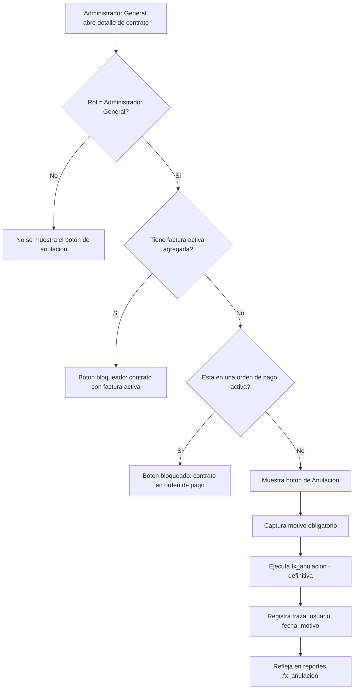
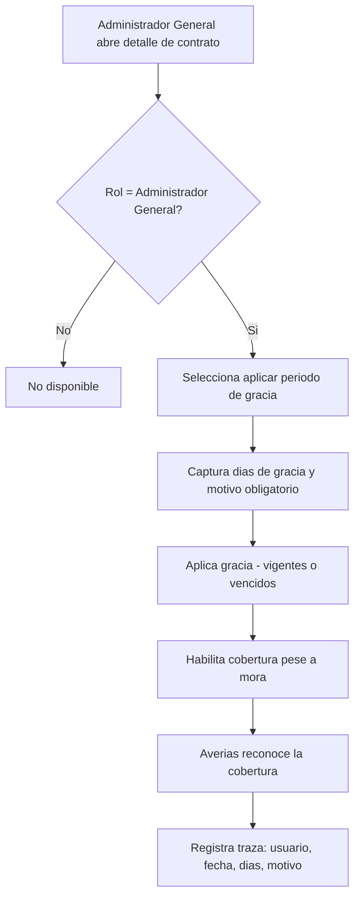

# PRD - Periodos de Gracia y Anulación de Contratos (Colombia)

| **Campo** | **Detalle** |
| --- | --- |
| **Proyecto** | Periodos de Gracia y Anulación de Contratos (Colombia) |
| **Área / empresa** | Garantiplus Colombia |
| **Versión** | v0.1 |
| **Fecha** | 2026-07-23 |
| **Autores** | Operaciones (Colombia); Alejandro Govea (PM·AI) |
| **Revisión / liderazgo** | Alexis Salvador Herrera Garcia (alexis.herrera@gplusseguros.mx) |
| **Tipo de proyecto** | Feature web/API |

## 1. Resumen ejecutivo

El área de **Operaciones de Garantiplus Colombia** no puede gestionar por sí misma dos acciones sobre contratos: aplicar **periodos de gracia** y **anular/cancelar contratos**. Hoy depende de otras áreas para ejecutarlas, lo que genera fricción, demoras y una dependencia innecesaria.

Este proyecto habilita ambas capacidades directamente en la vista de Contratos, restringidas al rol **Administrador General**. La **anulación** replica el patrón que ya existe para México (botón de Cancelación en el detalle del contrato, apoyado en `fx_anulacion`), mostrándose solo cuando el contrato no tiene factura activa agregada ni está en una orden de pago activa. El **periodo de gracia** es una capacidad **nueva** en Operaciones/Contratos (hoy solo existe en averías, vía `averia_periodo_gracia`) que habilita cobertura pese a mora.

El **MVP** entrega ambas acciones en modo **autoservicio total** para el Administrador General, con motivo obligatorio y traza (usuario, fecha, motivo), reflejando la anulación en reportes (`fx_anulacion`) y la gracia en Averías. **Queda fuera del MVP** la propagación a Facturación, que se aborda en una fase posterior.

Resultado esperado: **autonomía operativa** del área y menor dependencia de terceros, controlando el riesgo en contratos vencidos mediante trazabilidad y restricción de rol.

**Operaciones abre detalle de contrato** → **valida rol y condiciones** → **aplica gracia o anula (con motivo)** → **propaga a Reportes/Averías y registra traza**

## 2. Contexto y problema

- **Hoy:** las anulaciones de contratos y los periodos de gracia en Colombia se gestionan a través de otras áreas; Operaciones no tiene el control directo. El botón de Cancelación ya existe en el producto **para México**, pero no está disponible para Colombia. El periodo de gracia existe como concepto en **averías** (`averia_periodo_gracia`), pero **no** en Operaciones/Contratos.
- **Dolor concreto:** dependencia de otras áreas para operaciones cotidianas, demoras, fricción y falta de autonomía del área operativa.
- **Por qué ahora:** dar autonomía a Operaciones es una mejora de **importancia alta** con impacto directo en la administración operativa.
- **Distinción de dominio clave:** "periodo de gracia" en **averías** (existente, `averia_periodo_gracia`) vs. "periodo de gracia" en **Operaciones/Contratos** (nuevo, objeto de este PRD). El nuevo debe habilitar cobertura pese a mora de forma reconocible por Averías.

## 3. Objetivo del producto

Dar al rol **Administrador General** de Garantiplus Colombia la capacidad de **aplicar periodos de gracia** y **anular contratos** de forma autónoma desde la vista de Contratos, con controles de visibilidad, motivo obligatorio y trazabilidad, reduciendo la dependencia de otras áreas sin perder control sobre el riesgo de contratos vencidos.

### 3.1 Estrategia de implementación por fases

| **Fase** | **Nombre** | **Descripción** |
| --- | --- | --- |
| Fase 1 (MVP) | Gracia y anulación en Operaciones | Botón de anulación (patrón México) + nueva acción de periodo de gracia, ambas para Administrador General, con traza y propagación a Reportes y Averías. |
| Fase 2 | Integración con Facturación | Reflejar gracia/anulación en facturación (evitar cobros sobre contratos anulados, ajustar cobros durante la gracia). |

El **MVP de este PRD es la Fase 1**.

## 4. Usuarios y actores

| **Usuario / Actor** | **Rol en el proceso** |
| --- | --- |
| Administrador General (Operaciones, Colombia) | Único rol autorizado para aplicar gracia y anular contratos. |
| Operaciones (Colombia) | Área beneficiaria; solicitante del cambio. |
| Averías | Consume el periodo de gracia para reconocer cobertura pese a mora. |
| BI / Reportes | Consume `fx_anulacion` y eventos para reportería. |
| Dirección de TI | Revisión técnica y de diseño. |
| Facturación | Impactado en fase posterior (fuera del MVP). |

## 5. Alcance MVP y funcionalidades

| **Funcionalidad** | **Descripción** |
| --- | --- |
| Botón de Anulación en detalle de contrato | Se muestra en la vista de detalle del contrato (patrón existente en México) **solo** para el rol Administrador General. |
| Regla de visibilidad de anulación | El botón se habilita solo si el contrato **no** tiene factura activa agregada **y no** está en una orden de pago activa; en caso contrario no se permite la acción. |
| Anulación definitiva con motivo | Al anular, se captura **motivo obligatorio**; la anulación es **definitiva** (no reversible) y reutiliza `fx_anulacion`. |
| Nueva acción de Periodo de Gracia | Capacidad nueva en Operaciones/Contratos para aplicar un periodo de gracia, solo para Administrador General. |
| Captura de días de gracia | Se capturan los **días** (configurable, **sin tope**) y **motivo obligatorio**; aplicable a contratos **vigentes y vencidos**. |
| Cobertura por gracia reconocible en Averías | El periodo de gracia habilita cobertura pese a mora, de forma que Averías lo reconozca (equivalente a `averia_periodo_gracia`). |
| Traza de acciones | Cada gracia y cada anulación registra usuario, fecha/hora y motivo. |
| Reflejo en reportes | La anulación se refleja en los reportes que ya usan `fx_anulacion`. |

**Principio rector del MVP:** ambas acciones son **exclusivas del rol Administrador General**, validadas en el backend (no solo ocultas en UI), y **siempre** con motivo y traza. El MVP **no** toca Facturación.

## 6. Fuera de alcance

- **Integración con Facturación:** se difiere a Fase 2; el MVP no ajusta ni bloquea cobros a partir de la gracia/anulación (riesgo aceptado y registrado).
- **Reversa de anulación:** la anulación es definitiva; no se construye flujo de reversa en el MVP (requeriría proceso/decisión aparte).
- **Autorización/aprobación de segundo nivel:** se decidió autoservicio total; no se implementa flujo de aprobación adicional.
- **Extender estas acciones a otros roles o a México/Chile:** el alcance es rol Administrador General de Colombia.

## 7. Flujos principales

**Flujo A — Anulación de contrato**

La visibilidad del botón concentra el control del riesgo: un contrato con factura activa o dentro de una orden de pago activa no puede anularse, evitando inconsistencias con cobros ya en curso. La anulación es definitiva y siempre deja traza.

**Flujo B — Periodo de gracia**

El periodo de gracia es una capacidad nueva en Operaciones que se apoya en el concepto ya existente en Averías. Al no tener tope y aplicar también a contratos vencidos, el control descansa en la restricción de rol y en la trazabilidad.

## 8. Requerimientos funcionales

| **ID** | **Requerimiento** | **Descripción** |
| --- | --- | --- |
| RF-01 | Mostrar botón de anulación por rol | El botón de Cancelación/Anulación en el detalle de contrato se muestra solo al rol Administrador General. |
| RF-02 | Regla de visibilidad | El botón se habilita solo si el contrato no tiene factura activa agregada y no está en una orden de pago activa. |
| RF-03 | Anulación definitiva con motivo | Al anular se exige motivo; la anulación es definitiva y reutiliza `fx_anulacion`. |
| RF-04 | Traza de anulación | Registrar usuario, fecha/hora y motivo de cada anulación. |
| RF-05 | Reflejo en reportes | La anulación se refleja en los reportes que consumen `fx_anulacion`. |
| RF-06 | Acción de periodo de gracia | Permitir aplicar periodo de gracia a un contrato desde Operaciones, solo para Administrador General. |
| RF-07 | Captura de gracia | Capturar días (configurable, sin tope) y motivo obligatorio. |
| RF-08 | Ámbito de gracia | Permitir gracia sobre contratos vigentes y vencidos. |
| RF-09 | Cobertura reconocible por Averías | La gracia habilita cobertura pese a mora, reconocible por Averías (equivalente a `averia_periodo_gracia`). |
| RF-10 | Traza de gracia | Registrar usuario, fecha/hora, días y motivo de cada periodo de gracia. |
| RF-11 | Validación de rol en backend | Restringir ambas acciones en el servidor, no solo ocultarlas en UI. |

## 9. Requerimientos no funcionales

| **ID** | **Requerimiento** | **Descripción** |
| --- | --- | --- |
| RNF-01 | Control de permisos | Validación del rol Administrador General en backend para ambas acciones. |
| RNF-02 | Trazabilidad / auditabilidad | Registro de usuario, fecha/hora y motivo por cada acción; consultable para auditoría. |
| RNF-03 | Consistencia de datos | Estado consistente entre Contratos, Reportes (`fx_anulacion`) y Averías tras cada acción. |
| RNF-04 | Manejo de errores | Comportamiento definido si falla la propagación a Reportes/Averías (transacción o reintento), sin dejar estados a medias. |
| RNF-05 | Experiencia de usuario | Consistencia visual/funcional con el patrón ya existente en México. |
| RNF-06 | Mantenibilidad | Reutilizar `fx_anulacion` y el concepto `averia_periodo_gracia` en lugar de duplicar lógica. |

## 10. Integraciones y datos

| **Integración / Fuente** | **Uso esperado** |
| --- | --- |
| SIGA / Contratos | Lectura de estado, factura activa y orden de pago; escritura de estado anulado y del periodo de gracia. |
| `fx_anulacion` (reportes) | Escritura/registro de la anulación para reflejarla en reportería. |
| Averías (`averia_periodo_gracia`) | Reconocimiento de la cobertura habilitada por el periodo de gracia. |
| Facturación | **Fuera del MVP** (Fase 2). |

**Datos mínimos:** `contrato_id`, estado del contrato, fecha de vencimiento, indicador de factura activa agregada, indicador de orden de pago activa, rol del usuario; para gracia: días, fecha inicio/fin, motivo, usuario, fecha; para anulación: motivo, usuario, fecha.

**Permisos:** solo el Administrador General puede **escribir** (anular / aplicar gracia); el resto de roles **no** ve ni ejecuta estas acciones. La anulación queda **bloqueada** si hay factura activa u orden de pago activa. La integración con Facturación queda bloqueada/pendiente hasta Fase 2.

## 11. Eventos para BI

- `contrato_anulado`: se registra al anular un contrato. Campos: fecha/hora, usuario, `contrato_id`, motivo, resultado.
- `contrato_periodo_gracia_aplicado`: se registra al aplicar un periodo de gracia. Campos: fecha/hora, usuario, `contrato_id`, días, motivo, si el contrato estaba vigente o vencido.
- `anulacion_bloqueada`: se registra cuando se intenta anular pero la regla lo impide. Campos: fecha/hora, usuario, `contrato_id`, causa (factura activa / orden de pago activa).

## 12. Métricas de éxito

| **Métrica** | **Descripción** |
| --- | --- |
| Anulaciones gestionadas por Operaciones | Nº de anulaciones ejecutadas por Administrador General sin intervención de otras áreas. |
| Periodos de gracia aplicados | Nº de periodos de gracia aplicados desde Operaciones. |
| Reducción de dependencia | Reducción de solicitudes/tickets a otras áreas para gracia/anulación (línea base pendiente de validar con operación/BI). |
| Tiempo de gestión | Tiempo desde la necesidad hasta la ejecución (pendiente de validar línea base). |

## 13. Riesgos y supuestos

### Riesgos

| **Riesgo** | **Impacto potencial** |
| --- | --- |
| Gracia sin tope sobre contratos vencidos | Habilitar cobertura pese a mora de forma amplia puede disparar averías retroactivas y pérdidas; es el riesgo central señalado. |
| Anulación definitiva no reversible | Un error humano no tiene reversa dentro del MVP; requeriría intervención de TI. |
| Autoservicio total sin aprobación | Uso indebido o errores sin control previo; mitigado (parcialmente) por restricción de rol y traza. |
| Cambios sobre `fx_anulacion` | Al reutilizarse en reportes, un cambio de comportamiento podría afectar reportería existente. |
| Facturación fuera de alcance | Posible inconsistencia (cobros sobre contrato anulado o durante gracia) hasta que se implemente la Fase 2. |

### Supuestos

| **Supuesto** | **Descripción** |
| --- | --- |
| Rol disponible | Existe el rol "Administrador General" en Colombia con el nivel de permiso requerido. |
| Reutilización de México | El botón y `fx_anulacion` de México son reutilizables para Colombia. |
| Mecanismo de gracia en Averías | `averia_periodo_gracia` es el mecanismo mediante el cual Averías reconoce la cobertura. |
| Datos disponibles | Contratos expone de forma confiable "factura activa agregada" y "orden de pago activa". |

## 14. Preguntas abiertas

| **Tema** | **Pregunta abierta** |
| --- | --- |
| Facturación | ¿Cómo se evitarán cobros sobre contratos anulados y cómo se reflejará la gracia en facturación en Fase 2? |
| Control de riesgo (gracia) | Pese a la decisión de "sin tope", ¿debería existir un tope máximo de días o alertas para contratos vencidos? |
| Reversa | ¿La anulación es realmente sin reversa, o debe existir un proceso de reversa vía TI? |
| Efecto de la gracia | ¿Por cuánto tiempo y bajo qué condiciones exactas la gracia reactiva cobertura en contratos vencidos? |
| Gobernanza | ¿Se requiere revisión/auditoría periódica de las acciones dado el autoservicio total? |
| Operación | ¿Disponibilidad requerida (horario operativo vs. 24/7) y revisor técnico responsable? |
