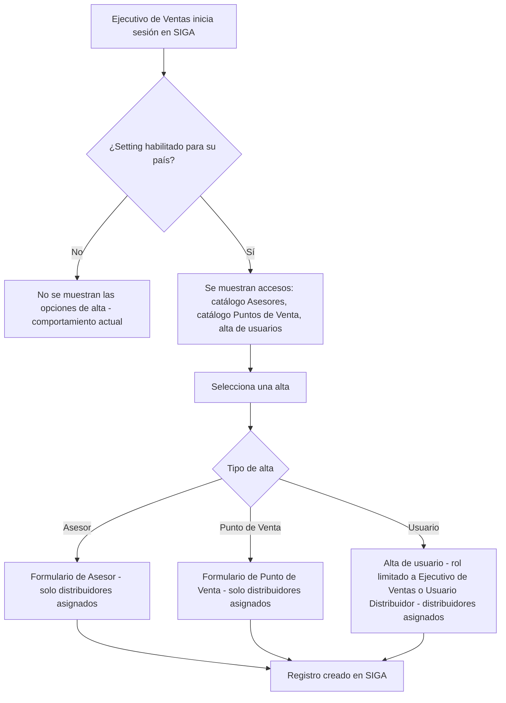

# PRD - Habilitar al Ejecutivo de Ventas la creación de Asesores, Puntos de Venta y usuarios

| **Campo** | **Detalle** |
| --- | --- |
| **Proyecto** | Habilitar al Ejecutivo de Ventas la creación de Asesores, Puntos de Venta y usuarios |
| **Área / empresa** | Garantiplus México |
| **Versión** | v0.1 |
| **Fecha** | 2026-08-13 |
| **Autores** | Alejandro Govea Hernández |
| **Revisión / liderazgo** | Alexis Salvador Herrera García (alexis.herrera@gplusseguros.mx) |
| **Tipo de proyecto** | Feature web o API |

## 1. Resumen ejecutivo

Este proyecto habilita al rol **Ejecutivo de Ventas** de SIGA a **crear Asesores, Puntos de Venta y usuarios** (estos últimos solo con los roles **Ejecutivo de Ventas** y **Usuario Distribuidor**), una operación que hoy está reservada a los **Administradores generales**.

El problema actual es de dependencia operativa: el Ejecutivo de Ventas atiende clientes y distribuidores nuevos, y realiza capacitaciones, con frecuencia en fines de semana, cuando los Administradores generales no están disponibles para procesar altas. Esto frena el arranque de nuevos distribuidores y usuarios.

El MVP entrega, en una sola fase, las tres altas (Asesores, Puntos de Venta y usuarios) **reutilizando las pantallas y catálogos existentes**, abriendo el acceso al nuevo rol y respetando el alcance actual: el Ejecutivo solo puede operar sobre los **distribuidores que ya tiene asignados**. La funcionalidad queda **preparada para todos los países** pero su habilitación se controla mediante un **parámetro en settings configurable por país**.

El resultado esperado es autonomía operativa del Ejecutivo de Ventas, menos altas escaladas a Administradores generales y continuidad de la operación fuera de horario.

**Ejecutivo con setting activo** → **accede a catálogos/alta de usuarios** → **crea Asesor / Punto de Venta / usuario (roles permitidos, distribuidores asignados)** → **registro creado en SIGA**

## 2. Contexto y problema

- **Hoy:** únicamente los **Administradores generales** pueden dar de alta Asesores, Puntos de Venta y usuarios en SIGA. El Ejecutivo de Ventas no tiene ese permiso y debe solicitar cada alta.
- **Dolor concreto:** los Ejecutivos de Ventas trabajan fines de semana y en capacitaciones con distribuidores/clientes nuevos y necesitan crear usuarios y altas en el momento; al depender de los Administradores, la operación se frena cuando estos no están disponibles.
- **Por qué ahora:** lo impulsa Operaciones (Chile) para desbloquear la operación de campo y las capacitaciones en tiempo real.
- **Distinción de conceptos (clave para dev):**
  - **Asesores** — es un **catálogo** con acceso en el menú lateral izquierdo.
  - **Puntos de Venta** — es un **catálogo** con acceso en el menú lateral izquierdo.
  - **Usuario Distribuidor** — es un **rol de usuario** (no un catálogo).
  - **Ejecutivo de Ventas** — es un **rol de usuario** (el actor que recibe el nuevo permiso).

## 3. Objetivo del producto

Permitir que el rol Ejecutivo de Ventas cree Asesores, Puntos de Venta y usuarios (solo roles Ejecutivo de Ventas y Usuario Distribuidor) directamente en SIGA, de forma autónoma y **configurable por país** mediante un parámetro de settings, para no depender de los Administradores generales y no frenar la operación en fines de semana y capacitaciones. Se reutilizan las pantallas existentes y se conserva el modelo actual de asociación a distribuidores, limitando al Ejecutivo a los distribuidores que ya tiene asignados.

## 4. Usuarios y actores

| **Usuario / Actor** | **Rol en el proceso** |
| --- | --- |
| Ejecutivo de Ventas | Actor principal: crea Asesores, Puntos de Venta y usuarios (roles Ejecutivo de Ventas y Usuario Distribuidor), limitado a sus distribuidores asignados |
| Administrador general | Conserva sin cambios su capacidad de crear Asesores, Puntos de Venta y usuarios (todos los roles) |
| Usuario Distribuidor | Rol de usuario que puede ser creado por el Ejecutivo de Ventas |
| Asesor | Entidad de catálogo que el Ejecutivo puede dar de alta |
| Punto de Venta | Entidad de catálogo que el Ejecutivo puede dar de alta |
| TI / Administrador de settings | Activa o desactiva la funcionalidad por país mediante el parámetro de settings |

## 5. Alcance MVP y funcionalidades

| **Funcionalidad** | **Descripción** |
| --- | --- |
| Alta de Asesores por Ejecutivo de Ventas | Se habilita el acceso al catálogo existente de Asesores para el rol Ejecutivo de Ventas, reutilizando la pantalla actual |
| Alta de Puntos de Venta por Ejecutivo de Ventas | Se habilita el acceso al catálogo existente de Puntos de Venta para el rol Ejecutivo de Ventas, reutilizando la pantalla actual |
| Alta de usuarios por Ejecutivo de Ventas | Se habilita el alta de usuarios reutilizando la pantalla existente, restringiendo la asignación de rol únicamente a Ejecutivo de Ventas y Usuario Distribuidor |
| Restricción de alcance a distribuidores asignados | El Ejecutivo solo puede seleccionar/operar sobre los distribuidores que ya tiene asignados; si un rol vincula distribuidores, solo puede elegir entre los suyos |
| Parámetro de settings por país | Nuevo parámetro que activa/desactiva toda la funcionalidad de forma independiente por país; queda preparado para todos los países |
| Visibilidad condicionada al setting | Cuando el parámetro está desactivado para un país, el Ejecutivo de Ventas no ve ni accede a estas altas (comportamiento actual) |

**Principio rector del MVP:** el Ejecutivo de Ventas **solo puede crear** (nunca editar ni eliminar), **solo** puede asignar los roles Ejecutivo de Ventas y Usuario Distribuidor, y **solo** dentro de sus distribuidores asignados. La funcionalidad no altera el comportamiento actual de los Administradores generales y está gobernada por el setting por país.

## 6. Fuera de alcance

- **Editar o eliminar** Asesores, Puntos de Venta y usuarios por parte del Ejecutivo de Ventas: solo se habilita el **alta**; la edición/eliminación permanece con el Administrador general.
- **Asignar otros roles** distintos a Ejecutivo de Ventas y Usuario Distribuidor: el sistema restringe la selección a esos dos.
- **Crear o gestionar distribuidores** por parte del Ejecutivo de Ventas: solo usa los distribuidores ya asignados.
- **Modificar el comportamiento actual de los Administradores generales**: mantienen sus capacidades sin cambios.
- **Carga masiva** de Asesores, Puntos de Venta o usuarios: solo alta individual mediante las pantallas existentes.
- **Trazabilidad/auditoría del alta** (registro de qué Ejecutivo creó cada entidad): excluida de esta versión; podría incorporarse después (ver Preguntas abiertas).

## 7. Flujos principales

Flujo del alta con doble control (setting por país + permiso de rol) y acotamiento a distribuidores asignados. Se muestra un solo flujo porque las tres altas comparten la misma lógica de acceso; lo único que cambia es la pantalla/entidad destino.

El "por qué" del flujo: el sistema aplica **dos filtros antes de permitir el alta** — primero el parámetro de settings del país (habilita o no la funcionalidad completa) y luego el permiso del rol y el alcance de distribuidores asignados. Esto garantiza que la apertura del permiso sea selectiva por país y que el Ejecutivo nunca opere fuera de los distribuidores que ya tiene.

## 8. Requerimientos funcionales

| **ID** | **Requerimiento** | **Descripción** |
| --- | --- | --- |
| RF-01 | Alta de Asesores por Ejecutivo de Ventas | El rol Ejecutivo de Ventas puede crear Asesores desde el catálogo existente de Asesores |
| RF-02 | Alta de Puntos de Venta por Ejecutivo de Ventas | El rol Ejecutivo de Ventas puede crear Puntos de Venta desde el catálogo existente |
| RF-03 | Alta de usuarios con roles restringidos | El Ejecutivo de Ventas puede crear usuarios, y el sistema restringe la asignación de rol únicamente a Ejecutivo de Ventas y Usuario Distribuidor |
| RF-04 | Acotamiento a distribuidores asignados | El sistema limita las selecciones/altas del Ejecutivo a los distribuidores que ya tiene asignados; no puede elegir distribuidores no asignados |
| RF-05 | Parámetro de settings por país | Existe un parámetro en settings que activa/desactiva toda la funcionalidad de forma independiente por país |
| RF-06 | Visibilidad condicionada al setting | Con el parámetro desactivado para un país, el Ejecutivo de Ventas no ve ni accede a estas altas (comportamiento actual) |
| RF-07 | Solo alta (sin editar ni eliminar) | El Ejecutivo de Ventas solo puede crear; no puede editar ni eliminar Asesores, Puntos de Venta ni usuarios |
| RF-08 | Sin cambios para Administradores generales | Los Administradores generales conservan intactas sus capacidades actuales de creación |
| RF-09 | Reutilización de pantallas existentes | Las altas usan las pantallas/catálogos y validaciones ya existentes; no se crean pantallas nuevas |

## 9. Requerimientos no funcionales

| **ID** | **Requerimiento** | **Descripción** |
| --- | --- | --- |
| RNF-01 | Control de permisos server-side | Las restricciones (roles permitidos y distribuidores asignados) se validan en el backend, no solo en la interfaz |
| RNF-02 | Configurabilidad multi-país | La funcionalidad queda preparada para todos los países y se habilita/deshabilita de forma independiente por país mediante el setting |
| RNF-03 | Consistencia de datos | Se reutilizan las validaciones y reglas de las pantallas actuales de catálogos y alta de usuarios para mantener integridad |
| RNF-04 | Mantenibilidad | No se duplican pantallas ni lógica; se reutilizan los componentes existentes de SIGA |
| RNF-05 | Experiencia de usuario | El acceso a Asesores y Puntos de Venta se mantiene en el menú lateral izquierdo, consistente con la experiencia actual de los Administradores |

## 10. Integraciones y datos

| **Integración / Fuente** | **Uso esperado** |
| --- | --- |
| SIGA — Catálogos de Asesores y Puntos de Venta | Escritura (altas) reutilizando las pantallas existentes; lectura de distribuidores asignados |
| SIGA — Gestión de usuarios y roles | Escritura (alta de usuarios) con restricción de roles (Ejecutivo de Ventas / Usuario Distribuidor) |
| SIGA — Módulo de settings | Lectura del parámetro por país que habilita/deshabilita la funcionalidad |
| Base de datos de SIGA | Persistencia de las altas de Asesores, Puntos de Venta y usuarios |

**Datos mínimos requeridos:**
- **Asesor:** campos del catálogo actual de Asesores (sin cambios), asociado a distribuidor asignado.
- **Punto de Venta:** campos del catálogo actual de Puntos de Venta (sin cambios), asociado a distribuidor asignado.
- **Usuario:** datos del alta de usuario actual (p. ej. nombre, correo), rol (Ejecutivo de Ventas | Usuario Distribuidor) y distribuidor(es) asignado(s) entre los del Ejecutivo.
- **Setting:** país + estado (habilitado/deshabilitado).

**Esquema de permisos:** el Ejecutivo de Ventas puede **crear** Asesores, Puntos de Venta y usuarios (solo con los dos roles permitidos) **únicamente** sobre sus distribuidores asignados y **solo** si el setting del país está activo. **No puede** editar/eliminar esas entidades, asignar otros roles, ni operar sobre distribuidores no asignados. Los Administradores generales conservan el control completo.

## 12. Métricas de éxito

| **Métrica** | **Descripción** |
| --- | --- |
| Altas realizadas por Ejecutivos de Ventas | Número de Asesores, Puntos de Venta y usuarios creados por el rol Ejecutivo de Ventas (pendiente de línea base/meta con BI/operación) |
| Reducción de altas escaladas a Administradores | Disminución de solicitudes de alta que antes requerían a un Administrador general (pendiente de línea base/meta con BI/operación) |
| Altas fuera de horario | Volumen de altas realizadas en fines de semana/horario no hábil, como señal de continuidad operativa (pendiente de definir con BI/operación) |

## 13. Riesgos y supuestos

### Riesgos

| **Riesgo** | **Impacto potencial** |
| --- | --- |
| Fallo en el acotamiento a distribuidores asignados | El Ejecutivo podría crear altas sobre distribuidores que no le corresponden (riesgo de seguridad/datos) |
| Setting mal aislado por país | La funcionalidad podría activarse en países no deseados o no respetar la configuración |
| Ausencia de trazabilidad en el MVP | Sin registro de quién creó cada entidad, se dificulta auditar altas indebidas |
| Restricción de roles solo en interfaz | Si la restricción de roles no se valida en backend, podría eludirse y asignarse roles no permitidos |

### Supuestos

| **Supuesto** | **Descripción** |
| --- | --- |
| Pantallas existentes reutilizables | Los catálogos de Asesores, Puntos de Venta y el alta de usuarios ya existen y funcionan; solo se abre el acceso |
| Modelo de distribuidores asignados existente | Ya existe el mecanismo que asocia distribuidores a un Ejecutivo de Ventas y se puede reutilizar para acotar el alcance |
| Módulo de settings extensible | Existe un módulo de settings donde puede agregarse el parámetro por país |
| Roles definidos | Los roles Ejecutivo de Ventas y Usuario Distribuidor ya existen en SIGA |

## 14. Preguntas abiertas

| **Tema** | **Pregunta abierta** |
| --- | --- |
| Trazabilidad | ¿Se incorporará en una fase posterior el registro de qué Ejecutivo creó cada Asesor/Punto de Venta/usuario (fecha, hora, usuario)? |
| Métricas | Definir línea base y metas numéricas con BI/operación para las métricas de éxito |
| Settings | Granularidad y ubicación técnica exacta del parámetro por país (¿por país únicamente, o también por otra dimensión?) |
| Notificación al usuario creado | ¿El alta de un usuario nuevo dispara envío de credenciales/correo? ¿Con qué mecanismo? |
| Países de arranque | ¿En qué países se activará primero el setting (p. ej. Chile como solicitante)? |
