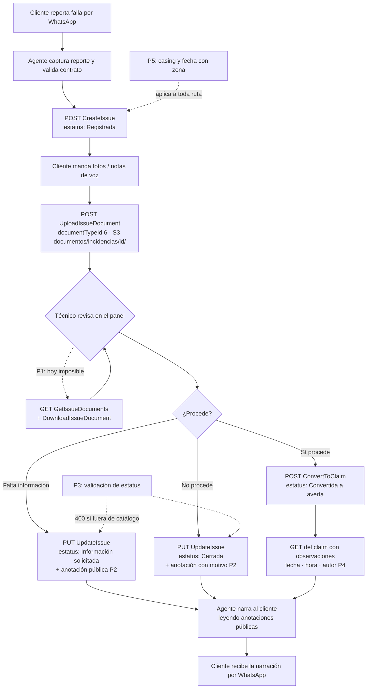
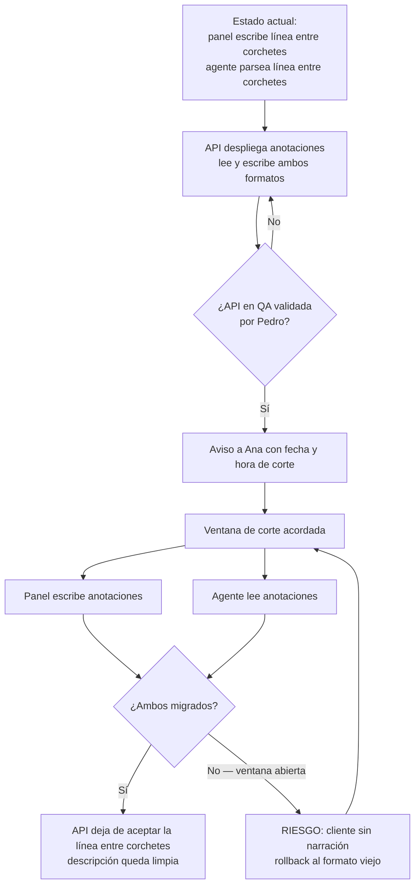

# PRD - Cierre de huecos del servicio de Issues (API SIGA)

| **Campo** | **Detalle** |
| --- | --- |
| **Proyecto** | Cierre de huecos del servicio de Issues — API SIGA (`issues-lectura-evidencia`) |
| **Área / empresa** | Garantiplus México |
| **Versión** | v0.1 |
| **Fecha** | 21 de agosto de 2026 |
| **Autores** | Javier Antonio Oropeza Camacho (desarrollo) · Pedro (contexto y verificación funcional, Engine CX) |
| **Revisión / liderazgo** | Juan Carlos (definición de alcance y prioridad) · Aldo Álvarez (Dirección de TI — por confirmar) |
| **Tipo de proyecto** | Feature web o API |

## 1. Resumen ejecutivo

El servicio de **Issues** (incidencias) de la API de SIGA está entregado y en uso real: desde el **19 de julio de 2026** el agente conversacional de Garantiplus lo consume en vivo para atender por WhatsApp a clientes que reportan una falla de su vehículo. El agente captura el reporte, valida el contrato, sube la evidencia que el cliente manda (fotos, notas de voz) y narra al cliente el avance de su caso. Un técnico revisa después esa incidencia desde un panel web y decide si se convierte en una avería formal. El agente nunca decide: captura, guía, registra, consulta, notifica y escala.

El problema es que el servicio quedó **incompleto en cinco puntos**, y los cinco están tapados con parches del lado del consumidor. Ninguno impide operar hoy, pero dos son frágiles de una forma que ya tiene costo: el motivo de cierre de una incidencia viaja **dentro del texto de la descripción**, como una convención de formato que dos repositorios distintos (el panel y el agente) tienen que respetar a ciegas — si cualquiera de los dos la cambia sin avisar, el cliente recibe texto roto en su WhatsApp. Y la evidencia que el cliente sube **no se puede volver a leer**: el técnico toma la decisión irreversible de convertir una incidencia en avería sin poder ver las fotos que mandó el cliente, porque la pestaña de Evidencia del panel lleva meses vacía.

Este PRD cubre **las cinco peticiones** documentadas por el equipo del agente el 20 de agosto de 2026, verificadas empíricamente contra SIGA QA (no leídas de una especificación). Al analizarlas contra el código se confirmó que **buena parte del trabajo ya está construida**: la tabla `documento_incidencia` existe y `UploadIssueDocument` ya escribe en ella y sube el binario a S3 bajo `documentos/incidencias/{id}/`; lo que falta es únicamente la superficie de lectura. Y SIGA **ya tiene el concepto de anotación** que el documento pedía buscar: `seguimiento_averia`, con fecha, usuario, observaciones, transición de estatus y banderas de visibilidad. Ambos hallazgos reducen el trabajo a espejear estructuras existentes en lugar de inventar convenciones nuevas.

El resultado esperado es doble. Operativamente, el técnico decide con la evidencia a la vista y el cliente deja de estar expuesto a texto roto o a estatus con erratas. Técnicamente, **desaparecen dos parches y una convención de formato compartida entre repositorios**: el arreglo no es cosmético, elimina un contrato implícito que hoy tienen que respetar el panel y el agente sin que nada lo verifique.

**Cliente reporta por WhatsApp** → **el agente registra la incidencia y sube evidencia** → **el técnico la revisa en el panel con la evidencia a la vista** → **cierra con motivo estructurado o la convierte en avería** → **el agente narra al cliente el desenlace leyendo campos, no parseando texto**

## 2. Contexto y problema

### Cómo funciona hoy

El servicio de Issues vive dentro del microservicio **Claims** de la API de SIGA (`claims/api/Issues/v1/…`) y expone seis operaciones en producción de QA, todas en uso: `CreateIssue`, `GetIssueById/{id}`, `GetIssues` (OData), `UpdateIssue/{id}`, `UploadIssueDocument` y `ConvertToClaim/{id}`. La incidencia se guarda en su propia tabla (`incidencia`) y **nunca** se inserta como fila en `averia`, de modo que las métricas de frecuencia y siniestralidad no la cuentan; al convertirla, `id_averia` solo enlaza para trazabilidad.

El agente conversacional consume ese servicio desde el 19 de julio de 2026 y el panel web lo usa para revisar y cerrar. Todo lo que este documento afirma sobre el comportamiento actual está **probado contra QA**, incluida una batería de sondas de solo lectura corrida el 11 de agosto de 2026.

### El dolor concreto

**1. La evidencia no se puede leer.** El agente sube archivos correctamente y SIGA responde `201 { documentId, issueId, "Documento guardado." }`. Pero no existe ninguna ruta para listar ni descargar esos documentos, y **tampoco existe ninguna pantalla dentro de SIGA que los muestre** — se verificó que no hay vistas ni controladores de incidencia en el panel administrativo. El archivo está guardado y es inalcanzable. Consecuencia: el técnico convierte a avería a ciegas.

Se agotaron los caminos alternativos antes de pedir el endpoint: las rutas adivinadas dan 404 de gateway; los endpoints de documentos de *claims* ven únicamente averías (todos sus `uri` son `documentos/averias/{claimId}/…`); y `ConvertToClaim` **no migra los documentos** — se convirtió un issue con evidencia y la avería resultante (CLM-151735) salió vacía.

**2. El motivo de cierre no tiene dónde vivir.** `UpdateIssue` solo acepta `{ description, status, odometer }`, así que el motivo se anexa a la descripción del issue como una línea entre corchetes: `[Cerrada por Alexis el 18/08/2026: desgaste normal]`. Eso convirtió un campo de datos en una **convención de formato compartida entre dos repositorios**: el panel la escribe, el agente la parsea para narrarle al cliente por qué se cerró su caso. Lo mismo pasa con `Información solicitada`, donde el comentario del técnico pidiendo más datos viaja por el mismo canal. Además, la `descripcion` —que debería ser lo que dijo el cliente y nada más— va acumulando líneas administrativas.

**3. El estatus es texto libre.** La columna es `estatus VARCHAR(80)` sin llave foránea a ningún catálogo, y `UpdateIssue` acepta cualquier cadena: hay una fila en QA cuyo estatus dice literalmente `"En revisiónnnnn"`. El agente lo absorbe de forma tolerante (reconoce los nombres conocidos sin distinguir mayúsculas ni acentos, y muestra lo desconocido verbatim), pero eso significa que **una errata escrita desde cualquier cliente llega tal cual al WhatsApp del cliente final**.

**4. Las observaciones de la avería no traen fecha.** Cuando la incidencia ya se convirtió, el agente encadena una segunda consulta al claim para narrar el estatus real. El gerente pidió que se narren también las observaciones, pero hoy no vienen en la respuesta del GET — y sin fecha no se puede decir "la última nota es del martes", que es justo el dato que da utilidad a la narración.

**5. Dos rarezas del gateway son folclore oral.** Las rutas de *claims* van en minúsculas y las de *Issues* Capitalizadas; escribir la variante equivocada no devuelve 404 sino **301**, y `HttpClient` de .NET **descarta el header `Authorization` al seguir un redirect**, así que el síntoma es un `401` inexplicable en una ruta que existe. El agente corre con `AllowAutoRedirect = false` exactamente por eso. Y `creationDate` cambia de forma según por dónde salga: el `201` de `CreateIssue` la devuelve con zona y `GetIssueById` sin zona, porque la columna es `TIMESTAMP` sin zona y el POST serializa un `DateTime.UtcNow` recién creado.

### Por qué resolverlo ahora

Los cinco huecos ya tienen costo pagado: el panel está bloqueado en su función principal, y el parche del motivo de cierre es una bomba de tiempo que revienta en el WhatsApp del cliente el día que alguno de los dos repositorios cambie el formato. Además, el sistema aún no sale a producción, así que **arreglar el contrato antes del corte a producción evita migrar los parches también**.

### Distinción de dominio crítica para el equipo dev

| Concepto | Qué es | Dónde vive |
| --- | --- | --- |
| **Incidencia** (issue) | Primer contacto del cliente. No es un siniestro. **No** afecta métricas de frecuencia ni siniestralidad. | Tabla `incidencia`. Folio que ve el cliente: `INC-{issueId}`, compuesto por el agente (la incidencia **no tiene folio propio**). |
| **Avería** (claim) | Siniestro formal. Sí cuenta para métricas. | Tabla `averia`. Folio del cliente: `CLM-{claimId}`. |
| **Conversión** | Acción **humana** desde el panel. El agente nunca convierte. | `ConvertToClaim`; deja `incidencia.id_averia` como enlace de trazabilidad. |

⚠️ **Los espacios de ids de incidencia y de avería son secuencias independientes que se solapan.** Filtrar los documentos de avería por un `issueId` devuelve archivos de una avería vieja sin ninguna relación — en la prueba real, PDFs de taller de un claim de 2020. Parece que funciona, devuelve archivos, y son de otro cliente. Es el atajo que el equipo dev **no** debe tomar.

## 3. Objetivo del producto

Completar el contrato del servicio de Issues de la API de SIGA para que sus dos consumidores —el agente conversacional de WhatsApp y el panel web de revisión— puedan **leer la evidencia que ellos mismos suben** y **leer el motivo de cierre y las peticiones de información como datos estructurados**, en lugar de a través de parches: una convención de formato dentro de un campo de texto y una tolerancia defensiva ante estatus mal escritos.

La mejora medible es la eliminación de tres parches del lado del consumidor (dos parsers de línea entre corchetes y la contaminación de la descripción), el desbloqueo de la pestaña de Evidencia del panel, y la reducción a cero de estatus fuera de catálogo llegando al cliente final. Todo lo nuevo se construye **como espejo de lo que ya existe** para averías (`documento_averia`, `seguimiento_averia`, `GetClaimDocuments`, `DownloadClaimDocument`), no inventando convenciones.

### 3.1 Estrategia de implementación por fases

Las fases **ordenan la entrega, no recortan el alcance**: el MVP de este PRD son las cinco peticiones completas. El orden responde a dos criterios: qué desbloquea al panel primero, y qué requiere despliegue coordinado con otros repositorios.

| **Fase** | **Nombre** | **Descripción** |
| --- | --- | --- |
| Fase 1 — **MVP** | Lectura de evidencia y estatus confiable | Peticiones 1 y 3. Endpoints de listado y descarga de documentos de incidencia, y validación de `status` contra catálogo cerrado en `UpdateIssue`. Sin dependencia de otros repositorios: se puede desplegar solo. Desbloquea la pestaña de Evidencia del panel. |
| Fase 2 | Anotaciones de incidencia | Petición 2. Tabla `seguimiento_incidencia` espejo de `seguimiento_averia`, expuesta como colección de anotaciones del issue, con bandera de visibilidad. **Requiere despliegue coordinado** con el panel (Ana) y el agente (Pedro) el mismo día. |
| Fase 3 | Observaciones de avería y normalización del gateway | Peticiones 4 y 5. Observaciones del claim en el GET con fecha, hora y autor; normalización del casing de rutas y de la forma de `creationDate`. Prioridad baja: nada bloquea, pero saca de circulación el folclore oral. |
| Fase 4 | Habilitación a producción | Provisión de la URL del gateway de producción y de una cuenta de servicio para el agente, más una ventana para **re-verificar en producción** las rarezas del gateway con la batería de sondas de solo lectura que ya existe. No es código de la API: es habilitación y validación. |

## 4. Usuarios y actores

| **Usuario / Actor** | **Rol en el proceso** |
| --- | --- |
| **Cliente final** | Reporta la falla de su vehículo por WhatsApp, manda fotos y notas de voz, y recibe la narración del avance de su caso. Nunca ve la API; ve lo que el agente le narra. |
| **Agente conversacional de Garantiplus** (Engine CX) | Consumidor principal de escritura y lectura. Captura el reporte, valida el contrato, sube evidencia (`documentTypeId 6`), consulta estatus y narra al cliente. **Nunca decide**: no convierte, no cierra, no autoriza. |
| **Técnico de revisión** | Revisa la incidencia desde el panel web, pide información adicional, cierra sin convertir, o la convierte en avería formal. Es quien hoy decide **sin poder ver la evidencia**. |
| **Panel web de incidencias** | Segundo consumidor. Lista y consulta incidencias, actualiza estatus, escribe el motivo de cierre y dispara la conversión. Mantenido por Ana. |
| **Pedro** (agente de averías, Engine CX) | Dueño del comportamiento del agente y de la verificación empírica. Provee la batería de sondas de solo lectura y valida cada entrega contra QA. |
| **Juan Carlos** | Definición: decide qué se construye y en qué orden. |
| **Ana** (panel web) | Debe migrar el panel en la misma ventana que la Fase 2; sin su coordinación el cliente deja de recibir narración. |
| **Javier Antonio Oropeza Camacho** | Desarrollo de la API de SIGA (microservicio Claims). |
| **Gerencia de Postventa** | Solicitante de la petición 4 (observaciones con fecha en la narración). |
| **TI / Infraestructura** | Provee la URL del gateway de producción y la cuenta de servicio del agente (Fase 4); ejecuta la migración de base de datos. |

## 5. Alcance MVP y funcionalidades

| **Funcionalidad** | **Descripción** |
| --- | --- |
| **Listado de documentos de una incidencia** | `GET claims/api/Issues/v1/GetIssueDocuments`, con soporte OData filtrable por `issueId`, espejo de `GetClaimDocuments`. Devuelve por documento: `documentId`, `issueId`, `documentType` (nombre resuelto del catálogo), `originalFileName`, `uri`, `mimeType` y `creationDate`. Lee de `documento_incidencia`, que **ya existe y ya se está llenando**. |
| **Descarga de un documento de incidencia** | `GET claims/api/Issues/v1/DownloadIssueDocument/{documentId}` devuelve el binario desde S3 con su `Content-Type` real, igual que `DownloadClaimDocument`. El `documentId` es el de `documento_incidencia`, no el de `documento_averia`. |
| **Aislamiento estricto de los espacios de ids** | Los endpoints de documentos de incidencia leen **exclusivamente** `documento_incidencia`, y los de avería exclusivamente `documento_averia`. Un `issueId` nunca resuelve contra averías ni al revés, incluso cuando el número exista en ambas secuencias. |
| **Permisos de lectura de evidencia** | Listado y descarga aplican la **misma regla que ya usa `UploadIssueDocument`**: admin general, admin externo, gerente de país, taller, o el usuario que registró la incidencia. La evidencia son fotos de un cliente identificable; el criterio de lectura no puede ser más laxo que el de escritura. |
| **Catálogo cerrado de estatus de incidencia** | Cinco valores: `1 Registrada`, `2 En revisión`, `3 Información solicitada`, `4 Convertida a avería`, `5 Cerrada`. Queda como catálogo consultable, alineado con cómo `estatus_averia` ya funciona para averías. |
| **Validación de estatus en `UpdateIssue`** | Un `PUT` con un estatus fuera del catálogo devuelve **400** con `{ errorCode, message }` y **no modifica nada** (ni el estatus ni los demás campos del request). |
| **Anotaciones de incidencia** | Tabla `seguimiento_incidencia` espejo de `seguimiento_averia`: `fecha`, `usuario`, `observaciones`, estatus anterior y nuevo, y bandera de visibilidad. Cubre de una vez el **motivo de cierre** y las **peticiones de información**, que hoy comparten el mismo canal improvisado. |
| **Anotaciones en la respuesta del issue** | `GetIssueById` devuelve la colección de anotaciones del issue, cada una con texto, autor, fecha y tipo, ordenables por fecha. El agente lee campos; deja de parsear texto. |
| **Bandera de visibilidad en anotaciones** | Cada anotación marca si es narrable al cliente. El agente lee **solo las públicas**, de modo que una nota interna del técnico no puede llegar a WhatsApp por accidente. |
| **Descripción limpia** | Con las anotaciones disponibles, `descripcion` vuelve a ser exclusivamente lo que dijo el cliente. Ni el panel ni la API anexan líneas administrativas. |
| **Anotación automática en cambios de estatus** | Todo cambio de estatus vía `UpdateIssue` deja su anotación con estatus anterior, estatus nuevo, usuario y fecha, igual que `seguimiento_averia` registra las transiciones de avería. Da la bitácora que hoy no existe. |
| **Observaciones de avería en el GET** | La respuesta del claim incluye sus observaciones (de `seguimiento_averia`), cada una con **fecha, hora y autor**, ordenables por fecha, respetando las banderas de visibilidad ya existentes. |
| **Normalización del gateway** | El casing de rutas queda normalizado o, si no es viable, **declarado explícitamente en el contrato** junto con la advertencia del 301 que descarta el `Authorization`. Deja de ser conocimiento oral. |
| **`creationDate` siempre con zona** | Todas las fechas del servicio de Issues se devuelven con zona horaria, en la misma forma desde el POST y desde el GET. El agente deja de necesitar dos parsers de fecha. |
| **Habilitación a producción** | URL del gateway de producción, cuenta de servicio para el agente, y ventana de re-verificación en producción con la batería de sondas de solo lectura ya escrita. |

**Principio rector del MVP:** todo lo que se agrega es **espejo de una estructura que ya existe** para averías; no se inventan convenciones nuevas ni se cambia el modelo de dominio. Y ninguna de estas capacidades traslada al agente una decisión que hoy es humana: el agente sigue capturando, consultando y narrando — **convertir, cerrar y pedir información siguen siendo acciones de una persona**. La validación de estatus y la bandera de visibilidad existen precisamente para que el agente no pueda narrar algo que nadie escribió con esa intención.

## 6. Fuera de alcance

- **Almacenamiento propio de documentos del lado del agente**: SIGA ya guarda los archivos en S3 y el agente no necesita ninguno. Se excluye porque duplicaría la custodia de datos personales del cliente sin resolver nada.
- **Migrar los documentos de una incidencia a la avería al convertir**: hoy `ConvertToClaim` no los migra y este PRD no lo cambia. El panel podrá leerlos por el lado de la incidencia, que es donde están. Lo habilitaría una decisión de dominio de JC sobre si la avería debe heredar la evidencia.
- **Resolver la lectura filtrando documentos de avería por el id del issue**: explícitamente prohibido — los espacios de ids se solapan y devolvería archivos de otro cliente.
- **Pantalla de evidencia dentro de SIGA (`GarantiplusWeb`)**: no existe hoy y no se construye aquí. Este PRD entrega la API; la interfaz es del panel de Ana.
- **Réplica a Garantiplus Colombia y Chile**: la tabla `incidencia` está replicada en `DataAccessColombia` y el script de BD contempla las tres bases (MEX, COL, CHL), pero el agente opera hoy solo contra México. Lo habilitaría que el agente empiece a operar en esos países. Se excluye para no multiplicar por tres la superficie de prueba de un contrato que aún no salió a producción.
- **Backfill de las líneas históricas entre corchetes a anotaciones**: las incidencias ya cerradas conservan su motivo dentro de la descripción. Convertirlas requeriría parsear en producción justo el formato que este proyecto quiere retirar. Lo habilitaría una decisión explícita de JC sobre el valor histórico de esos motivos.
- **Cambiar el contrato de `status` de nombre a `statusId`**: se valida contra catálogo, pero se mantiene el envío por nombre para no romper a los dos consumidores en vivo. Lo habilitaría una versión `v2` del endpoint.
- **Eventos para BI**: la API no emite eventos de negocio; la instrumentación de la conversación vive en el agente de Engine CX, que ya la tiene. Este PRD solo garantiza que la API registre auditoría técnica de cada llamada.
- **Retirar la tolerancia del agente ante estatus desconocidos**: se queda como red de seguridad incluso después de la validación, por decisión del equipo del agente.

## 7. Flujos principales

### 7.1 Ciclo de vida de una incidencia y dónde interviene cada petición

El flujo no cambia de forma con este proyecto: cambia **de qué se alimenta cada paso**. Hoy el rombo de decisión del técnico (`F`) se resuelve sin la rama punteada de evidencia, y la narración al cliente (`L`) se alimenta parseando texto dentro de la descripción en lugar de leyendo anotaciones. Las peticiones 3 y 5 son transversales: no agregan pasos, blindan los que ya existen.

El punto crítico de diseño es que **la rama de evidencia cuelga del rombo de decisión, no del registro**. La evidencia no se lee cuando se sube; se lee cuando alguien va a tomar una decisión irreversible con ella. De ahí que la petición 1 sea la de prioridad alta a pesar de ser la más sencilla técnicamente: es la única que le da información a un humano justo antes de que decida.

### 7.2 Ventana de despliegue coordinado de la Fase 2

Este flujo existe porque el riesgo de la Fase 2 no es técnico, es de coordinación. Durante la ventana en que un repositorio escribe en el campo nuevo y el otro sigue leyendo la línea vieja, **el cliente deja de recibir la narración de su caso**. La mitigación es que la API soporte **ambos formatos simultáneamente** durante la transición, de modo que el orden de despliegue deje de importar y no exista un instante en que el cliente quede sin narración. El corte a un solo formato ocurre después, cuando los dos consumidores ya migraron.

## 8. Requerimientos funcionales

| **ID** | **Requerimiento** | **Descripción** |
| --- | --- | --- |
| RF-01 | Listar documentos de una incidencia | `GET claims/api/Issues/v1/GetIssueDocuments` devuelve los documentos de `documento_incidencia` con soporte OData, filtrable por `issueId`. Cada fila trae `documentId`, `issueId`, `documentType`, `originalFileName`, `uri`, `mimeType` y `creationDate`. |
| RF-02 | Descargar un documento de incidencia | `GET claims/api/Issues/v1/DownloadIssueDocument/{documentId}` devuelve el binario desde S3 con el `Content-Type` correspondiente a su `mime_type` registrado. |
| RF-03 | Aislamiento de espacios de ids | Los endpoints de documentos de incidencia resuelven exclusivamente contra `documento_incidencia`; un `documentId` o `issueId` que exista también en el espacio de averías nunca devuelve datos de avería. Verificable con un id presente en ambas secuencias. |
| RF-04 | Permisos de lectura de evidencia | Listado y descarga aplican la misma regla de autorización que `UploadIssueDocument`: rol admin general, admin externo, gerente de país o taller, o coincidencia con `incidencia.registrada_por`. Un usuario sin esos atributos recibe **403**. |
| RF-05 | Incidencia inexistente o eliminada | Los endpoints de documentos devuelven **404** para un `issueId` inexistente o con `eliminada = true`, y no exponen documentos de incidencias eliminadas. |
| RF-06 | Catálogo de estatus de incidencia | Existe un catálogo consultable con los cinco valores: `1 Registrada`, `2 En revisión`, `3 Información solicitada`, `4 Convertida a avería`, `5 Cerrada`. |
| RF-07 | Validación de estatus en `UpdateIssue` | Un `PUT UpdateIssue` con un `status` que no pertenezca al catálogo devuelve **400** con `{ errorCode, message }` y **no persiste ningún cambio**, incluidos los demás campos del mismo request. |
| RF-08 | Tolerancia de escritura del estatus | La validación acepta el nombre del estatus sin distinguir mayúsculas ni acentos, para no romper a los consumidores en vivo, pero **normaliza** el valor persistido a la forma exacta del catálogo. |
| RF-09 | Registro de anotaciones de incidencia | Existe la entidad `seguimiento_incidencia` con `id_incidencia`, `fecha`, `usuario`, `observaciones`, estatus anterior, estatus nuevo y bandera de visibilidad, espejo de `seguimiento_averia`. |
| RF-10 | Escribir una anotación al actualizar | `UpdateIssue` acepta el motivo o comentario del técnico como dato estructurado (texto + tipo + visibilidad) y lo persiste como anotación, sin tocar `descripcion`. |
| RF-11 | Anotación automática de transición de estatus | Todo cambio de estatus genera su anotación con estatus anterior, estatus nuevo, usuario del token y fecha del servidor, aun cuando el request no incluya un comentario. |
| RF-12 | Anotaciones en la respuesta del issue | `GetIssueById` devuelve la colección de anotaciones del issue, cada una con texto, autor, fecha con zona, tipo y visibilidad, ordenables por fecha. |
| RF-13 | Filtrado de anotaciones por visibilidad | Una anotación marcada como no pública no se devuelve a un consumidor que no tenga derecho a verla, de modo que el agente solo puede narrar lo público. |
| RF-14 | Descripción sin líneas administrativas | La API no anexa ni requiere líneas administrativas dentro de `descripcion`. El campo contiene únicamente lo reportado por el cliente. |
| RF-15 | Convivencia de formatos durante la transición | Durante la ventana de migración de la Fase 2, la API acepta el motivo tanto como anotación estructurada como en la línea entre corchetes, y expone ambos, de modo que el orden de despliegue de panel y agente no deje al cliente sin narración. |
| RF-16 | Observaciones de avería en el GET | La respuesta del claim incluye sus observaciones desde `seguimiento_averia`, cada una con fecha y hora con zona y autor, ordenables por fecha, respetando las banderas de visibilidad existentes. |
| RF-17 | Fechas con zona en todo el servicio | Todas las fechas que devuelve el servicio de Issues incluyen zona horaria, y el mismo campo tiene la misma forma en la respuesta del POST y del GET. |
| RF-18 | Casing de rutas resuelto | El casing de rutas queda normalizado; si por restricción del gateway no es viable, queda **declarado explícitamente en `api-contract.md`**, junto con la advertencia de que la variante equivocada devuelve 301 y que .NET descarta el `Authorization` al seguir el redirect. |
| RF-19 | Verificación de paridad de la evidencia | Es verificable que una foto subida a un issue de QA se lista por `issueId` y se descarga con los **mismos bytes** que el original. La batería de prueba la aporta el equipo del agente. |
| RF-20 | Habilitación de producción | Quedan provistos la URL del gateway de producción y una cuenta de servicio para el agente, y se ejecuta la batería de sondas de solo lectura contra producción para re-verificar el casing y la forma de las fechas. |

## 9. Requerimientos no funcionales

| **ID** | **Requerimiento** | **Descripción** |
| --- | --- | --- |
| RNF-01 | Privacidad de la evidencia del cliente | Los documentos son fotos y notas de voz de un cliente identificable. El criterio de lectura no puede ser más laxo que el de escritura, y ninguna respuesta debe permitir inferir la existencia de documentos de otra incidencia o de otro cliente. |
| RNF-02 | Control de permisos explícito | Todos los endpoints nuevos exigen JWT y la política `ICanManageIssues`, más la regla de autorización por rol o pertenencia descrita en RF-04. Nada queda accesible por omisión. |
| RNF-03 | Trazabilidad de toda llamada | Cada operación registra request y response vía `LoggingService` (usuario, ruta, código de estado, duración), como ya hacen los endpoints existentes de Issues. |
| RNF-04 | Auditabilidad del cambio de estatus | Toda transición de estatus queda con usuario, fecha y estatus anterior. Debe poder reconstruirse la historia de una incidencia sin leer logs de aplicación. |
| RNF-05 | Manejo de errores uniforme | Los errores devuelven la forma `{ errorCode, message }` con mensaje en español apto para que el agente lo relaye, consistente con los endpoints ya entregados. |
| RNF-06 | Compatibilidad retroactiva | Ningún cambio rompe a los dos consumidores en vivo. Los campos nuevos son aditivos y el envío de `status` por nombre se conserva. |
| RNF-07 | Consistencia durante la migración | La Fase 2 no debe tener un instante en que el cliente quede sin narración: la API soporta ambos formatos hasta que panel y agente hayan migrado (RF-15). |
| RNF-08 | Disponibilidad | El servicio de Issues atiende conversaciones de WhatsApp en curso, por lo que se considera de disponibilidad continua. Los despliegues deben ser sin interrupción perceptible; la migración de base de datos debe ser aditiva y no bloquear la tabla `incidencia`. |
| RNF-09 | Tiempos de respuesta | El listado de documentos y la lectura de anotaciones deben responder en tiempos comparables a los endpoints equivalentes de avería, para no degradar la conversación del agente ni la carga del panel. |
| RNF-10 | Límite de tasa en consultas | El listado OData de documentos aplica la política de rate limiting ya usada por `GetIssues`, para que una consulta abierta no degrade el servicio. |
| RNF-11 | Mantenibilidad por espejo | Las estructuras nuevas son espejo de las de avería (`documento_averia`, `seguimiento_averia`) y siguen `CODING_GUIDELINES.md`, de modo que quien conoce un lado entiende el otro sin documentación adicional. |
| RNF-12 | Observabilidad de la validación | Los rechazos por estatus fuera de catálogo se registran con el valor recibido y el cliente que lo envió, para poder identificar qué consumidor está mal escribiendo. |
| RNF-13 | Documentación del contrato | Los endpoints nuevos quedan documentados en Swagger/Scalar con sus códigos de respuesta, y las rarezas del gateway quedan declaradas en `api-contract.md`. |
| RNF-14 | Verificabilidad empírica | Cada petición se cierra con la verificación descrita por el equipo del agente contra QA, no con la revisión de la especificación. |
| RNF-15 | Ausencia de suite de pruebas | El repositorio no tiene proyectos de test, por lo que la verificación es empírica contra QA con la batería de sondas. Si se decide agregar pruebas automatizadas, es trabajo adicional a estimar. |

## 10. Integraciones y datos

| **Integración / Fuente** | **Uso esperado** |
| --- | --- |
| **API de SIGA — microservicio Claims** | Sistema donde se construye. Se agregan endpoints al servicio de Issues y se extiende la respuesta del claim. Autenticación JWT Bearer. |
| **PostgreSQL (RDS)** vía `DataAccess` | Lectura de `incidencia`, `documento_incidencia`, `tipo_documento`, `seguimiento_averia`. Escritura de la nueva `seguimiento_incidencia`. Migración aditiva sobre la base de México. |
| **Amazon S3** | Lectura de los binarios ya almacenados bajo `documentos/incidencias/{id}/`. **Solo lectura**: no se cambia la escritura, que ya funciona. |
| **Catálogo `tipo_documento`** | Compartido con averías. Solo lectura, para resolver el nombre del tipo en el listado (Evidencia = 6, el único que escribe el agente). |
| **Agente conversacional (Engine CX)** | Consumidor. Lee estatus, anotaciones públicas y observaciones del claim; escribe incidencias y evidencia. Requiere cuenta de servicio propia en producción. |
| **Panel web de incidencias** | Consumidor. Lee incidencias y su evidencia; escribe estatus y anotaciones. Debe migrar en la ventana de la Fase 2. |
| **API Gateway** | Enrutamiento y punto donde vive la rareza del casing y del 301. Requiere la URL de producción. |
| **`LogsMonitorClient`** | Auditoría externa de request/response de cada endpoint, ya integrada en el servicio. |
| **`api-contract.md`** | Documento de contrato mantenido por el equipo del agente. Debe actualizarse con las formas nuevas y con la declaración del casing. |

### Datos mínimos requeridos

**Incidencia** (`incidencia`, existente): `id_incidencia`, `id_contrato`, `id_averia`, `vin_placa`, `descripcion`, `odometro`, `estatus`, `fecha_registro`, `registrada_por`, `eliminada`.

**Documento de incidencia** (`documento_incidencia`, existente — solo falta leerlo): `id_documento_incidencia`, `id_incidencia`, `id_tipo_documento`, `nombre_original`, `uri`, `mime_type`, `fecha`.

**Anotación de incidencia** (`seguimiento_incidencia`, **nueva**): identificador, `id_incidencia`, `fecha`, `usuario`, `observaciones`, estatus anterior, estatus nuevo, bandera de visibilidad al cliente.

**Catálogo de estatus de incidencia** (**nuevo o validado en código**): identificador y nombre de los cinco valores.

**Observación de avería** (`seguimiento_averia`, existente — solo falta exponerla): `id_seguimiento`, `id_averia`, `fecha`, `usuario`, `observaciones`, `id_estatus_anterior`, `id_estatus`, `publico`, `solo_agencia`.

### Esquema de permisos

**Puede leer:** el agente, sobre las incidencias que él registró — su estatus, sus anotaciones **públicas** y las observaciones públicas del claim asociado. El panel, sobre las incidencias de su ámbito, incluida la evidencia y las anotaciones internas, según los roles administrativos ya definidos.

**Puede escribir/crear:** el agente crea incidencias y sube evidencia (solo tipo Evidencia). El panel actualiza estatus dentro del catálogo y crea anotaciones, marcando su visibilidad.

**Queda bloqueado sin validación humana:** la conversión a avería (`ConvertToClaim`) y el cierre de una incidencia siguen siendo acciones de una persona desde el panel — el agente no las ejecuta ni las propone como hechas. Tampoco puede el agente crear anotaciones internas ni marcar una anotación como pública: la decisión de qué se le dice al cliente la toma quien escribe la nota, no quien la narra.

**Queda bloqueado sin TI:** la migración de base de datos, la provisión de la cuenta de servicio y la URL del gateway de producción.

## 12. Métricas de éxito

| **Métrica** | **Descripción** |
| --- | --- |
| **Conversiones con evidencia consultada** | Porcentaje de `ConvertToClaim` precedidos por al menos una consulta de evidencia del mismo issue. Es la métrica que dice si el hueco 1 realmente se cerró: mide que el técnico ahora sí mira antes de decidir. Línea base actual: 0% (imposible hoy). Meta pendiente de validar con operación. |
| **Pestaña de Evidencia con contenido** | Proporción de incidencias con evidencia subida cuya evidencia es visible en el panel. Debe llegar a 100% de las que tienen documentos. |
| **Estatus fuera de catálogo persistidos** | Conteo de valores de `estatus` en la tabla que no pertenecen al catálogo. Debe quedar en **0** para las incidencias creadas después de la Fase 1. |
| **Rechazos 400 por estatus inválido** | Conteo de rechazos por consumidor. No es una métrica a minimizar sino a **observar**: identifica qué cliente está escribiendo mal y desaparece cuando ese cliente se corrige. |
| **Parsers eliminados** | Conteo de parches retirados de los repositorios consumidores: los dos parsers de línea entre corchetes, el doble parser de fecha y la contaminación de `descripcion`. Meta: 4 de 4. Es la métrica de que el arreglo no fue cosmético. |
| **Incidentes de narración rota** | Conteo de casos en que el cliente recibe texto malformado o queda sin narración. Debe ser **0**, con atención especial a la ventana de despliegue de la Fase 2. |
| **Cobertura de la re-verificación en producción** | Proporción de la batería de sondas de solo lectura ejecutada con éxito contra producción. Meta: 100% antes de declarar el corte. |

## 13. Riesgos y supuestos

### Riesgos

| **Riesgo** | **Impacto potencial** |
| --- | --- |
| **El rol del técnico de revisión puede no estar en el conjunto de roles con permiso de lectura** | La regla espejo del upload autoriza a admin general, admin externo, gerente de país, taller y al usuario que registró la incidencia. Como el agente es quien registra, **el técnico que revisa no cumple ninguna de esas condiciones salvo que tenga rol administrativo**. Si es así, el listado devolvería 403 y la pestaña de Evidencia seguiría vacía — el proyecto entregaría el endpoint sin resolver el problema. **Debe verificarse contra los roles reales del panel antes de implementar la Fase 1.** |
| **Ventana de despliegue coordinado de la Fase 2** | Si el panel y el agente no migran de forma coordinada, el cliente deja de recibir la narración de su caso por WhatsApp. Mitigación: RF-15 (la API soporta ambos formatos durante la transición) y aviso previo a Ana con fecha y hora de corte. |
| **Colisión de espacios de ids** | Una implementación que resuelva documentos por id sin discriminar el espacio devolvería archivos de otro cliente — ya ocurrió en pruebas, con PDFs de taller de un claim de 2020. Impacto: fuga de datos personales entre clientes. |
| **La columna `fecha_registro` es `TIMESTAMP` sin zona** | Cumplir RF-17 obliga a elegir entre migrar la columna a `timestamptz` (correcto pero con impacto en toda consulta que la use) o fijar el `Kind` al mapear (barato pero deja la ambigüedad en la base). Elegir mal deja el problema latente o encarece la fase. |
| **No hay proyectos de test en el repositorio** | Toda la verificación es empírica contra QA. Un cambio en la validación de estatus o en los permisos de lectura puede regresar sin que nada lo detecte. |
| **Producción puede no comportarse como QA** | Todo está verificado contra QA, incluido el agente que hoy responde WhatsApp real. Las rarezas del gateway podrían diferir en producción y romper al agente en el corte. Mitigación: Fase 4 con ventana de re-verificación. |
| **Divergencia con Colombia y Chile** | Al aplicar la migración solo en México, las tres bases quedan con esquemas distintos. Cuanto más tarde la réplica, más cara será la convergencia. |
| **Normalizar el casing puede romper consumidores no inventariados** | Si el casing se cambia en lugar de documentarse, cualquier cliente que use la variante actual deja de funcionar. No hay inventario completo de consumidores del gateway. |
| **La anotación automática de transición puede generar ruido** | Si cada cambio de estatus deja anotación, una incidencia muy trabajada acumula notas que el agente tendría que filtrar para narrar algo útil. Mitigación: la bandera de visibilidad y el tipo de anotación. |
| **Dependencia externa para la Fase 4** | La URL del gateway de producción y la cuenta de servicio no dependen del equipo de desarrollo. Sin ellas, las cuatro fases pueden estar listas y el proyecto no sale a producción. |

### Supuestos

| **Supuesto** | **Descripción** |
| --- | --- |
| Los archivos ya están completos en S3 | `UploadIssueDocument` se verificó en vivo y guarda binario en S3 y metadatos en `documento_incidencia`. Este PRD asume que no hay archivos huérfanos ni metadatos sin binario que obliguen a una reconciliación previa. |
| `documento_incidencia` no necesita estatus de documento | A diferencia de los documentos de avería, los de incidencia no tienen campo de estatus. Se asume que la evidencia no requiere flujo de aprobación. |
| El agente solo escribe evidencia | De los siete tipos del catálogo, el agente solo usa Evidencia (6). Los demás llegarían desde el panel, si acaso. |
| `seguimiento_averia` es el concepto de anotación correcto a espejear | Se asume que es la estructura de anotación vigente en SIGA y que JC confirma reutilizarla en lugar de crear campos nuevos. |
| Las banderas de visibilidad de avería son confiables | La petición 4 expone observaciones respetando `publico` y `solo_agencia`. Se asume que esas banderas están bien pobladas en los datos existentes; si no, se expondría al cliente una nota interna. |
| QA es representativo del comportamiento de producción | Se asume para diseñar, y se verifica explícitamente en la Fase 4 en lugar de darse por hecho. |
| El agente conserva su tolerancia | La validación de estatus no reemplaza la red de seguridad del agente; ambas coexisten. |
| Solo México en este alcance | El agente opera únicamente contra la base de México durante la vigencia de este PRD. |

## 14. Preguntas abiertas

| **Tema** | **Pregunta abierta** |
| --- | --- |
| **Permisos (bloqueante Fase 1)** | ¿Qué rol tiene en SIGA el técnico que revisa incidencias en el panel? Si no es admin general, admin externo, gerente de país o taller, la regla espejo del upload lo dejaría fuera y la pestaña de Evidencia seguiría vacía. ¿Se agrega su rol al conjunto autorizado, o la lectura se rige por la política del controlador? |
| **Permisos** | ¿El agente debe poder leer la evidencia que él mismo subió, o solo escribirla? La regla por `registrada_por` se lo permitiría; conviene confirmar si eso es deseado. |
| **Estatus** | ¿El catálogo se materializa como tabla `estatus_incidencia` con llave foránea desde `incidencia` (consistente con `estatus_averia`, pero implica migrar los valores existentes, incluido `"En revisiónnnnn"`), o como validación en la capa de API sin cambio de esquema? |
| **Estatus** | ¿Qué se hace con las filas de QA cuyo estatus está fuera de catálogo? ¿Se normalizan, se dejan como están, o se descartan por ser de prueba? |
| **Estatus** | ¿`UpdateIssue` debe seguir aceptando el estatus por nombre indefinidamente, o se planea una `v2` que reciba `statusId`? |
| **Anotaciones** | ¿Las anotaciones se exponen también en el listado OData `GetIssues`, o solo en `GetIssueById`? Afecta el rendimiento de la lista del panel. |
| **Anotaciones** | ¿Se replica también `solo_agencia` además de la bandera de público, o para incidencias basta una sola dimensión de visibilidad? |
| **Anotaciones** | ¿Quién decide la visibilidad al escribir desde el panel: es una decisión explícita del técnico en la interfaz, o se deriva del tipo de anotación? |
| **Anotaciones** | ¿Se hace backfill de los motivos históricos que hoy viven entre corchetes dentro de `descripcion`, o se dejan ahí como registro histórico? |
| **Fechas** | ¿Se migra `fecha_registro` a `timestamptz` o se resuelve fijando el `Kind` en el mapeo? La primera es correcta y más cara; la segunda deja la ambigüedad en la base de datos. |
| **Gateway** | ¿El casing se normaliza o se declara en el contrato? Normalizarlo requiere inventariar los consumidores actuales del gateway, que hoy no está hecho. |
| **Gateway** | ¿Existe inventario de qué clientes además del agente y el panel consumen estas rutas? |
| **Documentos** | ¿Debe `ConvertToClaim` migrar la evidencia a la avería, o basta con que el panel la lea del lado de la incidencia? Es una decisión de dominio, no técnica. |
| **Multi-país** | ¿Cuándo se replican los cambios a Colombia y Chile, y quién lo dispara? El script de BD original contemplaba las tres bases. |
| **Producción (Fase 4)** | ¿Quién provee la URL del gateway de producción y la cuenta de servicio del agente, y con qué tiempo de anticipación? |
| **Producción (Fase 4)** | ¿Qué permisos exactos lleva la cuenta de servicio del agente, y se le aplica la misma regla de lectura de evidencia? |
| **Calidad** | ¿Se agregan pruebas automatizadas en este proyecto, siendo que el repositorio no tiene ninguna, o la verificación empírica contra QA se considera suficiente? |
| **Contrato** | ¿Quién actualiza `api-contract.md` con las formas nuevas: el equipo del agente que lo mantiene, o desarrollo al entregar cada fase? |
| **Liderazgo** | ¿La revisión técnica de este PRD recae en Aldo Álvarez como Director de TI? |
