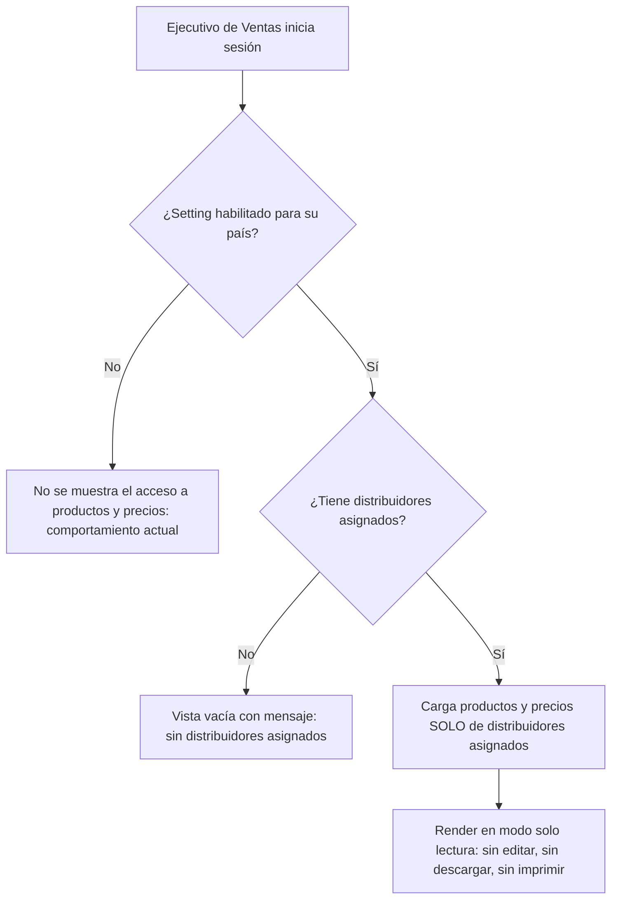

# PRD - Acceso de solo lectura a distribuidores, productos y precios para el Ejecutivo de Ventas (CA-05)

| **Campo** | **Detalle** |
| --- | --- |
| **Proyecto** | Acceso a distribuidores, productos y precios para el Rol Ejecutivo de Ventas (CA-05) |
| **Área / empresa** | Garantiplus México |
| **Versión** | v0.3 |
| **Fecha** | 2026-08-13 |
| **Autores** | Alejandro Govea Hernández |
| **Revisión / liderazgo** | Alexis Salvador Herrera Garcia (alexis.herrera@gplusseguros.mx) |
| **Tipo de proyecto** | Feature web/API |

## 1. Resumen ejecutivo

El proyecto amplía los permisos del rol **Ejecutivo de Ventas** en SIGA para darle **acceso de solo lectura** a los productos y precios de los **distribuidores que ya tiene asignados**. Hoy este rol gestiona la relación comercial con sus distribuidores pero **no tiene visibilidad** sobre los productos y precios cargados para ellos, lo que le obliga a solicitar esa información a otras áreas (administración/soporte).

El problema es de **visibilidad y autonomía**: el Ejecutivo de Ventas necesita consultar productos y precios de sus clientes para su labor comercial, pero el sistema no le expone esa pantalla. La información ya existe en SIGA (la misma pantalla de productos y precios por distribuidor que hoy ve el rol Administrador), por lo que se trata de **reutilizarla en modo lectura** para este rol.

El MVP entrega: visualización de solo lectura de productos y precios **limitada a los distribuidores asignados**, con **edición y descarga/exportación (incluida impresión) bloqueadas**, y gobernada por un **parámetro de configuración por país** que TI/Soporte enciende o apaga. La funcionalidad se construye **para todos los países** pero permanece **apagada por defecto**; se activa donde el negocio lo solicite (inicialmente México).

Resultado esperado: mayor autonomía del Ejecutivo de Ventas, menos solicitudes de consulta a administración y una base de permisos reutilizable y controlada por configuración, sin exponer capacidades de edición ni de extracción de datos.

**Ejecutivo inicia sesión** → **Sistema valida rol + setting del país** → **Filtra a distribuidores asignados** → **Muestra productos y precios en solo lectura**

## 2. Contexto y problema

- **Cómo funciona hoy:** los productos y precios de cada distribuidor viven en una pantalla/módulo existente de SIGA (la misma que ve el rol **Administrador de distribuidor**, con capacidades de edición). El Ejecutivo de Ventas tiene ya sus **distribuidores asignados** en SIGA, pero su perfil **no incluye** el acceso a esa pantalla.
- **Dolor concreto:** el Ejecutivo de Ventas depende de terceros (administración/soporte) para conocer productos y precios de sus propios clientes, lo que genera fricción operativa y demoras en su gestión comercial.
- **Por qué ahora:** se busca dar autonomía al rol comercial reutilizando información que ya existe, con un cambio acotado de permisos y sin exponer edición ni extracción de datos.
- **Distinción de dominio:** "acceso" aquí significa **solo lectura** (consulta en pantalla). No implica editar, actualizar ni descargar/exportar. "Distribuidores asignados" se refiere a la relación ya existente en SIGA entre el Ejecutivo de Ventas y sus distribuidores.

## 3. Objetivo del producto

Permitir que el rol **Ejecutivo de Ventas** consulte en **modo solo lectura** los productos y precios de sus **distribuidores asignados** dentro de SIGA, reutilizando la pantalla existente del Administrador, con las acciones de edición y de descarga/exportación (incluida impresión) bloqueadas, y con la funcionalidad **gobernada por un parámetro de configuración por país** administrado por TI/Soporte. La funcionalidad se deja **preparada para todos los países** y su activación es configurable, arrancando activa donde el negocio lo requiera (México) y apagada en el resto.

*(No se planea por fases formales; es un alcance único gobernado por configuración.)*

## 4. Usuarios y actores

| **Usuario / Actor** | **Rol en el proceso** |
| --- | --- |
| Ejecutivo de Ventas | Usuario final que gana el nuevo acceso de solo lectura a productos y precios de sus distribuidores asignados. |
| Distribuidores asignados | Entidades cuyos productos y precios se visualizan; su relación con el Ejecutivo ya existe en SIGA. |
| TI / Soporte | Administra el parámetro de configuración por país (habilita/deshabilita la funcionalidad). |
| Administrador de distribuidor (rol actual) | Rol que hoy gestiona productos y precios en la pantalla que se reutiliza (con edición); referencia del comportamiento existente, no afectado por este cambio. |

## 5. Alcance MVP y funcionalidades

| **Funcionalidad** | **Descripción** |
| --- | --- |
| Visualización de productos y precios (solo lectura) | El Ejecutivo de Ventas accede a la misma pantalla de productos y precios que el Administrador, en modo consulta, viendo los mismos campos (moneda, impuestos, vigencias) sin capacidades de escritura. |
| Filtrado por distribuidores asignados | La vista se limita exclusivamente a los distribuidores asignados al Ejecutivo; no expone distribuidores no asignados. |
| Bloqueo de edición | Se ocultan/deshabilitan crear, editar y actualizar productos y precios para este rol. |
| Bloqueo de descarga/exportación e impresión | Se ocultan/deshabilitan descarga, exportación (Excel/PDF/CSV) e impresión/envío desde la app para este rol. |
| Parámetro de configuración por país | Flag por país sobre el mecanismo de settings existente de SIGA; apagado por defecto, administrado por TI/Soporte. |

**Principio rector del MVP:** el acceso es de **consulta pura**. El sistema nunca debe permitir, para este rol, modificar datos ni extraer información fuera de pantalla; la habilitación es siempre explícita vía configuración por país (seguridad y control primero).

## 6. Fuera de alcance

- **Edición/actualización de productos o precios por el Ejecutivo de Ventas:** el rol es de consulta; habilitarlo requeriría una decisión de negocio y un rediseño de permisos.
- **Descarga/exportación/impresión de reportes por el Ejecutivo de Ventas:** excluido explícitamente por el insumo; podría evaluarse en el futuro con controles de auditoría.
- **Auditoría/registro de las consultas del rol:** no se instrumenta en el MVP; se habilitaría más adelante si seguridad/operación lo requiere.
- **Autoservicio de la configuración por el negocio:** el parámetro lo administra TI/Soporte; no se construye una pantalla de settings para usuarios de negocio en este MVP.
- **Cambios a la asignación ejecutivo→distribuidor:** se asume existente y se consume tal cual; su mantenimiento no es parte de este desarrollo.
- **Nuevas pantallas o rediseño de la vista de productos/precios:** se reutiliza la pantalla actual en modo lectura, no se crea una nueva.

## 7. Flujos principales

El flujo modela dos compuertas de control antes de mostrar datos: primero el **parámetro por país** (si está apagado, el rol conserva su comportamiento actual sin el nuevo acceso) y luego la **relación de asignación** (solo se cargan los distribuidores del ejecutivo; si no tiene, se muestra una vista vacía con mensaje claro). El render final aplica el modo lectura ocultando toda acción de escritura, descarga e impresión. El objetivo del diseño es que la restricción no dependa solo de la UI, sino que el backend valide rol, país y asignación en cada consulta.

## 8. Requerimientos funcionales

| **ID** | **Requerimiento** | **Descripción** |
| --- | --- | --- |
| RF-01 | Visualización de solo lectura | El Ejecutivo de Ventas puede ver productos y precios de sus distribuidores asignados en la pantalla existente del Administrador, en modo consulta y con los mismos campos. |
| RF-02 | Restricción a asignados | El sistema expone únicamente los distribuidores asignados al Ejecutivo; no muestra distribuidores no asignados. |
| RF-03 | Bloqueo de edición | Para el rol Ejecutivo de Ventas se deshabilitan/ocultan crear, editar y actualizar productos y precios. |
| RF-04 | Bloqueo de descarga/exportación e impresión | Para el rol Ejecutivo de Ventas se deshabilitan/ocultan descarga y exportación (Excel/PDF/CSV) e impresión/envío desde la app. |
| RF-05 | Parámetro por país | Existe un flag por país (sobre el mecanismo de settings existente) que habilita/deshabilita la funcionalidad; deshabilitado, el rol no obtiene el acceso. Default apagado. |
| RF-06 | Administración del parámetro | El parámetro es administrable por TI/Soporte a nivel de configuración del sistema (no autoservicio de negocio). |
| RF-07 | Disponibilidad multipaís | La funcionalidad se construye para todos los países; su activación depende del parámetro por país, apagado por defecto. |
| RF-08 | Preservación del comportamiento actual | Con la funcionalidad deshabilitada, el Ejecutivo de Ventas mantiene su comportamiento actual (sin acceso a productos/precios). |
| RF-09 | Estado sin distribuidores asignados | Si el Ejecutivo no tiene distribuidores asignados, se muestra una vista vacía con un mensaje claro, sin exponer datos. |

## 9. Requerimientos no funcionales

| **ID** | **Requerimiento** | **Descripción** |
| --- | --- | --- |
| RNF-01 | Enforcement en backend | Las restricciones de rol, país y asignación se validan en el backend/API, no solo ocultando elementos en la UI. |
| RNF-02 | Control de permisos | El acceso queda ligado al rol Ejecutivo de Ventas + parámetro por país + asignación vigente; sin permisos de escritura ni de exportación. |
| RNF-03 | Reutilización/mantenibilidad | Se reutiliza la pantalla existente en modo lectura, evitando duplicar lógica de catálogo de productos/precios. |
| RNF-04 | Consistencia de datos | Los productos y precios mostrados provienen en tiempo real del catálogo existente (misma fuente que ve el rol Administrador). |
| RNF-05 | Manejo de errores/estados | Si el setting está apagado o el ejecutivo no tiene asignados, se muestra un estado/mensaje adecuado sin exponer datos. |
| RNF-06 | Multi-país / configuración | El parámetro es por país y su valor por defecto es "deshabilitado"; activar un país no afecta a los demás. |

## 10. Integraciones y datos

| **Integración / Fuente** | **Uso esperado** |
| --- | --- |
| SIGA — mecanismo de configuración/settings (flags por país) | Lectura del flag por país que habilita/deshabilita la funcionalidad; se reutiliza el mecanismo existente de settings por país. |
| SIGA — asignación Ejecutivo→Distribuidor | Lectura de la relación existente para filtrar los distribuidores visibles. |
| SIGA — pantalla/catálogo de productos y precios por distribuidor | Lectura de productos y precios de los distribuidores asignados (misma pantalla y fuente que hoy usa el rol Administrador). |

**Datos mínimos para operar el MVP:** identificador del Ejecutivo de Ventas y su rol; relación ejecutivo↔distribuidores asignados; país del proyecto/usuario; catálogo de productos y precios por distribuidor (mismos campos que ve el Administrador); valor del flag de configuración por país.

**Esquema de permisos:** el rol Ejecutivo de Ventas **puede leer** productos y precios de sus distribuidores asignados; **no puede** crear, editar, actualizar, descargar, exportar ni imprimir; **queda bloqueado** cualquier acceso cuando el flag del país está deshabilitado o cuando el distribuidor no está asignado. La administración del parámetro queda reservada a TI/Soporte.

## 12. Métricas de éxito

| **Métrica** | **Meta** |
| --- | --- |
| Reducción de solicitudes a administración | Reducir **≥ 50%** las solicitudes de consulta de productos/precios que hoy llegan a admin/soporte, medido a **90 días** tras activar el país, contra la línea base previa (a establecer con operación). |
| Cobertura de activación | **100%** de países preparados (funcionalidad construida); **México activo** en el primer release; el resto se enciende por demanda del negocio. |

## 13. Riesgos y supuestos

### Riesgos

| **Riesgo** | **Impacto potencial** |
| --- | --- |
| Restricción solo en UI | Si el backend no valida rol/país/asignación, la información podría obtenerse vía API → fuga de datos. |
| Asignación desactualizada | Si la relación ejecutivo↔distribuidor no está al día, el ejecutivo podría ver distribuidores que no le corresponden o faltarle los suyos. |
| Parámetro mal configurado | Encender el país sin querer expondría la funcionalidad antes de tiempo; por eso el default es "apagado". |
| Bloqueo de descarga/impresión incompleto | Si existen múltiples vías de exportación/impresión, ocultar solo una dejaría fugas de extracción. |
| Sin auditoría en el MVP | Al no registrar consultas, no habrá rastro para investigar accesos indebidos si el alcance del rol se amplía. |

### Supuestos

| **Supuesto** | **Descripción** |
| --- | --- |
| Asignación existente | La relación Ejecutivo de Ventas↔distribuidores ya existe y se mantiene actualizada en SIGA. |
| Pantalla reutilizable | La pantalla actual del Administrador de productos y precios puede operarse en modo solo lectura para el nuevo rol. |
| Mecanismo de settings por país | Existe un mecanismo de flags por país en SIGA donde agregar el nuevo parámetro. |
| País configurado por proyecto | Cada proyecto/despliegue tiene su país configurado, base para resolver el parámetro. |

## 14. Preguntas abiertas

| **Tema** | **Pregunta abierta** |
| --- | --- |
| Métricas | Establecer con operación la línea base de solicitudes de consulta a administración antes de activar el país (base para medir el ≥50%). |
| Confirmación técnica (dev) | Confirmar la ruta exacta de la pantalla del Administrador a reutilizar y la clave técnica del flag por país sobre el mecanismo de settings existente. |
