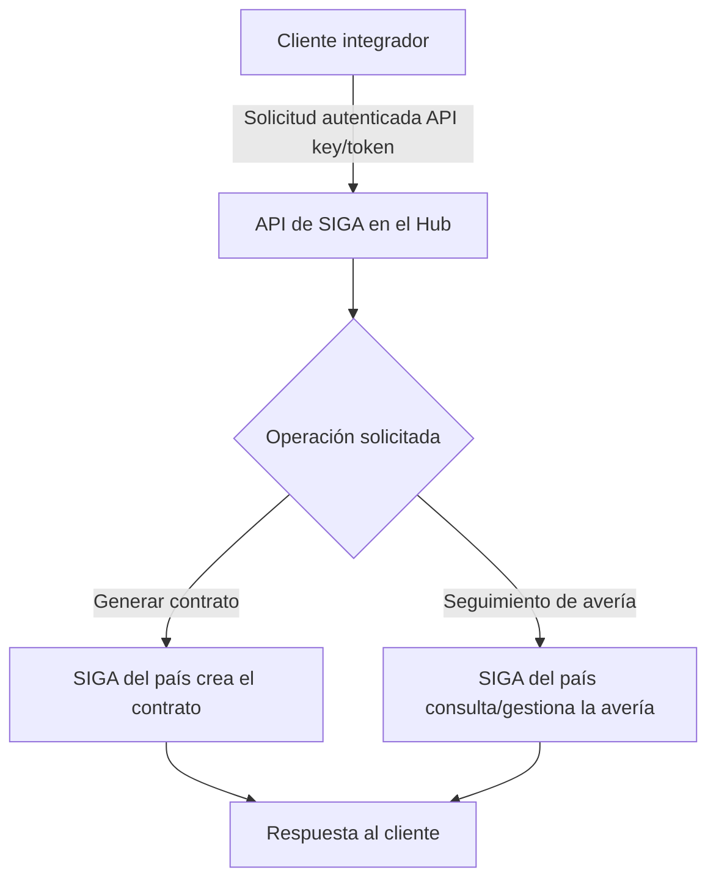

# PRD - Implementación de la API de SIGA en ambos Hubs (Chile y Colombia)

| **Campo** | **Detalle** |
| --- | --- |
| **Proyecto** | Implementación de la API de SIGA en ambos Hubs |
| **Área / empresa** | Garantiplus Chile (aplica también a Garantiplus Colombia) |
| **Versión** | v0.1 |
| **Fecha** | 2026-07-27 |
| **Autores** | Alexis Salvador Herrera Garcia |
| **Revisión / liderazgo** | Alexis Salvador Herrera Garcia |
| **Tipo de proyecto** | Integración / Migración |

## 1. Resumen ejecutivo

La **API de SIGA** permite que sistemas externos operen sobre SIGA sin usar su interfaz, principalmente para **generar contratos** y **dar seguimiento a averías**. Hoy esta API existe y opera en el Hub de México (alojada en AWS), pero **no existe en los Hubs de Chile y Colombia**, donde los clientes usan el sistema SIGA directamente.

Cada vez más clientes de Chile y Colombia solicitan **conectarse por API** en lugar de operar manualmente en SIGA. Este proyecto **replica la API de SIGA existente** hacia esos dos Hubs, buscando **paridad funcional** con la implementación ya probada en México.

El MVP consiste en **dejar la API de SIGA operativa en el Hub de Chile** (Fase 1), conectada al SIGA de ese país y con el mismo esquema de autenticación de la API original; una vez validada, se replica al Hub de Colombia (Fase 2). No se agregan funcionalidades nuevas ni se modifica la lógica de SIGA: si la API queda montada con paridad, todas sus operaciones quedan disponibles.

**Resultado esperado:** clientes de Chile y Colombia generando contratos y consultando averías vía API, con la misma capacidad que ya tienen los clientes del Hub de México.

**Cliente integrador** → **API de SIGA en el Hub** → **SIGA del país** → **Respuesta al cliente**

## 2. Contexto y problema

- **Hoy:** los clientes de Chile y Colombia operan contra el sistema **SIGA** directamente (interfaz). La capacidad de integrarse por **API** no está disponible en esos Hubs.
- **Referencia existente:** la API de SIGA ya opera en el Hub de **México** (en AWS), cubriendo generación de contratos y seguimiento de averías.
- **Dolor:** los clientes que quieren automatizar / integrar sus propios sistemas no pueden hacerlo en Chile ni Colombia; dependen del uso manual de SIGA.
- **Por qué ahora:** la conexión por API está **muy solicitada por los clientes** de esos mercados; habilitarla es una necesidad comercial.
- **Distinción de dominio:** "API de SIGA" (fachada de integración máquina-a-máquina) vs. "sistema SIGA" (aplicación que los clientes usan por interfaz). La API **no reemplaza** a SIGA: lo expone.

## 3. Objetivo del producto

Exponer la **API de SIGA** en los Hubs de Chile y Colombia para que los clientes que lo soliciten puedan **generar contratos** y **dar seguimiento a averías** por integración de API, replicando con **paridad funcional** la API ya existente en el Hub de México. Se libera primero en **Chile** (MVP) y luego en **Colombia**, sin rediseñar ni alterar la lógica de negocio de SIGA.

### 3.1 Estrategia de implementación por fases

| **Fase** | **Nombre** | **Descripción** |
| --- | --- | --- |
| Fase 1 | Hub Chile (MVP) | Implementar y dejar operativa la API de SIGA en el Hub de Chile, conectada al SIGA de Chile, con paridad respecto a la API de México. |
| Fase 2 | Hub Colombia | Replicar la implementación validada en el Hub de Colombia, conectada al SIGA de Colombia. |

**MVP de este PRD:** Fase 1 — Hub Chile.

## 4. Usuarios y actores

| **Usuario / Actor** | **Rol en el proceso** |
| --- | --- |
| Clientes integradores (Chile / Colombia) | Sistemas externos de los clientes que consumen la API para generar contratos y consultar/dar seguimiento a averías. |
| SIGA (del país) | Backend que efectivamente crea los contratos y gestiona las averías; la API es su fachada. |
| Equipo TI / Desarrollo (Alexis Salvador Herrera Garcia) | Implementa, despliega y mantiene la API en cada Hub; realiza la revisión técnica. |
| Operación / Postventa Garantiplus | Alta y soporte a los clientes que se integran por API. |

## 5. Alcance MVP y funcionalidades

| **Funcionalidad** | **Descripción** |
| --- | --- |
| API de SIGA operativa en el Hub | Implementar/desplegar la API de SIGA en el Hub de Chile con **paridad funcional** respecto a la API existente (todos sus endpoints operativos, sin cambiar la lógica). |
| Generación de contratos vía API | El cliente envía los datos y la API crea el contrato en el SIGA del país. Caso de uso núcleo. |
| Seguimiento de averías vía API | El cliente da seguimiento a averías a través de la API. Caso de uso núcleo. |
| Autenticación por cliente | Esquema de credenciales/token replicado de la API original, para que cada cliente se autentique. |
| Conexión API ↔ SIGA del país | La API queda enlazada al SIGA del Hub correspondiente (Chile en Fase 1). |

**Principio rector del MVP:** paridad exacta con la API existente. No se rediseña ni se altera la lógica de negocio de SIGA; solo se habilita el acceso por API en el nuevo Hub. Si la API queda montada con paridad, el resto de sus operaciones funciona sin describirlas una por una.

## 6. Fuera de alcance

- **Nuevas funcionalidades**: no se agregan capacidades que no existan ya en la API original; el MVP es paridad/replicación.
- **Cambios en SIGA**: no se modifica la lógica de negocio ni el sistema SIGA; solo se expone vía API.
- **Hub de Colombia en Fase 1**: queda fuera del MVP; entra en la Fase 2.
- **Onboarding masivo de clientes**: el alta e integración de todos los clientes no es parte del MVP técnico; se habilita gradualmente conforme cada cliente lo solicite.

## 7. Flujos principales

El flujo es deliberadamente simple porque la API actúa como **fachada**: recibe la solicitud autenticada del cliente, la traduce a la operación correspondiente en el SIGA del país y devuelve la respuesta. La lógica de negocio (validaciones, creación de contrato, estado de avería) permanece en SIGA; la API no decide, solo expone. Por eso la paridad con la API de México es el criterio rector: mismos endpoints, mismo comportamiento.

## 8. Requerimientos funcionales

| **ID** | **Requerimiento** | **Descripción** |
| --- | --- | --- |
| RF-01 | Generar contrato por API | Un cliente autenticado puede crear un contrato en el SIGA del Hub enviando los datos que define la API original. |
| RF-02 | Seguimiento de averías por API | Un cliente autenticado puede dar seguimiento a averías (consulta de estado y, si la API original lo permite, registro). |
| RF-03 | Paridad funcional | La API expone, con el mismo comportamiento, las operaciones de la API de SIGA ya existente en México. |
| RF-04 | Autenticación por cliente | La API autentica cada solicitud con el esquema de credenciales/token de la API original. |
| RF-05 | Conexión al SIGA del país | La API opera contra el backend de SIGA del Hub correspondiente (Chile en Fase 1, Colombia en Fase 2). |
| RF-06 | Sin operaciones nuevas | La API no expone operaciones ni datos fuera de lo que permite la API original. |

## 9. Requerimientos no funcionales

| **ID** | **Requerimiento** | **Descripción** |
| --- | --- | --- |
| RNF-01 | Seguridad | Mismo esquema de autenticación y permisos que la API original; credenciales por cliente. |
| RNF-02 | Paridad de comportamiento | Respuestas equivalentes a las de la API de México en las operaciones clave (validable). |
| RNF-03 | Disponibilidad | La API debe estar disponible acorde al nivel de servicio del Hub (SLA por definir con operación). |
| RNF-04 | Trazabilidad | Registrar solicitudes (cliente, fecha/hora, operación, resultado) para auditoría y soporte. |
| RNF-05 | Aislamiento por país | Cada Hub opera contra el SIGA de su país; sin cruce de datos entre Chile y Colombia. |
| RNF-06 | Mantenibilidad / replicabilidad | La implementación de Chile debe facilitar replicar la Fase 2 (Colombia) reutilizando lo construido. |

## 10. Integraciones y datos

| **Integración / Fuente** | **Uso esperado** |
| --- | --- |
| API de SIGA (México, en AWS) | Referencia funcional y de paridad para la replicación. |
| SIGA Chile / SIGA Colombia | Backend que ejecuta la creación de contratos y la gestión de averías por país. |
| Infraestructura del Hub (AWS) | Hospedaje de la API en cada Hub (equivalente a la de México). |

**Datos mínimos:** los que ya define la API original para generar un contrato (cliente, producto/plan, bien o vehículo, vigencia) y para dar seguimiento a una avería (identificador de contrato/avería, estado). El detalle exacto se toma de la especificación de la API existente.

**Esquema de permisos:** se **hereda** de la API existente — la API replicada respeta los mismos permisos de lectura/escritura y las mismas restricciones que ya tiene la API de México (sin ampliar accesos).

## 12. Métricas de éxito

| **Métrica** | **Descripción** |
| --- | --- |
| Contratos generados vía API | Volumen de contratos creados correctamente a través de la API en el Hub (Chile → luego Colombia). |
| Averías gestionadas vía API | Volumen de averías consultadas/gestionadas correctamente por la API. |
| Clientes integrados por API | Número de clientes conectados y operando por API (pendiente de validar línea base/meta con operación). |

## 13. Riesgos y supuestos

### Riesgos

| **Riesgo** | **Impacto potencial** |
| --- | --- |
| Diferencias entre el SIGA de cada país y el de México | Rompen la paridad y obligan a adaptaciones no previstas. |
| Dependencia de la infraestructura AWS por país | Sin el entorno listo en cada Hub, no se puede desplegar la API. |
| Gestión/entrega de credenciales a clientes | Sin un proceso claro de alta, la habilitación de clientes se retrasa. |
| Evolución de la API de México durante la replicación | Doble mantenimiento y riesgo de desincronización entre Hubs. |

### Supuestos

| **Supuesto** | **Descripción** |
| --- | --- |
| La API de México es la referencia estable | Se toma su comportamiento actual como definición de paridad. |
| Cada Hub cuenta (o contará) con su entorno de hospedaje | Chile en Fase 1, Colombia en Fase 2. |
| El SIGA de Chile y Colombia expone lo necesario | Soporta las mismas operaciones que el de México. |
| Autenticación equivalente | El esquema de credenciales/token funciona igual que en México. |

## 14. Preguntas abiertas

| **Tema** | **Pregunta abierta** |
| --- | --- |
| Averías | ¿El seguimiento por API es solo consulta o también registro/creación de averías? |
| Credenciales | ¿Quién y cómo entrega/gestiona las credenciales de API a cada cliente? |
| Paridad | ¿Hay diferencias conocidas entre el SIGA de Chile/Colombia y el de México que afecten la paridad? |
| Disponibilidad | ¿Qué SLA de disponibilidad/tiempos de respuesta debe cumplir la API en cada Hub? |
| Infraestructura | Detalle de despliegue/hospedaje por país (queda para el diseño técnico). |
