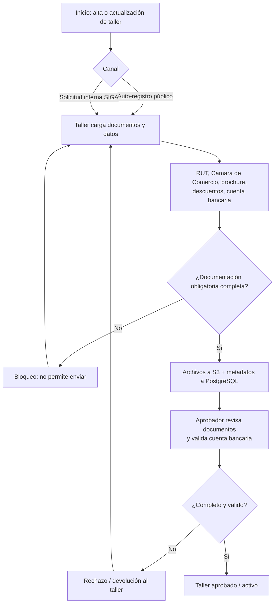

# PRD - Documentación obligatoria en el registro de talleres (SIGA)

| **Campo** | **Detalle** |
| --- | --- |
| **Proyecto** | Documentación obligatoria en el registro de talleres (SIGA) |
| **Área / empresa** | Garantiplus Colombia |
| **Versión** | v0.1 |
| **Fecha** | 2026-07-21 |
| **Autores** | Javier Oropeza |
| **Revisión / liderazgo** | Alexis Herrera (Jefe de Desarrollo) |
| **Tipo de proyecto** | Feature web/API |

## 1. Resumen ejecutivo

Este proyecto agrega a **SIGA** la exigencia de **documentación obligatoria** al registrar y actualizar un taller de la red de servicio de **Garantiplus Colombia**. Está dirigido al equipo de **administración operativa** que gestiona la red de talleres y a los **talleres (proveedores)** que se incorporan a ella.

Hoy un taller puede quedar registrado con información mínima y **sin documentación de soporte**, lo que abre la puerta a proveedores no confiables. El registro ocurre por dos caminos —**auto-registro público** y **solicitud interna en SIGA**— y en ninguno existe carga de documentos.

El MVP (alcance único) exige, en ambos caminos, cargar y validar cinco elementos: **RUT, Cámara de Comercio y brochure** (archivos) y **descuentos pactados y cuenta bancaria** (datos estructurados con archivo de soporte). Incluye el **análisis de la cuenta bancaria** dentro de este desarrollo. La documentación se exige tanto en el **alta** como al **actualizar datos sensibles**.

El resultado esperado es **reducir el riesgo de proveedores no confiables** y mejorar la calidad de la red: ningún taller queda aprobado/activo sin documentación completa y validada por el aprobador.

**Registro/actualización de taller** → **Carga de documentos obligatorios** → **Validación de obligatoriedad** → **Revisión y aprobación** → **Taller aprobado/activo**

## 2. Contexto y problema

- **Proceso actual:** un taller ingresa a la red por dos vías: (a) **auto-registro público** (el propio taller se registra) y (b) **solicitud interna en SIGA**. En ambas se captura información mínima y **no hay carga de documentos**. Existe además un **flujo de actualización de cuenta bancaria** ya operativo.
- **Dolor concreto:** al no exigirse documentación de soporte, se pueden dar de alta talleres sin validar su formalidad legal, comercial ni bancaria — riesgo de proveedores no confiables en la red de servicio.
- **Por qué ahora:** es un tema de **alta importancia** por reducción de riesgo y calidad de la red; hoy no existe ningún mecanismo de carga documental.
- **Conceptos clave del dominio:**
  - **Alta** (registro nuevo del taller) vs. **actualización** (modificación de datos, en particular la cuenta bancaria) — la exigencia documental aplica a ambos.
  - **Auto-registro público** vs. **solicitud interna en SIGA** — dos puntos de entrada que deben quedar cubiertos por igual.
  - **Documento-archivo** (RUT, Cámara de Comercio, brochure) vs. **dato estructurado con soporte** (descuentos pactados, cuenta bancaria).

## 3. Objetivo del producto

Garantizar que todo taller de la red de **Garantiplus Colombia** cuente con **documentación obligatoria cargada y validada** —RUT, Cámara de Comercio, brochure, descuentos pactados y cuenta bancaria— tanto al **registrarse** (por canal público o solicitud interna) como al **actualizar sus datos sensibles**, con el fin de **reducir el riesgo de proveedores no confiables** y elevar la calidad de la red de servicio. El alcance es **único** (sin fases) e incluye el análisis de la cuenta bancaria dentro de este desarrollo.

## 4. Usuarios y actores

| **Usuario / Actor** | **Rol en el proceso** |
| --- | --- |
| Taller (proveedor) | Se auto-registra (canal público) o es capturado por solicitud interna; **sube su propia documentación y datos** (RUT, Cámara de Comercio, brochure, descuentos, cuenta bancaria). |
| Aprobador de talleres | Rol interno único: **revisa toda la documentación, valida la cuenta bancaria y aprueba o rechaza** el taller. Lo hace todo. |
| Operador interno de SIGA | Gestiona la **solicitud interna** de taller. |
| Administración operativa / gerencia de red | Dueña del proceso; responsable de la calidad de la red de talleres. |
| TI / Desarrollo (Alexis Herrera) | Diseño técnico, construcción y soporte de la funcionalidad. |

## 5. Alcance MVP y funcionalidades

| **Funcionalidad** | **Descripción** |
| --- | --- |
| Carga documental en auto-registro público | El taller sube RUT, Cámara de Comercio y brochure (archivos) y captura descuentos pactados y cuenta bancaria (datos + archivo de soporte). |
| Carga documental en solicitud interna SIGA | Los mismos documentos y datos se cargan/gestionan en el flujo de solicitud interna. |
| Modelo de datos de documentos de taller | Nueva tabla/modelo en PostgreSQL para metadatos de cada documento (tipo, archivo, estatus, quién y cuándo). |
| Almacenamiento en S3 | Los archivos se guardan en Amazon S3; en la base de datos se guardan sus metadatos y referencia. |
| Validación de obligatoriedad | El sistema **impide enviar** el registro/solicitud si falta cualquier documento o dato obligatorio. |
| Documentación en actualización de datos sensibles | Al actualizar la cuenta bancaria (y demás datos sensibles) se exige el soporte correspondiente. |
| Flujo de aprobación | El aprobador revisa cada documento, valida la cuenta bancaria y **aprueba o rechaza** el taller. |
| Análisis de cuenta bancaria | Incluido en el alcance único (ver Preguntas abiertas para las reglas exactas del análisis). |

**Principio rector del MVP:** *un taller no puede quedar aprobado/activo sin la documentación obligatoria completa y validada.*

## 6. Fuera de alcance

- **Verificación automática de RUT / Cámara de Comercio contra fuentes oficiales:** la validación la realiza el aprobador **manualmente**; no hay integración externa automatizada. Se habilitaría si se decide invertir en una integración con las fuentes oficiales.
- **OCR / extracción automática de datos de los documentos:** no se lee el contenido de los archivos para pre-llenar campos. Requeriría un componente de OCR adicional.
- **Gestión de vencimiento / renovación de documentos:** no se controla caducidad ni recordatorios de renovación. Sería una evolución posterior.
- **Validación bancaria externa:** no se verifica la cuenta contra el banco ni una API externa; solo el análisis/revisión interna del aprobador.
- **Regularización retroactiva de talleres existentes:** la exigencia aplica **solo a nuevos registros y a actualizaciones futuras**; los talleres ya registrados no se obligan a subir documentación en este MVP.

## 7. Flujos principales

El flujo unifica los dos canales de entrada en un mismo punto de carga documental. La **validación de obligatoriedad** actúa como compuerta previa al envío (no deja avanzar sin documentación completa), y la **aprobación humana** es la segunda compuerta: el aprobador es quien finalmente valida y decide. El mismo flujo aplica al actualizar datos sensibles (p. ej. cuenta bancaria), exigiendo el soporte antes de guardar el cambio.

## 8. Requerimientos funcionales

| **ID** | **Requerimiento** | **Descripción** |
| --- | --- | --- |
| RF-01 | Carga documental en auto-registro público | El taller carga RUT, Cámara de Comercio y brochure (archivos) y captura descuentos pactados y cuenta bancaria (datos + archivo de soporte). |
| RF-02 | Carga documental en solicitud interna | Los mismos documentos/datos se cargan en el flujo de solicitud interna de SIGA. |
| RF-03 | Validación de obligatoriedad | El sistema impide finalizar/enviar el registro o solicitud si falta cualquier documento o dato obligatorio. |
| RF-04 | Almacenamiento de archivos | Los archivos se guardan en Amazon S3 y sus metadatos (tipo, referencia, estatus, autor, fecha) en PostgreSQL. |
| RF-05 | Documentación en actualización | Al actualizar la cuenta bancaria u otros datos sensibles, el sistema exige el soporte correspondiente antes de guardar. |
| RF-06 | Flujo de aprobación | El aprobador revisa cada documento, valida la cuenta bancaria y aprueba o rechaza el taller, registrando el resultado. |
| RF-07 | Estado condicionado a documentación | Ningún taller puede quedar aprobado/activo sin documentación obligatoria completa y validada. |
| RF-08 | Formatos soportados | El sistema acepta archivos PDF, JPG y PNG. |
| RF-09 | Roles diferenciados | El taller sube su documentación; el aprobador revisa, aprueba o rechaza. |
| RF-10 | Trazabilidad de la decisión | Se registra quién cargó cada documento y quién aprobó/rechazó, con fecha/hora y motivo de rechazo. |

## 9. Requerimientos no funcionales

| **ID** | **Requerimiento** | **Descripción** |
| --- | --- | --- |
| RNF-01 | Seguridad y permisos | Control de acceso por rol: el taller solo carga/ve su documentación; el aprobador puede revisar y cambiar estatus. Control de permisos estándar (sin requerimientos especiales de cifrado solicitados). |
| RNF-02 | Trazabilidad / auditabilidad | Auditoría de cargas, aprobaciones y rechazos (usuario, fecha/hora, motivo). |
| RNF-03 | Almacenamiento y consistencia | Archivos en S3 y metadatos en PostgreSQL deben mantenerse consistentes (referencia válida ↔ archivo existente). |
| RNF-04 | Manejo de errores en carga | Manejo controlado de fallos de subida (archivo corrupto, formato inválido, interrupción) con mensaje claro al usuario. |
| RNF-05 | Formatos soportados | PDF, JPG y PNG. |
| RNF-06 | Límite de tamaño de archivo | **Pendiente de definir** (hoy no hay tope establecido) — ver Preguntas abiertas. |
| RNF-07 | Disponibilidad | El canal público de carga debe estar disponible para los talleres; nivel exacto (24/7 vs. horario operativo) a confirmar. |

## 10. Integraciones y datos

| **Integración / Fuente** | **Uso esperado** |
| --- | --- |
| SIGA (registro público + solicitud interna + módulo de talleres) | Lectura/escritura del registro del taller; punto donde se insertan la carga documental y las validaciones de obligatoriedad y aprobación. |
| Amazon S3 | Escritura/lectura de los archivos de documentos del taller. |
| PostgreSQL / RDS | Nueva tabla/modelo de documentos de taller (metadatos y estatus). |

**Datos mínimos requeridos:** `taller_id`, `tipo_documento` (RUT / Cámara de Comercio / brochure / descuentos / cuenta bancaria), `archivo_ref` (URL/clave S3), `fecha_carga`, `cargado_por`, `estatus_validacion`, `aprobado_por`, `fecha_aprobacion`, `motivo_rechazo`; datos estructurados de **descuentos pactados** y de **cuenta bancaria** (p. ej. banco, número, tipo de cuenta, titular — campos exactos a definir).

**Esquema de permisos:** el **taller** puede crear y cargar su propia documentación y datos; el **aprobador** puede leer toda la documentación de un taller y cambiar su estatus (aprobar/rechazar); **queda bloqueado** activar/aprobar un taller sin documentación obligatoria completa. No hay validación automática contra fuentes externas.

## 12. Métricas de éxito

Por decisión del solicitante, **no se definen métricas cuantitativas** en este PRD. De requerirse más adelante, podrán definirse con administración operativa (p. ej. % de talleres nuevos con documentación completa, rechazos por documentación faltante).

## 13. Riesgos y supuestos

### Riesgos

| **Riesgo** | **Impacto potencial** |
| --- | --- |
| Análisis de la cuenta bancaria aún no resuelto | Puede cambiar el comportamiento/alcance de esa parte una vez definidas las reglas del análisis. |
| Talleres existentes sin documentación (no retroactivo) | Red mixta: coexisten talleres documentados (nuevos) y no documentados (previos). |
| Sin límite de tamaño de archivo definido | Costos de almacenamiento S3 no acotados y posibles cargas excesivas. |
| Datos sensibles (cuenta bancaria) sin cifrado especial | Riesgo de exposición si cambian las políticas de seguridad. |
| Validación 100% manual (sin verificación automática) | Dependencia del criterio del aprobador; riesgo de error humano o documentación fraudulenta no detectada. |

### Supuestos

| **Supuesto** | **Descripción** |
| --- | --- |
| Validación manual | El aprobador valida los documentos sin integración con fuentes oficiales. |
| Aplica solo a nuevos | La exigencia rige para nuevos registros y actualizaciones futuras; no es retroactiva. |
| Análisis bancario dentro del alcance | El "análisis pendiente" de la cuenta bancaria se resuelve dentro de este desarrollo (alcance único). |
| SIGA expone los puntos de integración | El registro público y la solicitud interna permiten insertar la carga documental y las validaciones. |
| S3 disponible | Amazon S3 es el almacenamiento definido para los archivos. |

## 14. Preguntas abiertas

| **Tema** | **Pregunta abierta** |
| --- | --- |
| Cuenta bancaria | ¿En qué consiste exactamente el "análisis para actualización" pendiente? ¿Qué reglas/validaciones debe aplicar? |
| Datos estructurados | ¿Qué campos exactos componen "descuentos pactados" y "cuenta bancaria"? |
| Límite de archivo | ¿Cuál es el tamaño máximo permitido por archivo (y formatos aceptados por tipo de documento)? |
| Disponibilidad | ¿El canal de carga debe estar 24/7 o solo en horario operativo? |
| Notificaciones | ¿Se debe notificar al taller el resultado (aprobado/rechazado)? (hoy fuera de alcance; confirmar). |
| Talleres existentes | ¿Habrá una campaña futura de regularización documental para los talleres ya registrados? |
| Retención | ¿Hay requisitos de retención/eliminación de los documentos almacenados? |
