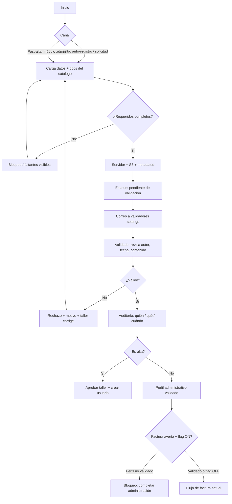

# PRD - Administración de talleres y documentación obligatoria (SIGA)

| **Campo** | **Detalle** |
| --- | --- |
| **Proyecto** | Administración de talleres y documentación obligatoria (SIGA) |
| **Área / empresa** | Garantiplus (Colombia / México — país MVP a confirmar) |
| **Versión** | v0.2 |
| **Fecha** | 2026-07-21 (v0.1) · Actualizado 2026-08-06 (v0.2) |
| **Autores** | Javier Oropeza · Addendum de alcance: Alejandro Govea Hernandez |
| **Revisión / liderazgo** | Alexis Herrera (Jefe de Desarrollo) |
| **Tipo de proyecto** | Feature web/API |

## 1. Resumen ejecutivo

Este proyecto agrega a **SIGA** un **módulo de administración del taller** y la exigencia de **documentación** (catálogo configurable, requerido u opcional) tanto en el **alta** como en la **actualización** de datos del taller. Está dirigido a la **administración operativa** que gestiona la red de talleres, a los **talleres (proveedores)** que se incorporan o ya operan en ella, y a **validadores internos** que revisan la veracidad de la información y documentos.

Hoy un taller puede quedar registrado con información mínima y **sin documentación de soporte**. Tras la aprobación se crea el taller y un usuario con rol `Taller`, que puede operar averías, pero **no existe un área administrativa** donde el taller gestione su expediente (datos fiscales/bancarios y documentos) ni un flujo de validación posterior.

El MVP exige:

1. **Documentación en el alta** (auto-registro público y solicitud interna), según un **catálogo** de documentos requeridos/opcionales.
2. Un **módulo de administración** post-alta donde el taller actualice datos (`nombre_taller`, `rfc`, `cp`, `municipio`, `colonia`, `direccion`, `telefonos`, `observaciones`, CLABE/`iban`, `banco`, `sucursal`, número de cuenta) y suba documentos.
3. Un **flujo de validación**: al subir o actualizar información, el taller queda en estatus de validación y se notifica por correo a uno o varios validadores definidos en settings; se audita quién validó qué y cuándo; el validador ve quién cargó/cambió y cuándo.
4. **Roles diferenciados** vinculados a un solo taller: `Taller-Administracion` (admin + ver averías sin mutar) y `Taller-Averias` (crear/seguimiento de averías, sin admin).
5. **Compuerta configurable** al subir factura de avería para pago: si el taller no tiene información/documentos validados, se le pide completar la administración primero (habilitable desde settings).
6. **Almacenamiento dual** (servidor + bucket S3), con `uri` en metadatos y descarga con fallback.

El resultado esperado es **reducir el riesgo de proveedores no confiables**, mejorar la calidad de la red y dar a los talleres un expediente administrativo trazable y validado.

**Alta / actualización** → **Carga de datos y documentos** → **Validación de obligatoriedad** → **Revisión por validador** → **Taller / perfil validado** → (opcional) **Compuerta en factura de avería**

## 2. Contexto y problema

- **Proceso actual:** el taller ingresa por (a) **auto-registro público** o (b) **solicitud interna en SIGA**. Si se aprueba, se crea el registro de taller y un usuario con rol `Taller`. Ese usuario puede consultar, crear y dar seguimiento a averías. Existe actualización de cuenta bancaria operativa, pero **sin archivo de soporte ni flujo de validación documental**.
- **Dolor concreto:** no hay carga documental obligatoria en el alta, no hay módulo donde el taller administre su expediente, no hay validadores notificados ni auditoría de validación, y se pueden pagar facturas de avería aunque el taller no tenga datos/documentos validados.
- **Por qué ahora:** alta importancia por reducción de riesgo y calidad de la red; el addendum de alcance (2026-08-06) amplía el PRD v0.1 de “docs en el alta” a **administración continua del taller**.
- **Conceptos clave:**
  - **Alta** vs. **administración post-alta** (módulo nuevo).
  - **Catálogo de documentos** (requerido/opcional) vs. lista fija hardcodeada.
  - **Validador** (interno, settings) vs. aprobador de alta de taller (pueden solaparse según operación).
  - **Roles** `Taller-Administracion` / `Taller-Averias` / legacy `Taller`.

## 3. Objetivo del producto

Garantizar que los talleres de la red de **Garantiplus** cuenten con **información administrativa y documentación cargada y validada** —tanto al registrarse como al actualizar su expediente— mediante un **módulo de administración**, un **catálogo de documentos**, un **flujo de validación auditado** y, de forma configurable, una **compuerta al subir factura de avería**, con el fin de **reducir el riesgo de proveedores no confiables** y elevar la calidad de la red de servicio.

## 4. Usuarios y actores

| **Usuario / Actor** | **Rol en el proceso** |
| --- | --- |
| Taller (rol legacy `Taller`) | Tras el alta puede operar averías; con el cambio, también accede a la administración del taller (según decisión de convivencia con roles nuevos). |
| Usuario `Taller-Administracion` | Vinculado a un solo taller: administra datos y documentos; ve listado y detalle de averías **sin** poder actuar sobre ellas. |
| Usuario `Taller-Averias` | Vinculado a un solo taller: crea averías y da seguimiento; **sin** acceso al módulo de administración. |
| Validador(es) interno(s) | Definidos en settings (uno o varios): reciben correo al haber cambios; revisan y aprueban/rechazan documentos e información; quedan registrados en la auditoría. |
| Aprobador de talleres | Revisa la solicitud de alta (incluye documentación del catálogo) y aprueba o rechaza el alta del taller. |
| Operador interno de SIGA | Gestiona la solicitud interna de taller. |
| Administración operativa / gerencia de red | Dueña del proceso; responsable de la calidad de la red. |
| TI / Desarrollo | Diseño técnico, construcción y soporte. |

## 5. Alcance MVP y funcionalidades

| **Funcionalidad** | **Descripción** |
| --- | --- |
| Alta con documentación (catálogo) | En auto-registro público y solicitud interna se cargan los documentos definidos en el catálogo (requeridos/opcionales) y los datos administrativos/bancarios aplicables. |
| Creación de taller y usuario al aprobar | Se mantiene el comportamiento actual: al aprobar se crea el taller y el usuario (rol a acordar: `Taller` y/o roles nuevos). |
| Catálogo de documentos | Tabla que define qué documentos se solicitan al taller e indica si cada uno es **requerido** u **opcional**. |
| Módulo de administración del taller | Pantalla nueva donde el taller gestiona: `nombre_taller`, `rfc`, `cp`, `municipio`, `colonia`, `direccion`, `telefonos`, `observaciones`, CLABE/`iban`, `banco`, `sucursal`, número de cuenta, y sus documentos. |
| UI de completitud | El taller ve de forma clara: documentos subidos, estatus de validación y faltantes (documentos e información). |
| Flujo de validación post-cambio | Al subir o actualizar información/documentos, el taller queda en estatus de validación y se envía correo a los validadores configurados. |
| Auditoría de validación | Se guarda quién validó, qué documento/información validó y la fecha/hora. El validador ve quién subió o cambió y cuándo. |
| Almacenamiento dual | Archivos en servidor y en bucket (patrón contratos); ruta base en settings; campo `uri` por archivo. |
| Descarga de documentos | Desde servidor o bucket; si no está en ninguno, mensaje de que el documento no se encuentra. |
| Roles `Taller-Administracion` y `Taller-Averias` | Permisos diferenciados como se describe en §4; usuarios vinculados a un solo taller. |
| Compuerta en factura de avería | Si el taller no tiene información/documentos validados al subir factura para pago, se le solicita completar y validar su administración. **Configurable en settings** (habilitar/deshabilitar). |
| Guardarraíl de aprobación de alta | Ningún taller nuevo queda aprobado/activo sin la documentación **requerida** del catálogo completa y validada (país objetivo). |

**Principio rector del MVP:** *un taller no puede quedar aprobado/activo sin la documentación requerida validada; y, si la compuerta de factura está activa, no puede cobrar vía factura de avería con expediente incompleto o no validado.*

## 6. Fuera de alcance

- **Verificación automática de documentos contra fuentes oficiales** (RUT, RFC, Cámara de Comercio, etc.): la validación la realiza el validador/aprobador manualmente.
- **OCR / extracción automática** de datos desde los archivos.
- **Gestión de vencimiento / renovación** automática de documentos.
- **Validación bancaria externa** contra el banco o APIs de terceros.
- **Regularización masiva retroactiva** de talleres existentes: no se obliga a todos a subir documentación de golpe; el módulo admin permite completar de forma voluntaria y la compuerta de factura puede forzarlos si el flag está activo.
- **Administración del catálogo de documentos vía UI avanzada** (CRUD completo de tipos): puede diferirse; el MVP puede seedear el catálogo por script/SQL.

## 7. Flujos principales

```mermaid
flowchart TD
    A[Inicio] --> B{Canal}
    B -->|Alta: auto-registro / solicitud| C[Carga datos + docs del catálogo]
    B -->|Post-alta: módulo admin| C
    C --> D{¿Requeridos completos?}
    D -->|No| E[Bloqueo / faltantes visibles]
    E --> C
    D -->|Sí| F[Servidor + S3 + metadatos]
    F --> G[Estatus: pendiente de validación]
    G --> H[Correo a validadores settings]
    H --> I[Validador revisa autor, fecha, contenido]
    I --> J{¿Válido?}
    J -->|No| K[Rechazo + motivo + taller corrige]
    K --> C
    J -->|Sí| L[Auditoría: quién / qué / cuándo]
    L --> M{¿Es alta?}
    M -->|Sí| N[Aprobar taller + crear usuario]
    M -->|No| O[Perfil administrativo validado]
    O --> P{Factura avería + flag ON?}
    P -->|Perfil no validado| Q[Bloqueo: completar administración]
    P -->|Validado o flag OFF| R[Flujo de factura actual]
```

## 8. Requerimientos funcionales

| **ID** | **Requerimiento** | **Descripción** |
| --- | --- | --- |
| RF-01 | Carga documental en auto-registro público | El taller carga los documentos del catálogo y los datos administrativos/bancarios aplicables. |
| RF-02 | Carga documental en solicitud interna | Los mismos documentos/datos se cargan en el flujo de solicitud interna de SIGA. |
| RF-03 | Validación de obligatoriedad | El sistema impide finalizar/enviar si falta cualquier documento o dato **requerido**. |
| RF-04 | Catálogo de documentos | Existe una tabla/catálogo que define documentos solicitados e indica si son requeridos u opcionales. |
| RF-05 | Almacenamiento dual | Los archivos se guardan en servidor y bucket; metadatos en PostgreSQL incluyen `uri` y referencia para descarga. |
| RF-06 | Descarga de documentos | La descarga intenta servidor y/o bucket; si no existe, se informa que el documento no se encuentra. |
| RF-07 | Módulo de administración del taller | El taller (según rol) edita los campos administrativos definidos y gestiona documentos. |
| RF-08 | UI de completitud | Vista clara de documentos subidos, estatus de validación y faltantes (docs e información). |
| RF-09 | Estatus de validación al cambiar | Al subir/actualizar información o documentos, el expediente queda en validación y se notifica a validadores (settings, 1..N). |
| RF-10 | Auditoría de validación | Se registra quién validó, qué validó y fecha/hora; el validador ve autor y fecha de la carga/cambio. |
| RF-11 | Flujo de aprobación de alta | El aprobador revisa documentación y datos; no se activa el taller sin docs requeridos validados. |
| RF-12 | Creación de usuario al aprobar | Al aprobar el alta se crea el usuario vinculado al taller (comportamiento actual, extendido con roles nuevos según acuerdo). |
| RF-13 | Rol `Taller-Administracion` | Acceso al módulo admin; listado y detalle de averías en solo lectura. |
| RF-14 | Rol `Taller-Averias` | Crear y dar seguimiento a averías; sin acceso al módulo de administración. |
| RF-15 | Compuerta configurable en factura | Si el flag de settings está activo y el taller no tiene información/documentos validados, se bloquea la carga de factura de pago y se orienta a completar la administración. |
| RF-16 | Formatos soportados | PDF, JPG y PNG. |
| RF-17 | Trazabilidad de cargas | Se registra quién cargó cada documento y cuándo. |

## 9. Requerimientos no funcionales

| **ID** | **Requerimiento** | **Descripción** |
| --- | --- | --- |
| RNF-01 | Seguridad y permisos | Control por rol y vínculo a un solo taller; validadores solo mutan estatus de validación. |
| RNF-02 | Trazabilidad / auditabilidad | Auditoría de cargas, cambios, aprobaciones y rechazos (usuario, fecha/hora, motivo). |
| RNF-03 | Almacenamiento y consistencia | Archivo en servidor y/o S3 coherente con metadatos (`uri`). |
| RNF-04 | Manejo de errores en carga/descarga | Fallos de subida o archivo inexistente con mensaje claro en español. |
| RNF-05 | Formatos soportados | PDF, JPG y PNG. |
| RNF-06 | Límite de tamaño de archivo | **Pendiente de definir** (propuesta técnica: 5 MB) — ver Preguntas abiertas. |
| RNF-07 | Configuración externa | Validadores, ruta base de archivos, prefijo S3 y flag de compuerta de factura viven en settings (no hardcode). |
| RNF-08 | Disponibilidad | Canal de carga disponible para talleres; nivel exacto (24/7 vs. horario) a confirmar. |

## 10. Integraciones y datos

| **Integración / Fuente** | **Uso esperado** |
| --- | --- |
| SIGA (registro público, solicitud, averías, nuevo módulo admin) | Lectura/escritura del taller; carga documental; validación; compuerta de factura. |
| Amazon S3 + filesystem local | Escritura/lectura de documentos del taller (patrón contratos). |
| PostgreSQL / RDS | Catálogo de tipos, metadatos de documentos, bitácora de validación, roles Identity. |
| Correo (`IEmailSender`) | Notificación a validadores al haber cambios pendientes. |

**Datos mínimos:**

- Catálogo: `tipo_documento`, `requerido`, `activo`, (opcional) país.
- Documento: `taller_id` / `solicitud_id`, `tipo_documento`, `uri`, ruta local, `fecha_carga`, `cargado_por`, `estatus_validacion`, `validado_por`, `fecha_validacion`, `motivo_rechazo`.
- Administrativos: `nombre_taller`, `rfc`, `cp`, `municipio`, `colonia`, `direccion`, `telefonos`, `observaciones`, CLABE/`iban`, `banco`, `sucursal`, número de cuenta.
- Settings: lista de validadores, ruta base, prefijo S3, flag `EnforceValidatedProfileOnInvoice`.

## 11. Métricas de éxito

Por decisión del solicitante en v0.1, **no se definen métricas cuantitativas**. De requerirse, podrán definirse con administración operativa (p. ej. % de talleres con expediente validado, bloqueos de factura por perfil incompleto).

## 12. Riesgos y supuestos

### Riesgos

| **Riesgo** | **Impacto potencial** |
| --- | --- |
| País MVP no cerrado (COL vs MX vs ambos) | Puede cambiar el seed del catálogo y las validaciones de campos. |
| Convivencia del rol `Taller` con roles nuevos | Riesgo de menús/autorizaciones rotas si no se define la matriz de permisos. |
| Análisis de cuenta bancaria aún no resuelto | Puede cambiar el comportamiento de esa parte. |
| Compuerta de factura activada de forma prematura | Puede bloquear operación real de talleres sin expediente validado. |
| Talleres existentes sin documentación | Red mixta; la compuerta puede forzar regularización gradual. |
| Sin límite de tamaño de archivo definido | Costos de almacenamiento no acotados. |
| Validación 100% manual | Dependencia del criterio del validador; riesgo de error humano. |

### Supuestos

| **Supuesto** | **Descripción** |
| --- | --- |
| Validación manual | El validador/aprobador valida sin integración con fuentes oficiales. |
| No hay regularización masiva | La exigencia rige para nuevos registros y actualizaciones; históricos vía módulo admin y/o flag de factura. |
| Storage dual disponible | Mismo patrón operativo que contratos (servidor + bucket). |
| Settings operables por ambiente | Validadores y flags se configuran sin redeploy de código de negocio (appsettings / secrets). |

## 13. Preguntas abiertas

| **Tema** | **Pregunta abierta** |
| --- | --- |
| País MVP | ¿El alcance v0.2 aplica a Colombia, México o ambos? ¿El catálogo es por país? |
| Cuenta bancaria | ¿En qué consiste exactamente el "análisis" pendiente? ¿Qué valida el sistema vs. el validador? |
| Descuentos pactados (v0.1) | ¿Siguen en el MVP como dato estructurado o se modelan como tipo de documento/dato del catálogo? |
| Rol `Taller` legacy | ¿Convive con acceso completo (admin+averías), se migra a los roles nuevos, o se depreca? |
| Nombres de roles | Confirmar casing exacto en Identity (`Taller-Administracion`, `Taller-Averias`, etc.). |
| Límite de archivo | ¿Tamaño máximo por archivo? |
| Flag de factura | ¿Default en QA/Prod del flag de compuerta al subir factura? |
| Disponibilidad | ¿Canal de carga 24/7 o solo horario operativo? |
| Notificaciones al taller | ¿Se notifica al taller el resultado (aprobado/rechazado) además del correo a validadores? |
| Talleres existentes | ¿Habrá campaña futura de regularización documental? |
| Retención | ¿Requisitos de retención/eliminación de documentos almacenados? |
| API Workshops | ¿El canal API de Claims/Workshops exige docs en el MVP? |

---

### Historial de versiones

| Versión | Fecha | Cambio |
| --- | --- | --- |
| v0.1 | 2026-07-21 | Alcance inicial: documentación obligatoria en alta (RUT, Cámara, brochure, descuentos, cuenta bancaria) — Colombia. |
| v0.2 | 2026-08-06 | Addendum: módulo admin, catálogo requerido/opcional, validadores + correo, auditoría, roles nuevos, storage dual, compuerta factura configurable. |
