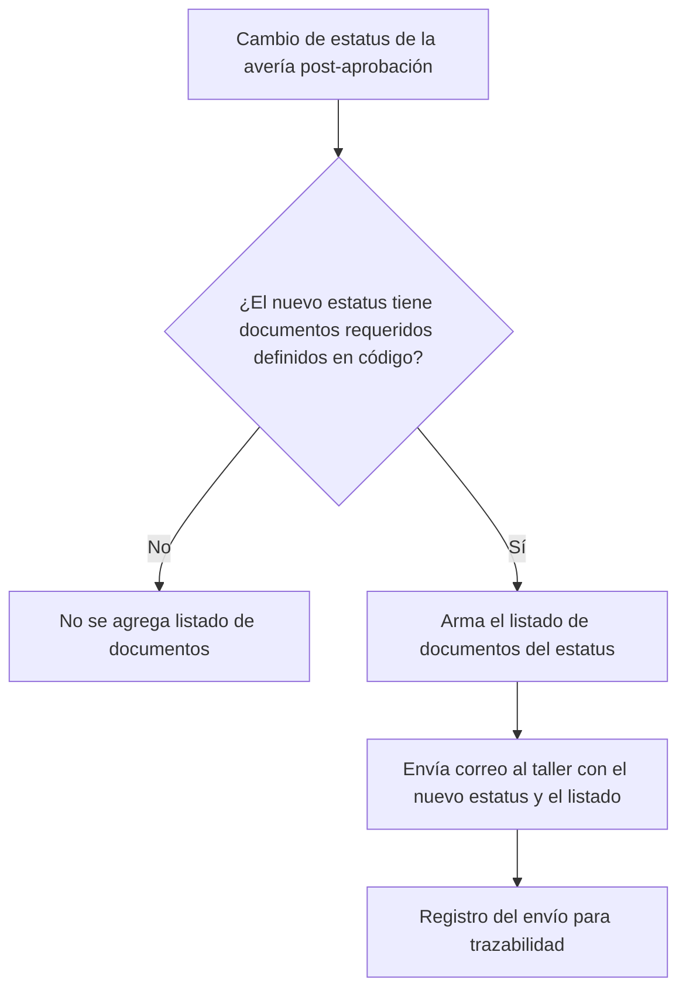

# PRD - Documentos Obligatorios Posteriores a la Aprobación de la Avería

| **Campo** | **Detalle** |
| --- | --- |
| **Proyecto** | Documentos Obligatorios Posteriores a la Aprobación de la Avería (PV-24) |
| **Área / empresa** | Garantiplus México (aplica a todos los países de Garantiplus) |
| **Versión** | v0.1 |
| **Fecha** | 2026-07-23 |
| **Autores** | Operaciones / Averías (solicitante) |
| **Revisión / liderazgo** | Alexis Salvador Herrera García (alexis.herrera@gplusseguros.mx) |
| **Tipo de proyecto** | Feature web / API (SIGA) |

## 1. Resumen ejecutivo

Hoy, una vez que se aprueba una avería, el taller no tiene claridad sobre **qué documentos obligatorios** debe entregar en cada estatus posterior del proceso. Esa falta de claridad genera idas y vueltas, documentación incompleta y **demoras en el pago**.

Este proyecto aprovecha la notificación por cambio de estatus que SIGA ya envía al taller para **incluir, en cada estatus posterior a la aprobación que lo requiera, el listado de documentos necesarios** para avanzar. La definición de qué documentos exige cada estatus **ya existe en el código** de SIGA; el desarrollo la expone en el correo al taller.

El MVP se limita a **notificar** (informar el listado); no incluye recepción, adjuntos ni validación de los documentos. La notificación se dispara **solo en los estatus que tienen documentos requeridos definidos**. La solución **aplica a todos los países de Garantiplus**.

Resultado esperado: reducir demoras en pago, mejorar la claridad del proceso para el taller y la eficiencia operativa.

**Cambio de estatus (post-aprobación)** → **¿el estatus requiere documentos?** → **arma listado desde la definición del código** → **envía correo al taller con el listado**

## 2. Contexto y problema

- **Hoy:** SIGA ya envía correos al taller ante cambios de estatus de la avería, pero **sin** indicar los documentos obligatorios del nuevo estatus. El taller descubre los requisitos de forma reactiva.
- **Dolor:** no hay claridad sobre los documentos obligatorios posteriores a la aprobación → documentación incompleta/tardía → **demoras en el pago** y fricción con el taller.
- **Por qué ahora:** mejora de eficiencia operativa y fidelización; se puede resolver reutilizando la notificación existente y la definición de documentos que ya vive en el código.
- **Distinción de dominio:** el alcance es **posterior a la aprobación** de la avería (estatus del proceso una vez aprobada), no la etapa de diagnóstico/aprobación.

## 3. Objetivo del producto

Dar al taller **claridad oportuna** sobre los documentos obligatorios que debe entregar en cada estatus posterior a la aprobación de la avería, informándolos automáticamente en el correo de cambio de estatus, para **reducir demoras en el pago** y reprocesos por documentación faltante. La solución se concibe para **todos los países de Garantiplus** (Chile, Colombia y México).

## 4. Usuarios y actores

| **Usuario / Actor** | **Rol en el proceso** |
| --- | --- |
| Taller | Destinatario del correo; recibe el listado de documentos requeridos y los entrega. |
| Operaciones / Averías | Solicitante; dueño del proceso de averías y de la definición de documentos requeridos. |
| SIGA (proceso de averías) | Sistema donde ocurre el cambio de estatus y donde están definidos los documentos por estatus. |
| TI / Desarrollo | Implementa y mantiene la lógica y el envío del correo. |

## 5. Alcance MVP y funcionalidades

| **Funcionalidad** | **Descripción** |
| --- | --- |
| Detección de cambio de estatus post-aprobación | Al registrarse un cambio de estatus posterior a la aprobación de la avería, el sistema evalúa el nuevo estatus. |
| Resolución de documentos requeridos | Obtiene, desde la definición **existente en el código** de SIGA, la lista de documentos obligatorios del nuevo estatus. |
| Notificación al taller con listado | Si el estatus tiene documentos requeridos, envía correo al taller indicando el nuevo estatus y el listado de documentos necesarios. |
| Reutilización del correo de cambio de estatus | Se apoya en el mecanismo de correo por cambio de estatus que SIGA ya usa (`NotificaCambioEstatus`), sujeto a verificación de que sirva para este fin. |

**Principio rector del MVP:** el sistema **solo informa**. No recibe, adjunta ni valida documentos, y no bloquea el avance del proceso. Solo se notifica en los estatus que **sí** tienen documentos requeridos definidos. Aplica a todos los países de Garantiplus.

## 6. Fuera de alcance

- **Recepción / carga de documentos por el taller:** el MVP solo lista; habilitar carga requeriría un módulo de gestión documental.
- **Validación de documentos entregados:** no se verifica que el taller haya subido lo pedido; sería una fase posterior.
- **Adjuntos, plantillas o enlaces de cada documento:** solo se enumeran por nombre.
- **Estatus previos/durante la aprobación:** el alcance es exclusivamente post-aprobación.
- **Rediseño del mecanismo de correo:** se reutiliza el existente; crear uno nuevo solo si la verificación indica que el actual no sirve.

## 7. Flujos principales

El disparador es el **cambio de estatus** de una avería ya aprobada. La decisión clave es si el nuevo estatus tiene documentos obligatorios definidos; solo en ese caso se arma el listado y se envía al taller, reutilizando el correo de cambio de estatus de SIGA.

## 8. Requerimientos funcionales

| **ID** | **Requerimiento** | **Descripción** |
| --- | --- | --- |
| RF-01 | Detectar cambio de estatus post-aprobación | Al registrarse un cambio de estatus posterior a la aprobación de una avería, el sistema evalúa el nuevo estatus. |
| RF-02 | Resolver documentos requeridos por estatus | Obtiene la lista de documentos obligatorios del nuevo estatus desde la definición existente en el código de SIGA. |
| RF-03 | Notificar al taller con el listado | Si el estatus tiene documentos requeridos, envía correo al taller indicando el nuevo estatus y el listado de documentos necesarios. |
| RF-04 | Dirigir el correo al taller de la avería | El correo se envía al taller asociado a la avería. |
| RF-05 | Omitir cuando no hay documentos | Si el nuevo estatus no tiene documentos requeridos, no se agrega listado ni se genera la notificación de documentos. |

## 9. Requerimientos no funcionales

| **ID** | **Requerimiento** | **Descripción** |
| --- | --- | --- |
| RNF-01 | Trazabilidad | Registrar el envío de la notificación (avería, estatus, taller, fecha/hora, resultado del envío). |
| RNF-02 | Manejo de errores | Un fallo en el envío del correo no debe bloquear el cambio de estatus; se registra y, si aplica, se reintenta. |
| RNF-03 | Reutilización / mantenibilidad | Reutilizar el mecanismo de correo existente de SIGA; la lista de documentos por estatus debe permanecer mantenible. |
| RNF-04 | Seguridad y datos | Usar el canal de correo existente; no exponer datos sensibles más allá de lo necesario para el taller. |
| RNF-05 | Compatibilidad multi-país | La solución debe operar para todos los países de Garantiplus (Chile, Colombia y México). |

## 10. Integraciones y datos

| **Integración / Fuente** | **Uso esperado** |
| --- | --- |
| SIGA — proceso de averías | Lectura del cambio de estatus y del estatus nuevo; origen del evento. |
| Definición de documentos por estatus (código SIGA) | Lectura de la lista de documentos obligatorios de cada estatus. |
| Correo de cambio de estatus (`NotificaCambioEstatus`) | Envío del correo al taller (sujeto a verificación de idoneidad). |

**Datos mínimos:** avería (identificador, estatus actual y nuevo), taller (identificador, correo de contacto), catálogo/definición de documentos requeridos por estatus.

**Permisos:** el sistema **lee** estatus y definición de documentos y **envía** correo; **no escribe** sobre el proceso de la avería ni recibe documentos.

## 11. Métricas de éxito

| **Métrica** | **Descripción** |
| --- | --- |
| Demora en pago post-aprobación | Tiempo entre aprobación y pago; se espera reducirlo (línea base pendiente con operación/BI). |
| Cobertura de notificación | % de cambios de estatus con documentos requeridos que generaron correo al taller. |
| Reprocesos por documentación faltante | Reducción de solicitudes/rechazos por documentos incompletos (pendiente de validar con operación). |

## 12. Riesgos y supuestos

### Riesgos

| **Riesgo** | **Impacto potencial** |
| --- | --- |
| El mecanismo actual de correo no sirva para este fin | Retrabajo: habría que crear o adaptar un nuevo mecanismo de notificación. |
| Definición de documentos en código incompleta o desactualizada | El taller recibiría un listado incorrecto; erosiona confianza y no resuelve el problema. |
| Correo del taller desactualizado o ausente en SIGA | La notificación no llega; el taller sigue sin claridad. |
| Exceso de correos por muchos cambios de estatus | Fatiga de notificaciones; el taller ignora los correos. |

### Supuestos

| **Supuesto** | **Descripción** |
| --- | --- |
| Existe notificación por cambio de estatus operativa en SIGA | Se asume reutilizable para incluir el listado de documentos. |
| Documentos definidos correctamente en el código | Se asume que la definición por estatus refleja lo que operación considera obligatorio. |
| Cada avería tiene un taller con correo válido | Necesario para entregar la notificación. |
| Los estatus post-aprobación están claramente delimitados | Necesario para saber cuándo aplica la notificación. |

## 14. Preguntas abiertas

| **Tema** | **Pregunta abierta** |
| --- | --- |
| Mecanismo de correo | ¿El mecanismo actual (`NotificaCambioEstatus`) es reutilizable para este fin o hay que crear/adaptar uno? |
| Documentos por estatus | ¿Cuáles son exactamente los estatus post-aprobación y qué documentos exige cada uno? ¿La definición en código está validada con operación? |
| Formato del correo | ¿Plantilla, remitente, idioma y formato del listado de documentos? |
