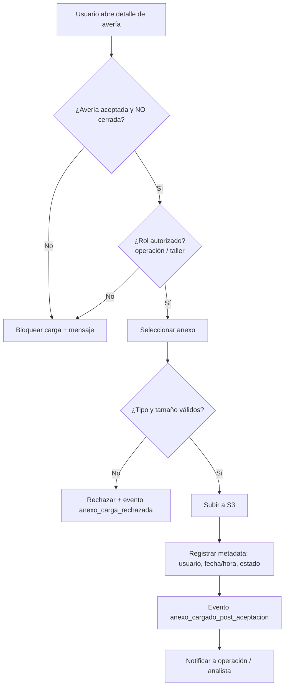

# PRD - Carga de anexos posterior a la aceptación

| **Campo** | **Detalle** |
| --- | --- |
| **Proyecto** | Carga de anexos posterior a la aceptación |
| **Área / empresa** | Garantiplus México |
| **Versión** | v0.1 |
| **Fecha** | 2026-07-13 |
| **Autores** | Alejandro Govea (por completar) |
| **Revisión / liderazgo** | Aldo Álvarez (Director de TI) — *por confirmar* |
| **Tipo de proyecto** | Feature web/API |

## 1. Resumen ejecutivo

El módulo **Seguimiento de Averías** de SIGA permite hoy adjuntar **anexos** (imágenes, documentos, evidencias) a una avería, pero solo en **ciertos momentos del proceso**: una vez que la avería es **aceptada**, la posibilidad de seguir cargando evidencia queda restringida. Esto genera fricción para el equipo de **operación/postventa**, que necesita incorporar documentación que llega **después** de la aceptación (facturas finales, fotos de la reparación, dictámenes del taller).

Este proyecto habilita la **carga de anexos en cualquier momento posterior a la aceptación** de la avería, **hasta su cierre**, conservando el mismo almacenamiento actual (**S3**) y agregando **control por rol, trazabilidad y notificación** de cada carga.

El MVP se enfoca en levantar la restricción temporal de forma controlada: quién puede cargar, en qué estados, con qué registro y a quién se avisa. Es de **alcance único** (sin fases posteriores planeadas).

Resultado esperado: expedientes de avería más completos, menos quejas de operación y mejor trazabilidad de la evidencia.

**Avería aceptada** → **usuario autorizado adjunta anexo** → **validación (tipo/estado/rol)** → **guardado en S3 + trazabilidad** → **notificación**

## 2. Contexto y problema

- **Hoy:** en Seguimiento de Averías se pueden cargar anexos, pero la carga está **limitada a ciertos momentos del proceso**; tras la aceptación, la evidencia adicional ya no puede adjuntarse (o no de forma normal).
- **Dolor concreto:** operación/postventa recibe documentación relevante **después** de aceptar la avería y no tiene dónde registrarla dentro del caso → pérdida de trazabilidad y trabajo por fuera del sistema. **Driver:** queja recurrente de operación/postventa.
- **Por qué ahora:** eliminar esa fricción operativa y mantener el expediente completo dentro de SIGA.
- **Concepto de dominio:** *avería* = siniestro/reclamo de garantía gestionado en el módulo Seguimiento de Averías. *Aceptación* = punto del flujo en que la avería queda autorizada; *cierre* = fin del ciclo de la avería.

## 3. Objetivo del producto

Permitir que los roles autorizados (**operación/postventa** y **taller**) adjunten anexos a una avería en **cualquier estado posterior a la aceptación y anterior al cierre**, reutilizando el almacenamiento en S3 y registrando trazabilidad y notificación de cada carga, para mantener el expediente completo y reducir la operación fuera del sistema.

## 4. Usuarios y actores

| **Usuario / Actor** | **Rol en el proceso** |
| --- | --- |
| Operación / postventa | Da seguimiento a la avería y carga anexos posteriores a la aceptación. |
| Taller | Aporta evidencia de la reparación (fotos, facturas, dictámenes) tras la aceptación. |
| Analista de garantías | Receptor de la notificación; revisa la evidencia incorporada. |
| TI (Engine) | Define almacenamiento, permisos y disponibilidad. |

## 5. Alcance MVP y funcionalidades

| **Funcionalidad** | **Descripción** |
| --- | --- |
| Carga posterior a la aceptación | Adjuntar uno o más anexos a una avería en cualquier estado posterior a la aceptación y anterior al cierre. |
| Validación de archivo | Aceptar imágenes (JPG/PNG), PDF, Office (Word/Excel) y video; validar tipo y tamaño (límite por definir). |
| Almacenamiento en S3 | Guardar el binario en S3 (mismo esquema actual) y su referencia asociada a la avería. |
| Trazabilidad por anexo | Registrar usuario, fecha/hora y estado de la avería al momento de cada carga. |
| Control por rol | Permitir la carga solo a operación/postventa y taller autorizados. |
| Notificación | Avisar a operación/analista de garantías cuando se carga un anexo posterior a la aceptación. |
| Bloqueo tras cierre | Impedir la carga cuando la avería está cerrada, con mensaje claro. |
| Visualización de anexos | Listar los anexos con su metadata en el detalle de la avería. |

**Principio rector del MVP:** levantar la restricción temporal **sin perder control** — toda carga posterior queda trazada, restringida por rol y acotada al periodo aceptación→cierre.

## 6. Fuera de alcance

- **Edición/eliminación de anexos ya cargados:** el MVP solo agrega; gestionar borrado requiere reglas de auditoría propias.
- **Carga después del cierre de la avería:** se decidió limitar hasta el cierre; habilitarlo requeriría política de reapertura.
- **Carga por el cliente final:** no se incluye como actor en esta versión.
- **Rediseño del visor/galería de anexos:** se reutiliza la visualización existente.
- **Migración de anexos históricos:** no aplica; solo cargas nuevas.

## 7. Flujos principales

El flujo protege dos condiciones antes de permitir la carga: el **estado** de la avería (aceptada y no cerrada) y el **rol** del usuario. Solo después valida el archivo, lo persiste en S3, deja la trazabilidad y dispara la notificación. Los rechazos también se registran para medir fricción.

## 8. Requerimientos funcionales

| **ID** | **Requerimiento** | **Descripción** |
| --- | --- | --- |
| RF-01 | Carga posterior a la aceptación | Adjuntar uno o más anexos a una avería en cualquier estado posterior a la aceptación y anterior al cierre. |
| RF-02 | Validación de tipo/tamaño | Aceptar JPG, PNG, PDF, Word, Excel y video; rechazar lo demás y lo que exceda el tamaño máximo (por definir). |
| RF-03 | Almacenamiento en S3 | Persistir el binario en S3 (esquema actual) y guardar su referencia ligada a la avería. |
| RF-04 | Trazabilidad por anexo | Registrar usuario, fecha/hora y estado de la avería al momento de la carga. |
| RF-05 | Control por rol | Permitir cargar solo a operación/postventa y taller autorizados. |
| RF-06 | Notificación de carga | Notificar a operación/analista de garantías al cargarse un anexo posterior a la aceptación. |
| RF-07 | Bloqueo tras cierre | Impedir la carga si la avería está cerrada, mostrando mensaje explicativo. |
| RF-08 | Listado de anexos | Mostrar los anexos con su metadata en el detalle de la avería. |

## 9. Requerimientos no funcionales

| **ID** | **Requerimiento** | **Descripción** |
| --- | --- | --- |
| RNF-01 | Seguridad de acceso | Control por rol; archivos en S3 con las mismas políticas de acceso restringido vigentes. |
| RNF-02 | Trazabilidad/auditabilidad | Bitácora consultable e inmutable de cada carga (quién, cuándo, estado). |
| RNF-03 | Manejo de errores | Validación con mensajes claros; carga atómica (si falla S3 no queda referencia huérfana). |
| RNF-04 | Disponibilidad | Disponible en el horario operativo de SIGA (¿24/7? por confirmar). |
| RNF-05 | Escalabilidad / costo | El video incrementa el almacenamiento S3; monitorear impacto de costo. |
| RNF-06 | Experiencia de usuario | Carga desde el propio detalle de la avería, con feedback de progreso. |
| RNF-07 | Compatibilidad por canal | Web de SIGA; acceso del taller vía su rol/portal actual (por confirmar). |

## 10. Integraciones y datos

| **Integración / Fuente** | **Uso esperado** |
| --- | --- |
| Módulo Seguimiento de Averías (SIGA) | Lectura del estado de la avería; escritura de anexos y su metadata. |
| Amazon S3 | Almacenamiento de los binarios de anexos (mismo bucket/estructura actual). |
| Servicio de notificaciones de SIGA | Envío del aviso al cargar (canal email/in-app por confirmar). |

**Datos mínimos:** `id_averia`, `id_anexo`, `nombre_archivo`, `tipo_mime`, `tamaño`, `url_s3`, `usuario_carga`, `fecha_hora_carga`, `estado_averia_al_cargar`.

**Permisos:** *leer* anexos → roles con acceso al caso; *escribir/crear* → operación/postventa y taller autorizados; *bloqueado* → cualquier rol cuando la avería está cerrada, y roles sin autorización.

## 11. Eventos para BI

- `anexo_cargado_post_aceptacion`: se registra cuando un usuario sube un anexo después de la aceptación. Campos: `fecha_hora`, `usuario`, `id_averia`, `estado_averia`, `tipo_archivo`, `tamaño`, `canal`.
- `anexo_carga_rechazada`: se registra cuando se rechaza una carga. Campos: `fecha_hora`, `usuario`, `id_averia`, `motivo` (tipo/tamaño/estado_cerrado/rol_no_autorizado).

Campos mínimos comunes: fecha/hora, usuario, identificador de negocio (`id_averia`) y resultado/motivo.

## 12. Métricas de éxito

| **Métrica** | **Descripción** |
| --- | --- |
| Anexos post-aceptación / mes | Volumen de cargas realizadas después de la aceptación. |
| % averías con anexo posterior | Proporción de averías que reciben ≥1 anexo tras la aceptación. |
| Quejas de operación por adjuntos | Reducción de quejas por no poder adjuntar (línea base pendiente con operación). |
| Tasa de cargas rechazadas | % de intentos rechazados por validación (tipo/tamaño/estado/rol). |
| Tiempo aceptación → última carga | Cuánto tiempo después de aceptar se sigue aportando evidencia. |

## 13. Riesgos y supuestos

### Riesgos

| **Riesgo** | **Impacto potencial** |
| --- | --- |
| Crecimiento de costo en S3 por video | Almacenamiento y costo no acotados si no se define límite de tamaño. |
| Definición ambigua de "cierre" | Cargas permitidas/bloqueadas en el estado equivocado. |
| Permisos del taller | Si el taller no tiene acceso adecuado hoy, requiere habilitación adicional. |
| Falta de límite de tamaño | Archivos muy grandes afectan rendimiento y costo. |

### Supuestos

| **Supuesto** | **Descripción** |
| --- | --- |
| Anexos ya viven en S3 | Se reutiliza el mecanismo de almacenamiento existente. |
| Estados bien definidos | La avería tiene estados claros de "aceptación" y "cierre". |
| Notificación existente | Se usa el mecanismo de notificaciones actual de SIGA. |

## 14. Preguntas abiertas

| **Tema** | **Pregunta abierta** |
| --- | --- |
| Autoría / gobierno | ¿Quién es el patrocinador y los autores? ¿La revisión recae en Aldo Álvarez? |
| Documentación previa | ¿Existe algún documento/conversación previa además de esta solicitud? |
| Límites de archivo | ¿Tamaño máximo por archivo y por avería? ¿Se permite video pese al costo en S3? |
| Notificación | ¿Destinatarios exactos y canal (email / in-app)? |
| Estados | ¿Nombre exacto de los estados "aceptada" y "cierre" en el módulo? |
| Acceso del taller | ¿El taller carga dentro de SIGA o vía portal propio? ¿Permisos actuales? |
| Gestión posterior | ¿Se permitirá eliminar/reemplazar un anexo cargado? (hoy fuera de alcance) |
| Disponibilidad | ¿La función debe estar 24/7 o solo en horario operativo? |
