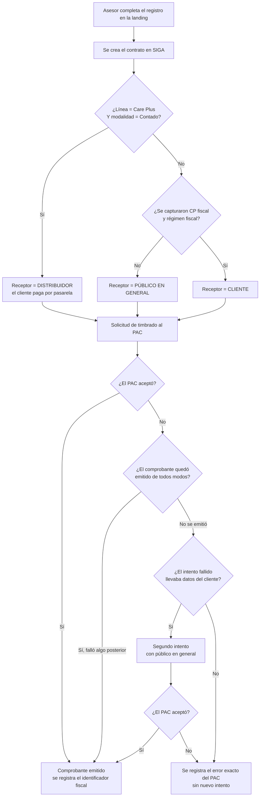
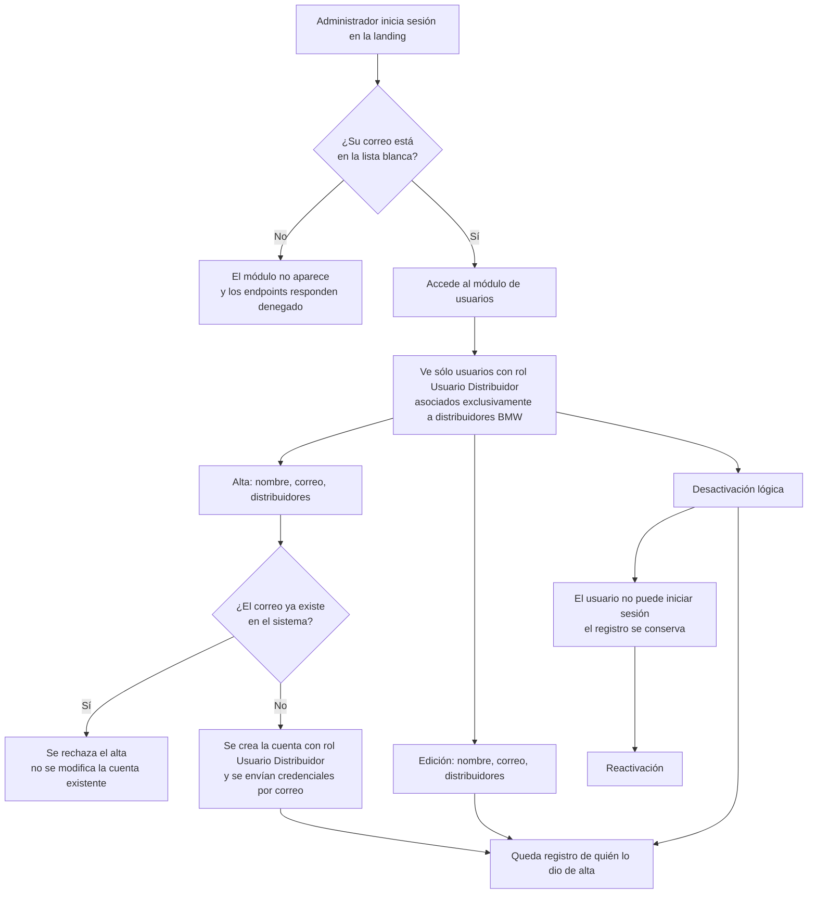

# PRD - BMW: paquete de cambios ago-2026

| **Campo** | **Detalle** |
| --- | --- |
| **Proyecto** | BMW — paquete de cambios ago-2026 (facturación, alta de usuarios y ajustes de la landing) |
| **Área / empresa** | Garantiplus México |
| **Versión** | v0.2 |
| **Fecha** | 2026-08-17 (v0.1: 2026-08-14) |
| **Autores** | Carlos Castellanos |
| **Revisión / liderazgo** | Aldo Álvarez (Dir. TI) · Mario Luna / Israel Escutia (negocio BMW) |
| **Tipo de proyecto** | Feature web o API |

## 1. Resumen ejecutivo

Este proyecto agrupa cinco cambios sobre el **portal BMW** (landing de registro de garantías extendidas)
y la **API de SIGA**, solicitados por BMW el 13 y 14 de agosto de 2026. Beneficia a tres audiencias: los
**asesores de los 48 distribuidores BMW** que registran garantías, el área de **RH/administración de BMW**
que hoy no puede gestionar a su propia gente, y **Operaciones GarantiPlus**, que dejará de ser cuello de
botella en las altas de usuarios.

El paquete responde a tres dolores distintos. Primero, un **problema fiscal**: el producto *Care Plus*
vendido de Contado debe facturarse al distribuidor y no al cliente final, y hoy el portal siempre factura
al cliente. Segundo, un **problema de comprobantes que no se emiten**: cuando el cliente no captura sus
datos fiscales, el comprobante no puede emitirse a su nombre y el timbrado falla; además, **cuando el PAC
rechaza, el sistema no informa por qué**, por lo que las fallas se descubren tarde y a mano. Tercero, un
**problema operativo**: cada alta o baja de un usuario de distribuidor depende de Operaciones GarantiPlus,
aunque quien realmente sabe qué persona sigue activa es el propio BMW. Se suman dos ajustes menores que
BMW pidió en la misma conversación: una modalidad de pago nueva y mejoras al listado de registros.

El **MVP** entrega: facturación al distribuidor para Care Plus de Contado; facturación a público en general
como comportamiento por defecto cuando no hay datos fiscales, con **un segundo intento automático** cuando
el primer timbrado falla; visibilidad del error real del PAC; un **módulo de administración de usuarios**
dentro de la landing, restringido por lista blanca y limitado al rol *Usuario Distribuidor*; la modalidad
**"Financiamiento externo"**; y **paginación más folio de factura** en el listado de registros.

**Actualización v0.2 (17-ago).** La Fase 0 —la prueba que debía definir si un comprobante a público en
general puede emitirse— **ya se ejecutó, y el resultado es afirmativo**: añadiendo la información de
periodo que la autoridad exige, el comprobante se emite correctamente. Con eso el bloque de facturación
queda con su forma definida y sin bloqueos externos. La prueba destapó además un defecto que habría
producido **comprobantes duplicados** en cuanto se activara el segundo intento, y que ya está corregido
(ver F-4 y la sección 13). Como efecto colateral, se abre la posibilidad de facturar una cartera de
contratos que se había dado por imposible, lo que es una decisión de negocio nueva (sección 14).

El resultado esperado es que los comprobantes de BMW se emitan al receptor correcto y dejen de fallar en
silencio, y que BMW administre su propio padrón de usuarios sin abrir un hueco de seguridad.

**Registro de garantía** → **Se determina el receptor del comprobante (cliente / distribuidor / público en general)** → **Timbrado, con segundo intento si falla** → **Resultado visible y trazable** · en paralelo: **BMW administra sus usuarios desde la landing**

## 2. Contexto y problema

**Cómo funciona hoy**

- La landing BMW registra garantías extendidas y crea el contrato en SIGA. Al crearlo, **las tres
  modalidades de pago (Contado, Enganche, Financiado) emiten el comprobante a nombre del cliente final**,
  sin importar qué producto se vendió.
- Los campos **código postal fiscal** y **régimen fiscal** del cliente son **opcionales** y se muestran en
  todas las modalidades. Cuando no se capturan, el comprobante se intenta emitir igual y **falla**.
- Cuando el PAC rechaza un comprobante, **el error no llega al sistema que lo solicitó**: la respuesta que
  se devuelve viene vacía, por lo que la operación se registra como exitosa. El motivo del rechazo sólo
  queda en la bitácora del servicio de facturación y se descubre revisándola a mano.
- El **alta de usuarios** es exclusiva de Operaciones GarantiPlus, dentro de SIGA. No hay forma de crear,
  editar ni desactivar usuarios desde la landing.
- El **listado de registros** de la landing carga todos los registros de una sola vez, sin paginación, y no
  muestra el folio de la factura del vehículo aunque ese dato ya se captura y se almacena.

**El dolor concreto**

- **Fiscal:** el producto *Care Plus* corresponde comercialmente al distribuidor, pero el comprobante sale a
  nombre del cliente. Es una inconsistencia entre la operación comercial y el comprobante emitido.
- **Comprobantes no emitidos y fallas mudas:** los contratos sin datos fiscales no generan comprobante, y
  como el error no se propaga, nadie se entera hasta que alguien lo busca. No hay reintento.
- **Dependencia operativa:** BMW no puede dar de alta ni desactivar a su propia gente. Cuando un asesor deja
  el distribuidor, su acceso permanece activo hasta que alguien lo solicite a GarantiPlus. Es un riesgo de
  seguridad además de una fricción.
- **Listado inservible a escala:** sin paginación ni el folio de factura, el listado se vuelve difícil de
  usar conforme crece el volumen.

**Por qué ahora**

Lo dispara BMW: pidió expresamente la facturación de Care Plus al distribuidor y el módulo de usuarios, con
la intención de que su área de RH lleve la gestión del padrón. Los ajustes de facturación a público en
general y de visibilidad del error del PAC se suman porque son la causa raíz de comprobantes que hoy no se
emiten, detectada al analizar las dos solicitudes originales.

**Conceptos de dominio que el equipo debe distinguir desde el día 1**

| Concepto | Distinción |
| --- | --- |
| **Línea de producto** vs **modalidad de pago** | *Care Plus* y *Excellence Mirror* son **líneas de producto** (qué se vendió). *Contado*, *Enganche* y *Financiado* son **modalidades de pago** (cómo se paga). La facturación al distribuidor exige que **coincidan** línea = Care Plus **y** modalidad = Contado; ninguna de las dos por separado la activa |
| **Receptor del comprobante** vs **quién paga** | En Care Plus de Contado **el cliente paga** por la pasarela, pero **el receptor del comprobante es el distribuidor**. Son dos cosas distintas y deliberadamente separadas |
| **Público en general** vs **comprobante individual** | Un comprobante a público en general usa un identificador fiscal genérico. La autoridad **no permite emitirlo como comprobante individual**: exige que sea un comprobante **global**, que declara el periodo que ampara. **Verificado el 17-ago:** al declarar ese periodo el comprobante se emite sin problema, así que la restricción es de forma, no un impedimento |
| **Comprobante emitido** vs **comprobante entregado** | El comprobante queda emitido y es fiscalmente válido en cuanto la autoridad lo valida. La generación del archivo PDF que se entrega al cliente ocurre **después** y es un artefacto aparte: si falla, el comprobante sigue siendo válido. Confundir ambas cosas es lo que produce duplicados (ver F-4) |
| **Usuario Distribuidor** vs **equipo de ventas** | *Usuario Distribuidor* es una **cuenta de acceso** al sistema, con credenciales y permisos. Los *gerentes*, *F&I* y *asesores* que la landing ya permite crear son **registros de catálogo** sin credenciales. El módulo nuevo crea cuentas; los modales existentes no |
| **Desactivación** vs **eliminación** | El módulo **nunca borra** una cuenta: la desactiva. La cuenta conserva su historial y puede reactivarse |

## 3. Objetivo del producto

Lograr que el portal BMW emita cada comprobante fiscal **al receptor que corresponde** —cliente,
distribuidor o público en general, según la combinación de producto y modalidad y según los datos
capturados—, que **ningún fallo de timbrado quede oculto** y que exista un **segundo intento automático**
cuando el primero falla. En paralelo, entregar a BMW la capacidad de **administrar su propio padrón de
usuarios de distribuidor** desde la misma landing, bajo un esquema de acceso restringido que no amplíe los
privilegios de nadie más allá de lo estrictamente necesario.

La mejora medible es doble: reducir a cero los comprobantes que fallan sin que nadie se entere, y eliminar
la dependencia de Operaciones GarantiPlus para las altas y bajas de usuarios de los distribuidores BMW.

### 3.1 Estrategia de implementación por fases

| **Fase** | **Nombre** | **Descripción** |
| --- | --- | --- |
| Fase 0 | Prueba de comprobante a público en general | ✅ **COMPLETADA el 17-ago-2026.** Se verificó, sobre contratos reales y contra el validador de pruebas de la autoridad, si un comprobante a público en general puede emitirse declarando el periodo que ésta exige. **Resultado: sí.** Se probaron tres escenarios (detalle abajo) |
| Fase 1 | Ajustes independientes | Módulo de administración de usuarios, modalidad "Financiamiento externo", paginación y folio de factura en el listado. No dependen de ningún resultado externo y se pueden entregar en paralelo |
| Fase 2 | Facturación | Care Plus de Contado al distribuidor, facturación a público en general por defecto, segundo intento automático y propagación del error del PAC. **Ya sin bloqueos**: la Fase 0 definió su forma |

**El MVP de este PRD son las tres fases.** La Fase 0 era una prueba, no un entregable de producto, pero se
declaró como fase porque **condicionaba el alcance** de la Fase 2.

**Resultado de la Fase 0 (17-ago-2026).** Tres escenarios, en orden de costo creciente:

| Escenario probado | Resultado |
| --- | --- |
| Identificador fiscal genérico con el **nombre real del cliente** | ✅ Se emitió. Es, sin que nadie lo hubiera decidido, **lo que el portal ya hace hoy** cuando el cliente no captura sus datos fiscales |
| Nombre "público en general" **sin declarar el periodo** | ❌ Rechazado por la autoridad. Reproduce exactamente el bloqueo que se observó en producción |
| Nombre "público en general" **declarando el periodo** | ✅ Se emitió correctamente |

**Se adopta el tercer escenario**, que es el fiscalmente correcto. El primero queda como respaldo, con la
salvedad de que un identificador genérico junto a un receptor nombrado es incongruente ante la autoridad
aunque ésta lo acepte.

## 4. Usuarios y actores

| **Usuario / Actor** | **Rol en el proceso** |
| --- | --- |
| **Asesor de distribuidor BMW** (rol *Usuario Distribuidor*) | Registra las garantías en la landing. Es quien captura —u omite— los datos fiscales del cliente, y quien elige producto y modalidad de pago. Es también el usuario que el módulo nuevo da de alta y desactiva |
| **Administrador de usuarios BMW** (p. ej. RH de BMW) | Perfil nuevo. Da de alta, edita, desactiva y reactiva usuarios de distribuidor desde la landing. Sólo accede si su correo está en la lista blanca. En el arranque, la lista la ocupan dos personas de GarantiPlus |
| **Operaciones GarantiPlus** | Hoy es la única que puede dar de alta usuarios en SIGA. Cede esa función para los usuarios de distribuidor de BMW y conserva el resto. Debe poder auditar lo que BMW haga |
| **Cliente final** | Compra la garantía. Aporta —o no— sus datos fiscales, lo que determina el receptor del comprobante. En Care Plus de Contado paga por la pasarela aunque el comprobante no vaya a su nombre |
| **Distribuidor BMW (48 sucursales)** | Receptor del comprobante en los contratos Care Plus de Contado |
| **Área contable / fiscal GarantiPlus** | Define el uso de comprobante aplicable y valida que los comprobantes emitidos sean correctos. Es quien debe confirmar el criterio pendiente sobre deducibilidad |
| **TI GarantiPlus** | Construye, despliega y ejecuta la prueba de la Fase 0. Administra la lista blanca, que vive en configuración |
| **PAC (EDICOM)** | Sistema externo que valida y timbra los comprobantes. Su respuesta de rechazo es la información que hoy se pierde |

## 5. Alcance MVP y funcionalidades

| **Funcionalidad** | **Descripción** |
| --- | --- |
| **F-1 · Care Plus de Contado factura al distribuidor** | Cuando la línea de producto es *Care Plus* **y** la modalidad es *Contado*, el receptor del comprobante es el distribuidor del contrato, no el cliente. Cualquier otra combinación mantiene el comportamiento actual. Se entrega gobernado por un interruptor de configuración, apagado por omisión |
| **F-2 · Ocultar datos fiscales del cliente en Care Plus de Contado** | En esa misma combinación, la landing **no pide** código postal fiscal ni régimen fiscal, porque el receptor no es el cliente. Nombre y RFC se siguen capturando y guardando en el contrato sin cambio |
| **F-3 · Facturación a público en general por defecto** | Cuando no se capturaron código postal fiscal ni régimen fiscal, el comprobante se emite a público en general. La excepción es F-1, que tiene prioridad. El orden de decisión es: Care Plus + Contado → distribuidor; sin datos fiscales → público en general; resto → cliente |
| **F-4 · Segundo intento de timbrado** | Si se capturaron datos fiscales pero el timbrado falla, el sistema hace **un** segundo intento con los datos de público en general. Un solo reintento, nunca en bucle. La decisión de reintentar vive en la API; el servicio de facturación conserva su comportamiento. ⚠️ **Antes de reintentar hay que comprobar que el comprobante realmente no se emitió**, no basta con que la operación haya devuelto error: la Fase 0 demostró que un fallo posterior a la emisión (la generación del PDF) se reportaba como fallo del timbrado, y reintentar ahí produce un **comprobante duplicado** |
| **F-5 · El error del PAC llega a quien lo pidió** | El motivo exacto del rechazo se propaga desde el servicio de facturación hasta la API que solicitó el timbrado, y queda registrado de forma consultable. Hoy la respuesta viene vacía y el fallo se reporta como éxito |
| **F-6 · Módulo de administración de usuarios en la landing** | Sección nueva, accesible sólo con sesión iniciada **y** correo en la lista blanca. Permite listar, crear, editar, desactivar y reactivar usuarios. La verificación de acceso se hace en el servidor en cada operación |
| **F-7 · Alta de usuario** | Captura nombre, correo y selección de uno o más distribuidores. El rol es **siempre** *Usuario Distribuidor*, fijado por el sistema y no elegible. Se envían las credenciales por correo al usuario dado de alta, usando la plantilla de correo que el proyecto BMW ya tiene configurada |
| **F-8 · Edición de usuario** | Permite modificar nombre, correo y distribuidores asignados. El cambio de correo modifica la identidad de acceso del usuario, por lo que se registra con su valor anterior y nuevo |
| **F-9 · Desactivación y reactivación** | La eliminación es **lógica**: el usuario queda inhabilitado para iniciar sesión y puede reactivarse. Nunca se borra el registro |
| **F-10 · Listado con filtros y estado** | El listado muestra los usuarios de distribuidor de BMW existentes —incluidos los ~640 ya creados— con su estado activo/inactivo y sus distribuidores. Incluye filtros de búsqueda por nombre, correo y distribuidor, y filtro por estado |
| **F-11 · Confinamiento del alcance** | El administrador sólo puede ver y operar sobre usuarios que tengan **únicamente** el rol *Usuario Distribuidor* y que estén asociados **exclusivamente** a distribuidores de BMW. Cualquier otra cuenta es invisible e intocable desde el módulo. Los distribuidores seleccionables son los 48 de BMW |
| **F-12 · Modalidad "Financiamiento externo"** | Modalidad de pago nueva, seleccionable en la landing, con **el mismo comportamiento** que "Financiamiento" en contrato, facturación y orden de pago |
| **F-13 · Paginación del listado de registros** | El listado de registros de la landing pagina contra el servidor, al estilo del que ya opera en la landing de Bridgestone, con filtros y orden aplicados del lado del servidor |
| **F-14 · Folio de factura en el listado** | Se muestra el folio de la factura del vehículo como columna del listado, con su filtro. El dato ya se captura y se almacena; sólo falta exponerlo |

**Principio rector del MVP.** El paquete prioriza **que nada falle en silencio** y **que abrir el alta de
usuarios a un tercero no amplíe privilegios**. En consecuencia: el módulo de usuarios **no puede crear
ningún rol distinto** de *Usuario Distribuidor* ni alcanzar cuentas fuera de BMW, bajo ninguna combinación
de parámetros; y el bloque de facturación **no decide por su cuenta** cambiar un receptor ya emitido —sólo
actúa en el momento de la creación del contrato y en su único reintento.

## 6. Fuera de alcance

- **Refacturación de los contratos Care Plus ya vendidos**: los comprobantes ya emitidos a nombre del
  cliente se quedan como están. Habilitarlo implicaría cancelación ante la autoridad y re-emisión, que es
  un proyecto propio.
- **Carga de datos fiscales reales de los 48 distribuidores**: se decidió dejarlos con datos genéricos y
  aceptar que el timbrado marque error. Se habilitaría cuando BMW entregue las constancias fiscales.
- **Registro de averías simplificado (sólo VIN y descripción)**: se solicitó en la misma conversación pero
  se acordó resolverlo al final, porque falta definir de dónde se obtiene la póliza sin el número de
  contrato. Se levantará como PRD propio.
- **Revocación inmediata de sesiones activas**: al desactivar un usuario, una sesión ya iniciada sigue
  siendo válida hasta que expira por su cuenta. Cerrarla al instante es un cambio de mayor alcance en el
  esquema de autenticación.
- **Administración de la lista blanca desde una pantalla**: la lista vive en configuración y la mantiene TI.
  Una interfaz para editarla se evaluaría si el padrón de administradores crece.
- **Alta de roles distintos a *Usuario Distribuidor*** y **alta de usuarios de proyectos que no sean BMW**:
  es el límite de seguridad del módulo, no una restricción temporal.
- **Reintentos ilimitados de timbrado**: se hace un único segundo intento. Un mecanismo de reintento
  continuo requeriría resolver antes la acumulación de comprobantes fallidos.

## 7. Flujos principales

### 7.1 · Decisión del receptor del comprobante y reintento

El orden de la decisión es deliberado: la regla de Care Plus **tiene prioridad** sobre la de datos fiscales
ausentes, porque en esa combinación los datos del cliente son irrelevantes por diseño (F-2 los oculta). El
reintento existe sólo para el caso en que el sistema tenía datos del cliente y aun así el PAC los rechazó;
si el intento ya era a público en general, reintentar con lo mismo no aporta y se registra el error.

La rama de la derecha **no existía**: el sistema no sabía si la autoridad había aceptado, porque la
respuesta llegaba vacía y todo rechazo se reportaba como éxito. Sin F-5, ni el reintento de F-4 ni el
registro del error son posibles, así que F-5 es prerrequisito de F-4 y no un complemento.

El rombo *"¿el comprobante quedó emitido de todos modos?"* se agregó en la v0.2 a raíz de la Fase 0. No es
una hipótesis: se observó que la generación del PDF falla **después** de que el comprobante ya está emitido
y válido, y que ese fallo se propagaba como fallo del timbrado. Sin esa verificación, el segundo intento se
dispararía sobre un comprobante que ya existe y emitiría un **duplicado** —un problema fiscal mucho más
caro que el que F-4 pretende resolver.

### 7.2 · Ciclo de vida de un usuario administrado por BMW

La verificación de la lista blanca ocurre **en el servidor y en cada operación**, no sólo al pintar el menú:
ocultar el módulo en la interfaz es una comodidad, no un control de seguridad. Las dos ramas que definen el
blindaje son la de correo existente —que **nunca** modifica una cuenta ya creada— y la del universo visible,
que impide que el módulo alcance cuentas ajenas a BMW aunque se manipule la petición.

## 8. Requerimientos funcionales

| **ID** | **Requerimiento** | **Descripción** |
| --- | --- | --- |
| RF-01 | Facturar al distribuidor en Care Plus de Contado | Al crear un contrato cuya línea sea *Care Plus* y cuya modalidad sea *Contado*, el receptor del comprobante debe ser el distribuidor del contrato |
| RF-02 | Preservar el comportamiento actual en el resto de casos | Cualquier combinación distinta a RF-01 mantiene al cliente como receptor, sin cambio observable |
| RF-03 | Interruptor de configuración para RF-01 | La facturación al distribuidor se activa y desactiva por configuración, y llega apagada por omisión |
| RF-04 | Ocultar datos fiscales del cliente en Care Plus de Contado | En esa combinación, la landing no muestra ni exige código postal fiscal ni régimen fiscal |
| RF-05 | Conservar la captura de nombre y RFC | Nombre y RFC del cliente se siguen capturando y almacenando en el contrato en todas las combinaciones |
| RF-06 | Emitir a público en general sin datos fiscales | Si no se capturaron código postal fiscal ni régimen fiscal, y no aplica RF-01, el comprobante se emite a público en general |
| RF-07 | Segundo intento de timbrado | Si un timbrado con datos del cliente falla, el sistema realiza exactamente un segundo intento con datos de público en general |
| RF-08 | No reintentar lo ya intentado | Si el intento fallido ya era a público en general, no se realiza un nuevo intento |
| RF-09 | Propagar el error del PAC | El motivo del rechazo devuelto por el PAC debe llegar al servicio que solicitó el timbrado, con su texto original |
| RF-10 | Registrar el resultado del timbrado | Éxito o fallo, con el motivo, quedan registrados de forma consultable sin necesidad de revisar bitácoras del servidor |
| RF-11 | Acceso al módulo por lista blanca | El módulo de usuarios sólo es accesible para usuarios con sesión válida cuyo correo esté en la lista blanca configurada |
| RF-12 | Verificación de acceso en servidor | Cada operación del módulo verifica la lista blanca en el servidor; la ocultación en la interfaz no sustituye esta verificación |
| RF-13 | Alta de usuario con rol fijo | El alta captura nombre, correo y distribuidores. El rol asignado es siempre *Usuario Distribuidor*, determinado por el sistema y no recibido de la petición |
| RF-14 | Validación del alcance de distribuidores | Los distribuidores asignables son exclusivamente los del proyecto BMW y deben estar activos |
| RF-15 | Rechazo de correo existente | Si el correo ya pertenece a una cuenta, el alta se rechaza y la cuenta existente no se modifica en ningún campo |
| RF-16 | Envío de credenciales | Tras el alta, se envían las credenciales al correo del usuario creado, usando la plantilla configurada del proyecto BMW. Las credenciales no se devuelven en la respuesta de la operación |
| RF-17 | Edición de usuario | Permite modificar nombre, correo y distribuidores asignados de un usuario dentro del universo permitido |
| RF-18 | Registro del cambio de correo | El cambio de correo queda registrado con valor anterior y nuevo, por ser un cambio de identidad de acceso |
| RF-19 | Desactivación lógica efectiva | Al desactivar, el usuario no puede iniciar sesión ni por la landing ni por la API. El registro se conserva |
| RF-20 | Reactivación | Un usuario desactivado puede volver a activarse desde el módulo |
| RF-21 | Confinamiento del universo | El módulo sólo lista y opera usuarios que tengan únicamente el rol *Usuario Distribuidor* y estén asociados exclusivamente a distribuidores de BMW |
| RF-22 | Filtros del listado | El listado permite filtrar por nombre, correo, distribuidor y estado activo/inactivo |
| RF-23 | Atomicidad del alta | El alta se confirma completa o no se confirma: no puede quedar una cuenta creada sin rol o sin distribuidores |
| RF-24 | Trazabilidad de quién dio de alta | Cada usuario creado guarda referencia a la cuenta que lo dio de alta |
| RF-25 | Modalidad "Financiamiento externo" | Se agrega como opción seleccionable en la landing y produce en el contrato el mismo resultado que "Financiamiento" |
| RF-26 | Sin modalidades sin efecto | Ninguna modalidad seleccionable puede crear un contrato sin definir su tratamiento de facturación y orden de pago |
| RF-27 | Paginación del listado de registros | El listado de registros pagina contra el servidor, con filtros y orden resueltos del lado del servidor |
| RF-28 | Folio de factura en el listado | El listado muestra el folio de la factura del vehículo, con filtro propio |

Los siguientes se agregaron en la **v0.2**, a partir de lo que se observó al ejecutar la Fase 0. Se numeran
al final para no alterar las referencias de la v0.1:

| **ID** | **Requerimiento** | **Descripción** |
| --- | --- | --- |
| RF-29 | Declarar el periodo en el comprobante a público en general | Cuando el receptor sea el identificador fiscal genérico con nombre de público en general, el comprobante debe declarar el periodo que ampara. Sin esa declaración la autoridad lo rechaza — verificado en la Fase 0 |
| RF-30 | Verificar la emisión antes de reintentar | El segundo intento de RF-07 sólo procede si se comprobó que el comprobante **no quedó emitido**. Un fallo posterior a la emisión no debe contar como fallo de timbrado. Sin esta verificación, el reintento produce un comprobante duplicado |
| RF-31 | Aislar los artefactos posteriores a la emisión | La generación del archivo entregable (PDF) no puede reportarse como fallo del timbrado ni interrumpirlo: se registra su error por separado y el comprobante conserva su validez |

## 9. Requerimientos no funcionales

| **ID** | **Requerimiento** | **Descripción** |
| --- | --- | --- |
| RNF-01 | Privilegio mínimo verificable | Ninguna combinación de parámetros de una petición puede lograr que el módulo cree un rol distinto de *Usuario Distribuidor*, asigne un distribuidor ajeno a BMW o alcance una cuenta fuera del universo permitido. Debe validarse con pruebas de intento deliberado, no sólo por la interfaz |
| RNF-02 | Secretos fuera del cliente | La lista blanca y toda regla de autorización residen en el servidor. Nada que gobierne el acceso puede depender de configuración entregada al navegador |
| RNF-03 | Trazabilidad de las operaciones de usuarios | Toda alta, edición, desactivación y reactivación queda auditada con quién la hizo, cuándo, sobre quién y con qué valores |
| RNF-04 | No exposición de credenciales | Las credenciales generadas viajan únicamente al correo del usuario creado; no aparecen en respuestas de la API ni en bitácoras |
| RNF-05 | Trazabilidad del timbrado | Todo intento de timbrado —exitoso o fallido— queda registrado con su resultado y, si falla, con el motivo devuelto por el PAC |
| RNF-06 | Fallo explícito, nunca silencioso | Ninguna operación de facturación puede reportar éxito cuando el PAC rechazó |
| RNF-07 | Reintento acotado | El reintento de timbrado es de un solo intento adicional, para no generar carga ni comprobantes fallidos en cadena |
| RNF-08 | Aislamiento del cambio | Los cambios de facturación no pueden alterar el comportamiento de otros proyectos que comparten el servicio de facturación |
| RNF-09 | Reversibilidad por configuración | El cambio de facturación al distribuidor puede desactivarse sin necesidad de desplegar código |
| RNF-10 | Límite de frecuencia | Las operaciones de creación y modificación de usuarios están limitadas en frecuencia para acotar el abuso desde una cuenta legítima |
| RNF-11 | Consistencia con SIGA | El estado activo/inactivo de un usuario se ve igual en el módulo de la landing y en SIGA |
| RNF-12 | Rendimiento del listado | El listado de registros debe responder con volumen creciente sin degradarse, trayendo sólo la página solicitada |
| RNF-13 | Experiencia en español | Todos los mensajes visibles para el usuario van en español, incluidos los errores de validación y de rechazo fiscal |
| RNF-14 | Prueba de Fase 0 acotada | La prueba en producción debe limitarse a un contrato, ser identificable y no poder afectar el flujo de contratos vivos |

## 10. Integraciones y datos

| **Integración / Fuente** | **Uso esperado** |
| --- | --- |
| **API de SIGA — servicio de contratos** | Creación del contrato, decisión del receptor del comprobante, solicitud de timbrado y reintento. Lectura y escritura |
| **API de SIGA — servicio de autenticación** | Alberga el módulo de usuarios: creación, edición, desactivación, reactivación y consulta. Lectura y escritura. Es también el emisor de las sesiones que la landing usa |
| **Servicio de facturación de SIGA** | Arma y timbra el comprobante. Debe devolver el resultado real de la operación, incluido el motivo del rechazo. Comunicación entre servicios |
| **PAC (EDICOM)** | Sistema externo que valida y timbra. Es la fuente del motivo de rechazo. Sólo se consume; no se modifica |
| **Pasarela de pago (OpenPay)** | Cobro al cliente en la modalidad Contado. **No cambia**: sigue cobrando al cliente aunque el receptor del comprobante sea el distribuidor |
| **Correo saliente** | Envío de credenciales al usuario dado de alta, con la plantilla ya configurada para el proyecto BMW |
| **Puerta de enlace de la API** | Toda ruta nueva del módulo de usuarios debe publicarse ahí para ser alcanzable desde la landing |
| **Landing BMW** | Interfaz del módulo de usuarios, ocultamiento de campos fiscales, modalidad nueva, paginación y columna de folio |

**Datos mínimos requeridos**

- **Contrato:** línea de producto, modalidad de pago, distribuidor, datos fiscales del cliente (código postal
  fiscal y régimen fiscal, opcionales), nombre y RFC del cliente.
- **Datos fiscales del comprobante:** identificador fiscal, razón social, código postal fiscal, régimen
  fiscal, uso de comprobante, método y forma de pago.
- **Distribuidor:** identificador, nombre, proyecto al que pertenece, estado activo, y sus datos fiscales.
- **Usuario:** nombre, correo (que es también su identificador de acceso), estado activo/inactivo, rol,
  distribuidores asociados y referencia a quién lo creó.
- **Registro de la landing:** folio de la factura del vehículo, modalidad de pago, estado y datos de pago.
- **Resultado de timbrado:** aceptado o rechazado, identificador fiscal si se emitió, motivo del rechazo si
  no.

**Esquema de permisos**

El administrador del módulo **puede leer** los usuarios de distribuidor de BMW y el catálogo de los 48
distribuidores del proyecto. **Puede escribir** el alta, la edición y el cambio de estado de esos mismos
usuarios. **Queda bloqueado** —sin excepción y sin posibilidad de habilitarlo por parámetro— para: asignar
cualquier rol distinto de *Usuario Distribuidor*, asignar distribuidores de otro proyecto, operar sobre
cuentas que tengan algún otro rol, modificar una cuenta preexistente a través del alta, y operar sobre su
propia cuenta. La lista blanca que determina quién es administrador **la mantiene TI** en configuración; no
es editable desde el producto. En el bloque de facturación, ningún cambio permite alterar el receptor de un
comprobante **ya emitido**: la decisión se toma al crear el contrato y en su único reintento.

## 12. Métricas de éxito

| **Métrica** | **Descripción** |
| --- | --- |
| Comprobantes que fallan sin detección | Número de timbrados rechazados que no quedan registrados con su motivo. **Meta: cero.** Es la métrica que define el éxito de F-5 |
| Tasa de timbrado exitoso al primer intento | Porcentaje de contratos cuyo comprobante se emite sin reintento. Línea base pendiente de medir con la información actual |
| Recuperación por segundo intento | Porcentaje de timbrados fallidos que se resuelven con el reintento a público en general. Indica si F-4 aporta valor real |
| Altas y bajas de usuarios gestionadas por BMW | Proporción de movimientos del padrón realizados desde el módulo frente a los solicitados a Operaciones GarantiPlus. Mide la autonomía lograda |
| Tiempo entre la salida de una persona y su desactivación | Reducción del periodo en que una cuenta permanece activa sin deberlo. Línea base pendiente de validar con operación |
| Incidentes de privilegio | Número de casos en que el módulo permitió una operación fuera de su alcance. **Meta: cero** |
| Contratos Care Plus de Contado con receptor correcto | Proporción de contratos de esa combinación cuyo comprobante sale a nombre del distribuidor |

Las líneas base y las metas numéricas de las métricas de tiempo y de tasa **están pendientes de validar con
operación y con el área contable**; no se fijan cifras en este PRD.

## 13. Riesgos y supuestos

### Riesgos

| **Riesgo** | **Impacto potencial** |
| --- | --- |
| ~~El comprobante a público en general no puede emitirse por la vía actual~~ | ✅ **CERRADO en la v0.2.** Era el riesgo principal. La Fase 0 demostró que sí puede emitirse declarando el periodo. F-3 y F-4 tienen salida técnica dentro del alcance |
| **Comprobante duplicado por un falso negativo** | **Materializado y corregido en la Fase 0.** La generación del PDF falla después de que el comprobante ya está emitido, y ese fallo se reportaba como fallo del timbrado. Con el segundo intento activo, eso emite un comprobante duplicado sobre un contrato ya facturado — un problema fiscal peor que el que F-4 resuelve. Cubierto por RF-30 y RF-31 |
| El validador de pruebas y el de producción podrían diferir | La Fase 0 se ejecutó contra el validador de pruebas de la autoridad, que aplica las mismas reglas estructurales. Es un supuesto razonable pero no una certeza: la primera emisión en producción lo confirma o lo desmiente |
| Un comprobante global de una sola operación | Estructuralmente se acepta, pero el comprobante global está pensado para agregar las operaciones de un periodo. Emitir uno por contrato es defendible y a la vez inusual; requiere aval contable antes de producción |
| Facturar al distribuidor con datos fiscales genéricos | El comprobante saldría a nombre del distribuidor pero **sin valor fiscal para él**: no podría deducirlo. Si el objetivo de negocio era que dedujera, la decisión de conservar datos genéricos no lo cumple |
| Toma de cuenta mediante el cambio de correo | Con credenciales enviadas por correo y correo editable, cambiar el correo de un usuario y solicitar restablecimiento permite tomar su cuenta. El confinamiento del universo limita el daño a cuentas de distribuidor BMW, pero exige auditoría del cambio |
| Ampliación involuntaria de privilegios | Abrir el alta de usuarios a un tercero es irreversible en términos de confianza: un hueco se explota con una cuenta legítima, no con una intrusión. Mitigado por RNF-01 y por las pruebas de intento deliberado |
| Duplicidad con el proyecto PJ2613 | Ese PRD cubre la misma capacidad —crear usuarios con rol *Usuario Distribuidor* acotados a ciertos distribuidores— en otra superficie. Sin coordinación, la regla se implementaría dos veces y podrían divergir |
| Sesión activa tras la desactivación | Una cuenta desactivada conserva su sesión vigente hasta que expira. Ventana de exposición conocida y aceptada |
| Acumulación de comprobantes fallidos | Cada intento de timbrado que no prospera deja un registro incompleto. El reintento automático duplica ese volumen. **Confirmado en la Fase 0**: el escenario rechazado dejó su registro incompleto, y esos registros no impiden reintentar, sólo se acumulan |
| Modalidad nueva sin tratamiento definido | Si la modalidad se agrega en la interfaz pero no en la lógica de facturación, se crearían contratos sin comprobante ni orden de pago **sin ningún error visible**. Cubierto por RF-26 |
| Pérdida de filtros al paginar | Tres filtros del listado actual operan sobre valores calculados en el navegador y no sobreviven a la paginación en servidor sin exponer esos datos |
| ~~La prueba de Fase 0 emite un comprobante real~~ | ✅ **NO APLICÓ.** La prueba se movió a un entorno local contra el validador de pruebas, así que no se emitió ningún comprobante fiscal. Esa decisión eliminó el riesgo por completo |

### Supuestos

| **Supuesto** | **Descripción** |
| --- | --- |
| ~~Existen contratos aptos para la prueba~~ | ✅ **CONFIRMADO.** Se usaron contratos del proyecto BMW en el entorno local. La cartera de producción tiene el mismo estado fiscal, así que la prueba es representativa |
| El comportamiento observado se conserva en producción | Lo verificado en el entorno local con el validador de pruebas debería reproducirse en producción, porque las reglas estructurales son las mismas. Se valida con la primera emisión real |
| Los datos fiscales de los distribuidores se mantienen genéricos | Y se acepta que el timbrado de Care Plus de Contado marque error mientras eso no cambie |
| El uso de comprobante se mantiene | Se conserva el uso actual hasta que el área contable confirme si cambia |
| La lista blanca la administra TI | Y su modificación implica un despliegue de configuración, no una acción de producto |
| El correo de credenciales opera | El envío de correo del proyecto BMW está habilitado y la plantilla configurada es la vigente |
| BMW asume la gestión del padrón | El área que administre los usuarios conoce el estado real de la plantilla de cada distribuidor |
| Los ~640 usuarios existentes son gestionables | Y es deseable que BMW pueda desactivarlos, no sólo a los que cree desde el módulo |
| El despliegue del servicio de facturación es viable | Se realiza de forma manual y lo ejecuta TI GarantiPlus |

## 14. Preguntas abiertas

| **Tema** | **Pregunta abierta** |
| --- | --- |
| ~~Facturación — público en general~~ | ✅ **RESUELTA en la Fase 0 (17-ago).** El comprobante a público en general **sí** es viable declarando el periodo. Se adopta esa vía |
| 🔴 **Facturación — cartera de contratos dada por imposible** | **Pregunta nueva y la más relevante de la v0.2.** Hay ~1,016 contratos en producción que quedaron con receptor de público en general y no se pudieron facturar. Esa decisión se cerró eligiendo entre "no facturar / comprobante global / identificador fiscal real del cliente", y **el comprobante global se descartó por imposible**. Ya no lo es: con este desarrollo esos contratos se pueden emitir. **¿Se reabre la decisión?** Requiere negocio y contabilidad |
| 🔴 **Facturación — aval del comprobante global de una sola operación** | Un comprobante global que ampara **una sola** operación pasa la validación de la autoridad, pero la figura está pensada para agregar las operaciones de un periodo. ¿Contabilidad lo avala tal cual, o se requiere agregación real por periodo? Lo segundo sería otro alcance. **Debe cerrarse antes de producción** |
| Facturación — el comportamiento actual no declarado | La Fase 0 reveló que, cuando el cliente no captura datos fiscales, el portal **ya emite** hoy con identificador fiscal genérico y el nombre real del cliente. Nadie lo decidió: es un efecto no documentado. ¿Se corrige a la vía adoptada, se deja como respaldo, o hay que revisar los comprobantes ya emitidos así? |
| Facturación — deducibilidad | ¿El objetivo de facturar Care Plus al distribuidor es que **pueda deducirlo**? Si es así, la decisión de conservar datos fiscales genéricos no lo cumple y habría que solicitar las constancias fiscales de los 48 distribuidores |
| Facturación — uso de comprobante | ¿Se mantiene el uso actual para el comprobante al distribuidor o se cambia a uno deducible? Negocio quedó de confirmarlo |
| Facturación — coherencia del cobro | Se confirmó que el cliente paga por pasarela mientras el comprobante sale al distribuidor. ¿El área contable respalda por escrito esa separación? |
| Facturación — comprobantes fallidos | ¿Los registros de timbrados fallidos acumulados se marcan, se depuran o se dejan como están? |
| Usuarios — coordinación con PJ2613 | ¿La regla de creación de *Usuario Distribuidor* se implementa una sola vez y se comparte entre ambos proyectos, o cada uno construye la suya? Requiere acuerdo con el autor de PJ2613 y con Alexis Herrera |
| Usuarios — administradores reales | ¿Quiénes de BMW quedarán en la lista blanca cuando se libere, y por qué canal se solicita agregar o quitar administradores? |
| Usuarios — notificación a Operaciones | ¿Operaciones GarantiPlus debe recibir aviso de cada alta o baja que realice BMW? |
| Usuarios — vigencia de sesión | ¿Es aceptable que una cuenta desactivada conserve su sesión hasta que expire, o se requiere corte inmediato? |
| Listado — filtros | Al paginar contra el servidor, ¿se aceptan filtros únicamente sobre los campos que el listado expone, como ocurre en la landing de Bridgestone? |
| Modalidad nueva | ¿"Financiamiento externo" usa exactamente el mismo tratamiento fiscal que "Financiamiento", o requiere el suyo propio? |
| Alcance diferido | El registro de averías simplificado quedó fuera. ¿Se levanta como PRD propio y en qué momento? |
