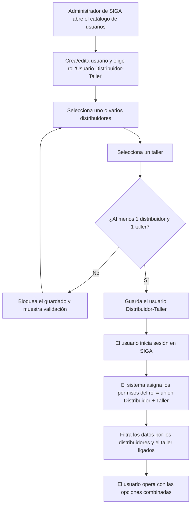

# PRD - Nuevo rol Usuario Distribuidor-Taller

| **Campo** | **Detalle** |
| --- | --- |
| **Proyecto** | Nuevo rol Usuario Distribuidor-Taller |
| **Área / empresa** | Garantiplus México |
| **Versión** | v0.1 |
| **Fecha** | 2026-07-15 |
| **Autores** | Alejandro Govea Hernández (alejandro.govea@garantiplus.mx) |
| **Revisión / liderazgo** | Alexis Salvador Herrera García (alexis.herrera@gplusseguros.mx) |
| **Tipo de proyecto** | Feature web o API |

## 1. Resumen ejecutivo

SIGA gestiona su catálogo de usuarios mediante roles predefinidos. Hoy existen, de forma independiente, los roles **Usuario Distribuidor** y **Usuario Taller**, pero no hay manera de que una sola cuenta opere con ambos perfiles a la vez. Cuando una persona necesita actuar como distribuidor y como taller, la única salida es crearle **dos usuarios separados**.

Un usuario del sistema solicitó habilitar un rol combinado. Este proyecto crea el nuevo rol **Usuario Distribuidor-Taller** en el catálogo de usuarios de SIGA, dirigido a personas que desempeñan ambas funciones y a los administradores de SIGA que las dan de alta.

El MVP —en **una sola entrega**— permite crear y editar un usuario con este rol, ligarlo a **uno o varios distribuidores** y a **un taller** (1:1), y otorgarle la **unión** de las opciones/permisos que ya tienen los roles Usuario Distribuidor y Usuario Taller. No se crean permisos nuevos ni se modifican los roles base.

El resultado esperado es simplificar la administración de estos casos (una sola cuenta en lugar de dos) manteniendo el aislamiento de datos: el usuario solo accede a lo de los distribuidores y el taller que tiene ligados.

**Administrador crea usuario** → **elige rol Distribuidor-Taller** → **liga distribuidores + taller** → **usuario opera con permisos combinados**

## 2. Contexto y problema

- **Hoy:** SIGA solo ofrece los roles **Usuario Distribuidor** y **Usuario Taller** por separado. No existe un rol que combine ambos.
- **Dolor concreto:** una persona que opera como distribuidor y como taller debe manejar **dos usuarios distintos** (dos accesos), lo que complica la administración y el uso diario.
- **Por qué ahora:** es un requerimiento solicitado explícitamente por un usuario del sistema.
- **Distinción de dominio para dev:** un usuario Distribuidor-Taller se relaciona con **N distribuidores** (uno o varios) pero con **un solo taller** (1:1). Sus permisos son la **unión** de los dos roles base, nunca más que eso.

## 3. Objetivo del producto

Permitir crear y administrar en el catálogo de usuarios de SIGA un usuario con rol **Distribuidor-Taller** que opere con los permisos combinados de Usuario Distribuidor y Usuario Taller, ligado a uno o varios distribuidores y a un taller. Todo se resuelve dentro de SIGA, reutilizando el modelo de permisos por rol existente.

## 4. Usuarios y actores

| **Usuario / Actor** | **Rol en el proceso** |
| --- | --- |
| Administrador de SIGA | Crea y edita el usuario Distribuidor-Taller; le asigna los distribuidores y el taller. |
| Usuario Distribuidor-Taller | Usuario final; opera en SIGA con los permisos combinados de Distribuidor + Taller, sobre los distribuidores y el taller ligados. |

## 5. Alcance MVP y funcionalidades

| **Funcionalidad** | **Descripción** |
| --- | --- |
| F1 · Nuevo rol | Habilitar "Usuario Distribuidor-Taller" como tipo de rol en el catálogo de usuarios de SIGA. |
| F2 · Ligar distribuidores | Al crear el usuario, seleccionar **uno o varios** distribuidores relacionados (obligatorio al menos uno). |
| F3 · Ligar taller | Al crear el usuario, seleccionar **un** taller relacionado, 1:1 (obligatorio). |
| F4 · Permisos combinados | El usuario opera con la **unión** de las opciones/permisos de Usuario Distribuidor + Usuario Taller. |
| F5 · Editar | Editar un usuario Distribuidor-Taller existente para modificar sus distribuidores y su taller. |

**Principio rector del MVP:** un usuario Distribuidor-Taller nunca debe tener más permisos que la suma de los dos roles base, ni acceder a datos de distribuidores/taller que no tenga ligados.

## 6. Fuera de alcance

- **Modificar los roles existentes** Usuario Distribuidor y Usuario Taller: siguen operando igual; este proyecto solo agrega el rol combinado.
- **Crear permisos/opciones nuevos:** el rol solo hereda la unión de lo que ya existe en Distribuidor y Taller; nada fuera de eso.
- **Migración/fusión automática** de usuarios actuales: quien hoy tiene dos usuarios no se fusiona automáticamente; el nuevo usuario se crea manualmente si se desea.
- **Multi-taller** (varios talleres por usuario): la relación es 1 taller por usuario; se habilitaría en una versión futura si el negocio lo pide.

## 7. Flujos principales

El flujo cubre dos momentos: el **alta/edición** por parte del administrador (con la validación obligatoria de al menos un distribuidor y un taller antes de guardar) y el **acceso** del usuario final, donde SIGA resuelve los permisos como la unión de ambos roles y restringe la información visible a las entidades ligadas. La validación de obligatoriedad es el único punto de decisión relevante; el resto es reutilización del comportamiento ya existente para Distribuidor y Taller.

## 8. Requerimientos funcionales

| **ID** | **Requerimiento** | **Descripción** |
| --- | --- | --- |
| RF-01 | Alta del rol | Habilitar "Usuario Distribuidor-Taller" como nuevo tipo de rol en el catálogo de usuarios de SIGA. |
| RF-02 | Ligar distribuidores | Al crear el usuario, permitir seleccionar uno o varios distribuidores a relacionar. |
| RF-03 | Ligar taller | Al crear el usuario, permitir seleccionar un taller a relacionar (1:1). |
| RF-04 | Permisos combinados | Otorgar al usuario la unión de opciones/permisos de Usuario Distribuidor + Usuario Taller. |
| RF-05 | Edición | Permitir editar un usuario Distribuidor-Taller para modificar los distribuidores y el taller ligados. |
| RF-06 | Aislamiento de datos | Restringir el acceso del usuario solo a los datos de los distribuidores y el taller que tiene ligados. |
| RF-07 | Validación obligatoria | Impedir guardar el usuario si no tiene al menos un distribuidor y exactamente un taller ligados. |

## 9. Requerimientos no funcionales

| **ID** | **Requerimiento** | **Descripción** |
| --- | --- | --- |
| RNF-01 | Seguridad de permisos | El rol no debe exceder la unión de permisos de los roles base; se apoya en el modelo de permisos por rol de SIGA. |
| RNF-02 | Consistencia de UI | Reutilizar las pantallas y selectores del catálogo de usuarios ya usados para Distribuidor y Taller, para una experiencia coherente. |
| RNF-03 | Manejo de errores | Mostrar mensajes claros de validación (p. ej. falta distribuidor o taller) sin permitir guardados inconsistentes. |
| RNF-04 | Mantenibilidad | El rol debe reflejar las opciones vigentes de los roles base para reducir el riesgo de desincronización ante cambios futuros. |

## 10. Integraciones y datos

| **Integración / Fuente** | **Uso esperado** |
| --- | --- |
| SIGA — catálogo de usuarios | Lectura y escritura: alta/edición del usuario y sus relaciones. Todo vive en SIGA; sin sistemas externos. |
| Catálogo de distribuidores (SIGA) | Lectura: para seleccionar uno o varios distribuidores a ligar. |
| Catálogo de talleres (SIGA) | Lectura: para seleccionar el taller a ligar. |

**Datos mínimos:** usuario (con su tipo de rol Distribuidor-Taller), relación Usuario–Distribuidor (N:M), relación Usuario–Taller (1:1), y el set de opciones/permisos del rol (unión de Distribuidor + Taller).

**Esquema de permisos:** los permisos son **por rol**. El rol Distribuidor-Taller expone la unión de las opciones de Usuario Distribuidor y Usuario Taller. En acceso, el usuario solo lee/escribe sobre los distribuidores y el taller que tiene ligados; no puede acceder a entidades no relacionadas ni obtener permisos fuera de los dos roles base.

## 12. Métricas de éxito

| **Métrica** | **Descripción** |
| --- | --- |
| Rol disponible y funcional | El rol Distribuidor-Taller puede crearse en el catálogo y el usuario opera con los permisos combinados sin errores (criterio de aceptación). |
| Usuarios creados con el nuevo rol | Número de usuarios Distribuidor-Taller dados de alta tras la liberación (adopción). |
| Reducción de usuarios duplicados | Personas que antes requerían dos usuarios (Distribuidor + Taller) y ahora usan uno solo. Pendiente de validar con operación cómo identificarlos. |

## 13. Riesgos y supuestos

### Riesgos

| **Riesgo** | **Impacto potencial** |
| --- | --- |
| Divergencia futura de permisos | Si cambian las opciones de Distribuidor o Taller, el rol combinado podría quedar desincronizado si no hereda dinámicamente. |
| Solape de opciones entre ambos roles | Al unir las pantallas/opciones podría haber duplicados o conflictos visuales/funcionales en la UI. |
| Fuga de datos por liga incorrecta | Un error en el filtrado por distribuidores/taller ligados podría exponer datos que el usuario no debería ver. |

### Supuestos

| **Supuesto** | **Descripción** |
| --- | --- |
| Roles base estables | Usuario Distribuidor y Usuario Taller y sus permisos ya existen y funcionan en SIGA. |
| Catálogo extensible | El catálogo de usuarios de SIGA admite agregar un nuevo tipo de rol sin rediseño mayor. |
| Catálogos disponibles | Existen los catálogos de distribuidores y talleres para poder seleccionarlos. |
| Permisos por rol | El modelo de permisos de SIGA es por rol (confirmado). |

## 14. Preguntas abiertas

| **Tema** | **Pregunta abierta** |
| --- | --- |
| Permisos | Si a futuro una opción difiere o entra en conflicto entre Distribuidor y Taller, ¿cómo se resuelve la prioridad? |
| Métrica de duplicados | ¿Cómo se identificarán los usuarios que hoy tienen cuentas duplicadas para medir la reducción? (validar con operación) |
| Fechas / hitos | No definidos en esta etapa; se planearán por separado. |
| Nomenclatura | Clave/identificador técnico exacto del rol en SIGA (la etiqueta visible es "Usuario Distribuidor-Taller"). |
