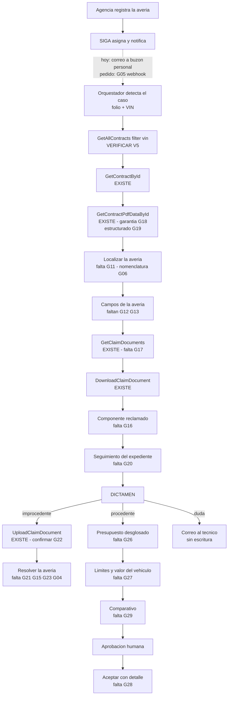
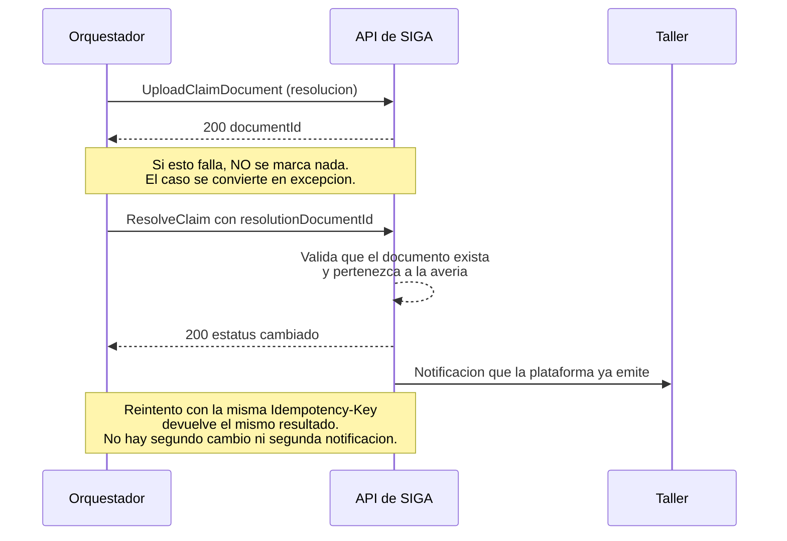

# PRD - API de Averías de SIGA: capacidades requeridas para automatizar el ciclo de dictamen

| **Campo** | **Detalle** |
| --- | --- |
| **Proyecto** | API de Averías de SIGA — capacidades de lectura y escritura requeridas para automatizar el ciclo de dictamen de averías |
| **Área / empresa** | EngineCX (sistema afectado: SIGA; alcance operativo: México en las etapas 1–4, Colombia y Chile en la etapa 5) |
| **Versión** | v1.0 — 36 solicitudes especificadas |
| **Fecha** | 2026-08-27 |
| **Autores** | Omar André Lara Saldaña (omar.lara@enginecx.com) |
| **Dirigido a** | Equipo de desarrollo de la API de SIGA *(interlocutor por confirmar, §14)* |
| **Revisión / liderazgo** | *(por confirmar, §14)* |
| **Tipo de proyecto** | Feature web/API |
| **Documento hermano** | `Desarrollos_internos/PJ1544-copiloto-averias/PRD.md` — el desarrollo que consume estas capacidades |

> **Estado del documento.** Las **36 solicitudes están especificadas** con su evidencia, su contrato propuesto y sus criterios de aceptación. Quedan **13 verificaciones en runtime pendientes** (§14) porque el entorno de pruebas estuvo caído; están marcadas solicitud por solicitud con el efecto que tendría cada respuesta. **Se recomienda cerrarlas antes de la entrega formal**, porque cuatro pueden alterar lo que se pide.
>
> **Cómo leer este documento.** Cada capacidad solicitada lleva un identificador `G-NN`, la etapa que desbloquea, la evidencia de su estado actual y un contrato de endpoint propuesto. **La numeración de los `G-NN` es estable**: sirve para responder punto por punto.
>
> **Sobre el estado actual.** Todo lo que este PRD afirma sobre la API está **verificado** contra los OpenAPI publicados en `qa-siga-api.garantiplus.com`, capturados el 2026-08-26 y contrastados con la captura del 2026-08-24. Cuando algo no se pudo verificar, se dice explícitamente en lugar de suponerlo.
>
> **Sobre los nombres propuestos.** Las rutas, campos y códigos que aquí se proponen son una **propuesta de forma, no una imposición**. Lo que el desarrollo necesita es la capacidad y su semántica; la nomenclatura es del equipo que mantiene la API. Lo único no negociable son las **reglas de integridad** que cada capacidad debe garantizar, marcadas como tales.

## 1. Resumen ejecutivo

EngineCX está construyendo el **Copiloto de Averías**: una automatización que, al momento en que SIGA asigna una avería a un técnico, reúne el expediente, dictamina la procedencia contra el condicionado del contrato y le entrega a esa persona el veredicto razonado y el documento de resolución ya capturado. El desarrollo se apoya por completo en la API de SIGA como fuente de verdad.

**La primera etapa no requiere ningún cambio en la API y arranca de inmediato.** Eso es deliberado: la lectura que la API ya expone —contratos por VIN, detalle del vehículo, texto del certificado, averías, y documentos de evidencia descargables— alcanza para dictaminar y documentar. El desarrollo entrega valor antes de que este documento se atienda.

**Las cuatro etapas siguientes sí dependen de capacidades que hoy no existen.** Este PRD las inventaría: **36 solicitudes en 6 grupos**, cada una atada a la etapa que desbloquea, con su evidencia y su contrato propuesto. **Once son bloqueantes**: sin ellas la etapa correspondiente no se puede construir de ninguna forma.

**El bloqueo principal es que no se puede resolver una avería por API.** `ClaimResponse.statusId` es un campo de respuesta y el único `status` escribible del servicio pertenece a `UpdateIssue`, que opera sobre incidencias, no sobre averías. Hoy el sistema puede dictaminar y redactar la resolución, pero un técnico tiene que entrar a la plataforma a marcar el resultado a mano.

**Por qué vale la pena.** En México, entre enero y julio de 2026 entraron **1 582 averías y 604 (38.2%) terminaron en `No procede garantía`**. De esos rechazos, **330 (54.6%)** responden a cuatro causales verificables contra el texto del contrato —intervalo de mantenimiento excedido 29.1%, componente excluido 15.7%, fuga excluida 6.8%, sin vigencia 3.0%—, es decir **una de cada cinco averías del país**. Son expedientes que hoy se trabajan completos: crear, descargar información, generar la resolución, teclear los datos, enviar. El objetivo de negocio es que la operación de los tres países pueda ejecutarse desde México, lo que exige **entre 45% y 75% más de capacidad por persona**.

**Tres notas sobre el enfoque de este documento.** Primera: **no se pide nada que ya exista**; cada ausencia está probada por conteo exhaustivo sobre el JSON del contrato, no por búsqueda manual. Segunda: **varias solicitudes son correcciones de documentación**, no funciones nuevas, y están marcadas como tales porque son las más baratas de atender. Tercera: **este documento no pide cambios en la interfaz de SIGA** ni en su lógica de negocio; pide exponer por API lo que la plataforma ya hace.

## 2. Contexto y problema

### 2.1 El proceso que se quiere automatizar

1. El cliente lleva el vehículo a la agencia. En más del 90% de los casos llega **sin llamar antes**.
2. **La agencia registra la avería en SIGA** y sube evidencia. La plataforma exige al menos un documento en cada uno de tres tipos —evidencias, presupuesto, fotos de odómetro— antes de dejarla avanzar.
3. SIGA **asigna la avería a un técnico** por round-robin y **le envía un correo** con el asunto `Asignación de avería {folio} / Vin {VIN}`. **Ese correo trae solo folio y VIN**: es la única llave con la que arranca la automatización.
4. La agencia pasa la avería a **`Validación`**. Ahí arranca el compromiso contractual de **48 horas hábiles** —cláusula 10 del certificado— y solo entonces el técnico puede trabajarla.
5. El técnico descarga el certificado, revisa la evidencia y **dictamina `Aceptada` o `No procede garantía`**. Es el único tramo de estatus que el área técnica puede mover.
6. Redacta la **resolución** en un formato de Word externo a la plataforma, tecleando a mano folio, contrato, fecha, marca, modelo y datos de la unidad **que ya están en pantalla**, y la sube al expediente. Ese documento tiene **valor legal**: la agencia se lo entrega al cliente.
7. Si fue aceptada, la agencia mueve `Taller` → `Solucionada` y se procesa el pago.

### 2.2 Las cinco etapas y qué bloquea cada una

| Et. | Qué automatiza el Copiloto | Escritura en SIGA | Solicitudes que la desbloquean |
| :-: | --- | --- | --- |
| **1** | Reúne el expediente, dictamina, redacta la resolución de improcedencia y entrega la plantilla capturada en todos los casos | **Ninguna** | **Ninguna bloqueante.** G11–G20 la mejoran |
| **2** | Sube la resolución y marca `No procede garantía` | Documento + estatus, solo improcedencias | **G21** ⛔, **G23** ⛔, **G03** ⛔, **G04** ⛔, **G06** ⛔, G22, G24, G25, G36 |
| **3** | Valida cobertura, verifica que el presupuesto cuadre, propone autorizar; el técnico aprueba caso por caso | `Aceptada`, solo tras aprobación humana | **G26** ⛔, **G27** ⛔, **G28** ⛔, G29 |
| **4** | El humano revisa un expediente ya armado en lugar de construirlo | Igual que la etapa 3 | G30, G31, G32, G35 |
| **5** | Colombia y Chile operados desde México | Igual, por país | **G33** ⛔, G34 |

### 2.3 Tres reglas de integridad que la forma de los endpoints debe garantizar

No son preferencias de diseño: son restricciones que el Copiloto tiene que poder cumplir, y **la forma del endpoint decide si son cumplibles o si dependen de que el cliente se porte bien**. Se piden verificadas del lado del servidor.

| Regla | Por qué | Qué implica para el endpoint |
| --- | --- | --- |
| **Ningún rechazo sin resolución adjunta** | Es el antipatrón que ya existe hoy: cuando un distribuidor captura solo refacciones no cubiertas, la plataforma rechaza y cierra la avería **sin cargar resolución ni información alguna**, y cuando la agencia reclama nadie sabe qué contestar | El endpoint de resolución debe **exigir la referencia al documento** y rechazar la operación si no existe. **G21** |
| **Ninguna autorización sin un humano identificado** | Un rechazo mal fundado se reclama y se corrige; una autorización mal fundada se paga. El Copiloto nunca autoriza por sí mismo | El endpoint de aceptación debe **exigir un campo de atribución de la persona que aprobó**, distinto de la identidad que llama. **G23**, **G28** |
| **Ningún fallo silencioso** | Un filtro con el nombre de propiedad equivocado hoy devuelve **una lista vacía con HTTP 200**, indistinguible de "no hay resultados" | Nomenclatura documentada y consistente, y error explícito ante propiedad desconocida. **G06** |

### 2.4 Estado actual verificado

**Cuatro microservicios**, y solo cuatro: `authentication`, `catalogs`, `contracts`, `claims`. Se probaron y descartaron quince nombres más —`payments`, `reports`, `notifications`, `documents`, `users`, `sales`, `policies`, `vehicles`, `workshops`, `dealers`, `audit`, `files`, `storage`, `integrations`, `webhooks`—, todos 404.

**Ausencias confirmadas por conteo exhaustivo de cadenas sobre el JSON completo del spec de `claims`:**

| Cadena | Ocurrencias | Conclusión |
| --- | :-: | --- |
| `reason` | **0** | No existe el motivo de rechazo en ninguna entidad |
| `history` | **0** | No existe historial de estatus |
| `followup`, `comment`, `seguimiento`, `observacion` | **0** | El seguimiento de la avería no está expuesto, aunque la plataforma lo tiene en la interfaz y notifica por correo |
| `labor`, refacciones | **0** | No hay mano de obra ni refacciones |
| `budget` | **1** | Solo en la prosa descriptiva del servicio; no hay endpoint |
| `odomet` | 9 | **Todas en incidencias.** Ninguna en `ClaimResponse` |

**Lo que la API sí entrega hoy, y que hace posible la etapa 1:** contrato filtrable por VIN, detalle completo del vehículo, **texto extraído del certificado** (`GetContractPdfDataById`), avería con su descripción y estatus, y listado y descarga de la evidencia cargada.

### 2.5 Coherencia con el propósito declarado del propio servicio

Estas solicitudes no introducen un caso de uso ajeno: **completan lo que la documentación del servicio ya promete.**

- La descripción de `claims` dice que permite *"register claims, upload supporting documentation, and **monitor claim status**"*, ofrece *"Document management for claims (budgets, **resolutions**, photographic/video evidence)"* y *"**Claims tracking and reporting** with flexible filtering"*, con *"Multi-role access control (workshops, **technicians**, **coordinators**, administrators)"*. Sin embargo no expone escritura de estatus, ni historial, ni motivo, ni presupuesto.
- La API **ya está diseñada contemplando un agente automatizado**: `ConvertToClaim` documenta *"Human action — the agent never converts automatically"*, y `CreateIssueRequest.odometer` dice *"Already converted to a number by the conversational agent (from text, photo, or voice note)"*. El consumidor que este PRD representa ya estaba previsto.
- **Multi-país ya es el plan declarado**: *"Multi-country support (currently MEX, expandable to other markets)"*. La etapa 5 se apoya en esa intención, no la inventa.

## 3. Objetivo

Exponer por API las capacidades que faltan para que el ciclo de dictamen de una avería —desde la asignación hasta la resolución sustentada en el expediente— pueda ejecutarse sin intervención manual de captura, conservando en manos de una persona toda decisión con efecto económico.

El resultado se mide por **capacidades entregadas y verificadas contra los criterios de aceptación** de cada solicitud (§12), y por las etapas del Copiloto que quedan desbloqueadas.

### 3.1 Fases de entrega sugeridas

| Fase | Contenido | Desbloquea |
| --- | --- | --- |
| **A — Correcciones y confirmaciones** | Lo que probablemente no requiere desarrollo: homologar la nomenclatura OData documentada, confirmar el tipo de documento de resolución, publicar los límites de tasa y el formato de fechas. **Es la fase más barata y la más urgente** | Elimina riesgo de la etapa 1 |
| **B — Lectura completa del expediente** | Consulta singular de avería, campos faltantes, catálogos de estatus y motivos, componente reclamado, historial y fecha de paso a validación | Etapa 1 al 100% |
| **C — Resolución de averías** | Resolver una avería con motivo, comentario, referencia al documento y atribución. Idempotencia y auditoría | **Etapa 2** |
| **D — Datos económicos** | Presupuesto desglosado, límites e importes del vehículo, aceptación con detalle de lo autorizado | **Etapa 3** |
| **E — Operación y escala** | Seguimiento, agregación, estado de pago, y alcance de Colombia y Chile | Etapas 4 y 5 |

## 4. Usuarios y actores

| Actor | Rol frente a la API |
| --- | --- |
| **Orquestador (n8n)** | Consumidor principal. Autentica como identidad de servicio, lee el expediente y ejecuta las escrituras acotadas de su etapa |
| **Agente de cobertura** | Solo lectura, a través del orquestador. Consume el condicionado y la evidencia. Nunca llama a la API directamente |
| **Agente de presupuesto** | Aparece en la etapa 3. Solo lectura. Consume el presupuesto desglosado y los límites del contrato |
| **Técnico de averías** | No consume la API directamente. Es quien **aprueba** las autorizaciones, y su identidad debe viajar en la escritura correspondiente |
| **Identidad de servicio** | El sujeto que autentica. **Hoy no existe**: solo hay login de persona con usuario y contraseña |
| **Equipo de desarrollo de SIGA** | Destinatario de este documento. Único que puede exponer las capacidades solicitadas |

---

## 5. Solicitudes

Cada solicitud lleva un identificador estable `G-NN` para poder responder punto por punto. La severidad indica qué pasa si no se atiende:

| | Severidad | Significado |
| :-: | --- | --- |
| ⛔ | **Bloqueante** | La etapa no se puede construir de ninguna forma sin esta capacidad. Son **once**. |
| ⚠ | **Degrada** | Hay una alternativa peor. Funciona, con costo en exactitud, en diagnóstico o en trabajo humano. Son **veintitrés**. |
| ★ | **Alto valor** | No bloquea, pero cambia cualitativamente lo que el sistema puede garantizar. Son **dos**. |

Cada una sigue la misma estructura: el paso del proceso que la necesita, por qué es necesaria, **el estado actual verificado**, el contrato propuesto, los criterios de aceptación, y la consecuencia concreta de no atenderla. Ese último apartado es deliberado: **ninguna solicitud es un ultimátum**, todas describen qué pasa si se pospone.

### 5.1 Grupo 0 — Plataforma y transversal

Habilitan todas las etapas. Ninguna es específica de averías: son las condiciones para que un sistema automatizado consuma la API con seguridad y sin ambigüedad.

#### G01 · Identidad de máquina — etapa 2 · ⚠ degrada

**Paso del proceso que lo necesita:** todos. Es cómo autentica el orquestador.

**Por qué es necesario.** Hoy la única forma de obtener un token es `POST /api/Auth/v1/Login` con el usuario y la contraseña **de una persona**. Un servicio que corre sin supervisión no debe usar credenciales personales: cuando esa persona cambia de contraseña, sale de la empresa o se le revoca el acceso, la automatización se cae en silencio; y todo lo que el sistema escriba queda atribuido a alguien que no lo hizo.

**Estado actual verificado.** `LoginRequest` acepta solo `username` y `password`. No existe flujo de credenciales de cliente, ni endpoint para dar de alta un consumidor de máquina. Los roles son de solo lectura (`GetAllRoles`, `GetRoleById`): no hay forma de crear ni asignar.

**Lo que se pide**

- **Método y ruta:** `POST /api/Auth/v1/Token`
- **Petición:** `{ "clientId": "...", "clientSecret": "...", "grantType": "client_credentials" }`
- **Respuesta 200:** igual que `LoginResponse` —`accessToken`, `expiresIn`, `tokenType`—, con el sujeto del token identificando al servicio y no a una persona.
- **Errores:** `400` `grantType` no soportado · `401` credenciales inválidas · `403` cliente deshabilitado.
- **Permisos:** el secreto se emite una vez y puede rotarse sin recrear el cliente.
- **Idempotencia:** no aplica.
- **Efectos colaterales:** ninguno.

**Criterios de aceptación**

1. El token emitido lleva un identificador de servicio distinguible de un usuario humano.
2. Rotar el secreto invalida el anterior sin cambiar el `clientId`.
3. Deshabilitar el cliente hace que las llamadas siguientes devuelvan `401`, sin afectar a ningún usuario.

**Si no se atiende.** Se opera con una cuenta de usuario dedicada. Funciona, pero la trazabilidad queda contaminada, la rotación de contraseña rompe el servicio, y la escritura de la etapa 2 se atribuye a una persona que no la hizo — lo que choca con **G23**.

#### G02 · Refresco de token — etapa 1 · ⚠ degrada

**Paso del proceso que lo necesita:** todos.

**Por qué es necesario.** `LoginResponse` **emite un `refreshToken`** pero no existe ningún endpoint donde canjearlo. Es decir: la API entrega una credencial que no se puede usar. Sin refresco, el servicio tiene que volver a autenticarse con la contraseña cada vez que expira el token, lo que obliga a mantener el secreto en memoria de forma permanente y multiplica las llamadas de autenticación.

**Estado actual verificado.** `LoginResponse` declara `refreshToken` y `expiresIn`. Los únicos endpoints de `Auth` son `Login`, `ValidateToken`, `ForgotPassword` y `ResetPassword`. **No hay `RefreshToken`.**

**Lo que se pide**

- **Método y ruta:** `POST /api/Auth/v1/RefreshToken`
- **Petición:** `{ "refreshToken": "..." }`
- **Respuesta 200:** nuevo `accessToken` con su `expiresIn`, y `refreshToken` rotado.
- **Errores:** `400` cuerpo mal formado · `401` refresh inválido, expirado o ya usado.
- **Idempotencia:** el refresh debe ser de un solo uso; reutilizarlo devuelve `401`.

**Criterios de aceptación**

1. Un `refreshToken` válido devuelve un `accessToken` nuevo sin pedir contraseña.
2. Reutilizar un `refreshToken` ya canjeado devuelve `401`.
3. El `expiresIn` documentado corresponde a la vigencia real del token.

**Si no se atiende.** El orquestador se reautentica con contraseña. Funciona, pero conserva el secreto en caliente y no hay forma de acotar la ventana de exposición. **O se elimina `refreshToken` de la respuesta**, que también es una solución válida: hoy su presencia es engañosa.

#### G03 · Rol de servicio con privilegio mínimo — etapa 2 · ⛔ BLOQUEANTE

**Paso del proceso que lo necesita:** paso 5, la escritura del dictamen.

**Por qué es necesario.** El orquestador debe poder resolver una avería y **nada más**. No debe poder crear contratos, ni cancelar, ni cerrar, ni tocar pagos, ni mover estatus que el área técnica no mueve. Sin un rol acotado, la única alternativa es darle un rol amplio existente, lo que convierte cualquier error del sistema en un riesgo desproporcionado.

**Estado actual verificado.** Los roles se pueden leer pero no crear ni asignar. La documentación del servicio menciona *"Multi-role access control (workshops, technicians, coordinators, administrators)"*, así que el modelo existe; lo que falta es un rol para consumidores automatizados y la vía de asignarlo.

**Lo que se pide**

Un rol —nómbrenlo como corresponda a su nomenclatura— con exactamente estos permisos:

| Puede | No puede |
| --- | --- |
| Leer contratos, vehículos y el condicionado | Crear, modificar ni cancelar contratos |
| Leer averías, sus documentos y su seguimiento | Convertir incidencias en averías |
| Descargar evidencia | Modificar ni borrar evidencia existente |
| Subir documentos de tipo resolución | Subir otros tipos de documento |
| Resolver una avería en `Validación` → `Aceptada` / `No procede garantía` | Mover cualquier otro estatus. Cerrar ni cancelar |
| — | Tocar pagos, importes ni la pasarela |

Y un mecanismo para asignarlo: basta que el equipo de SIGA pueda hacerlo a petición, documentando el procedimiento. **No se pide un endpoint de administración de roles.**

**Criterios de aceptación**

1. Existe un rol asignable a la identidad de servicio con los permisos de la columna izquierda.
2. Con ese rol, un intento de cerrar, cancelar o convertir devuelve `403`.
3. Con ese rol, un intento de subir un documento de tipo distinto a resolución devuelve `403`.
4. El procedimiento para asignarlo está documentado y no requiere intervención en base de datos.

**Si no se atiende.** La etapa 2 no puede pasar a producción con un nivel de riesgo aceptable. Se podría operar con un rol amplio en un entorno controlado, pero no es defendible sobre datos reales.

#### G04 · Idempotencia en las escrituras — etapa 2 · ⛔ BLOQUEANTE

**Paso del proceso que lo necesita:** pasos 5 y 6, toda escritura.

**Por qué es necesario.** Un orquestador reintenta. Si una llamada de resolución sufre un timeout de red **después** de que el servidor la aplicó, el reintento produciría un segundo cambio de estatus, una segunda notificación al taller y un segundo documento en el expediente. En un proceso cuyo entregable tiene valor legal, eso no es un detalle: es un expediente corrupto que alguien tiene que limpiar a mano.

**Estado actual verificado.** Ningún endpoint de escritura documenta cabecera de idempotencia. `UploadClaimDocument`, `CreateClaim`, `CreateIssue` y `ConvertToClaim` no la mencionan.

**Lo que se pide**

- **Cabecera:** `Idempotency-Key`, obligatoria en toda escritura de las etapas 2 a 4. El cliente genera un valor único y estable por operación lógica —en nuestro caso, derivado del folio de la avería y del tipo de operación—.
- **Comportamiento:** la primera llamada con una clave se ejecuta y su resultado se guarda. Una llamada posterior **con la misma clave y el mismo cuerpo** devuelve el resultado original sin volver a ejecutar, y lo señala en la respuesta (`alreadyResolved`, `alreadyUploaded`, según el endpoint). Con la misma clave y **cuerpo distinto** devuelve `409`.
- **Ventana de retención:** mínimo 24 horas. Se pide documentarla.
- **Alcance:** `ResolveClaim` (**G21**), `UploadClaimDocument`, la aceptación (**G28**) y el seguimiento (**G30**).

**Criterios de aceptación**

1. Repetir una resolución con la misma clave y el mismo cuerpo devuelve `200` con la marca de repetición, y el expediente no cambia por segunda vez.
2. Repetir con la misma clave y cuerpo distinto devuelve `409`.
3. La operación repetida **no** dispara una segunda notificación al taller.
4. Subir el mismo documento con la misma clave no lo duplica en el expediente.
5. La ventana de retención está documentada.

**Si no se atiende.** No se puede reintentar con seguridad. La alternativa —consultar el estado antes de cada reintento— deja una condición de carrera abierta y no resuelve el caso de la notificación duplicada. **Un timeout se volvería un incidente manual cada vez.**

#### G05 · Eventos de avería (webhooks) — etapa 1 · ★ alto valor

**Paso del proceso que lo necesita:** pasos 3 y 4. Es el disparo del proceso.

**Por qué es necesario.** Hoy la única señal de que existe una avería nueva es **un correo dirigido a la cuenta nominal de un técnico**. Eso obliga al proyecto a pedir delegación sobre los buzones personales de David, Miguel y Eduardo —un pendiente que sigue sin resolver— y a depender de que el formato de ese correo no cambie. Además, la avería se asigna en `Registrada` pero **solo es trabajable en `Validación`**, así que sin un evento hay que reconsultar la avería periódicamente hasta detectar el cambio.

Un webhook resuelve las dos cosas de una vez y elimina la parte más frágil de toda la arquitectura.

**Estado actual verificado.** No existe. Se probó `/webhooks/openapi/v1.json` y devuelve 404. No hay ninguna mención de suscripción, evento ni callback en los cuatro servicios.

**Lo que se pide**

- **Eventos mínimos:** `claim.assigned`, `claim.status_changed`, `claim.document_uploaded`.
- **Registro:** basta que el equipo de SIGA configure la URL de destino a petición. **No se pide un endpoint de autoservicio.**
- **Carga:** identificador de la avería, evento, estatus anterior y nuevo, técnico asignado, marca de tiempo. **No hace falta el expediente completo**: con el identificador, el consumidor lo trae por API.
- **Seguridad:** firma HMAC en cabecera, con secreto compartido, para que el receptor verifique el origen.
- **Reintentos:** al menos tres, con espera creciente, ante respuesta distinta de `2xx`.
- **Entrega:** se acepta *al menos una vez*; el consumidor deduplica por identificador de evento. Se pide que ese identificador venga en la carga.

**Criterios de aceptación**

1. Al asignarse una avería, el destino recibe `claim.assigned` en menos de un minuto.
2. Al pasar a `Validación`, el destino recibe `claim.status_changed` con el estatus anterior y el nuevo.
3. La firma HMAC verifica con el secreto compartido.
4. Un destino que responde `500` recibe reintentos, y el evento no se pierde.
5. Cada evento trae un identificador único y estable para deduplicar.

**Si no se atiende.** El Copiloto sigue leyendo correo y reconsultando la avería para detectar el paso a validación. Funciona —así está diseñada la etapa 1—, pero conserva dos fragilidades: la dependencia del formato de un correo y del acceso a buzones personales, y una latencia de detección igual al intervalo de reconsulta.

#### G06 · Nomenclatura OData consistente y documentada — etapa 1 · ⛔ BLOQUEANTE

**Paso del proceso que lo necesita:** pasos 3 y 5. Es cómo se localiza la avería y su evidencia.

**Por qué es necesario.** Un filtro OData con un nombre de propiedad equivocado **no da error: devuelve una lista vacía con HTTP 200**, indistinguible de "no hay resultados". Es el fallo silencioso más barato de provocar y el más difícil de detectar, y hoy el propio contrato de la API no permite saber cuál es el nombre correcto.

**Estado actual verificado.** El spec se contradice consigo mismo:

| Dónde | Nombres que usa |
| --- | --- |
| Ejemplo de `GetClaims` | `IdAveria`, `ContractId`, `VinOrPlate`, `Description`, `CreationDate` |
| Esquema `ClaimResponse` | `claimId`, `contractId`, `description`, `creationDate` — **y no declara `vinOrPlate`** |
| Ejemplo de `GetClaimDocuments` | `IdAveria`, `IdDocumento`, `TipoDocumento`, `Fecha` |
| Esquema `ClaimDocumentQueryResponse` | `documentId`, `claimId`, `documentType`, `date` |

**Lo que se pide**

1. **Homologar** los ejemplos de la documentación con los nombres que el servicio realmente acepta. Es una corrección de documentación, no desarrollo.
2. **Devolver `400`** ante una propiedad desconocida en `$filter`, `$select` u `$orderby`, en lugar de ignorarla. El cuerpo debe nombrar la propiedad no reconocida.
3. Documentar si los nombres son sensibles a mayúsculas.

**Criterios de aceptación**

1. Todos los ejemplos del spec funcionan tal como están escritos.
2. `?$filter=propiedadInexistente eq 1` devuelve `400` nombrando la propiedad, **no** `200` con lista vacía.
3. La documentación indica explícitamente la sensibilidad a mayúsculas.

**Si no se atiende.** Cada consulta hay que descubrirla por prueba y error, y un cambio futuro de nomenclatura rompería el sistema **sin producir un solo error**: simplemente dejaría de encontrar averías, y el Copiloto reportaría que no hay casos. Es el escenario que las reglas de integridad del §2.3 existen para prohibir.

#### G07 · Límites de tasa publicados — etapa 1 · ⚠ degrada

**Por qué es necesario.** La documentación afirma tener *"Rate limiting policies to ensure system stability"* pero no publica los umbrales. Un orquestador que no los conoce no puede dimensionar su concurrencia ni distinguir un bloqueo por tasa de una caída del servicio. El volumen actual es bajo —unas 11 averías por día hábil en México—, pero cada caso dispara entre 6 y 10 llamadas, y las etapas 4 y 5 lo multiplican.

**Estado actual verificado.** No hay umbrales, ni cabeceras de límite documentadas, ni código de respuesta declarado para el exceso.

**Lo que se pide**

- Publicar el límite por identidad y por ventana.
- Devolver `429` al excederlo, con `Retry-After`.
- Cabeceras informativas en toda respuesta: límite, restante y momento de reinicio.

**Criterios de aceptación**

1. Los umbrales están en la documentación del servicio.
2. Al excederlos se devuelve `429` con `Retry-After`, no un `500` ni un timeout.
3. Las cabeceras de límite vienen en las respuestas normales, para poder autorregularse antes de chocar.

**Si no se atiende.** El orquestador se autolimita de forma conservadora y trata cualquier error como transitorio. Costo: latencia innecesaria y diagnósticos ambiguos.

#### G08 · Formato de fechas y zona horaria explícitos — etapa 2 · ⚠ degrada

**Por qué es necesario.** El compromiso contractual es de **48 horas hábiles** contadas desde el paso a `Validación` (cláusula 10 del certificado). Medirlo exige saber sin ambigüedad en qué zona horaria están las marcas de tiempo, y la operación abarca tres países con husos distintos. Un desfase de horas convierte la métrica en ruido y, peor, podría hacer que el sistema reporte cumplimiento donde no hubo.

**Estado actual verificado.** Los campos de fecha se declaran como `string` con formato `date-time`, sin especificar si llevan desplazamiento, si son UTC o si son hora local del país del contrato.

**Lo que se pide**

- Todas las marcas de tiempo en **ISO 8601 con desplazamiento explícito**.
- Documentar la zona horaria de referencia por país.
- Para el cómputo de horas hábiles: documentar el calendario que aplica —días festivos y horario— o exponerlo como catálogo. La cláusula excluye domingos y festivos.

**Criterios de aceptación**

1. Toda fecha devuelta lleva desplazamiento explícito.
2. La documentación indica la zona de referencia por país.
3. El criterio de días hábiles y festivos está documentado o consultable.

**Si no se atiende.** La métrica del SLA se calcula con un supuesto de zona horaria. Es utilizable para tendencia, no para reportar cumplimiento contractual.

#### G09 · Entorno de pruebas con datos representativos — etapa 1 · ⚠ degrada

**Por qué es necesario.** Todo lo que este PRD pide tiene criterios de aceptación verificables, y verificarlos exige poder ejercitar los casos: una avería en `Validación`, una ya resuelta, un contrato de cada producto, evidencia de cada tipo. Además, las escrituras de las etapas 2 y 3 **no se pueden probar contra producción**: cambiar el estatus de una avería real tiene consecuencias para un cliente.

**Estado actual verificado.** Existe `qa-siga-api.garantiplus.com`. Las cuentas disponibles para este proyecto son de **taller** y de **distribuidor**, y por tanto ven un subconjunto filtrado. El entorno estuvo **caído con `503` en todo el host** el 2026-08-27.

**Lo que se pide**

1. Una **cuenta de rol técnico o coordinador** en QA, para poder verificar lo que el área técnica ve y hace. *(Es también el bloqueo de las verificaciones pendientes del §14.)*
2. Un conjunto de datos que cubra: avería en `Registrada`, en `Validación`, `Aceptada` y `No procede garantía`; contrato de cada producto vigente de México; y evidencia de los tres tipos obligatorios.
3. Un canal para avisar cuando el entorno se cae o se restablece.

**Criterios de aceptación**

1. Existe una cuenta de rol técnico en QA con credenciales entregadas.
2. Se puede localizar al menos una avería en cada estatus relevante.
3. Los casos de prueba sobreviven a los refrescos del entorno, o se documenta cómo recrearlos.

**Si no se atiende.** Los criterios de aceptación no se pueden verificar de forma independiente, y la puesta en marcha de cada etapa se prueba contra producción. Es asumible para lectura; **no lo es para las escrituras de las etapas 2 y 3**.

#### G10 · Política de versionado y deprecación — todas las etapas · ⚠ degrada

**Por qué es necesario.** El Copiloto va a depender de estos contratos durante años y su dictamen tiene efecto legal. Un cambio no anunciado en un nombre de campo o en un valor de catálogo no rompe el sistema de forma visible: lo hace **dictaminar distinto**. Ya ocurrió un cambio silencioso entre dos capturas de la especificación, tomadas con 48 horas de diferencia.

**Estado actual verificado.** Las rutas llevan `v1`, lo cual es buena base. No hay política publicada de qué constituye un cambio incompatible, ni aviso de deprecación, ni registro de cambios. Entre el 2026-08-24 y el 2026-08-26, `AvailableProductResponse` ganó los campos `taxAmount` y `total` sin aviso; fue un cambio compatible, pero nada garantizaba que lo fuera.

**Lo que se pide**

1. Declarar qué se considera cambio incompatible y qué se hará en ese caso —nueva versión de ruta o negociación por cabecera—.
2. Registro de cambios de la API, aunque sea una nota por versión.
3. Cabeceras `Deprecation` y `Sunset` cuando algo se vaya a retirar, con plazo mínimo anunciado.
4. **Los valores de catálogo son parte del contrato:** añadir un motivo de rechazo o un estatus debe anunciarse igual que un cambio de campo, porque el Copiloto los mapea.

**Criterios de aceptación**

1. La política está publicada y accesible.
2. Cada cambio del contrato queda registrado con su fecha.
3. Un retiro anunciado llega con cabecera y con el plazo comprometido.

**Si no se atiende.** El sistema queda expuesto a deriva silenciosa. La mitigación de nuestro lado es capturar la especificación periódicamente y comparar —ya se hace—, pero eso detecta el cambio **después** de que ocurrió, no antes.

### 5.2 Grupo 1 — Lectura del expediente

Habilitan y refuerzan la etapa 1. Ninguna impide arrancar —la etapa 1 está diseñada para funcionar sin ellas—, pero **G15** y **G16** son bloqueantes de la etapa 2 y de la calidad del dictamen.

#### G11 · Consulta singular de una avería — etapa 1 · ⚠ degrada

**Paso del proceso que lo necesita:** paso 3. El correo de asignación trae un folio; hay que traer esa avería y solo esa.

**Por qué es necesario.** Hoy la única vía es filtrar la colección `GetClaims`. Eso obliga a interpretar una lista para saber si el caso existe: cero resultados es ambiguo —puede ser que la avería no exista, que el filtro use un nombre de propiedad equivocado, o que la identidad no tenga permiso—. Con una consulta singular, esos tres casos se distinguen por código de respuesta.

**Estado actual verificado.** No existe. El servicio tiene `GET /api/Issues/v1/GetIssueById/{id}` para incidencias, pero para averías solo la colección `GET /api/Claims/v1/GetClaims`. Es una asimetría del modelo, no una decisión documentada.

**Lo que se pide**

- **Método y ruta:** `GET /api/Claims/v1/GetClaimById/{claimId}`
- **Petición:** sin cuerpo. `claimId` entero en la ruta.
- **Respuesta 200:** el mismo `ClaimResponse` que devuelve la colección, con los campos de **G12** si se atienden.
- **Errores:**
  - `401` sin token válido.
  - `403` la identidad no tiene permiso sobre esa avería.
  - `404` la avería no existe.
- **Permisos:** cualquier rol que hoy pueda ver la avería en `GetClaims`.
- **Idempotencia:** no aplica, es lectura.
- **Efectos colaterales:** ninguno.

**Criterios de aceptación**

1. Con un `claimId` existente y permiso, devuelve `200` y un solo objeto, no un arreglo.
2. Con un `claimId` inexistente devuelve `404`, **nunca** `200` con cuerpo vacío.
3. Con un `claimId` existente pero fuera del alcance de la identidad, devuelve `403` y no `404`, para que el consumidor distinga "no existe" de "no puedo verlo".

**Si no se atiende.** El Copiloto sigue filtrando la colección. Funciona, pero no puede distinguir con certeza entre avería inexistente y error de consulta, lo que degrada el diagnóstico de excepciones.

#### G12 · Campos faltantes en la avería — etapa 1 · ⚠ degrada

**Paso del proceso que lo necesita:** pasos 3 y 5. Es el expediente sobre el que se dictamina.

**Por qué es necesario.** La respuesta de una avería no incluye tres datos que el dictamen necesita:

- **`vinOrPlate`** — para verificar que el VIN del correo, el del contrato y el de la avería coinciden. Sin él, esa verificación de coherencia queda incompleta y un correo con VIN erróneo no se detecta.
- **`odometer`** — el kilometraje al momento de la avería. Es indispensable para la cláusula 9 (intervalo de mantenimiento, **29.1% de los rechazos**) y la 12.5 (coherencia de kilómetros). Hoy hay que extraerlo de una **fotografía del odómetro**, con el error de lectura que eso implica.
- **`projectId` o país** — para saber qué condicionado, catálogo y plantilla aplican. Imprescindible para la etapa 5.

**Estado actual verificado.** `ClaimResponse` declara `claimId`, `policyId`, `contractId`, `description`, `creationDate`, `statusId`, `technicianId`, `technicianName`, `registeredBy` y `trackingUrl`. La cadena `odomet` aparece nueve veces en el spec de `claims`, **todas en incidencias**. `vinOrPlate` existe en `IssueResponse` pero no se declara en `ClaimResponse`, aunque el ejemplo de OData de `GetClaims` lo menciona.

**Dos vías, y la primera puede ser gratis**

*Vía A — puede que ya exista.* El ejemplo documentado de `GetClaims` incluye `VinOrPlate` en un `$select`. Si el servicio efectivamente lo devuelve, **esta solicitud se reduce a corregir el esquema publicado**. Pendiente de verificar (§14, V1).

*Vía B — puede resolverse por la entidad hermana.* `IssueResponse` trae `vinOrPlate`, `odometer` **y `claimId`**. Si toda avería nace de una incidencia, entonces `GetIssues?$filter=claimId eq {n}` ya da ambos datos. Si es así, **basta documentar ese patrón como la vía oficial** y esta solicitud desaparece. Pendiente de verificar (§14, V12).

*Si ninguna vía aplica:* añadir `vinOrPlate`, `odometer` y `projectId` a `ClaimResponse`. Son los mismos datos que ya viven en la entidad hermana, así que exponerlos es coherencia del modelo, no una función nueva.

**Criterios de aceptación**

1. Dado un identificador de avería, se obtiene su VIN sin recurrir al correo.
2. Se obtiene el kilometraje registrado sin leer una fotografía, o queda documentado que ese dato no existe en el sistema para averías.
3. Se obtiene el país o proyecto de la avería.
4. Si la vía es la incidencia asociada, el patrón queda documentado en el spec.

**Si no se atiende.** El VIN se toma del correo sin poder cotejarlo contra la avería, y el kilometraje se extrae de una fotografía con confianza explícita: cuando la lectura es dudosa, el caso se remite a una persona. La causal de mayor volumen queda dependiendo de leer bien una imagen.

#### G13 · Fecha de paso a validación e historial de estatus — etapa 1 · ⚠ degrada

**Paso del proceso que lo necesita:** paso 4. Es el momento en que arranca el reloj.

**Por qué es necesario.** El compromiso contractual son **48 horas hábiles desde que la avería pasa a `Validación`**, no desde que se registra. Sin esa marca de tiempo **el SLA no se puede medir**. Hoy el tablero del área registra una mediana de 4.1 días y un p90 de 50.1 días, pero nadie sabe con certeza qué mide ese número: si es registro a cierre, no es comparable con las 48 horas.

Es también lo que permite el disparo correcto del dictamen: la avería se asigna en `Registrada`, cuando el expediente puede estar vacío, y solo es trabajable en `Validación`.

**Estado actual verificado.** `ClaimResponse` trae `creationDate` y `statusId`, pero ninguna fecha de transición. La cadena `history` aparece **0 veces** en el spec completo.

**Lo que se pide**

- **Campo:** `validationDate` en la respuesta de la avería, con la marca de tiempo del paso a `Validación`.
- **Y/o endpoint:** `GET /api/Claims/v1/GetClaimStatusHistory/{claimId}`

  ```json
  [
    { "statusId": 7, "status": "Registrada",  "changedAt": "2026-06-26T09:02:11-06:00", "changedBy": "garantias@chevroletmilenio.mx" },
    { "statusId": 8, "status": "Validación",  "changedAt": "2026-06-26T11:18:04-06:00", "changedBy": "garantias@chevroletmilenio.mx" },
    { "statusId": 4, "status": "Aceptada",    "changedAt": "2026-06-26T11:46:52-06:00", "changedBy": "eduardo.alvarez@garantiplus.mx" }
  ]
  ```

- **Errores:** `401` · `403` fuera de alcance · `404` avería inexistente.
- **Efectos colaterales:** ninguno, es lectura.

**Criterios de aceptación**

1. Para una avería que pasó por `Validación`, se obtiene esa marca de tiempo.
2. El historial incluye quién hizo cada cambio.
3. Las marcas de tiempo cumplen **G08**: ISO 8601 con desplazamiento.

**Si no se atiende.** El SLA se aproxima con la fecha de creación, que lo sobrestima. La métrica de cumplimiento contractual del proyecto **no se puede reportar**, solo estimar.

#### G14 · Catálogo de estatus de avería — etapa 2 · ⚠ degrada

**Por qué es necesario.** Para resolver una avería hay que enviar un estatus destino, y para interpretar una avería hay que traducir su `statusId`. Sin catálogo, los identificadores quedan **quemados en la configuración del orquestador**, y si cambian o se añaden, el sistema los interpreta mal en silencio.

**Estado actual verificado.** No existe. `ClaimResponse.statusId` viene como identificador sin catálogo que lo resuelva. Se conocen **once estatus reales** por la operación, no por la API: `Registrada`, `Validación`, `Aceptada`, `No procede garantía`, `Taller`, `Solucionada`, `Cerrada`, `Cancelada`, `Prueba-QA`, `Excepción en revisión`, `Excepción no aprobada`. Los dos últimos solo aparecen en Chile y Colombia.

**Lo que se pide**

- **Método y ruta:** `GET /api/Claims/v1/GetClaimStatuses`
- **Respuesta 200:** identificador estable, nombre, y **qué transiciones admite desde él y por qué rol**. Esa última parte es lo valioso: hoy el conocimiento de que el área técnica solo mueve `Validación` → `Aceptada` / `No procede garantía` vive en la cabeza de las personas.

  ```json
  [
    { "statusId": 8, "status": "Validación", "isTerminal": false,
      "allowedTransitions": [
        { "toStatusId": 4, "toStatus": "Aceptada",            "byRole": "technician" },
        { "toStatusId": 1, "toStatus": "No procede garantía", "byRole": "technician" }
      ],
      "countries": ["MEX", "COL", "CHL"] }
  ]
  ```

**Criterios de aceptación**

1. El catálogo trae los once estatus con identificador estable.
2. Cada uno indica sus transiciones permitidas y el rol que puede ejecutarlas.
3. Los estatus que solo existen en algunos países vienen marcados.

**Si no se atiende.** Los identificadores se configuran a mano a partir de observación. Funciona hasta que cambien, y entonces falla sin aviso.

#### G15 · Catálogo normalizado de motivos de rechazo — etapa 2 · ⛔ BLOQUEANTE

**Paso del proceso que lo necesita:** paso 5, el dictamen de improcedencia.

**Por qué es necesario.** Resolver una avería como improcedente exige **registrar por qué**, y ese motivo tiene que ser un valor de catálogo y no texto libre: es lo que alimenta el tablero del área, lo que permite medir el desempeño del sistema por causal, y lo que sustenta la resolución que se entrega al cliente. Hoy no existe dónde ponerlo (`reason`: **0 ocurrencias** en el spec) y los valores que la operación usa están **sin normalizar**.

**Estado actual verificado.** El área maneja **56 valores distintos** con duplicados semánticos y variantes de mayúsculas entre países. Cuatro formas del mismo motivo conviven: `Componente excluido`, `COMPONENTE EXCLUIDO DE COBERTURA`, `Elemento excluido`, `Elemento excluido de cobertura`. Otras: `Intervalo de Mantenimiento Excedido` frente a `Mantenimiento excedido`; `Daño por uso o degradación` frente a `DESGASTE NATURAL DE PIEZAS` y `Elemento de desgaste`. Hay incluso un `Sin motivo especificado` con volumen real.

**Lo que se pide**

- **Método y ruta:** `GET /api/Claims/v1/GetRejectionReasons`
- **Respuesta 200:** catálogo **normalizado y deduplicado**, con identificador estable, y con la cláusula del condicionado que lo sustenta cuando aplique.

  ```json
  [
    { "reasonId": 12, "code": "MANTENIMIENTO_EXCEDIDO",
      "label": "Intervalo de mantenimiento excedido",
      "clauseRef": "9", "countries": ["MEX", "COL", "CHL"], "active": true,
      "aliases": ["Mantenimiento excedido", "Elemento de mantenimientos"] }
  ]
  ```

  El campo `aliases` permite **migrar el histórico** sin perder los expedientes ya cerrados con la nomenclatura vieja.

- **Y el campo donde usarlo:** `rejectionReasonId` en la petición de **G21** y en la respuesta de la avería.

**Criterios de aceptación**

1. El catálogo no contiene dos entradas con el mismo significado.
2. Cada motivo tiene identificador estable e independiente de su etiqueta.
3. Los motivos aplicables a cada país vienen marcados.
4. Resolver una avería con un `reasonId` del catálogo lo deja registrado y consultable.
5. Los valores históricos quedan mapeados a un motivo normalizado.

**Si no se atiende.** El Copiloto no puede registrar el motivo, así que la resolución llega al expediente sin causal estructurada — exactamente lo que hoy hace el auto-rechazo de la plataforma y el §2.3 prohíbe. Y sin catálogo estable **no hay forma de medir la exactitud del sistema por causal**, que es el criterio con el que se decide encender o apagar el automatismo.

#### G16 · Componente y refacciones reclamadas — etapa 1 · ⛔ BLOQUEANTE

**Paso del proceso que lo necesita:** paso 5. Es el dato central de la puerta de exclusiones.

**Por qué es necesario.** Para decidir si una avería procede hay que saber **qué pieza se reclama** y cotejarla contra las exclusiones del condicionado: los nueve grupos excluidos de la cláusula 1 y las 32 operaciones no incluidas de la cláusula 13. Esa comparación sostiene el **15.7%** de los rechazos por componente excluido y el **6.8%** por fuga excluida. Hoy el componente hay que **inferirlo del texto libre de la descripción y del PDF del presupuesto**.

Que el dato existe no es una suposición: el tablero del área reporta componentes rechazados con volumen —anticongelante 342, aceite de transmisión 277, compresor de A/C 204—, así que **está en la base de datos**. Solo no está expuesto.

**Estado actual verificado.** No existe. Las cadenas `refac` y `labor` aparecen **0 veces** en el spec de `claims`. Lo único disponible es `ClaimResponse.description`, texto libre.

**Lo que se pide**

- **Método y ruta:** `GET /api/Claims/v1/GetClaimComponents/{claimId}`

  Alternativa aceptable: exponerlos como colección anidada en la avería.

- **Respuesta 200:**

  ```json
  [
    { "componentId": 418, "componentName": "BOMBA DE AGUA",
      "quantity": 1, "isMainComponent": true, "reportedBy": "workshop" },
    { "componentId": 902, "componentName": "ANTICONGELANTE",
      "quantity": 4, "isMainComponent": false, "reportedBy": "workshop" }
  ]
  ```

- **Y el catálogo:** `GET /api/Claims/v1/GetComponents` con los ~890 valores que el tablero ya usa, con identificador estable. Sin catálogo, comparar por cadena es tan frágil como leer el texto libre.

**Criterios de aceptación**

1. Dado un identificador de avería, se obtienen los componentes reclamados con identificador de catálogo, no solo su nombre.
2. Se distingue el componente principal de los accesorios del presupuesto.
3. El catálogo de componentes es consultable y sus identificadores son estables.
4. Un componente que el tablero reporta como rechazado aparece en la respuesta de esa avería.

**Si no se atiende.** El componente se infiere de texto libre. Cuando la inferencia no es inequívoca, el dictamen es `duda` y el caso se remite a una persona — lo cual es seguro, pero desperdicia buena parte del ahorro: **el 22.5% de los rechazos depende de esta comparación**.

#### G17 · Identificador de tipo en los documentos — etapa 1 · ⚠ degrada

**Por qué es necesario.** El Copiloto tiene que distinguir la foto del odómetro del presupuesto y de la evidencia general, porque cada tipo alimenta una puerta distinta del dictamen. Hoy el tipo llega como **cadena de texto**, así que emparejarlo exige comparar nombres: cualquier cambio de redacción, tilde o mayúscula rompe la clasificación **sin producir un error**.

**Estado actual verificado.** `ClaimDocumentQueryResponse` declara `documentType` como `string`, pero **no `documentTypeId`** — aunque `DocumentTypeResponse` sí expone `documentTypeId`, y `GetDocumentType` ya devuelve el catálogo. La pieza que falta es el vínculo.

**Lo que se pide**

- Añadir `documentTypeId` (int) a `ClaimDocumentQueryResponse` y a `ClaimDocumentResponse`.
- Permitir filtrar por él: `?$filter=claimId eq 3246 and documentTypeId eq 3`.

**Criterios de aceptación**

1. Cada documento devuelto trae el identificador numérico de su tipo.
2. Ese identificador corresponde a una entrada de `GetDocumentType`.
3. Se puede filtrar la lista de documentos por tipo.

**Si no se atiende.** La clasificación se hace por coincidencia de cadena, con normalización de tildes y mayúsculas de nuestro lado. Frágil y silencioso ante cambios de redacción.

#### G18 · Garantía de completitud del texto del certificado — etapa 1 · ⚠ degrada

**Paso del proceso que lo necesita:** paso 5. Es la norma contra la que se dictamina.

**Por qué es necesario.** `GetContractPdfDataById` es **el habilitador de la etapa 1**: es lo que permite dictaminar sin esperar ningún cambio en la API. Pero el contrato de servicio no dice nada sobre la completitud ni la estabilidad de ese texto. Si devolviera solo la primera página, o si el orden de las cláusulas variara entre extracciones, el dictamen sería incorrecto **sin que nada falle visiblemente**.

**Estado actual verificado.** El endpoint existe y su descripción dice *"Returns the PDF file content as extracted text. The PDF must exist in S3."* No hay garantía documentada de completitud, ni de conservación de la estructura, ni de estabilidad entre llamadas. **Pendiente de verificar en runtime** (§14, V4).

**Lo que se pide**

1. **Garantía documentada** de que el texto corresponde al certificado **completo**, todas las páginas y todas las cláusulas.
2. **Estabilidad:** dos llamadas sobre el mismo contrato devuelven el mismo texto.
3. **Conservación de los límites de cláusula**, aunque sea con saltos de línea: lo que el dictamen necesita es poder localizar la cláusula 9 y citarla, y para eso el texto no puede venir como un párrafo continuo.
4. **Un indicador de calidad de extracción** o, en su defecto, un error explícito cuando la extracción falla — nunca un texto truncado con `200`.

**Criterios de aceptación**

1. El texto devuelto contiene las cláusulas 1, 9, 11, 12 y 13, verificable buscando sus encabezados.
2. Dos llamadas consecutivas devuelven texto idéntico.
3. Un contrato cuyo PDF no se pudo extraer devuelve error, no texto parcial.

**Si no se atiende.** El dictamen se apoya en un texto sin garantías. La mitigación de nuestro lado es verificar en cada caso que los encabezados de cláusula esperados estén presentes y, si faltan, remitir a una persona. Funciona, pero convierte un problema de contrato en trabajo humano recurrente. **Si el texto resultara incompleto o inestable, G19 pasa a bloqueante de la etapa 1.**

#### G19 · Condicionado del contrato como datos — etapa 1 · ★ alto valor

**Paso del proceso que lo necesita:** paso 5, el dictamen. Es la norma contra la que se decide si una avería procede.

**Por qué es necesario.** Es la solicitud de mayor impacto de todo el documento. El condicionado hoy existe solo como **prosa dentro de un PDF**, así que el dictamen depende de que un modelo de lenguaje lea correctamente un documento escaneado y localice la cláusula aplicable. Con el condicionado como datos, la causal de rechazo **número uno** —intervalo de mantenimiento excedido, **29.1% de los rechazos de México**— se resuelve con **aritmética de fechas y kilómetros** en lugar de interpretación de texto. Lo mismo para vigencia, periodo de espera, ámbito geográfico y límites.

Dicho de otro modo: esta capacidad convierte una parte sustancial del dictamen de **probabilístico a determinista**. Es la diferencia entre un sistema que hay que auditar caso por caso y uno que se puede verificar por construcción.

**Estado actual verificado.** No existe. `GetContractPdfDataById` devuelve el certificado como **texto extraído** —lo cual es valioso y hace posible la etapa 1—, pero es prosa. `ContractInfo` trae precio, impuestos y total **del contrato**, no los límites de cobertura. `VehicleInfo.timelyServices` es un booleano capturado en la venta, no un régimen de mantenimiento. Ningún endpoint expone exclusiones ni operaciones no incluidas.

*Nota de honestidad: la completitud del texto que devuelve `GetContractPdfDataById` está **pendiente de verificar en runtime** (el entorno QA estuvo caído). Si ese texto resultara incompleto o inestable, esta solicitud pasa de alto valor a **bloqueante de la etapa 1**, porque no habría ninguna vía al condicionado.*

**Lo que se pide**

- **Método y ruta:** `GET /api/Contracts/v1/GetContractCoverage/{contractId}`
- **Petición:** sin cuerpo.
- **Respuesta 200:** el condicionado del contrato concreto, estructurado. Los `clauseRef` permiten citar la cláusula textual en la resolución, que es un requisito legal del documento que se entrega al cliente.

  ```json
  {
    "contractId": 795713,
    "productName": "EXCELLENCE TT GM",
    "coverageModel": "todo-salvo-excluido",
    "validity": {
      "startDate": "2026-08-12",
      "endDate": "2027-08-11",
      "waitingPeriodDays": 0,
      "geographicScope": "MEX",
      "clauseRef": "3, 5"
    },
    "maintenanceRegime": {
      "vehicleCategory": "seminuevo",
      "intervalMonths": 6,
      "intervalKilometers": 10000,
      "criterion": "whichever-first",
      "requiresManufacturerAuthorizedDealer": true,
      "acceptedProof": ["carnet-sellado", "facturas"],
      "clauseRef": "9"
    },
    "limits": {
      "perClaimLimitType": "vehicle-sale-value",
      "perClaimLimitAmount": null,
      "contractLimitType": "vehicle-sale-value",
      "contractLimitAmount": null,
      "vehicleSaleValue": 285000.00,
      "valuationSource": "Libro Azul",
      "currency": "MXN",
      "clauseRef": "11"
    },
    "excludedElements": [
      { "code": "CONSUMIBLES", "label": "Consumibles: filtros, aceite, juntas, amortiguadores, escapes, discos y pastillas de freno, correas, bujías, batería, plumas", "clauseRef": "1" },
      { "code": "CARROCERIA", "label": "Totalidad de los elementos de carrocería", "clauseRef": "1" }
    ],
    "excludedOperations": [
      { "code": "FUGAS", "label": "Fugas de aceite, refrigerante o combustible", "clauseRef": "13.6" },
      { "code": "DESGASTE", "label": "Piezas al final de su vida útil por función y usabilidad natural", "clauseRef": "13.4" },
      { "code": "RUIDOS", "label": "Ruidos, vibraciones y traqueteos no derivados de rotura fortuita", "clauseRef": "13.31" }
    ],
    "generalExclusions": [
      { "code": "DOC_72H", "label": "Documentación no aportada dentro de las 72 h tras ser requerida", "clauseRef": "12.4" },
      { "code": "KM_INCOHERENTE", "label": "Los kilómetros de inicio del contrato no guardan relación con los de la avería", "clauseRef": "12.5" }
    ],
    "coveredComponents": null,
    "documentationRequirements": {
      "responseDeadlineBusinessHours": 48,
      "documentationDeadlineHours": 72,
      "required": ["orden-de-entrada", "presupuesto-sin-desmontar", "libro-de-mantenimiento", "facturas-de-inspecciones"],
      "clauseRef": "10"
    },
    "certificateVersion": "2026-08-12T15:08:21",
    "source": "condicionado-producto"
  }
  ```

  Notas sobre el diseño de la respuesta:
  - `coverageModel` distingue los dos productos de México: `todo-salvo-excluido` para `Excellence` (el 95% de la cartera) y `nominado` para `Expert`, que sí trae lista de 120 componentes cubiertos. En el modelo nominado, `coveredComponents` viene poblado y las listas de exclusión pueden venir vacías.
  - Los `code` deben ser **estables y comparables entre contratos**; las `label` son para citar en el documento.
  - `perClaimLimitAmount` en `null` con `perClaimLimitType: "vehicle-sale-value"` expresa el caso real del certificado de muestra, donde el límite es el valor del vehículo y no una cifra fija.

- **Errores:** `401`; `403` fuera de alcance; `404` contrato inexistente; `409` si el contrato no tiene condicionado modelado —caso legítimo durante la transición, y el consumidor debe poder distinguirlo de un error.
- **Permisos:** los mismos que hoy permiten leer el contrato.
- **Idempotencia:** no aplica, es lectura.
- **Efectos colaterales:** ninguno.

**Criterios de aceptación**

1. Para un contrato `Excellence`, la respuesta trae `maintenanceRegime` con intervalo en meses y en kilómetros y con el criterio de cuál aplica primero.
2. Para un contrato `Expert`, `coverageModel` es `nominado` y `coveredComponents` viene poblado.
3. Todo elemento de las listas de exclusión trae un `clauseRef` que corresponde a una cláusula real del certificado de ese contrato.
4. Los `code` son idénticos entre dos contratos del mismo producto.
5. Si el contrato no tiene condicionado modelado, devuelve `409` y **no** un `200` con listas vacías. *(Un `200` con listas vacías haría que el Copiloto concluyera "no hay exclusiones" y autorizara indebidamente: es el fallo silencioso más peligroso de todo el sistema.)*
6. `vehicleSaleValue` viene con su moneda y su fuente de valuación.

**Si no se atiende.** La etapa 1 funciona leyendo el texto del certificado, con dos costos. Primero, la causal de mayor volumen se dictamina interpretando prosa, lo que obliga a un umbral de confianza muy alto y manda a revisión humana muchos casos que serían mecánicos. Segundo, el sistema no puede citar la cláusula con garantía de exactitud, y la resolución que se entrega al cliente tiene valor legal. **Si además el texto del certificado resultara incompleto, la etapa 1 no sería viable.**

#### G20 · Lectura del seguimiento de la avería — etapa 1 · ⚠ degrada

**Paso del proceso que lo necesita:** pasos 5 y 6. Es la conversación del expediente.

**Por qué es necesario.** La plataforma tiene un mecanismo de seguimiento: el técnico escribe *"hace falta foto del odómetro"*, eso queda en el expediente **y genera una notificación por correo al taller**. Es el canal real por el que se piden datos y se documenta el criterio. Para el Copiloto es doblemente valioso: le dice **qué se pidió y qué falta** antes de dictaminar, y le da el histórico de cómo el equipo redacta sus observaciones.

**Estado actual verificado.** No está expuesto. Las cadenas `followup`, `comment`, `seguimiento` y `observacion` aparecen **0 veces** en el spec de `claims`, aunque la funcionalidad existe en la interfaz.

**Lo que se pide**

- **Método y ruta:** `GET /api/Claims/v1/GetClaimFollowUp/{claimId}`
- **Respuesta 200:**

  ```json
  [
    { "entryId": 55120, "claimId": 3246,
      "createdAt": "2026-06-26T11:22:40-06:00",
      "createdBy": "eduardo.alvarez@garantiplus.mx",
      "authorRole": "technician",
      "text": "Hace falta foto del odómetro.",
      "isVisibleToWorkshop": true }
  ]
  ```

- El campo `isVisibleToWorkshop` importa: hay observaciones internas y observaciones que el taller ve, y el Copiloto no debe confundirlas.
- **Errores:** `401` · `403` · `404`.

**Criterios de aceptación**

1. Se obtienen las entradas de seguimiento de una avería en orden cronológico.
2. Cada entrada trae autor, rol y si es visible para el taller.
3. Un expediente sin seguimiento devuelve lista vacía con `200`, no `404`.

**Si no se atiende.** El Copiloto dictamina sin ver lo que ya se pidió, y puede volver a solicitar algo que el técnico ya solicitó. Es la escritura de este mismo canal la que se pide en **G30** para la etapa 4.


### 5.3 Grupo 2 — Escritura de improcedencia

Habilitan la etapa 2. Es donde el ciclo se cierra sin intervención manual, y donde viven las reglas de integridad del §2.3.

#### G21 · Resolver una avería — etapa 2 · ⛔ BLOQUEANTE

**Paso del proceso que lo necesita:** paso 5. Es el dictamen: pasar de `Validación` a `Aceptada` o a `No procede garantía`.

**Por qué es necesario.** Es **el bloqueo principal de todo el proyecto**. Sin esta capacidad el Copiloto puede reunir el expediente, dictaminar y redactar la resolución, pero un técnico tiene que entrar a la plataforma a marcar el resultado a mano. En México eso son **604 expedientes al año** solo del lado del rechazo, de los cuales **330 tienen causal verificable** contra el texto del contrato.

**Estado actual verificado.** No existe ninguna vía de escritura sobre el estatus de una avería. `ClaimResponse.statusId` aparece únicamente como campo de respuesta. El único `status` escribible del servicio es `UpdateIssueRequest.status`, que opera sobre **incidencias**, una entidad distinta. La cadena `reason` no aparece **ninguna vez** en el spec completo, así que tampoco existe dónde registrar el motivo.

**Lo que se pide**

- **Método y ruta:** `PATCH /api/Claims/v1/ResolveClaim/{claimId}`

  Un solo endpoint para los dos desenlaces, porque es una sola transición de negocio y el área técnica solo puede mover ese tramo. Si el equipo prefiere dos rutas separadas, la semántica y las reglas de integridad son las mismas.

- **Cabeceras:** `Idempotency-Key` obligatoria (**G04**).

- **Petición:**

  | Campo | Tipo | Obligatorio | Notas |
  | --- | --- | :-: | --- |
  | `targetStatusId` | int | **sí** | Solo se aceptan los de `Aceptada` y `No procede garantía`, del catálogo de **G14** |
  | `rejectionReasonId` | int | **condicional** | **Obligatorio** cuando el destino es `No procede garantía`. Del catálogo de **G15** |
  | `resolutionDocumentId` | int | **sí** | Documento ya cargado en el expediente vía `UploadClaimDocument`. **Regla de integridad** |
  | `comment` | string | **sí** | Sustento del dictamen, en texto libre. Es lo que hoy se escribe en el seguimiento |
  | `approvedBy` | string | **condicional** | **Obligatorio** cuando el destino es `Aceptada` (**G23**). Identificador de la persona que aprobó |

- **Respuesta 200:**

  ```json
  {
    "claimId": 3246,
    "previousStatus": "Validación",
    "status": "No procede garantía",
    "rejectionReason": "Intervalo de Mantenimiento Excedido",
    "resolutionDocumentId": 91733,
    "resolvedAt": "2026-08-27T10:14:22-06:00",
    "resolvedBy": "svc-copiloto-averias",
    "approvedBy": null,
    "alreadyResolved": false
  }
  ```

  `alreadyResolved: true` cuando la llamada se repite con la misma `Idempotency-Key`, devolviendo el resultado original sin volver a aplicarlo.

- **Errores — cada uno distinguible, ninguno silencioso:**

  | Código | Cuándo |
  | --- | --- |
  | `400` | Cuerpo mal formado o `targetStatusId` fuera de los dos permitidos |
  | `401` | Sin token válido |
  | `403` | La identidad no tiene el permiso de resolución |
  | `404` | La avería no existe |
  | `409` | La avería **no está en `Validación`**. El cuerpo debe indicar el estatus actual |
  | `422` | Falta `rejectionReasonId` al rechazar, falta `approvedBy` al aceptar, o `resolutionDocumentId` no existe o no pertenece a esa avería |

- **Permisos:** rol de área técnica —técnico o coordinador— y el rol de servicio de **G03**. Explícitamente **no** los roles de taller ni de distribuidor.

- **Idempotencia:** obligatoria por `Idempotency-Key`. Un reintento por timeout **no debe** producir una segunda resolución.

- **Efectos colaterales esperados:** la misma notificación por correo que la plataforma ya emite hoy cuando el técnico dictamina, y una entrada de auditoría (**G25**). El Copiloto **no** quiere sustituir esas notificaciones: quiere que sigan ocurriendo igual que cuando dictamina una persona.

**Criterios de aceptación**

1. Resolver una avería en `Validación` con todos los campos válidos devuelve `200` y el estatus queda cambiado en la plataforma.
2. Resolver con destino `No procede garantía` **sin** `rejectionReasonId` devuelve `422` y **no** cambia nada.
3. Resolver **sin** `resolutionDocumentId` válido devuelve `422` y **no** cambia nada. *(Esta es la regla que evita el rechazo sin resolución.)*
4. Resolver con destino `Aceptada` **sin** `approvedBy` devuelve `422` y **no** cambia nada.
5. Resolver una avería que ya está en `Aceptada`, `Cerrada` o `Taller` devuelve `409` e indica el estatus actual.
6. Repetir la llamada con la misma `Idempotency-Key` devuelve `200` con `alreadyResolved: true` y **no** produce un segundo cambio ni una segunda notificación.
7. Un token con rol de taller o distribuidor recibe `403`.
8. Tras la operación, la avería consultada por `GetClaims` refleja el nuevo estatus **y** el motivo.

**Si no se atiende.** La etapa 2 no existe. El Copiloto queda en modo solo-propuesta: dictamina, redacta y avisa, pero el técnico entra a marcar a mano. Se conserva el valor del análisis y de la captura, y se pierde el cierre del ciclo. **La etapa 3 también queda bloqueada**, porque depende de la misma capacidad del lado de la aceptación (**G28**).

#### G22 · Tipo de documento "Resolución" — etapa 2 · ⚠ degrada

**Paso del proceso que lo necesita:** paso 6. Es cómo el documento llega al expediente.

**Por qué es necesario.** La regla de integridad *ningún rechazo sin resolución adjunta* (§2.3) exige que el Copiloto pueda **cargar la resolución antes de marcar el estatus**. `UploadClaimDocument` existe y acepta un `documentType`, pero hay que confirmar que existe un tipo para la resolución y cuál es su identificador. Si no existiera, **la etapa 2 quedaría bloqueada**: no por falta del endpoint de escritura, sino por no tener dónde poner el sustento.

**Estado actual verificado.** `UploadClaimDocument` acepta `file`, `claimId` y `documentType`, este último *"as either the ID of the document type or the document type name"*. `GetDocumentType` devuelve el catálogo. La descripción del servicio menciona *"Document management for claims (budgets, **resolutions**, photographic/video evidence)"*, lo que sugiere fuertemente que el tipo ya existe. **Pendiente de confirmar en runtime** (§14, V3).

**Lo que se pide**

1. **Confirmar por escrito** el `documentTypeId` que corresponde a la resolución, y si hay tipos distintos para resolución de aceptación y de rechazo.
2. Si no existe, **darlo de alta** en el catálogo.
3. Confirmar los límites aplicables: el endpoint declara **10 MB** y acepta PDF, JPG, PNG, DOC, DOCX y vídeo. Conviene confirmar que DOCX está admitido, porque el técnico necesita poder editar el documento antes de subirlo.
4. Si un tipo de documento admite **una sola instancia por avería**, decirlo: cambia si una segunda carga reemplaza o duplica.

**Criterios de aceptación**

1. Está documentado el identificador del tipo de documento de resolución.
2. Cargar un DOCX de ese tipo sobre una avería devuelve `200` y el documento aparece en `GetClaimDocuments` con ese tipo.
3. Está documentado si una segunda carga del mismo tipo reemplaza o añade.

**Si no se atiende.** Si el tipo existe pero no se confirma, se descubre por prueba y error. Si **no** existe, la regla de integridad no se puede cumplir y la etapa 2 no debe encenderse.

#### G23 · Atribución de la decisión, persistida y consultable — etapa 2 · ⛔ BLOQUEANTE

**Paso del proceso que lo necesita:** pasos 5 y 6.

**Por qué es necesario.** Cuando el Copiloto resuelve una avería intervienen **dos sujetos distintos**: la identidad de servicio que ejecuta la llamada, y —en las autorizaciones— la persona que aprobó. Confundirlos rompe las dos cosas que sostienen el diseño: la auditoría, porque no se sabe quién decidió; y la regla de que ninguna autorización existe sin un humano identificado.

Que **G21** y **G28** acepten un campo `approvedBy` no es suficiente: el dato tiene que **quedar guardado y poder consultarse después**. Un campo que se acepta y se descarta da una falsa sensación de trazabilidad, que es peor que no tenerla.

**Estado actual verificado.** `ClaimResponse` trae `registeredBy` —quién registró la avería— pero ningún campo de quién la resolvió ni de quién aprobó. Al no existir escritura de estatus, tampoco existe el concepto.

**Lo que se pide**

- **Persistir, en la avería:** `resolvedBy` (la identidad que ejecutó), `resolvedAt`, y `approvedBy` (la persona que aprobó, cuando aplique).
- **Exponerlos** en la respuesta de la avería y en el historial de **G13**.
- **Distinguir los dos sujetos.** Se propone que la respuesta indique el tipo de actor:

  ```json
  {
    "resolvedBy":   { "id": "svc-copiloto-averias", "type": "service" },
    "approvedBy":   { "id": "eduardo.alvarez@garantiplus.mx", "type": "user" },
    "resolvedAt":   "2026-08-27T10:14:22-06:00"
  }
  ```

- **Validación:** `approvedBy` debe corresponder a un usuario existente con rol de área técnica. Un valor arbitrario debe devolver `422`, no aceptarse.

**Criterios de aceptación**

1. Tras resolver una avería, se puede consultar qué identidad la ejecutó y cuándo.
2. En una aceptación, se puede consultar qué persona aprobó.
3. La identidad de servicio y la persona aparecen como campos separados, nunca fusionados.
4. Un `approvedBy` que no corresponde a un usuario con rol técnico devuelve `422`.

**Si no se atiende.** No se puede demostrar que una autorización tuvo aprobación humana. Dado que el principio rector del proyecto es precisamente ese, **la etapa 3 no debería encenderse sin esta capacidad**, y la etapa 2 pierde la trazabilidad que el área necesita para auditar.

#### G24 · Corregir o revertir un dictamen — etapa 2 · ⚠ degrada

**Por qué es necesario.** El sistema se va a equivocar alguna vez, y también el equipo. Hoy, cuando hace falta deshacer algo que el área técnica no puede mover, **se escala a TI para que lo modifique**. Si el Copiloto va a resolver expedientes de forma automática, necesita una vía de corrección proporcional al volumen: sin ella, cada error se convierte en un ticket manual, y el interruptor de apagado del automatismo pierde la mitad de su utilidad porque no puede limpiar lo ya escrito.

**Estado actual verificado.** No existe. El área técnica solo puede mover `Validación` → `Aceptada` / `No procede garantía`; cualquier corrección posterior pasa por TI. Confirmado por la operación: *"únicamente lo hacemos a través de TI, que nos ayudan a modificarlo"*.

**Lo que se pide**

Una de estas dos formas, a elección del equipo:

- **Reapertura:** `POST /api/Claims/v1/ReopenClaim/{claimId}` con `{ "reason": "...", "requestedBy": "..." }`, que devuelve la avería a `Validación` dejando rastro de la reapertura.
- **Rectificación:** permitir a **G21** actuar sobre una avería ya resuelta cuando se envía una bandera explícita `isCorrection: true` y un motivo de corrección, registrando ambas resoluciones en el historial.

En cualquier caso: **la corrección no borra nada**. La resolución anterior queda en el historial y en el expediente. Es lo que exige el valor legal del documento.

**Criterios de aceptación**

1. Una avería resuelta por error puede volver a `Validación` por API, sin ticket a TI.
2. El historial conserva la resolución original y la corrección, con sus autores y fechas.
3. La operación requiere un motivo y no se puede ejecutar en silencio.
4. Está restringida a rol de coordinador o superior, **no** al rol de servicio sin supervisión.

**Si no se atiende.** Cada corrección es un ticket a TI. Con el volumen del MVP es tolerable; al escalar a los tres países deja de serlo, y el riesgo de apagar el automatismo aumenta porque limpiar lo escrito es costoso.

#### G25 · Auditoría consultable — etapa 2 · ⚠ degrada

**Por qué es necesario.** El principio de la operación es explícito: *"todo debe estar dentro de SIGA para poder hacer auditorías"*. Cuando parte de los dictámenes los produce un sistema, la auditoría tiene que poder responder tres preguntas sobre cualquier expediente: **quién lo tocó, cuándo y qué cambió**. Es además la única forma de investigar una discrepancia entre lo que el Copiloto dictaminó y lo que quedó registrado.

**Estado actual verificado.** No hay endpoint de auditoría en ninguno de los cuatro servicios. `history` aparece **0 veces**. Se probó `/audit/openapi/v1.json`: 404.

**Lo que se pide**

- **Método y ruta:** `GET /api/Claims/v1/GetClaimAuditTrail/{claimId}`
- **Respuesta 200:** las operaciones aplicadas sobre la avería, con actor, tipo de actor, momento, campo afectado, valor anterior y nuevo.

  ```json
  [
    { "at": "2026-08-27T10:14:22-06:00",
      "actor": "svc-copiloto-averias", "actorType": "service",
      "operation": "resolve",
      "changes": [
        { "field": "statusId",          "from": "8",  "to": "1" },
        { "field": "rejectionReasonId", "from": null, "to": "12" }
      ],
      "idempotencyKey": "avr-3246-resolve" }
  ]
  ```

- Puede satisfacerse junto con **G13**: si el historial de estatus incluye actor y cambios, cubre la mayor parte de la necesidad.
- **Permisos:** rol de coordinador o auditoría. No es necesario que el rol de servicio pueda leerlo.

**Criterios de aceptación**

1. Se puede reconstruir qué le pasó a una avería y quién lo hizo.
2. Las operaciones ejecutadas por un servicio se distinguen de las de una persona.
3. La entrada de auditoría incluye la clave de idempotencia, para poder correlacionar con nuestros registros.

**Si no se atiende.** La auditoría se hace cruzando nuestro registro con el estado final en la plataforma. Funciona mientras nadie discuta la versión de los hechos; si alguien la discute, no hay fuente independiente.

### 5.4 Grupo 3 — Deliberación del caso procedente

Habilitan la etapa 3, que cubre el **61.8% de los casos** que hoy se aceptan y se documentan a mano. Cambia el perfil de riesgo: aquí un error cuesta dinero, por eso las tres primeras son bloqueantes.

#### G26 · Presupuesto desglosado — etapa 3 · ⛔ BLOQUEANTE

**Paso del proceso que lo necesita:** paso 5, la verificación económica.

**Por qué es necesario.** La etapa 3 pide *verificar que el presupuesto cuadre*: que la aritmética sea correcta, que las refacciones correspondan al fallo reportado, que no haya conceptos excluidos escondidos en el desglose, y que el total no rebase los límites del contrato. **Sin el desglose, esa verificación no es implementable de ninguna forma.** No es una degradación: es la ausencia del dato central.

Igual que con **G16**, el dato existe: el tablero del área reporta importes por componente y por avería, así que está en la base.

**Estado actual verificado.** No existe. `budget` aparece **una vez** en todo el spec de `claims`, y solo en la prosa descriptiva del servicio. `labor` y refacciones: **0 ocurrencias**. Lo único disponible es el **PDF del presupuesto** cargado como evidencia.

**Lo que se pide**

- **Método y ruta:** `GET /api/Claims/v1/GetClaimBudget/{claimId}`
- **Respuesta 200:**

  ```json
  {
    "claimId": 3246,
    "currency": "MXN",
    "submittedAt": "2026-06-26T10:40:00-06:00",
    "submittedBy": "garantias@chevroletmilenio.mx",
    "lines": [
      { "lineId": 1, "type": "part",   "componentId": 418, "description": "BOMBA DE AGUA",
        "quantity": 1, "unitPrice": 4820.00, "amount": 4820.00 },
      { "lineId": 2, "type": "part",   "componentId": 902, "description": "ANTICONGELANTE",
        "quantity": 4, "unitPrice": 310.00,  "amount": 1240.00 },
      { "lineId": 3, "type": "labor",  "description": "Mano de obra",
        "hours": 3.5, "hourlyRate": 620.00,  "amount": 2170.00 }
    ],
    "partsTotal": 6060.00,
    "laborTotal": 2170.00,
    "subtotal": 8230.00,
    "taxes": 1316.80,
    "total": 9546.80,
    "authorizedAmount": null
  }
  ```

- Lo esencial del diseño: **`type` distingue refacción de mano de obra**, y cada refacción trae `componentId` del catálogo de **G16**. Sin esas dos cosas no se puede comprobar la correspondencia con el fallo ni detectar conceptos excluidos.
- **Errores:** `401` · `403` · `404` avería inexistente · `409` la avería aún no tiene presupuesto cargado, que es un estado legítimo y debe distinguirse de un error.

**Criterios de aceptación**

1. Se obtienen las líneas del presupuesto con tipo, cantidad, precio unitario e importe.
2. Cada refacción trae identificador de componente del catálogo.
3. La suma de líneas coincide con los totales devueltos.
4. Una avería sin presupuesto devuelve `409`, **no** `200` con lista vacía.
5. La moneda viene explícita, para poder operar los tres países.

**Si no se atiende.** La verificación económica se intentaría extrayendo el desglose del **PDF del presupuesto**, con confianza explícita y remisión a una persona ante cualquier ambigüedad. Dado que un error aquí cuesta dinero directo y que los presupuestos vienen en formatos heterogéneos de 1 607 talleres distintos, **la recomendación es no encender la etapa 3 sobre esa base.**

#### G27 · Límites del contrato y valor del vehículo — etapa 3 · ⛔ BLOQUEANTE

**Paso del proceso que lo necesita:** paso 5.

**Por qué es necesario.** La cláusula 11 del certificado es explícita: la valoración **nunca puede superar el valor de venta del vehículo** según el Libro Azul, y se paga la menor de tres cantidades — límite por avería, límite de contrato y valor del vehículo. Verificar eso exige los tres números. Hoy **ninguno está disponible como dato**: el certificado los enuncia de forma cualitativa —"Valor Venta Vehículo"— sin cuantificarlos.

**Estado actual verificado.** `ContractInfo` trae `priceWithoutTaxes`, `taxes` y `total`, que son el **precio del contrato de garantía**, no los límites de cobertura. Ningún endpoint expone el valor de venta del vehículo ni su fuente de valuación.

**Lo que se pide**

Puede entregarse dentro de **G19** —el condicionado estructurado ya los incluye— o como campos añadidos al detalle del contrato:

  ```json
  {
    "perClaimLimitType": "vehicle-sale-value",
    "perClaimLimitAmount": null,
    "contractLimitType": "vehicle-sale-value",
    "contractLimitAmount": null,
    "vehicleSaleValue": 285000.00,
    "valuationSource": "Libro Azul",
    "valuationDate": "2026-08-12",
    "currency": "MXN",
    "consumedAmount": 0.00
  }
  ```

- **`consumedAmount`** importa: el límite de contrato es acumulativo, así que hay que saber cuánto se ha pagado ya sobre ese contrato para saber cuánto queda.
- **`valuationDate` y `valuationSource`** importan porque el valor del vehículo cambia con el tiempo, y la cláusula lo ancla al año de la venta.
- Si el valor de venta **no está registrado** en el sistema, decirlo explícitamente en lugar de devolver cero: un cero se interpretaría como "no se puede autorizar nada".

**Criterios de aceptación**

1. Se obtienen los tres límites de la cláusula 11 como valores numéricos o como tipo declarado.
2. El valor del vehículo viene con moneda, fuente y fecha de valuación.
3. Se obtiene el importe ya consumido del límite de contrato.
4. Un contrato sin valor de vehículo registrado lo indica con `null` y una razón, **no** con cero.

**Si no se atiende.** El agente de presupuesto puede verificar aritmética y conceptos excluidos, pero **no puede verificar que el total respete los límites**. Eso deja fuera una de las cuatro comprobaciones de la etapa 3 y obliga a que una persona la haga siempre — lo que reduce sustancialmente el ahorro.

#### G28 · Aceptar una avería con el detalle de lo autorizado — etapa 3 · ⛔ BLOQUEANTE

**Paso del proceso que lo necesita:** paso 5, el lado favorable del dictamen.

**Por qué es necesario.** Es el equivalente de **G21** para la aceptación, y no es simétrico: aceptar no basta con cambiar un estatus. La cláusula 6 del certificado exige que **en la resolución se detallen las reparaciones autorizadas y su valoración**, y establece que *"en ningún caso se hará cargo de trabajos o reparaciones no autorizadas en la resolución escrita"*. El detalle de lo autorizado **es** el instrumento contractual que limita la obligación de pago.

**Estado actual verificado.** No existe, por la misma razón que **G21**: no hay escritura de estatus sobre averías.

**Lo que se pide**

Puede ser el mismo endpoint de **G21** con destino `Aceptada`, siempre que acepte estos campos adicionales:

| Campo | Tipo | Obligatorio | Notas |
| --- | --- | :-: | --- |
| `approvedBy` | string | **sí** | La persona que aprobó. **Regla de integridad** (**G23**) |
| `authorizedAmount` | decimal | **sí** | Importe autorizado. **Lo fija la persona, nunca el sistema** |
| `authorizedLines` | array | **sí** | Identificadores de las líneas del presupuesto (**G26**) que se autorizan |
| `resolutionDocumentId` | int | **sí** | La resolución de autorización ya cargada |
| `comment` | string | **sí** | Sustento |

- **Validación de negocio que se pide del lado del servidor:** que `authorizedAmount` **no exceda** los límites de **G27**. Si los excede, `422`. Es la última red de seguridad antes de un pago indebido, y no debe depender del cliente.
- **Errores:** los de **G21**, más `422` cuando el importe excede el límite o cuando alguna línea autorizada no pertenece al presupuesto de esa avería.

**Criterios de aceptación**

1. Aceptar una avería con importe, líneas, aprobador y documento devuelve `200` y el estatus queda en `Aceptada`.
2. Aceptar **sin** `approvedBy` devuelve `422` y no cambia nada.
3. Aceptar con un importe que excede el límite del contrato devuelve `422` y no cambia nada.
4. Aceptar con una línea que no pertenece a ese presupuesto devuelve `422`.
5. El detalle de lo autorizado queda consultable después, para poder cotejarlo contra la factura que llegue.
6. Repetir con la misma clave de idempotencia no produce una segunda aceptación.

**Si no se atiende.** La etapa 3 se queda en propuesta: el agente arma el expediente y el técnico entra a la plataforma a aceptar a mano. Se conserva el ahorro de análisis y captura, y se pierde el cierre. Es un desenlace aceptable, y **preferible a una aceptación automática sin las validaciones de este endpoint**.

#### G29 · Histórico de casos por componente — etapa 3 · ⚠ degrada

**Por qué es necesario.** La etapa 3 incluye armar un **comparativo**: situar el caso frente a su referencia para que el técnico vea si el presupuesto es razonable. Hoy ese conocimiento existe pero vive en un tablero alimentado por extracción manual, no consumible en tiempo real. Con el histórico por API, el comparativo se genera solo.

**Estado actual verificado.** No existe endpoint de agregación histórica. El tablero del área lo tiene —importes por componente, por marca, por taller, por kilometraje— sobre 16 800 averías de 2021 a 2026, lo que confirma que el dato está en la base.

**Lo que se pide**

- **Método y ruta:** `GET /api/Claims/v1/GetComponentStatistics?componentId={n}&brandId={n}&country={code}&months={n}`
- **Respuesta 200:** importes agregados y tasa de resolución del componente en el periodo.

  ```json
  {
    "componentId": 418, "componentName": "BOMBA DE AGUA",
    "sampleSize": 175, "periodMonths": 24, "currency": "MXN",
    "authorizedAmount": { "p25": 3900.00, "median": 5150.00, "p75": 7300.00 },
    "rejectionRate": 0.18,
    "topRejectionReasons": [
      { "reasonId": 12, "share": 0.41 },
      { "reasonId": 7,  "share": 0.22 }
    ]
  }
  ```

- **Importante:** se piden **percentiles, no promedios**. Un promedio se distorsiona con un caso extremo, y la referencia sirve para detectar desviaciones.
- Si `$apply` funciona en los listados (§14, V7), esto podría resolverse sin endpoint nuevo. Se pide confirmar.

**Criterios de aceptación**

1. Se obtiene la distribución de importes autorizados de un componente en un periodo.
2. La respuesta indica el tamaño de muestra, para poder ignorar referencias sin sustento.
3. Se puede acotar por marca y país.

**Si no se atiende.** El comparativo se construye con lo que el Copiloto haya observado por su cuenta, que al principio es nada. La etapa 3 funciona sin él —las cuatro verificaciones no dependen del histórico—, pero el técnico pierde el contexto que le permitiría juzgar rápido si un importe es razonable.

### 5.5 Grupo 4 — Operación de alta carga

Habilitan la etapa 4, que no agrega capacidad de decisión: **reduce el costo de supervisarla**. Ninguna es bloqueante, pero sin ellas la etapa 4 no mueve la métrica que justifica el proyecto.

#### G30 · Agregar seguimiento a la avería — etapa 4 · ⚠ degrada

**Paso del proceso que lo necesita:** paso 6 y el cierre del expediente.

**Por qué es necesario.** Es la escritura del canal que **G20** solo lee. En la etapa 4 el Copiloto tiene que **pedirle al taller la documentación de pago** —resolución firmada, identificación del cliente, facturas— y dar seguimiento a lo que falta. Ese canal ya existe en la plataforma y ya notifica por correo al taller: es exactamente el mecanismo con el que hoy un técnico escribe *"hace falta foto del odómetro"*.

Lo importante es que el Copiloto **no debe montar un canal paralelo**. Si escribiera por correo desde fuera, el taller recibiría dos hilos distintos y el expediente perdería la conversación. Se pide usar el que ya funciona.

**Estado actual verificado.** No expuesto. `followup`, `comment`, `seguimiento`: **0 ocurrencias** en el spec, aunque la funcionalidad existe en la interfaz y dispara notificación.

**Lo que se pide**

- **Método y ruta:** `POST /api/Claims/v1/AddClaimFollowUp/{claimId}`
- **Cabeceras:** `Idempotency-Key` obligatoria (**G04**).
- **Petición:**

  ```json
  {
    "text": "Para procesar el pago hace falta: resolución firmada por el cliente y factura del taller.",
    "isVisibleToWorkshop": true,
    "notifyWorkshop": true
  }
  ```

- **Respuesta 201:** el `entryId` creado, con su marca de tiempo y autor.
- **Errores:** `400` texto vacío · `401` · `403` · `404` avería inexistente · `409` la avería está en un estatus que no admite seguimiento, si aplica.
- **Efectos colaterales:** **la misma notificación por correo que la plataforma ya emite** cuando una persona escribe seguimiento. No se pide un mecanismo nuevo de notificación.

**Criterios de aceptación**

1. Agregar seguimiento devuelve `201` y la entrada aparece en `GetClaimFollowUp`.
2. Con `notifyWorkshop: true`, el taller recibe la misma notificación que recibiría de una persona.
3. Con `isVisibleToWorkshop: false`, la entrada no le llega al taller.
4. Repetir con la misma clave de idempotencia no duplica la entrada ni la notificación.
5. La entrada queda atribuida a la identidad de servicio, distinguible de una persona (**G23**).

**Si no se atiende.** El Copiloto no puede pedir documentación por el canal del expediente. La alternativa —correo por fuera— fragmenta la conversación y deja el expediente incompleto, lo que contradice el principio de que todo debe vivir en la plataforma. En ese caso la solicitud de documentación se queda como tarea del técnico y la etapa 4 pierde su parte de cierre.

#### G31 · Consulta agregada de la cola de trabajo — etapa 4 · ⚠ degrada

**Por qué es necesario.** La etapa 4 ordena los casos **por riesgo e importe, no por antigüedad**, y presenta al técnico una cola priorizada. Construirla exige agrupar y contar del lado del servidor: cuántas averías por estatus, por técnico y por antigüedad. Traer miles de registros página por página para contarlos del lado del cliente es caro y se degrada al escalar a tres países.

**Estado actual verificado.** El spec incluye `ApplyQueryOption` entre sus esquemas, lo que sugiere que **`$apply` podría ya funcionar**. Los ejemplos documentados no lo mencionan y no se ha podido probar (§14, V7). `$count` sí está documentado.

**Lo que se pide**

*Primero, confirmar:* si `$apply` funciona con `groupby` y `aggregate`, **esta solicitud se reduce a documentarlo con ejemplos**, y no hace falta desarrollo. Ejemplo que se querría poder usar:

```
GET /api/Claims/v1/GetClaims
    ?$apply=filter(statusId eq 8)/groupby((technicianId),aggregate($count as total))
```

*Si no funciona,* un endpoint de resumen:

- **Método y ruta:** `GET /api/Claims/v1/GetClaimsSummary?groupBy=status,technician&country=MEX`
- **Respuesta 200:** conteos por combinación, más antigüedad media y máxima del grupo.

**Criterios de aceptación**

1. Se obtiene el conteo de averías por estatus y por técnico en una sola llamada.
2. Se puede acotar por país y por rango de fechas.
3. Se obtiene la antigüedad del caso más viejo de cada grupo, para detectar rezagados.

**Si no se atiende.** La cola se construye paginando los listados. Con el volumen actual —unas 11 averías por día hábil en México— es perfectamente viable; el problema aparece en la etapa 5, con los tres países y el histórico abierto.

#### G32 · Estado de pago y comprobante del expediente — etapa 4 · ⚠ degrada

**Paso del proceso que lo necesita:** paso 7, después de la aceptación.

**Por qué es necesario.** La etapa 4 cierra el ciclo: vigilar el expediente después de la aceptación y **alertar de lo que se atora**. Hoy eso es un punto ciego reconocido por el área, y con una causa concreta: el área técnica **no puede subir el comprobante de pago hasta que el taller mueve la avería a `Solucionada`**, así que hay expedientes pagados sin comprobante cargado durante semanas. Detectar eso a tiempo es justo lo que la etapa 4 debe hacer.

**Estado actual verificado.** `contracts` expone `GetContractPaymentInfo` y `GetPaymentStatus`, pero son del **pago del contrato de garantía por parte del cliente**, no del pago de la reparación al taller. En `claims` no hay nada de pagos. Se probó `/payments/openapi/v1.json`: 404.

**Lo que se pide**

- **Método y ruta:** `GET /api/Claims/v1/GetClaimSettlement/{claimId}`
- **Respuesta 200:**

  ```json
  {
    "claimId": 3246,
    "authorizedAmount": 9546.80,
    "invoiceReceived": true,
    "invoiceAmount": 9546.80,
    "invoiceDocumentId": 91840,
    "paymentStatus": "pendiente",
    "paidAt": null,
    "paymentProofDocumentId": null,
    "daysSinceAuthorization": 23,
    "currency": "MXN"
  }
  ```

- **`daysSinceAuthorization`** es el dato que dispara la alerta de expediente atorado.
- Alternativa aceptable: exponer `paymentStatus` y `paidAt` como campos de la avería, sin endpoint nuevo.
- **Errores:** `401` · `403` · `404` · `409` la avería no está aceptada, así que no hay liquidación que consultar.

**Criterios de aceptación**

1. Se distingue una avería con factura recibida de una sin factura.
2. Se distingue una pagada de una pendiente de pago.
3. Se obtiene la antigüedad desde la autorización, para detectar rezago.
4. Si hay diferencia entre el importe autorizado y el facturado, se puede detectar comparando ambos campos.

**Si no se atiende.** El seguimiento post-aceptación se aproxima con el estatus de la avería, que solo distingue `Taller` de `Solucionada` de `Cerrada`. Se pueden detectar rezagos gruesos, pero no la diferencia entre "el taller no ha facturado" y "facturó y no le hemos pagado", que son problemas de dueños distintos.

#### G35 · Catálogo de técnicos — etapa 4 · ⚠ degrada

**Por qué es necesario.** Dos cosas dependen de esto. Primera, **la métrica que justifica todo el proyecto**: el objetivo es llevar la capacidad de ~700 a 1 000–1 200 averías por persona al año, y para calcularlo hace falta saber cuántos técnicos hay activos y quiénes. Segunda, la **correlación con el disparo**: el correo de asignación llega a la cuenta nominal de un técnico, y el Copiloto necesita ligar ese buzón con el `technicianId` de la avería para saber a quién responder.

**Estado actual verificado.** `ClaimResponse` trae `technicianId` y `technicianName`, pero **no existe el padrón**. `catalogs` expone `GetAllAdvisors`, que son **asesores de venta**, no técnicos de averías. No hay forma de saber quién está activo, en qué país opera, ni cuál es su correo.

**Lo que se pide**

- **Método y ruta:** `GET /api/Claims/v1/GetTechnicians`
- **Respuesta 200:**

  ```json
  [
    { "technicianId": 9, "fullName": "Eduardo Álvarez",
      "email": "eduardo.alvarez@garantiplus.mx",
      "country": "MEX", "role": "technician", "isActive": true,
      "receivesAssignments": true }
  ]
  ```

- **`receivesAssignments`** distingue a quien entra en la rotación de asignación de quien solo supervisa. Es lo que permite calcular la capacidad por persona sobre la base correcta.
- **`email`** es lo que permite correlacionar el buzón del correo de asignación con el técnico de la avería.

**Criterios de aceptación**

1. Se obtiene la lista de técnicos con su identificador, correo y país.
2. Se distingue activo de inactivo, y quien recibe asignaciones de quien no.
3. El `technicianId` corresponde al que devuelve `ClaimResponse`.

**Si no se atiende.** El padrón se mantiene como configuración en el orquestador, actualizada a mano. Funciona con dos técnicos en México; al centralizar tres países con plantilla cambiante se convierte en una fuente de error, y la métrica de capacidad se calcula sobre un supuesto en lugar de un dato.

#### G36 · Marca de origen del dictamen — etapa 2 · ⚠ degrada

**Paso del proceso que lo necesita:** paso 5.

**Por qué es necesario.** Es una petición explícita del área: las averías resueltas de forma automática **no deben asignarse a un técnico, pero sí deben medirse aparte** — *"lo ideal sería medirlas bajo otro parámetro, pero que sí notifique"*. Sin un campo que distinga dictamen automático de dictamen humano, esos casos se mezclan con la carga del equipo y **el indicador de desempeño queda corrupto justo cuando más importa**: se vería como si los técnicos hubieran resuelto casos que no tocaron, y a la vez el ahorro real del sistema sería invisible.

Es también lo que permite auditar el automatismo por separado y decidir con datos si se enciende o se apaga.

**Estado actual verificado.** No existe el concepto. Al no haber escritura de estatus, tampoco hay forma de marcar el origen. `technicianId` seguiría apuntando a quien tenía asignado el caso, aunque no lo haya trabajado.

**Lo que se pide**

- **Campo persistido en la avería:** `resolutionOrigin`, con valores `human`, `automated` y `automated_confirmed` — este último para el caso de la etapa 3, donde el sistema propone y una persona aprueba, que **no es ninguno de los otros dos**.
- **Exponerlo** en la respuesta de la avería y admitir filtrarlo por OData, para poder reportar por separado.
- **Que no altere la asignación:** una avería resuelta automáticamente conserva su `technicianId` para efectos de contacto, pero puede excluirse de las métricas de carga filtrando por este campo.

  Si el equipo prefiere, se puede derivar de **G23**: si `resolvedBy.type` es `service` y `approvedBy` es nulo, el origen es automático. En ese caso **basta documentar esa regla** y no hace falta campo nuevo.

**Criterios de aceptación**

1. Se puede distinguir una avería resuelta por el sistema de una resuelta por una persona.
2. Se distingue el caso de propuesta automática con aprobación humana de los otros dos.
3. Se puede filtrar y contar por origen en una sola consulta.
4. El origen no cambia a quién estaba asignada la avería.

**Si no se atiende.** El área no puede separar el trabajo del sistema del trabajo del equipo, y el indicador de desempeño de los técnicos se distorsiona en la dirección equivocada. Se puede reconstruir cruzando nuestro registro con la plataforma, pero eso deja la métrica oficial del área dependiendo de un sistema externo.

### 5.6 Grupo 5 — Operación regional

Habilitan la etapa 5, que es **el propósito de negocio del proyecto**: operar Colombia y Chile desde México. La dependencia es de plataforma, no de este desarrollo, y hoy no tiene fecha.

#### G33 · Contratos y averías de Colombia y Chile — etapa 5 · ⛔ BLOQUEANTE

**Por qué es necesario.** El plan es consolidar la operación de los tres países en México. Hoy la API existe **solo para México**, así que el Copiloto no puede tocar los otros dos mercados ni siquiera en modo lectura. Los volúmenes no son marginales: Chile **519 averías** y Colombia **749** entre enero y julio de 2026, frente a 1 582 de México. Colombia rechaza el **45.9%** de sus casos, la tasa más alta de los tres, así que es donde el ahorro sería mayor.

**Estado actual verificado.** Los cuatro servicios responden solo para México. La descripción de `claims` y de `contracts` dice *"Multi-country support (currently MEX, expandable to other markets)"*, así que **la intención está declarada**; lo que no existe es la implementación.

**Lo que se pide**

Cualquiera de estas dos formas, a elección del equipo:

- **A — Alcance de país en la misma API.** Los endpoints existentes aceptan y devuelven país o proyecto, y la identidad determina a qué mercados tiene acceso. Es la vía coherente con la intención ya declarada y la que menos trabajo genera del lado del consumidor.
- **B — Instancias por país.** Un despliegue equivalente por mercado, con el **mismo contrato de API**. Aceptable, siempre que los contratos sean idénticos: un esquema distinto por país multiplicaría el trabajo de integración por tres.

En ambos casos se pide:

1. **Paridad de contrato.** El mismo esquema y la misma nomenclatura. Las diferencias reales de negocio se expresan como **datos** —catálogos y condicionados por país (**G34**)—, no como campos distintos.
2. **Un campo de país** en avería y contrato, para poder enrutar (ya pedido en **G12**).
3. **Moneda explícita** en todo importe. Los tres países usan monedas distintas y órdenes de magnitud muy distintos.
4. **Aislamiento por identidad:** una credencial de un país no debe poder leer datos de otro salvo que se le habilite explícitamente.

**Criterios de aceptación**

1. Se puede consultar un contrato de Colombia y uno de Chile con el mismo código de cliente que México.
2. Toda respuesta con importes trae su moneda.
3. Una credencial acotada a un país recibe `403` al pedir datos de otro.
4. El esquema de respuesta es idéntico entre países.

**Si no se atiende.** La etapa 5 no existe y **el objetivo de negocio no se cumple**: la consolidación regional depende de poder operar los tres mercados desde una sola herramienta. Las etapas 1 a 4 siguen entregando su valor en México, así que el proyecto no se cae — pero se queda en un tercio de su alcance.

#### G34 · Catálogos por país, normalizados — etapa 5 · ⚠ degrada

**Por qué es necesario.** Los tres países usan **nomenclaturas distintas para lo mismo**, y hasta estatus que no existen en todos. Sin normalizar, cada mercado exige su propia configuración y **la métrica regional no es comparable**: no se puede decir "el 20% de los rechazos son por mantenimiento" si cada país llama distinto a esa causal.

**Estado actual verificado.** Sobre los 56 valores de motivo: México usa `Intervalo de Mantenimiento Excedido` y `Daño por uso o degradación`; en los otros países aparecen `DESGASTE NATURAL DE PIEZAS`, `COMPONENTE NO INCLUIDO EN LA GARANTIA`, `OPERACION NO INCLUIDA`, `Elemento no cubierto` y `AVERIA POR GOLPE`, en mayúsculas y con criterios que se solapan. Los estatus `Excepción en revisión` y `Excepción no aprobada` **solo aparecen en Chile y Colombia**.

**Lo que se pide**

Es la extensión natural de **G14** y **G15** a los tres mercados:

1. **Un catálogo de motivos común**, con identificadores estables, y marca de en qué países aplica cada uno. Las variantes locales se resuelven con el campo `aliases` de **G15**.
2. **Un catálogo de estatus común**, con la misma marca de aplicabilidad por país, incluidos los dos estatus de excepción.
3. **Condicionados por país.** Los productos de Chile y Colombia son distintos a los de México — se confirmó que *"son un poco diferentes"*—, así que **G19** debe resolverse por contrato y no por plantilla de país.
4. **Documentar las diferencias de proceso que sean reales.** Es la pregunta abierta más importante de este grupo: Colombia rechaza el 45.9% y Chile el 17.5%, y **nadie ha explicado si la diferencia es de producto, de criterio o de calidad del dato**. Si es de criterio, el alcance de la etapa 5 es mucho mayor de lo que parece.

**Criterios de aceptación**

1. Un mismo motivo de rechazo tiene el mismo identificador en los tres países.
2. Cada motivo y cada estatus indica en qué países aplica.
3. Los valores históricos de cada país quedan mapeados al catálogo común.
4. El condicionado se obtiene por contrato, no por país.

**Si no se atiende.** Cada país exige su propia configuración de catálogos, mantenida a mano, y los indicadores regionales se calculan con un mapeo hecho por nosotros. Es viable, pero traslada al consumidor un trabajo de normalización que solo la plataforma puede hacer bien — y cualquier valor nuevo en cualquier país rompe el mapeo en silencio.

## 6. Fuera de alcance

Lo que este documento **no** pide, dicho explícitamente para acotar la lectura:

- **Cambios en la interfaz de SIGA.** Nada de lo aquí solicitado requiere tocar pantallas. Se pide exponer por API lo que la plataforma ya hace.
- **Cambios en la lógica de negocio del dictamen.** Los criterios de cobertura son del área de averías y no cambian. La API solo debe entregar los datos y registrar el resultado.
- **Automatizar el llenado del formato de resolución dentro de SIGA.** Es una mejora que el área ha pedido por separado y que corresponde al equipo de la plataforma; este desarrollo genera el documento por fuera y lo adjunta.
- **Permitir dos averías vigentes sobre el mismo VIN.** Es una petición de cambio del área, con su propia justificación, ajena a este PRD.
- **Ejecutar pagos** o tocar la pasarela. La identidad de servicio no debe tener acceso a nada monetario más allá de **leer** importes y **registrar** el que una persona autorizó.
- **Endpoints de administración** de usuarios, roles o suscripciones. Donde hace falta configuración (**G03**, **G05**), basta que el equipo de SIGA la aplique a petición y documente el procedimiento.
- **Notificaciones nuevas.** Donde el Copiloto necesita que se avise a alguien (**G21**, **G30**), pide que se dispare **la notificación que la plataforma ya emite**, no una distinta.
- **Migrar el histórico.** Salvo el mapeo de motivos de **G15**, que es indispensable para que el tablero del área siga funcionando.

## 7. Flujos y punto de consumo

### 7.1 Qué llamada hace cada paso, y qué falta



### 7.2 El orden de la resolución — por qué el documento va antes que el estatus



Esta secuencia es la que hace imposible el antipatrón del §2.3. **La validación tiene que estar del lado del servidor**: si el endpoint acepta resolver sin documento, la garantía depende de que el cliente se porte bien, y eso no es una garantía.

## 8. Índice consolidado de las 36 solicitudes

| ID | Solicitud | Grupo | Etapa | Severidad | Fase sugerida |
| --- | --- | :-: | :-: | :-: | :-: |
| **G01** | Identidad de máquina | 0 | 2 | ⚠ | C |
| **G02** | Refresco de token | 0 | 1 | ⚠ | A |
| **G03** | Rol de servicio con privilegio mínimo | 0 | 2 | ⛔ | C |
| **G04** | Idempotencia en las escrituras | 0 | 2 | ⛔ | C |
| **G05** | Eventos de avería (webhooks) | 0 | 1 | ★ | E |
| **G06** | Nomenclatura OData consistente | 0 | 1 | ⛔ | **A** |
| **G07** | Límites de tasa publicados | 0 | 1 | ⚠ | A |
| **G08** | Formato de fechas y zona horaria | 0 | 2 | ⚠ | A |
| **G09** | Entorno de pruebas con datos | 0 | 1 | ⚠ | **A** |
| **G10** | Política de versionado y deprecación | 0 | todas | ⚠ | A |
| **G11** | Consulta singular de una avería | 1 | 1 | ⚠ | B |
| **G12** | Campos faltantes en la avería | 1 | 1 | ⚠ | B |
| **G13** | Fecha de validación e historial | 1 | 1 | ⚠ | B |
| **G14** | Catálogo de estatus | 1 | 2 | ⚠ | B |
| **G15** | Catálogo normalizado de motivos | 1 | 2 | ⛔ | **B** |
| **G16** | Componente y refacciones reclamadas | 1 | 1 | ⛔ | **B** |
| **G17** | Identificador de tipo en documentos | 1 | 1 | ⚠ | B |
| **G18** | Garantía de completitud del certificado | 1 | 1 | ⚠ | **A** |
| **G19** | Condicionado del contrato como datos | 1 | 1 | ★ | D |
| **G20** | Lectura del seguimiento | 1 | 1 | ⚠ | B |
| **G21** | Resolver una avería | 2 | 2 | ⛔ | **C** |
| **G22** | Tipo de documento "Resolución" | 2 | 2 | ⚠ | **A** |
| **G23** | Atribución de la decisión | 2 | 2 | ⛔ | **C** |
| **G24** | Corregir o revertir un dictamen | 2 | 2 | ⚠ | C |
| **G25** | Auditoría consultable | 2 | 2 | ⚠ | C |
| **G26** | Presupuesto desglosado | 3 | 3 | ⛔ | **D** |
| **G27** | Límites del contrato y valor del vehículo | 3 | 3 | ⛔ | **D** |
| **G28** | Aceptar con detalle de lo autorizado | 3 | 3 | ⛔ | **D** |
| **G29** | Histórico por componente | 3 | 3 | ⚠ | E |
| **G30** | Agregar seguimiento | 4 | 4 | ⚠ | E |
| **G31** | Consulta agregada de la cola | 4 | 4 | ⚠ | E |
| **G32** | Estado de pago y comprobante | 4 | 4 | ⚠ | E |
| **G33** | Contratos y averías de Colombia y Chile | 5 | 5 | ⛔ | **E** |
| **G34** | Catálogos por país normalizados | 5 | 5 | ⚠ | E |
| **G35** | Catálogo de técnicos | 4 | 4 | ⚠ | E |
| **G36** | Marca de origen del dictamen | 4 | 2 | ⚠ | C |

**Resumen:** 11 bloqueantes (⛔) · 23 que degradan (⚠) · 2 de alto valor (★).

**Las once bloqueantes, por etapa:** G03, G04, G06, G15, G16, G21, G23 bloquean la **etapa 2**; G26, G27, G28 bloquean la **etapa 3**; G33 bloquea la **etapa 5**. **La etapa 1 no tiene bloqueantes** — solo mejoras.

### 8.1 Si hubiera que atender solo cinco

Por si el equipo necesita un orden de arranque, este es el que más desbloquea por unidad de trabajo:

1. **G06** — nomenclatura OData. Es corrección de documentación y elimina el riesgo de fallo silencioso en toda la etapa 1.
2. **G22** — confirmar el tipo de documento de resolución. Probablemente ya existe: una respuesta por escrito basta.
3. **G09** — una cuenta de rol técnico en QA. Sin ella no se puede verificar nada de lo demás.
4. **G21 + G04 + G23** — el paquete de resolución. Es una sola pieza de trabajo y desbloquea la etapa 2 completa.
5. **G15 + G16** — motivos y componentes. Son los dos datos que el dictamen necesita y que ya existen en la base, porque el tablero del área los consume.

## 9. Requerimientos no funcionales

| ID | Requerimiento |
| --- | --- |
| **RNF-01** | **Validación del lado del servidor.** Las reglas de integridad del §2.3 se verifican en el servidor, no se confían al cliente. Un endpoint que acepta una resolución sin documento no cumple el requisito aunque el cliente nunca lo haga. |
| **RNF-02** | **Ningún estado ambiguo.** Cada respuesta distingue "no existe" (`404`), "no tengo permiso" (`403`), "existe pero está vacío" (`200` con colección vacía) y "existe pero no aplica en este estado" (`409`). Un `200` con lista vacía nunca debe ser la respuesta a una consulta mal formada. |
| **RNF-03** | **Idempotencia en toda escritura** de las etapas 2 a 4, con ventana de retención documentada (**G04**). |
| **RNF-04** | **Atribución de doble sujeto.** Toda escritura registra la identidad que la ejecutó y, cuando aplique, la persona que la autorizó, como campos separados (**G23**). |
| **RNF-05** | **Contrato estable.** Los cambios incompatibles se versionan y se anuncian. Los valores de catálogo son parte del contrato (**G10**). |
| **RNF-06** | **Privilegio mínimo.** La identidad de servicio obtiene solo los permisos de su etapa activa (**G03**). |
| **RNF-07** | **Fechas sin ambigüedad.** ISO 8601 con desplazamiento explícito en todo campo temporal (**G08**). El SLA contractual depende de esto. |
| **RNF-08** | **Moneda explícita** en todo importe. La operación abarca tres monedas con órdenes de magnitud muy distintos. |
| **RNF-09** | **Errores descriptivos.** El servicio ya usa `ProblemDetails`; se pide que el cuerpo nombre el campo o la propiedad concreta que causó el rechazo, no solo el código. |
| **RNF-10** | **Latencia.** El dictamen debe entregarse dentro de la hora siguiente a la asignación, y cada caso hace entre 6 y 10 llamadas. No se pide un objetivo de latencia agresivo: basta que las consultas de expediente respondan en segundos y no en decenas de segundos. |
| **RNF-11** | **Volumen.** ~11 averías por día hábil en México hoy; ~23 diarias con los tres países. El volumen no es el reto; la exactitud y la trazabilidad sí. |
| **RNF-12** | **Paridad entre países.** Mismo esquema y misma nomenclatura en los tres mercados; las diferencias de negocio se expresan como datos (**G33**, **G34**). |

## 10. Integraciones y datos

### 10.1 Quién consume qué

| Servicio | Operaciones que el Copiloto usa | Etapa |
| --- | --- | :-: |
| `authentication` | `Login` hoy; `Token` y `RefreshToken` si se atienden **G01** y **G02** | 1 |
| `contracts` | `GetAllContracts` (filtro por VIN), `GetContractById`, `GetContractPdfDataById`; `GetContractCoverage` si se atiende **G19** | 1 |
| `claims` — lectura | `GetClaims`, `GetClaimDocuments`, `DownloadClaimDocument`, `GetDocumentType`; más `GetClaimById`, componentes, historial, seguimiento y catálogos según **G11**–**G20** | 1 |
| `claims` — escritura | `UploadClaimDocument`; más `ResolveClaim` (**G21**) y la aceptación (**G28**) | 2–3 |
| `claims` — operación | Seguimiento (**G30**), agregación (**G31**), liquidación (**G32**), padrón (**G35**) | 4 |
| `catalogs` | No se usa hoy. Podría alojar los catálogos de **G14**, **G15**, **G16** y **G35** si el equipo prefiere concentrarlos ahí | 1–4 |

### 10.2 Mapa dato-a-origen

| Dato que el dictamen necesita | Origen | Estado |
| --- | --- | --- |
| Folio y VIN | Correo de asignación, o **G05** | ✅ / ★ |
| Contrato, vigencia, producto, distribuidor | `GetAllContracts` por VIN | ✅ *(verificar V5)* |
| Vehículo, km al contratar, 1ª factura | `GetContractById` → `VehicleInfo` | ✅ |
| Condicionado aplicable | `GetContractPdfDataById` | ✅ *(garantía **G18**, estructura **G19**)* |
| Estado de pago del contrato | `GetContractPaymentInfo` | ✅ *(verificar)* |
| Descripción, estatus, técnico | `GetClaims` | ✅ *(singular **G11**)* |
| VIN de la avería, odómetro, país | — | ❌ **G12** *(o vía incidencia, V12)* |
| Fecha de paso a validación | — | ❌ **G13** |
| Componente reclamado | — | ❌ **G16** |
| Evidencia y su tipo | `GetClaimDocuments` + descarga | ✅ *(tipo **G17**)* |
| Seguimiento del expediente | — | ❌ **G20** |
| Catálogo de estatus y de motivos | — | ❌ **G14**, **G15** |
| Presupuesto desglosado | — | ❌ **G26** |
| Límites y valor del vehículo | — | ❌ **G27** |
| Histórico por componente | — | ❌ **G29** |
| Estado de pago de la reparación | — | ❌ **G32** |
| Padrón de técnicos | — | ❌ **G35** |

**Dato que no existe en el sistema, no solo en la API.** El **historial de mantenimientos** del vehículo. `VehicleInfo.timelyServices` es un booleano capturado en la venta, no un historial. La única prueba son las facturas y el carnet cargados como evidencia, y es la causal del **29.1% de los rechazos**. Este PRD **no pide crearlo**: sería un cambio de producto. Se señala porque explica por qué **G19** vale tanto: si al menos el *régimen* de mantenimiento viene como dato, el sistema puede calcular qué se debió hacer y comparar contra las facturas, en lugar de deducir ambas cosas de la prosa.

## 11. Eventos — solo si se atiende G05

Los tres eventos que el Copiloto consumiría, con el uso concreto de cada uno:

| Evento | Cuándo se emite | Para qué lo usa el Copiloto |
| --- | --- | --- |
| `claim.assigned` | Al asignarse una avería a un técnico | Disparo del caso. **Sustituye la lectura del correo** y con ella la necesidad de delegación sobre buzones personales |
| `claim.status_changed` | En cada cambio de estatus | Detectar el paso a `Validación` para ejecutar el dictamen completo. Hoy exige reconsultar |
| `claim.document_uploaded` | Al cargarse un documento | Reevaluar un caso que estaba en espera de evidencia |

Carga mínima: identificador del evento (para deduplicar), identificador de la avería, tipo de evento, estatus anterior y nuevo, técnico asignado, marca de tiempo. **No hace falta el expediente completo.**

## 12. Criterios de verificación de la entrega

Cada solicitud trae sus criterios de aceptación. Estos son los criterios de nivel documento: cómo se sabe que una fase quedó entregada.

| Fase | Se considera entregada cuando | Qué habilita del lado de EngineCX |
| --- | --- | --- |
| **A** | Los ejemplos del spec funcionan tal como están escritos; una propiedad desconocida devuelve `400`; está confirmado el tipo de documento de resolución; los límites de tasa y el formato de fechas están publicados; existe una cuenta de rol técnico en QA | Cierra el riesgo de fallo silencioso de la etapa 1 y permite verificar todo lo demás |
| **B** | Se puede obtener, de una avería, su VIN, su odómetro o su equivalente, su componente reclamado, su fecha de paso a validación y su seguimiento; y existen los catálogos de estatus y de motivos normalizados | Etapa 1 al 100%: dictamen sin lectura de fotografías ni inferencia de texto libre |
| **C** | Se puede resolver una avería en `Validación` con motivo del catálogo, comentario, referencia al documento y atribución; con idempotencia; y no se puede resolver sin documento | **Etapa 2.** El ciclo del rechazo se cierra sin intervención manual |
| **D** | Se obtiene el presupuesto desglosado y los límites del contrato, y se puede aceptar una avería con importe, líneas y aprobador, validando el límite del lado del servidor | **Etapa 3.** El 61.8% de los casos que hoy se documentan a mano |
| **E** | Existen seguimiento, agregación, liquidación y padrón; y los tres países operan con el mismo contrato de API | **Etapas 4 y 5.** La consolidación regional |

**Verificación conjunta propuesta.** Para cada fase, una sesión corta donde se ejercitan los criterios de aceptación contra QA con casos reales. Es más barato que un ciclo de reporte de defectos, y evita la discusión sobre si algo "ya estaba".

## 13. Riesgos y supuestos

### Riesgos

| Riesgo | Impacto | Mitigación |
| --- | --- | --- |
| **Se atiende el endpoint de resolución sin las validaciones de integridad.** Un `ResolveClaim` que acepta cualquier cuerpo desbloquea la etapa 2 en apariencia, pero permite exactamente el antipatrón que el §2.3 prohíbe | **Alto** | Los criterios de aceptación 2, 3 y 4 de **G21** son la prueba. Si no pasan, la capacidad no está entregada aunque el endpoint responda `200`. De nuestro lado, el marcado automático no se enciende hasta que pasen |
| **El catálogo de motivos se entrega sin normalizar**, replicando los 56 valores con duplicados | **Alto** | El criterio 1 de **G15** es explícito: no dos entradas con el mismo significado. Sin eso, el sistema no puede medirse por causal y el tablero del área hereda el problema |
| **Se implementa el condicionado estructurado de forma parcial** —por ejemplo, solo las exclusiones y no el régimen de mantenimiento | Alto | El criterio 1 de **G19** pide explícitamente el intervalo en meses y kilómetros. Es la causal del 29.1%: sin ella el endpoint no resuelve el problema que motiva la petición |
| **Las APIs de Colombia y Chile llegan con contrato distinto** al de México | Alto | El criterio 4 de **G33** pide paridad de esquema. Un contrato distinto por país triplica el trabajo de integración y hace la etapa 5 mucho más costosa de lo estimado |
| **Un `200` con colección vacía se usa como respuesta a estados legítimos** —avería sin presupuesto, contrato sin condicionado | Alto | **RNF-02** y los criterios de **G19** y **G26** piden `409` en esos casos. Un vacío indistinguible haría que el Copiloto concluyera "no hay exclusiones" y autorizara indebidamente: el fallo silencioso más peligroso del sistema |
| **Las verificaciones pendientes cambian lo que se pide** (§14) | Medio | Cuatro de ellas pueden alterar el alcance. Están marcadas y su efecto está descrito solicitud por solicitud. Se propone cerrarlas antes de comprometer fechas |
| **Se atienden las solicitudes fáciles y se posponen las bloqueantes** | Medio | El §8.1 propone un orden de arranque. Las once bloqueantes están identificadas por etapa, así que posponer una tiene una consecuencia nombrable |
| **Deriva de catálogos.** Alguien añade un motivo o un estatus y el Copiloto lo mapea mal | Medio | **G10** pide tratar los valores de catálogo como parte del contrato. De nuestro lado, un valor desconocido produce `duda` y remisión a una persona, nunca un dictamen |

### Supuestos

1. **El dato del componente reclamado y el del presupuesto existen en la base de datos.** No es una suposición gratuita: el tablero del área los consume, con volúmenes por componente y por importe. Si estuvieran calculados fuera del sistema, **G16** y **G26** son mucho más grandes de lo estimado y hay que decirlo pronto.
2. **La plataforma ya emite las notificaciones** que hoy se disparan cuando un técnico dictamina o escribe seguimiento, y esas notificaciones se pueden reutilizar sin construir nada nuevo.
3. **El folio del correo de asignación es el identificador de la avería** consultable por API. Pendiente de confirmar (§14, V9 y V11).
4. **El texto del certificado que devuelve `GetContractPdfDataById` es completo y fiel.** Pendiente de confirmar (§14, V4). Si no lo es, **G19** deja de ser de alto valor y pasa a bloqueante de la etapa 1.
5. **Los criterios de dictamen son los mismos en los tres países**, y lo que cambia son condicionados, catálogos y plantillas. **No verificado**: Colombia rechaza el 45.9% y Chile el 17.5%, una diferencia que nadie ha explicado (**G34**).
6. **El modelo de roles de la plataforma admite un rol acotado** para consumidores automatizados, dado que la documentación ya describe control de acceso multi-rol.
7. **Multi-país es alcanzable dentro de la arquitectura actual**, tal como la documentación del servicio declara al decir *"expandable to other markets"*.

## 14. Preguntas abiertas

### Pendientes de verificación en runtime — el entorno QA estuvo caído

El 2026-08-27 todo `qa-siga-api.garantiplus.com` devolvía `503` con `server: awselb/2.0`. Doce puntos se resuelven con el script `verificar-api.py` en cuanto vuelva; tres hay que preguntarlos a personas. **Cuatro pueden tumbar la etapa 1** si salen mal.

| # | Pendiente | Riesgo |
| :-: | --- | --- |
| **V1** | ¿`ClaimResponse` devuelve `vinOrPlate` y `odometer` aunque el esquema no los declare? | Cambia G12 de función nueva a corrección de documentación |
| **V2** | ¿El filtro OData es `claimId` o `IdAveria`? | 🔴 Si ninguno funciona, no hay forma de consultar una avería por folio |
| **V3** | ¿Existe ya el tipo de documento "Resolución"? | Elimina G22 o lo vuelve bloqueante de la etapa 2 |
| **V4** | ¿`GetContractPdfDataById` devuelve el certificado completo y fiel? | 🔴 Si es incompleto, **G19 sube a bloqueante de la etapa 1** |
| **V5** | ¿`GetAllContracts` acepta `$filter=vin eq '...'`? | 🔴 El VIN es la única llave que trae el correo |
| **V6** | ¿Existe alguna ruta de escritura sobre averías no documentada? | Podría desbloquear la etapa 2 sin esperar |
| **V7** | ¿`$apply` funciona en los listados? | Determina si G31 es necesario |
| **V8** | ¿Qué roles concretos devuelve `GetAllRoles`? | Permite nombrar el rol de servicio con su nomenclatura |
| **V9** | ¿El folio del correo coincide con el `claimId`? | 🔴 Sin correspondencia no se localiza el caso |
| **V12** | ¿Se llega al odómetro y VIN por la incidencia asociada? `IssueResponse` trae `vinOrPlate`, `odometer` y `claimId` | **Podría eliminar G12** |
| **V10** | ¿Existe plan para las APIs de Colombia y Chile? — preguntar a TI | Determina si G33 se pide ahora |
| **V11** | ¿El folio del correo es el que ve el técnico en pantalla? — preguntar a David Simancas | Confirma V9 desde la operación |
| **V13** | ¿Cómo se da de alta una identidad de servicio hoy? — preguntar a TI | Define cómo se redactan G01 y G03 |

**Regla de interpretación de códigos**, para no pedir de más: las cuentas de prueba disponibles son de **taller** y de **distribuidor**, no de técnico. Un `403` significa *"existe pero esta cuenta no tiene permiso"*, **no** *"no existe"*. Solo un `404` o `405` autoriza a pedir algo como función nueva; un `400` o `422` significa que existe y valida la entrada, y solo hay que documentar el contrato.

### Gobierno de la entrega

- **D6 — ¿Quién es el destinatario y quién el patrocinador?** Confirmar si el interlocutor es Alexis y quién de EngineCX respalda la entrega. Es el único punto de las decisiones D1–D6 que sigue abierto.
- ¿Se entrega el documento completo de una vez, o se acuerda antes una sesión para presentar las diez solicitudes bloqueantes?
- ¿Hay un plazo objetivo para la fase A —las correcciones y confirmaciones, que probablemente no requieren desarrollo—?
