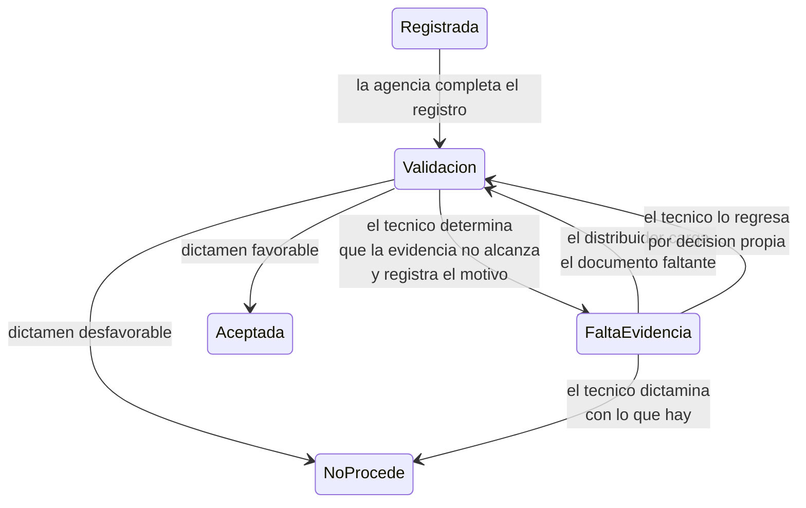
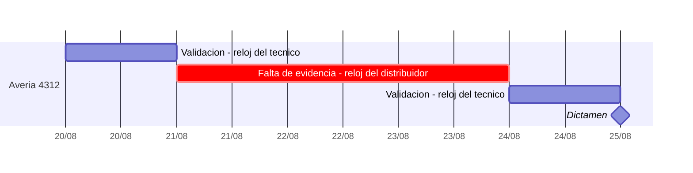
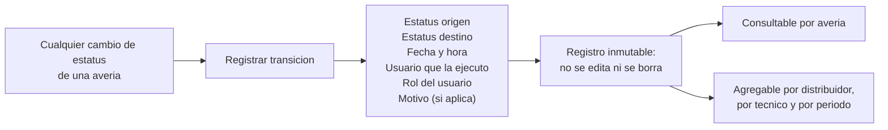

# PRD - Estatus de falta de evidencia y medición de tiempos por responsable

| **Campo** | **Detalle** |
| --- | --- |
| **Proyecto** | Averías de SIGA — estatus de falta de evidencia y bitácora de tiempos por responsable |
| **Área / empresa** | EngineCX (sistema afectado: SIGA; alcance operativo: Garantiplus México, replicable a Colombia y Chile) |
| **Versión** | v1.0 |
| **Fecha** | 2026-09-01 |
| **Autores** | Omar André Lara Saldaña (omar.lara@enginecx.com) |
| **Revisión / liderazgo** | David Simancas Estrada — Controller / Analista Técnico Regional de Averías LATAM, solicitante del cambio |
| **Dirigido a** | Alexis Salvador Herrera García — Equipo de desarrollo de SIGA |
| **Tipo de proyecto** | Feature web/API |
| **Origen** | Sesión del 2026-08-31 con el equipo de Averías (David Simancas, Miguel Ángel Rodríguez, Eduardo Álvarez) |
| **Documento hermano** | `Desarrollos_internos/PJ1544-copiloto-averias/PRD.md` — el Copiloto de Averías, que consume estos datos |

> **Nota sobre versiones anteriores.** Este documento **sustituye por completo** al PRD de la API de Averías de SIGA que ocupaba esta carpeta —las once capacidades y las veinticinco mejoras del `PRD_EXTRAS.md`, fechados el 2026-08-27—, que quedan retirados. Aquel documento pedía la superficie completa que el Copiloto necesitará a lo largo de sus cinco etapas; este pide **una sola cosa**, la que el área de averías identificó como precondición de todo lo demás. Lo retirado sigue disponible en el historial del repositorio y se volverá a levantar, acotado, cuando el Copiloto llegue a su etapa 2.

## 1. Resumen ejecutivo

Hoy una avería en `Validación` significa dos cosas distintas que el sistema no distingue: **que el técnico no la ha trabajado** y **que el técnico ya la trabajó y está esperando evidencia del distribuidor**. Son situaciones opuestas en cuanto a quién debe actuar, y sin embargo ocupan el mismo estatus y consumen el mismo reloj.

La consecuencia es que **el indicador de tiempo de respuesta del área técnica no mide lo que dice medir**. David Simancas lo describió con un caso concreto: *"Miguel contesta a los 5 minutos pidiendo una foto más, y a él no le contestan hasta dentro de dos días, tres días, y ahí a él ya le afectó. A pesar de que no es culpa de él. Y al distribuidor pues tampoco lo medimos."*

Este PRD pide **cuatro cosas**, todas alrededor del mismo hueco:

1. Un **estatus de falta de evidencia** que el técnico pueda aplicar cuando devuelve la avería al distribuidor por documentación incompleta.
2. Una **bitácora de cambios de estatus** que registre cada transición con su fecha, su hora y quién la hizo.
3. Un **reloj por responsable**, que pause el compromiso de respuesta del área técnica mientras el caso espera al distribuidor e impute ese tiempo a quien corresponde.
4. La **exposición de esos tiempos** para consulta y reporte, que es lo que convierte el dato en una herramienta de gestión.

**Por qué ahora.** Es un cambio que el área intentó antes y nunca se desarrolló —*"es algo que hemos intentado cambiar, no se ha desarrollado"*— y que hoy bloquea dos frentes a la vez: la medición honesta del desempeño, y la automatización del ciclo de averías que EngineCX está construyendo. David fue explícito sobre el orden: *"ese estatus no lo hemos desarrollado y creo que es muy importante hacerlo antes de que podamos continuar con estos flujos"*.

## 2. Contexto y problema

### Cómo se comporta hoy una avería que espera evidencia

1. La agencia registra la avería y la pasa a **`Validación`**. Ahí arranca el compromiso de respuesta de **48 horas hábiles** del área técnica.
2. El técnico la revisa y encuentra que la evidencia no alcanza para dictaminar. Según el propio equipo, esto ocurre en la enorme mayoría de los casos: *"yo creo que el 5% de las averías ya con lo que mandan se puede evaluar"*.
3. El técnico solicita al distribuidor lo que falta —el escaneo de la transmisión, el estado del aceite, la factura del servicio—, normalmente por correo o por teléfono.
4. **La avería no se mueve.** David: *"a pesar de que Miguel pida más evidencia o pida algo adicional, la avería sigue en validación. De ahí la avería no se mueve."*
5. El distribuidor responde cuando responde. Pueden ser horas o pueden ser días.
6. Todo ese tiempo se contabiliza como tiempo de respuesta del área técnica.

### Los cuatro efectos del hueco

- **El indicador del técnico está inflado y no es defendible.** Mide la suma de su trabajo y de la espera ajena, sin forma de separarlos. Un técnico que responde en cinco minutos y otro que responde en dos días pueden verse idénticos en el tablero.
- **El distribuidor no se mide en absoluto.** *"El distribuidor pues tampoco lo medimos. Y también es importante empezar a medir a ellos: oye, este distribuidor siempre me dura en contestar 15 horas, 20 horas; este distribuidor contesta muy rápido."*
- **La responsabilidad no está asignada.** Mientras el caso se ve igual esté esperando a quien esté esperando, nada empuja al distribuidor a responder. David lo planteó como el segundo beneficio del cambio: *"cargamos la obligación y la responsabilidad hacia la agencia"*.
- **El equipo comercial no tiene con qué actuar.** El dato de qué distribuidores responden tarde existe en la práctica, pero no en el sistema: *"esto ayuda a que hoy el equipo comercial diga: tenemos estos 15 distribuidores que no dan seguimiento en tiempo, visítalos y ajústalos. De ahí salen muchas cosas."*

### Por qué es una precondición y no una mejora

El área de averías y EngineCX están construyendo el **Copiloto de Averías**, que sigue cada expediente y determina cuándo hay evidencia suficiente para dictaminar. Ese sistema necesita saber **desde cuándo un caso está esperando y a quién**. Puede aproximarlo con su propio registro de eventos, y así está diseñado para no quedarse bloqueado, pero la aproximación no es fuente de verdad ni sirve para medir a nadie oficialmente. Mientras el dato no viva en SIGA, cualquier métrica de tiempos que se publique es una estimación de un tercero.

### Distinciones que conviene fijar antes de diseñar

| Concepto | Significado |
| --- | --- |
| **Estatus vs. bitácora** | El **estatus** dice dónde está el caso ahora. La **bitácora** dice por dónde pasó y cuándo. Son dos entregables distintos y el segundo es el que habilita la medición: un estatus sin historia no permite calcular ninguna duración. |
| **El reloj no se detiene, se reparte** | El caso sigue corriendo en tiempo natural. Lo que cambia es **a quién se le imputa** cada tramo. Nada desaparece del cómputo total. |
| **Falta de evidencia ≠ rechazo** | Es un estado de espera dentro del ciclo normal, no una resolución. La avería no se cierra, no se dictamina y puede volver a `Validación` en cuanto llegue lo que falta. |
| **Quién lo mueve** | Al estatus de falta de evidencia **entra el técnico**, porque es quien determina que la evidencia no alcanza. De él **se sale por acción del distribuidor** —cargar el documento— o por decisión del técnico. |
| **Devolver no es castigar** | El propósito declarado es medir y agilizar, no penalizar al distribuidor. La comunicación que acompañe al cambio de estatus debe reflejarlo. |

## 3. Objetivo del producto

**Que SIGA sepa, en cada momento, si una avería está esperando al área técnica o al distribuidor, y conserve el historial suficiente para medir cuánto tiempo esperó a cada uno.**

De ese objetivo se derivan tres usos concretos: medir con honestidad el tiempo de respuesta del área técnica, medir por primera vez el tiempo de respuesta de cada distribuidor, y darle al equipo comercial una base de datos —no de anécdotas— para conversar con los distribuidores que responden tarde.

**Lo que este PRD no busca.** No busca automatizar el dictamen, no busca modificar el flujo de resolución de averías y no busca cambiar quién decide qué. Solo pide que el sistema pueda representar un estado que hoy existe en la operación y no en la plataforma.

## 4. Usuarios y actores

| **Usuario / Actor** | **Rol en el proceso** |
| --- | --- |
| **Técnico de averías** | Usuario principal. Determina que la evidencia no alcanza y aplica el estatus. En México son **Miguel Ángel Rodríguez** y **Eduardo Álvarez**. Es también el principal beneficiado: su indicador de tiempo deja de cargar la espera ajena. |
| **Distribuidor / agencia** | Quien sube la evidencia faltante y, a partir de este cambio, **sujeto de medición**. Su tiempo de respuesta pasa a ser un dato del sistema. |
| **Responsable de Averías LATAM** | **David Simancas.** Solicitante del cambio y consumidor principal del reporte de tiempos. Define los umbrales de lo que se considera respuesta tardía. |
| **Equipo comercial** | Consumidor final de la métrica por distribuidor. La usa para priorizar visitas y conversaciones con la red. |
| **Equipo de desarrollo de SIGA** | Único que puede implementar el estatus, la bitácora y su exposición. |
| **Sistema — Copiloto de Averías** | Consumidor por API. Usa el estatus y la bitácora para saber desde cuándo espera cada caso y para reportarlo al equipo cada mañana. |

## 5. Alcance MVP y funcionalidades

| **Funcionalidad** | **Descripción** |
| --- | --- |
| **1. Estatus de falta de evidencia** | Nuevo valor en el catálogo de estatus de avería, aplicable desde `Validación`, del que se puede volver a `Validación`. La avería permanece abierta y trabajable. |
| **2. Motivo del retorno** | Al aplicar el estatus, el técnico indica **qué falta**, de un catálogo cerrado y con la posibilidad de detallar. Es lo que hace accionable el estado, tanto para el distribuidor como para el reporte. |
| **3. Bitácora de cambios de estatus** | Registro inmutable de cada transición de la avería: estatus origen, estatus destino, fecha y hora, usuario que la ejecutó y motivo cuando aplique. Aplica a **todas** las transiciones, no solo a la nueva. |
| **4. Reloj por responsable** | Cálculo, sobre la bitácora, del tiempo acumulado que cada avería pasó imputable al área técnica y al distribuidor. El compromiso de 48 horas hábiles se computa solo sobre el tramo del área técnica. |
| **5. Exposición de tiempos** | Los tiempos y la bitácora consultables desde la interfaz de SIGA y desde la API, tanto por avería como agregados por distribuidor y por técnico. |
| **6. Permisos** | Solo el rol técnico —y los roles que el área designe— puede aplicar el estatus. El distribuidor no puede sacarse a sí mismo del estado salvo cargando el documento. |

### Qué es el MVP

Las funcionalidades **1, 2 y 3** son el mínimo indispensable: sin ellas no hay dato. La **4** y la **5** convierten el dato en información y son lo que le da valor al área; se piden juntas porque un dato que nadie puede consultar no cambia nada. La **6** es una condición de integridad, no una funcionalidad separable.

## 6. Fuera de alcance

- **Alerta automática al distribuidor.** El área la planteó en la sesión como uso derivado del estatus. **Se retira deliberadamente de este PRD** por decisión de alcance del 2026-09-01: primero el dato, después las automatizaciones que se apoyen en él. Si se decide construirla, se pedirá por separado y con su propio análisis: a quién se notifica, con qué frecuencia, con qué texto y con qué política de recordatorios.
- **Que el Copiloto de Averías escriba este estatus.** El Copiloto lo lee; aplicarlo es acción del técnico. Si en el futuro se quiere que lo escriba, es una petición aparte con su propio análisis de riesgo.
- **Cambiar el flujo de dictamen.** `Aceptada` y `No procede garantía` siguen funcionando exactamente igual, y las transiciones que el área técnica puede mover no se amplían más allá de lo que este PRD pide.
- **Redefinir el SLA de 48 horas hábiles.** El compromiso no cambia; cambia sobre qué tramo se calcula.
- **Endpoint de resolución de averías, tipo de documento "Resolución" y desglose de presupuesto.** Son capacidades que el Copiloto de Averías necesitará en sus etapas 2 y 3 y que **no se piden aquí**. Se registran para que no se lean como olvido y se levantarán acotadas cuando corresponda.
- **Reportes de desempeño ya construidos.** Este PRD pide que el dato exista y sea consultable; los tableros que se construyan sobre él son trabajo posterior.
- **Aplicar el cambio a Colombia y Chile.** El alcance es México. El diseño no debería impedir replicarlo, pero su despliegue regional es otra conversación.

## 7. Flujos principales

### 7.1 Ciclo de la avería con el nuevo estatus

**Dos decisiones que este diagrama fija.** La primera: **de `Falta de evidencia` se puede dictaminar directamente**, sin pasar por `Validación`. Un caso puede quedarse esperando evidencia indefinidamente y el técnico necesita poder resolverlo con lo que tenga sin fingir un retorno. La segunda: **el estatus es reversible tantas veces como haga falta**. Un mismo caso puede entrar y salir varias veces si la evidencia llega en tandas, y cada ciclo se registra por separado.

### 7.2 Cómo se reparte el reloj

En el ejemplo, la avería tardó **cinco días naturales** en resolverse. Hoy los cinco se le imputan al técnico. Con el cambio, **dos** se le imputan al área técnica —y caben holgadamente en las 48 horas hábiles— y **tres** al distribuidor. El total no cambia; cambia de quién es cada tramo.

### 7.3 Qué necesita registrar la bitácora

La bitácora se pide para **todas** las transiciones y no solo para las del nuevo estatus. La razón es práctica: para calcular el tramo imputable al técnico hace falta saber cuándo entró la avería a `Validación`, y ese dato hoy tampoco se conserva de forma consultable.

## 8. Requerimientos funcionales

| **ID** | **Requerimiento** | **Descripción** |
| --- | --- | --- |
| **RF-01** | Nuevo estatus en el catálogo de averías | Un valor de estatus para la falta de evidencia, con identificador estable. El nombre exacto lo define el área; en la sesión se mencionaron *"falta de evidencia"* y *"documentación incompleta"*. |
| **RF-02** | Transición desde `Validación` | El técnico puede mover una avería de `Validación` al nuevo estatus. |
| **RF-03** | Retorno a `Validación` | La avería vuelve a `Validación` cuando el distribuidor carga un documento, y también por acción explícita del técnico. |
| **RF-04** | Dictamen directo desde el nuevo estatus | El técnico puede dictaminar (`Aceptada` o `No procede garantía`) sin pasar antes por `Validación`. |
| **RF-05** | Reversibilidad ilimitada | Una avería puede entrar y salir del estatus tantas veces como haga falta, y cada ciclo se registra por separado. |
| **RF-06** | La avería permanece abierta | El estatus **no cierra** la avería, no la cancela y no la excluye de la carga de documentos ni de la bandeja del técnico. |
| **RF-07** | Motivo obligatorio al aplicar el estatus | Al mover la avería, el técnico indica qué falta, de un catálogo cerrado y con campo de detalle opcional. |
| **RF-08** | Catálogo de motivos administrable | Los motivos de falta de evidencia se administran desde la plataforma, con identificador estable, sin requerir despliegue. |
| **RF-09** | Bitácora de todas las transiciones | Cada cambio de estatus de cualquier avería se registra con estatus origen, estatus destino, fecha y hora, usuario, rol del usuario y motivo cuando aplique. |
| **RF-10** | Bitácora inmutable | Los registros de la bitácora no se editan ni se borran. Una corrección se hace con una transición nueva, no reescribiendo la historia. |
| **RF-11** | Bitácora retroactiva si es posible | Si la base ya conserva de alguna forma los cambios de estatus históricos, se cargan a la bitácora. Si no, se declara la fecha desde la que hay historia. |
| **RF-12** | Cómputo del tiempo por responsable | Por cada avería, el tiempo acumulado imputable al área técnica y el imputable al distribuidor, calculados sobre la bitácora. |
| **RF-13** | El SLA se computa solo sobre el tramo técnico | El compromiso de 48 horas hábiles se calcula exclusivamente sobre el tiempo en estatus imputables al área técnica. |
| **RF-14** | Tiempos en horas hábiles y naturales | Ambos cálculos disponibles: el hábil para el SLA, el natural para la conversación con el distribuidor. |
| **RF-15** | Consulta por avería | La bitácora y los tiempos de una avería, visibles en su ficha en SIGA. |
| **RF-16** | Consulta agregada por distribuidor | Tiempo promedio y mediano de respuesta por distribuidor, en un periodo, con el número de casos que lo sustenta. |
| **RF-17** | Consulta agregada por técnico | El equivalente para el área técnica, con el tiempo imputable ya separado. |
| **RF-18** | Exposición por API | La bitácora y los tiempos consultables por API, para que el Copiloto de Averías y cualquier otro consumidor los usen sin depender de la interfaz. |
| **RF-19** | Permiso de aplicación del estatus | Solo el rol técnico y los roles que el área designe pueden aplicar el nuevo estatus. |
| **RF-20** | El distribuidor no se autoexcluye | El usuario distribuidor no puede mover la avería fuera del estatus salvo por el efecto de cargar el documento faltante. |
| **RF-21** | Visibilidad para el distribuidor | El distribuidor ve en su portal que la avería está en falta de evidencia y **qué se le está pidiendo**. Sin eso, el estatus no cumple su función de trasladar la responsabilidad. |

## 9. Requerimientos no funcionales

| **ID** | **Requerimiento** | **Descripción** |
| --- | --- | --- |
| **RNF-01** | **No romper lo que existe** | Las averías vigentes, los reportes actuales y las integraciones que consumen el estatus deben seguir funcionando. Un valor nuevo en el catálogo no puede hacer fallar a un consumidor que no lo conoce. |
| **RNF-02** | **Identificadores estables** | El identificador del estatus y los de los motivos no cambian entre ambientes ni entre despliegues. Cualquier consumidor externo los va a persistir. |
| **RNF-03** | **La bitácora es la fuente de verdad** | Los tiempos se calculan desde la bitácora y no se almacenan como campos que puedan divergir de ella. |
| **RNF-04** | **Trazabilidad de la autoría** | Toda transición queda atribuida a un usuario identificable. Ninguna transición es anónima, incluidas las que dispare el sistema. |
| **RNF-05** | **Consistencia del reparto** | La suma de los tramos imputados a cada responsable debe igualar el tiempo total transcurrido. Un tramo sin dueño es un defecto. |
| **RNF-06** | **Definición explícita del horario hábil** | El cálculo en horas hábiles necesita una definición documentada de jornada, días laborables y festivos, y debe ser configurable por país. |
| **RNF-07** | **Coherencia con la interfaz** | Los tiempos que muestre la API y los que muestre SIGA deben ser el mismo número, calculado del mismo modo. |
| **RNF-08** | **Sin datos personales innecesarios** | La bitácora registra usuario y rol, no datos del beneficiario. |
| **RNF-09** | **Replicabilidad por país** | El diseño no debe impedir habilitar el estatus en Colombia y Chile, aunque su despliegue no sea parte de este alcance. |

## 10. Integraciones y datos

| **Integración / Fuente** | **Uso esperado** |
| --- | --- |
| **Catálogo de estatus de averías** | Alta del nuevo valor con identificador estable. Hoy conviven **11 estatus reales** en la operación, con variantes por país. |
| **Módulo de averías de SIGA** | Aplicación del estatus, captura del motivo y visualización de la bitácora en la ficha de la avería. |
| **Portal del distribuidor** | Visibilidad del estatus y de lo que se le está pidiendo (RF-21). |
| **Carga de documentos de la avería** | Evento que dispara el retorno automático a `Validación` (RF-03). |
| **API de Averías** | Exposición de la bitácora y de los tiempos calculados (RF-18). Consumidor conocido: el Copiloto de Averías. |
| **Reportes y tableros del área** | Consumo de los tiempos agregados por distribuidor y por técnico. |

### Datos nuevos que este cambio crea

| Dato | Dónde vive | Quién lo consume |
| --- | --- | --- |
| Estatus de falta de evidencia | Catálogo de estatus | Todo el ciclo de la avería |
| Motivo de la falta de evidencia | Catálogo administrable + registro en la avería | El distribuidor, el reporte, el Copiloto |
| Bitácora de transiciones | Tabla nueva, inmutable | Cálculo de tiempos, auditoría, Copiloto |
| Tiempo imputable al área técnica | Calculado sobre la bitácora | SLA, evaluación del equipo |
| Tiempo imputable al distribuidor | Calculado sobre la bitácora | Evaluación de la red, equipo comercial |

## 11. Eventos para BI

| Evento | Datos que registra |
| --- | --- |
| `averia_cambio_estatus` | idAvería, estatus origen, estatus destino, fecha y hora, usuario, rol, motivo |
| `averia_marcada_falta_evidencia` | idAvería, motivo, usuario, distribuidor, fecha y hora, nº de veces que ya había entrado al estatus |
| `averia_retorno_a_validacion` | idAvería, cómo volvió (carga de documento o acción del técnico), horas transcurridas en el estatus |
| `documento_cargado_en_falta_evidencia` | idAvería, tipo de documento, usuario, si resolvió el motivo registrado |
| `averia_dictaminada_desde_falta_evidencia` | idAvería, dictamen, motivo pendiente al momento de dictaminar |

El evento **`averia_retorno_a_validacion`** es el que sostiene toda la medición del distribuidor: su duración es, literalmente, lo que hoy no se puede saber.

## 12. Métricas de éxito

| **Métrica** | **Descripción** | **Criterio** |
| --- | --- | --- |
| **Adopción del estatus** | % de averías que en algún momento pasan por falta de evidencia | Se espera **alto**: el área estima que solo el 5% de los casos es evaluable con lo que llega de entrada. Una adopción baja indicaría que el estatus no se está usando, no que no hace falta |
| **Cobertura de la bitácora** | % de transiciones de estatus con registro completo | **100%.** Una transición sin registro es un defecto |
| **Tiempo imputable al área técnica** | Mediana y p90 del tramo técnico, antes y después del cambio | Baja esperada respecto del indicador actual. **Es el objetivo del proyecto**: no que el equipo trabaje más rápido, sino que el indicador diga la verdad |
| **Tiempo imputable al distribuidor** | Mediana y p90 por distribuidor | **Dato nuevo, sin línea base.** Su valor está en existir |
| **Cumplimiento real del SLA** | % de casos dentro de 48 horas hábiles computadas solo sobre el tramo técnico | Se mide desde el primer mes. La línea base actual —mediana de 4.1 días y p90 de 50.1 días en México, medida sobre el reloj indiferenciado— no es comparable |
| **Distribuidores identificados como lentos** | Nº de distribuidores por encima del umbral que fije el área | Se reporta al equipo comercial. Es el entregable que David describió como *"visítalos y ajústalos"* |
| **Motivos más frecuentes** | Distribución de los motivos de falta de evidencia | Insumo directo para el catálogo de evidencia mínima del área y para la ayuda contextual al cargar documentos |
| **Reincidencia** | Nº de veces que una misma avería entra al estatus | Un promedio alto indica que las solicitudes de evidencia no están siendo claras |

## 13. Riesgos y supuestos

### Riesgos

| **Riesgo** | **Impacto potencial** | **Mitigación** |
| --- | --- | --- |
| **El estatus se usa como estacionamiento.** Un técnico con carga alta puede mover casos a falta de evidencia para detener su reloj sin haber pedido nada real. | **Alto** — corrompe justo la métrica que el cambio busca arreglar | Motivo obligatorio de catálogo (RF-07); visibilidad del motivo para el distribuidor (RF-21), que hace verificable la solicitud; monitoreo de la métrica de reincidencia y de casos que entran al estatus sin comunicación asociada |
| **El estatus no se usa.** Si aplicarlo cuesta más clics que no aplicarlo, no se aplica, y el dato nunca aparece. | **Alto** — el proyecto no entrega nada | Que aplicarlo sea parte del acto de pedir la evidencia, no un paso administrativo aparte. Medir la adopción desde la primera semana y ajustar la interacción si es baja |
| **Un consumidor existente falla ante el estatus nuevo.** Reportes, integraciones o pantallas que asumen el conjunto actual de estatus. | Alto | Inventario de consumidores del catálogo de estatus antes de liberar (RNF-01); despliegue con el nuevo valor visible pero no aplicable, para verificar que nada se rompe |
| **No hay historia previa que cargar en la bitácora.** Si la base no conserva los cambios de estatus, la medición arranca de cero y no habrá comparación con el pasado. | Medio | Verificarlo en la fase de análisis (RF-11). Si no hay historia, declararlo explícitamente y fijar la fecha de inicio de la serie en lugar de publicar comparaciones inválidas |
| **El horario hábil no está definido con precisión** y cada reporte calcula distinto. | Medio | Definición documentada y configurable por país (RNF-06), acordada con el área antes de implementar |
| **El distribuidor percibe el cambio como una forma de culparlo.** | Medio | Es un riesgo de comunicación, no técnico. El área debe acompañar el despliegue explicando que el propósito es agilizar y dar visibilidad. La redacción de lo que ve el distribuidor importa |
| **Se difiere por considerarse menor.** Es un cambio pequeño frente a otros pendientes de la plataforma y podría postergarse indefinidamente, como ya ocurrió. | Medio | Este PRD documenta que es **precondición** de la automatización del ciclo de averías, y que el área lo intentó antes sin éxito |

### Supuestos

| **Supuesto** | **Descripción** |
| --- | --- |
| El catálogo de estatus admite valores nuevos | Se asume que agregar un estatus es una operación de configuración y no un cambio estructural. **Por verificar con el equipo de SIGA.** |
| La carga de documentos es un evento detectable | El retorno automático a `Validación` (RF-03) depende de que la plataforma pueda reaccionar a la carga de un documento por parte del distribuidor. |
| El portal del distribuidor puede mostrar el motivo | RF-21 asume que existe una superficie donde el distribuidor ve el estado de sus averías. |
| El área define el nombre y los motivos | El nombre exacto del estatus y el catálogo inicial de motivos los entrega el área de averías, no el desarrollo. |
| El SLA de 48 horas hábiles es el compromiso vigente | Se asume que no cambia y que solo cambia su base de cálculo. |
| El cambio aplica primero a México | Colombia y Chile quedan para una decisión posterior, aunque el diseño no debería impedirlo. |

## 14. Preguntas abiertas

| **Tema** | **Pregunta abierta** |
| --- | --- |
| 🔴 **Nombre** | **¿Cómo se llama el estatus?** En la sesión se mencionaron *"falta de evidencia"* y *"documentación incompleta"*. Lo define el área, y conviene que sea el mismo término en los tres países. |
| 🔴 **Factibilidad** | **¿Agregar un estatus al catálogo es configuración o desarrollo?** De la respuesta depende el tamaño real de este proyecto. Pregunta directa al equipo de SIGA. |
| 🔴 **Historia** | **¿La base conserva los cambios de estatus históricos?** Si sí, la medición arranca con comparación contra el pasado; si no, arranca de cero y hay que decirlo. |
| 🔴 **Motivos** | **¿Cuál es el catálogo inicial de motivos de falta de evidencia?** Debería alinearse con el documento de evidencia mínima por sistema que el área está preparando. |
| **Retorno automático** | **¿Cualquier documento cargado devuelve la avería a `Validación`, o solo uno que corresponda al motivo registrado?** Lo primero es simple y puede generar retornos falsos; lo segundo es más fino y exige relacionar motivo con tipo de documento. |
| **Horario hábil** | **¿Cuál es la definición oficial de jornada, días laborables y festivos** para el cómputo del SLA en México? |
| **Umbral** | **¿A partir de cuántas horas se considera que un distribuidor respondió tarde?** Lo necesita el reporte del equipo comercial. |
| **Casos sin respuesta** | **¿Qué pasa con una avería que lleva semanas en falta de evidencia?** ¿Se cierra automáticamente, se escala, se queda abierta indefinidamente? Hoy no hay política y el estatus la va a hacer visible. |
| **Visibilidad** | **¿Qué ve exactamente el distribuidor** y por qué canal se entera? Sin la alerta automática —fuera de alcance—, depende de que entre al portal. |
| **Alcance regional** | **¿Se habilita también en Colombia y Chile, y cuándo?** El diseño lo permitiría; la decisión es del área. |
| **Plazo** | **¿En qué plazo puede el equipo de SIGA entregarlo?** El área lo declaró precondición de los flujos de automatización, así que la fecha condiciona un segundo proyecto. |
| **Reportes** | **¿Los tableros sobre estos tiempos los construye SIGA o el área?** Este PRD pide el dato y su consulta; los tableros son trabajo posterior sin dueño asignado. |
