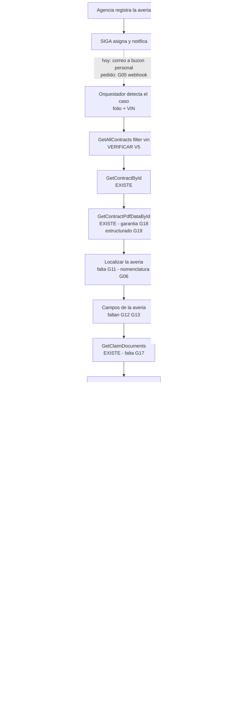
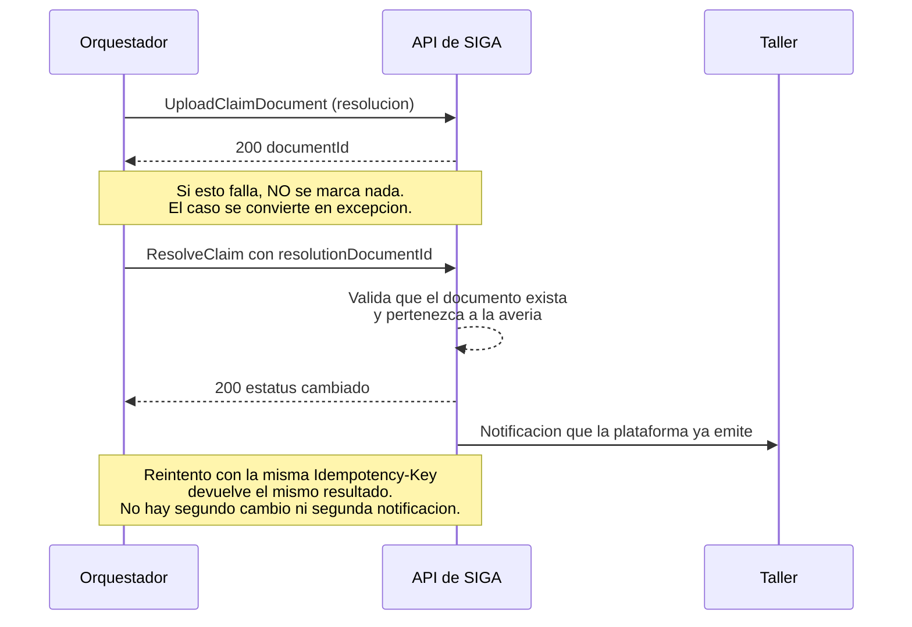

# PRD - API de Averías de SIGA: las 11 capacidades imprescindibles

| **Campo** | **Detalle** |
| --- | --- |
| **Proyecto** | API de Averías de SIGA — capacidades imprescindibles para automatizar el ciclo de dictamen |
| **Área / empresa** | EngineCX (sistema afectado: SIGA; alcance: Garantiplus México) |
| **Versión** | v1.0 — final para revisión |
| **Fecha** | 2026-08-27 |
| **Autores** | Omar André Lara Saldaña (omar.lara@enginecx.com) |
| **Dirigido a** | Alexis Salvador Herrera García — Equipo de desarrollo de la API de SIGA |
| **Tipo de proyecto** | Feature web/API |
| **Documento hermano** | `PRD_EXTRAS.md` — las otras 25 solicitudes, que **mejoran** el sistema pero no lo bloquean |
| **Origen** | `Desarrollos_internos/PJ1544-copiloto-averias/PRD.md` v0.2 — el desarrollo que consume estas capacidades |

> **Qué pide este documento y qué no.** Pide **once capacidades**. Son las únicas sin las cuales el Copiloto de Averías **no puede funcionar**: no es que funcione peor, es que no hay forma de construirlo. Todo lo demás que se identificó al analizar la API —otras 25 mejoras— está en `PRD_EXTRAS.md`, separado a propósito para que esta lista se pueda leer y decidir de una sentada.
>
> **Todo lo que aquí se afirma sobre la API está verificado** contra los OpenAPI publicados en `qa-siga-api.garantiplus.com`, capturados el 2026-08-26. La especificación está generada desde el código —los esquemas incluyen artefactos de reflexión de .NET—, así que **"no está en el spec" equivale a "no está en los controladores"**.
>
> **Los nombres son una propuesta, no una imposición.** Rutas, campos y códigos se ofrecen como forma concreta para facilitar la conversación; la nomenclatura es del equipo que mantiene la API. Lo que no es negociable son las **reglas de integridad** del §2.3, porque de ellas depende que el sistema no pueda causar daño.

## 1. Resumen ejecutivo

EngineCX está construyendo el **Copiloto de Averías**: una automatización que, cuando SIGA asigna una avería a un técnico, reúne el expediente, dictamina la procedencia contra el condicionado del contrato y le entrega al técnico el veredicto razonado y el documento de resolución ya capturado.

**La primera etapa no necesita nada de este documento y ya puede arrancar.** La lectura que la API expone hoy —contratos por VIN, detalle del vehículo, texto del certificado, averías y evidencia descargable— alcanza para dictaminar y documentar. Se dice de entrada porque importa: **no estamos bloqueados esperando esto**. Lo que este documento desbloquea es el cierre del ciclo.

**Las once solicitudes, y qué desbloquea cada bloque:**

| Bloque | Solicitudes | Qué permite |
| --- | --- | --- |
| **Resolver una avería** | **G21**, **G15**, **G23** | Que el sistema marque `No procede garantía` con su motivo y deje constancia de quién decidió. Hoy el técnico entra a la plataforma a marcarlo a mano |
| **Hacerlo con seguridad** | **G03**, **G04**, **G22** | Un rol acotado que solo pueda resolver; reintentos que no dupliquen; y un tipo de documento donde adjuntar la resolución |
| **Consultar sin ambigüedad** | **G06**, **G16** | Que una consulta mal formada falle en lugar de devolver vacío; y saber qué pieza se reclama, que es la base del dictamen |
| **Deliberar el caso favorable** | **G26**, **G27**, **G28** | Verificar que el presupuesto cuadre y respete los límites del contrato, y aceptar registrando quién autorizó y qué |

**Por qué vale la pena.** En México, entre enero y julio de 2026 entraron **1 582 averías y 604 (38.2%) terminaron en `No procede garantía`**. De esos rechazos, **330 (54.6%)** responden a cuatro causales verificables contra el texto del contrato: intervalo de mantenimiento excedido 29.1%, componente excluido 15.7%, fuga excluida 6.8% y sin vigencia 3.0%. Es **una de cada cinco averías del país**, y hoy cada una se trabaja completa: crear, descargar información, generar la resolución, teclear los datos, enviar.

**Dos notas para que la lectura sea justa.** Primera: **seis de las once probablemente no requieren desarrollo nuevo.** G06 es corregir la documentación; G22 es confirmar un identificador que la propia descripción del servicio sugiere que ya existe; G16 y G26 piden exponer datos que **ya están en la base**, porque el tablero del área los consume. Segunda: **ninguna solicitud es un ultimátum.** Cada una dice explícitamente qué pasa si se pospone, para que se pueda priorizar con criterio.

## 2. Contexto y problema

### 2.1 El proceso que se quiere automatizar

1. El cliente lleva el vehículo a la agencia. En más del 90% de los casos llega **sin llamar antes**.
2. **La agencia registra la avería en SIGA** y sube evidencia. La plataforma exige al menos un documento en cada uno de tres tipos —evidencias, presupuesto, fotos de odómetro— antes de dejarla avanzar.
3. SIGA **asigna la avería a un técnico** por round-robin y **le envía un correo** con el asunto `Asignación de avería {folio} / Vin {VIN}`. **Ese correo trae solo folio y VIN**: es la única llave con la que arranca la automatización.
4. La agencia pasa la avería a **`Validación`**. Ahí arranca el compromiso contractual de **48 horas hábiles** —cláusula 10 del certificado— y solo entonces el técnico puede trabajarla.
5. El técnico descarga el certificado, revisa la evidencia y **dictamina `Aceptada` o `No procede garantía`**. Es el único tramo de estatus que el área técnica puede mover.
6. Redacta la **resolución** en un formato de Word externo a la plataforma, tecleando a mano folio, contrato, fecha, marca, modelo y datos de la unidad **que ya están en pantalla**, y la sube al expediente. Ese documento tiene **valor legal**: la agencia se lo entrega al cliente.
7. Si fue aceptada, la agencia mueve `Taller` → `Solucionada` y se procesa el pago.

### 2.2 Las cinco etapas y qué bloquea cada una

| Et. | Qué automatiza el Copiloto | Escritura en SIGA | Solicitudes que la desbloquean |
| :-: | --- | --- | --- |
| **1** | Reúne el expediente, dictamina, redacta la resolución de improcedencia y entrega la plantilla capturada en todos los casos | **Ninguna** | **Ninguna bloqueante.** G11–G20 la mejoran |
| **2** | Sube la resolución y marca `No procede garantía` | Documento + estatus, solo improcedencias | **G21** ⛔, **G23** ⛔, **G03** ⛔, **G04** ⛔, **G06** ⛔, G22, G24, G25, G36 |
| **3** | Valida cobertura, verifica que el presupuesto cuadre, propone autorizar; el técnico aprueba caso por caso | `Aceptada`, solo tras aprobación humana | **G26** ⛔, **G27** ⛔, **G28** ⛔, G29 |
| **4** | El humano revisa un expediente ya armado en lugar de construirlo | Igual que la etapa 3 | G30, G31, G32, G35 |
| **5** | Colombia y Chile operados desde México | Igual, por país | **G33** ⛔, G34 |

### 2.3 Tres reglas de integridad que la forma de los endpoints debe garantizar

No son preferencias de diseño: son restricciones que el Copiloto tiene que poder cumplir, y **la forma del endpoint decide si son cumplibles o si dependen de que el cliente se porte bien**. Se piden verificadas del lado del servidor.

| Regla | Por qué | Qué implica para el endpoint |
| --- | --- | --- |
| **Ningún rechazo sin resolución adjunta** | Es el antipatrón que ya existe hoy: cuando un distribuidor captura solo refacciones no cubiertas, la plataforma rechaza y cierra la avería **sin cargar resolución ni información alguna**, y cuando la agencia reclama nadie sabe qué contestar | El endpoint de resolución debe **exigir la referencia al documento** y rechazar la operación si no existe. **G21** |
| **Ninguna autorización sin un humano identificado** | Un rechazo mal fundado se reclama y se corrige; una autorización mal fundada se paga. El Copiloto nunca autoriza por sí mismo | El endpoint de aceptación debe **exigir un campo de atribución de la persona que aprobó**, distinto de la identidad que llama. **G23**, **G28** |
| **Ningún fallo silencioso** | Un filtro con el nombre de propiedad equivocado hoy devuelve **una lista vacía con HTTP 200**, indistinguible de "no hay resultados" | Nomenclatura documentada y consistente, y error explícito ante propiedad desconocida. **G06** |

### 2.4 Estado actual verificado

**Cuatro microservicios**, y solo cuatro: `authentication`, `catalogs`, `contracts`, `claims`. Se probaron y descartaron quince nombres más —`payments`, `reports`, `notifications`, `documents`, `users`, `sales`, `policies`, `vehicles`, `workshops`, `dealers`, `audit`, `files`, `storage`, `integrations`, `webhooks`—, todos 404.

**Ausencias confirmadas por conteo exhaustivo de cadenas sobre el JSON completo del spec de `claims`:**

| Cadena | Ocurrencias | Conclusión |
| --- | :-: | --- |
| `reason` | **0** | No existe el motivo de rechazo en ninguna entidad |
| `history` | **0** | No existe historial de estatus |
| `followup`, `comment`, `seguimiento`, `observacion` | **0** | El seguimiento de la avería no está expuesto, aunque la plataforma lo tiene en la interfaz y notifica por correo |
| `labor`, refacciones | **0** | No hay mano de obra ni refacciones |
| `budget` | **1** | Solo en la prosa descriptiva del servicio; no hay endpoint |
| `odomet` | 9 | **Todas en incidencias.** Ninguna en `ClaimResponse` |

**Lo que la API sí entrega hoy, y que hace posible la etapa 1:** contrato filtrable por VIN, detalle completo del vehículo, **texto extraído del certificado** (`GetContractPdfDataById`), avería con su descripción y estatus, y listado y descarga de la evidencia cargada.

### 2.5 Coherencia con el propósito declarado del propio servicio

Estas solicitudes no introducen un caso de uso ajeno: **completan lo que la documentación del servicio ya promete.**

- La descripción de `claims` dice que permite *"register claims, upload supporting documentation, and **monitor claim status**"*, ofrece *"Document management for claims (budgets, **resolutions**, photographic/video evidence)"* y *"**Claims tracking and reporting** with flexible filtering"*, con *"Multi-role access control (workshops, **technicians**, **coordinators**, administrators)"*. Sin embargo no expone escritura de estatus, ni historial, ni motivo, ni presupuesto.
- La API **ya está diseñada contemplando un agente automatizado**: `ConvertToClaim` documenta *"Human action — the agent never converts automatically"*, y `CreateIssueRequest.odometer` dice *"Already converted to a number by the conversational agent (from text, photo, or voice note)"*. El consumidor que este PRD representa ya estaba previsto.
- **Multi-país ya es el plan declarado**: *"Multi-country support (currently MEX, expandable to other markets)"*. La etapa 5 se apoya en esa intención, no la inventa.

## 3. Objetivo

Exponer las once capacidades que permiten al Copiloto cerrar el ciclo de dictamen —marcar el resultado y registrarlo con su sustento— sin intervención manual de captura, conservando en manos de una persona toda decisión con efecto económico.

### 3.1 Fases de entrega sugeridas

| Fase | Solicitudes | Desbloquea |
| --- | --- | --- |
| **A — Confirmaciones** | **G06**, **G22** | Casi sin desarrollo: corregir la documentación de OData y confirmar el tipo de documento de resolución. Elimina el riesgo de fallo silencioso y verifica que se puede adjuntar la resolución |
| **B — Datos del dictamen** | **G15**, **G16** | El catálogo normalizado de motivos y el componente reclamado. Ambos existen en la base |
| **C — Resolución** | **G21**, **G23**, **G03**, **G04** | **Etapa 2 del Copiloto:** el ciclo del rechazo se cierra solo |
| **D — Caso favorable** | **G26**, **G27**, **G28** | **Etapa 3 del Copiloto:** el 61.8% de los casos que hoy se documentan a mano |

## 4. Usuarios y actores

| Actor | Rol frente a la API |
| --- | --- |
| **Orquestador (n8n)** | Consumidor principal. Autentica como identidad de servicio, lee el expediente y ejecuta las escrituras acotadas de su etapa |
| **Agente de cobertura** | Solo lectura, a través del orquestador. Consume el condicionado y la evidencia. Nunca llama a la API directamente |
| **Agente de presupuesto** | Aparece en la etapa 3. Solo lectura. Consume el presupuesto desglosado y los límites del contrato |
| **Técnico de averías** | No consume la API. Es quien **aprueba** las autorizaciones, y su identidad debe viajar en la escritura correspondiente |
| **Identidad de servicio** | El sujeto que autentica. Hoy solo existe login de persona con usuario y contraseña |
| **Equipo de desarrollo de SIGA** | Destinatario de este documento |

## 5. Las once solicitudes

Todas son **⛔ bloqueantes** salvo **G22**, que es una confirmación de la que depende una regla de integridad. Cada una sigue la misma estructura: el paso del proceso que la necesita, por qué, **el estado actual verificado**, el contrato propuesto, los criterios de aceptación y la consecuencia de no atenderla.

### 5.1 Resolver una avería

#### G21 · Resolver una avería — etapa 2 · ⛔ BLOQUEANTE

**Paso del proceso que lo necesita:** paso 5. Es el dictamen: pasar de `Validación` a `Aceptada` o a `No procede garantía`.

**Por qué es necesario.** Es **el bloqueo principal de todo el proyecto**. Sin esta capacidad el Copiloto puede reunir el expediente, dictaminar y redactar la resolución, pero un técnico tiene que entrar a la plataforma a marcar el resultado a mano. En México eso son **604 expedientes al año** solo del lado del rechazo, de los cuales **330 tienen causal verificable** contra el texto del contrato.

**Estado actual verificado.** No existe ninguna vía de escritura sobre el estatus de una avería. `ClaimResponse.statusId` aparece únicamente como campo de respuesta. El único `status` escribible del servicio es `UpdateIssueRequest.status`, que opera sobre **incidencias**, una entidad distinta. La cadena `reason` no aparece **ninguna vez** en el spec completo, así que tampoco existe dónde registrar el motivo.

**Lo que se pide**

- **Método y ruta:** `PATCH /api/Claims/v1/ResolveClaim/{claimId}`

  Un solo endpoint para los dos desenlaces, porque es una sola transición de negocio y el área técnica solo puede mover ese tramo. Si el equipo prefiere dos rutas separadas, la semántica y las reglas de integridad son las mismas.

- **Cabeceras:** `Idempotency-Key` obligatoria (**G04**).

- **Petición:**

  | Campo | Tipo | Obligatorio | Notas |
  | --- | --- | :-: | --- |
  | `targetStatusId` | int | **sí** | Solo se aceptan los de `Aceptada` y `No procede garantía`, del catálogo de **G14** |
  | `rejectionReasonId` | int | **condicional** | **Obligatorio** cuando el destino es `No procede garantía`. Del catálogo de **G15** |
  | `resolutionDocumentId` | int | **sí** | Documento ya cargado en el expediente vía `UploadClaimDocument`. **Regla de integridad** |
  | `comment` | string | **sí** | Sustento del dictamen, en texto libre. Es lo que hoy se escribe en el seguimiento |
  | `approvedBy` | string | **condicional** | **Obligatorio** cuando el destino es `Aceptada` (**G23**). Identificador de la persona que aprobó |

- **Respuesta 200:**

  ```json
  {
    "claimId": 3246,
    "previousStatus": "Validación",
    "status": "No procede garantía",
    "rejectionReason": "Intervalo de Mantenimiento Excedido",
    "resolutionDocumentId": 91733,
    "resolvedAt": "2026-08-27T10:14:22-06:00",
    "resolvedBy": "svc-copiloto-averias",
    "approvedBy": null,
    "alreadyResolved": false
  }
  ```

  `alreadyResolved: true` cuando la llamada se repite con la misma `Idempotency-Key`, devolviendo el resultado original sin volver a aplicarlo.

- **Errores — cada uno distinguible, ninguno silencioso:**

  | Código | Cuándo |
  | --- | --- |
  | `400` | Cuerpo mal formado o `targetStatusId` fuera de los dos permitidos |
  | `401` | Sin token válido |
  | `403` | La identidad no tiene el permiso de resolución |
  | `404` | La avería no existe |
  | `409` | La avería **no está en `Validación`**. El cuerpo debe indicar el estatus actual |
  | `422` | Falta `rejectionReasonId` al rechazar, falta `approvedBy` al aceptar, o `resolutionDocumentId` no existe o no pertenece a esa avería |

- **Permisos:** rol de área técnica —técnico o coordinador— y el rol de servicio de **G03**. Explícitamente **no** los roles de taller ni de distribuidor.

- **Idempotencia:** obligatoria por `Idempotency-Key`. Un reintento por timeout **no debe** producir una segunda resolución.

- **Efectos colaterales esperados:** la misma notificación por correo que la plataforma ya emite hoy cuando el técnico dictamina, y una entrada de auditoría (**G25**). El Copiloto **no** quiere sustituir esas notificaciones: quiere que sigan ocurriendo igual que cuando dictamina una persona.

**Criterios de aceptación**

1. Resolver una avería en `Validación` con todos los campos válidos devuelve `200` y el estatus queda cambiado en la plataforma.
2. Resolver con destino `No procede garantía` **sin** `rejectionReasonId` devuelve `422` y **no** cambia nada.
3. Resolver **sin** `resolutionDocumentId` válido devuelve `422` y **no** cambia nada. *(Esta es la regla que evita el rechazo sin resolución.)*
4. Resolver con destino `Aceptada` **sin** `approvedBy` devuelve `422` y **no** cambia nada.
5. Resolver una avería que ya está en `Aceptada`, `Cerrada` o `Taller` devuelve `409` e indica el estatus actual.
6. Repetir la llamada con la misma `Idempotency-Key` devuelve `200` con `alreadyResolved: true` y **no** produce un segundo cambio ni una segunda notificación.
7. Un token con rol de taller o distribuidor recibe `403`.
8. Tras la operación, la avería consultada por `GetClaims` refleja el nuevo estatus **y** el motivo.

**Si no se atiende.** La etapa 2 no existe. El Copiloto queda en modo solo-propuesta: dictamina, redacta y avisa, pero el técnico entra a marcar a mano. Se conserva el valor del análisis y de la captura, y se pierde el cierre del ciclo. **La etapa 3 también queda bloqueada**, porque depende de la misma capacidad del lado de la aceptación (**G28**).

#### G15 · Catálogo normalizado de motivos de rechazo — etapa 2 · ⛔ BLOQUEANTE

**Paso del proceso que lo necesita:** paso 5, el dictamen de improcedencia.

**Por qué es necesario.** Resolver una avería como improcedente exige **registrar por qué**, y ese motivo tiene que ser un valor de catálogo y no texto libre: es lo que alimenta el tablero del área, lo que permite medir el desempeño del sistema por causal, y lo que sustenta la resolución que se entrega al cliente. Hoy no existe dónde ponerlo (`reason`: **0 ocurrencias** en el spec) y los valores que la operación usa están **sin normalizar**.

**Estado actual verificado.** El área maneja **56 valores distintos** con duplicados semánticos y variantes de mayúsculas entre países. Cuatro formas del mismo motivo conviven: `Componente excluido`, `COMPONENTE EXCLUIDO DE COBERTURA`, `Elemento excluido`, `Elemento excluido de cobertura`. Otras: `Intervalo de Mantenimiento Excedido` frente a `Mantenimiento excedido`; `Daño por uso o degradación` frente a `DESGASTE NATURAL DE PIEZAS` y `Elemento de desgaste`. Hay incluso un `Sin motivo especificado` con volumen real.

**Lo que se pide**

- **Método y ruta:** `GET /api/Claims/v1/GetRejectionReasons`
- **Respuesta 200:** catálogo **normalizado y deduplicado**, con identificador estable, y con la cláusula del condicionado que lo sustenta cuando aplique.

  ```json
  [
    { "reasonId": 12, "code": "MANTENIMIENTO_EXCEDIDO",
      "label": "Intervalo de mantenimiento excedido",
      "clauseRef": "9", "countries": ["MEX", "COL", "CHL"], "active": true,
      "aliases": ["Mantenimiento excedido", "Elemento de mantenimientos"] }
  ]
  ```

  El campo `aliases` permite **migrar el histórico** sin perder los expedientes ya cerrados con la nomenclatura vieja.

- **Y el campo donde usarlo:** `rejectionReasonId` en la petición de **G21** y en la respuesta de la avería.

**Criterios de aceptación**

1. El catálogo no contiene dos entradas con el mismo significado.
2. Cada motivo tiene identificador estable e independiente de su etiqueta.
3. Los motivos aplicables a cada país vienen marcados.
4. Resolver una avería con un `reasonId` del catálogo lo deja registrado y consultable.
5. Los valores históricos quedan mapeados a un motivo normalizado.

**Si no se atiende.** El Copiloto no puede registrar el motivo, así que la resolución llega al expediente sin causal estructurada — exactamente lo que hoy hace el auto-rechazo de la plataforma y el §2.3 prohíbe. Y sin catálogo estable **no hay forma de medir la exactitud del sistema por causal**, que es el criterio con el que se decide encender o apagar el automatismo.

#### G23 · Atribución de la decisión, persistida y consultable — etapa 2 · ⛔ BLOQUEANTE

**Paso del proceso que lo necesita:** pasos 5 y 6.

**Por qué es necesario.** Cuando el Copiloto resuelve una avería intervienen **dos sujetos distintos**: la identidad de servicio que ejecuta la llamada, y —en las autorizaciones— la persona que aprobó. Confundirlos rompe las dos cosas que sostienen el diseño: la auditoría, porque no se sabe quién decidió; y la regla de que ninguna autorización existe sin un humano identificado.

Que **G21** y **G28** acepten un campo `approvedBy` no es suficiente: el dato tiene que **quedar guardado y poder consultarse después**. Un campo que se acepta y se descarta da una falsa sensación de trazabilidad, que es peor que no tenerla.

**Estado actual verificado.** `ClaimResponse` trae `registeredBy` —quién registró la avería— pero ningún campo de quién la resolvió ni de quién aprobó. Al no existir escritura de estatus, tampoco existe el concepto.

**Lo que se pide**

- **Persistir, en la avería:** `resolvedBy` (la identidad que ejecutó), `resolvedAt`, y `approvedBy` (la persona que aprobó, cuando aplique).
- **Exponerlos** en la respuesta de la avería y en el historial de **G13**.
- **Distinguir los dos sujetos.** Se propone que la respuesta indique el tipo de actor:

  ```json
  {
    "resolvedBy":   { "id": "svc-copiloto-averias", "type": "service" },
    "approvedBy":   { "id": "eduardo.alvarez@garantiplus.mx", "type": "user" },
    "resolvedAt":   "2026-08-27T10:14:22-06:00"
  }
  ```

- **Validación:** `approvedBy` debe corresponder a un usuario existente con rol de área técnica. Un valor arbitrario debe devolver `422`, no aceptarse.

**Criterios de aceptación**

1. Tras resolver una avería, se puede consultar qué identidad la ejecutó y cuándo.
2. En una aceptación, se puede consultar qué persona aprobó.
3. La identidad de servicio y la persona aparecen como campos separados, nunca fusionados.
4. Un `approvedBy` que no corresponde a un usuario con rol técnico devuelve `422`.

**Si no se atiende.** No se puede demostrar que una autorización tuvo aprobación humana. Dado que el principio rector del proyecto es precisamente ese, **la etapa 3 no debería encenderse sin esta capacidad**, y la etapa 2 pierde la trazabilidad que el área necesita para auditar.

### 5.2 Hacerlo con seguridad

#### G03 · Rol de servicio con privilegio mínimo — etapa 2 · ⛔ BLOQUEANTE

**Paso del proceso que lo necesita:** paso 5, la escritura del dictamen.

**Por qué es necesario.** El orquestador debe poder resolver una avería y **nada más**. No debe poder crear contratos, ni cancelar, ni cerrar, ni tocar pagos, ni mover estatus que el área técnica no mueve. Sin un rol acotado, la única alternativa es darle un rol amplio existente, lo que convierte cualquier error del sistema en un riesgo desproporcionado.

**Estado actual verificado.** Los roles se pueden leer pero no crear ni asignar. La documentación del servicio menciona *"Multi-role access control (workshops, technicians, coordinators, administrators)"*, así que el modelo existe; lo que falta es un rol para consumidores automatizados y la vía de asignarlo.

**Lo que se pide**

Un rol —nómbrenlo como corresponda a su nomenclatura— con exactamente estos permisos:

| Puede | No puede |
| --- | --- |
| Leer contratos, vehículos y el condicionado | Crear, modificar ni cancelar contratos |
| Leer averías, sus documentos y su seguimiento | Convertir incidencias en averías |
| Descargar evidencia | Modificar ni borrar evidencia existente |
| Subir documentos de tipo resolución | Subir otros tipos de documento |
| Resolver una avería en `Validación` → `Aceptada` / `No procede garantía` | Mover cualquier otro estatus. Cerrar ni cancelar |
| — | Tocar pagos, importes ni la pasarela |

Y un mecanismo para asignarlo: basta que el equipo de SIGA pueda hacerlo a petición, documentando el procedimiento. **No se pide un endpoint de administración de roles.**

**Criterios de aceptación**

1. Existe un rol asignable a la identidad de servicio con los permisos de la columna izquierda.
2. Con ese rol, un intento de cerrar, cancelar o convertir devuelve `403`.
3. Con ese rol, un intento de subir un documento de tipo distinto a resolución devuelve `403`.
4. El procedimiento para asignarlo está documentado y no requiere intervención en base de datos.

**Si no se atiende.** La etapa 2 no puede pasar a producción con un nivel de riesgo aceptable. Se podría operar con un rol amplio en un entorno controlado, pero no es defendible sobre datos reales.

#### G04 · Idempotencia en las escrituras — etapa 2 · ⛔ BLOQUEANTE

**Paso del proceso que lo necesita:** pasos 5 y 6, toda escritura.

**Por qué es necesario.** Un orquestador reintenta. Si una llamada de resolución sufre un timeout de red **después** de que el servidor la aplicó, el reintento produciría un segundo cambio de estatus, una segunda notificación al taller y un segundo documento en el expediente. En un proceso cuyo entregable tiene valor legal, eso no es un detalle: es un expediente corrupto que alguien tiene que limpiar a mano.

**Estado actual verificado.** Ningún endpoint de escritura documenta cabecera de idempotencia. `UploadClaimDocument`, `CreateClaim`, `CreateIssue` y `ConvertToClaim` no la mencionan.

**Lo que se pide**

- **Cabecera:** `Idempotency-Key`, obligatoria en toda escritura de las etapas 2 a 4. El cliente genera un valor único y estable por operación lógica —en nuestro caso, derivado del folio de la avería y del tipo de operación—.
- **Comportamiento:** la primera llamada con una clave se ejecuta y su resultado se guarda. Una llamada posterior **con la misma clave y el mismo cuerpo** devuelve el resultado original sin volver a ejecutar, y lo señala en la respuesta (`alreadyResolved`, `alreadyUploaded`, según el endpoint). Con la misma clave y **cuerpo distinto** devuelve `409`.
- **Ventana de retención:** mínimo 24 horas. Se pide documentarla.
- **Alcance:** `ResolveClaim` (**G21**), `UploadClaimDocument`, la aceptación (**G28**) y el seguimiento (**G30**).

**Criterios de aceptación**

1. Repetir una resolución con la misma clave y el mismo cuerpo devuelve `200` con la marca de repetición, y el expediente no cambia por segunda vez.
2. Repetir con la misma clave y cuerpo distinto devuelve `409`.
3. La operación repetida **no** dispara una segunda notificación al taller.
4. Subir el mismo documento con la misma clave no lo duplica en el expediente.
5. La ventana de retención está documentada.

**Si no se atiende.** No se puede reintentar con seguridad. La alternativa —consultar el estado antes de cada reintento— deja una condición de carrera abierta y no resuelve el caso de la notificación duplicada. **Un timeout se volvería un incidente manual cada vez.**

#### G22 · Tipo de documento "Resolución" — etapa 2 · ⚠ degrada

**Paso del proceso que lo necesita:** paso 6. Es cómo el documento llega al expediente.

**Por qué es necesario.** La regla de integridad *ningún rechazo sin resolución adjunta* (§2.3) exige que el Copiloto pueda **cargar la resolución antes de marcar el estatus**. `UploadClaimDocument` existe y acepta un `documentType`, pero hay que confirmar que existe un tipo para la resolución y cuál es su identificador. Si no existiera, **la etapa 2 quedaría bloqueada**: no por falta del endpoint de escritura, sino por no tener dónde poner el sustento.

**Estado actual verificado.** `UploadClaimDocument` acepta `file`, `claimId` y `documentType`, este último *"as either the ID of the document type or the document type name"*. `GetDocumentType` devuelve el catálogo. La descripción del servicio menciona *"Document management for claims (budgets, **resolutions**, photographic/video evidence)"*, lo que sugiere fuertemente que el tipo ya existe. **Pendiente de confirmar en runtime** (§14, V3).

**Lo que se pide**

1. **Confirmar por escrito** el `documentTypeId` que corresponde a la resolución, y si hay tipos distintos para resolución de aceptación y de rechazo.
2. Si no existe, **darlo de alta** en el catálogo.
3. Confirmar los límites aplicables: el endpoint declara **10 MB** y acepta PDF, JPG, PNG, DOC, DOCX y vídeo. Conviene confirmar que DOCX está admitido, porque el técnico necesita poder editar el documento antes de subirlo.
4. Si un tipo de documento admite **una sola instancia por avería**, decirlo: cambia si una segunda carga reemplaza o duplica.

**Criterios de aceptación**

1. Está documentado el identificador del tipo de documento de resolución.
2. Cargar un DOCX de ese tipo sobre una avería devuelve `200` y el documento aparece en `GetClaimDocuments` con ese tipo.
3. Está documentado si una segunda carga del mismo tipo reemplaza o añade.

**Si no se atiende.** Si el tipo existe pero no se confirma, se descubre por prueba y error. Si **no** existe, la regla de integridad no se puede cumplir y la etapa 2 no debe encenderse.

### 5.3 Consultar sin ambigüedad

#### G06 · Nomenclatura OData consistente y documentada — etapa 1 · ⛔ BLOQUEANTE

**Paso del proceso que lo necesita:** pasos 3 y 5. Es cómo se localiza la avería y su evidencia.

**Por qué es necesario.** Un filtro OData con un nombre de propiedad equivocado **no da error: devuelve una lista vacía con HTTP 200**, indistinguible de "no hay resultados". Es el fallo silencioso más barato de provocar y el más difícil de detectar, y hoy el propio contrato de la API no permite saber cuál es el nombre correcto.

**Estado actual verificado.** El spec se contradice consigo mismo:

| Dónde | Nombres que usa |
| --- | --- |
| Ejemplo de `GetClaims` | `IdAveria`, `ContractId`, `VinOrPlate`, `Description`, `CreationDate` |
| Esquema `ClaimResponse` | `claimId`, `contractId`, `description`, `creationDate` — **y no declara `vinOrPlate`** |
| Ejemplo de `GetClaimDocuments` | `IdAveria`, `IdDocumento`, `TipoDocumento`, `Fecha` |
| Esquema `ClaimDocumentQueryResponse` | `documentId`, `claimId`, `documentType`, `date` |

**Lo que se pide**

1. **Homologar** los ejemplos de la documentación con los nombres que el servicio realmente acepta. Es una corrección de documentación, no desarrollo.
2. **Devolver `400`** ante una propiedad desconocida en `$filter`, `$select` u `$orderby`, en lugar de ignorarla. El cuerpo debe nombrar la propiedad no reconocida.
3. Documentar si los nombres son sensibles a mayúsculas.

**Criterios de aceptación**

1. Todos los ejemplos del spec funcionan tal como están escritos.
2. `?$filter=propiedadInexistente eq 1` devuelve `400` nombrando la propiedad, **no** `200` con lista vacía.
3. La documentación indica explícitamente la sensibilidad a mayúsculas.

**Si no se atiende.** Cada consulta hay que descubrirla por prueba y error, y un cambio futuro de nomenclatura rompería el sistema **sin producir un solo error**: simplemente dejaría de encontrar averías, y el Copiloto reportaría que no hay casos. Es el escenario que las reglas de integridad del §2.3 existen para prohibir.

#### G16 · Componente y refacciones reclamadas — etapa 1 · ⛔ BLOQUEANTE

**Paso del proceso que lo necesita:** paso 5. Es el dato central de la puerta de exclusiones.

**Por qué es necesario.** Para decidir si una avería procede hay que saber **qué pieza se reclama** y cotejarla contra las exclusiones del condicionado: los nueve grupos excluidos de la cláusula 1 y las 32 operaciones no incluidas de la cláusula 13. Esa comparación sostiene el **15.7%** de los rechazos por componente excluido y el **6.8%** por fuga excluida. Hoy el componente hay que **inferirlo del texto libre de la descripción y del PDF del presupuesto**.

Que el dato existe no es una suposición: el tablero del área reporta componentes rechazados con volumen —anticongelante 342, aceite de transmisión 277, compresor de A/C 204—, así que **está en la base de datos**. Solo no está expuesto.

**Estado actual verificado.** No existe. Las cadenas `refac` y `labor` aparecen **0 veces** en el spec de `claims`. Lo único disponible es `ClaimResponse.description`, texto libre.

**Lo que se pide**

- **Método y ruta:** `GET /api/Claims/v1/GetClaimComponents/{claimId}`

  Alternativa aceptable: exponerlos como colección anidada en la avería.

- **Respuesta 200:**

  ```json
  [
    { "componentId": 418, "componentName": "BOMBA DE AGUA",
      "quantity": 1, "isMainComponent": true, "reportedBy": "workshop" },
    { "componentId": 902, "componentName": "ANTICONGELANTE",
      "quantity": 4, "isMainComponent": false, "reportedBy": "workshop" }
  ]
  ```

- **Y el catálogo:** `GET /api/Claims/v1/GetComponents` con los ~890 valores que el tablero ya usa, con identificador estable. Sin catálogo, comparar por cadena es tan frágil como leer el texto libre.

**Criterios de aceptación**

1. Dado un identificador de avería, se obtienen los componentes reclamados con identificador de catálogo, no solo su nombre.
2. Se distingue el componente principal de los accesorios del presupuesto.
3. El catálogo de componentes es consultable y sus identificadores son estables.
4. Un componente que el tablero reporta como rechazado aparece en la respuesta de esa avería.

**Si no se atiende.** El componente se infiere de texto libre. Cuando la inferencia no es inequívoca, el dictamen es `duda` y el caso se remite a una persona — lo cual es seguro, pero desperdicia buena parte del ahorro: **el 22.5% de los rechazos depende de esta comparación**.

### 5.4 Deliberar el caso favorable

#### G26 · Presupuesto desglosado — etapa 3 · ⛔ BLOQUEANTE

**Paso del proceso que lo necesita:** paso 5, la verificación económica.

**Por qué es necesario.** La etapa 3 pide *verificar que el presupuesto cuadre*: que la aritmética sea correcta, que las refacciones correspondan al fallo reportado, que no haya conceptos excluidos escondidos en el desglose, y que el total no rebase los límites del contrato. **Sin el desglose, esa verificación no es implementable de ninguna forma.** No es una degradación: es la ausencia del dato central.

Igual que con **G16**, el dato existe: el tablero del área reporta importes por componente y por avería, así que está en la base.

**Estado actual verificado.** No existe. `budget` aparece **una vez** en todo el spec de `claims`, y solo en la prosa descriptiva del servicio. `labor` y refacciones: **0 ocurrencias**. Lo único disponible es el **PDF del presupuesto** cargado como evidencia.

**Lo que se pide**

- **Método y ruta:** `GET /api/Claims/v1/GetClaimBudget/{claimId}`
- **Respuesta 200:**

  ```json
  {
    "claimId": 3246,
    "currency": "MXN",
    "submittedAt": "2026-06-26T10:40:00-06:00",
    "submittedBy": "garantias@chevroletmilenio.mx",
    "lines": [
      { "lineId": 1, "type": "part",   "componentId": 418, "description": "BOMBA DE AGUA",
        "quantity": 1, "unitPrice": 4820.00, "amount": 4820.00 },
      { "lineId": 2, "type": "part",   "componentId": 902, "description": "ANTICONGELANTE",
        "quantity": 4, "unitPrice": 310.00,  "amount": 1240.00 },
      { "lineId": 3, "type": "labor",  "description": "Mano de obra",
        "hours": 3.5, "hourlyRate": 620.00,  "amount": 2170.00 }
    ],
    "partsTotal": 6060.00,
    "laborTotal": 2170.00,
    "subtotal": 8230.00,
    "taxes": 1316.80,
    "total": 9546.80,
    "authorizedAmount": null
  }
  ```

- Lo esencial del diseño: **`type` distingue refacción de mano de obra**, y cada refacción trae `componentId` del catálogo de **G16**. Sin esas dos cosas no se puede comprobar la correspondencia con el fallo ni detectar conceptos excluidos.
- **Errores:** `401` · `403` · `404` avería inexistente · `409` la avería aún no tiene presupuesto cargado, que es un estado legítimo y debe distinguirse de un error.

**Criterios de aceptación**

1. Se obtienen las líneas del presupuesto con tipo, cantidad, precio unitario e importe.
2. Cada refacción trae identificador de componente del catálogo.
3. La suma de líneas coincide con los totales devueltos.
4. Una avería sin presupuesto devuelve `409`, **no** `200` con lista vacía.
5. La moneda viene explícita, para poder operar los tres países.

**Si no se atiende.** La verificación económica se intentaría extrayendo el desglose del **PDF del presupuesto**, con confianza explícita y remisión a una persona ante cualquier ambigüedad. Dado que un error aquí cuesta dinero directo y que los presupuestos vienen en formatos heterogéneos de 1 607 talleres distintos, **la recomendación es no encender la etapa 3 sobre esa base.**

#### G27 · Límites del contrato y valor del vehículo — etapa 3 · ⛔ BLOQUEANTE

**Paso del proceso que lo necesita:** paso 5.

**Por qué es necesario.** La cláusula 11 del certificado es explícita: la valoración **nunca puede superar el valor de venta del vehículo** según el Libro Azul, y se paga la menor de tres cantidades — límite por avería, límite de contrato y valor del vehículo. Verificar eso exige los tres números. Hoy **ninguno está disponible como dato**: el certificado los enuncia de forma cualitativa —"Valor Venta Vehículo"— sin cuantificarlos.

**Estado actual verificado.** `ContractInfo` trae `priceWithoutTaxes`, `taxes` y `total`, que son el **precio del contrato de garantía**, no los límites de cobertura. Ningún endpoint expone el valor de venta del vehículo ni su fuente de valuación.

**Lo que se pide**

Puede entregarse dentro de **G19** —el condicionado estructurado ya los incluye— o como campos añadidos al detalle del contrato:

  ```json
  {
    "perClaimLimitType": "vehicle-sale-value",
    "perClaimLimitAmount": null,
    "contractLimitType": "vehicle-sale-value",
    "contractLimitAmount": null,
    "vehicleSaleValue": 285000.00,
    "valuationSource": "Libro Azul",
    "valuationDate": "2026-08-12",
    "currency": "MXN",
    "consumedAmount": 0.00
  }
  ```

- **`consumedAmount`** importa: el límite de contrato es acumulativo, así que hay que saber cuánto se ha pagado ya sobre ese contrato para saber cuánto queda.
- **`valuationDate` y `valuationSource`** importan porque el valor del vehículo cambia con el tiempo, y la cláusula lo ancla al año de la venta.
- Si el valor de venta **no está registrado** en el sistema, decirlo explícitamente en lugar de devolver cero: un cero se interpretaría como "no se puede autorizar nada".

**Criterios de aceptación**

1. Se obtienen los tres límites de la cláusula 11 como valores numéricos o como tipo declarado.
2. El valor del vehículo viene con moneda, fuente y fecha de valuación.
3. Se obtiene el importe ya consumido del límite de contrato.
4. Un contrato sin valor de vehículo registrado lo indica con `null` y una razón, **no** con cero.

**Si no se atiende.** El agente de presupuesto puede verificar aritmética y conceptos excluidos, pero **no puede verificar que el total respete los límites**. Eso deja fuera una de las cuatro comprobaciones de la etapa 3 y obliga a que una persona la haga siempre — lo que reduce sustancialmente el ahorro.

#### G28 · Aceptar una avería con el detalle de lo autorizado — etapa 3 · ⛔ BLOQUEANTE

**Paso del proceso que lo necesita:** paso 5, el lado favorable del dictamen.

**Por qué es necesario.** Es el equivalente de **G21** para la aceptación, y no es simétrico: aceptar no basta con cambiar un estatus. La cláusula 6 del certificado exige que **en la resolución se detallen las reparaciones autorizadas y su valoración**, y establece que *"en ningún caso se hará cargo de trabajos o reparaciones no autorizadas en la resolución escrita"*. El detalle de lo autorizado **es** el instrumento contractual que limita la obligación de pago.

**Estado actual verificado.** No existe, por la misma razón que **G21**: no hay escritura de estatus sobre averías.

**Lo que se pide**

Puede ser el mismo endpoint de **G21** con destino `Aceptada`, siempre que acepte estos campos adicionales:

| Campo | Tipo | Obligatorio | Notas |
| --- | --- | :-: | --- |
| `approvedBy` | string | **sí** | La persona que aprobó. **Regla de integridad** (**G23**) |
| `authorizedAmount` | decimal | **sí** | Importe autorizado. **Lo fija la persona, nunca el sistema** |
| `authorizedLines` | array | **sí** | Identificadores de las líneas del presupuesto (**G26**) que se autorizan |
| `resolutionDocumentId` | int | **sí** | La resolución de autorización ya cargada |
| `comment` | string | **sí** | Sustento |

- **Validación de negocio que se pide del lado del servidor:** que `authorizedAmount` **no exceda** los límites de **G27**. Si los excede, `422`. Es la última red de seguridad antes de un pago indebido, y no debe depender del cliente.
- **Errores:** los de **G21**, más `422` cuando el importe excede el límite o cuando alguna línea autorizada no pertenece al presupuesto de esa avería.

**Criterios de aceptación**

1. Aceptar una avería con importe, líneas, aprobador y documento devuelve `200` y el estatus queda en `Aceptada`.
2. Aceptar **sin** `approvedBy` devuelve `422` y no cambia nada.
3. Aceptar con un importe que excede el límite del contrato devuelve `422` y no cambia nada.
4. Aceptar con una línea que no pertenece a ese presupuesto devuelve `422`.
5. El detalle de lo autorizado queda consultable después, para poder cotejarlo contra la factura que llegue.
6. Repetir con la misma clave de idempotencia no produce una segunda aceptación.

**Si no se atiende.** La etapa 3 se queda en propuesta: el agente arma el expediente y el técnico entra a la plataforma a aceptar a mano. Se conserva el ahorro de análisis y captura, y se pierde el cierre. Es un desenlace aceptable, y **preferible a una aceptación automática sin las validaciones de este endpoint**.


## 6. Fuera de alcance

Lo que este documento **no** pide:

- **Cambios en la interfaz de SIGA.** Nada requiere tocar pantallas.
- **Cambios en la lógica de negocio del dictamen.** Los criterios de cobertura son del área de averías y no cambian.
- **Automatizar el llenado del formato de resolución dentro de SIGA.** Es una mejora que el área ha pedido por separado; este desarrollo genera el documento por fuera y lo adjunta.
- **Permitir dos averías vigentes sobre el mismo VIN.** Petición del área, ajena a este PRD.
- **Ejecutar pagos** ni tocar la pasarela. La identidad de servicio solo **lee** importes y **registra** el que una persona autorizó.
- **Endpoints de administración.** Donde hace falta configuración (**G03**), basta que el equipo la aplique a petición y documente el procedimiento.
- **Notificaciones nuevas.** Donde el Copiloto necesita que se avise a alguien, pide que se dispare **la notificación que la plataforma ya emite**.
- **Las otras 25 solicitudes**, que viven en `PRD_EXTRAS.md` y no bloquean nada.

## 7. Flujos y punto de consumo

### 7.1 Qué llamada hace cada paso, y qué falta



### 7.2 El orden de la resolución — por qué el documento va antes que el estatus



Esta secuencia es la que hace imposible el antipatrón del §2.3. **La validación tiene que estar del lado del servidor**: si el endpoint acepta resolver sin documento, la garantía depende de que el cliente se porte bien, y eso no es una garantía.

## 8. Índice y orden de arranque

| ID | Solicitud | Etapa que desbloquea | Severidad | Fase | ¿Requiere desarrollo? |
| --- | --- | :-: | :-: | :-: | --- |
| **G06** | Nomenclatura OData consistente | 1 | ⛔ | A | No — corregir documentación |
| **G22** | Tipo de documento "Resolución" | 2 | ⚠ | A | Probablemente no — confirmar |
| **G15** | Catálogo normalizado de motivos | 2 | ⛔ | B | Sí, y normalizar 56 valores |
| **G16** | Componente y refacciones reclamadas | 1 | ⛔ | B | Exponer un dato que ya existe |
| **G21** | Resolver una avería | 2 | ⛔ | C | Sí — es el núcleo |
| **G23** | Atribución de la decisión | 2 | ⛔ | C | Sí, junto con G21 |
| **G03** | Rol de servicio con privilegio mínimo | 2 | ⛔ | C | Configuración, no desarrollo |
| **G04** | Idempotencia en las escrituras | 2 | ⛔ | C | Sí, junto con G21 |
| **G26** | Presupuesto desglosado | 3 | ⛔ | D | Exponer un dato que ya existe |
| **G27** | Límites del contrato y valor del vehículo | 3 | ⛔ | D | Sí |
| **G28** | Aceptar con detalle de lo autorizado | 3 | ⛔ | D | Sí, hermano de G21 |

**Si hubiera que empezar por lo más rentable:** **G06** y **G22** primero, porque cuestan una revisión de documentación y una respuesta por escrito, y eliminan el riesgo más peligroso del sistema. Después el paquete **G21 + G23 + G03 + G04**, que es una sola pieza de trabajo y cierra la etapa 2 completa.

## 9. Requerimientos no funcionales

| ID | Requerimiento |
| --- | --- |
| **RNF-01** | **Validación del lado del servidor.** Las reglas de integridad del §2.3 se verifican en el servidor, no se confían al cliente. Un endpoint que acepta una resolución sin documento no cumple el requisito aunque el cliente nunca lo haga. |
| **RNF-02** | **Ningún estado ambiguo.** Cada respuesta distingue "no existe" (`404`), "no tengo permiso" (`403`), "existe pero está vacío" (`200`) y "existe pero no aplica en este estado" (`409`). Un `200` con lista vacía nunca debe ser la respuesta a una consulta mal formada. |
| **RNF-03** | **Idempotencia en toda escritura**, con ventana de retención documentada (**G04**). |
| **RNF-04** | **Atribución de doble sujeto.** Toda escritura registra la identidad que la ejecutó y, cuando aplique, la persona que la autorizó, como campos separados (**G23**). |
| **RNF-05** | **Privilegio mínimo.** La identidad de servicio obtiene solo los permisos de su etapa activa (**G03**). |
| **RNF-06** | **Errores descriptivos.** El servicio ya usa `ProblemDetails`; se pide que el cuerpo nombre el campo o la propiedad concreta que causó el rechazo, no solo el código. |
| **RNF-07** | **Moneda explícita** en todo importe. La operación abarca tres monedas con órdenes de magnitud muy distintos. |
| **RNF-08** | **Volumen.** ~11 averías por día hábil en México. El volumen no es el reto; la exactitud y la trazabilidad sí. |

## 10. Integraciones y datos

### 10.1 Qué usa el Copiloto de lo que ya existe

| Operación existente | Para qué |
| --- | --- |
| `GetAllContracts` con filtro por VIN | Localizar el contrato desde el VIN del correo de asignación |
| `GetContractById` | Vehículo, kilómetros al contratar, fecha de primera factura, vigencia |
| `GetContractPdfDataById` | **El condicionado.** Es el habilitador de la etapa 1 |
| `GetClaims` | La avería: descripción, estatus, técnico asignado |
| `GetClaimDocuments` + `DownloadClaimDocument` | La evidencia cargada por el taller |
| `UploadClaimDocument` | Adjuntar la resolución — depende de **G22** |
| `Login` | Autenticación, hasta que exista identidad de máquina |

### 10.2 Qué falta, y de las once quién lo resuelve

| Dato o acción que el dictamen necesita | Estado | Solicitud |
| --- | --- | --- |
| Localizar la avería por folio de forma fiable | ⚠ nomenclatura contradictoria | **G06** |
| Saber qué componente se reclama | ❌ no expuesto | **G16** |
| Registrar el motivo del rechazo | ❌ no existe el campo ni el catálogo | **G15** |
| Cambiar el estatus de la avería | ❌ no existe | **G21** |
| Adjuntar la resolución antes del estatus | ⚠ falta confirmar el tipo | **G22** |
| Saber quién decidió | ❌ no existe | **G23** |
| Escribir con permisos acotados | ❌ no hay rol de servicio | **G03** |
| Reintentar sin duplicar | ❌ sin idempotencia | **G04** |
| Verificar que el presupuesto cuadre | ❌ no expuesto | **G26** |
| Verificar los límites del contrato | ❌ no expuesto | **G27** |
| Aceptar registrando importe y aprobador | ❌ no existe | **G28** |

**Un dato que no existe en el sistema, no solo en la API.** El **historial de mantenimientos** del vehículo. `VehicleInfo.timelyServices` es un booleano capturado en la venta, no un historial. La única prueba son las facturas y el carnet cargados como evidencia, y es la causal del **29.1% de los rechazos**. Este documento **no pide crearlo**: sería un cambio de producto. Se menciona para que quede claro que el Copiloto seguirá leyendo documentos para esa causal, y que eso es una limitación asumida.

## 11. Verificación de suficiencia

Se contrastaron los **68 requerimientos funcionales** del PRD del Copiloto de Averías, uno por uno, contra la API existente más estas once solicitudes. Resultado:

| Etapa del Copiloto | RF | ¿Suficiente? | Observación |
| --- | :-: | :-: | --- |
| **1 — Dictamen y documento** | 39 | ✅ **Sí** | No necesita ninguna de las once. **G06** y **G16** mejoran su exactitud, pero la etapa está diseñada para funcionar sin nada nuevo |
| **2 — Escritura de improcedencia** | 6 | ✅ **Sí** | Cubierta por G21, G15, G23, G03, G04 y G22. **La suficiencia depende de G22:** sin un tipo de documento donde adjuntar la resolución, RF-41 no se puede cumplir |
| **3 — Caso procedente** | 12 | ✅ **Sí** | Cubierta por G26, G27, G28, G16 y G23. Solo RF-52 (comparativo contra referencia) queda degradado, y el propio PRD lo tiene como pendiente de definir |
| **4 — Operación de alta carga** | 6 | ⚠️ **Parcialmente** | Cuatro de seis se cumplen. **RF-62** —solicitar al taller la documentación de pago— requiere `AddClaimFollowUp`, que está en `PRD_EXTRAS.md` como **G30**. **RF-63** —vigilar el expediente tras la aceptación— se cumple de forma aproximada con el estatus, y de forma completa con **G32** |
| **5 — Operación regional** | 5 | ❌ **No** | Requiere las APIs de Colombia y Chile (**G33**) y catálogos por país (**G34**), ambas en `PRD_EXTRAS.md`. Es deliberado: son una dependencia de plataforma sin fecha y no deben retrasar México |

### Hallazgo de la verificación

**El corte inicial dejaba fuera G22 y eso rompía la etapa 2.** La regla de integridad *ningún rechazo sin resolución adjunta* exige cargar el documento antes de marcar el estatus. `UploadClaimDocument` existe, pero **si no hay un tipo de documento para la resolución no hay dónde ponerla**, y entonces G21 quedaría inutilizable en la práctica: el sistema podría marcar el rechazo pero no sustentarlo, que es exactamente el comportamiento que este proyecto existe para no repetir. Por eso G22 entró a la lista de imprescindibles aunque sea una confirmación y no un desarrollo.

### Dos métricas que no se podrán reportar

No bloquean el desarrollo, pero conviene saberlo:

- **Cumplimiento del compromiso de 48 horas hábiles.** Requiere la fecha de paso a `Validación` (**G13**, en extras). Sin ella el SLA se aproxima con la fecha de creación, que lo sobrestima.
- **Averías por técnico y por día**, que es la métrica que justifica el proyecto. Requiere el padrón de técnicos (**G35**, en extras) para saber quién está activo. Se puede aproximar con el identificador de técnico de cada avería.

### Conclusión

**Las once son suficientes para desarrollar las etapas 1, 2 y 3 sin bloqueos por parte de la API** —lo que cubre el rechazo automático completo y la deliberación del caso favorable, es decir el 100% del volumen de dictamen—. La etapa 4 necesita **G30** y **G32**, y la etapa 5 necesita **G33** y **G34**; las cuatro están en `PRD_EXTRAS.md`, y ninguna de las cuatro es urgente hoy.

## 12. Criterios de verificación de la entrega

| Fase | Se considera entregada cuando |
| --- | --- |
| **A** | Los ejemplos de OData del spec funcionan tal como están escritos; una propiedad desconocida devuelve `400`; y está confirmado por escrito el identificador del tipo de documento de resolución |
| **B** | Existe un catálogo de motivos sin duplicados semánticos y con identificadores estables; y dado un identificador de avería se obtienen sus componentes reclamados con identificador de catálogo |
| **C** | Se puede resolver una avería en `Validación` con motivo, comentario, referencia al documento y atribución; con idempotencia comprobada; y **no** se puede resolver sin documento |
| **D** | Se obtiene el presupuesto desglosado y los límites del contrato, y se puede aceptar una avería con importe, líneas y aprobador, validando el límite del lado del servidor |

**Verificación conjunta propuesta.** Para cada fase, una sesión corta donde se ejercitan los criterios de aceptación contra QA con casos reales. Es más barato que un ciclo de reporte de defectos y evita discutir después si algo "ya estaba".

## 13. Riesgos y supuestos

### Riesgos

| Riesgo | Impacto | Mitigación |
| --- | --- | --- |
| **Se entrega el endpoint de resolución sin las validaciones de integridad.** Un `ResolveClaim` que acepta cualquier cuerpo desbloquea la etapa 2 en apariencia, pero permite el rechazo sin sustento | **Alto** | Los criterios 2, 3 y 4 de **G21** son la prueba. Si no pasan, la capacidad no está entregada aunque el endpoint responda `200`. De nuestro lado, el marcado automático no se enciende hasta que pasen |
| **El catálogo de motivos se entrega sin normalizar**, replicando los 56 valores con duplicados | **Alto** | El criterio 1 de **G15** es explícito: no dos entradas con el mismo significado. Sin eso no se puede medir el sistema por causal, que es el criterio para encender o apagar el automatismo |
| **El tipo de documento de resolución no existe** | Alto | Es lo primero que hay que confirmar (**G22**, fase A). Si no existe, hay que darlo de alta antes de cualquier otra cosa de la etapa 2 |
| **Un `200` con colección vacía se usa como respuesta a estados legítimos** —avería sin presupuesto | Alto | **RNF-02** y el criterio 4 de **G26** piden `409`. Un vacío indistinguible haría que el Copiloto concluyera "no hay nada que verificar" |
| **El componente y el presupuesto no están en la base como se supone** | Medio | El tablero del área los consume con volúmenes por componente e importe, así que la evidencia es fuerte. Si estuvieran calculados fuera del sistema, **G16** y **G26** son mucho más grandes de lo estimado y conviene decirlo pronto |
| **Se atienden las fáciles y se posponen las de fondo** | Medio | El §8 indica qué desbloquea cada una, así que posponer tiene una consecuencia nombrable |

### Supuestos

1. **El componente reclamado y el desglose del presupuesto existen en la base de datos.** El tablero del área los consume.
2. **La plataforma ya emite las notificaciones** que se disparan cuando un técnico dictamina, y se pueden reutilizar sin construir nada nuevo.
3. **El folio del correo de asignación es el identificador de la avería** consultable por API. Pendiente de confirmar con el área.
4. **El modelo de roles admite un rol acotado** para consumidores automatizados, dado que la documentación describe control de acceso multi-rol.
5. **El texto del certificado que devuelve `GetContractPdfDataById` es completo y fiel.** De ello depende la etapa 1, que ya está en marcha.

## 14. Preguntas abiertas

Lo que necesitamos del equipo de SIGA para cerrar el diseño:

1. 🔴 **¿Existe un tipo de documento para la resolución?** Es la pregunta más urgente: de ella depende la etapa 2 completa. Si existe, basta el identificador (**G22**).
2. 🔴 **¿Cuál es la nomenclatura correcta de OData?** Los ejemplos del spec usan `IdAveria` y `VinOrPlate`; los esquemas documentan `claimId` y no declaran `vinOrPlate`. Necesitamos saber cuál manda (**G06**).
3. 🔴 **¿En qué plazo es viable el endpoint de resolución?** De ello depende cuándo el Copiloto deja de requerir intervención manual (**G21**).
4. **¿El componente reclamado y el presupuesto son consultables desde la base?** Nuestra evidencia es que sí, porque el tablero del área los usa (**G16**, **G26**).
5. **¿Dónde vive el valor de venta del vehículo** y cuál es su fuente de valuación? El certificado lo enuncia sin cuantificarlo (**G27**).
6. **¿Cómo se da de alta una identidad de servicio** y quién puede asignarle un rol? (**G03**).
7. **¿Se puede obtener una cuenta de rol técnico o coordinador en QA?** Las que tenemos son de taller y distribuidor, así que no podemos verificar lo que ve el área técnica.
8. **¿El folio que aparece en el correo de asignación es el mismo identificador que consulta la API?**

### Del lado de EngineCX

- **Pendiente:** confirmar quién respalda formalmente la entrega.
