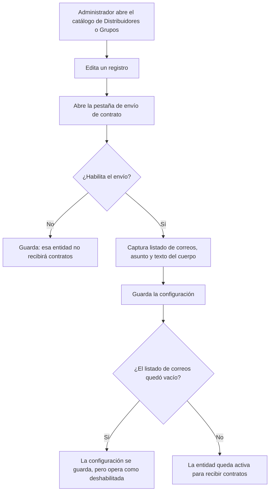
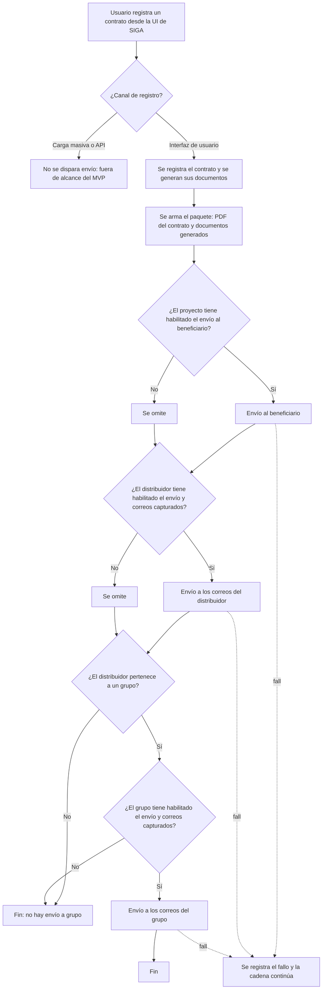

# PRD - Envío de contratos por email a distribuidores y grupos

| **Campo** | **Detalle** |
| --- | --- |
| **Proyecto** | Envío de contratos por email a distribuidores y grupos |
| **Área / empresa** | Garantiplus México |
| **Versión** | v0.1 |
| **Fecha** | 2026-08-20 |
| **Autores** | Alejandro Govea Hernández |
| **Revisión / liderazgo** | Alexis Salvador Herrera García (alexis.herrera@gplusseguros.mx) |
| **Tipo de proyecto** | Feature web o API |

## 1. Resumen ejecutivo

SIGA permite hoy que, al registrarse un contrato, el beneficiario reciba por correo electrónico
su contrato. Esa capacidad se configura por proyecto: en el catálogo de Proyectos, al editar un
proyecto, existe una pestaña donde se habilita el envío al beneficiario y se captura el texto del
correo. Los demás participantes de la operación —el distribuidor que vendió el contrato y el
grupo al que ese distribuidor pertenece— no reciben nada: si quieren el contrato, tienen que
entrar a SIGA a buscarlo.

Este proyecto extiende ese mismo patrón a los catálogos de Distribuidores y de Grupos. En ambos
se agrega una pestaña de configuración equivalente a la de Proyectos, donde el administrador
habilita el envío del contrato, captura el listado de correos destinatarios, el asunto y el texto
del cuerpo. Con esa configuración en su lugar, cada vez que se registra un contrato desde la
interfaz de SIGA el sistema envía el contrato en PDF junto con todos los documentos que ese
contrato haya generado, primero al beneficiario (comportamiento actual), después a los correos
del distribuidor y por último a los del grupo, siempre condicionado a que cada uno tenga la
opción habilitada.

El MVP cubre la configuración en ambos catálogos y el envío automático al registrar el contrato
desde la interfaz de usuario. Quedan fuera el envío en carga masiva y vía API, el reenvío manual,
el envío ante modificaciones posteriores del contrato, la consola de consulta de correos enviados
y el maquetado HTML del correo.

El resultado esperado es eliminar el reenvío manual del contrato hacia los canales comerciales y
dar a distribuidores y grupos visibilidad inmediata de los contratos que se registran a su nombre,
reutilizando el mecanismo de correo que SIGA ya opera, sin introducir infraestructura nueva.

**Registro del contrato (UI)** → **Envío al beneficiario** → **Envío a correos del distribuidor** → **Envío a correos del grupo**

## 2. Contexto y problema

Hoy el único envío automático de contrato que existe en SIGA es hacia el beneficiario, y se
configura por proyecto: al editar un proyecto en su catálogo se habilita una pestaña con el
interruptor de envío y el texto del correo. El distribuidor y el grupo no participan de ese
envío: no reciben copia de ninguna clase y su única vía de acceso al contrato es consultarlo
dentro de SIGA.

El dolor concreto es doble. Por un lado, los canales comerciales no tienen constancia inmediata
de los contratos que se registran a su nombre y dependen de entrar al sistema para verificarlos.
Por otro, cuando un distribuidor o un grupo pide su copia, el equipo interno tiene que atender
esa solicitud de forma manual, lo que consume tiempo operativo y no deja rastro estructurado.

El disparador es la petición explícita de un distribuidor/grupo que solicitó recibir de forma
automática copia de sus contratos. Resolverlo ahora es de bajo costo porque el mecanismo de
envío ya existe y está probado para el beneficiario: el trabajo consiste en extender la
configuración a dos catálogos más y encadenar dos envíos adicionales.

**Distinción de dominio relevante para el equipo de desarrollo:** un **grupo** agrupa varios
**distribuidores**. El contrato pertenece a un distribuidor, y ese distribuidor puede pertenecer
a un grupo o a ninguno. Nunca pertenece a más de uno. Por lo tanto, la ruta hacia el grupo es
siempre indirecta —se resuelve a través del distribuidor del contrato— y para un contrato dado
puede haber como máximo un envío al grupo. Esta cadena (contrato → distribuidor → grupo) es la
que determina a quién se le envía y en qué orden.

## 3. Objetivo del producto

Que SIGA entregue automáticamente el contrato y sus documentos generados por correo electrónico
a los destinatarios que cada distribuidor y cada grupo definan, sin intervención manual, usando
el mismo patrón de configuración que ya existe en el catálogo de Proyectos, para eliminar el
reenvío manual y dar a los canales comerciales visibilidad inmediata de los contratos que se
registran.

El desarrollo es de alcance único: la configuración y el envío se entregan juntos, porque
ninguna de las dos partes aporta valor por separado. La funcionalidad aplica de forma transversal
a los tres países en los que opera SIGA —México, Colombia y Chile—, respetando en cada uno el
proveedor de correo que corresponda a su hub.

## 4. Usuarios y actores

| **Usuario / Actor** | **Rol en el proceso** |
| --- | --- |
| Administrador de catálogos | Único perfil autorizado para editar la pestaña de envío en los catálogos de Distribuidores y Grupos: habilita la opción, captura los correos destinatarios, el asunto y el texto del correo |
| Asesor / ejecutivo de ventas | Registra contratos desde la interfaz de SIGA; su acción es la que dispara la cadena de envíos |
| Usuario del distribuidor | Registra contratos desde la interfaz de SIGA; dispara la misma cadena de envíos |
| Beneficiario | Destinatario del contrato; ya recibe el correo hoy mediante la configuración del catálogo de Proyectos. Su envío no cambia, solo se convierte en el primer eslabón de la cadena |
| Destinatarios del distribuidor | Buzones operativos configurados en el registro del distribuidor que reciben el contrato y sus documentos |
| Destinatarios del grupo | Buzones operativos configurados en el registro del grupo que reciben el contrato y sus documentos |
| TI / soporte | Diagnostica los fallos de envío a partir de la bitácora, ya que el MVP no incluye consola de consulta en la interfaz |

## 5. Alcance MVP y funcionalidades

| **Funcionalidad** | **Descripción** |
| --- | --- |
| Pestaña de envío en el catálogo de Distribuidores | Al editar un distribuidor se muestra una pestaña nueva, equivalente a la que ya existe en el catálogo de Proyectos, con la configuración de envío del contrato |
| Pestaña de envío en el catálogo de Grupos | Misma pestaña y mismos campos, al editar un grupo |
| Interruptor de habilitación | Campo que determina si ese distribuidor o grupo recibe o no el contrato al registrarse. Si está deshabilitado, no se envía nada |
| Listado de correos destinatarios | Uno o varios correos electrónicos a los que se enviará el contrato. Es el conjunto de destinatarios de esa entidad |
| Asunto del correo | Texto del asunto, configurable por distribuidor y por grupo, para que cada uno pueda identificar el correo según su propia operación |
| Texto del cuerpo del correo | Texto libre que compone el mensaje, con el mismo formato que hoy soporta la pestaña del catálogo de Proyectos |
| Envío automático al registrar el contrato | Al registrarse un contrato desde la interfaz de SIGA se dispara la cadena de envíos, sin acción adicional del usuario |
| Orden de envío definido | Se envía primero al beneficiario (comportamiento actual), después al distribuidor y por último al grupo |
| Envío al grupo condicionado a la pertenencia | El envío al grupo solo ocurre si el distribuidor del contrato pertenece a un grupo y ese grupo tiene la opción habilitada |
| Adjuntos completos | Cada correo lleva el PDF del contrato y todos los documentos adicionales que el contrato haya generado, sin posibilidad de filtrar cuáles |
| Configuración habilitada sin correos se ignora | Si la opción está habilitada pero el listado de correos está vacío, se trata exactamente como si no estuviera habilitada: no se envía y no se considera un error |
| Independencia entre destinatarios | Cada envío de la cadena es independiente: si falla el del beneficiario, igual se intenta el del distribuidor, y si falla el del distribuidor, igual se intenta el del grupo |
| Registro del resultado en bitácora | Cada intento de envío deja registro de su resultado, para que TI pueda diagnosticar sin consola dedicada |

El principio rector del MVP es que **el envío a distribuidor y grupo nunca debe bloquear ni
revertir el registro del contrato ni el envío al beneficiario**: si un correo falla, el contrato
queda registrado igual y la falla se registra para diagnóstico. Ligado a esto, el MVP no inventa
un mecanismo de correo nuevo: replica el que SIGA ya usa para el beneficiario, con su mismo
proveedor y su mismo comportamiento ante errores.

## 6. Fuera de alcance

- **Envío automático en carga masiva de contratos**: una carga de cientos de contratos generaría
  el mismo número de correos hacia un solo buzón, lo que satura al destinatario y no aporta valor.
  Se habilitaría al definir un formato consolidado por lote.
- **Envío automático en contratos registrados vía API de SIGA**: por consistencia con el criterio
  anterior, el MVP solo envía cuando el registro es individual y atendido por una persona en la
  interfaz. Se habilitaría cuando exista control de volumen.
- **Reenvío manual del contrato desde la ficha**: un botón de "reenviar" es una funcionalidad
  aparte, con sus propias reglas de permisos. El MVP cubre únicamente el envío automático al
  registrar.
- **Envío ante modificaciones posteriores del contrato**: la cadena se dispara solo en el
  registro. Las re-emisiones o correcciones no generan un nuevo envío, porque definirlas exige
  reglas de versionado del contrato que hoy no están acordadas.
- **Consola de consulta de correos enviados en la interfaz**: el MVP registra los resultados en
  bitácora técnica. Una bandeja visual para que operación consulte el histórico se evaluaría en
  una fase posterior, cuando haya volumen que justifique el desarrollo.
- **Plantillas HTML con diseño (logos, maquetado)**: el correo usa el mismo formato de texto que
  hoy usa el envío al beneficiario configurado desde Proyectos. El maquetado exigiría un editor
  de plantillas que excede este alcance.

## 7. Flujos principales

### 7.1 Configuración en los catálogos

La configuración es deliberadamente permisiva al guardar: no se impide dejar el interruptor
encendido con el listado vacío, porque bloquear el guardado obligaría al administrador a resolver
en ese momento un dato que quizá aún no tiene. En su lugar, el sistema resuelve la ambigüedad en
tiempo de envío tratando esa combinación como deshabilitada, que es el comportamiento seguro: no
se envía nada y no se produce un error. La contrapartida —asumida conscientemente— es que una
configuración incompleta pasa desapercibida hasta que alguien note que no llegan los correos.

La edición de esta pestaña está restringida al administrador interno. El distribuidor no puede
configurar sus propios destinatarios, para evitar que se dirija el contrato y sus datos hacia
buzones no autorizados por la operación.

### 7.2 Envío al registrar el contrato

El flujo está encadenado pero no acoplado: el orden beneficiario → distribuidor → grupo es
secuencial y fijo, pero cada eslabón es independiente respecto al éxito de los anteriores. Un
fallo en cualquiera de los tres se registra y no interrumpe a los demás, ni revierte el registro
del contrato que ya ocurrió. Esta es la traducción operativa del principio rector: el contrato es
el hecho de negocio, el correo es una notificación, y una notificación fallida nunca debe
invalidar el hecho.

La evaluación del grupo es siempre indirecta y ocurre después de la del distribuidor, porque la
pertenencia al grupo se deriva del distribuidor del contrato. Un contrato cuyo distribuidor no
pertenece a ningún grupo simplemente termina la cadena en el segundo envío, sin que eso constituya
una condición de error.

## 8. Requerimientos funcionales

| **ID** | **Requerimiento** | **Descripción** |
| --- | --- | --- |
| RF-01 | Pestaña de envío en Distribuidores | Al editar un distribuidor se dispone de una pestaña de configuración de envío de contrato, equivalente en ubicación y comportamiento a la existente en el catálogo de Proyectos |
| RF-02 | Pestaña de envío en Grupos | Al editar un grupo se dispone de la misma pestaña, con los mismos campos que en Distribuidores |
| RF-03 | Habilitación del envío | Ambas pestañas permiten habilitar o deshabilitar el envío del contrato para esa entidad |
| RF-04 | Captura de destinatarios | Ambas pestañas permiten capturar un listado de uno o varios correos electrónicos destinatarios |
| RF-05 | Asunto configurable | Ambas pestañas permiten capturar el asunto del correo que se enviará |
| RF-06 | Texto del cuerpo | Ambas pestañas permiten capturar el texto del cuerpo del correo, con el mismo formato que soporta hoy la pestaña del catálogo de Proyectos |
| RF-07 | Restricción de edición | Solo el perfil de administrador interno puede visualizar y editar estas pestañas; el usuario del distribuidor no puede configurar sus propios destinatarios |
| RF-08 | Disparo del envío | Al registrarse un contrato desde la interfaz de SIGA se ejecuta la cadena de envíos sin acción adicional del usuario |
| RF-09 | Orden de la cadena | Los envíos ocurren en el orden beneficiario, distribuidor y grupo |
| RF-10 | Contenido del correo | Cada correo enviado adjunta el PDF del contrato y todos los documentos adicionales que el contrato haya generado |
| RF-11 | Condición del distribuidor | El envío al distribuidor ocurre únicamente si el distribuidor del contrato tiene la opción habilitada y al menos un correo capturado |
| RF-12 | Condición del grupo | El envío al grupo ocurre únicamente si el distribuidor del contrato pertenece a un grupo y ese grupo tiene la opción habilitada y al menos un correo capturado |
| RF-13 | Listado vacío | Una entidad con el envío habilitado y el listado de correos vacío se comporta como si estuviera deshabilitada: no se envía y no se genera error |
| RF-14 | Independencia de fallos | El fallo de un envío no impide la ejecución de los envíos siguientes de la cadena |
| RF-15 | Registro del resultado | Cada intento de envío registra su resultado, identificando el contrato, la entidad destinataria y si el envío fue exitoso o fallido |
| RF-16 | Exclusión por canal | Los contratos registrados mediante carga masiva o mediante la API de SIGA no disparan la cadena de envíos |

## 9. Requerimientos no funcionales

| **ID** | **Requerimiento** | **Descripción** |
| --- | --- | --- |
| RNF-01 | Paridad de mecanismo | El envío a distribuidor y grupo reutiliza el mismo mecanismo, proveedor y forma de disparo que hoy usa el envío al beneficiario; no se introduce infraestructura de correo nueva |
| RNF-02 | No interferencia con el registro | Una excepción durante el envío de correo no debe abortar ni revertir el registro del contrato |
| RNF-03 | Trazabilidad | Cada intento de envío queda registrado con fecha y hora, contrato, entidad destinataria y resultado, de modo que TI pueda diagnosticar un reclamo de no recepción sin consola dedicada |
| RNF-04 | Control de acceso | La configuración de envío solo es accesible al perfil de administrador interno, tanto en lectura como en escritura |
| RNF-05 | Compatibilidad multi-país | La funcionalidad opera en los hubs de México, Colombia y Chile, respetando en cada uno el proveedor de correo configurado para ese país |
| RNF-06 | Manejo de errores | Los errores de envío se capturan y registran sin exponer detalle técnico al usuario que registró el contrato |
| RNF-07 | Desempeño | El envío no debe degradar de forma perceptible el tiempo de guardado del contrato; se asume la latencia propia del mecanismo actual |
| RNF-08 | Mantenibilidad | La configuración de Distribuidores y Grupos debe compartir la misma implementación, evitando duplicar la lógica de envío en dos lugares |

## 10. Integraciones y datos

| **Integración / Fuente** | **Uso esperado** |
| --- | --- |
| Proveedor de correo de SIGA | Envío de los correos con adjuntos. Se reutiliza el mismo que hoy atiende el envío al beneficiario; su identificación concreta está pendiente de confirmar |
| Almacenamiento de documentos del contrato | Recuperación del PDF del contrato y de los documentos generados para adjuntarlos. Su ubicación y forma de acceso están pendientes de confirmar |
| Catálogo de Distribuidores | Lectura y escritura de la configuración de envío del distribuidor |
| Catálogo de Grupos | Lectura y escritura de la configuración de envío del grupo |
| Catálogo de Proyectos | Referencia funcional: aporta el patrón de pestaña y el envío al beneficiario que se conserva como primer eslabón |
| Módulo de registro de contratos | Punto de disparo de la cadena de envíos y origen de los datos del contrato y su distribuidor |

Datos mínimos requeridos para operar el MVP:

- **Por distribuidor y por grupo**: identificador de la entidad, indicador de envío habilitado,
  listado de correos destinatarios, asunto del correo y texto del cuerpo del correo.
- **Del contrato**: identificador y número de contrato, distribuidor al que pertenece, grupo del
  distribuidor (si lo tiene) y el conjunto de documentos generados, incluido el PDF del contrato.
- **Del registro de envíos**: contrato, entidad destinataria, correos a los que se envió,
  fecha y hora, y resultado del intento.

Esquema de permisos: el administrador interno es el único perfil que puede leer y escribir la
configuración de envío en ambos catálogos. Los usuarios que registran contratos —asesor,
ejecutivo de ventas y usuario del distribuidor— no leen ni modifican esta configuración: solo
disparan la cadena de forma implícita al registrar. No existe ninguna vía para alterar los
destinatarios desde la ficha del contrato, de modo que el destino del correo siempre queda
determinado por el catálogo y nunca por quien captura la venta.

## 13. Riesgos y supuestos

### Riesgos

| **Riesgo** | **Impacto potencial** |
| --- | --- |
| Envío con adjuntos pesados dentro del guardado del contrato | Retrasa la respuesta de la pantalla de registro, y el efecto crece con el número de documentos que el contrato haya generado |
| El tamaño de los adjuntos supera el límite del proveedor de correo | El correo es rechazado y el destinatario nunca recibe el contrato, sin que el usuario que registró lo perciba |
| Ausencia de reintentos en el MVP | Un fallo transitorio del proveedor o de red deja ese contrato sin entregar de forma definitiva |
| Ausencia de consola de consulta en la interfaz | Cada reclamo de no recepción obliga a TI a revisar la bitácora, generando carga de soporte |
| Correos mal capturados o buzones que rebotan | No hay visibilidad de rebotes: el sistema da por entregado un correo que nunca llegó |
| El comportamiento actual del envío al beneficiario no está documentado | La paridad comprometida en RNF-01 puede revelar durante la implementación restricciones no previstas del mecanismo actual |

### Supuestos

| **Supuesto** | **Descripción** |
| --- | --- |
| Reutilización del mecanismo actual | El mecanismo de envío al beneficiario es reutilizable tal cual para distribuidor y grupo, sin adaptaciones estructurales |
| Pertenencia única a grupo | Un distribuidor pertenece como máximo a un grupo, por lo que un contrato genera a lo sumo un envío al grupo |
| Disponibilidad de los documentos | El PDF del contrato y los documentos adicionales ya están generados y disponibles en el momento en que se dispara la cadena de envíos |
| Naturaleza de los buzones | Los correos configurados corresponden a buzones operativos del distribuidor y del grupo, no a cuentas personales de individuos |
| Acceso preexistente a la información | Distribuidor y grupo ya tienen acceso a los datos del contrato dentro de SIGA, por lo que el envío no amplía el universo de quién puede ver esa información |

## 14. Preguntas abiertas

| **Tema** | **Pregunta abierta** |
| --- | --- |
| Proveedor de correo | ¿Qué mecanismo usa hoy SIGA para enviar el correo al beneficiario (SMTP propio, Amazon SES, servicio externo) y cambia por país/hub? |
| Comportamiento actual | ¿El envío actual al beneficiario es síncrono al guardado o diferido, y tiene algún reintento o manejo de error propio que debamos heredar? |
| Documentos adjuntos | ¿Dónde residen los documentos generados del contrato y cómo se recuperan para adjuntarlos? |
| Límites del proveedor | ¿Cuál es el tamaño máximo de adjuntos admitido y qué debe ocurrir cuando un contrato lo supere? |
| Destinatarios | ¿Existe un límite al número de correos que puede tener el listado de una entidad? ¿Se valida el formato de cada correo al capturarlo? |
| Formato del correo | ¿El texto del cuerpo que hoy soporta la pestaña de Proyectos es texto plano o admite HTML? Se replicará ese mismo formato |
| Perfiles | ¿Cuál es el nombre exacto del perfil de SIGA que corresponde al administrador interno habilitado para editar estas pestañas? |
| Modelo de datos | Confirmar en el modelo de datos que un distribuidor no puede pertenecer a más de un grupo simultáneamente |
| Monitoreo de fallos | ¿Dónde se consultará la bitácora de envíos y quién es responsable de vigilar los fallos, dado que no habrá consola en la interfaz? |
| Cobertura | ¿La funcionalidad aplica a todos los proyectos y productos de SIGA o debe poder restringirse a algunos? |
| Métricas | No se definieron métricas de éxito para este MVP; queda pendiente decidir si se medirá la adopción y la tasa de entrega |
