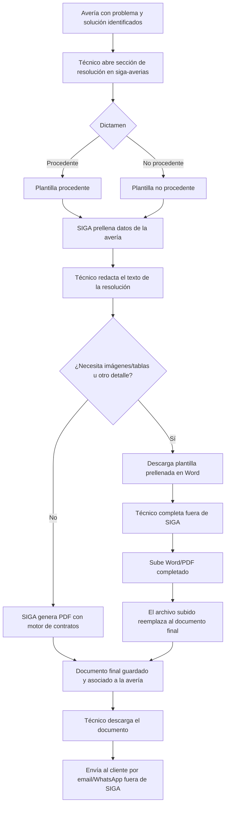

# PRD - Utilización de plantillas para la creación de resoluciones de averías (PV-09)

| **Campo** | **Detalle** |
| --- | --- |
| **Proyecto** | Utilización de plantillas para la creación de resoluciones de averías (PV-09) |
| **Área / empresa** | Garantiplus México |
| **Versión** | v0.1 |
| **Fecha** | 2026-08-13 |
| **Autores** | Alejandro Govea Hernández |
| **Revisión / liderazgo** | Alexis Salvador Herrera Garcia (alexis.herrera@gplusseguros.mx) |
| **Tipo de proyecto** | Feature web o API |

## 1. Resumen ejecutivo

En el flujo de atención de averías de SIGA, cuando el técnico ya identificó el **problema** y la **solución** del daño del vehículo, debe emitir un **documento de resolución** (procedente o no procedente) para informar al cliente. Hoy ese documento se elabora **manualmente y por fuera de SIGA**, y el técnico lo envía por correo al cliente. Esto genera trabajo manual repetitivo, riesgo de inconsistencias de formato/datos y pérdida de trazabilidad, ya que el documento no queda registrado en la avería.

Este proyecto lleva la generación de la resolución **dentro de siga-averias**: se parte de una **plantilla** (una para averías **procedentes** y otra para **no procedentes**) que se **prellena automáticamente** con los datos de la avería ya capturados en SIGA. El técnico escribe el **texto de la resolución** en una sección nueva y SIGA **genera automáticamente el PDF** reutilizando el mismo motor de documentos que ya produce los contratos.

Para los casos donde el técnico necesita **más detalle** (imágenes, tablas), se habilita una vía alterna: **descargar la plantilla prellenada en Word**, completarla fuera y **volver a subirla** (Word o PDF); ese archivo pasa a ser la resolución final. En todos los casos el documento final **queda guardado y asociado a la avería**, igual que las evidencias y demás documentos.

El MVP **no envía** el documento al cliente: SIGA lo genera y lo deja disponible para que el **técnico lo descargue y lo envíe** por su canal habitual (email o WhatsApp). El resultado esperado es reducir el trabajo manual, estandarizar el documento y dejar trazabilidad de cada resolución en SIGA.

**Identificar problema/solución** → **Elegir plantilla (procedente/no procedente)** → **Prellenar datos + escribir texto** → **Generar PDF (o completar vía Word)** → **Guardar en la avería y descargar para enviar**

## 2. Contexto y problema

- **Hoy:** una vez que el técnico identifica el problema y la solución del daño, redacta el documento de resolución **a mano, en una herramienta externa a SIGA**, y lo envía al cliente **por correo** (WhatsApp no está descartado como canal).
- **Dolor concreto:** trabajo manual repetitivo por cada avería; dependencia de herramientas externas; riesgo de errores de formato y de datos (se transcriben a mano datos que ya viven en SIGA); **falta de trazabilidad**, porque el documento no queda asociado a la avería.
- **Por qué ahora:** estandarizar y automatizar la emisión de resoluciones, aprovechando que SIGA ya tiene los datos de la avería y un motor de generación de documentos (el de contratos).
- **Distinción de dominio:** la resolución aplica a dos desenlaces del dictamen — **procedente** y **no procedente** —, cada uno con su propia plantilla.

## 3. Objetivo del producto

Permitir que el técnico **genere la resolución de una avería directamente en siga-averias**, a partir de plantillas prellenadas con los datos de la avería y del texto que él redacta, produciendo automáticamente un PDF (reutilizando el motor de contratos) que queda **guardado en la avería** y disponible para que el técnico lo envíe al cliente. Se busca **eliminar la elaboración manual externa**, estandarizar el documento y dejar trazabilidad, midiendo el avance por el **porcentaje de resoluciones generadas dentro de SIGA**.

## 4. Usuarios y actores

| **Usuario / Actor** | **Rol en el proceso** |
| --- | --- |
| Técnico | Redacta el texto de la resolución, genera el documento (o lo completa vía Word) y lo descarga para enviarlo al cliente. |
| Coordinador Técnico | Administra y mantiene las plantillas (formato, textos fijos, logos) y supervisa el proceso. |
| Cliente | Destinatario final de la resolución (la recibe fuera de SIGA, por email/WhatsApp). |
| TI / Desarrollo | Habilita la reutilización del motor de documentos y el almacenamiento asociado a la avería. |

## 5. Alcance MVP y funcionalidades

| **Funcionalidad** | **Descripción** |
| --- | --- |
| Sección de resolución en siga-averias | Nueva sección dentro de la avería donde el técnico redacta el **texto de la resolución** cuando ya identificó problema y solución. |
| Selección de plantilla por desenlace | Uso de la plantilla **procedente** o **no procedente** según el dictamen de la avería. |
| Prellenado automático desde SIGA | La plantilla se llena con los datos de la avería ya registrados (campos exactos según el diseño del área — ver §14). |
| Generación automática de PDF | A partir de plantilla + datos + texto del técnico, SIGA genera el PDF **reutilizando el motor de documentos de contratos**. |
| Vía manual (descarga/recarga) | El técnico puede **descargar la plantilla prellenada en Word**, agregar imágenes/tablas y **subirla de vuelta** (Word/PDF); ese archivo **reemplaza** al documento final. |
| Almacenamiento asociado a la avería | El documento final queda **guardado y ligado a la avería**, igual que las evidencias y demás documentos. |
| Descarga para envío | El técnico **descarga** el documento final para enviarlo al cliente por su canal habitual (email/WhatsApp). |

**Principio rector del MVP:** SIGA **estandariza y genera** el documento y garantiza su trazabilidad, pero **no envía** al cliente ni toma decisiones de dictamen: el técnico conserva el control del contenido final y del envío. La resolución solo se emite cuando el problema y la solución ya están identificados.

## 6. Fuera de alcance

- **Envío automático al cliente (email/WhatsApp) desde SIGA:** se difiere; hoy el técnico envía manualmente y así se mantiene. Lo habilitaría una fase posterior con integración de correo/WhatsApp y datos de contacto validados.
- **Catálogo de plantillas por marca/tipo de avería:** el MVP solo maneja **procedente / no procedente**. Se ampliaría si el negocio requiere variantes por marca.
- **Aprobación/revisión previa de un tercero antes de enviar:** el técnico envía directo; no hay flujo de autorización intermedio.
- **Firma electrónica / validez legal formal del documento:** no se contempla en esta versión.

## 7. Flujos principales

Flujo principal de emisión de la resolución. El punto de entrada es una avería con problema y solución ya identificados; la decisión clave es si el técnico necesita agregar detalle (imágenes/tablas) que obliga a la vía manual en Word.

El flujo prioriza el **camino automático** (plantilla + datos + texto → PDF) y deja la vía manual solo como excepción para enriquecer el documento, evitando construir edición avanzada dentro de SIGA. El envío queda fuera del sistema por decisión de alcance.

## 8. Requerimientos funcionales

| **ID** | **Requerimiento** | **Descripción** |
| --- | --- | --- |
| RF-01 | Sección de resolución | El sistema permite al técnico capturar el **texto de la resolución** en una sección de la avería, disponible cuando ya hay problema y solución identificados. |
| RF-02 | Selección de plantilla por desenlace | El sistema usa la plantilla **procedente** o **no procedente** según el dictamen de la avería. |
| RF-03 | Prellenado automático | El sistema **prellena** la plantilla con los datos de la avería registrados en SIGA. |
| RF-04 | Generación de PDF | El sistema **genera el PDF** de la resolución combinando plantilla + datos + texto, reutilizando el motor de documentos de contratos. |
| RF-05 | Descarga de plantilla prellenada | El sistema permite **descargar la plantilla prellenada en Word** para completarla fuera de SIGA. |
| RF-06 | Recarga del documento completado | El sistema permite **subir** el documento completado (Word/PDF); ese archivo **reemplaza** al documento final de la resolución. |
| RF-07 | Almacenamiento en la avería | El sistema **guarda** el documento final **asociado a la avería**, igual que evidencias y otros documentos. |
| RF-08 | Descarga del documento final | El sistema permite al técnico **descargar** el documento final para su envío al cliente. |

## 9. Requerimientos no funcionales

| **ID** | **Requerimiento** | **Descripción** |
| --- | --- | --- |
| RNF-01 | Permisos | Solo el **técnico** de la avería genera/sube documentos; el **Coordinador Técnico** administra plantillas. SIGA no envía al cliente. |
| RNF-02 | Trazabilidad | Cada documento final queda ligado a la avería con registro de **quién** lo generó/subió y **cuándo**. |
| RNF-03 | Reutilización | La generación de PDF **reutiliza el motor de documentos de contratos** existente, sin duplicar componentes. |
| RNF-04 | Consistencia de formato | El documento respeta el **formato/branding** definido por los Coordinadores Técnicos en la plantilla. |
| RNF-05 | Manejo de errores | Ante fallo en la generación o en la carga del archivo, el sistema informa al técnico sin perder el texto ya capturado. |
| RNF-06 | Manejo de archivos | Se validan **tipo y tamaño** de los archivos subidos (Word/PDF), acorde a los límites de documentos de averías. |
| RNF-07 | Disponibilidad | Disponible en el **horario operativo** de atención de averías. |

## 10. Integraciones y datos

| **Integración / Fuente** | **Uso esperado** |
| --- | --- |
| Módulo siga-averias | **Lectura** de los datos de la avería para prellenar la plantilla; **escritura** del texto de resolución y del documento final. |
| Motor de documentos de contratos (SIGA) | **Reutilización** para generar el PDF de la resolución a partir de la plantilla. |
| Almacenamiento de documentos de averías | **Guardado** del documento final asociado a la avería (mismo mecanismo que evidencias — por confirmar). |

**Datos mínimos:** los **campos exactos** a prellenar dependen del **diseño de plantilla propuesto por el área** (ver §14). Lista tentativa a validar: folio/ID de avería, datos del cliente, datos del vehículo (VIN/placa/marca/modelo/año), fecha, diagnóstico/solución, taller y técnico responsable.

**Permisos:** el técnico lee los datos de su avería y genera/sube el documento; el Coordinador Técnico administra las plantillas; el envío al cliente queda fuera de SIGA (lo hace el técnico).

## 11. Eventos para BI

- `resolucion_generada`: se registra cuando SIGA genera el PDF de la resolución desde la plantilla.
- `resolucion_plantilla_descargada`: se registra cuando el técnico descarga la plantilla prellenada en Word.
- `resolucion_documento_resubido`: se registra cuando el técnico sube el documento completado que reemplaza al final.
- `resolucion_documento_descargado`: se registra cuando el técnico descarga el documento final para enviarlo.

Campos mínimos por evento: fecha/hora, usuario (técnico), folio de avería, tipo (procedente/no procedente) y resultado. Estos eventos sustentan la métrica de **% de resoluciones generadas dentro de SIGA**.

## 12. Métricas de éxito

| **Métrica** | **Descripción** |
| --- | --- |
| % de resoluciones generadas en SIGA | Proporción de resoluciones emitidas dentro de siga-averias vs. elaboradas manualmente por fuera (métrica principal). Línea base y meta **pendientes de validar con BI/operación**. |

## 13. Riesgos y supuestos

### Riesgos

| **Riesgo** | **Impacto potencial** |
| --- | --- |
| Diseño de plantilla no definido | Sin los campos y el formato del área, no se puede cerrar el prellenado ni el layout; bloquea el desarrollo. |
| Ajuste del motor de contratos | El motor de documentos de contratos podría no adaptarse al formato de resolución sin trabajo adicional. |
| Documentos subidos sin control de formato | En la vía manual, el Word/PDF resubido por el técnico puede romper el branding o incluir datos inconsistentes. |
| Envío fuera de SIGA | Al enviar el técnico por su cuenta, no hay registro en SIGA de que la resolución llegó al cliente. |

### Supuestos

| **Supuesto** | **Descripción** |
| --- | --- |
| Motor de documentos reutilizable | Existe y es reutilizable el mismo motor que genera los contratos. |
| Datos disponibles en SIGA | Los datos necesarios para prellenar ya están capturados en la avería. |
| Almacenamiento existente | El mecanismo que guarda evidencias/documentos sirve para el documento final. |
| Responsabilidad del envío | El técnico es responsable de enviar el documento al cliente. |

## 14. Preguntas abiertas

| **Tema** | **Pregunta abierta** |
| --- | --- |
| Diseño de plantilla | ¿Cuál es el diseño y los **campos exactos** a prellenar (por el área/Coordinadores Técnicos), para procedente y no procedente? |
| Formato del documento final | El Word resubido, ¿se envía tal cual o SIGA lo **convierte a PDF**? (se decidió que reemplaza al final; la conversión queda por definir). |
| Almacenamiento | ¿Se usa exactamente el **mismo mecanismo/almacén** que las evidencias de averías? |
| Registro de envío | ¿Se requiere registrar en SIGA que la resolución fue enviada/entregada al cliente? (hoy fuera de alcance). |
| Validez legal | ¿La resolución requiere firma o algún elemento de validez legal a futuro? |
