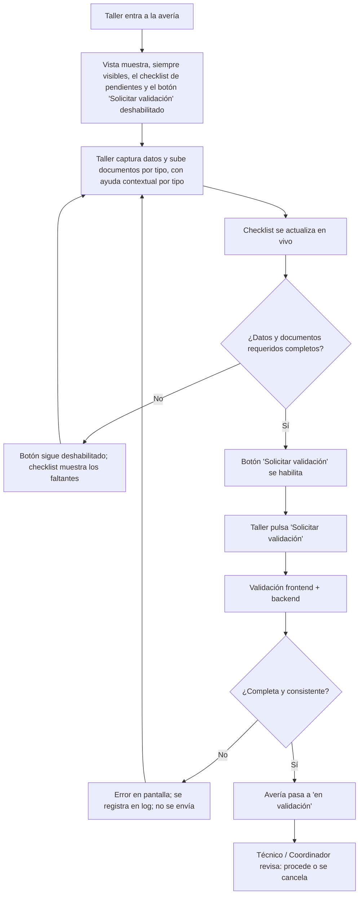

# PRD - Ayuda contextual al subir documentos en averías

| **Campo** | **Detalle** |
| --- | --- |
| **Proyecto** | Ayuda contextual al subir documentos en averías |
| **Área / empresa** | Garantiplus México |
| **Versión** | v0.1 |
| **Fecha** | 2026-07-22 |
| **Autores** | Alejandro Govea Hernández (Desarrollo — Engine CX) |
| **Revisión / liderazgo** | Alexis Salvador Herrera García (Revisión técnica — alexis.herrera@gplusseguros.mx) |
| **Tipo de proyecto** | Feature web/API (SIGA) |

## 1. Resumen ejecutivo

La avería en SIGA es una vista con mucha información; la sección para subir documentos queda hasta el fondo y el botón "Solicitar validación" pasa desapercibido. Como resultado, los talleres a menudo no se percatan de que les faltan datos o documentos requeridos y no logran (o retrasan) el envío de la avería a validación.

Este proyecto mejora la **experiencia y la visibilidad** de esa vista para el usuario del taller: ayudas contextuales por tipo de documento, un checklist siempre visible con lo que falta y un botón "Solicitar validación" fijo que se habilita solo cuando todo está completo, respaldado por validación en frontend y backend.

El **MVP** entrega, dentro de la vista existente de averías: ayudas contextuales por tipo documental, checklist de pendientes en vivo, botón siempre visible (deshabilitado hasta completar) y validación de completitud en frontend y backend al enviar. Es un **alcance único** (sin fases).

El **resultado esperado** es reducir envíos incompletos y reprocesos de Operaciones/validadores, y acelerar la operación de los talleres, sin cambiar la lógica de negocio de validación ni el catálogo de documentos requeridos.

**Entrar a la avería** → **ver checklist y ayudas** → **completar datos y documentos** → **botón se habilita** → **Solicitar validación (front + back)**.

## 2. Contexto y problema

- **Hoy:** el taller entra a la avería en SIGA, una vista con muchos datos. Para cargar documentos debe hacer scroll hasta el fondo, seleccionar el tipo de documento en un combo, subir el archivo, volver a seleccionar otro tipo, subir otro, y repetir por cada tipo requerido.
- **Dolor:** con tanta información en pantalla, el usuario no se da cuenta de que le faltan datos o documentos requeridos para poder solicitar la validación; el botón "Solicitar validación" pasa desapercibido.
- **Por qué ahora:** los talleres reportan que no advierten qué les falta; esto genera averías incompletas y reprocesos para Operaciones y los validadores. Importancia media, con impacto en experiencia de usuario y eficiencia operativa.
- **Conceptos del dominio:**
  - **Documento:** archivo que se sube como evidencia (PDF, imágenes, videos, presupuesto).
  - **Dato:** valor que el usuario escribe en un input de la avería.
  - **Avería:** caso que registra el taller con datos y documentos de evidencia de la falla del vehículo. Al completarla, el taller la **envía a validación**; personal de Garantiplus (técnico o coordinador de técnicos) determina si **procede** o **se cancela**.

## 3. Objetivo del producto

Lograr que el taller sepa en todo momento qué datos y documentos le faltan para enviar una avería a validación, mediante guías por tipo de documento y un botón "Solicitar validación" siempre visible que se habilita solo cuando todo está completo, reduciendo envíos incompletos y reprocesos. Todo dentro de la vista de averías existente de SIGA, sin alterar el proceso de validación.

## 4. Usuarios y actores

| **Usuario / Actor** | **Rol en el proceso** |
| --- | --- |
| Taller (usuario) | Registra la avería, captura datos y sube documentos de evidencia; envía a validación. |
| Técnico (Garantiplus) | Revisa la avería enviada y determina si procede o se cancela. |
| Coordinador de técnicos (Garantiplus) | Nivel de coordinación en la validación; revisa/determina procedencia. |
| Operaciones | Área solicitante de la mejora; se beneficia de menos reprocesos por cargas incompletas. |

## 5. Alcance MVP y funcionalidades

| **Funcionalidad** | **Descripción** |
| --- | --- |
| Ayudas contextuales por tipo de documento | Tooltip/texto por cada tipo documental que describe el contenido esperado, de forma no invasiva. |
| Checklist de pendientes | Panel/resumen siempre visible que lista los datos y documentos requeridos que faltan; se actualiza en vivo conforme el taller completa. |
| Botón "Solicitar validación" siempre visible | Botón fijo/sticky en la vista de la avería, sin tapar ni interferir con el resto de funcionalidades. |
| Botón habilitado por completitud | El botón permanece deshabilitado hasta que todos los datos y documentos requeridos estén completos. |
| Validación al enviar (frontend) | Al intentar enviar, se valida en frontend la completitud de datos y documentos requeridos. |
| Validación al enviar (backend) | Al recibir la solicitud, el backend valida completitud antes de pasar la avería a "en validación"; si falta algo, rechaza con mensaje claro y lo registra en log. |

**Principio rector del MVP:** no cambiar la lógica de negocio de validación de averías ni los tipos de documento requeridos; solo mejorar la guía y la visibilidad en la vista existente.

## 6. Fuera de alcance

- **No cambiar la lógica de negocio de validación** (quién valida, cómo se determina procede/cancela): el MVP solo mejora guía y visibilidad.
- **No modificar el catálogo de tipos de documento requeridos**: se respeta lo que hoy exige el negocio (definido en código).
- **No validar el contenido/calidad del documento** (legibilidad de una foto, exactitud del presupuesto): eso lo sigue determinando el validador humano; el sistema solo verifica presencia/completitud.
- **No indicar formato ni peso permitido** en las ayudas contextuales: diferido por ahora.
- **No rediseñar por completo la vista de averías**: solo se interviene la sección de documentos/guía, el botón y el checklist.
- **No incluir eventos de BI ni tableros de medición**: fuera de este MVP.
- **No agregar notificaciones externas** (correo/WhatsApp): el aviso es en pantalla, dentro de la vista.

## 7. Flujos principales

El flujo prioriza que el taller **descubra en la propia vista** qué le falta, sin depender de recordar los requisitos ni de encontrar la sección de documentos al fondo. La validación se hace en dos capas: el **frontend** guía y previene (checklist + botón habilitado por completitud), y el **backend** es la fuente de verdad que confirma antes de cambiar el estado de la avería, registrando en log cualquier rechazo por completitud. La revisión humana (técnico/coordinador) queda intacta como paso posterior.

## 8. Requerimientos funcionales

| **ID** | **Requerimiento** | **Descripción** |
| --- | --- | --- |
| RF-01 | Ayuda contextual por tipo de documento | Mostrar tooltip/texto por cada tipo documental describiendo el contenido esperado, sin ser invasivo. |
| RF-02 | Checklist de pendientes en vivo | Mostrar un checklist siempre visible con los datos y documentos requeridos pendientes, actualizado conforme el taller completa. |
| RF-03 | Botón "Solicitar validación" siempre visible | Mantener el botón fijo/sticky en la vista de la avería. |
| RF-04 | Habilitación por completitud | Mantener el botón deshabilitado hasta que todos los datos y documentos requeridos estén completos. |
| RF-05 | Validación en frontend | Validar, al intentar enviar, la completitud de datos y documentos requeridos. |
| RF-06 | Validación en backend | Validar la completitud al recibir la solicitud antes de pasar la avería a "en validación"; si falta algo, rechazar con mensaje claro. |
| RF-07 | No interferencia | No interferir con las demás funcionalidades de la vista de averías. |

## 9. Requerimientos no funcionales

| **ID** | **Requerimiento** | **Descripción** |
| --- | --- | --- |
| RNF-01 | Consistencia front/back | Frontend y backend deben usar el mismo criterio/catálogo de "requerido" para no dar resultados distintos. |
| RNF-02 | Seguridad / permisos | Respetar los permisos actuales de SIGA (solo quien corresponde sube documentos y envía a validación). |
| RNF-03 | UX / rendimiento | Ayudas no invasivas y checklist claro, sin degradar el desempeño de la vista. |
| RNF-04 | Manejo de errores | Mensajes claros cuando el backend rechaza la solicitud por completitud. |
| RNF-05 | Observabilidad | Registrar en log los rechazos de envío por completitud (id de avería, usuario, faltantes detectados). |

## 10. Integraciones y datos

| **Integración / Fuente** | **Uso esperado** |
| --- | --- |
| SIGA (frontend) | Vista de la avería donde viven las ayudas contextuales, el checklist y el botón. |
| SIGA (backend / API) | Endpoint de "Solicitar validación" y validación de completitud del lado servidor. |
| Almacenamiento de documentos (servidor + S3) | Persistencia de los archivos subidos; el servidor se purga tras un tiempo y S3 los conserva. Se consume tal cual, sin cambios. |

**Datos mínimos del MVP:** la **avería** y su estado; los **tipos de documento requeridos** (definidos en código); los **documentos subidos** (tipo documental + archivo); los **datos requeridos** de la avería para determinar completitud.

**Esquema de permisos:** se respeta el modelo actual de SIGA — el taller (propietario) captura datos, sube documentos y envía a validación; la determinación de procede/cancela queda en manos del técnico/coordinador de Garantiplus. El MVP no crea ni amplía permisos.

## 12. Métricas de éxito

| **Métrica** | **Descripción** |
| --- | --- |
| % de averías enviadas incompletas / rechazadas por falta de datos o documentos | Debe bajar tras el cambio. Línea base/meta pendiente de validar con Operación. |
| % de averías aceptadas a validación al primer intento | Debe subir (envío correcto sin rebote por completitud). Línea base/meta pendiente de validar con Operación. |
| Reprocesos de Operaciones/validadores por cargas incompletas | Debe bajar. Línea base/meta pendiente de validar con Operación. |
| Tiempo promedio para completar y enviar una avería | Referencia de eficiencia operativa del taller. Línea base/meta pendiente de validar con Operación. |

## 13. Riesgos y supuestos

### Riesgos

| **Riesgo** | **Impacto potencial** |
| --- | --- |
| Desincronía entre la validación de frontend y las reglas del backend | El checklist marca "completo" pero el backend rechaza (o al revés), generando confusión. |
| Regresiones al intervenir una vista con muchas funcionalidades | Afectar otras funciones existentes de la vista de averías. |
| Rendimiento de la vista con validación/checklist en vivo | Vista más lenta si la actualización en vivo es costosa. |
| Tipos de documento definidos en código | Cualquier cambio al catálogo requiere desarrollo y despliegue (poca flexibilidad). |

### Supuestos

| **Supuesto** | **Descripción** |
| --- | --- |
| Reglas de "requerido" bien definidas | Los datos y documentos requeridos están correctamente definidos en negocio y reflejados en código. |
| El proceso de validación humano no cambia | El MVP solo mejora guía y visibilidad. |
| El almacenamiento actual se mantiene | No se modifica cómo se guardan los documentos (servidor + S3). |

## 14. Preguntas abiertas

| **Tema** | **Pregunta abierta** |
| --- | --- |
| Catálogo de documentos | ¿Conviene parametrizar/configurar a futuro los tipos de documento requeridos (hoy en código) para evitar despliegues ante cambios? |
| Ayudas contextuales | ¿En una fase posterior deberían indicar formato/peso permitido por tipo de documento? |
| Métricas | Definir línea base y meta de cada métrica con Operación/BI. |
| Autoría | Confirmar autores del PRD para el encabezado. |
