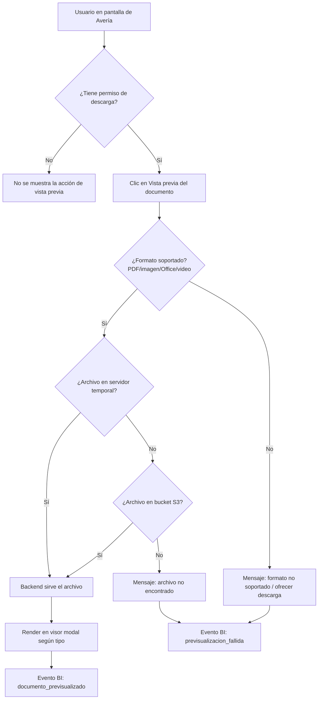

# PRD - Visor de Documentos en Averías

| **Campo** | **Detalle** |
| --- | --- |
| **Proyecto** | Visor de Documentos en Averías |
| **Área / empresa** | Garantiplus México |
| **Versión** | v0.1 |
| **Fecha** | 2026-07-22 |
| **Autores** | Operaciones (solicitante) |
| **Revisión / liderazgo** | Alexis Salvador Herrera García (alexis.herrera@gplusseguros.mx) |
| **Tipo de proyecto** | Feature web o API |

## 1. Resumen ejecutivo

El **Visor de Documentos en Averías** es una funcionalidad para SIGA que permite **previsualizar** en el navegador los soportes (documentos) asociados a una avería, sin necesidad de descargarlos primero. Beneficia directamente a **Operaciones**, que hoy invierte tiempo descargando cada archivo solo para revisarlo.

Actualmente, para revisar cualquier soporte de una avería el usuario debe descargarlo a su equipo, abrirlo con una aplicación externa y luego volver a SIGA. Este ir y venir genera pérdida de tiempo operativo y fricción en la revisión de soportes.

El MVP incorpora un **visor en modal (overlay)** dentro de la pantalla de Averías en SIGA, capaz de mostrar **PDF, imágenes, documentos Office y videos**, reutilizando la **lógica de obtención de archivos actual** (servidor temporal → bucket S3) y **heredando los permisos de descarga** existentes. El componente se **diseña para reutilizarse** más adelante en otras áreas de SIGA que muestran documentos (fase 2).

El resultado esperado es una **mejora de eficiencia operativa**: revisión de soportes sin descarga, con ahorro de horas de trabajo. Importancia media; sin impacto directo en captación de clientela.

**Usuario abre avería** → **da clic en vista previa** → **el sistema obtiene el archivo (servidor→S3)** → **lo muestra en modal sin descargar**

## 2. Contexto y problema

- **Proceso actual:** en la pantalla de Averías de SIGA cada soporte se ofrece para **descarga**. La descarga funciona en dos niveles: primero se busca el archivo en el **almacenamiento temporal del servidor**; si no está, se descarga desde el **bucket S3**; si no aparece en ninguno, se muestra al usuario el mensaje de **"archivo no encontrado"**. El acceso a S3 se configura en los settings de SIGA (`key`, `secret`, `BucketName`).
- **Dolor concreto:** para revisar un documento hay que descargarlo y abrirlo por fuera de SIGA, lo que consume tiempo operativo y rompe el flujo de trabajo del revisor.
- **Por qué ahora:** es una mejora de eficiencia de bajo riesgo que ataca un desperdicio recurrente de tiempo en la operación de Averías.
- **Distinción clave:** **previsualizar ≠ descargar**. La vista previa es solo lectura en el navegador; la descarga (flujo actual) se mantiene intacta.

## 3. Objetivo del producto

Permitir que cualquier usuario con permiso de descarga en Averías **visualice los soportes directamente en el navegador**, en un visor modal que soporte los formatos de documento que hoy se suben, reutilizando la infraestructura de obtención de archivos existente, para **reducir descargas y ahorrar tiempo de revisión**. El componente debe quedar diseñado para reutilizarse en otras áreas de SIGA.

### 3.1 Estrategia de implementación por fases

| **Fase** | **Nombre** | **Descripción** |
| --- | --- | --- |
| Fase 1 (**MVP**) | Visor en Averías | Visor modal en la pantalla de Averías de SIGA; soporta PDF, imágenes, Office y video; hereda permisos de descarga; reutiliza la lógica servidor→S3. Componente desacoplado y parametrizable. |
| Fase 2 | Reutilización en otras áreas | Integrar el mismo componente en otras pantallas/áreas de SIGA donde se muestran documentos para descarga. |

La **Fase 1** es el MVP de este PRD.

## 4. Usuarios y actores

| **Usuario / Actor** | **Rol en el proceso** |
| --- | --- |
| Usuario de Averías (cualquier rol con permiso de descarga) | Abre la avería y previsualiza sus soportes en el visor. Es el beneficiario directo. |
| Operaciones | Área solicitante; revisa soportes como parte de su trabajo diario. |
| TI / Desarrollo | Construye y mantiene el componente, la integración con la lógica de descarga y los accesos a S3. |
| BI | Consume los eventos de uso (preview vs descarga) para medir el impacto (participación futura). |

## 5. Alcance MVP y funcionalidades

| **Funcionalidad** | **Descripción** |
| --- | --- |
| Acción "Vista previa" por documento | Junto a cada soporte descargable de la avería, una acción para previsualizar; visible solo para roles con permiso de descarga. |
| Visor en modal (overlay) | El documento se abre en una ventana emergente sobre la pantalla de Averías, sin abandonar la vista. |
| Render de PDF | Visualización de PDF en el navegador. |
| Render de imágenes | Visualización de formatos de imagen comunes (JPG, PNG, etc.). |
| Previsualización de Office | Visualización de documentos Office (Word/Excel/PowerPoint), vía conversión/servicio de render (mecanismo a definir). |
| Reproducción de video | Player embebido para videos, con streaming desde el origen. |
| Obtención de archivo reutilizando lógica actual | Busca en servidor temporal → si no, en S3 → si no, "no encontrado", igual que la descarga actual. |
| Manejo de "archivo no encontrado" | Mensaje claro cuando el archivo no está ni en servidor ni en S3. |
| Herencia de permisos | Solo los roles que hoy pueden descargar ven y usan la vista previa. |
| Diseño reutilizable | Componente desacoplado/parametrizable por fuente de documento, para reutilizarse en otras áreas (fase 2). |

**Principio rector del MVP:** la vista previa es **solo lectura** y **no altera** el flujo de carga ni de descarga existente, ni el esquema de permisos actual. No se editan, anotan ni modifican documentos.

## 6. Fuera de alcance

- **Editar / anotar / firmar documentos:** el visor es solo lectura; editar exige capacidades y riesgos de integridad que no aporta el MVP.
- **Subir documentos desde el visor:** la carga sigue por el flujo actual de Averías; incluirla mezclaría responsabilidades y ampliaría el alcance.
- **Búsqueda de texto / OCR dentro del documento:** requiere procesamiento adicional (indexado/OCR) no justificado para el objetivo de revisión rápida.
- **Integración con áreas distintas de Averías:** se difiere a la Fase 2; el MVP valida primero en Averías.
- **Descarga masiva / previsualización de múltiples archivos a la vez:** el MVP previsualiza un documento a la vez; el batch se puede evaluar después según demanda.

## 7. Flujos principales

Flujo de previsualización de un soporte desde la pantalla de Averías. Refleja la misma cascada de obtención que la descarga actual (servidor → S3 → no encontrado) más la validación de permiso y de formato soportado, resolviendo todo del lado del backend para no exponer credenciales de S3 al navegador.

El flujo prioriza **seguridad** (el archivo se resuelve y sirve desde el backend, nunca exponiendo `key`/`secret` de S3) y **reutilización** (la cascada servidor→S3 es la misma de la descarga actual, evitando lógica duplicada).

## 8. Requerimientos funcionales

| **ID** | **Requerimiento** | **Descripción** |
| --- | --- | --- |
| RF-01 | Acción de vista previa por documento | Cada soporte descargable de la avería ofrece una acción de "vista previa". |
| RF-02 | Visor modal | La vista previa se abre en modal (overlay) sobre la pantalla de Averías, cerrable, sin recargar la vista. |
| RF-03 | Render de PDF | El visor muestra archivos PDF en el navegador. |
| RF-04 | Render de imágenes | El visor muestra imágenes (al menos JPG y PNG). |
| RF-05 | Previsualización de Office | El visor muestra documentos Office (Word/Excel/PowerPoint) mediante conversión o servicio de render (mecanismo a definir en diseño técnico). |
| RF-06 | Reproducción de video | El visor reproduce videos con un player embebido y streaming desde el origen. |
| RF-07 | Obtención en cascada | El backend obtiene el archivo buscando primero en el servidor temporal y, si no está, en el bucket S3. |
| RF-08 | Formato no soportado | Si el formato no es previsualizable, se informa al usuario y se ofrece la descarga como alternativa. |
| RF-09 | Archivo no encontrado | Si el archivo no está en servidor ni en S3, se muestra el mensaje "archivo no encontrado". |
| RF-10 | Herencia de permisos | La acción de vista previa solo está disponible para roles con permiso de descarga vigente. |
| RF-11 | Descarga como alternativa | Desde el visor (o junto a él) se mantiene disponible la descarga actual del documento. |
| RF-12 | Componente reutilizable | El visor se implementa como componente desacoplado/parametrizable, reutilizable por otras áreas en fase 2. |

## 9. Requerimientos no funcionales

| **ID** | **Requerimiento** | **Descripción** |
| --- | --- | --- |
| RNF-01 | Seguridad de credenciales | Las credenciales de S3 (`key`/`secret`/`BucketName`) residen solo en el backend/settings; nunca se exponen al navegador. El archivo se sirve vía backend o URL temporal de acceso controlado. |
| RNF-02 | Control de acceso | Se respeta el esquema de permisos de descarga existente; no se crea un esquema nuevo. |
| RNF-03 | Rendimiento | La previsualización carga en un tiempo razonable; para archivos grandes y video se usa streaming/entrega por rangos para no bloquear la UI. |
| RNF-04 | Manejo de errores | Se manejan y comunican con claridad: archivo no encontrado, formato no soportado y fallo de render. |
| RNF-05 | Compatibilidad | Compatible con los navegadores soportados actualmente por SIGA. |
| RNF-06 | Experiencia de usuario | Modal responsivo y cerrable; no interrumpe el trabajo en la pantalla de Averías. |
| RNF-07 | Trazabilidad | Se registran las previsualizaciones (y sus fallos) para alimentar métricas de uso. |
| RNF-08 | Mantenibilidad / reutilización | Componente desacoplado de la pantalla de Averías, parametrizable por fuente de documento. |

## 10. Integraciones y datos

| **Integración / Fuente** | **Uso esperado** |
| --- | --- |
| SIGA — pantalla de Averías | Punto de entrada del visor (UI) y de la lista de soportes de la avería. |
| Backend / lógica de descarga de SIGA | Reutiliza la lógica de obtención de archivos (servidor temporal → S3) para servir el documento al visor. |
| Almacenamiento temporal en servidor | Primera fuente de búsqueda del archivo. |
| Bucket S3 | Segunda fuente de búsqueda; acceso con credenciales de settings de SIGA (`key`/`secret`/`BucketName`). Solo lectura. |
| Servicio de render de Office *(a definir)* | Conversión/renderizado de documentos Office para su previsualización. |
| Entrega de video por streaming *(a definir)* | Servir video desde el origen con soporte de rangos. |

**Datos mínimos:** identificador de la avería, identificador/nombre del documento, ruta o clave del archivo (en servidor y en bucket), tipo/extensión, tamaño del archivo.

**Esquema de permisos:** el visor **solo lee** documentos que el usuario ya está autorizado a descargar; **no crea, escribe ni modifica** nada. El acceso al bucket queda **bloqueado del lado del cliente** (credenciales solo en backend). No hay operación que requiera validación de TI adicional más allá de la configuración de settings existente.

## 11. Eventos para BI

- `documento_previsualizado`: se registra cuando un documento se muestra con éxito en el visor.
- `previsualizacion_fallida`: se registra cuando la vista previa falla (archivo no encontrado, formato no soportado o error de render).
- `documento_descargado`: descarga de un soporte (reutilizar el evento existente si lo hay), para comparar preview vs descarga.

**Campos mínimos por evento:** fecha/hora, usuario, `id_averia`, `id_documento`, `tipo_documento`/extensión, origen (`servidor`/`s3`), resultado y motivo (en fallos).

## 12. Métricas de éxito

| **Métrica** | **Descripción** |
| --- | --- |
| Previsualizaciones vs descargas | Número de vistas previas frente a descargas de soportes. *(Línea base/meta pendiente de validar con Operaciones/BI.)* |
| Reducción de descargas | % de disminución de descargas de soportes tras habilitar el visor. *(Pendiente de validar con Operaciones/BI.)* |
| Tiempo/horas ahorradas en revisión | Estimación de tiempo operativo ahorrado al revisar sin descargar. *(Pendiente de validar con Operaciones/BI.)* |

## 13. Riesgos y supuestos

### Riesgos

| **Riesgo** | **Impacto potencial** |
| --- | --- |
| Office y video requieren infraestructura adicional (conversión/servicio de render, streaming) | Mayor esfuerzo y posible costo; podría justificar diferir esos formatos a una fase posterior. |
| Archivos de gran tamaño | Tiempos de carga altos, timeouts o consumo de memoria en el navegador. |
| Exposición de credenciales/URLs de S3 | Riesgo de seguridad si el archivo no se sirve correctamente desde el backend. |
| Variedad real de formatos subidos desconocida | El alcance de formatos podría quedar corto o excesivo respecto a lo que realmente existe en Averías. |
| Costos de egress de S3 | Previsualizaciones frecuentes podrían aumentar el tráfico de salida desde el bucket. |

### Supuestos

| **Supuesto** | **Descripción** |
| --- | --- |
| Reutilización de la lógica de descarga | La cascada servidor→S3 actual es accesible y reutilizable por el visor. |
| Permisos existentes como fuente de verdad | El permiso de descarga actual define quién puede previsualizar. |
| Acceso a S3 operativo | Las credenciales de settings permiten leer los documentos del bucket. |
| Render en navegadores objetivo | Los navegadores soportados por SIGA permiten renderizar PDF/imágenes (nativo o vía librería). |

## 14. Preguntas abiertas

| **Tema** | **Pregunta abierta** |
| --- | --- |
| Office | ¿Cómo se renderizan los documentos Office (conversión a PDF en backend, servicio tipo LibreOffice/Office Online, o librería en cliente)? ¿Se puede diferir a fase posterior si el esfuerzo es alto? |
| Video | ¿Cómo se sirven los videos (streaming por rangos desde S3)? ¿Qué tamaños/duraciones se esperan? |
| Formatos reales | ¿Qué extensiones concretas se suben hoy en Averías? (inventario real para acotar el alcance de formatos). |
| Tamaño | ¿Hay un límite de tamaño de archivo para permitir la previsualización? |
| Métricas | Línea base y metas numéricas de las métricas de éxito (con Operaciones/BI). |
| Disponibilidad | ¿El visor requiere disponibilidad 24/7 o basta con el horario operativo de SIGA? |
| Eventos BI | ¿Existe ya un evento de descarga reutilizable o hay que crearlo para la comparación preview vs descarga? |
