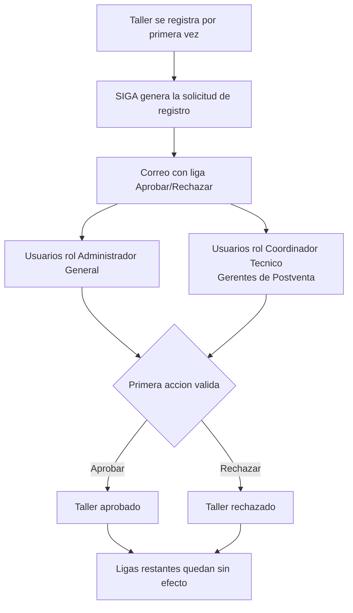

# PRD - Autorización de Talleres por parte de Coordinadores Técnicos (PV-04)

| **Campo** | **Detalle** |
| --- | --- |
| **Proyecto** | Autorización de Talleres por parte de Coordinadores Técnicos (PV-04) |
| **Área / empresa** | Garantiplus México — *alcance multi-país: aplica a todas las operaciones Garantiplus (México, Colombia, Chile)* |
| **Versión** | v0.1 |
| **Fecha** | 2026-08-12 |
| **Autores** | Alejandro Govea Hernández |
| **Revisión / liderazgo** | Alexis Salvador Herrera García (alexis.herrera@gplusseguros.mx) |
| **Tipo de proyecto** | Feature web o API |

## 1. Resumen ejecutivo

Este proyecto amplía el mecanismo de **autorización de registro de talleres** de SIGA para que los **Coordinadores Técnicos (Gerentes de Postventa)** participen en la aprobación, no solo los Administradores Generales. La petición proviene de **Operaciones Colombia**.

Hoy, cuando un taller se registra por primera vez, SIGA envía un correo —con una liga para **Aprobar o Rechazar** la solicitud— **únicamente a los usuarios con rol Administrador General**. Los Gerentes de Postventa, que son quienes conocen y operan la relación con los talleres, quedan fuera del circuito de aprobación y dependen de que un Administrador General actúe.

El **MVP** consiste en enviar ese mismo correo (con su liga de Aprobar/Rechazar) **también a todos los usuarios con rol Coordinador Técnico**, otorgándoles la misma capacidad de resolver la solicitud. La autorización se resuelve por **"primera acción decide"**: el primer usuario habilitado (AG o CT) que Apruebe o Rechace resuelve el registro. Aplica a todas las operaciones Garantiplus.

El resultado esperado es **descentralizar y agilizar** la aprobación de talleres, reduciendo el cuello de botella en Administradores Generales y dando control a Postventa.

**Taller se registra** → **SIGA envía correo con liga Aprobar/Rechazar a AG + Coordinadores Técnicos** → **primer usuario resuelve** → **taller aprobado/rechazado**

## 2. Contexto y problema

- **Proceso actual:** al registrarse un taller por primera vez, SIGA dispara un correo a **todos los usuarios con rol Administrador General**. Ese correo contiene una **liga que permite Aprobar o Rechazar** la solicitud de registro del taller.
- **Dolor concreto:** los **Coordinadores Técnicos / Gerentes de Postventa** no reciben ese aviso ni pueden autorizar el registro, pese a ser el rol operativamente responsable de los talleres. La aprobación depende exclusivamente de los Administradores Generales, lo que genera demoras y dependencia.
- **Por qué ahora:** solicitud expresa de **Operaciones Colombia** para que Postventa participe en la autorización.
- **Distinción de conceptos:** "**Coordinador Técnico**" es el **rol de SIGA** asignado a las personas cuyo **puesto** es **Gerente de Postventa** — se usan indistintamente en este PRD. Es un rol **ya existente** en SIGA.

## 3. Objetivo del producto

Permitir que los usuarios con rol **Coordinador Técnico** reciban el correo de solicitud de registro de taller y puedan **aprobar o rechazar** dicho registro con la misma capacidad que hoy tienen los Administradores Generales, resolviéndose por "primera acción decide", en todas las operaciones Garantiplus.

## 4. Usuarios y actores

| **Usuario / Actor** | **Rol en el proceso** |
| --- | --- |
| Coordinador Técnico (Gerente de Postventa) | Nuevo destinatario del correo; puede Aprobar/Rechazar el registro del taller. |
| Administrador General | Destinatario actual; conserva su capacidad de Aprobar/Rechazar. |
| Taller (solicitante) | Se registra por primera vez y dispara la solicitud de autorización. |
| Operaciones Colombia | Área solicitante/patrocinadora del cambio. |
| SIGA | Sistema que registra el taller, envía el correo y procesa la resolución. |

## 5. Alcance MVP y funcionalidades

| **Funcionalidad** | **Descripción** |
| --- | --- |
| Ampliar destinatarios del correo | Al registrarse un taller por primera vez, enviar el correo de solicitud (con liga Aprobar/Rechazar) también a **todos los usuarios con rol Coordinador Técnico**, además de los Administradores Generales. |
| Habilitar aprobación por Coordinador Técnico | La liga del correo permite a un Coordinador Técnico **Aprobar o Rechazar** la solicitud, con la misma lógica que el Administrador General. |
| Resolución "primera acción decide" | La primera acción válida (Aprobar o Rechazar) de cualquier usuario habilitado (AG o CT) resuelve la solicitud; las ligas restantes quedan sin efecto. |
| Cobertura multi-país | El comportamiento aplica a todas las operaciones Garantiplus (México, Colombia, Chile). |

**Principio rector del MVP:** reutilizar el mecanismo existente (mismo correo, misma liga, misma lógica de resolución) y **solo ampliar quién lo recibe y quién puede autorizar** — no rediseñar el flujo de aprobación de talleres.

## 6. Fuera de alcance

- **Filtrado del envío por país/distribuidor del taller:** en el MVP se envía a **todos** los Coordinadores Técnicos (igual que hoy con Administradores Generales); segmentar por operación/distribuidor queda fuera salvo que se decida lo contrario (ver Preguntas abiertas).
- **Rediseño del flujo de aprobación o de la pantalla Aprobar/Rechazar:** se reutiliza tal cual.
- **Nuevos roles o cambios de permisos más allá de habilitar a Coordinador Técnico** en este correo/acción.
- **Notificaciones in-app o por otros canales** (WhatsApp, push): el alcance es el correo existente.
- **Aprobación de modificaciones posteriores del taller** (el disparador es el **primer** registro).

## 7. Flujo principal (simplificado)

El único cambio respecto al flujo actual es la **ramificación adicional hacia los Coordinadores Técnicos** en el envío del correo y su inclusión como actores habilitados en la decisión. La resolución sigue siendo **única** (la primera acción cierra la solicitud).

## 8. Requerimientos funcionales

| **ID** | **Requerimiento** | **Descripción** |
| --- | --- | --- |
| RF-01 | Envío ampliado del correo | Al registrarse un taller por primera vez, el sistema envía el correo de solicitud (con liga Aprobar/Rechazar) a todos los usuarios con rol **Administrador General** y a todos los usuarios con rol **Coordinador Técnico**. |
| RF-02 | Aprobación por Coordinador Técnico | La liga permite a un usuario con rol Coordinador Técnico **Aprobar o Rechazar** el registro, con la misma capacidad que el Administrador General. |
| RF-03 | Resolución primera-acción | La primera acción válida (Aprobar/Rechazar) de cualquier usuario habilitado resuelve la solicitud; las acciones posteriores no surten efecto y reflejan que ya fue resuelta. |
| RF-04 | Alcance multi-país | El envío y la habilitación aplican a todas las operaciones Garantiplus (México, Colombia, Chile). |
| RF-05 | Trazabilidad de la resolución | El sistema registra qué usuario (identidad y rol) resolvió la solicitud, la acción tomada y la fecha/hora. |

## 9. Requerimientos no funcionales

| **ID** | **Requerimiento** | **Descripción** |
| --- | --- | --- |
| RNF-01 | Control de permisos | Solo usuarios con rol Administrador General o Coordinador Técnico pueden Aprobar/Rechazar; la liga no debe habilitar la acción a otros roles. |
| RNF-02 | Trazabilidad / auditabilidad | Queda registro de actor, rol, acción y timestamp de la resolución. |
| RNF-03 | Idempotencia / condición de carrera | Ante acciones casi simultáneas, solo la primera surte efecto; la segunda recibe un mensaje claro de "solicitud ya resuelta". |
| RNF-04 | Compatibilidad multi-país | Comportamiento consistente en las tres operaciones. |
| RNF-05 | Reutilización del canal de correo | Se usa el mismo mecanismo/plantilla de correo que hoy envía a los Administradores Generales. |

## 10. Integraciones y datos

| **Integración / Fuente** | **Uso esperado** |
| --- | --- |
| SIGA (módulo de registro/administración de talleres) | Detecta el primer registro del taller, consulta usuarios por rol, dispara el correo y procesa la resolución. |
| Servicio/proveedor de correo actual | Envío del correo con la liga Aprobar/Rechazar (mismo mecanismo vigente). |

**Datos mínimos:** usuarios y su(s) rol(es) (Administrador General, Coordinador Técnico); datos del taller (identificador, operación/país, distribuidor si aplica); estado de la solicitud (pendiente/aprobada/rechazada); actor que resolvió, acción y timestamp.

**Esquema de permisos:** *lectura* de la lista de usuarios por rol para armar destinatarios; *escritura* del estado de la solicitud (Aprobar/Rechazar) **restringida** a los roles Administrador General y Coordinador Técnico; ninguna otra identidad puede resolver la solicitud.

## 12. Métricas de éxito

| **Métrica** | **Descripción** |
| --- | --- |
| Participación de Coordinadores Técnicos | % de solicitudes de registro resueltas por Coordinadores Técnicos vs. Administradores Generales. |
| Tiempo de resolución | Tiempo promedio entre el registro del taller y su resolución (comparado antes/después). *Línea base y meta pendientes de validar con BI/operación.* |
| Cobertura del aviso | Nº de solicitudes en las que los Coordinadores Técnicos efectivamente reciben el correo. |

## 13. Riesgos y supuestos

### Riesgos

| **Riesgo** | **Impacto potencial** |
| --- | --- |
| Envío sin filtro por país/distribuidor | Un Coordinador Técnico podría recibir solicitudes de operaciones/distribuidores que no le corresponden → ruido en correo y posibles aprobaciones cruzadas. |
| Aprobación cruzada entre operaciones | Sin segmentación, un CT de un país podría resolver un taller de otro país. |
| Condición de carrera en "primera acción decide" | Si no hay bloqueo idempotente, dos usuarios podrían intentar resolver a la vez con resultado inconsistente. |
| Volumen de Coordinadores Técnicos | Muchos usuarios con el rol amplían el número de correos por cada registro. |

### Supuestos

| **Supuesto** | **Descripción** |
| --- | --- |
| Rol existente y poblado | El rol Coordinador Técnico ya existe en SIGA con usuarios asignados en las operaciones aplicables. |
| Reutilización directa | El correo actual a AG y su liga Aprobar/Rechazar son reutilizables tal cual para los Coordinadores Técnicos. |
| Lógica de resolución sin cambios | No se modifica la lógica de "primera acción decide"; solo se amplían destinatarios y habilitación. |

## 14. Preguntas abiertas

| **Tema** | **Pregunta abierta** |
| --- | --- |
| Enrutamiento | ¿Se mantiene el envío a **todos** los Coordinadores Técnicos, o conviene filtrar por país/distribuidor del taller para evitar ruido y aprobaciones cruzadas? |
| Cobertura de usuarios | ¿Existen ya usuarios con rol Coordinador Técnico cargados en México y Chile, o solo en Colombia? |
| Comportamiento de la liga | Tras la primera acción, ¿la liga restante caduca, se inutiliza o solo muestra "ya resuelta"? (confirmar comportamiento actual). |
| Métricas | Definir línea base y metas numéricas con BI/operación. |
