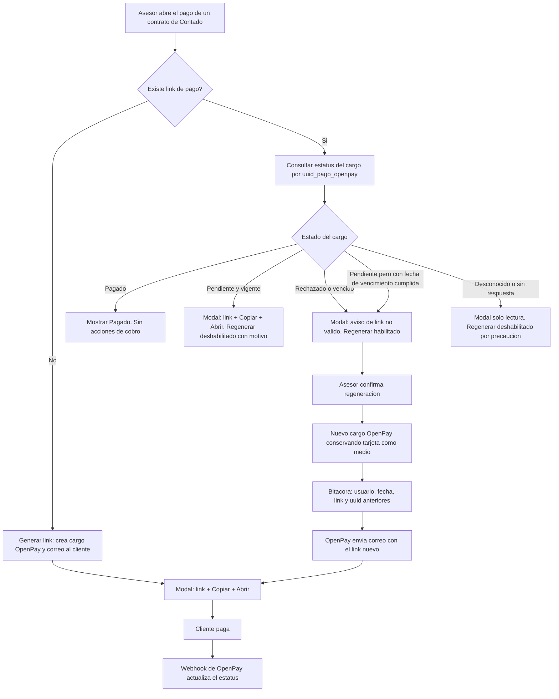

# PRD - BMW — Link de pago y blindaje de reintentos

| **Campo** | **Detalle** |
| --- | --- |
| **Proyecto** | BMW — Link de pago y blindaje de reintentos |
| **Área / empresa** | Garantiplus México |
| **Versión** | v0.2 |
| **Fecha** | 27 de julio de 2026 |
| **Autores** | Carlos Castellanos |
| **Revisión / liderazgo** | Por definir (ver sección 14) |
| **Tipo de proyecto** | Integración |

## 1. Resumen ejecutivo

La landing de registro de garantías BMW permite cobrar la garantía de contado con tarjeta a través de OpenPay. Hoy, una vez que el contrato tiene un link de pago guardado, la landing lo reabre tal cual cada vez que alguien presiona "Ir a pagar". El problema es que ese link no es permanente: detrás hay un **cargo de OpenPay de un solo uso**. Cuando el cargo muere —porque la tarjeta fue rechazada o porque venció— el link deja de servir y el asesor no tiene manera de generar uno nuevo desde la landing. El cliente queda atorado y la venta se detiene.

El mismo problema existe en SIGA, y ahí se resuelve peor: un asesor de Garantiplus entra **al dashboard de OpenPay** y genera el link a mano. Es trabajo manual fuera del sistema, sin trazabilidad y con acceso al panel de la pasarela.

El intento previo de resolverlo —generar un cargo nuevo en cada clic— se revirtió porque provocaba el problema opuesto: múltiples links vivos al mismo tiempo y, como OpenPay envía un correo al cliente por cada cargo, un buzón lleno de links distintos, varios de ellos pagables. Riesgo real de doble cobro.

El MVP entrega, en la landing BMW, un link de pago **confiable**: siempre el vigente, con su estado a la vista, copiable para compartir y abrible para pagar. Y regenerable **únicamente cuando el cargo anterior ya no es pagable** — que es la regla que hace imposible el doble cobro sin necesidad de cancelar nada en OpenPay. Las reglas se escriben de forma agnóstica del proyecto para que GarantiplusWeb pueda adoptarlas después.

Resultado esperado: ninguna venta de contado detenida por un link muerto, ningún acceso manual al dashboard de OpenPay, y cero cargos pagables duplicados.

**Contrato de contado** → **link vigente visible con su estado** → **copiar / abrir** → **si el cargo murió, regenerar con bitácora** → **cliente paga y el webhook confirma**

## 2. Contexto y problema

**Cómo funciona hoy.** Al crear un contrato de contado en la landing, el asesor puede generar un link de pago. Esa llamada crea un cargo en OpenPay con un `uuid` nuevo, guarda el link en `contrato.link_pago_pasarela`, sobrescribe `contrato.uuid_pago_openpay`, y OpenPay envía por su cuenta un correo al beneficiario con el link (bandera `SendEmail`). El cargo nace con vencimiento a `distribuidor.dias_pago` días; como los 48 distribuidores BMW tienen ese valor en 0, aplica el default `Facturas:Dias_Vencimiento` = **31 días**. A partir de ahí, la landing muestra "Ir a pagar (tarjeta)" y **reabre el link guardado sin verificar si sigue vivo**.

**El dolor concreto.** Un cargo de OpenPay es de un solo uso. Si el cliente intenta pagar y la tarjeta se rechaza, el cargo queda muerto: reabrir su URL responde siempre "Transacción denegada". La landing no lo sabe y sigue ofreciendo el mismo link. El asesor no tiene botón para generar otro, así que la venta se detiene frente al cliente. Ocurrió en una demo real en producción (contrato 796211).

**El dolor equivalente en SIGA.** Cuando pasa lo mismo en un contrato gestionado desde SIGA, la salida es que un asesor de Garantiplus entre al dashboard de OpenPay y cree el link manualmente. SIGA tiene el código de regeneración escrito pero **deshabilitado**: `ViewBag.regeneracionLinkPago = false`, con el comentario de que no se permite "hasta que se defina el tema de comisiones ya que esto implicaría cambiar el precio del contrato".

**Precisión sobre ese bloqueo.** La única evidencia de esa decisión es **el propio comentario en el código**: no se ha localizado ticket, acuerdo ni documento que lo respalde. El `git blame` no ayuda a rastrearlo porque la línea entró en el commit de importación masiva al monorepo (`1641709`, 13-may-2026), de modo que su autor y fecha originales se perdieron. Debe tratarse como una restricción **heredada y no verificada**: antes de darla por vigente en la Fase 3, hay que confirmarla con Comercial o Finanzas.

**Por qué ahora.** El disparador es el incidente en producción. No es un problema de volumen sino de riesgo: reputacional frente al cliente y de doble cobro si se resuelve mal, como demostró el intento revertido.

**Distinciones de dominio que el equipo debe tener claras desde el día 1:**

- **Link de pago**: la URL que se comparte y que el sistema persiste en el contrato. Se percibe como estable.
- **Cargo (charge) de OpenPay**: el objeto real detrás del link, identificado por `uuid_pago_openpay`. Es de **un solo uso** y tiene vencimiento. Cada regeneración crea un cargo nuevo, no "renueva" el anterior.
- **Orden de pago (ODP)**: el otro medio de contado, una referencia bancaria. No interviene en este proyecto.
- **Cargo pagable vs. muerto**: pagable es el que sigue vigente y sin intento previo; muerto es el rechazado, el vencido o el ya pagado. Toda la lógica de blindaje se apoya en esta distinción.

## 3. Objetivo del producto

Dar al asesor del distribuidor y al cliente final un link de pago confiable —siempre el vigente, con su estado a la vista, copiable y compartible— y garantizar que **nunca exista más de un cargo pagable por contrato**, eliminando tanto el bloqueo de ventas por links muertos como el riesgo de doble cobro.

El objetivo secundario, y explícito, es que las reglas de negocio queden escritas de forma independiente del proyecto, de modo que GarantiplusWeb pueda implementar el mismo comportamiento sin rediseñarlo y sin que sus asesores tengan que volver a entrar al dashboard de OpenPay.

### 3.1 Estrategia de implementación por fases

| **Fase** | **Nombre** | **Descripción** |
| --- | --- | --- |
| Fase 1 | Link confiable en la landing BMW (**MVP de este PRD**) | Link persistente con estado visible, copiar, abrir y regenerar condicionado a que el cargo no sea pagable. Con bitácora. Sin cambios en `gp_4.0_siga`, OpenpayGP ni base de datos. |
| Fase 2 | Cancelación del cargo en OpenPay | Cancelar explícitamente el cargo anterior antes de crear el nuevo, para cubrir el reemplazo de cargos **vivos**. **La capacidad ya existe**: OpenpayGP expone `CancellationController`, que invoca `CancelByMerchant` del SDK de OpenPay y marca el pago como Cancelado; además `op_charge_id` se guarda al crear el cargo, no lo aporta el webhook, así que la cancelación funciona aunque el webhook nunca haya llegado. El trabajo es cablearla desde el flujo de regeneración y desplegar OpenpayGP, no construirla. Condicionada a los disparadores de la sección 13. Si se ejecuta, debe quedar consumible también por GarantiplusWeb. |
| Fase 3 | Adopción en SIGA (GarantiplusWeb) | Llevar el mismo comportamiento al detalle de contrato de SIGA, para que los asesores de Garantiplus dejen de usar el dashboard de OpenPay. Requiere encender `renovacion_link_pago`, agregar el candado por estatus y resolver el tema de comisiones. |

**El MVP de este PRD es la Fase 1.** Las fases 2 y 3 se documentan para dejar el camino trazado; no se implementan aquí.

## 4. Usuarios y actores

| **Usuario / Actor** | **Rol en el proceso** |
| --- | --- |
| Asesor del distribuidor BMW | Opera la landing, consulta el estado del pago, comparte el link con el cliente y regenera cuando el cargo murió. Es el único perfil que regenera en el MVP. |
| Cliente final / beneficiario | Recibe el correo de OpenPay con el link y paga con tarjeta. Puede recibirlo también por WhatsApp o correo del asesor. |
| Asesor de Garantiplus | Hoy resuelve los links muertos entrando al dashboard de OpenPay; con la Fase 3 dejará de hacerlo. En el MVP no interviene. |
| OpenPay | Crea el cargo, envía el correo al cliente, procesa el pago y notifica el resultado por webhook. |
| TI / Desarrollo | Implementa y opera la solución; consulta la bitácora ante aclaraciones de cobro. |
| Comercial / Finanzas | Dueños de la decisión sobre comisiones que hoy bloquea la regeneración en SIGA (relevante para la Fase 3). |

## 5. Alcance MVP y funcionalidades

| **Funcionalidad** | **Descripción** |
| --- | --- |
| Ver el link vigente | Al abrir el modal de pago de un contrato de contado, se muestra el link ya existente. Abrir el modal **no** genera un cargo nuevo. |
| Estado del cargo visible | Al abrir el modal se consulta el estatus del cargo y se muestra en lenguaje claro: pendiente de pago, rechazado, vencido o pagado. Es lo que determina qué acciones se habilitan. |
| Copiar el link | Copia la URL completa al portapapeles con confirmación visual, para compartirla por WhatsApp o correo. |
| Abrir / Ir a pagar | Abre el link en una pestaña nueva para pagar en el momento. |
| Regenerar (condicionado) | Crea un cargo nuevo **solo si el actual ya no es pagable**. Conserva el mismo medio de pago (tarjeta) y dispara el correo de OpenPay con el link nuevo. |
| Bloqueo con motivo | Si el cargo sigue vigente, la acción de regenerar se muestra deshabilitada con la razón visible: el link sigue sirviendo, hay que compartirlo, no reemplazarlo. |
| Bitácora de regeneración | Cada regeneración registra en `contrato.bitacora` quién, cuándo, y el link y `uuid` anteriores. |
| Fin de la reapertura ciega | Se elimina el comportamiento actual de reabrir `link_pago_pasarela` sin verificar su estado. |

**Principio rector del MVP:** nunca puede existir más de un cargo pagable por contrato. Toda decisión de diseño se subordina a esa regla; ante cualquier duda sobre el estado del cargo, el sistema **no** habilita la regeneración. El MVP tampoco toma decisiones sobre el dinero ya cobrado: no cancela, no reembolsa y no altera precios.

## 6. Fuera de alcance

- **Cancelar el cargo anterior en OpenPay**: es la Fase 2. Innecesario en el MVP porque un cargo muerto no requiere cancelación y uno vivo no se puede reemplazar. Lo habilitarían los disparadores de la sección 13.
- **Modificar GarantiplusWeb / SIGA**: solo se documentan las reglas y lo que le faltaría. Lo habilitaría la resolución del tema de comisiones y una decisión de prioridad.
- **El flujo de orden de pago (ODP)**: es el otro medio de contado y no sufre este problema; mezclarlo ampliaría el riesgo sin beneficio.
- **Enganche y Financiado**: no usan pasarela, se gestionan internamente.
- **Cambiar la vigencia de 31 días** (`dias_pago` por distribuidor o `Facturas:Dias_Vencimiento`): el valor se comparte con facturación y tocarlo tiene efectos fuera de este alcance. Lo habilitaría un análisis de impacto propio.
- **Correo propio de Garantiplus con el link**: se sigue usando el de OpenPay. Lo habilitaría la necesidad de control de marca o contenido sobre ese correo.
- **MSI y SPEI**: ya descartados para BMW; el medio es siempre tarjeta.
- **Reembolsos o cancelación de pagos ya cobrados**: es otro dominio, con implicaciones contables y fiscales.
- **Mostrar el estado del pago en el listado de contratos**: requeriría un endpoint por lote; el estado se consulta al abrir el modal, que es donde se necesita para decidir.

## 7. Flujos principales

El flujo se articula alrededor de una sola decisión: **el estado del cargo**. Todo lo que el asesor puede hacer se deriva de ahí, y por eso la consulta de estatus ocurre al abrir el modal y no antes. Esto invierte el comportamiento actual, donde la landing ofrece "Ir a pagar" sin saber si el link sirve.

La rama de estado desconocido es deliberadamente conservadora: si el estatus no se puede determinar —la consulta falla, o el webhook de OpenPay no llegó y el cargo aparece como pendiente sin serlo— el sistema **no** habilita la regeneración. Es preferible un bloqueo temporal, que el asesor puede escalar, a la posibilidad de dejar dos cargos pagables. Esta decisión tiene un costo conocido, registrado como riesgo en la sección 13.

La rama de vencimiento cumplido es la válvula de escape de esa postura conservadora: la fecha de vencimiento del cargo es un dato **local**, que no depende de que el webhook llegue. Si ya pasó, el cargo está muerto por definición y la regeneración se habilita aunque el estatus almacenado siga diciendo "pendiente". Esto acota el bloqueo falso a la ventana anterior al vencimiento.

## 8. Requerimientos funcionales

| **ID** | **Requerimiento** | **Descripción** |
| --- | --- | --- |
| RF-01 | Mostrar el link vigente | Al abrir el modal de pago se muestra el link almacenado en el contrato, sin crear un cargo nuevo. |
| RF-02 | Consultar el estado del cargo | Al abrir el modal se consulta el estatus del cargo asociado al `uuid_pago_openpay` del contrato. |
| RF-03 | Traducir el estado a lenguaje claro | El estado se presenta al asesor como pendiente de pago, rechazado, vencido o pagado, en español. |
| RF-04 | Copiar el link | Acción que copia la URL completa al portapapeles y confirma visualmente el copiado. |
| RF-05 | Abrir el link | Acción que abre la URL en una pestaña nueva, sin conservar referencia a la ventana de origen. |
| RF-06 | Habilitar la regeneración solo con cargo no pagable | La acción de regenerar se habilita únicamente si el estado es rechazado, vencido o no existe cargo previo. |
| RF-07 | Bloquear la regeneración con motivo visible | Si el cargo está vigente, la acción se muestra deshabilitada indicando que el link sigue siendo válido y debe compartirse. |
| RF-08 | Bloquear la regeneración ante estado indeterminado | Si el estatus no se puede obtener, la acción queda deshabilitada. |
| RF-09 | Conservar el medio de pago al regenerar | El cargo nuevo se crea siempre con tarjeta; no se alterna el medio de pago como hace SIGA. |
| RF-10 | Registrar la regeneración | Cada regeneración escribe en `contrato.bitacora` el usuario, la fecha y hora, y el link y `uuid` anteriores. |
| RF-11 | Advertir sobre los links anteriores | Al regenerar se informa al asesor que los links enviados previamente dejan de ser válidos, para que se lo comunique al cliente. |
| RF-12 | Eliminar la reapertura ciega | Se retira el comportamiento que abre `link_pago_pasarela` sin verificar su estado. |
| RF-13 | No ofrecer cobro sobre contratos pagados | Si el contrato ya está pagado, no se muestran acciones de cobro. |
| RF-14 | Evitar generaciones duplicadas por doble clic | La acción de generar o regenerar se bloquea mientras haya una solicitud en curso. |
| RF-15 | Desbloquear por vencimiento cumplido | Si la fecha de vencimiento del cargo ya pasó, la regeneración se habilita aunque el estatus almacenado siga indicando pendiente, por ser un dato local independiente del webhook. |

## 9. Requerimientos no funcionales

| **ID** | **Requerimiento** | **Descripción** |
| --- | --- | --- |
| RNF-01 | Control de acceso por distribuidor | El link y su estado solo son visibles y operables por usuarios con acceso al contrato, respetando el alcance por distribuidor vigente en la landing. |
| RNF-02 | Trazabilidad de regeneraciones | Toda regeneración queda auditable con usuario, momento y valores anteriores, suficiente para reconstruir el caso ante una aclaración de cobro. |
| RNF-03 | Mensajes de error en español | Todo mensaje visible al usuario va en español; los logs técnicos en inglés. |
| RNF-04 | Degradación elegante | Si la consulta de estatus o la generación fallan, la interfaz lo comunica y conserva las acciones seguras (ver y copiar el link) sin habilitar las riesgosas. |
| RNF-05 | Disponibilidad | El cobro debe funcionar en el horario operativo de las agencias; una caída de la pasarela no debe impedir consultar y copiar el link existente. |
| RNF-06 | Reglas agnósticas del proyecto | Las reglas de negocio (cuándo se puede regenerar, qué se audita, qué se muestra) se documentan sin dependencias de BMW, para que GarantiplusWeb las adopte sin rediseño. |
| RNF-07 | Compatibilidad de navegador | El copiado al portapapeles debe funcionar en los navegadores usados en las agencias, con alternativa si la API de portapapeles no está disponible. |
| RNF-08 | Privacidad | El link no se expone fuera del alcance del usuario y no se registran datos personales del cliente en los logs. |
| RNF-09 | Observabilidad | Las generaciones y regeneraciones se registran conforme a las reglas de auditoría vigentes de SIGA. |
| RNF-10 | Sin cambios de esquema | La solución opera sobre columnas existentes de `contrato`; no requiere migraciones de base de datos. |

## 10. Integraciones y datos

| **Integración / Fuente** | **Uso esperado** |
| --- | --- |
| OpenPay | Creación del cargo, envío del correo al cliente, procesamiento del pago y notificación del resultado por webhook. No se invoca directamente desde la landing. |
| API de SIGA — Contratos (`gp_3.0_siga_api`) | Generación del link de pago, consulta del estatus del pago y listado de contratos con su link asociado. Autenticada con el JWT de la landing. |
| `gp_4.0_siga` — PaisesService | Contiene la lógica de creación del cargo en OpenPay. Se consume tal cual; **no se modifica** en el MVP. |
| Webhook de OpenPay | Escribe el resultado del cargo en `pago_pasarela` por referencia; es la fuente del estatus que consulta la landing. |
| Base de datos SIGA | Lectura y escritura sobre `contrato` (`link_pago_pasarela`, `uuid_pago_openpay`, `renovacion_link_pago`, `bitacora`); lectura de `pago_pasarela` y `poliza`. |

**Datos mínimos para operar:** identificador del contrato; `uuid` del cargo vigente; URL del link de pago; estado del pago y su motivo de rechazo si aplica; fecha de vencimiento del cargo; identidad del usuario que regenera y momento de la regeneración; link y `uuid` anteriores.

**Esquema de permisos.** El asesor del distribuidor puede **leer** el link y el estado de los contratos dentro de su alcance, y puede **escribir** únicamente a través de la regeneración, que además está condicionada por el estado del cargo. Queda **bloqueado** sin excepción: cancelar cargos, reembolsar, alterar montos o vigencias, y cualquier operación sobre contratos fuera de su distribuidor. El acceso al dashboard de OpenPay deja de ser necesario para la operación y no se otorga a perfiles de distribuidor.

## 12. Métricas de éxito

| **Métrica** | **Descripción** |
| --- | --- |
| Cargos pagables duplicados | Número de contratos con más de un cargo vigente simultáneo. Meta: cero. No requiere línea base. |
| Accesos al dashboard de OpenPay para generar links | Veces que un asesor de Garantiplus entra al panel de OpenPay a crear un link de BMW. Meta: cero tras el MVP. |
| Ventas de contado detenidas por link muerto | Casos reportados en que el cobro no pudo completarse por un link inservible. Meta: cero. Línea base pendiente de validar con operación. |
| Contratos de contado que completan pago sin intervención manual | Porcentaje sobre el total de contado. Línea base y meta pendientes de validar con BI. |
| Regeneraciones por contrato | Promedio de veces que se regenera el link. Sirve para detectar si el problema real es otro (por ejemplo, rechazos recurrentes de tarjeta). Línea base pendiente. |
| Tiempo entre rechazo y link nuevo disponible | Cuánto tarda el asesor en dejar al cliente en condiciones de reintentar. Línea base pendiente. |

## 13. Riesgos y supuestos

### Riesgos

| **Riesgo** | **Impacto potencial** |
| --- | --- |
| Que un cargo rechazado sí pueda volver a pagarse | Derrumba la premisa del MVP: podrían coexistir dos cargos pagables y ocurrir un doble cobro. **Disparador de la Fase 2.** |
| Webhook de OpenPay no recibido | El cargo aparece como pendiente sin serlo, el sistema bloquea la regeneración y el asesor vuelve a quedar atorado — el fallo opuesto al actual. Ocurrió en producción por un **certificado SSL vencido** en el proxy que recibe el webhook (ya resuelto). Mitigado parcialmente por RF-15; procedimiento de respuesta descrito abajo. |
| Correos antiguos con links muertos en el buzón del cliente | El cliente paga o intenta pagar desde el correo equivocado, genera confusión y llamadas a soporte, aunque la landing muestre el link correcto. |
| Regresión en zona de pagos | Un error en este flujo impide cobrar contratos de contado y detiene ventas. Mitigación: validación en QA con Carlos presente antes de producción. |
| Cambio de comportamiento de OpenPay | Si la pasarela modifica la semántica de sus estados o el envío de correos, las reglas del blindaje pierden validez. |
| Vigencia de 31 días percibida como excesiva | Un link vivo un mes amplía la ventana en que un cargo puede pagarse tarde; ajustarlo toca un valor compartido con facturación. |
| Bloqueo por comisiones en la Fase 3 | Si la hipótesis sobre el cambio de medio de pago no se sostiene, SIGA seguirá sin poder regenerar y sus asesores continuarán usando el dashboard de OpenPay. Agravante: la restricción solo consta en un comentario de código heredado, sin dueño identificable a quién consultarla. |

### Procedimiento ante un webhook que deja de llegar

Aplica a cualquier interrupción en la recepción de webhooks de OpenPay, no solo a este proyecto.

1. **Detección.** El síntoma es que `pago_pasarela.op_fecha_actualizacion_estatus` deja de moverse: cargos que permanecen en "Registrado" pese a haberse pagado. Una consulta de cargos sin actualización en las últimas horas lo evidencia; el dashboard de OpenPay muestra además los intentos de entrega fallidos.
2. **Diagnóstico.** Verificar primero el certificado del endpoint que recibe el webhook (`openssl s_client` con revisión de fechas), que fue la causa del incidente de producción. Descartado eso, revisar cambios de URL, reglas de firewall y disponibilidad del proxy.
3. **Recuperación.** OpenPay reintenta la entrega durante un periodo limitado; los eventos perdidos fuera de esa ventana **no se recuperan solos** y hoy deben reconciliarse manualmente contra el dashboard. La solución que lo automatizaría es agregar en OpenpayGP un método de **consulta de cargo** (hermano del de cancelación, mismo SDK ya instanciado), que permita sincronizar por lote los cargos pendientes contra OpenPay y dejar de depender de la entrega del webhook. No forma parte de este MVP.
4. **Prevención.** Renovación automática del certificado con alerta previa al vencimiento, y alerta por ausencia de webhooks durante un periodo definido.

### Supuestos

| **Supuesto** | **Descripción** |
| --- | --- |
| Un cargo rechazado o vencido no vuelve a ser pagable | Base de todo el blindaje. Evidencia: el comportamiento observado en producción y el estatus que escribe el webhook. **Debe validarse explícitamente en QA** intentando pagar dos veces un cargo rechazado. |
| BMW opera siempre con tarjeta | No hay cambio de medio de pago al regenerar y por lo tanto no cambia la comisión ni el precio del contrato; el bloqueo que frena a SIGA no aplica aquí. |
| El correo del link lo envía OpenPay | Verificado en el código: no existe envío propio de Garantiplus con el link. Regenerar dispara un correo nuevo automáticamente. |
| La vigencia efectiva es de 31 días | Los 48 distribuidores BMW tienen `dias_pago` en 0, por lo que aplica el default. Verificado en configuración local; **falta confirmar el valor en producción**. |
| No se requieren cambios de base de datos | Las columnas necesarias ya existen en `contrato`. |
| El alcance por distribuidor vigente es suficiente | El control de acceso actual de la landing cubre la protección del link sin trabajo adicional. |

## 14. Preguntas abiertas

| **Tema** | **Pregunta abierta** |
| --- | --- |
| Gobierno del PRD | ¿Quién firma la revisión y liderazgo de este documento? |
| Supuesto crítico | ¿Confirma la prueba en QA que un cargo rechazado no puede volver a pagarse? De no ser así, la Fase 2 pasa de opcional a obligatoria. |
| Webhook no recibido | Resuelto en v0.2: el desbloqueo por vencimiento cumplido (RF-15) acota el bloqueo falso, y el procedimiento de respuesta queda en la sección 13. Pendiente menor: ¿se prioriza en algún momento el método de consulta de cargo en OpenpayGP que automatizaría la reconciliación? |
| Configuración de producción | ¿`Facturas:Dias_Vencimiento` en producción es 31, igual que en local? |
| Vigencia del link | ¿Un mes es la vigencia deseada para un link de pago de BMW, o conviene acortarla en un análisis aparte? |
| Fase 3 — comisiones | La restricción solo consta en un comentario de código heredado del monorepo, sin autor rastreable ni documento que la respalde. ¿Sigue vigente? ¿Se confirma que proviene de alternar el medio de pago al regenerar? ¿Quién de Comercial o Finanzas la resuelve? |
| Fase 3 — prioridad | ¿Cuándo se aborda la adopción en GarantiplusWeb y quién la patrocina? |
| Métricas | ¿Puede BI u operación aportar línea base de volumen de contado y de links que mueren? |
| Correos previos | ¿Se necesita alguna comunicación al cliente cuando sus links anteriores dejan de servir, más allá del aviso al asesor? |
