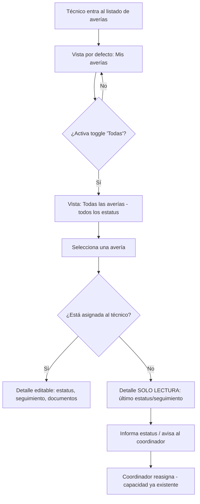

# PRD - PV-02: Visualización de todas las averías para técnicos y coordinadores técnicos

| **Campo** | **Detalle** |
| --- | --- |
| **Proyecto** | PV-02 — Visualización de todas las averías para técnicos y coordinadores técnicos |
| **Área / empresa** | EngineCX (alcance operativo: SIGA, todos los países) |
| **Versión** | v0.1 |
| **Fecha** | 2026-08-12 |
| **Autores** | Alejandro Govea Hernández (alejandro.govea@garantiplus.mx) |
| **Revisión / liderazgo** | Alexis Salvador Herrera García (alexis.herrera@gplusseguros.mx) |
| **Tipo de proyecto** | Feature web/API |

## 1. Resumen ejecutivo

PV-02 habilita en el **módulo de averías de SIGA** que los **técnicos** puedan **consultar todas las averías**, sin importar a quién estén asignadas, conservando la regla de que **solo modifican las suyas**. Hoy cada técnico ve únicamente sus averías asignadas, lo que deja casos sin atención cuando el técnico responsable se ausenta o deja la empresa.

El problema concreto es la **falta de continuidad operativa**: existen averías asignadas a personas que ya no laboran en la empresa y que resultan **invisibles** para los técnicos actuales; y cuando un técnico se ausenta, sus casos quedan "huérfanos" porque nadie más puede ver su estatus ni informarlo.

El **MVP** agrega al listado de averías un control tipo **toggle "Mis averías / Todas"**: por defecto el técnico sigue viendo solo las suyas, y al activarlo ve **todas las averías (de cualquier estatus)** en **modo solo lectura** sobre las ajenas. La **reasignación** y la **visibilidad global del coordinador técnico** ya existen hoy, por lo que **no requieren desarrollo**; el foco del entregable es la vista global de solo lectura para técnicos.

El resultado esperado es que **ningún caso quede sin seguimiento** por ausencia o baja de personal: cualquier técnico puede consultar el último estatus para informar, y el coordinador —con la visibilidad y reasignación que ya tiene— puede pasar el caso a otro técnico que lo continúe.

**Técnico entra al listado** → **activa "Todas"** → **consulta cualquier avería (solo lectura)** → **informa estatus / coordinador reasigna** → **continuidad de la gestión**

## 2. Contexto y problema

- **Hoy:** en el listado de averías de SIGA, el técnico ve **solo las averías asignadas a él**. No existe forma de que consulte las de otros técnicos. El coordinador técnico, en cambio, **ya ve todas** y **ya puede reasignar**.
- **Dolor:** cuando un técnico se **ausenta** o **deja la empresa**, sus averías quedan sin visibilidad para los demás; nadie puede consultar su estatus para informar. Además existen averías **asignadas a personal dado de baja** que ningún técnico activo puede ver.
- **Por qué ahora:** garantizar **continuidad operativa** en la gestión de averías, evitando que casos queden desatendidos por rotación o ausencias de personal.
- **Distinción de dominio clave:** hay que separar **"consultar"** (ver el detalle y el último estatus, solo lectura) de **"gestionar/dar seguimiento"** (editar estatus, subir documentos, agregar seguimiento). El cambio de este PRD amplía **solo la consulta**; la gestión sigue restringida al técnico asignado.

## 3. Objetivo del producto

Permitir que un **técnico** consulte, desde el listado de averías de SIGA, **todas las averías** de su ámbito (independientemente del asignado y de su estatus) en **modo solo lectura**, manteniendo intacta la regla de que **solo puede modificar/gestionar las averías asignadas a él**. Con ello se busca eliminar los casos "huérfanos" por ausencia o baja de personal y sostener la continuidad del seguimiento, apoyándose en la reasignación y visibilidad global que el coordinador técnico ya posee.

## 4. Usuarios y actores

| **Usuario / Actor** | **Rol en el proceso** |
| --- | --- |
| Técnico | Gestiona las averías asignadas a él. Con este cambio, además **consulta (solo lectura)** todas las demás averías para conocer su estatus. |
| Coordinador técnico | Ya cuenta con visibilidad global y capacidad de **reasignar** averías a otro técnico. **Sin cambios** en este desarrollo; se documenta como capacidad existente. |
| TI / Desarrollo (indirecto) | Implementa el control de visibilidad y **asegura la restricción de escritura en backend**. |

## 5. Alcance MVP y funcionalidades

| **Funcionalidad** | **Descripción** |
| --- | --- |
| Vista por defecto "Mis averías" | El listado sigue mostrando por defecto **solo las averías asignadas** al técnico (comportamiento actual, sin cambios). |
| Toggle "Mis averías / Todas" | Control en el listado que permite al técnico **alternar** entre solo las suyas (default) y **todas** las averías. |
| Vista "Todas" (todos los estatus) | Muestra las averías de todos los técnicos **sin importar el estatus** (abiertas, en gestión, cerradas, canceladas). |
| Consulta solo lectura de averías ajenas | Sobre una avería no asignada, el técnico abre el **detalle en solo lectura** y ve el **último estatus/seguimiento**. |
| Identificación del asignado | En la vista "Todas", cada avería indica **a qué técnico está asignada** (para saber a quién pertenece / a quién contactar). |
| Gestión intacta de averías propias | Sobre sus averías asignadas, el técnico conserva **todas** las capacidades de edición/seguimiento actuales, se acceda desde "Mis averías" o desde "Todas". |
| Bloqueo de escritura sobre ajenas | El sistema **impide editar, cambiar estatus, subir documentos o agregar seguimiento** en averías no asignadas al técnico. |

**Principio rector del MVP:** ampliar **solo la visibilidad** (consulta) sin relajar la seguridad de gestión — un técnico **nunca** puede modificar una avería que no tiene asignada; la restricción se garantiza en el backend, no solo ocultando botones.

## 6. Fuera de alcance

- **Cambios para el coordinador técnico**: su visibilidad global y su reasignación ya existen; no se construyen ni modifican aquí.
- **Reasignación por parte del técnico**: el técnico no reasigna averías (eso lo hace el coordinador); habilitarlo requeriría revisar reglas de negocio de asignación.
- **Trazabilidad/auditoría de consultas**: no se registrará quién consultó qué avería ajena en el MVP; se puede evaluar después si se requiere auditoría.
- **Acciones sobre averías ajenas más allá de leer**: ninguna acción de escritura/seguimiento sobre averías no asignadas, por seguridad de gestión.
- **Nuevos reportes/exportaciones**: el alcance es el listado y el detalle de solo lectura, no nuevos reportes de BI.

## 7. Flujos principales

Flujo del técnico en el listado de averías con el nuevo toggle y la bifurcación de permisos (editable vs. solo lectura) según la asignación:

El flujo prioriza no cambiar el comportamiento por defecto (el técnico sigue viendo lo suyo) y hace explícita la **decisión de permiso**: la única puerta a la edición es que la avería esté asignada al técnico; en cualquier otro caso, la ruta termina en **solo lectura**.

## 8. Requerimientos funcionales

| **ID** | **Requerimiento** | **Descripción** |
| --- | --- | --- |
| RF-01 | Vista por defecto sin cambios | Al abrir el listado, el técnico ve por defecto solo las averías asignadas a él. |
| RF-02 | Alternar a "Todas" | El listado ofrece un toggle "Mis averías / Todas" que alterna a la vista de todas las averías. |
| RF-03 | Todas las averías, todos los estatus | La vista "Todas" incluye averías de todos los técnicos sin importar el estatus. |
| RF-04 | Detalle en solo lectura de ajenas | Sobre una avería no asignada, el técnico abre el detalle en solo lectura y ve el último estatus/seguimiento. |
| RF-05 | Bloqueo de escritura en backend | El backend/API impide editar, cambiar estatus, subir documentos o agregar seguimiento sobre averías no asignadas al técnico. |
| RF-06 | Gestión intacta de propias | El técnico conserva todas sus capacidades de edición/seguimiento sobre sus averías asignadas, desde cualquiera de las dos vistas. |
| RF-07 | Técnico asignado visible | La vista "Todas" muestra el técnico asignado de cada avería. |
| RF-08 | Coordinador sin cambios | La visibilidad global y la reasignación del coordinador técnico se mantienen como están (sin regresión). |

## 9. Requerimientos no funcionales

| **ID** | **Requerimiento** | **Descripción** |
| --- | --- | --- |
| RNF-01 | Seguridad de permisos | La restricción de escritura sobre averías ajenas se valida en el **backend/API**, no solo ocultando controles en la UI. |
| RNF-02 | Consistencia de datos | La vista "Todas" refleja el estatus en tiempo real, desde el mismo origen de datos que el listado actual. |
| RNF-03 | Rendimiento | La vista "Todas" debe **paginar/filtrar** para no degradar el listado al traer el universo de averías. |
| RNF-04 | Experiencia de usuario | Debe distinguirse visualmente cuándo una avería es de solo lectura (ajena) frente a una editable (propia). |
| RNF-05 | Compatibilidad multi-país | El comportamiento aplica a SIGA en **todos los países**, respetando el modelo de averías de cada hub. |
| RNF-06 | Mantenibilidad | Reutilizar el listado de averías existente (agregar el toggle), sin crear un módulo paralelo. |

## 10. Integraciones y datos

| **Integración / Fuente** | **Uso esperado** |
| --- | --- |
| SIGA — módulo de averías | Lectura del universo de averías para la vista "Todas"; escritura **solo** sobre las asignadas (lógica actual sin cambios). |
| Base de datos (PostgreSQL / RDS) | Consulta de averías, su estatus y su técnico asignado. |
| Modelo de roles/permisos de SIGA | Distinguir técnico vs. coordinador y aplicar el filtro por asignación para la regla de escritura. |

**Datos mínimos:** folio/ID de avería, estatus, técnico asignado (id/nombre), fechas relevantes, último seguimiento/estatus, país/hub.

**Esquema de permisos:** el **técnico** lee todas las averías de su ámbito y escribe **solo** en las asignadas; el **coordinador técnico** lee todas y reasigna (capacidad actual). Ninguna escritura/seguimiento se permite sobre una avería sin la asignación correspondiente; el bloqueo se aplica del lado del servidor.

## 11. Métricas de éxito

| **Métrica** | **Descripción** |
| --- | --- |
| Averías huérfanas identificadas | # de averías asignadas a personal de baja/ausente que se ubican y retoman gracias a la vista "Todas". *(Línea base a validar con operación.)* |
| Casos sin seguimiento por ausencia | Reducción de averías sin actualización de estatus atribuibles a ausencia/baja del técnico. *(A validar con BI/operación.)* |
| Tiempo hasta continuidad | Tiempo entre la ausencia/baja del técnico y la reasignación/continuación de la gestión. *(A validar con operación.)* |
| Adopción | % de técnicos que usan la vista "Todas". *(A validar con BI.)* |

## 12. Riesgos y supuestos

### Riesgos

| **Riesgo** | **Impacto potencial** |
| --- | --- |
| Restricción de escritura solo en UI | Un técnico podría editar averías ajenas si el bloqueo no se aplica en backend. |
| Volumen de averías en "Todas" | Degradación del listado si no hay paginación/filtro adecuados. |
| Confusión mías vs. ajenas | Intentos de edición sobre ajenas o errores de gestión si falta distinción visual clara. |
| Diferencias entre países/hubs | El modelo de averías o de asignación podría variar entre países de SIGA y romper el comportamiento uniforme. |

### Supuestos

| **Supuesto** | **Descripción** |
| --- | --- |
| Coordinador ya habilitado | El coordinador técnico ya ve todas las averías y ya reasigna; no requiere desarrollo. |
| Vínculo avería→técnico | Existe en datos la asignación avería→técnico para aplicar la regla de escritura. |
| Reasignación operativa | La reasignación existente permite mover una avería a un técnico activo para continuar la gestión. |
| Listado reutilizable | El listado de averías actual es reutilizable para incorporar el toggle "Todas". |
| Ámbito por país | "Todas" se entiende como todas las averías del **ámbito/país** del técnico, no cross-país (a validar). |

## 13. Preguntas abiertas

| **Tema** | **Pregunta abierta** |
| --- | --- |
| Alcance multi-país | ¿"Todas" son las averías del país/hub del técnico, o realmente todas cross-país? |
| Filtros/búsqueda | ¿La vista "Todas" requiere filtros/búsqueda adicionales (por técnico asignado, folio, estatus)? |
| Detalle de solo lectura | ¿Qué campos exactos se muestran (o se ocultan) en el detalle de solo lectura de una avería ajena? |
| Auditoría futura | ¿Se requerirá más adelante trazabilidad de quién consulta averías ajenas? |
| Patrocinador | ¿Quién es el solicitante/patrocinador formal del requerimiento PV-02? |
